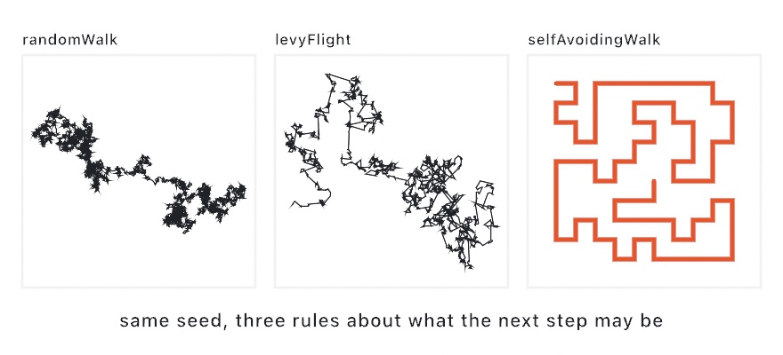

#### <sup>[Ollin](../../README.md) → [Documentation](../README.md) → [Generators](./README.md) → `Random walks`</sup>

---

## Random walks

These generators build a path one random step at a time. The family has three members, and each one makes a different mark. `randomWalk` draws a dense local tangle that drifts slowly. `levyFlight` draws tight clusters strung together by rare jumps. `selfAvoidingWalk` draws one unbroken line that never crosses itself.

All three draw from the seeded `random`, so [`seed`](./Random.md#seed) reproduces the path. All three return a plain `[Vector2]`, which you can pass to `drawPolyline`, `Contour`, hatching, or [SVG export](../Output/Export.md).

<picture>
  <source media="(prefers-color-scheme: dark)" srcset="../../Guide/Images/04-Randomness/WalkFamily-dark.jpg">
  
</picture>

### Contents

- [randomWalk](#randomWalk)
- [levyFlight](#levyFlight)
- [selfAvoidingWalk](#selfAvoidingWalk)
- [Standalone (outside a sketch)](#standalone)

<a name="randomWalk"></a>

#### randomWalk

```swift
randomWalk(from start: Vector2? = nil,     // canvas center by default
           steps: Int,
           stepLength: Double) -> [Vector2]
```

`randomWalk` is the plain isotropic walk, where every step is the same length in a uniformly random direction. It is *diffusive*, so after N steps it has typically drifted only √N step lengths from where it started. Because it moves away so slowly, it draws a dense, tangled scribble that stays local.

<picture>
  <source media="(prefers-color-scheme: dark)" srcset="../../Guide/Images/04-Randomness/WalkVsJumps-dark.jpg">
  
</picture>

```swift
seed(3)
noFill(); stroke(.black); strokeWeight(1.5)
drawPolyline(randomWalk(steps: 4000, stepLength: 6))
```

The call returns `steps + 1` points, and the first one is `start`.

<a name="levyFlight"></a>

#### levyFlight

```swift
levyFlight(from start: Vector2? = nil,
           steps: Int,
           minStep: Double,
           maxStep: Double,
           exponent: Double = 2) -> [Vector2]
```

`levyFlight` is a walk whose step lengths follow a heavy-tailed **power law**, p(l) ∝ l^(−exponent) on [`minStep`, `maxStep`]. Most steps are tiny, so the path grinds away inside one cluster. Rare enormous leaps then start a new cluster somewhere else. Foraging animals search this way, and eyes scan a scene this way. As a mark, it reads as islands of texture strung together by long strokes.

`exponent` controls the mix of tiny steps and long jumps. Near 1 the jumps dominate, near 3 the path approaches an ordinary walk, and the default of 2 is the classic balance. `minStep` must be positive. The power law diverges at zero, so a floor is part of the definition.

A flight wanders wherever the steps take it, so you usually have to fit the finished path to your frame. Scale the *points* rather than calling `scale()`. Take the minimum and maximum of the coordinates, then map them into the frame. `scale()` would fatten the stroke as well. See the `LevyFlight` example.

<a name="selfAvoidingWalk"></a>

#### selfAvoidingWalk

```swift
selfAvoidingWalk(in bounds: Rectangle? = nil,
                 cellSize: Double,
                 from start: Vector2? = nil,   // snapped to the nearest cell
                 maxLength: Int? = nil) -> [Vector2]
```

`selfAvoidingWalk` draws one unbroken path over a `cellSize` lattice, centered in `bounds`, that never revisits a cell. A naive self-avoiding walk boxes itself in almost immediately. This one grows depth-first with **backtracking**, so it retreats out of dead ends while the abandoned cells stay blocked. The line therefore winds long and dense, and it fills the frame like a maze made of a single stroke. Because it is a single stroke, it is a favorite for pen plotters.

The call returns the longest path it found. Its points are cell centers, and each step is one orthogonal lattice move. Pass `maxLength` to stop as soon as the path reaches that many points.

```swift
seed(12)
let path = selfAvoidingWalk(cellSize: 30)
strokeCap(.round); strokeWeight(11)
for i in 1 ..< path.count {
    stroke(ramp.color(at: Double(i) / Double(path.count - 1)))
    drawLine(path[i - 1], path[i])   // hue along the walk's length
}
```

<a name="standalone"></a>

#### Standalone (outside a sketch)

The free functions take an explicit start point or rectangle, plus a random number generator:

```swift
var rng = SplitMix64(seed: 5)
let scribble = randomWalk(from: .init(0, 0), steps: 2000, stepLength: 4, using: &rng)
let flight = levyFlight(from: .init(0, 0), steps: 600, minStep: 4, maxStep: 400, using: &rng)
let thread = selfAvoidingWalk(in: bounds, cellSize: 24, using: &rng)
```

---

Related: [`Random`](./Random.md) (the seeded source they draw from), [`Diffusion-limited aggregation`](./DiffusionLimitedAggregation.md) (random walkers frozen into dendrites), [`Flow fields`](./FlowField.md) (paths steered by a field instead of chance), [`Low-discrepancy sampling`](./LowDiscrepancy.md) (points without a path).
