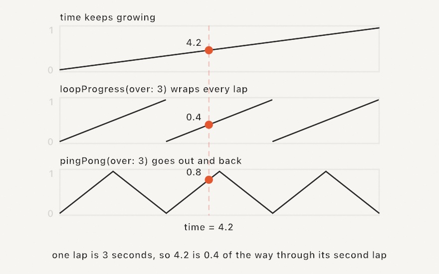
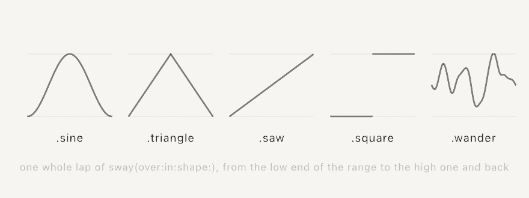

#### <sup>[Ollin](../../README.md) → [Documentation](../README.md) → [Helpers](./README.md) → `Animation`</sup>

---

## Animation

Motion is the default in Ollin, so most movement falls out of a `time`-driven term in `draw()`. When you want a value to *ease* between states instead of snapping or moving at a constant rate, there are two pieces: the `Easing` curves, which shape a `0...1` progress, and `@Eased`, a value that eases toward whatever you assign it. And when the value comes from a noisy live signal rather than a target you set, `@Smoothed` cleans it up as it arrives.

### Contents

- [Looping progress](#loop): `loopProgress`, `pingPong`
- [Sway](#sway): a value that travels between two ends and back
- [Wave](#wave): the raw sine, spelled by center and swing
- [Timers](#timers): `every`, `after`, `everyFrames`
- [Easing curves](#easing)
- [The curve catalog](#catalog)
- [`@Eased`](#eased)
- [`@Smoothed`](#smoothed)
- [`@Sprung`](#sprung): spring toward a target with momentum
- [`Timeline`](#timeline)

<a name="loop"></a>

### Looping progress

```swift
loopProgress(over duration: Double, phase: Double = 0) -> Double
pingPong(over duration: Double, phase: Double = 0) -> Double
```

Most repeating motion starts from a `0...1` progress that laps on a fixed period. `loopProgress(over:)` reads the sketch clock and hands you exactly that: `0...1` over `duration` seconds, wrapping back to `0` as each lap completes. `pingPong(over:)` is its out-and-back fold, `0` up to `1` and back to `0` over the same `duration`, so the motion it drives retraces its path instead of snapping home:

```swift
let t = loopProgress(over: 3)                       // 0...1, every 3 seconds
let x = lerp(140, width - 140, t)                   // cross, snap back, cross again

let back = pingPong(over: 3)                        // 0 -> 1 -> 0, every 3 seconds
let y = lerp(200, height - 200, back)               // sweep out and back forever
```



Under the hood a lap is just the clock wrapped by its period, `fract(time / duration)`; the helper spells it so a sketch doesn't have to. `phase` shifts the loop forward by a fraction of its length (`0.5` starts halfway through), which is the staggered-neighbors trick in one argument:

```swift
for (i, cell) in grid(columns: 12, rows: 1).cells.enumerated() {
    let t = pingPong(over: 3, phase: Double(i) / 12)   // each column a little ahead
    drawCircle(center: cell.center, radius: 12 + t * 28)
}
```

Progress from these helpers feeds everything below: reshape it with an easing curve, or hand it straight to `lerp`, a [`Ramp`](../Drawing/Color.md), or a rotation.

A sketch built this way repeats exactly, and it can say so: declare the period as [`loopDuration`](../Core/Sketch.md#loopDuration) and `--export-loop` renders exactly one lap as a seamless GIF or video (see [perfect loops](../Output/Export.md#perfect-loops)).

<a name="sway"></a>

### Sway

```swift
sway(over duration: Double, in range: ClosedRange<Double> = 0...1,
     shape: SwayShape = .sine, phase: Double = 0) -> Double
```

The slow back-and-forth most sketches write by hand: a value that leaves the low end of `range`, reaches the high end halfway through the lap, and is back at the low end as the lap closes.

```swift
drawCircle(width / 2, height / 2, sway(over: 4, in: 100...300))
```

That is `loopProgress`, a cosine, and a `lerp` in one call. With no `range` it hands back a plain `0...1` to drive something else with, and `phase` shifts the lap by a fraction of its length, exactly as it does above, so a row of neighbors sways in a traveling wave.

`shape` is the path it takes between the two ends. Five of them:

| `SwayShape` | The path | 
|---|---|
| `.sine` | out and back on a cosine: no corners, slowest at the ends |
| `.triangle` | out and back at one speed, turning sharply at each end |
| `.saw` | a ramp to the high end and a jump back |
| `.square` | one end for half the lap, the other for the rest |
| `.wander` | a smooth drift through the sketch's own noise field |



The four worked-out shapes start at the low end, so changing your mind about the path never moves where the value begins. `.wander` starts wherever its field does, which is near the middle. `.triangle` and `.saw` are `pingPong` and `loopProgress` mapped onto the range, so reach for those two when you want the bare `0...1`.

**Every shape closes its lap exactly, `.wander` included.** That is worth knowing because it is not free: a drift taken straight off the clock (`signedNoise(time)`) can never come home, so `.wander` tours a closed circle through the field instead (the [looping noise](../Generators/Noise.md)). A swaying sketch can therefore still declare a [`loopDuration`](../Output/Export.md#perfect-loops) and export a seamless loop.

A sway reads the clock and nothing else, so two calls with the same arguments are the same value. Give them different phases or different durations to tell them apart. For `.wander` a phase is a delay along one tour rather than a different tour, so several independent drifts are better driven by `signedNoise(_:loop:)` with a coordinate each. A `duration` of zero or less holds at the low end.

Worked example: [`Motion/Sway`](../../Examples/Motion/Sway/Sketch.swift).

<a name="wave"></a>

### Wave

```swift
wave(_ rate: Double = 1, amplitude: Double = 1, around center: Double = 0,
     phase: Double = 0) -> Double
```

The sine oscillation most sketches write out by hand, spelled by its center and
swing: `center + sin(time * rate + phase) * amplitude`.

```swift
let r = wave(0.8, amplitude: 40, around: 150)   // 110...190, slowly
drawCircle(center: center, radius: r)
```

`rate` is in radians per second, exactly the `k` of a hand-written
`sin(time * k)`, so an existing wave carries over unchanged. `phase` (radians
too) offsets neighbors along one wave. With no arguments it is simply
`sin(time)`.

`sway` above is the sibling that thinks in seconds per lap and a range of
values. Prefer it when the sketch declares a
[`loopDuration`](../Output/Export.md#perfect-loops): a lap of `sway` always
closes exactly, where a `wave` only closes when `loopDuration * rate` lands on
a whole number of turns.

<a name="timers"></a>

### Timers

```swift
every(_ seconds: Double, phase: Double = 0) -> Bool
after(_ seconds: Double) -> Bool
everyFrames(_ n: Int) -> Bool
```

Where `loopProgress` answers *how far through*, these three answer *now*. Each is true on a single frame and false on all the others, so a periodic event needs no counter of its own:

```swift
if every(2) { dots.append(Vector2(random(width), random(height))) }   // a dot every 2s
if after(3) { revealed = true }                                       // once, 3s in
if everyFrames(10) { grid.step() }                                    // every 10th frame
```

`every(seconds)` is true on the frame that crosses each multiple of `seconds`. The clock starts at `0`, and that counts as a crossing. So the first frame is a beat: your first dot arrives at once, not two seconds later. `phase` shifts the beat by a fraction of its own length, exactly as it shifts a lap above. That is how two rhythms of one period interleave:

```swift
if every(2) { … }                 // 0s, 2s, 4s …
if every(2, phase: 0.5) { … }     // 1s, 3s, 5s …
```

`after(seconds)` is the one-shot: true on the single frame that crosses that moment. Use it to *start* something rather than to test whether the moment has passed. `if after(3) { revealed = true }` runs the assignment once. `if time > 3 { revealed = true }` runs it on every frame from then on. That is fine for a flag, and wrong for anything that appends, spends, or plays.

`everyFrames(n)` counts frames instead, with the first frame as the first beat, so the beats fall on frames 1, `n + 1`, `2n + 1`. Reach for it when the beat belongs to the work rather than to the wall clock. A simulation stepping every tenth frame keeps its rate whether the window runs fast or slow. A beat in seconds does not.

Two properties are worth knowing, because they are what make a beat trustworthy:

- **A beat reads the clock and nothing else.** No state is carried between frames, so an export lands the beats on the same seconds as the window did at any frame rate, a [recorded take](../Output/Recording.md) replays them, and a [live reload](../Tools/LiveCoding.md) does not lose or repeat one.
- **A `Bool` can only say "now" once.** A frame long enough to cover two crossings reports one beat, not two. If you need to *count* events over a slow frame, work from `time` rather than from a beat.

<a name="easing"></a>

### Easing curves

An `Easing` maps normalized progress (`0...1`) onto a shaped `0...1`. Call it like a function, and pair it with [`lerp`](../Helpers/Math.md#lerp) to interpolate between two values along the curve:

```swift
let t = loopProgress(over: 2)                                // 0...1, looping
let x = lerp(120, width - 120, Easing.easeInOutCubic(t))     // eased across the canvas
drawCircle(x, height / 2, 40 * scale)
```

The input `t` is clamped to `0...1` first, so values past the ends hold flat. The output is *not* clamped: the back, elastic, and bounce curves overshoot the range on purpose and settle exactly on the endpoints. Back dips below zero before overshooting past one, elastic springs around the target before resting, and bounce settles onto the end in shrinking hops.

<picture>
  <source media="(prefers-color-scheme: dark)" srcset="../../Guide/Images/03-MotionAndTime/ShapingCurves-dark.jpg">
  
</picture>

Build a custom curve from any closure:

```swift
let gentle = Easing { t in t * t * (3 - 2 * t) }   // a hand-rolled smoothstep
```

A built-in curve carries its own name, so curves compare, persist, and sit on a menu: `@Param var spacing: Easing = .easeInOut` is a [knob](Parameters.md#family) like any other. The friendly aliases are the cubic curves themselves, so `.easeInOut == .easeInOutCubic`. A curve built from a closure equals itself and every copy of itself, and nothing else, since two closures cannot be compared.

<a name="catalog"></a>

### The curve catalog

`linear` plus the thirty named curves from [Robert Penner's easing equations](https://easings.net), grouped by family with in / out / in-out variants:

| Family | Ease in | Ease out | Ease in-out |
|---|---|---|---|
| Sine | `easeInSine` | `easeOutSine` | `easeInOutSine` |
| Quadratic | `easeInQuad` | `easeOutQuad` | `easeInOutQuad` |
| Cubic | `easeInCubic` | `easeOutCubic` | `easeInOutCubic` |
| Quartic | `easeInQuart` | `easeOutQuart` | `easeInOutQuart` |
| Quintic | `easeInQuint` | `easeOutQuint` | `easeInOutQuint` |
| Exponential | `easeInExpo` | `easeOutExpo` | `easeInOutExpo` |
| Circular | `easeInCirc` | `easeOutCirc` | `easeInOutCirc` |
| Back | `easeInBack` | `easeOutBack` | `easeInOutBack` |
| Elastic | `easeInElastic` | `easeOutElastic` | `easeInOutElastic` |
| Bounce | `easeInBounce` | `easeOutBounce` | `easeInOutBounce` |

The back, elastic, and bounce families overshoot: back dips past the start and overshoots the target, elastic springs around it, and bounce settles in steps. The other seven stay within `0...1`.

<picture>
  <source media="(prefers-color-scheme: dark)" srcset="../../Guide/Images/03-MotionAndTime/EasingFamilies-dark.jpg">
  
</picture>

Three friendly aliases cover the common case: `.easeIn`, `.easeOut`, and `.easeInOut` map to the cubic forms. `.smoothstep` is a Hermite smoothstep, a gentler S than `easeInOut` and the same curve as the bare [`smoothstep(0, 1, t)`](../Helpers/Math.md#shaping).

The [EasingGallery example](../../Examples/Motion/EasingGallery/Sketch.swift) plots all thirty so you can see the shapes side by side.

<a name="eased"></a>

### `@Eased`

A property wrapper for a `Double` that eases toward whatever you assign it, a little each frame. Read it to get the current animated value; assign it to set a new target. The sketch advances it automatically, so there's no update step to call.

```swift
final class Follow: Sketch {
    @Eased var x = 0.0                                  // 0.5s ease-in-out (the defaults)
    @Eased(duration: 1, curve: .easeOutBack) var y = 0.0

    override func draw() {
        background(.white)
        x = mouseX                                      // retarget; the dot glides over
        y = mouseY
        drawCircle(x, y, 40 * scale)
    }
}
```

Assigning the value it's already heading for is a no-op, so it's safe to set the target every frame. Only a *change* restarts the tween, and it restarts from wherever the value currently is. The tween is timed in seconds (`duration`), so it runs the same at any frame rate.

The projected value (`$x`) exposes a little more:

```swift
$x.target          // the value being eased toward
$x.isAnimating     // true while it's still moving
$x.set(200)        // jump straight there, no animation
```

The [Easing example](../../Examples/Motion/Easing/Sketch.swift) races four dots toward the same target on different curves, so you can watch the curves pull apart in flight.

<a name="smoothed"></a>

### `@Smoothed`

`@Eased` glides toward a target you *know*. When instead you have a noisy live signal whose true value you *don't* know (a jittery `mouseX`/`mouseY`, or live input from OSC, MIDI, computer vision, or the phone sensors), reach for `@Smoothed`. It cleans the stream with the [1€ filter](https://gery.casiez.net/1euro/), an adaptive low-pass that stays responsive when the signal moves fast and steady when it's slow, something a fixed low-pass can't manage at both ends.

<picture>
  <source media="(prefers-color-scheme: dark)" srcset="../../Guide/Images/03-MotionAndTime/SmoothedSignal-dark.jpg">
  
</picture>

Assign the raw value each frame and read back a clean one. Like `@Eased`, the sketch advances it for you, so there's no update step to call:

```swift
final class Cursor: Sketch {
    @Smoothed var p = Vector2.zero

    override func draw() {
        background(.white)
        p = Vector2(mouseX, mouseY)                 // feed the jittery input
        drawCircle(center: p, radius: 40 * scale)   // read the smoothed value
    }
}
```

It works on a `Double` or a `Vector2`. Two knobs tune the feel:

- **`minCutoff`** (default `1`): lower it to cut jitter while the signal is slow, at the cost of a little more lag.
- **`beta`** (default `0.007`): raise it to cut lag while the signal moves fast.

```swift
@Smoothed(minCutoff: 0.5, beta: 0.02) var angle = 0.0
```

Both are reachable live through the projected value (`$angle.beta = …`), so a [`@Param`](../Helpers/Parameters.md) knob can dial them in by feel. The projected value also gives you `$p.rawValue` (the last unsmoothed input) and `$p.set(v)` (jump there with no glide). Because the filter is timed in seconds, it behaves the same at any frame rate.

To smooth a value that isn't a sketch property, the `OneEuroFilter<Value>` underneath is public: own the state and step it yourself.

```swift
var filter = OneEuroFilter<Double>(minCutoff: 1, beta: 0.02)
let clean = filter.filter(noisy, dt: deltaTime)
```

The [Smoothing example](../../Examples/Motion/Smoothing/Sketch.swift) shakes jitter onto a moving target so you can watch the filter glide through the noise.

<a name="sprung"></a>

### `@Sprung`

The third sibling: a damped spring. `@Eased` replays a fixed curve over a fixed duration, so retargeting it mid-flight restarts the tween. A spring instead carries real momentum: retarget it and the motion bends smoothly through the turn, which is why springs feel alive under a target that never stops moving (a cursor, a tracked hand, a beat).

```swift
final class Chase: Sketch {
    @Sprung var p = Vector2.zero                      // critically damped
    @Sprung(duration: 0.4, bounce: 0.5) var r = 40.0  // wobbly

    override func draw() {
        background(.white)
        p = Vector2(mouseX, mouseY)                   // retarget freely
        r = mouseIsPressed ? 90 : 40
        drawCircle(center: p, radius: r * scale)
    }
}
```

Two knobs, both perceptual:

- **`duration`** (default `0.5`) is the response time in seconds, roughly how long a settle takes.
- **`bounce`** (default `0`) is the character. `0` is critically damped: the fastest possible arrival with no overshoot. Positive values overshoot and wobble (up to `1`, which rings forever); negative values drag in slowly, like moving through honey.

The projected value exposes the physics: `$p.velocity` (read or set), `$p.kick(impulse)` (throw the value and let it spring back, great on a beat or a click), `$p.target`, and `$p.set(v)` to jump with no motion. Works on a `Double` or a `Vector2`.

Each frame advances by the exact closed-form solution of the damped oscillator, not a numeric approximation, so a spring is unconditionally stable: a frame hitch can never make it explode or ring, and the motion is identical at any frame rate.

For spring state that isn't a sketch property (values in an array, say), the `DampedSpring<Value>` underneath is public:

```swift
var spring = DampedSpring(value: 0.0, duration: 0.6, bounce: 0.3)
let x = spring.step(toward: target, dt: deltaTime)
```

The [Springs example](../../Examples/Motion/Springs/Sketch.swift) races five bounces side by side and hangs a kickable chaser on the mouse.

<a name="timeline"></a>

### `Timeline`

`@Eased` eases toward a single moving target. When you instead want to *sequence* a value through several timed keyframes, each with its own easing (start here, glide to a value over a duration, hold, glide on), reach for `Timeline`. Build it fluently, then read `value` each frame:

```swift
let move = Timeline(0.0)
    .to(100, in: 1.5, ease: .easeOut)   // glide 0 -> 100 over 1.5s
    .hold(for: 0.5)                       // sit at 100 for 0.5s
    .to(0, in: 1.0)                       // glide back to 0
// each frame:
x = move.value
```

The clock advances in seconds, so a timeline runs the same at any frame rate. `loops` wraps it; `progress` is `0...1` over the whole sequence; `isFinished` reports when a non-looping run reaches the end; `restart()` and `seek(to:)` move the clock. It works on any `Tweenable` value (`Double`, `Vector2`, `Vector3`), so a `Timeline<Vector3>` sequences a position through space.

Like `@Eased`, a `Timeline` is advanced for you once per frame, but only when it is a **stored property on the sketch that exists before the first frame** (declared as a property, or assigned in `setup()`), the same rule `@Eased` follows. One created later inside `draw()`, or held in a local or a collection, is not picked up; advance it by hand with `tl.advance(by: deltaTime)` each frame. The cinematic [camera moves](../3D/Camera.md#catalog) drive their own timelines internally, so this rule never bites there.

The [Timeline example](../../Examples/Motion/Timeline/Sketch.swift) walks a dot around a square on one `Timeline<Vector2>`, a different easing per side with a hold at every corner, while a second timeline breathes its size; the bar underneath tracks `progress` with a tick per keyframe.

