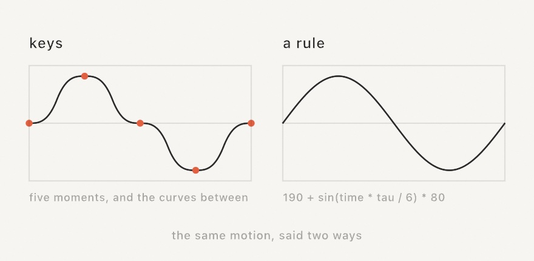
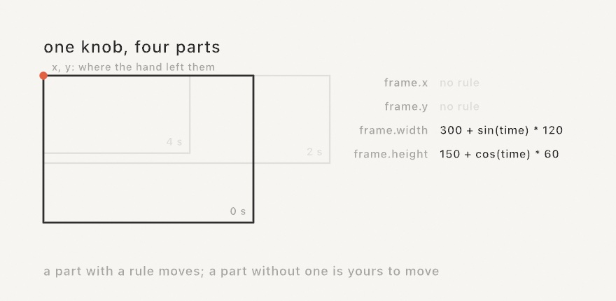

#### <sup>[Ollin](../../README.md) → [Documentation](../README.md) → [Helpers](./README.md) → `Formula`</sup>

---

## A number written as a rule

A `Formula` is a small piece of arithmetic read from a string and worked out as often as you like:

```swift
let wobble = try Formula("120 + sin(time * 2) * 40")
let radius = wobble.value(["time": time])
```

That matters because a string arrives at runtime and Swift source does not. A knob can be driven by a rule you typed. A file can carry the rule instead of a list of numbers. An editing surface can hand a person a field to type in. It is the same arithmetic you would write in `draw()`, spelled the same way, only later.

<picture>
  <source media="(prefers-color-scheme: dark)" srcset="../../Guide/Images/31-SharingAndPerforming/KnobAsARule-dark.jpg">
  
</picture>

### Contents

- [Driving a knob](#driving-a-knob)
- [A knob of more than one number](#a-knob-of-more-than-one-number)
- [What a formula can read](#what-a-formula-can-read)
- [The vocabulary](#the-vocabulary)
- [Two rules that surprise people](#two-rules-that-surprise-people)
- [Using one on its own](#using-one-on-its-own)
- [When the text is wrong](#when-the-text-is-wrong)
- [How it sits beside the rest](#how-it-sits-beside-the-rest)

---

### Driving a knob

`drive(_:_:)` puts a [`@Param`](Parameters.md) knob under a formula. Call it in `setup()`:

```swift
final class Ring: Sketch {
    @Param(80...460) var radius = 200.0
    @Param(3...48) var count = 12
    @Param(2...40) var edge = 6.0
    @Param var filled = true

    override func setup() {
        drive($radius, "190 + sin(time * tau / 6) * 80")
        drive($count, "8 + round(sin(time * tau / 12) * 5)")
        drive($edge, "radius / 22")            // worked out from another knob
        drive($filled, "time % 6 < 3")         // a switch, on when it is not zero
    }
}
```

A formula answers a plain number, so three kinds of knob take one: a `Double`, an `Int` (rounded), and a `Bool` (on for anything but zero).

A knob under a formula is a [track](../Core/Automation.md) like any keyed one. `loops`, `speed`, `start`, and `length` shape it the same way, it travels in the same file, and every export renders it frame for frame.

The [Formula example](../../Examples/Motion/Formula/Sketch.swift) drives six knobs this way and prints the text driving each one under the ring.

### A knob of more than one number

A point holds two numbers, a color holds four, a pair of ends holds two more. Each part takes its own rule, named where you write it:

```swift
final class Card: Sketch {
    @Param(x: 0...1080, y: 0...1080, width: 40...900, height: 40...900)
    var frame = Rectangle(x: 190, y: 120, width: 700, height: 420)
    @Param(x: 0...1080, y: 0...1080) var eye = Vector2(540, 330)
    @Param var ink = Color(red: 0.2, green: 0.4, blue: 0.9, alpha: 1)

    override func setup() {
        drive($frame, width: "620 + sin(time * tau / 7) * 220")
        drive($eye, x: "frame.x + frame.width / 2", y: "height / 2")
        drive($ink, red: "0.35 + sin(time) * 0.3")
    }
}
```

**A part with no rule is left alone.** The frame above changes size while its `x` and `y` stay where the hand put them, and the hand can still move them while the size plays. That is the reason to write a rule for one part rather than for the whole knob.

<picture>
  <source media="(prefers-color-scheme: dark)" srcset="../../Guide/Images/31-SharingAndPerforming/KnobParts-dark.jpg">
  
</picture>

**One part of a knob is a name too**, spelled `knob.part`, so `"frame.x + frame.width / 2"` reads this frame's rectangle. The name works whether keys carry that part or another rule works it out.

| Knob | Parts |
| --- | --- |
| `Vector2` | `x`, `y` |
| `Vector3` | `x`, `y`, `z` |
| `Color` | `red`, `green`, `blue`, `alpha` |
| `Rectangle` | `x`, `y`, `width`, `height` |
| `Insets` | `top`, `right`, `bottom`, `left` |
| `ClosedRange<Double>` | `lower`, `upper` |

Three things are worth knowing before you write one:

- **One call carries the whole knob**, so a second call replaces the first. Give every part in one call.
- **A pair of ends stays ordered.** A `lower` that climbs past `upper` lifts it along, which is what the two-thumb slider does under a hand.
- **A color's parts are the sRGB numbers in `0...1`, and nothing holds them there**, because a color knob carries no range of its own. Write `saturate(...)` in the rule where you want one. Every other knob keeps its own range, exactly as it does when a hand drags the field.

A part cannot name its own knob. An `x` worked out from the same point's `y` never settles on one frame, so that knob is reported and left alone, the way a ring of knobs is.

The [FormulaParts example](../../Examples/Motion/FormulaParts/Sketch.swift) drives four such knobs and prints the rule driving each part.

### What a formula can read

| Name | What it holds |
| --- | --- |
| `time` | Where the automation stands, in seconds. With no `speed` or `start` set, that is the sketch clock. |
| `frame` | The number of the frame about to be drawn, the same number `frameCount` reads inside `draw()`. |
| `width`, `height` | The canvas, in pixels. |
| `mouseX`, `mouseY` | The pointer. |
| any knob's name | Any `@Param` on the sketch that is a number or a switch. A switch reads as `1` or `0`. |
| `knob.part` | One part of a knob that holds more than one number: `center.x`, `tint.alpha`, `span.lower`. |

The names in the table win over a knob spelled the same way, so `time` always means the clock.

**A knob worked out from another lands on the same frame.** The knob named is always set first, whatever order the tracks sit in, so `drive($edge, "radius / 22")` reads *this* frame's radius. That is what keeps a formula a plain function of the clock. The same moment gives the same picture at any frame rate, which is what lets a 30-a-second export match the window.

Two knobs that name each other cannot settle that way, and neither can a knob that names itself (`"n + 1"`). Such a ring is reported and left alone rather than played at a value that would depend on the frame rate. For a value that builds on itself, keep a plain property and step it in `draw()`.

### The vocabulary

**Numbers.** `1`, `1.5`, `.5`, `2e3`, `2.5e-3`.

**Constants.** `pi`, `tau`, `e`.

**Operators**, loosest first: `||`, `&&`, then `==` `!=`, then `<` `<=` `>` `>=`, then `+` `-`, then `*` `/` `%`, then a leading `-` or `!`, and `^` tightest of all. A comparison answers `1` or `0`, and `&&` / `||` stop as soon as the answer is settled.

**Functions.**

| | |
| --- | --- |
| Angles | `sin` `cos` `tan` `asin` `acos` `atan` `atan2(y, x)` `sinh` `cosh` `tanh` `radians` `degrees` |
| Numbers | `abs` `sign` `floor` `ceil` `round` `trunc` `fract` `sqrt` `exp` `log` `log2` `log10` `pow(a, b)` `hypot(a, b)` `mod(a, b)` |
| Shaping | `clamp(x, low, high)` `saturate(x)` `lerp(a, b, t)` `mix(a, b, t)` `step(edge, x)` `smoothstep(edge0, edge1, x)` `map(x, a, b, c, d)` |
| Picking | `min(a, b, ...)` `max(a, b, ...)` `if(condition, then, else)` |
| Texture | `noise(x[, y, z])` in `0...1`, `signedNoise(x[, y, z])` in `-1...1` |

The shaping names are spelled and ordered exactly like [the framework's own](Math.md) and like the shader library's. The same line reads the same in all three places.

`noise` reads the sketch's own field, so `noiseSeed()` reproduces a wandering knob the way it reproduces a drawn one. There is deliberately no `random`: a formula answers the same number for the same moment, which is what makes a directed run render twice the same.

`if` picks its branch before working it out, so the branch not taken never runs.

### Two rules that surprise people

**`^` binds tighter than a minus sign.** `-2^2` is `-4`, and `2^3^2` is `2^9`. That is what a calculator does. (Ollin's *other* small language, the one a [parametric L-system](../Generators/LSystem.md) writes its productions in, binds the minus tighter, because the published formalism says so. Neither is a mistake, and the two do not have to agree.)

**`%` wraps rather than reflects.** `-1 % 3` is `2`, not `-1`. The remainder floors, which is what makes a wrapping phase continuous through zero, and it agrees with `fract` and with the shader spelling. Swift's own `%` answers `-1`; this one deliberately does not.

### Using one on its own

Nothing about `Formula` needs a knob. Read one and evaluate it wherever you like:

```swift
let f = try Formula("a * 2 + b")
f.variables                      // ["a", "b"], in the order it met them
f.value(["a": 3, "b": 1])        // 7
f.value([3, 1])                  // 7, by position, which skips the lookup
```

Left to itself a formula names its own variables, so nothing is refused for being unknown. Where the names *are* known ahead of time, say so and a misspelling is refused instead:

```swift
try Formula("sin(tine)", variables: ["time"])
// FormulaError: 'tine' is not a value or a function; the values here are time (at character 5)
```

`usesNoise` says whether it will read a field, and `value(_:noise:)` takes one (`sketch.noiseField()` hands over the sketch's own).

### When the text is wrong

`Formula` throws a `FormulaError` carrying a message and the `offset` of the character it stopped at, so a surface can point at the spot.

`drive(_:_:)` does not throw. It reports the problem on standard error and leaves the knob alone. A typo costs that one knob rather than the sketch, which is what a live edit wants. It also says so when a formula names something nothing supplies, since that would otherwise read as zero every frame and draw something almost right. To handle the error yourself, build the formula with `try` and pass it instead:

```swift
drive($radius, try Formula("190 + sin(time) * 80"))
```

### How it sits beside the rest

- **[Keyframed parameters](../Core/Automation.md).** The same track, filled a different way: keys say where a knob *is* at a few moments, a formula says what it *is* at every moment. One automation holds both kinds, and a file carries the formula as the text it was written as, so a person can edit it there.
- **[Parameters](Parameters.md).** A knob under a formula goes back on it at the next frame, so dragging its slider reads as a nudge. Take the formula off (`automation = nil`) to tune by hand.
- **[Math](Math.md).** The Swift side of the same vocabulary, for a value worked out in `draw()` rather than typed as text.
- **[Replay](../Core/Replay.md).** A run recorded with `--record-take` writes down the values the formulas held, so a take replays the performance with or without them.

---

### See also

- [`Automation`](../Core/Automation.md) - the track a formula fills, and the file both kinds travel in
- [`Parameters`](Parameters.md) - the `@Param` knobs a formula drives
- [`Math`](Math.md) - `map`, `lerp`, and the shaping scalars, spelled the same way
- [`Noise`](../Generators/Noise.md) - the field `noise()` reads, and the seed that reproduces it
