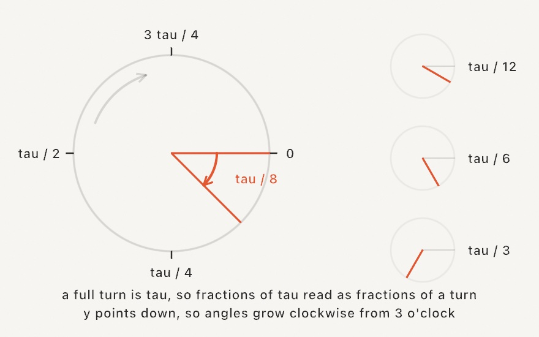

#### <sup>[Ollin](../../README.md) → [Documentation](../README.md) → [Helpers](./README.md) → `Math`</sup>

---

## Math helpers

A small, growing set of the familiar creative-coding math functions, callable bare in `draw()`.

### Contents

- [map](#map)
- [dist](#dist)
- [lerp](#lerp)
- [Shaping scalars](#shaping): `clamp`, `wrap`, `fract`, `step`, `smoothstep`, `unipolar`, `bipolar`
- [Dividing a whole](#dividing): `fractions`, `angles`
- [polar](#polar)
- [Primes](#primes)
- [Constants and angle units](#constants)

<a name="map"></a>

### map

```swift
map(_ value: Double, _ start1: Double, _ stop1: Double, _ start2: Double, _ stop2: Double, clamp: Bool = false) -> Double
```

Linearly re-map `value` from one range onto another: the result sits at the same fraction along `start2...stop2` that `value` sat along `start1...stop1`. By default it extrapolates past the range; pass `clamp: true` to hold the result inside `start2...stop2`.

<picture>
  <source media="(prefers-color-scheme: dark)" srcset="../../Guide/Images/03-MotionAndTime/MapAndLerp-dark.jpg">
  
</picture>

```swift
let r = map(sin(time), -1, 1, 60, 200)   // -1...1 → 60...200
drawCircle(width / 2, height / 2, r)      // a breathing circle
```

<a name="dist"></a>

### dist

```swift
dist(_ x1: Double, _ y1: Double, _ x2: Double, _ y2: Double) -> Double
```

The Euclidean distance between two points.

```swift
let d = dist(mouseX, mouseY, width / 2, height / 2)
let r = map(d, 0, 400, 80, 10, clamp: true) // large at the center, small toward the edges
drawCircle(width / 2, height / 2, r)
```

<a name="lerp"></a>

### lerp

```swift
lerp(_ a: Double, _ b: Double, _ t: Double) -> Double
```

The point `t` of the way from `a` to `b`. `t` is not clamped, so values outside `0...1` extrapolate past the ends. Reshape `t` with an [`Easing`](../Helpers/Animation.md) curve for non-linear motion.

```swift
let x = lerp(120, width - 120, Easing.easeInOut(progress))
```

A looping `t` driven by the sketch clock comes from [`loopProgress(over:)` and `pingPong(over:)`](../Helpers/Animation.md#loop).

<a name="shaping"></a>

### Shaping scalars

```swift
clamp(_ x: Double, _ minValue: Double, _ maxValue: Double) -> Double
clamp<T: Comparable>(_ x: T, _ minValue: T, _ maxValue: T) -> T
clamp<T: Comparable>(_ x: T, to range: ClosedRange<T>) -> T
wrap(_ x: Double, _ minValue: Double, _ maxValue: Double) -> Double
fract(_ x: Double) -> Double
step(_ edge: Double, _ x: Double) -> Double
smoothstep(_ edge0: Double, _ edge1: Double, _ x: Double) -> Double
unipolar(_ x: Double) -> Double
bipolar(_ x: Double) -> Double
```

The bare shaping vocabulary, spelled with the same names and argument order as
the [shader library](../Shaders/ShaderLibrary.md), so an expression you write in
`draw()` carries verbatim into per-pixel shader code. The
[`Easing`](../Helpers/Animation.md) catalog stays the curve library; these are
its primitives.

- `clamp(x, lo, hi)` holds `x` within the range. The generic form clamps any
  comparable type (`clamp(i, 0, columns - 1)` for an `Int` index), and
  `clamp(t, to: 0...1)` takes the range as one value.
- `wrap(x, lo, hi)` brings `x` back into `lo..<hi` by whole laps: the circular
  sibling of `clamp`, so a walker that leaves one edge of the canvas comes back
  in at the other (`x = wrap(x + step, 0, width)`), and an angle stays in one
  turn (`wrap(a, 0, .tau)`). Floor-based like `fract`, so it stays continuous
  through negative values.
- `fract(x)` keeps the fractional part: `fract(2.75)` is `0.75`. Floor-based, so
  it stays continuous through negative values and wrapping a growing value never
  jumps.
- `step(edge, x)` is `0` below `edge` and `1` from it on: an `if` as a function,
  the hard switch for blinks and flips.
- `smoothstep(edge0, edge1, x)` is the smooth S-ramp between two edges: `0` at
  or below `edge0`, `1` at or above `edge1`, no corners in between. The edges
  cut a soft window out of any signal (reverse them to fade the other way):

```swift
let lit = smoothstep(0.3, 1.0, sin(angle * 3 - time))  // a soft traveling window
fill(Color.mix(.navy, .white, lit))
```

`smoothstep(0, 1, t)` is the plain `0...1` reshape, the same curve as
[`Easing.smoothstep`](../Helpers/Animation.md#catalog).

- `unipolar(x)` remaps a signed `-1...1` signal onto `0...1` (`x * 0.5 + 0.5`),
  the spelling of the most common remap in a sketch: a wave or a signed noise
  sample becoming a usable fraction. `bipolar(x)` is its inverse (`x * 2 - 1`).
  For noise there is a shorter road: `noise(x)` already answers in `0...1`, so
  `unipolar(signedNoise(x))` is just `noise(x)`.

```swift
fill(palette.color(at: unipolar(sin(time))))
```

<a name="dividing"></a>

### Dividing a whole

```swift
fractions(_ count: Int, inclusive: Bool = false) -> [Double]
angles(_ count: Int, from start: Double = 0, turns: Double = 1) -> [Double]
```

The normalized loop index as a sequence, replacing the
`Double(i) / Double(count)` dance. `fractions(n)` is `n` evenly spaced
fractions of `0...1`, running `0` up to (not through) `1`. That spacing tiles
a circle or a repeating strip with no doubled seam. Pass `inclusive: true`
for fence posts instead of fence panels, `n` values from `0` through `1`
exactly.

```swift
for t in fractions(12) {
    drawCircle(lerp(80, width - 80, t), height / 2, 20)
}
```

`angles(n)` is the same division read as radians, one full turn by default: the
spokes of a wheel as a sequence. `from` rotates the whole fan (hand it `time`
and the ring turns); `turns` opens it to less or more than a full circle.

```swift
for a in angles(12, from: time * 0.1) {
    drawCircle(center: polar(a, 300, around: center), radius: 20)
}
```

<a name="polar"></a>

### polar

```swift
polar(_ angle: Double, _ radius: Double, around center: Vector2 = .zero) -> Vector2
```

The point at `angle` and `radius` from `center`: polar coordinates as one call,
replacing the spelled-out `center + Vector2(cos(a), sin(a)) * r`. Angle in
radians, `0` pointing right and increasing clockwise on screen (y grows
downward). With no `around:` the point is measured from the origin, which
composes with `translate`. (`Vector2(angle:length:)` is the same idea as a
direction vector, when there is no center to add.)

```swift
drawLine(center, polar(time, 300, around: center))
```

<a name="primes"></a>

### Primes

```swift
primes(upTo limit: Int) -> [Int]
isPrime(_ number: Int) -> Bool
```

Whole numbers as material. `primes(upTo:)` is the sieve of Eratosthenes and answers the whole run at once, which is what makes a field of thousands of numbers cheap. `isPrime` is the shorter way round for a single number. Negative numbers, zero, and one are not prime.

```swift
for p in primes(upTo: 500) { drawCircle(Double(p), height / 2, 3) }
```

The picture these are best known for is the [Ulam spiral](../Generators/UlamSpiral.md), which writes the numbers in a square spiral and marks the primes.

The other exact whole-number type is `Fraction`, a fraction in lowest terms with `mediant`, `isNeighbor`, and comparison by cross-multiplication. It lives with [Ford circles](../Generators/FordCircles.md) and `fareySequence`, the picture it was made for.

<a name="constants"></a>

### Constants and angle units

`Double.tau` is the full turn (2π), which is what most angle work wants.

```swift
rotate(Double.tau / 6)   // a sixth of a turn
```

The drawing calls all speak radians. `.degrees(_:)` and `.turns(_:)` read a
familiar unit into them at the call site:

```swift
rotate(.degrees(45))
rotate(.turns(0.25))     // a quarter circle
```


