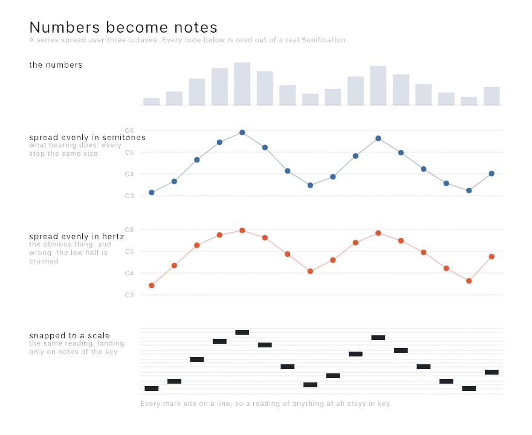

# Sonification

Numbers read out as notes.

A column of a table, a line across a terrain, a row of a picture: any series becomes something to listen to by spreading its values over a range of pitch. Snapped through a [`Scale`](Composition.md#scale) the reading stays in key, so data can be music rather than only a signal.

It is also how a drawing reaches someone who is not looking at it. A sketch that plots a column can read the same column out loud from the same numbers, with no second copy of the data.

```swift
import OllinAudio

let synth = Synth(.pluck)
let readings = Sonification(table, column: "temperature",
                            in: Scale(.minorPentatonic, root: "A3"))
var counter = StepCounter(perBeat: 2)

override func draw() {
    for step in counter.steps(upTo: time * 2) {
        synth.play(readings, step: step, tempo: 120)
    }
}
```

Like everything else in the [composition](Composition.md) tier it answers a step number and owns no clock, so the same reading can be driven by `time`, by a detected beat, or by a `TempoClock` following a drum machine.

---

## What it reads

Four sources, each one call.

```swift
Sonification(numbers)                                  // a series in hand
Sonification(table, column: "rainfall")                // a column of a table
Sonification(land, row: 32)                            // a line across a terrain
Sonification(land, from: Vector2(0, 0), to: Vector2(1, 1), count: 64)
Sonification(picture, row: 200)                        // a row of a picture
```

| Source | What it reads |
|---|---|
| `[Double]` | the numbers, in order |
| `Table` | one column, in row order. Cells that are not numbers are dropped, so a gap is a note that is not played rather than a note at zero |
| `Heightfield` | one `row:` left to right, one `column:` top to bottom, or a straight line at any angle through `from:to:count:` in normalized coordinates |
| `Image` | one `row:` or `column:` as brightness, weighed the way the eye weighs it, so a pure blue reads far darker than a green of the same numeric size |

A picture living on the GPU has no pixels to read on this side and gives an empty reading; call `snapshot()` first.

---

## The settings

```swift
Sonification(numbers,
             in: Scale(.dorian, root: "D3"),   // the notes it may land on
             pitches: "C3"..."C6",             // the span it is spread over
             bounds: .robust(ignoring: 0.05),  // how the ends are decided
             polarity: .positive,              // which way round
             length: 0.25)                     // beats per note
```

| Setting | What it does |
|---|---|
| `in scale:` | the notes the reading may land on. Omit it and every semitone between the ends is available |
| `pitches:` | the span the data is spread over. Three octaves by default: wide enough to hear a shape in, not so wide the top is shrill |
| `bounds:` | which values land at the ends. See below |
| `polarity:` | `.positive` is more-is-higher, which is what a listener expects of a quantity. `.negative` is the right way round for a size, since a small thing is the one that rings high |
| `length:` | how long each note lasts, **in beats**. The tempo joins when it is played |

### Where the ends go

```swift
.extremes                   // the smallest and largest values there are
.robust(ignoring: 0.05)     // the same, after setting aside 5% at each end
.fixed(0 ... 100)           // a range you name, whatever the data does
```

`.robust` is the one to reach for with real measurements. One bad sensor reading at a thousand times the scale of everything else will otherwise flatten the entire series into a single note. `.fixed` is what makes two readings comparable with each other: the same value lands on the same note in both.

Values outside the range are held at the ends rather than running off into an inaudible pitch.

---

## Reading it

| Member | What it gives |
|---|---|
| `count` / `isEmpty` | how many notes there are |
| `sonification[step]` | the `Note` at a step, or nil past the end |
| `note(at:)` | the same, spelled out |
| `notes()` | the whole reading at once, for a phrase to hold on to |
| `pitch(for: value)` | where any one value lands, whether or not it is in the data |
| `values` / `domain` | the numbers as read, and the two that land at the ends |

`pitch(for:)` is what puts something else on the same footing as the reading: a threshold, an average, the value under the mouse.

---

## The reference note

```swift
let sealevel = reading.reference(at: 0.5)
marker.play(sealevel, tempo: tempo)     // under the reading, every bar
```

Without one, a listener has to have absolute pitch to know what any note means. With one, a reading is heard as above or below something, which is the whole difference between a sound and a measurement. It is the grid line of an ordinary chart.

---

## Loudness

A second series can be read out as loudness alongside the first.

```swift
let reading = Sonification(depth, in: scale).amplified(by: confidence)
```

The two are lined up by position, so entry 3 of one is heard at the same moment as entry 3 of the other. With nothing given, every note plays at full level.

Loudness is the weaker of the two dimensions and deliberately does nothing unless asked. How loud something sounds depends on how high it is as well as how strong it is, so a series read out on loudness alone is read out through a distortion. Reach for pitch first, and use `amplified(by:)` for a *second* series rather than to say the same thing twice.

---

## How the mapping is made

Two choices are worth knowing about, because both are easy to get wrong and neither is what you would write first.

**Pitch is spread evenly in semitones, not in hertz.** Hearing is logarithmic: the step from 220 Hz to 440 and the step from 440 to 880 sound like the same distance, though one is twice the size of the other. A series spread evenly in hertz crushes its whole bottom half into a few notes at the low end.



**Loudness is spread evenly in decibels**, for the same reason, between a floor and full level rather than between silence and full.

Both are the units these things are heard in, which is why the mapping is linear once it is in them.

---

## Going further

- [Composition](Composition.md) - the `Scale`, `StepCounter`, and `Note` this is built on
- [Synthesis](Synthesis.md) - the instrument that plays it
- [Data](Data.md) - `loadTable` and the `Table` a column is read from
- [Terrain](../Generators/Terrain.md) - the `Heightfield` a profile is read from

The example is `Examples/Audio/Sonification`: a line across a landscape, drawn and read out at once.
