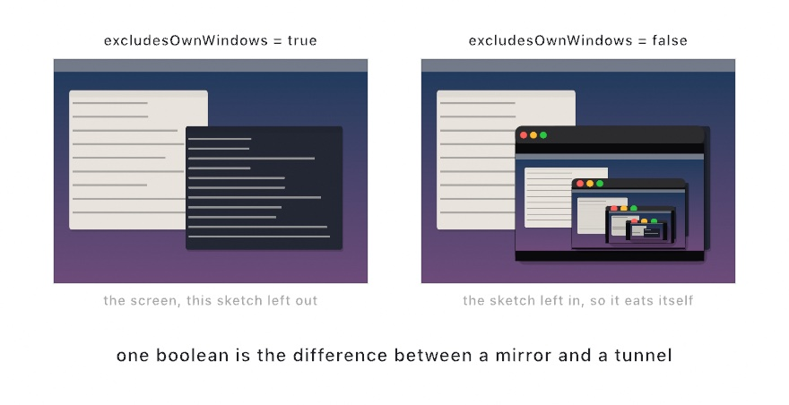

#### <sup>[Ollin](../../README.md) → [Documentation](../README.md) → [Integration](./README.md) → `ScreenCapture`</sup>

---

## Screen capture

Take the Mac's own screen as material. Any display, any app, or any single window arrives as a live image. A sketch draws it, filters it, and analyzes it. Anything running on the machine becomes material, whether that is a browser, a map, a video call, a terminal, or another sketch.

This is the counterpart to [Syphon](Syphon.md), and the difference is who has to agree. Syphon carries frames between apps that have both chosen to speak it. That is why it is fast and clean, and why it only reaches apps that publish. Screen capture asks nothing of the other app at all. It reaches everything on the screen. It pays for that with the one thing Syphon never needs, which is the user's permission to record the screen.

It lives in a separate library so the drawing core stays free of ScreenCaptureKit, and so the permission belongs to sketches that ask for it. Add `import OllinScreen` alongside `import Ollin`.

```swift
import Ollin
import OllinScreen

final class Mirror: Sketch {
    let screen = ScreenCapture(.mainDisplay)

    override func setup() { screen.start() }

    override func draw() {
        background(.black)
        drawFrame(screen)
    }
}
```

Frames arrive as GPU textures, the same way a [video](../Video/Video.md) file's do. Drawing one costs no trip through the CPU, and every [filter](../Drawing/Effects.md) applies. A capture is also a [`FrameSource`](../Vision/Vision.md). Every tracker in the vision catalog attaches to it the way it attaches to a camera, and reads whatever is on screen instead.

<picture>
  <source media="(prefers-color-scheme: dark)" srcset="../../Guide/Images/30-Seeing/ScreenAsMaterial-dark.jpg">
  
</picture>

### Contents

- [Permission](#permission) - what the prompt actually does for a sketch, which is not what you would expect
- [Choosing what to capture](#choosing-what-to-capture) - naming a display, an app, or a window
- [Listing what is there](#listing-what-is-there) - discovering names to write down
- [Capturing the screen you are drawn on](#capturing-the-screen-you-are-drawn-on) - self-exclusion, and the feedback tunnel
- [Settings](#settings) - size, frame rate, cursor
- [Reading the screen with a tracker](#reading-the-screen-with-a-tracker) - vision over a captured feed
- [What is not here](#what-is-not-here)

<a name="permission"></a>

### Permission

Recording the screen needs the user's consent, and macOS grants that consent to an *application*, not to a piece of code. That distinction is the whole story for a creative-coding framework, because a sketch is usually not an application.

**A sketch run from the terminal inherits the terminal's permission.** Ollin builds plain executables with no bundle identifier of their own. That covers `swift run`, the `ollin` command, `OllinLive`, and the examples gallery. So macOS attributes their request to the process that launched them, which is Terminal, iTerm, Ghostty, or whichever you use. The prompt you see names your terminal, and so does the entry in System Settings. Allow it there once, and every sketch you run from that terminal can capture, with no further prompt. One approval covers all of them.

That is convenient, and it is worth being clear-eyed about. If you allow a terminal to record the screen, everything you run from it can record the screen. It is the same trade as letting a terminal have Full Disk Access. That is why a sketch opts into the capability, by importing a library and calling `start()`. The drawing core never carries it.

Granting the permission **does not reach a process that is already running**. Allow it, then start the sketch again.

```swift
ScreenCapture.isAvailable          // is the permission in place?
ScreenCapture.unavailableReason    // a sentence to draw when it is not
ScreenCapture.requestAccess()      // ask (the system prompts once, ever)
```

`start()` asks for you, so most sketches never call `requestAccess()`. A capture with no permission is not an error, and it does not throw. It simply has no frames. `waitingMessage` says why, and `drawFrame` puts that on the canvas for you.

```swift
override func draw() {
    background(.black)
    guard let rect = drawFrame(screen) else { return }   // draws the reason if there is one
    // …
}
```

To style the notice yourself, read the reason directly:

```swift
if let reason = ScreenCapture.unavailableReason {
    drawStatus(reason, style: .warning)
}
```

A sketch that ships as a real `.app` bundle gets its own entry in System Settings, and its own prompt. That is the better experience for anything you hand to someone else.

<a name="choosing-what-to-capture"></a>

### Choosing what to capture

A `ScreenSource` is a plain value you write in the sketch. The same line always picks the same thing, so the sketch stays the record of what was captured:

```swift
ScreenCapture(.mainDisplay)                          // the display the menu bar is on
ScreenCapture(.display(id))                          // a display by its system id
ScreenCapture(.app("Safari"))                        // every window one app has open
ScreenCapture(.app("com.apple.Safari"))              // the same, by bundle identifier
ScreenCapture(.window(title: "Shopping list"))       // one window, by its title
ScreenCapture(.window(title: "Untitled", app: "Notes"))
ScreenCapture(.windowID(id))                         // one window by its id
```

Names are matched leniently, because that is what makes them worth writing. An app matches on its name **or** its bundle identifier, ignoring case, and has to match in full. A window matches any title *containing* the text, ignoring case, which is what lets `"Shopping list"` keep working when the title bar reads `"Notes: Shopping list"`. Where several windows match, the lowest window id wins, so a repeated run picks the same window rather than following whatever happens to be frontmost.

Capturing a **window** gives you that window alone, at its own size, with nothing in front of it, even when something covers it on screen. Capturing an **app** gives you its windows against their display, keeping their positions and overlap.

The source is a live property, so a sketch can switch targets from a parameter or a key without stopping:

```swift
screen.source = .app("Music")
```

**A source that names something not on screen yet is not an error.** The capture keeps looking. It starts by itself the moment the window appears, so you can name a window and then go open it. `isRunning` stays `true` through the wait, where it means "wanted", and `isReceiving` tells you whether frames are actually arriving.

<a name="listing-what-is-there"></a>

### Listing what is there

To discover what a machine can currently capture, ask. All three need the permission and return an empty array without it, and all three are ordered so a listing reads the same way twice:

```swift
await ScreenCapture.availableDisplays()   // [ScreenDisplay]  id, size, isMain, label
await ScreenCapture.availableWindows()    // [ScreenWindow]   id, title, appName, bundleIdentifier, frame, label
await ScreenCapture.apps()       // [ScreenApp]      id (pid), name, bundleIdentifier, label
```

They are asynchronous, so a sketch reads them in a `Task` and keeps drawing meanwhile:

```swift
override func setup() {
    Task { @MainActor in
        for window in await ScreenCapture.availableWindows() {
            print(".window(title: \"\(window.title ?? "")\")   // \(window.label)")
        }
    }
}
```

The intended workflow is to list once, find what you want, and then **write the name into the sketch**. The piece then does not depend on a menu having been clicked. The `ScreenCapture` example prints the listing as the line of code that names each source, ready to paste.

<a name="capturing-the-screen-you-are-drawn-on"></a>

### Capturing the screen you are drawn on

By default the sketch's own windows are cut out of a display capture. Without that, a full-screen capture contains the window it is drawn in, and the picture eats itself:

```swift
screen.excludesOwnWindows = true    // the default
```

Turn it off and that is exactly what happens, which is the point:

```swift
screen.excludesOwnWindows = false
```

The sketch draws a screen containing a window drawing a screen containing a window, receding until the innermost copy is a few pixels across. It is video feedback, the effect people have been pointing cameras at monitors to get since the 1960s, and here it costs one boolean. How far it recedes depends on how fast the sketch draws relative to the capture. The recursion drifts and smears as the window moves, which is the good part.

Self-exclusion keys on the process, not the window title. So it holds for a sketch with several windows, and for a sketch with no bundle identifier. It has no effect when capturing a single window or another app, where the sketch was never in the picture to begin with.

<a name="settings"></a>

### Settings

```swift
screen.scale = 0.5          // multiplier on the captured pixel size (default 1)
screen.frameRate = 30       // most frames per second (default 60)
screen.showsCursor = false  // draw the pointer into the frames (default true)
```

`scale` is the parameter that matters on a large display. At `1` a capture arrives at the display's true backing resolution. On a Retina screen that is twice its size in points, so a 5K display is a 5120-pixel-wide texture every frame. Halving it quarters the pixels, and is the cheap way to feed a heavy effect chain.

Frames are delivered only when the captured content actually changes, so a still screen costs nothing whatever `frameRate` says. The cap is there to keep a busy screen from outrunning the sketch.

<a name="reading-the-screen-with-a-tracker"></a>

### Reading the screen with a tracker

Because a capture is a `FrameSource`, every [vision tracker](../Vision/Vision.md) attaches to it the way it attaches to a camera:

```swift
import OllinScreen
import OllinVision

let screen = ScreenCapture(.app("Safari"))
lazy var text = TextRecognizer(screen)
lazy var faces = FaceTracker(screen)
```

So a sketch can read the words on a page as they scroll, or find faces in a video call. It can follow motion across a map, or trace contours out of anything on screen. Map results into the rectangle `drawFrame` returns, exactly as with a camera.

The CPU copy a tracker needs is made only while a tap is installed, so a capture that is only drawn never pays for it.

<a name="what-is-not-here"></a>

### What is not here

**System audio.** ScreenCaptureKit can record what the machine is playing, and this does not. It is a capture of pictures only. The audio side belongs with the [audio](../Helpers/Audio.md) analyzer surface rather than bolted to a video frame source, and it has not been built yet.

**The system picker.** macOS offers a Control Center panel for choosing what to share. It is built around an application singleton with an observer protocol. That suits an app with a bundle identity and a settings window, rather than a sketch. A choice made through a panel would also make the picture depend on a click nobody recorded. Naming the source in code is the reproducible path, and `availableWindows()` gives you the same discovery with no UI in the way.

**Capturing while the screen is locked or asleep**, which the system does not allow, and a capture reports as stopped.

### See also

- [Syphon](Syphon.md) - the cooperative sibling: faster, cleaner, and only reaches apps that publish
- [Virtual camera](VirtualCamera.md) - the other direction, a sketch *as* a camera
- [Vision](../Vision/Vision.md) - the trackers a captured feed can be read by
- [Video](../Video/Video.md) - recorded footage as the same kind of live image
- [Effects](../Drawing/Effects.md) - the filters a captured frame goes through
- Example: `Examples/Integration/ScreenCapture` - the display, filtered, with the feedback tunnel on a parameter
