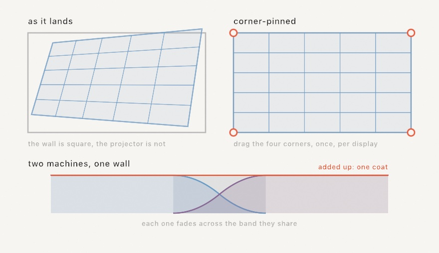
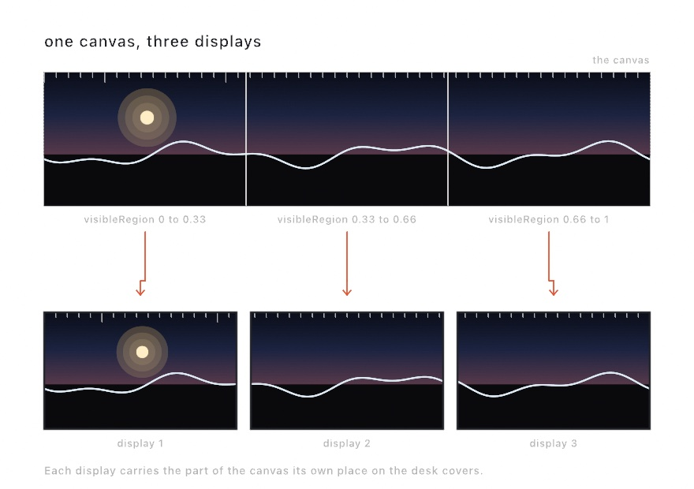
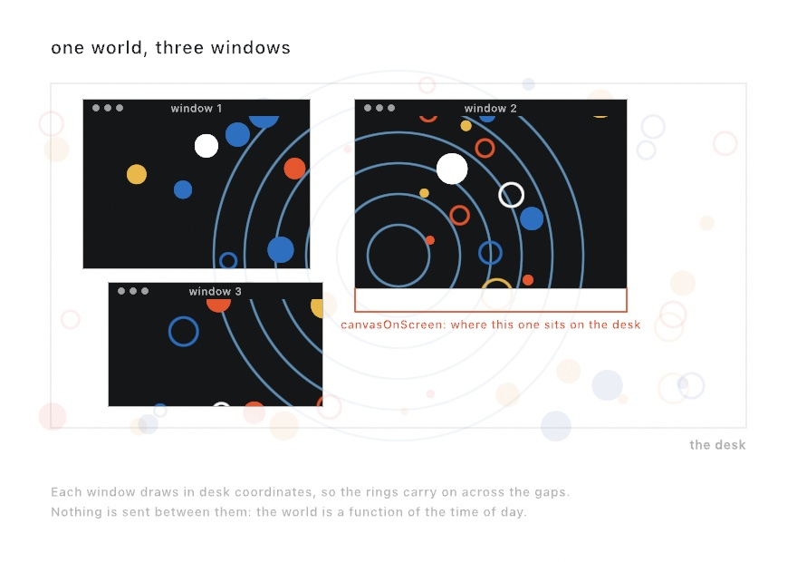

#### <sup>[Ollin](../../README.md) → [Documentation](../README.md) → [Output](./README.md) → `Installation`</sup>

---

## Running unattended

A sketch at a desk runs for one session, and you watch it. A piece on a wall runs for days with nobody there, so several things can end it. For example, the screen saver comes on, the display sleeps, somebody unplugs a monitor, or the clock the shaders read runs out of precision overnight.

Declaring an installation prevents all of that.

```swift
override var installation: Installation { .on }
```

That is the whole declaration. The window fills the screen, the pointer is hidden, and the display stays awake with the screen saver off.

Command-Q still quits, whatever the piece covers, because the menu bar is hidden rather than removed.

### What `.on` turns on

| Part | What it does |
|---|---|
| `fillsScreen` | The window covers the whole display with no title bar, and the menu bar and Dock are hidden. The canvas keeps its own proportions inside the window, centered on black. |
| `hidesPointer` | The pointer is hidden. Nobody is holding the mouse, so an arrow sitting on top of the work would only be a distraction. |
| `keepsDisplayAwake` | The display stays lit and the screen saver never starts, for as long as the piece runs. |
| `clock` | When the clock a shader reads restarts, so that a run of weeks stays exact. See [the clock](#the-clock-is-the-part-that-breaks) below. |
| `checkpoint` | How often the run saves its state, so that a relaunch resumes instead of restarting. Off until you ask for it. See [picking up where it left off](#picking-up-where-it-left-off). |
| `restarts` | Whether a run that ends badly is started again. Off until you ask for it. See [getting back up on its own](#getting-back-up-on-its-own). |
| `schedule` | The hours the piece is on screen, and the named parts of the day it can behave differently in. None until you ask for it. See [keeping hours](#keeping-hours). |
| `projection` | How the picture is shaped to fit the surface it is projected onto, and how it fades into the picture from the machine beside it. See [fitting the wall](#fitting-the-wall). |
| `displays` | Which displays this machine puts the piece on, and what each one carries. One display until you ask for more. See [several displays, one machine](#several-displays-one-machine). |

To change any part, build an `Installation` by hand. Any value you build counts as running, and `.off` is the only value that does not.

```swift
override var installation: Installation {
    Installation(fillsScreen: false)     // a window, but still left running
}
```

### The flags

You do not have to edit a sketch to try it on a wall, or to bring a wall piece back to your desk.

```sh
swift run --package-path Examples Example-Motion-Orbits --installation        # any sketch, full screen, left running
swift run --package-path Examples Example-Installation-Unattended --no-installation   # back to an ordinary window
swift run --package-path Examples Example-Motion-Orbits --displays spanning   # across every display this machine has
swift run --package-path Examples Example-Motion-Orbits --rehearse 3          # that wall, laid out on one desk
```

Use `--no-installation` while you work on the piece. Everything else about the sketch stays the same, so what you tune at your desk is what goes on the wall.

### The clock is the part that breaks

Two things go wrong with time in a long run, and the framework prevents both for you.

<picture>
  <source media="(prefers-color-scheme: dark)" srcset="../../Guide/Images/32-Installations/LongRunClock-dark.jpg">
  
</picture>

**A gap in the frames is a pause, not a jump.** The sketch clock adds up its own frame steps. Each step is capped at a quarter of a second. So the piece resumes where it left off after a display sleeps overnight, or after a window is held during a drag. The same is true after any other stall. Without the cap, the first frame back would report the whole gap as `deltaTime`. One eight-hour step would push every integrator in the sketch far past where it should be.

A quarter of a second is longer than one frame at any rate worth animating at, so a running sketch never reaches the cap. A sketch slower than four frames a second runs in slow motion, which is better than the jump.

**The clock a shader reads restarts.** Your sketch reads `time` as a 64-bit number, which stays exact for centuries. A shader reads it as a 32-bit number, which does not. One day into a run, one frame's worth of time is at the limit of what that number can resolve. The motion then becomes uneven. One week in, adding a frame does not change the number at all, so anything animated inside a shader stops.

So a piece that loops gives its shaders a clock that restarts at the end of each whole lap:

```swift
override var installation: Installation { .on }
override var loopDuration: Double? { 120 }     // two minutes a lap
```

Nothing on screen moves at the restart, because the piece is back at its start anyway. That is why the restart is tied to the loop rather than to a round number of seconds.

A sketch that does not declare a loop keeps its clock running, because there is no moment when a restart would go unseen. If you know a safe moment, say when to restart the clock, or say to leave it alone:

```swift
Installation(clock: .restarting(every: 600))   // every ten minutes
Installation(clock: .continuous)               // never
```

Pick a restart interval that is a whole multiple of the periods your shaders animate on. Otherwise, expect a visible jump at each restart. `time` itself always keeps counting, so nothing in your own `draw()` changes.

### Picking up where it left off

A piece that has been growing for three days cannot usefully be rebuilt from its seed. Getting back to the same state would mean running the three days again. So the state itself is saved, and the next launch reads it.

<picture>
  <source media="(prefers-color-scheme: dark)" srcset="../../Guide/Images/32-Installations/Resuming-dark.jpg">
  
</picture>

You declare two things: how often to save, and which properties are worth saving.

```swift
override var installation: Installation { Installation(checkpoint: .every(seconds: 60)) }

@Saved var polyps: [Vector2] = []
@Saved var generation = 0
```

That is the whole API. Every `@Saved` property is written at that interval, along with the seed, the clock, and every `@Param` value. A relaunch restores them all, and the piece carries on.

Checkpointing is off until you ask for it, even under `.on`, because restoring changes what a piece does on launch. That is right for a wall and confusing at a desk.

Nothing is ever written before the run has read the file it replaces. This matters because a quit or a stop signal can arrive before the first frame. A save at that point would replace a piece that had been growing for days with an empty run.

Anything `Codable` can be saved: numbers, strings, arrays, dictionaries, and your own structs and enums once you mark them `Codable`. Ollin's small value types (`Vector2`, `Vector3`, `Color`, `Rectangle`, `Insets`) are already `Codable`.

**Nothing that lives on the GPU can be saved.** That covers an accumulated canvas, a feedback layer, a simulation field, and a compute buffer. Those are textures the framework owns, and a checkpoint does not reach them. So a piece built on them comes back on a clean canvas.

### When the file and the sketch disagree

At some point you will edit the sketch while a checkpoint from the old version still exists. Each mismatch affects only the value it touches, and everything else still restores:

| What changed | What happens |
|---|---|
| A property renamed | Values are matched by property name, so the old value matches nothing and the starting value is used. |
| A property retyped | The old value does not decode, so the log names it and the starting value is used. Everything else still restores. |
| A property added | It gets its starting value, because the file has nothing for it. |
| The sketch renamed | The file belongs to the sketch name, so a renamed sketch starts over with an empty file of its own. |
| The canvas resized | Everything restores, and the log reports that the size changed, because only you know whether that matters. |
| The file damaged | The file is ignored and the piece starts fresh. A half-written file cannot occur anyway, because writes are atomic. |

Nothing here ever stops a piece from starting, because a gallery piece that will not start is worse than one that started over.

### Starting over, and saving by hand

```sh
swift run --package-path Examples Example-Installation-Watched --fresh
```

`--fresh` ignores the saved state without deleting it, so one clean run does not cost you the file. To delete the file for good, call `forgetCheckpoint()`. To write a checkpoint at a moment you choose, such as a key press or the end of a phase, call `saveCheckpoint()`.

The file is JSON, sorted and indented, in `~/Library/Application Support/Ollin/Checkpoints/`, one file per sketch. It is meant to be read. When a piece comes back wrong, the state it came back with is the first thing to look at.

```json
{
  "frameCount" : 4098,
  "sketch" : "Watched",
  "state" : { "runs" : [ 42.1, 3.6, 67.9 ] },
  "time" : 67.98
}
```

The save runs inside the frame it falls on, so keep the saved state to what the piece needs. Saving a hundred thousand particles will stall that frame.

### Getting back up on its own

A crash at three in the morning leaves the wall dark until somebody notices, which is usually the next day.

<picture>
  <source media="(prefers-color-scheme: dark)" srcset="../../Guide/Images/32-Installations/BackUp-dark.jpg">
  
</picture>

```swift
override var installation: Installation {
    Installation(checkpoint: .every(seconds: 60), restarts: .onFailure)
}
```

The process you start becomes a small watch process that owns no window, and the piece runs as its child. When a run ends badly, the watch starts another one. Pair it with a checkpoint, because a restart is worth most when the piece comes back where it was.

Two things count as ending badly, and an exit status cannot show the second one.

| What happened | How it is found |
|---|---|
| A crash | The run ends with a bad status, or on a signal. |
| A stall | The run is still there but no longer answering. The piece writes a heartbeat from its main thread every couple of seconds, and a main thread stuck in a frame stops writing it. A viewer sees a frozen picture while the process still looks healthy, and the heartbeat is the only thing that catches that. |

Quitting does not count as ending badly. Command-Q ends the piece and the watch together, and so does stopping the watch itself.

A piece that fails one second after it starts is broken in a way that a restart will not fix. So each try waits longer than the last. After five short runs in a row, the watch stops trying and says so in the log. One run of any real length clears that count, so a piece that fails once a week keeps running indefinitely.

A heavy `setup()` is not a stall. A piece has not answered at all until its first frame, so a start gets at least two minutes, whatever the limit says. For a piece that blocks for longer on purpose, set your own limit, or turn the stall watch off and keep the crash watch:

```swift
Installation(restarts: .onFailure(stalledAfter: 300))   // five minutes without a frame
Installation(restarts: .onFailure(stalledAfter: 0))     // crashes only, and wait for ever
```

Restarting is off until you ask for it, even under `.on`. A piece that crashes while you work on it should stay crashed, so that you can read the error. `--no-installation` turns the watch off along with everything else.

```
Ollin installation [2026-08-15 13:02:06]: watching this run; a piece that stops answering for 10s is started again
Ollin installation [2026-08-15 13:02:18]: the piece crashed (signal 9) after 12s; starting it again in 1s
Ollin installation [2026-08-15 13:02:19]: resumed the run saved at 13:02:16 (frame 596, 10s in)
Ollin installation [2026-08-15 13:02:38]: the piece has not answered for 10s; stopping it
```

### Keeping hours

A piece on a wall usually runs in a building, and a building is open only for part of the day.

```swift
Installation(schedule: .open(from: 10, to: 18))
```

Outside those hours the screen goes dark, the frames stop, and the display is allowed to sleep. In the morning the piece comes back where it stopped. The clock adds up only the frames it drew, so a night off costs it nothing. The state is saved on the way into the dark, so a piece that checkpoints also survives the night.

<picture>
  <source media="(prefers-color-scheme: dark)" srcset="../../Guide/Images/32-Installations/GalleryHours-dark.jpg">
  
</picture>

The other half of a schedule is behaving differently at different times of day. Name the parts of the day, and the sketch reads which one it is in.

```swift
override var installation: Installation {
    Installation(schedule: [.from(6, "dawn"), .from(10, "day"),
                            .from(18, "dusk"), .from(22, "night")])
}

override func draw() {
    background(scheduledPeriod == "night" ? Color(white: 0.04) : .white)
}
```

Each part runs until the next one starts, and the last part wraps around to the first. That is what makes a night that crosses midnight one part rather than two. `scheduledProgress` reports how far through the current part the day is, from 0 to 1, for a piece that changes gradually rather than switching.

An hour on its own names a time of day, and `.at(9, 30)` names a time to the minute. Times are read in the machine's own time zone.

The two halves go in one list, so you can mix them. A part with nothing on screen is `.dark(from:)`:

```swift
Installation(schedule: [.from(9, "morning"), .from(13, "afternoon"), .dark(from: 20)])
```

`scheduledPeriod` and `scheduledProgress` read the same anywhere, at a desk as much as on a wall. So you can work on a piece that changes through the day at any hour of it. Going dark is the half that needs the installation, because only a piece that owns its window can take the screen away.

### Fitting the wall

A projector is almost never square to the surface it is aimed at. It hangs from a beam, or sits on a shelf to one side. So the picture lands as a trapezoid a few degrees out of true.

<picture>
  <source media="(prefers-color-scheme: dark)" srcset="../../Guide/Images/32-Installations/FittingTheWall-dark.jpg">
  
</picture>

So the framework places the picture, rather than the window. Press **Command-K** on a running piece, drag the four corners onto the wall, and press **Command-K** again.

```sh
swift run --package-path Examples Example-Installation-Fitted --calibrate    # open with the handles up
```

| Key | What it does |
|---|---|
| **Command-K** | Shows the handles, and hides them again |
| **Drag** | Moves one corner. The picture updates while you drag |
| **Arrow keys** | Moves the selected corner by one point. Shift moves it by ten |
| **Tab** | Selects the next corner |
| **R** | Resets the picture to square |

The numbers are stored per display, not per sketch, in `~/Library/Application Support/Ollin/Calibration/`. A projector on a wall is out of true by the same amount whatever is playing. So you line it up once, and every piece you show there opens square. Delete the file to start again.

Reading that file can never stop a piece from starting. A file that is missing, unreadable, or written by an older Ollin is skipped, and the piece opens as declared.

#### Two machines on one wall

A wall longer than one projector can cover needs two projectors, each carrying part of the canvas. They overlap in the middle, and the overlap is twice as bright as the rest unless each projector fades out across it.

```swift
// The machine on the left.
Installation(projection: .init(visibleRegion: Rectangle(x: 0, y: 0, width: 0.6, height: 1),
                               blend: Insets(right: 0.2)))
// The machine on the right.
Installation(projection: .init(visibleRegion: Rectangle(x: 0.4, y: 0, width: 0.6, height: 1),
                               blend: Insets(left: 0.2)))
```

`visibleRegion` is the part of the canvas this machine carries, in fractions of the canvas. `blend` is how far the fade reaches in from each edge, in the same fractions.

The units are the same on purpose. Both machines are told about the same fifth of the same canvas. So both machines compute the same fade across the same part of the wall, and the two fades add up to exactly one coat.

The fade is applied to light rather than to a pixel value, which is what makes the sum exact. `gamma` tells Ollin what your projector does with the standard curve, and 2.2 is that curve. Change it when a lined-up overlap still looks brighter or darker than the picture beside it.

#### What it does and does not touch

A fitted window fills the display, and the canvas keeps its own proportions inside it. So a square canvas on a wide screen looks the same as it always did until you drag a corner.

The pointer goes through the warp in reverse, so a piece being lined up still reads `mouseX` in its own canvas coordinates.

Exports are never warped. A file has no wall to fit, and the frames a piece writes out are the canvas itself. The same goes for a Syphon feed, since the software receiving it does its own mapping.

The canvas renders at its own proportions, as large as the display allows. Dragging the corners wider than that stretches what has already been drawn, so a piece meant for a wide wall should declare a wide canvas.

### Several displays, one machine

A wall wider than one projector needs more than one beam, and a machine with two outputs can carry both itself.

```swift
override var installation: Installation {
    Installation(displays: .spanning)
}
```

That spreads one canvas over every display the machine has, in the arrangement they are in. Two monitors side by side carry half each. Two monitors one above the other carry a horizontal band each. A display twice as wide as the one beside it carries twice as much. You declare no numbers, because the display arrangement already holds all of them.

<picture>
  <source media="(prefers-color-scheme: dark)" srcset="../../Guide/Images/32-Installations/ManyDisplays-dark.jpg">
  
</picture>

The gap between two monitors is given a part of the canvas that nobody sees, because that is how the arrangement looks from in front. The alternative is a picture with a piece cut out of the middle.

The piece itself knows none of this. It draws one canvas, and the wall decides which part of that canvas each display carries.

| Value | What it does |
|---|---|
| `.one` | The display the piece opens on. This is the default |
| `.spanning` | One canvas over every display, in the arrangement they are in |
| `.mirroring` | The whole canvas on every display, for a row of screens or a corridor |
| `.parts([...])` | One declaration per display, left to right and then top to bottom |

`.parts` is the form for a wall that is not a plain arrangement of monitors. The usual case is two projectors overlapping in the middle, which is the two-machine declaration above with both halves on one machine:

```swift
Installation(displays: .parts([
    .init(visibleRegion: Rectangle(x: 0, y: 0, width: 0.6, height: 1), blend: Insets(right: 0.2)),
    .init(visibleRegion: Rectangle(x: 0.4, y: 0, width: 0.6, height: 1), blend: Insets(left: 0.2)),
]))
```

A display past the end of the list stays dark. A declaration past the end of the displays is ignored.

You can combine the two. A machine that carries part of a longer wall divides that part between its own displays. So four projectors on two machines is two declarations of two parts each. `visibleRegion` on the machine's own `projection` is the region it carries, and the wall divides that region rather than the whole canvas.

#### Lining up a wall

**Command-K** shows the handles on every display at once, because a wall is lined up as one thing. The keys that move a corner go to the display you last clicked on. Each display's corners are stored under its own identifier, so a wall lined up once opens square for every piece shown on it.

#### Rehearsing a wall you have not built

You usually see the wall for the first time in the room where it is going up. Before then, you can see what each display will carry:

```sh
swift run --package-path Examples Example-Installation-ManyDisplays --rehearse 3
```

That opens one window per part on the desk you are at, side by side, each carrying its own part of the canvas. It shows the layout rather than the light. Two beams sharing a band add up to one coat, but two windows sharing a band would only cover each other. Nothing you drag in a rehearsal is kept, because those windows stand for displays that are not there.

#### What it costs

The piece is drawn once per frame, however many displays it goes on. The size it is drawn at grows instead. A projector that carries half the canvas at its own resolution needs the whole canvas drawn at twice that resolution. Four displays in a row need four times the canvas that one of them would. The canvas is capped at the largest size a texture can be, and the log reports the cap when a wall reaches it.

The run is paced by the display the piece is drawn in. A display with a different refresh rate shows the frames as they arrive. The pointer belongs to that display too, so a piece that reads `mouseX` reads it there.

When a mapping application already owns the wall, use [Syphon](../Integration/Syphon.md) instead. That works the other way round: the piece sends its frames out, and the application places them.

### Displays that change under you

A monitor that is unplugged, plugged back in, or set to a new resolution reaches the piece as a burst of notifications. There can be dozens in a second. Ollin waits for the burst to end first. Then it puts the piece back on a screen that still exists, and retimes the draw loop to the refresh rate of that screen. So a piece moved from a 60 Hz panel to a 120 Hz one asks for the right rate from then on.

Waking from sleep is handled the same way. The assertion that keeps the display awake is requested again, because it does not always survive a sleep.

### The log

An unattended run writes a log to stdout, and each line is time-stamped and flushed immediately. That log is the only record a piece running for a week has.

```
Ollin installation [2026-08-15 08:41:45]: running unattended; Command-Q quits
Ollin installation [2026-08-15 08:41:46]: the displays changed: now 1 (1680x1050)
Ollin installation [2026-08-16 03:12:08]: the screens woke
```

Send it somewhere you can read later:

```sh
swift run --package-path Examples Example-Installation-Unattended >> ~/piece.log 2>&1
```

### Where it applies

The declaration is read when a sketch opens its own window, which is the `swift run Example-X` path and any sketch with `@main`. The live host and the examples gallery own their windows and their own chrome, so a sketch under them stays in their window. Tune the sketch there, then run it on its own to put it on the wall.

One loose file goes up the same way. A single `.swift` file has no target of its own. The host that usually runs it is the live host, which owns the window. The flag gives the sketch a window of its own:

```sh
ollin Piece.swift --installation
```

The file is compiled once, and the sketch is given the window. Every part in the table above then applies to it. It does not reload on save, and that is deliberate, because a piece on a wall runs the code it was started with. Work on it in the live host (`ollin Piece.swift`, no flag), then put it up. See [Single-file sketches](../Tools/SingleFile.md).

Exports open no window, so none of the window parts apply to them. The clock restart does apply to an export, because it belongs to the sketch rather than to the window. It falls on a whole lap there too.

### Several windows, one world

A piece is not always one window. If you run the same sketch more than once, each run opens its own window on the same desk.

`canvasOnScreen` reports where this canvas sits on the desk, in screen points, measured from the top-left corner of the main screen, downward. Every window describes the same desk in the same numbers, so each one can draw its own part of a single world:

<picture>
  <source media="(prefers-color-scheme: dark)" srcset="../../Guide/Images/32-Installations/OneWorldManyWindows-dark.jpg">
  
</picture>

```swift
guard let mine = canvasOnScreen else { return }
let onCanvas = worldPoint - Vector2(mine.x, mine.y)     // the desk, seen from here
```

`screenFrame` gives the frame of the screen the window is on, which is a natural size for the world itself. Both read `nil` in an export, where there is no window.

Keeping separate programs in step is the harder half. The cheapest answer needs no messages at all. Make the world a function of the time of day. Every window reads the same clock, so none of them can disagree.

### See also

- [`Export`](./Export.md) for writing frames, video, and vectors out of a piece.
- [`Sketch`](../Core/Sketch.md) for `loopDuration` and the rest of the declared configuration.
- [`Canvas`](../Core/Canvas.md) for how the canvas and the window relate, which is what lets a 1080 square fill a wide screen without distorting.
- The [Unattended example](../../Examples/Installation/Unattended/Sketch.swift), and the [Watched example](../../Examples/Installation/Watched/Sketch.swift), which remembers its runs through `@Saved` and comes back from a crash.
- The [Fitted example](../../Examples/Installation/Fitted/Sketch.swift), a piece with marks on it that you line the corners up against.
- The [ManyWindows example](../../Examples/Installation/ManyWindows/Sketch.swift), one world seen through as many windows as you open.
