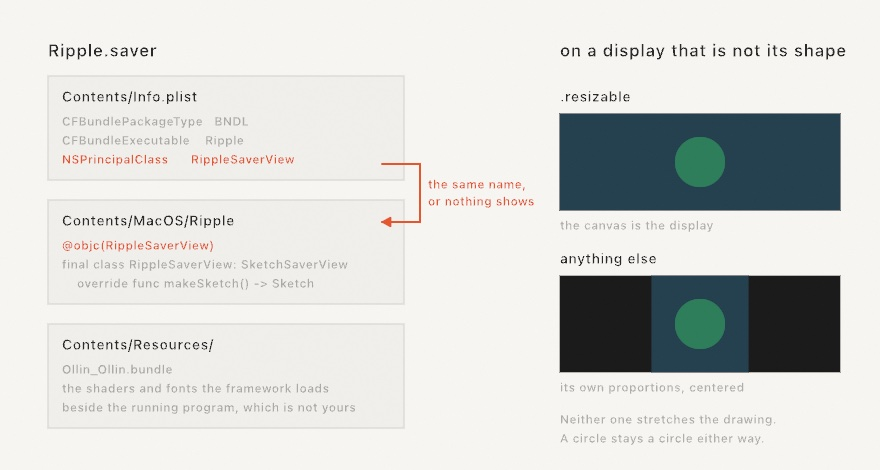

#### <sup>[Ollin](../../README.md) → [Documentation](../README.md) → [Output](./README.md) → `Screen saver`</sup>

---

## A sketch as the machine's screen saver

The window is one place a sketch can live. The system is another. A screen saver puts the work where it is seen without anybody opening anything. On your own machine when you step away, and on somebody else's after you hand it over.

```sh
ollin new Ripple --kind screen-saver
cd Ripple && ./build.sh --install
```

Then open System Settings, go to Screen Saver, and pick it out of the list. That is the whole path.

### What you get

```
Ripple/
  Package.swift              builds a plug-in rather than a program
  Info.plist                 the name the system asks for
  build.sh                   wraps the built binary in Ripple.saver
  Sources/Ripple/
    Sketch.swift             an ordinary sketch
    SaverView.swift          six lines: the class the system loads
```



`SaverView.swift` is the whole of the wiring:

```swift
import Foundation
import Ollin

@objc(RippleSaverView)
final class RippleSaverView: SketchSaverView {
    override func makeSketch() -> Sketch { Ripple() }
}
```

`SketchSaverView` is the framework's host. It builds the canvas when the system starts the saver. It drives the frames off the display's own clock, and puts everything away when the saver is over. Overriding `makeSketch()` is all it asks of you.

### The sketch is an ordinary sketch

Everything you would write in a window works here. `time`, `frameCount`, `random`, the whole drawing surface, 3D, shaders, effects. Two things are different, and both come from the setting rather than from the framework.

**It gets no input.** A key or a click ends a screen saver. That is the contract. A canvas that answered the click would be a canvas that ate it, leaving somebody hammering at a machine that will not come back. So the canvas stays out of the event path entirely: `mouseX`, `mouseY`, `mouseIsPressed`, and `key` hold whatever they started at.

**It cannot write files.** The system loads a screen saver into a sandbox that can read anything and write almost nothing. Loading is fine: pictures, fonts, meshes, and clips all open as they always did. Writing is not, so `--export`, a recorded take, and a saved checkpoint have no place in a saver. None of them makes sense in one anyway.

### Filling the display, or fitting it

A display is almost never the shape of a canvas. Which of the two you get is the sketch's own `windowMode`, exactly as it is in a window:

| The sketch says | On the display |
|---|---|
| `windowMode` is `.resizable` | The canvas *is* the display. `width` and `height` are the screen's, and the drawing fills it. |
| anything else | The canvas keeps its own proportions, as large as fits, centered on black. |

`ollin new` writes `.resizable` into the generated sketch, because a screen saver filling the screen is what people mean by one. Take the line out and a square sketch stays square, with black either side of it.

```swift
final class Ripple: Sketch {
    override var windowMode: WindowMode { .resizable }
    ...
}
```

A fitted canvas goes through the same present pass a projector goes through, so it is scaled once, at its own proportions, and never stretched.

### Working on it

A screen saver is a slow way to look at a change: build, install, wait. Do the work in a window, where it reloads as you save, and install when it looks right.

```sh
ollin Sources/Ripple/Sketch.swift
```

The file is the same file either way.

### Building it again

```sh
./build.sh              # build Ripple.saver here
./build.sh --install    # build it and put it on this machine
```

The script builds the package, wraps the binary in the `.saver` folder, copies the framework's own files in beside it, and signs the result. Installing copies it to `~/Library/Screen Savers` and tells the host process to let go of the old one, so the next preview is the new build.

Three details in there are worth knowing, because each is a way a saver fails quietly:

- **The framework's files travel inside the saver.** Shader segments, fonts, and tables are looked for beside the running program, and the running program belongs to the system, not to you. So they are copied into the saver's own `Resources`.
- **It has to be signed.** The system refuses to load an unsigned plug-in. The script signs it for this machine.
- **The name in `Info.plist` and the `@objc` name have to match.** They are the only link between the two files. A mismatch installs, appears in the list, and shows the wrong thing or nothing at all.

### Giving it to somebody else

The signature `build.sh` applies is good on the machine that made it. Another Mac will refuse it. For that the saver needs a Developer ID signature and a trip through notarization, the same as any app you hand out:

```sh
codesign --force --sign "Developer ID Application: Your Name (TEAMID)" \
    --timestamp --options runtime Ripple.saver
```

Notarizing wants the saver inside a container, so put it in a `.zip` or a `.dmg`, submit that, and staple the result back onto the bundle:

```sh
xcrun notarytool submit Ripple.zip --keychain-profile "AC" --wait
xcrun stapler staple Ripple.saver
```

Then anybody can drop it into `~/Library/Screen Savers`.

### Several displays

The system builds one saver for each display, so each screen runs its own copy of your sketch from its own first frame. They do not share a clock and they are not in step. A piece that has to line up across two screens is an [installation](./Installation.md) rather than a screen saver. That one is built for a wall, with the displays laid out and the picture fitted across them.

---

## See also

- [Installation](./Installation.md) - the other way a piece runs unattended, for a wall rather than a desk
- [The project generator](../Tools/ProjectGenerator.md) - the kinds of project `ollin new` writes, this one among them
- [Single-file sketches](../Tools/SingleFile.md) - the smallest thing that is a whole sketch
- [Export](./Export.md) - leaving with a picture instead
