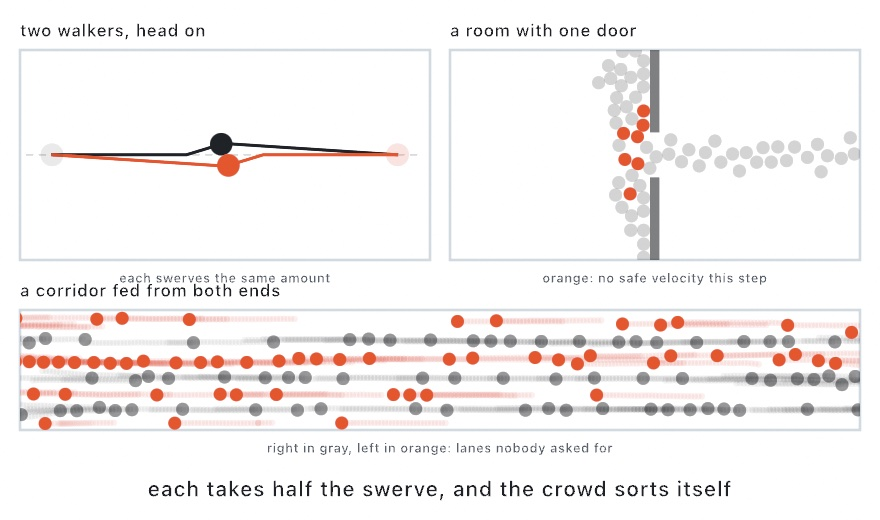

#### <sup>[Ollin](../../README.md) → [Documentation](../README.md) → [Simulation](./README.md) → `Crowds`</sup>

---

## Crowds

`Crowd` is a crowd of walkers that make room for each other. Every walker wants to go somewhere. Each step, it takes the velocity closest to that wish that keeps it clear of everyone nearby for the next second. It trusts each neighbor to do half of the avoiding. That trust is the method, optimal reciprocal collision avoidance. Both sides of every pair move by half, so nobody overcorrects, and a crowd passes through itself without a flock's shoving. It runs on the CPU. A run depends only on what you added, the settings, the seed, and the intervals you advance by, so an export replays it exactly.

<picture>
  <source media="(prefers-color-scheme: dark)" srcset="../../Guide/Images/12-FlocksAndSwarms/MakingRoom-dark.jpg">
  
</picture>

### Contents

- [Quick start](#quick-start)
- [How a walker chooses](#how-a-walker-chooses)
- [What it promises](#what-it-promises)
- [Walkers](#walkers)
- [Where they want to go](#where-they-want-to-go)
- [Obstacles and walls](#obstacles-and-walls)
- [Settings](#settings)
- [Notes](#notes)

<a name="quick-start"></a>

### Quick start

Sixty walkers in a ring, each crossing to the spot straight across:

```swift
let crowd = Crowd()

override func setup() {
    for i in 0 ..< 60 {
        let spot = center + Vector2(angle: Double(i) / 60 * .tau, length: 440)
        crowd.add(at: spot, goal: center - (spot - center))
    }
}

override func draw() {
    crowd.advance()
    background(.white)
    fill(.black)
    drawCrowd(crowd)
}
```

They converge on the middle, jam there for a few seconds, work their way through, and all arrive in about thirteen seconds. The middle gets crowded enough that some walkers find no safe velocity for a while. Those are the only ones that overlap, and only by a small part of a radius.

<a name="how-a-walker-chooses"></a>

### How a walker chooses

For each neighbor, a walker finds the velocities that would bring the two of them into contact within `timeHorizon` seconds. Seen in velocity space, those velocities form a cone. The walker finds the smallest change to the pair's relative velocity that leaves the cone, and draws a line halfway along that change. It permits itself the velocities on the far side of the line, and the neighbor draws the matching line for the other half. With a line for every neighbor, the walker picks the permitted velocity closest to the one it wants, no faster than its `maxSpeed`. That choice is a small linear program, solved by adding the lines one at a time. Every walker chooses from where everyone was before anyone moves.

<a name="what-it-promises"></a>

### What it promises

- **While every walker finds a permitted velocity, no two walkers overlap.** Two walkers on a collision course each give up half of the change that clears it. If both otherwise hold their course, they pass at exactly the sum of their radii.
- **In a jam there may be no permitted velocity.** A crowd packed against a door, or a knot where streams meet, can leave a walker with lines it can't all satisfy. Then it takes the velocity that sits least far past any of them, and its `isJammed` is `true` for that step. That's the only time two walkers can overlap. The overlap is a small part of a radius, and the next steps undo it as the jam loosens.
- **Walls are never relaxed.** An obstacle doesn't move, so a walker takes all of the avoiding for it. Those lines are kept even in a jam, and a walker never passes through an obstacle or a wall.
- **Obstacles don't route anyone.** They keep walkers out; they don't lead a walker around them. A walker on the far side of a wall from its goal needs a goal, or a `preferredVelocity`, that leads it there. For a room, that's the door first and the room beyond once through.

<a name="walkers"></a>

### Walkers

`crowd.agents` is an array of `Crowd.Agent`, built as `Agent(at:goal:radius:maxSpeed:group:)`, and you can add, remove, and change agents between steps as you like. `add(at:goal:radius:maxSpeed:group:)` appends one and returns its index.

- **`position`** is where the walker's center is.
- **`velocity`** is the velocity it took on the last step, in points per second. It starts at zero. Setting it is a shove the walker then corrects.
- **`goal`** (default `nil`) is where it's headed. A walker with no goal stands where it is, and still steps aside for anyone coming through.
- **`radius`** (default `8`) is its size in points.
- **`maxSpeed`** (default `120`) is its top speed in points per second.
- **`group`** (default `0`) is a number of your own: which door it came in by, which team it's on. The crowd carries it untouched.
- **`isJammed`** says whether no permitted velocity existed for it on the last step. Read it to draw the pressure in a crowd.

`drawCrowd(_:)` draws every walker as a circle of its radius with the current `fill` and `stroke`, and `count` is the number of walkers.

<a name="where-they-want-to-go"></a>

### Where they want to go

By default a walker's wish is its goal at full speed. It never overshoots, because the last step lands exactly on the goal. With `slowingRadius` above 0, it eases down to a walk as it comes within that distance.

`preferredVelocity` replaces goals with a rule of your own. The crowd calls it once for every walker on every step, and it returns the velocity that walker would take with nobody in its way. That's how to send a stream along a corridor, steer by a flow field, or aim at a door until through it:

```swift
crowd.addObstacle(Rectangle(x: 530, y: 0, width: 20, height: 500))
crowd.addObstacle(Rectangle(x: 530, y: 580, width: 20, height: 500))
crowd.preferredVelocity = { walker in
    let p = walker.position
    let target = p.x < 540 ? Vector2(540, 540) : Vector2(1200, p.y)
    return (target - p).normalized * walker.maxSpeed
}
```

Set it back to `nil` to return to goals.

<a name="obstacles-and-walls"></a>

### Obstacles and walls

- **`addObstacle(_:)`** takes a closed outline as `[Vector2]` or a `Rectangle`. Either winding works, and walkers are kept outside it. A walker shouldn't start inside one.
- **`addWall(_:)`** takes a polyline, and **`addWall(from:to:)`** a straight segment: a barrier with no thickness that walkers keep off from either side, bends included.
- **`removeAllObstacles()`** clears both kinds.
- **`obstacles`** and **`walls`** read back what you added, as you gave it, so you can draw them.

An obstacle's edges are kept in a grid, so a walker reads only the edges near it. Adding or removing obstacles between steps is cheap.

<a name="settings"></a>

### Settings

`Crowd(timeHorizon:obstacleTimeHorizon:perceptionRadius:maxNeighbors:seed:)` makes an empty crowd. Each setting is also a property you can change while it runs.

- **`timeHorizon`** (default `1`) is how far ahead a walker looks at other walkers, in seconds. A longer horizon turns earlier and more smoothly, but gives up more of what each walker wants. In a dense crowd it can stall everyone: a ring of 96 crossing to its far side at `4` stops a third of the way in. A shorter horizon walks straighter and swerves later. Every walker shares it, which the half-and-half trust depends on.
- **`obstacleTimeHorizon`** (default `0.5`) is the same for obstacles. It's usually shorter, so a walker isn't shy of a wall it's walking beside.
- **`perceptionRadius`** (default `100`) is how far away another walker can be and still be considered, in points. It has to be comfortably more than two radii, or walkers only notice each other once they touch.
- **`maxNeighbors`** (default `10`) is the most neighbors each walker considers, nearest first.
- **`slowingRadius`** (default `0`) is the distance from its goal at which a walker starts to slow.
- **`jitter`** (default `0.05`) shakes each moving walker's wish by that fraction of its top speed every step. Without it, a perfectly symmetric start like the ring can meet in a knot that nothing else undoes, because a jammed walker's choice no longer depends on what it wants. The shake makes walkers arrive out of step, so the knot never closes. At a top speed of 120 it wanders a path by less than a point a second. Set it to `0` for a run with no randomness at all.
- **`seed`** picks the jitter, so the same seed replays the same run.

<a name="notes"></a>

### Notes

- `advance(by:)` splits its interval into equal steps of at most a sixtieth of a second. `advance()` is one 60 fps frame, and two sixtieths are the same run as one thirtieth.
- Speeds are points per second, not per frame, so a walker's pace doesn't depend on the frame rate.
- Draw a crowd over an accumulating canvas with a translucent sheet each frame, and a still shows which way everyone is moving. A plain still only shows where they are.
- Two opposing streams sort themselves into lanes, and a narrow door drains more slowly than a wide one. Both come out of the rule, not out of any code for them.
- The [Crowd example](../../Examples/Simulation/Crowd/Sketch.swift) has four scenes: a door, a corridor of opposing streams, four streams crossing, and the ring. Jammed walkers are ringed in orange, and the horizon, the door, and the rate are on sliders.
