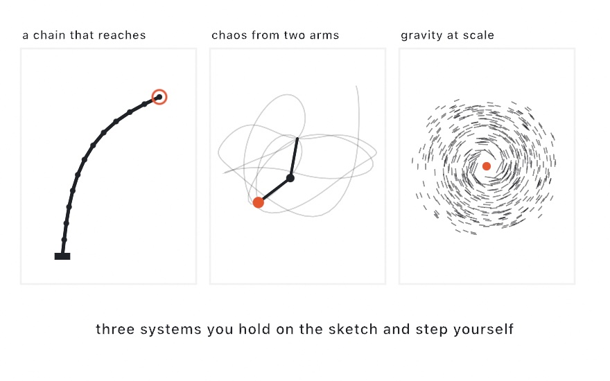

#### <sup>[Ollin](../../README.md) → [Documentation](../README.md) → [Simulation](./README.md) → `Articulated & chaotic motion`</sup>

---

## Articulated & chaotic motion

This page covers three CPU motion systems. You hold each one on the sketch and drive it each frame. `IKChain` is an inverse-kinematics chain that reaches (tentacles, limbs, ropes). `DoublePendulum` is the double pendulum, the classic chaotic system. `NBody` is a gravitational n-body simulation (orbits, galaxies, collisions). All three are deterministic: there is no hidden randomness, the iteration orders are fixed, and the n-body factories draw from a seed. So a run replays exactly, and a fixed-frame export reproduces the same frames.

These systems fit with the other motion helpers. The [strange attractors](../Drawing/Attractors.md) are the *baked-orbit* side of chaos, because you build the orbit once and then draw the path. `DoublePendulum` and `NBody` are the *live* side, which you advance and watch. The [`@Sprung` damped spring](../Helpers/Animation.md#sprung) is a third motion helper you can use alongside these.

<picture>
  <source media="(prefers-color-scheme: dark)" srcset="../../Guide/Images/11-ForcesAndPhysics/Articulated-dark.jpg">
  
</picture>

### Contents

- [Quick start](#quick-start)
- [`IKChain`: chains that reach](#ik)
- [`DoublePendulum`: chaos from two arms](#pendulum)
- [`NBody`: gravity at scale](#nbody)

<a name="quick-start"></a>

### Quick start

A tentacle that follows the mouse:

```swift
let arm = IKChain(from: Vector2(540, 1040), segments: 14, length: 36)

override func draw() {
    background(.white)
    arm.reach(toward: Vector2(mouseX, mouseY))
    noFill()
    stroke(.black)
    strokeWeight(6)
    drawPolyline(arm.joints)
}
```

A double pendulum tracing its second bob:

```swift
let pendulum = DoublePendulum()
var trail: [Vector2] = []

override func draw() {
    background(.white)
    pendulum.advance()
    withState {
        translate(width / 2, height / 3)
        trail.append(pendulum.bob2)
        stroke(Color.black.withAlpha(0.4)); strokeWeight(2)
        if trail.count > 1 { drawPolyline(trail) }
        stroke(.black); strokeWeight(4)
        drawLine(.zero, pendulum.bob1)
        drawLine(pendulum.bob1, pendulum.bob2)
    }
}
```

A spinning toy galaxy:

```swift
let galaxy = NBody.disk(count: 2000, center: Vector2(540, 540), radius: 380)

override func draw() {
    background(.black)
    galaxy.advance()
    noStroke()
    fill(.white)
    for p in galaxy.positions { drawCircle(center: p, radius: 2) }
}
```

<a name="ik"></a>

### `IKChain`: chains that reach

An `IKChain` is a run of rigid segments joined end to end. You can make one from explicit points with `IKChain(joints:)`, which takes each segment length from the spacing of the points. You can also lay one out straight with `IKChain(from:segments:length:angle:)`. Then move it with one of two methods:

- **`reach(toward:)`** keeps the base in place and bends the chain so the tip moves toward the target. This is the limb move. It returns whether the tip landed within `tolerance`, because a target can be out of reach, or stiffness can make it unreachable. It takes optional `iterations:` (default 10) and `tolerance:` (default 1) parameters. A target beyond the chain's `totalLength` stretches the chain straight toward the target in one pass.
- **`drag(to:)`** pins the *tip* to the target and lets the rest of the chain trail after it, base included. This is the rope move. It has no iteration count, and it is cheap enough to call every frame.

`moveBase(to:)` moves the whole pose, unchanged, to a new anchor. Use it for a chain mounted on a moving creature. To draw the chain, read `joints`. A `drawPolyline` over those points is the simplest body. The chain also exposes `tip`, `base`, `lengths`, and `totalLength`.

Each call starts solving from the current pose. So a chain moves smoothly from frame to frame instead of snapping between solutions.

**Two solvers.** `chain.solver` picks the algorithm `reach` uses, and the choice is about the look of the motion:

- **`.fabrik`** (the default) alternates a tip-to-base pass and a base-to-tip pass. Each pass places every joint again at its segment length. The motion spreads evenly along the chain, so poses come out smooth and plant-like.
- **`.ccd`** turns one joint at a time to aim the tip, sweeping from the joint nearest the tip down to the base. It favors the joints near the tip, so the chain whips and curls. `maxTurn` limits the turn (in radians per joint per sweep), which damps the swing and gives smoother motion without kinks.

Both solvers honor **`maxBend`**, the stiffness limit. It is the largest angle a segment may fold against its neighbor. The solver enforces it at every interior joint while it solves, never as a correction afterward, so segment lengths stay exact. Low values make stiff rods and spines, and `nil` (the default) lets the chain bend freely. Stiffness can put a reachable target out of reach. In that case the solve settles as close as it can and reports `false` instead of looping forever.

The [InverseKinematics example](../../Examples/Motion/InverseKinematics/Sketch.swift) plants five tentacles under a swimming lure, with `maxBend` and the solver choice live.

<a name="pendulum"></a>

### `DoublePendulum`: chaos from two arms

A `DoublePendulum` is two point masses on rigid arms, swinging under gravity. It is the simplest system with chaotic motion. You configure it when you create it, then call `advance()` each frame. The settings are `length1` and `length2` in canvas units, `mass1` and `mass2`, and the starting `angle1` and `angle2`. The angles are in radians, measured from hanging straight down. You can also give starting velocities and a `gravity`. The default `gravity` treats 100 canvas units as one meter.

Read positions through **`bob1`** and **`bob2`**. Both are relative to the pivot, with y pointing down. So drawing is a `translate` to the pivot and two lines. `bob2` is the point to trace, because the chaotic motion happens at the end of the second arm.

`advance(by:)` defaults to one 60 fps frame. It splits the interval into fixed substeps, sized so the integration holds energy steady. You can check that with the `energy` property, which stays almost exactly constant. This has two consequences:

- **Determinism:** if you call `advance()` with the default every frame, the whole run is a pure function of the starting angles. The same start replays the same motion. A start a ten-thousandth of a radian away diverges into a different motion within seconds. That sensitivity is the classic demonstration of chaos, and the [DoublePendulum example](../../Examples/Motion/DoublePendulum/Sketch.swift) draws it as a fan of 24 pendulums.
- **Wall-clock timing:** passing a live `deltaTime` follows the wall clock instead, so the run is no longer exactly reproducible. For exports and snapshots, keep the default.

<a name="nbody"></a>

### `NBody`: gravity at scale

In an `NBody`, every body pulls on every other body. That one rule produces orbits, spiral shear, tidal tails, and mergers. `NBody` holds a public `bodies` array of `NBody.Body` values, each with `position`, `velocity`, and `mass`. You may change the array freely between steps. `step()` advances the whole system.

Three parameters shape the physics:

- **`gravity`** (default `1`) is the gravitational constant. It sets the overall pace of the simulation, and it is the only parameter that does.
- **`theta`** (default `0.7`) sets the accuracy of the far field. Forces run through a quadtree. Inside that tree, a clump of distant bodies acts as a single point when its region looks smaller than `theta` times its distance. That approximation is what makes a few thousand bodies cheap. Use `0` for the exact all-pairs sum, `0.5` when the error shows in the motion, and `1` for speed over accuracy.
- **`softening`** (default `4`) caps how hard a close encounter pulls. So a near-collision swings through smoothly instead of flinging a body off to infinity. A value of a few pixels, about the typical body spacing, looks right.

The integrator is the standard leapfrog for gravity. It holds orbital energy bounded over long runs instead of letting orbits slowly decay, and it costs one force pass per step. Keep the interval fixed from frame to frame, because a fixed interval is part of what keeps orbits stable. The default is one 60 fps frame.

Two seeded factories set up the classic scenes:

- **`NBody.disk(count:center:radius:...)`** builds a spinning disk around a heavy central body, which is `bodies[0]`. Each light body starts on the circular orbit for its radius. `spin` flips the direction, `jitter` roughens the orbits, and `velocity` moves the whole disk. That last parameter is how you set up a two-galaxy encounter: build two disks, then append one disk's `bodies` to the other's.
- **`NBody.cluster(count:center:radius:...)`** scatters bodies at rest. They collapse inward, swing through, and spread out into a bound swarm.

Read `positions` for drawing. Read `centerOfMass` to keep a camera or a `translate` anchored on the action as it drifts. The [NBody example](../../Examples/Motion/NBody/Sketch.swift) sets up two galaxies on a bound grazing orbit. It draws small additive points, so the arms glow where they cross.
