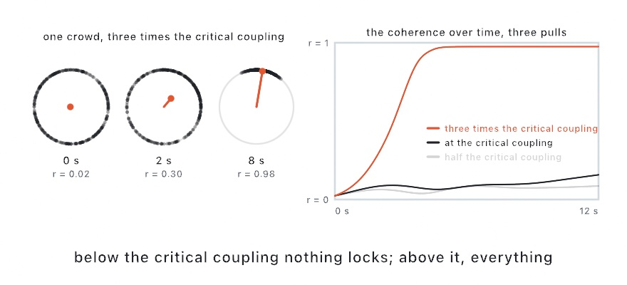

#### <sup>[Ollin](../../README.md) → [Documentation](../README.md) → [Simulation](./README.md) → `Coupled oscillators`</sup>

---

## Coupled oscillators

`Kuramoto` is Kuramoto's model of synchronization. A crowd of oscillators each runs at its own natural pace, and each is pulled toward the phase of the others. Weakly coupled, they drift apart and the crowd is incoherent. Past a critical coupling a locked group forms and grows, and the crowd falls into step. It is the model behind fireflies flashing together, crickets chirping in unison, pacemaker cells, a footbridge swaying under a crowd, and the pendulum clocks Huygens found beating together on one wall. You hold one on the sketch, advance it each frame, and read its phases to draw. It runs on the CPU, and a run is a pure function of its seed and parameters, so an export replays it exactly.

<picture>
  <source media="(prefers-color-scheme: dark)" srcset="../../Guide/Images/12-FlocksAndSwarms/Fireflies-dark.jpg">
  
</picture>

### Contents

- [Quick start](#quick-start)
- [The rule](#the-rule)
- [Reading the crowd](#reading-the-crowd)
- [Parameters](#parameters)
- [On a ring](#on-a-ring)
- [On a lattice](#on-a-lattice)
- [On a graph of your own](#on-a-graph)
- [Where the crowd has locked](#local-coherence)
- [Several oscillators per site](#layers)
- [Notes](#notes)

<a name="quick-start"></a>

### Quick start

Three hundred fireflies, each glowing by its phase:

```swift
let sync = Kuramoto(count: 300, coupling: 2, seed: 7)
var spots: [Vector2] = []

override func setup() {
    spots = (0 ..< 300).map { _ in Vector2(random(width), random(height)) }
}

override func draw() {
    sync.advance()
    background(.black)
    noStroke()
    for (i, phase) in sync.phases.enumerated() {
        fill(Color(white: (1 + cos(phase)) / 2))
        drawCircle(center: spots[i], radius: 6)
    }
}
```

Watch it for a few seconds. At a coupling of 2 against the default spread, the crowd locks and the dots brighten together. Set the coupling to 0.5 and they never do.

<a name="the-rule"></a>

### The rule

For an oscillator with natural frequency `w`, its phase advances at `w + coupling * r * sin(meanPhase - phase - lag)`. Here `r` and `meanPhase` are the crowd's own order parameter, described below, so every oscillator is pulled toward the crowd's phase, and harder the more coherent the crowd already is. That is Kuramoto's mean-field form, and it is what makes the model cheap: one pass over the crowd, however large, rather than one over every pair. The integration is fixed substeps of at most 1/240 of a second, so a bigger interval costs more substeps rather than accuracy, and every phase is kept in `0 ..< 2 * .pi`.

When an oscillator listens to a list of neighbors instead, on a [ring](#on-a-ring), a [lattice](#on-a-lattice), or a [graph](#on-a-graph), the pull is `coupling` times the average over the list of `sin(neighbor - phase - lag)`. The average is what keeps `coupling` meaning the same per neighbor whether a site has four neighbors or forty.

<a name="reading-the-crowd"></a>

### Reading the crowd

- **`phases`** is every oscillator's phase in radians. Read it to draw: a firefly glows by `(1 + cos(phase)) / 2`, a dot sits on a circle at its phase, a pendulum swings by `sin(phase)`. Set an entry to kick one oscillator.
- **`coherence`** is the order parameter r, the length of the mean of every phase's unit vector: 0 when the phases are spread evenly around the circle, 1 when they all agree. It is the measure to watch as a crowd locks.
- **`meanPhase`** is the direction of that mean vector, the phase of the crowd as a whole, which a locked crowd shares.
- **`localCoherence`** is the same measure taken over each oscillator's own neighborhood, one value per oscillator, described [below](#local-coherence).
- **`criticalCoupling`** is the coupling at which a locked group first forms, for the normal spread of natural frequencies the crowd was made with: `spread * sqrt(8 / pi)`, from Kuramoto's `2 / (pi * g(0))` with `g` the frequency distribution. Below it the crowd stays scattered however long it runs. A few times above it, the crowd locks nearly whole. Identical oscillators, a spread of 0, lock at any coupling.
- **`frequencies`** is every oscillator's natural pace in radians per second. Set it to hand the crowd a spectrum of your own, two clusters or a chord; `criticalCoupling` keeps describing the spread the crowd was made with.
- **`neighbors`** is who pulls on whom, one list of site indices per site, or `nil` under the mean field. On a ring or a lattice the lists are derived from `range`; set the property to hand the crowd a graph of your own.
- **`count`** is the number of oscillators, **`sites`** the number of sites, which differ only when there are several [layers](#layers). **`lattice`** is the lattice a crowd was laid on, or `nil`.

<a name="parameters"></a>

### Parameters

`Kuramoto(count:coupling:frequency:spread:lag:range:seed:)` makes a crowd of `count` oscillators at random phases. `Kuramoto(columns:rows:layout:wraps:layers:coupling:frequency:spread:lag:range:layerCoupling:seed:)` lays the crowd on a lattice, and `Kuramoto(neighbors:layers:coupling:frequency:spread:lag:layerCoupling:seed:)` couples it over a graph. The parameters they share:

- **`coupling`** (default `1`) is how hard the crowd pulls on each phase, K, in radians per second. Compare it with `criticalCoupling` after making the crowd. Settable while it runs, which is how a slider takes a crowd across the transition.
- **`frequency`** (default `1`) is the center of the natural frequencies in radians per second: 1 is one turn every 2 pi seconds, about six seconds.
- **`spread`** (default `0.5`) is the standard deviation of the natural frequencies, in the same units. A wide spread needs a stronger pull; the critical coupling is 1.6 times the spread.
- **`lag`** (default `0`) is a phase lag in the pull, in radians. With a lag a locked crowd runs slower than its natural pace, by `coupling * sin(lag)` when fully locked, and on a ring or a lattice a lag is what makes patterns travel.
- **`range`** is how far an oscillator listens: neighbors each way on a ring, or rings of neighbors on a lattice. 0 is the mean field, where everyone listens to everyone. It defaults to `0` for a crowd made by `count` and to `1` on a lattice, and it is not read while `neighbors` holds a graph of your own.
- **`seed`** picks the phases and the frequencies, so the same seed replays the same crowd.

<a name="on-a-ring"></a>

### On a ring

With `range` above 0 each oscillator listens only to that many neighbors each way, the array's order wrapping into a ring, and the pull is averaged over them so `coupling` means the same per neighbor. A ring locks locally: neighbor pairs agree within a few degrees. The ring as a whole can keep a twist, the phase winding once or several times around it, so `coherence` stays low even though every neighbor agrees with its neighbor. Add a `lag` and the locked pattern travels around the ring. Draw the ring as a circle of dots, or as a row, and the twist and the traveling wave are what you see.

<a name="on-a-lattice"></a>

### On a lattice

A crowd laid out in two dimensions wants each oscillator pulled by the oscillators beside it in space, which neither the mean field nor the ring gives: the mean field locks the whole field as one wherever the oscillators sit, and a ring wired through a row-major array couples along rows only. `Kuramoto(columns:rows:)` puts the crowd on a lattice, and each oscillator listens to every site within `range` rings of its own:

```swift
var grid: HexGrid { hexGrid(columns: 24, rows: 20) }
let sync = Kuramoto(columns: 24, rows: 20, layout: .hex, coupling: 3, spread: 0.3, range: 1, seed: 7)

override func draw() {
    sync.advance()
    background(.black)
    noStroke()
    for (i, cell) in grid.enumerated() {
        fill(Color(hue: sync.phases[i] / .tau, saturation: 0.7, brightness: 0.9))
        drawPolygon(cell.corners)
    }
}
```

That is where the visible behavior of the model lives: patches fall into step and drift apart, waves of agreement cross the field, a defect between two patches persists, and with a `lag` the patterns travel in two dimensions.

- **`layout`** picks the neighborhood. `.square(.vonNeumann)` (the default) couples the four edge-sharers a ring, a diamond further out; `.square(.moore)` the eight with the corners, a full block further out, the same two shapes the [grid automata](../Drawing/Effects.md#simfield) take; `.hex` the six of a honeycomb.
- **Sites are row-major**, so site `row * columns + column` is the cell at that column and row, and `lattice.index(column:row:)`, `column(of:)`, and `row(of:)` spell it. A hex lattice shares [`HexGrid`](../Drawing/Tiling.md#hexGrid)'s addressing, odd rows shifted half a cell to the right, so the cell `hexGrid(columns:rows:)[i]` draws is site `i`, as above.
- **`wraps`** joins the edges into a torus, so every site has the full set of neighbors and a traveling pattern comes back around. A hex lattice wraps cleanly when `rows` is even; with an odd count the seam between the last row and the first is off by half a cell.
- **`range`** is settable while the crowd runs, and the lists are rebuilt when it changes. At `0` the lattice falls back to the mean field.
- **`lattice.neighbors(of:within:)`** hands back the same lists the crowd uses, in ascending order, for drawing the links or building a graph of your own from them.

The cost is the sum of the list lengths per substep: a thousand sites at one ring is a few thousand sines, nothing a frame notices.

<a name="on-a-graph"></a>

### On a graph of your own

`Kuramoto(neighbors:)` takes one list per site naming the sites that pull on it, as indices into the same array, and the pull is averaged over the list. Any wiring works: a ring with shortcuts, the edges of a Delaunay triangulation over scattered points, a tree, the links of a [force layout](../Generators/ForceLayout.md). The lists need not be symmetric, so a site can listen without being listened to, and a site with an empty list runs at its own pace. Setting `neighbors` on any crowd hands it a graph too, which it then keeps whatever `range` says; set it back to `nil` to return to the ring, the lattice, or the mean field it was made with. An index outside the crowd is a programming error and is reported when the lists are set, not as a bad read in the middle of a frame.

<a name="local-coherence"></a>

### Where the crowd has locked

`localCoherence` is the order parameter of every oscillator's own neighborhood, itself included: 1 where an oscillator and the oscillators it listens to agree, near 0 where they are scattered. It is what to draw when the question is *where* the crowd has locked rather than how much of it has. On a lattice a patch in step reads 1 while the seam between two patches out of step reads low, so a field painted by it shows the patches and their borders, and the moment two patches merge. Under the mean field it is the order parameter of the oscillator's whole layer, so every oscillator reads the same number. It is worked out when read, at the cost of one pass over the neighbor lists, so read it once a frame and keep the array.

<a name="layers"></a>

### Several oscillators per site

A crowd can hold several oscillators at each site, `layers` of them: three plates of color under one dot, a chord of three notes at each cell, the two feet of one walker. Every layer is a copy of the crowd's neighborhoods, so an oscillator is pulled by the same layer on its neighbors, and each layer has a mean field of its own. The layers of one site pull on each other through **`layerCoupling`**, averaged over the other layers and with no lag, so a site's layers register while the sites still sync as a crowd, or drift apart when the coupling is 0. Oscillator `i` is site `i / layers`, layer `i % layers`, so the phases of site `s` are `phases[s * layers ..< s * layers + layers]`:

```swift
let sync = Kuramoto(columns: 10, rows: 38, layout: .hex, layers: 3,
                    coupling: 0.5, spread: 0.25, range: 1, layerCoupling: 0.25, seed: 4)

let site = sync.lattice!.index(column: 4, row: 17)
let red = sync.phases[site * 3], green = sync.phases[site * 3 + 1], blue = sync.phases[site * 3 + 2]
```

`count` is then the sites times the layers, `sites` the sites alone, and `coherence` reads over every layer at once; `localCoherence` is per oscillator and so per layer.

<a name="notes"></a>

### Notes

- The mean field is one pass over the crowd per substep, so thousands of oscillators cost nothing a frame notices; a ring costs `range` times that, and a lattice or a graph the sum of the list lengths.
- `advance()` is one 60 fps frame. Pass a fixed interval for a run that replays, as the default does; a frame's own measured time makes the run depend on the machine.
- The [Kuramoto example](../../Examples/Simulation/Kuramoto/Sketch.swift) is a meadow of fireflies with the phases on a wheel and the order parameter as an arrow from its center, the coupling and the spread on sliders, and a honeycomb the same fireflies sit on when the field is switched to the lattice, painted by where the crowd has locked.
