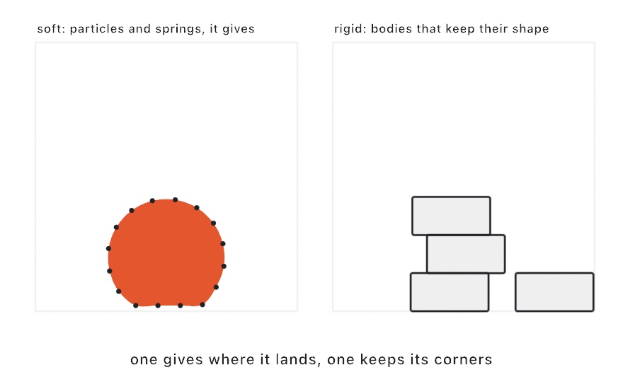
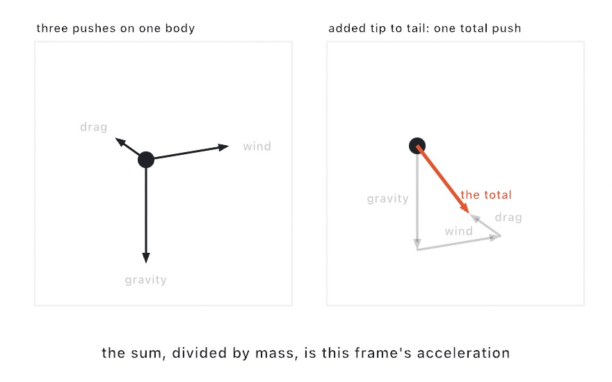
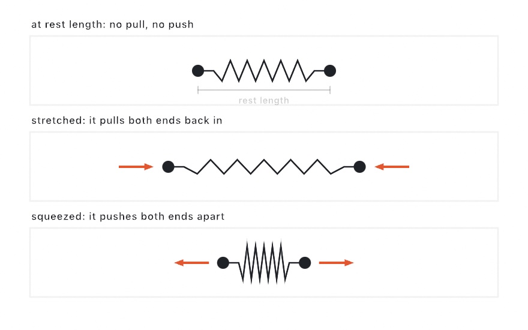

#### <sup>[Ollin](../../README.md) → [Documentation](../README.md) → [Simulation](./README.md) → `Physics`</sup>

---

## Physics

Physics lets motion come from a simulation instead of from hand-tuned numbers. The physics code lives in a separate library, so the drawing core does not carry it. To use it, add `import OllinPhysics` beside `import Ollin`.

The model is lightweight and made for creative work. It is not a game engine. A [`World`](#world) holds [`Particle`](#particle)s (point masses) and the [`Spring`](#spring)s between them. You set the global rules (gravity, an optional container, whether particles collide), and then you step the world once a frame. The model is tuned for motion that looks right rather than for exact physical accuracy. A few hundred springs and constraints is its comfortable range. Plain colliding disks go further than that, because the broad phase below scales to thousands.

The same `World` also holds a second kind of body. On the **soft** side, [`Particle`](#particle) and [`Spring`](#spring) form a Verlet solver, which is good at cloth, chains, and soft blobs. On the **rigid** side, a [`Body`](#rigid-bodies) is a rigid body. It has an orientation, it rotates, it rests in stable stacks, and it links to other bodies with joints. That covers the cases the soft model cannot handle, such as a toppling tower or a swinging pendulum. The rigid side is backed by [Box2D](https://box2d.org). Both sides share the world's gravity, walls, and per-frame `advance(by:)`, so you can use either one or both. Skip ahead to [Rigid bodies](#rigid-bodies) if that is what you need. This page covers the 2D world. Rigid bodies inside the 3D scene have their own [`World3D`](Physics3D.md).

<picture>
  <source media="(prefers-color-scheme: dark)" srcset="../../Guide/Images/11-ForcesAndPhysics/SoftVsRigid-dark.jpg">
  
</picture>

The usual pattern is to build the world once in `setup()`. Then, in `draw()`, you call `advance(by:)` and draw from its particles.

```swift
import Ollin
import OllinPhysics

final class Drops: Sketch {
    let world = World()

    override func setup() {
        world.bounds = Rectangle(x: 0, y: 0, width: width, height: height)
        world.particlesCollide = true
        for _ in 0 ..< 200 {
            world.addParticle(at: Vector2(random(width), random(height * 0.3)),
                              radius: 14 * scale)
        }
    }

    override func draw() {
        background(.black)
        world.advance(by: deltaTime)
        fill(.white)
        for p in world.particles {
            drawCircle(center: p.position, radius: p.radius)
        }
    }
}
```

Gravity pulls the discs down, the walls stop them, and `particlesCollide` keeps them from overlapping, so they pile up.

### Contents

- [World](#world) - the simulation, its bodies, rules, and the per-frame `advance(by:)`
- [Particle](#particle) - a point mass, with position, velocity, mass, and pinning
- [Spring](#spring) - a distance link between two particles (cloth, chains, soft bodies)
- [Rigid bodies](#rigid-bodies) - `Body`, colliders, surface properties, and joints (the Box2D side)
- [How the solver works](#how-the-solver-works) - Verlet integration and relaxation, in one paragraph
- [Soft bodies](#soft-bodies) - building a squishy blob from springs

<a name="world"></a>

### World

```swift
let world = World()
```

A `World` is the container for everything. You add particles and springs to it, set its rules, and call `advance(by:)` each frame.

**Building it**

```swift
@discardableResult
func addParticle(at position: Vector2, radius: Double = 0, mass: Double = 1) -> Particle
@discardableResult
func connect(_ a: Particle, _ b: Particle, length: Double? = nil, stiffness: Double = 1) -> Spring
func remove(_ spring: Spring)
func remove(_ particle: Particle)
func remove(_ body: Body)
func removeAll()

var particles: [Particle] { get }
var springs: [Spring] { get }
```

`remove(_ body:)` takes one rigid body out along with any joints holding it. The `Body` value is spent afterwards, so read anything you still need from it (its velocity, its angle) **before** the call and drop your reference to it after: a shard that inherits the motion of the thing it came from is the everyday case, and that is a read of a body about to leave. See [breaking things](../Generators/Fracture.md#bodies).

`addParticle` returns the new [`Particle`](#particle), so you can pin it, push it, or connect it to a spring. A `radius` of `0` (the default) makes a point that does not collide. A positive radius makes the particle collide as a disk. `connect` links two particles with a [`Spring`](#spring). By default the spring's rest length is the distance between the two particles at that moment.

**The rules**

```swift
var gravity: Vector2 = Vector2(0, 980)   // points per second², y-down
var drag: Double = 0.01                  // velocity damping, 0…1
var bounds: Rectangle?                   // optional container; nil lets bodies leave
var restitution: Double = 0.5            // how much speed survives a hit, 0…1
var particlesCollide: Bool = false       // push particles apart as solid disks
var iterations: Int = 8                  // relaxation passes per step
var maxTimestep: Double = 1.0 / 30       // clamp on dt, for stability
```

- **`gravity`** is a constant acceleration on every unpinned particle. Set it to `.zero` for a weightless field where everything floats freely.
- **`drag`** stands in for air friction. At `0` motion is conserved, so things drift forever. A small value removes energy, so things settle.
- **`bounds`** keeps particles inside a rectangle, and it accounts for each particle's `radius`. `restitution` then sets how much speed a particle keeps when it hits a wall. At `0` the particle sticks, and at `1` it loses nothing.
- **`particlesCollide`** turns on disk-against-disk separation. The broad phase runs through a spatial hash, so it scales to thousands of bodies. It is off by default for two reasons. A cloth should not have its own points collide, and the check costs a pass every frame. Turn it on for packings and piles. Points with `radius == 0` never collide.
- **`iterations`** is how many relaxation passes the solver runs to hold springs and collisions together. More passes make stiff stacks and tight packings firmer, and the cost grows linearly with the count.

<picture>
  <source media="(prefers-color-scheme: dark)" srcset="../../Guide/Images/11-ForcesAndPhysics/ForceAccumulation-dark.jpg">
  
</picture>

**Stepping**

```swift
func advance(by dt: Double)
```

`advance(by:)` moves the simulation forward by `dt` seconds. Pass `deltaTime`. A `dt` of `0` (a paused frame or the first frame) does nothing. A large `dt` is clamped to `maxTimestep`, so a stutter or a window drag does not throw everything off the screen.

<a name="particle"></a>

### Particle

```swift
let p = world.addParticle(at: Vector2(540, 200), radius: 24)
```

A `Particle` is a point mass. It is the body the world moves. You usually make one with `World.addParticle`, and then you read its `position` to draw it.

```swift
var position: Vector2          // where it is now
var velocity: Vector2 { get }  // implicit, as a per-step displacement
var radius: Double             // collision radius (0 = a non-colliding point)
var mass: Double               // heavier resists being pushed
var pinned: Bool               // held in place (an anchor)
var userData: Any?             // hang your own data off it

func applyForce(_ force: Vector2)   // accumulate a force for the next step
func push(_ amount: Vector2)        // add to velocity (a per-step displacement)
func place(at point: Vector2)       // teleport without imparting velocity
@discardableResult func pin() -> Particle
@discardableResult func unpin() -> Particle
```

Motion is **Verlet**. A particle does not store a velocity. Instead it keeps its previous position, and the velocity is the difference between the two positions. That is why there are two ways to move a particle. `place(at:)` teleports the particle and moves the previous position with it, so it adds no velocity. `push(_:)` *adds* velocity by moving the previous position. To throw a particle, place it and then push it.

```swift
p.place(at: Vector2(100, 100))   // set it down, still
p.push(Vector2(8, 0))            // now flick it to the right
```

`pin()` anchors a particle, so gravity and springs no longer move it. It still acts on whatever it is connected to. This is how you hang a cloth from its top edge or hold a pivot in place. `userData` lets you attach a color, an index, or any other per-body state to the particle, so you do not need a parallel array.

<a name="spring"></a>

### Spring

```swift
let s = world.connect(a, b)        // holds their current distance
s.stiffness = 0.4                  // springy instead of rigid
```

A `Spring` is a link that tries to hold two particles at a fixed distance from each other. It can stand for a cloth thread, a chain segment, or a soft-body strut.

<picture>
  <source media="(prefers-color-scheme: dark)" srcset="../../Guide/Images/11-ForcesAndPhysics/SpringRestLength-dark.jpg">
  
</picture>

```swift
let a: Particle
let b: Particle
var length: Double         // the rest distance it pulls back to
var stiffness: Double      // 0…1; 1 is a rigid stick, less gives
var strain: Double { get } // signed: 0 at rest, + stretched, − compressed
```

With `stiffness` at `1` the link behaves like a rigid stick. A lower value lets the link give and spring back over a few frames. `strain` reports how far the link is stretched right now, as a signed fraction of its rest length. It is 0 at rest, positive when stretched, and negative when compressed. You can use it to color a cloth by stress.

<a name="rigid-bodies"></a>

### Rigid bodies

A [`Particle`](#particle) is a soft point with no orientation. A [`Body`](#body) is a rigid body. It has an `angle`, it spins, it rests in stable stacks, and it bounces off other bodies with a contact response. Use it when the soft model cannot do the job. Examples include a tower of blocks that topples, a hinged chain, and a pile of tumbling shapes. The rigid side is backed by [Box2D](https://box2d.org). Box2D is wrapped behind Ollin's own types, and the rigid side is measured in sketch points.

```swift
import Ollin
import OllinPhysics

final class Tower: Sketch {
    let world = World()

    override func setup() {
        world.gravity = Vector2(0, 2600)
        world.bounds = bounds                       // the floor and walls
        for row in 0 ..< 7 {
            world.addBody(.box(width: 100, height: 44),
                          at: Vector2(width / 2, height - 60 - Double(row) * 46))
        }
    }

    override func draw() {
        background(.black)
        world.advance(by: deltaTime)
        fill(.white)
        for body in world.bodies {
            withState {
                translate(body.position)
                rotate(body.angle)                  // real rotation, not a fake spin
                drawRect(center: .zero, width: 100, height: 44)
            }
        }
    }
}
```

The pattern is the same as for particles. You build the world in `setup()`, and then in `draw()` you call `advance(by:)` and draw from `world.bodies`. You can keep each body's look, its color and its drawn size, in `userData`, and then draw it from its `position` and `angle`.

**Adding bodies**

```swift
@discardableResult
func addBody(_ collider: Collider, at position: Vector2,
            kind: Body.Kind = .dynamic, density: Double = 1,
            friction: Double = 0.3, restitution: Double? = nil) -> Body

var bodies: [Body] { get }
```

- **`collider`** is the body's shape (described below). **`kind`** is how the body moves. `.dynamic` (the default) is moved by forces. `.static` never moves, so use it for walls, the ground, or a hinge anchor. `.kinematic` moves only by a velocity you set.
- **`density`** sets the mass, so heavier bodies push lighter ones. **`friction`** is surface grip, from `0` (slippery) to `1` (grippy). **`restitution`** is bounciness, `0…1`. It defaults to the world's `restitution`.

<a name="collider"></a>

**Colliders**

```swift
enum Collider {
    case circle(radius: Double)
    case box(width: Double, height: Double)
    case capsule(from: Vector2, to: Vector2, radius: Double)   // a rounded stadium
    case polygon([Vector2])                                    // convex, ≤ 8 points
}
```

Geometry is given in body-local points, centered on the body's origin. The body's `position` and `angle` then place it in the world. A `.polygon` is made convex for you by taking its convex hull, so a concave outline is expanded to that hull rather than rejected. It is brought within the eight-corner limit for you too, by dropping the corner whose own triangle is smallest until eight are left, so an outline with more corners is simulated as a slightly plainer version of itself rather than refused.

<a name="body"></a>

**The Body**

```swift
var position: Vector2          // center, in points
var angle: Double              // orientation, radians (clockwise, y-down)
var velocity: Vector2          // points per second (a real velocity)
var angularVelocity: Double    // radians per second
var mass: Double { get }
var kind: Body.Kind            // .dynamic / .static / .kinematic
var userData: Any?

func applyForce(_ force: Vector2)     // steady push (thrust, wind)
func applyImpulse(_ impulse: Vector2) // instant kick (a hit, a launch)
func applyTorque(_ torque: Double)    // spin it
```

The `Forces` example shows all three calls in one windy yard. It also has a `.kinematic` sweeper that other bodies cannot stop, and a pinned cloth colored by `Spring.strain`.

**Shared rules and units**

The rigid side reads the settings you already made on the world. It takes `gravity` unchanged and uses `bounds` as walls. It applies `restitution` to the walls and as the default contact restitution, and it damps bodies with `drag`. It also runs on the same `advance(by:)`. One parameter belongs to the rigid side alone:

```swift
var pixelsPerMeter: Double = 100
```

Box2D works in meters and behaves best for objects roughly 0.1 to 10 m. `pixelsPerMeter` converts between meters and sketch points. The default of 100 puts a 100-point shape at 1 m, which is well inside that range, so you can keep thinking in points. The Verlet particle side works in points directly and ignores this value.

<a name="joint"></a>

**Joints**

You can link two bodies with a constraint, or grab one body with the cursor:

```swift
@discardableResult
func connect(_ a: Body, _ b: Body, _ kind: JointKind) -> Joint
@discardableResult
func grab(_ body: Body, at point: Vector2) -> Joint

enum JointKind {
    case revolute(at: Vector2)                        // a free hinge at a world point
    case distance(from: Vector2, to: Vector2,
                  length: Double? = nil, stiffness: Double = 1)   // a rod (soft < 1)
    case weld                                          // lock together rigidly
    case prismatic(at: Vector2, axis: Vector2)         // a slider along an axis
}
```

`revolute` is the most common joint. Repeat it down a line of links for a rope or a pendulum, and anchor the first link to a `.static` body to hang it. `distance` holds two anchors at a fixed distance from each other. Below `stiffness: 1` it softens into a spring. `grab` returns a [`Joint`](#joint). You steer the joint by setting its `target` each frame (for example to the cursor), and you call `remove()` to let go:

```swift
let held = world.grab(body, at: Vector2(mouseX, mouseY))
// each frame while dragging:
held.target = Vector2(mouseX, mouseY)
// to release:
held.remove()
```

See the `RigidBodies` and `Chain` examples for complete sketches. The first is a toppling pyramid knocked into a pile of mixed shapes, and the second is a set of swinging chains you can grab. The `Joints` example shows the four joint kinds side by side, with one small rig for each. Every rig hangs from a `.static` anchor, and you can grab each one with the cursor.

<a name="how-the-solver-works"></a>

### How the solver works

Each step first integrates every particle forward. The integration is time-corrected Verlet, so an uneven frame rate does not change how fast things move. The step then runs a few **relaxation** passes. Each pass pulls springs back toward their length, pushes overlapping disks apart, and keeps everything inside `bounds`. Every constraint is solved by moving *positions*, so the velocity follows on its own. A bounce, a spring's recoil, and a collision all only move points, and the implicit Verlet velocity carries the result into the next frame. Many cloth and soft-body demos on the web use the same approach. `Particle` is the one place where Ollin uses reference semantics instead of value types. That lets a spring or a collision move the same shared point in place.

<a name="soft-bodies"></a>

### Soft bodies

A soft blob is built from three parts: a hub particle, spokes out to a ring of rim particles, and springs around the rim. Loose spokes let the blob deform. The rim springs keep it roughly round. Give the rim particles a radius and set `world.particlesCollide = true`, and then blobs no longer pass through each other.

```swift
func makeBlob(at center: Vector2, radius: Double) -> [Particle] {
    let sides = 16
    let hub = world.addParticle(at: center, mass: 3)
    let rimRadius = radius * sin(.pi / Double(sides))   // adjacent rims just touch

    var rim: [Particle] = []
    for s in 0 ..< sides {
        let angle = Double(s) / Double(sides) * .tau
        let p = world.addParticle(at: center + Vector2(angle: angle, length: radius),
                                  radius: rimRadius)
        rim.append(p)
        world.connect(hub, p, stiffness: 0.2)            // spoke (springy)
    }
    for s in 0 ..< sides {
        world.connect(rim[s], rim[(s + 1) % sides], stiffness: 0.6)   // rim ring
    }
    return rim
}
```

Draw the rim as a smooth filled outline, and you have a wobbling jelly:

```swift
drawCurve(rim.map(\.position), closed: true)
```

See the `Blobs` and `Packing` examples for complete sketches.
