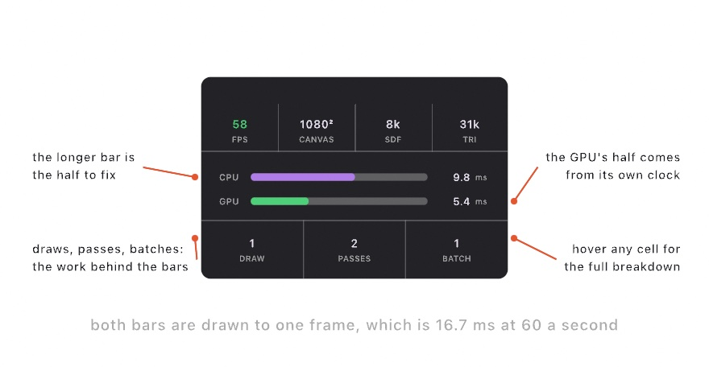

#### <sup>[Ollin](../../README.md) → [Documentation](../README.md) → [Tools](./README.md) → `Profiling`</sup>

---

## Profiling

Ollin sits on a GPU core, so a sketch can draw a great deal before it slows down. When one does slow down, the question is which half of the frame is to blame. The inspector answers it. Under the FPS strip sit two bars and three counts, and they say where the frame went.

Open the inspector with **⌘/** (standalone), or read it in the sidebar of OllinLive, the gallery, and the live-coding host. Every host shows the same card.

<picture>
  <source media="(prefers-color-scheme: dark)" srcset="../../Guide/Images/32-Installations/CostRow-dark.jpg">
  
</picture>

### Contents

- [The two bars](#the-two-bars) - CPU against GPU, on one scale
- [The three counts](#the-three-counts) - draws, passes, batches
- [What to do about a slow frame](#what-to-do-about-a-slow-frame)
- [Capturing a frame for Xcode](#capturing-a-frame-for-xcode) - `captureGPUFrame()`
- [Reading the numbers from code](#reading-the-numbers-from-code) - `FrameProfile`

---

<a name="the-two-bars"></a>
### The two bars

The **CPU** bar is your `draw()` plus the encode that turns it into GPU commands. Tessellation lives here, and it is the first thing to grow in an immediate-mode renderer. The **GPU** bar is what the device spent on the frame, taken from its own timestamps.

Both bars are drawn against the same scale, which is the frame's own period. At 60 frames a second that scale is 16.7 ms. So the longer bar is the bottleneck, and two short bars mean the sketch has room to spare.

The two are deliberately not stacked into one bar. The CPU builds frame N while the GPU still draws frame N-1, so the two times overlap rather than add up. A stacked bar would suggest a total that does not exist.

Hover either bar for the detail. The CPU tooltip splits the number into drawing and encoding, and it names the time spent waiting for the display. That wait is headroom rather than work, so a large wait is good news.

One caveat on the GPU number. It is measured on the frame the device just finished, which is a frame or two behind. It is smoothed for display, so the lag is invisible unless a sketch changes cost suddenly.

<a name="the-three-counts"></a>
### The three counts

- **Draws** is the draw calls the frame issued. Hover it for the breakdown by path: instanced SDF shapes, fill and stroke vertices, mesh vertices, glyphs, images, fields, point splats, particles, and compute dispatches.
- **Passes** is the render passes the frame encoded. The canvas and the present are always two of them. Every effects layer, filter, shadow map, and probe bake adds its own.
- **Batches** is the runs the drawer recorded. A run breaks whenever the pipeline, blend mode, texture, or clip level changes.

The relationship between batches and shapes is the useful one. Ten thousand circles in one batch cost one draw call. Ten circles that each change the blend mode cost ten.

A first frame reads higher than the ones after it. Some setup happens once and is then cached for the life of the window.

<a name="what-to-do-about-a-slow-frame"></a>
### What to do about a slow frame

Read the bars first, then act on the longer one.

**The CPU bar is longer.** The frame is spending its time building geometry.

- Check the draws tooltip for a large vertex count. Fills and strokes are tessellated on the CPU, while the closed shapes in the [SDF catalog](../Drawing/Drawing.md) are one instance each.
- Static geometry belongs in a [retained batch](../Drawing/Batches.md). It is recorded once and replayed from GPU memory after that.
- A high batch count against few shapes means state is changing per shape. Group the shapes that share a blend mode, a texture, or a clip.

**The GPU bar is longer.** The frame is spending its time shading pixels.

- Look at the pass count. A long [filter chain](../Drawing/Effects.md) is passes over the whole canvas, and each one is fill rate.
- An effects layer can render at a fraction of the canvas. Pass `scale:` to `renderTarget(scale:)` for anything soft, such as a blur or a glow.
- In 3D, shadows, reflections, and global illumination each add passes. The [3D pages](../3D/3D.md) name the cost of each.

**Both bars are short and the frame rate is still low.** Something outside the drawing is holding the frame up. A file read or a heavy `setup()` in the middle of `draw()` will do it.

<a name="capturing-a-frame-for-xcode"></a>
### Capturing a frame for Xcode

When the answer is "the GPU, but which pass", hand the frame to Metal's own debugger:

```swift
if frameCount == 120 { captureGPUFrame() }        // or: captureGPUFrame(to: "slow.gputrace")
```

The frame you ask from is the frame you get. The request is taken between your `draw()` and the render it feeds. Ollin writes a `.gputrace` file, which opens in Xcode with per-pass timings, the pipeline state, and every bound resource.

**Metal refuses to capture unless the process asks for it at launch.** Run the sketch with the capture flag set:

```sh
MTL_CAPTURE_ENABLED=1 ollin MySketch.swift
```

Without it, the sketch prints that line and carries on drawing. The host menu has the same thing as an action: **View ▸ Capture GPU Frame (⌘⇧G)** captures the next frame.

Either way, Ollin prints the frame's passes in order beside the file path. That list alone often answers the question, and it needs no Xcode.

<a name="reading-the-numbers-from-code"></a>
### Reading the numbers from code

The same numbers reach a sketch through the [extension seam](../Core/Sketch.md#extensions). `FrameInfo` carries a `FrameProfile`, so an extension can log a frame, watch for a threshold, or draw its own readout:

```swift
final class SlowFrameLog: SketchExtension {
    func afterFrame(_ sketch: Sketch, _ info: FrameInfo) {
        let p = info.profile
        guard p.cpuMS > 8 else { return }
        print("frame \(sketch.frameCount): \(p.cpuMS) ms CPU, \(p.drawCalls) draws, \(p.batches) batches")
    }
}
```

`FrameProfile` holds the four times (`cpuDrawMS`, `cpuEncodeMS`, `gpuMS`, `waitMS`), the submitted work (`drawCalls`, `passes`, `computeDispatches`, `batches`), and the geometry each path drew. `cpuMS` adds the two CPU times. `tessellatedVertices` adds every vertex the CPU built this frame.

The counts follow what was really drawn rather than what was recorded. A batch the renderer skipped is not counted.

---

Related: [Sketch](../Core/Sketch.md) - [Drawing](../Drawing/Drawing.md) - [Retained batches](../Drawing/Batches.md) - [Effects](../Drawing/Effects.md) - [Parameters](../Helpers/Parameters.md)
