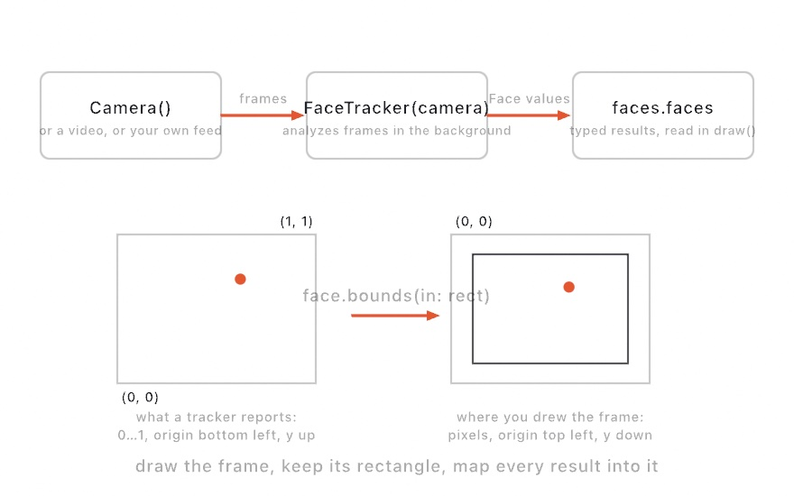
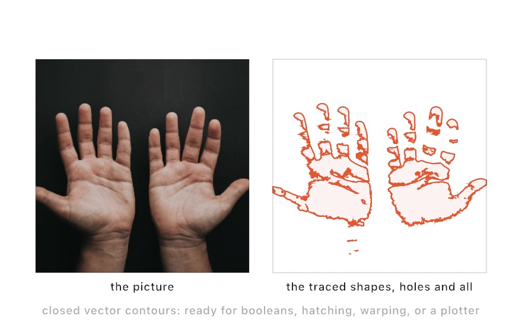
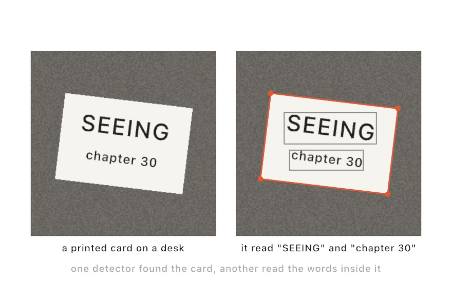
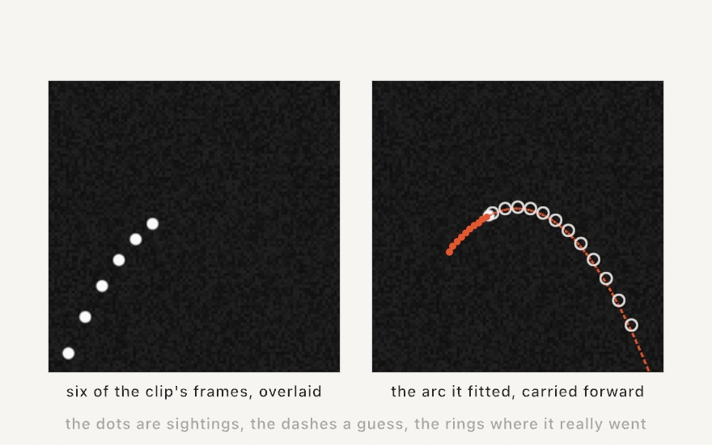
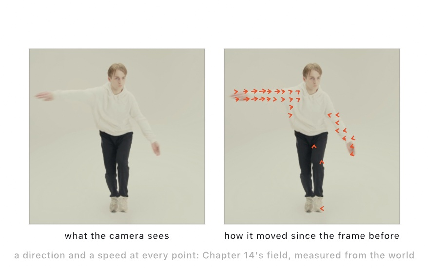
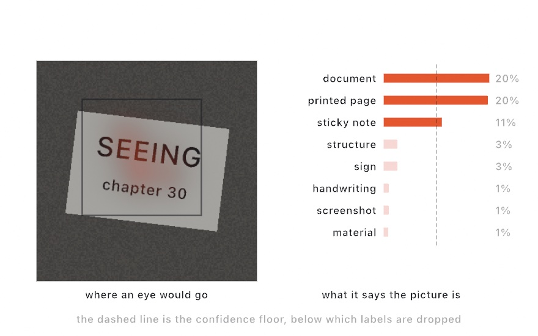
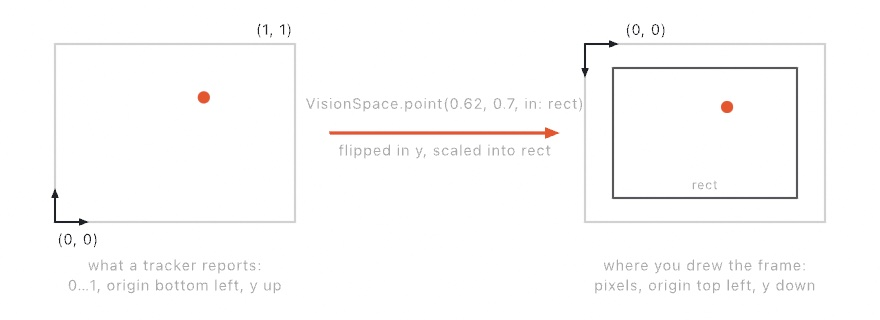

#### <sup>[Ollin](../../README.md) → [Documentation](../README.md) → [Vision](./README.md) → `Vision`</sup>

---

## Vision

Vision lets a sketch see with the Mac's camera. It lives in a separate library, so the drawing core stays free of `AVFoundation` and Apple's Vision framework. Add `import OllinVision` beside `import Ollin` to reach it.

There are two pieces. The first is a [`Camera`](#camera). It captures frames and hands them over as drawable `Image`s. The frames come from the built-in camera, a Continuity Camera iPhone, or an external webcam.

The second piece is a **tracker**. It attaches to a [frame source](#frame-sources), which is that camera or a playing [`VideoPlayer`](../Video/Video.md). It runs Apple's on-device perception on each frame and publishes typed results, which you read in `draw()`. Every tracker follows the same shape, from [`FaceTracker`](#facetracker) for faces through hands, bodies, segmentation, contours, and text. At the end of the catalog is [`ModelTracker`](#modeltracker), which runs **your own Core ML model** the same way.

<picture>
  <source media="(prefers-color-scheme: dark)" srcset="../../Guide/Images/30-Seeing/TrackerFlow-dark.jpg">
  
</picture>

The usual flow starts in `setup()`. Make a camera, call `start()` on it, and attach the trackers you want. Then, in `draw()`, draw the feed with `drawFrame(camera)` and read each tracker's results. `drawFrame` letterboxes the latest frame, shows a standard waiting notice until the first frame arrives, and returns the rectangle you map results into.

```swift
import Ollin
import OllinVision

final class Faces: Sketch {
    let camera = Camera()
    lazy var faces = FaceTracker(camera)

    override func setup() { try? camera.start() }

    override func draw() {
        background(.black)
        guard let rect = drawFrame(camera) else { return }

        noFill(); stroke(.green); strokeWeight(2)
        for face in faces.faces {
            drawRect(face.bounds(in: rect))
        }
    }
}
```

### Contents

- [Camera](#camera) - capture the webcam (built-in, Continuity, or external)
- [Frame sources](#frame-sources) - trackers over any source of frames (a video, your own)
- [When there is no camera](#nocamera) - `Camera.orStill` and `StillFrames`, so a sketch still has something to read
- [FaceTracker](#facetracker) - find faces, landmarks, and head pose
- [Face](#face) - one detected face, and reading its parts
- [ContourDetector](#contourdetector) - trace edges into vector contours
- [DetectedContours](#detectedcontours) - contours as `Contour`s and `Shape`s
- [HandTracker](#handtracker) - find hands and their 21-joint skeletons
- [Hand](#hand) - one detected hand, its joints and fingers
- [BodyTracker](#bodytracker) - find people and their pose skeletons
- [BodyTracker3D](#bodytracker3d) - one person's pose in space, in meters
- [Body3D](#body3d) - the 3D skeleton in canvas, model, and camera space
- [PersonSegmenter](#personsegmenter) - lift the people out of the frame
- [SubjectSegmenter](#subjectsegmenter) - lift whatever stands out as foreground
- [PointSegmenter](#pointsegmenter) - lift whatever you point at
- [Segmentation](#segmentation) - a soft matte and the cutout it makes
- [RectangleDetector](#rectangledetector) - find rectangular shapes and their corners
- [BarcodeScanner](#barcodescanner) - read barcodes and QR codes
- [TextRecognizer](#textrecognizer) - read text (OCR) from the feed
- [ObjectTracker](#objecttracker) - follow a patch you point at across frames
- [TrackedObject](#trackedobject) - the tracked box and its confidence
- [TrajectoryTracker](#trajectorytracker) - find things flying along parabolic arcs
- [DetectedTrajectory](#detectedtrajectory) - one arc: its points, fit, and identity
- [FlowTracker](#flowtracker) - measure optical flow, the whole picture's motion
- [MotionField](#motionfield) - the motion field, sampled anywhere on the canvas
- [ImageClassifier](#imageclassifier) - name what's in the picture
- [Classification](#classification) - one label and how strongly it applies
- [SaliencyTracker](#saliencytracker) - map what draws the eye
- [Saliency](#saliency) - the heat map, regions, and point query
- [ConceptTracker](#concepttracker) - score any phrases you type against the picture
- [ModelTracker](#modeltracker) - run your own Core ML model over the frames
- [ModelOutput](#modeloutput) - its decoded surfaces: labels, objects, map
- [ClassMask](#classmask) - a semantic segmenter's output: every pixel named
- [DepthTracker](#depthtracker) - depth that holds still, from a video depth model
- [DepthClip](#depthclip) - the whole clip's depth, read ahead of time and answered by clip time
- [Coordinate mapping](#coordinate-mapping) - placing normalized results on the canvas
- [Still images](#still-images) - running a tracker on a loaded image
- [Availability](#availability) - when a model can't run on a Mac
- [Permission](#permission) - the camera prompt

<a name="camera"></a>

### Camera

```swift
Camera(_ device: Camera.Device = .default)
func start() throws
func stop()
var frame: Image? { get }
var frameSize: Vector2? { get }
func fittedRectangle(in container: Rectangle) -> Rectangle?

// on Sketch, for any VideoFeed (a Camera, a VideoPlayer, your own):
@discardableResult
func drawFrame(_ feed: some VideoFeed, in container: Rectangle? = nil,
               waiting: String? = nil) -> Rectangle?
```

`Camera` is a frame source. Create it in `setup()`, call `start()` on it, and draw it with `drawFrame(camera)` in `draw()`. `drawFrame` draws the latest frame letterboxed into the canvas (or into `container`) and returns the rectangle it landed in. Map every tracker result into that same rectangle, and the overlays line up with the picture. Before the first frame arrives, `drawFrame` draws a standard waiting notice instead and returns `nil`. The notice reads "Waiting for camera…", and `waiting:` replaces that text. A camera sketch therefore opens with one line:

```swift
guard let rect = drawFrame(camera) else { return }
```

`drawFrame` accepts any `VideoFeed`. `VideoFeed` is the core protocol that `Camera` and [`VideoPlayer`](../Video/Video.md) conform to, and it supplies `frame`, `frameSize`, and the letterboxing `fittedRectangle(in:)`. If you want the typed pieces, `frame` is the latest captured frame, or `nil` before the first one. `fittedRectangle(in:)` returns the letterboxed rectangle alone. A sketch uses it when it draws something derived from a frame, like a segmentation matte or a cutout, rather than the frame itself.

`Camera.Device` picks which camera. The choices are `.default`, `.builtIn`, `.continuity`, `.external`, and `.deskView`. `.default` is the system default, `.continuity` is a nearby iPhone, and `.external` is a USB or Thunderbolt webcam.

```swift
let camera = Camera(.continuity)   // use a Continuity Camera iPhone
```

Each new frame produces a fresh `Image`, so draw `camera.frame` directly in `draw()` rather than holding onto it across frames.

A frame is an `Image`, so it can go wherever an image goes, not only onto the canvas. A [mesh can use it as a texture](../3D/3D.md#textures) through `textured(_:)`. The scene can also be [lit by it](../3D/3D.md#live-environment) through `environment(.feed(camera))`. So the camera works as a surface and as a light, as well as a picture:

```swift
environment(.feed(camera))                  // the room as the light
if let frame = camera.frame {
    drawMesh(globe.textured(frame))         // the room as the surface
}
```

Set the material every frame, because each capture is a fresh `Image`. A fresh `Image` builds its texture the first time it is drawn. So a feed on a surface costs one upload per new frame and nothing while the frame holds. That is cheap for one surface, and it adds up across many. See [`Examples/3D/Materials/LiveSurface`](../../Examples/3D/Materials/LiveSurface).

<a name="frame-sources"></a>

### Frame sources

```swift
protocol FrameSource: AnyObject {       // lives in the Ollin core
    var frameTap: FrameTap? { get set }
}
typealias FrameTap = @Sendable (CGImage) -> Void
```

Every tracker takes `any FrameSource`, not only a camera. That protocol is what lets the same analysis run over any source of moving pictures. `Camera` conforms, and so does [`VideoPlayer`](../Video/Video.md). So a tracker runs over recorded footage exactly the way it runs over the live feed:

```swift
import Ollin
import OllinVideo
import OllinVision

final class Traced: Sketch {
    let player = try! VideoPlayer(path: "/path/to/clip.mp4")
    lazy var contours = ContourDetector(player)   // analyzed as it plays

    override func setup() {
        player.loops = true
        player.play()
    }
}
```

Trackers attached to the same source share one analysis engine, so the source is tapped once and its frames fan out to every tracker. Analysis is throttled to what the machine keeps up with, and frames are skipped rather than queued. A paused video stops producing frames, so its trackers hold their last results.

A type of your own can be a frame source too. Conform to `FrameSource`: hold the closure, and call it with each new `CGImage` from whatever thread produces them. Every tracker then accepts it. `Examples/Vision/TrajectoryTracking` does exactly that, because its "camera" is a small ball-launching simulation that the example renders itself.

<a name="nocamera"></a>

### When there is no camera

A sketch that reads the world has nothing to show on a machine with no camera attached, or one where permission was refused. `Camera.orStill(_:)` picks: a running camera when there is one, and a still picture when there is not.

```swift
import OllinSamplePhotos

final class Poses: Sketch {
    var feed: (any FrameSource & VideoFeed)?
    var bodies: BodyTracker?

    override func setup() {
        let feed = Camera.orStill(SamplePhoto.reaching.load())
        self.feed = feed
        bodies = BodyTracker(feed)
    }

    override func draw() {
        background(.black)
        guard let feed, let bodies, let rect = drawFrame(feed) else { return }
        for body in bodies.bodies {
            for (a, b) in body.bones(in: rect) { drawLine(a, b) }
        }
    }
}
```

Everything downstream takes either one, because both are a `FrameSource` and a `VideoFeed`, so nothing but that one line knows which it got. The picture is only built when it is needed, so a machine with a camera never decodes it. The [sample photographs](../Drawing/SamplePhotos.md) are what the examples fall back to, but any `Image` works.

**`--photo` on launch takes the picture even where a camera would have worked.** That is how a still is made of a sketch that is normally live: a screenshot, a gallery thumbnail, a figure.

`StillFrames` is the feed underneath, and it is public, for the case where the choice is not the camera's to make:

```swift
StillFrames(_ picture: Image, rate: Double = 4)
    var picture: Image
    var frame: Image?           // the picture, so drawFrame never waits
    var frameSize: Vector2?
    func start()
```

It publishes the picture over and over rather than once, four times a second by default. That is because an analyzer drops frames it cannot keep up with, as every tracker does, so a source that published a single frame could have that one frame dropped and never be read at all. Four times a second is far below what a camera asks of the same analyzer.

<a name="facetracker"></a>

### FaceTracker

<picture>
  <source media="(prefers-color-scheme: dark)" srcset="../../Guide/Images/30-Seeing/Landmarks-dark.jpg">
  
</picture>

```swift
FaceTracker(_ source: any FrameSource)
var faces: [Face] { get }
var count: Int { get }
static func detect(in image: Image) async throws -> [Face]
```

`FaceTracker` finds faces in a camera's frames. Each face comes back with a bounding box, a head pose (`roll`/`yaw`/`pitch`), and a capture-quality score. There are also 76-point landmarks, which cover the jaw, brows, eyes, nose, lips, and pupils. Attach the tracker to a camera, then read `faces` in `draw()`.

```swift
let camera = Camera()
lazy var faces = FaceTracker(camera)
```

Analysis runs on a background thread. If recognition is slower than the camera's frame rate, frames are dropped so the sketch stays responsive. Only the analysis is throttled, so the displayed `frame` is never dropped. `faces` always holds the most recent result.

<a name="face"></a>

### Face

```swift
struct Face {
    var confidence: Double
    var roll, yaw, pitch: Double          // radians
    var quality: Double?                  // 0…1 capture quality, if scored
    var hasLandmarks: Bool

    func bounds(in: Rectangle, mirrored: Bool = false) -> Rectangle
    func center(in: Rectangle, mirrored: Bool = false) -> Vector2
    func landmarks(_: FaceLandmark, in: Rectangle, mirrored: Bool = false) -> [Vector2]
}
```

`Face` is one detected face. The `in:` helpers map it onto the canvas, so pass the same rectangle you drew the frame into. `landmarks(_:in:)` returns the points of one region, ready to `drawPolyline`. The regions are `.faceContour`, `.leftEye`, `.rightEye`, `.leftEyebrow`, `.rightEyebrow`, `.nose`, `.noseCrest`, `.medianLine`, `.outerLips`, `.innerLips`, `.leftPupil`, `.rightPupil`, and `.allPoints`. Regions like the eyes and lips are closed loops, so append the first point to close the polyline.

```swift
for face in faces.faces {
    drawRect(face.bounds(in: rect))
    drawPolyline(face.landmarks(.faceContour, in: rect))
    for p in face.landmarks(.leftPupil, in: rect) { drawCircle(p.x, p.y, 3) }
}
```

<a name="contourdetector"></a>

### ContourDetector

<picture>
  <source media="(prefers-color-scheme: dark)" srcset="../../Guide/Images/30-Seeing/Contours-dark.jpg">
  
</picture>

```swift
ContourDetector(_ source: any FrameSource, detectsDarkOnLight: Bool = true, contrastAdjustment: Float = 1)
var latest: DetectedContours { get }
var count: Int { get }
func contours(in: Rectangle, mirrored: Bool = false) -> [Contour]
func shapes(in: Rectangle, mirrored: Bool = false) -> [Shape]
static func detect(in: Image, …) async throws -> DetectedContours
```

The other trackers find *things*. This one finds *edges*, the boundaries between light and dark, and returns them as Ollin geometry. That turns a live camera frame into **vector** shapes. The traced `Shape`s go through the same path as any other geometry, so `drawShape`, [SVG export](../Output/Export.md), and the hatching transform all work on them. That is the output a pen plotter needs.

```swift
let camera = Camera()
let contours = ContourDetector(camera)
override func draw() {
    background(.white)
    noFill(); stroke(.black)
    for shape in contours.shapes(in: bounds) { drawShape(shape) }
}
```

`detectsDarkOnLight` (the default) traces dark shapes on a light background, which suits line art and documents. `contrastAdjustment` (`0…3`) boosts faint edges at the cost of more noise. Point the camera at high-contrast subjects for the cleanest result. Like every tracker, it also runs once on a still image (`ContourDetector.detect(in:)`).

<a name="detectedcontours"></a>

### DetectedContours

```swift
struct DetectedContours {
    var topLevel: [Node]      // each Node has points + nested children
    var count: Int
    func contours(in: Rectangle, mirrored: Bool = false) -> [Contour]
    func shapes(in: Rectangle, mirrored: Bool = false) -> [Shape]
}
```

`DetectedContours` is the result of a contour trace: a tree of closed outlines. A contour can contain nested contours, like a shape with a hole or a ring inside a disk. `contours(in:)` flattens the tree to closed `Contour`s mapped onto the canvas, which suits line work. `shapes(in:)` collects each top-level contour and its descendants into one even-odd `Shape`, so the nesting reads correctly when the shape is filled, hatched, or exported.

<a name="handtracker"></a>

### HandTracker

```swift
HandTracker(_ source: any FrameSource, maximumHandCount: Int = 2)
var hands: [Hand] { get }
var count: Int { get }
static func detect(in: Image, maximumHandCount: Int = 2) async throws -> [Hand]
```

`HandTracker` finds hands and their 21-joint skeletons. It is the tracker to use for gesture work. Read `hands` in `draw()`. Joints that Vision is not confident about (occluded, or off-frame) are dropped, so what you get back is what it actually saw.

```swift
let camera = Camera()
let hands = HandTracker(camera)
override func draw() {
    if let frame = camera.frame { drawImage(frame, in: bounds) }
    for hand in hands.hands {
        for (a, b) in hand.bones(in: bounds) { drawLine(a, b) }
    }
}
```

A gesture comes from a few joints. For example, the distance between `.thumbTip` and `.indexTip` is a pinch, and `.indexTip` alone is a cursor. The spread of the fingertips tells an open hand from a closed one.

<a name="hand"></a>

### Hand

```swift
struct Hand {
    var chirality: Chirality        // .left, .right, or .unknown
    var confidence: Double
    func has(_: HandJoint) -> Bool
    func point(_: HandJoint, in: Rectangle, mirrored: Bool = false) -> Vector2?
    func points(in: Rectangle, mirrored: Bool = false) -> [HandJoint: Vector2]
    func finger(_: Finger, in: Rectangle, mirrored: Bool = false) -> [Vector2]
    func bones(in: Rectangle, mirrored: Bool = false) -> [(Vector2, Vector2)]
}
```

`Hand` is one detected hand. `point(_:in:)` maps a single joint, or returns `nil` if the joint was not seen, and `points(in:)` maps them all. `finger(_:in:)` returns one finger's chain as a polyline from wrist to tip. `bones(in:)` returns the whole skeleton as line segments. It breaks a chain at any missing joint rather than drawing across the gap.

The joints are `HandJoint` values: `.wrist` plus four per finger (`.indexMCP`, `.indexPIP`, `.indexDIP`, `.indexTip`, and so on), with `HandJoint.tips` for the five fingertips. A `Finger` (`.thumb`, `.index`, `.middle`, `.ring`, `.little`) has a `.chain` of its joints.

<a name="bodytracker"></a>

### BodyTracker

```swift
BodyTracker(_ source: any FrameSource)
var bodies: [Body] { get }
var count: Int { get }
static func detect(in: Image) async throws -> [Body]
```

`BodyTracker` finds people and their 2D pose skeletons of 19 joints, from head to ankles. `HandTracker` is the close-up tool, and this is the whole-body one. Reach, lean, jump, and silhouette all come from the joints. Joints out of view (often the legs at a desk) are dropped, so the figure is whatever Vision can see.

```swift
let camera = Camera()
let bodies = BodyTracker(camera)
override func draw() {
    if let frame = camera.frame { drawImage(frame, in: bounds) }
    for body in bodies.bodies {
        for (a, b) in body.bones(in: bounds) { drawLine(a, b) }
    }
}
```

`Body` mirrors `Hand`. `point(_:in:)` maps a single `BodyJoint`, or returns `nil`, and `points(in:)` maps them all. `bones(in:)` returns the skeleton as line segments, and `Body.skeleton` is the list of joint pairs that covers the head, spine, arms, and legs. Body pose is a heavier model, so see [Availability](#availability).

<a name="bodytracker3d"></a>

### BodyTracker3D

```swift
BodyTracker3D(_ source: any FrameSource)
var body: Body3D? { get }
static func detect(in: Image) async throws -> Body3D?
```

`BodyTracker3D` finds one person's pose **in space** from an ordinary 2D camera. `BodyTracker` gives flat picture coordinates, but here every joint gets a 3D position in meters. The camera is still the same single webcam. Even so, the sketch knows how far away the person is, how tall they are, and what their figure looks like from the side.

It differs from the 2D tracker in two ways, and both matter before you choose it:

- **One person.** The model follows the most prominent person, so you read a single `body`, not a list. It is `nil` while no one is in view. To count people, or for a scene with several people, use `BodyTracker`.
- **The full skeleton, always.** All 17 joints are placed every time, so joints the camera cannot see are the model's best guess. Their canvas projections land outside the frame's rectangle rather than disappearing, and there is no per-joint confidence. The 2D tracker does the opposite, because it drops what it cannot see.

It is a heavier neural model, so see [Availability](#availability).

<a name="body3d"></a>

### Body3D

```swift
var confidence: Double                      // 0…1
var height: Double                          // meters
var heightEstimation: HeightEstimation      // .reference or .measured
var distance: Double?                       // meters from the camera to the root
func has(_ joint: BodyJoint3D) -> Bool

// canvas: the overlay surface, like the other trackers
func point(_ joint: BodyJoint3D, in rect: Rectangle, mirrored: Bool = false) -> Vector2?
func points(in rect: Rectangle, mirrored: Bool = false) -> [BodyJoint3D: Vector2]
func bones(in rect: Rectangle, mirrored: Bool = false) -> [(Vector2, Vector2)]

// model space: meters, the pelvis root at the origin
func position(_ joint: BodyJoint3D) -> Vector3?
var positions: [BodyJoint3D: Vector3] { get }
func bones() -> [(Vector3, Vector3)]

// camera space: meters from the camera itself
func cameraRelativePosition(_ joint: BodyJoint3D) -> Vector3?

static let skeleton: [(BodyJoint3D, BodyJoint3D)]
```

`Body3D` is one person's pose, and you can read it in three spaces:

- **Canvas.** `point(_:in:)`, `points(in:)`, and `bones(in:)` work exactly like `Body`'s. They give the joints projected onto the frame and mapped into the rectangle you drew it in, for skeleton overlays.
- **Model space.** `position(_:)`, `positions`, and the no-argument `bones()` give meters, with the pelvis `root` at the origin. From there, x runs to the picture's right, y runs up, and z runs away from the camera. You can project it from any angle, because it is a real 3D figure. The front view is `(x, y)`, the side view is `(z, y)`, and the top view is `(x, z)`, and no camera was at those angles.
- **Camera space.** `cameraRelativePosition(_:)` gives meters from the camera itself, with x right, y up, and z out in front of the lens. A joint's z is therefore how far away it is. `distance` is a shortcut for the distance to the person's root.

The 17 `BodyJoint3D` joints run from head to ankles. They are `topHead` and `centerHead`, `centerShoulder` with the left and right shoulders, and the elbows and wrists. The list then continues with `spine` and `root`, and the hips, knees, and ankles. That is a different set from the 2D `BodyJoint`, with no eyes or ears. The 3D skeleton is built for the body in space rather than the face. `height` is the person's estimated height. A webcam gives no real depth data, so `heightEstimation` is `.reference`, which means the skeleton is scaled to a standard assumed height. It turns `.measured` when the image carried depth, as a LiDAR photo does.

```swift
if let body = tracker.body {
    for (a, b) in body.bones(in: rect) { drawLine(a, b) }     // over the feed
    for (a, b) in body.bones() {                              // from the side, in meters
        drawLine(center + Vector2(a.z, -a.y) * 200, center + Vector2(b.z, -b.y) * 200)
    }
}
```

<a name="personsegmenter"></a>

### PersonSegmenter

```swift
PersonSegmenter(_ source: any FrameSource, quality: Quality = .balanced)
var matte: Image? { get }
var cutout: Image? { get }
static func detect(in: Image, quality: Quality = .accurate) async throws -> Segmentation?
```

`PersonSegmenter` separates the people from the rest of the frame. The pose trackers reduce a person to joints, while this one gives you their **pixels**. `matte` is a soft white silhouette of everyone in view, and its alpha is the per-pixel confidence. `tint(_:)` recolors it into a shadow, a glow, or a flat silhouette. `cutout` is the frame's own pixels with the background removed, ready to composite over anything the sketch draws. Both are plain `Image`s, so draw them into the same rectangle as the frame and they sit exactly on the picture.

```swift
let camera = Camera()
lazy var people = PersonSegmenter(camera)
override func draw() {
    drawMyBackground()                        // anything, the replacement backdrop
    guard let rect = camera.fittedRectangle(in: bounds) else { return }
    if let cutout = people.cutout { drawImage(cutout, in: rect) }
}
```

`quality` trades matte resolution for speed: `.fast` for the lowest latency, `.balanced` (the live default), and `.accurate` for the finest edges (the still-image default). It is a neural model, so see [Availability](#availability).

Each of the two images is converted only if your sketch reads it. The first read of `matte` or `cutout` turns its conversion on, so a sketch that reads only the matte never pays for the cutout. That first read can return `nil` once, and the next analyzed frame then publishes the image. The same applies to `SubjectSegmenter` below.

<a name="subjectsegmenter"></a>

### SubjectSegmenter

```swift
SubjectSegmenter(_ source: any FrameSource)
var matte: Image? { get }
var cutout: Image? { get }
var count: Int { get }
static func detect(in: Image) async throws -> Segmentation?
```

`SubjectSegmenter` lifts the **salient subject** out of the frame: the thing held up to the camera, or the object on the table. People count as subjects, but it is not limited to people. It gives the same `matte` and `cutout` pair as `PersonSegmenter` (all subjects combined), plus `count`, the number of distinct subjects the model found. While nothing stands out as foreground, `matte` and `cutout` are `nil` and `count` is `0`. The still-image `detect(in:)` also returns `nil` when nothing stands out.

```swift
let camera = Camera()
lazy var subjects = SubjectSegmenter(camera)
override func draw() {
    tint(Color(white: 0.3))                                             // the room, dimmed
    guard let rect = drawFrame(camera) else { return noTint() }
    noTint()
    if let cutout = subjects.cutout { drawImage(cutout, in: rect) }     // the subject, lit
}
```

<a name="pointsegmenter"></a>

### PointSegmenter

```swift
PointSegmenter(_ source: any FrameSource,
               imageEncoderAt: URL, promptEncoderAt: URL, maskDecoderAt: URL)
func pick(at: Vector2, in: Rectangle)        // start a fresh pick
func include(_: Vector2, in: Rectangle)      // the pick must also cover this
func exclude(_: Vector2, in: Rectangle)      // the pick must not cover this
func clear()
var pick: Pick? { get }                      // matte, cutout, score, bounds(in:)
var isWorking: Bool { get }
func detect(in: Image, at: [Vector2], avoiding: [Vector2] = []) async throws -> Pick?
```

`PointSegmenter` lifts **whatever you point at**. `SubjectSegmenter` decides for itself what stands out. This one takes direction: give it one point, and it segments the thing under that point, whatever that thing is. A click picks the mug, not the person holding it. It uses a promptable-segmentation model in three parts. `Scripts/fetch-models.sh` fetches the parts, and they are never committed. Hand the three files to the initializer.

`pick(at:in:)` takes the point in canvas coordinates and the rectangle the frame is drawn in, the same `fittedRectangle(in:)` you drew it into. It answers asynchronously. It freezes the current frame and encodes that frame once, which takes about 0.2 s, and then the mask decodes in milliseconds. `pick` keeps the previous answer until the new one arrives, and `isWorking` tells you one is on the way. A refinement reuses the frozen frame's encoding, so it also arrives in milliseconds. `include(_:in:)` adds a point the mask must also cover. `exclude(_:in:)` adds a point the mask must not cover, so a shift-click can remove a stray region. The model proposes three readings of every prompt (the part, the whole, and the group), and the best-scored one wins. `Pick.score` is that confidence.

`Pick` carries the same frame-aligned `matte` and `cutout` pair the other segmenters publish. It also carries `bounds(in:)`, the picked thing's box mapped into the rectangle you name. The still-image `detect(in:at:avoiding:)` takes its points in image pixel coordinates, and it returns `nil` when the prompt matches nothing.

```swift
let camera = Camera()
lazy var picker = PointSegmenter(camera, imageEncoderAt: encoderURL,
                                 promptEncoderAt: promptURL, maskDecoderAt: decoderURL)
override func mousePressed() {
    guard let rect = camera.fittedRectangle(in: bounds) else { return }
    if modifiers.contains(.shift) {
        picker.exclude(Vector2(mouseX, mouseY), in: rect)
    } else {
        picker.pick(at: Vector2(mouseX, mouseY), in: rect)
    }
}
override func draw() {
    tint(Color(white: 0.3))
    guard let rect = drawFrame(camera) else { return noTint() }
    noTint()
    if let pick = picker.pick { drawImage(pick.cutout, in: rect) }   // the picked thing, lit
}
```

<a name="segmentation"></a>

### Segmentation

```swift
struct Segmentation {
    var matte: Image     // white silhouette, alpha = per-pixel confidence
    var cutout: Image    // the source's pixels where the matte is on
}
```

`Segmentation` is what the still-image `detect(in:)` calls return. It holds the same two images the live trackers publish as properties. The matte is at the model's resolution, so drawing it into the source's rectangle rescales it onto the picture. The cutout is at the source's own resolution.

<a name="rectangledetector"></a>

### RectangleDetector

<picture>
  <source media="(prefers-color-scheme: dark)" srcset="../../Guide/Images/30-Seeing/ReadingACard-dark.jpg">
  
</picture>

```swift
RectangleDetector(_ source: any FrameSource, minAspectRatio: Float = 0.2,
                  maxAspectRatio: Float = 1.0, minimumSize: Float = 0.1,
                  minConfidence: Float = 0.6, maxCount: Int = 8)
var rectangles: [DetectedRectangle] { get }
static func detect(in: Image, …) async throws -> [DetectedRectangle]
```

`RectangleDetector` finds rectangular shapes and reports their four corners. A sheet of paper, a screen, a card, or a sign all count, even when seen at an angle. Unlike the pose and segmentation models, this is a *classical* detector with no ML, so it runs on any Mac. The aspect, size, and confidence parameters tune what counts as a rectangle.

```swift
let camera = Camera()
let rects = RectangleDetector(camera)
override func draw() {
    if let frame = camera.frame { drawImage(frame, in: bounds) }
    noFill(); stroke(.green)
    for r in rects.rectangles { drawPolygon(r.corners(in: bounds)) }
}
```

A `DetectedRectangle` carries `corners(in:)`, `center(in:)`, `bounds(in:)`, and a `confidence`. `corners(in:)` gives the four corners in perimeter order, ready to `drawPolygon` as a closed quad. `bounds(in:)` gives the axis-aligned box that contains them, ready to `drawRect`. The corners come back in perspective, which is what a document scanner uses to warp a page flat. The same type carries [`SaliencyTracker`](#saliencytracker)'s salient regions. Those arrive upright, so `bounds(in:)` is the natural read there.

<a name="barcodescanner"></a>

### BarcodeScanner

```swift
BarcodeScanner(_ source: any FrameSource)
var barcodes: [DetectedBarcode] { get }
static func detect(in: Image) async throws -> [DetectedBarcode]
```

`BarcodeScanner` reads barcodes and QR codes and decodes their payload. It is also a classical detector, so it runs on any Mac. Point it at a QR code to bring a URL or a piece of text from the world into a sketch. That is a simple way to give a running piece some input.

```swift
let camera = Camera()
let codes = BarcodeScanner(camera)
override func draw() {
    if let frame = camera.frame { drawImage(frame, in: bounds) }
    for code in codes.barcodes {
        drawPolygon(code.corners(in: bounds))
        if let payload = code.payload { drawText(payload, at: code.center(in: bounds)) }
    }
}
```

A `DetectedBarcode` carries a `payload`, a `symbology`, a `confidence`, and `corners(in:)` / `center(in:)` for where it is. The `payload` is the decoded text or URL, or `nil`. The `symbology` is a typed value, so compare it against `.qr`, `.ean13`, `.code128`, and the rest. A kind that Ollin does not name still arrives, under the name the system gives it.

<a name="textrecognizer"></a>

### TextRecognizer

```swift
TextRecognizer(_ source: any FrameSource, quality: Quality = .fast)
var lines: [DetectedText] { get }
var text: String { get }            // all lines joined
static func detect(in: Image, quality: Quality = .accurate) async throws -> [DetectedText]
```

`TextRecognizer` reads text from the feed with Apple's OCR, the same engine behind Live Text, so it covers the same languages. Each line comes back with its text and its position. `quality` trades speed for thoroughness: `.fast` keeps up with a live feed, while `.accurate` reads more and is the default for still images.

```swift
let camera = Camera()
let reader = TextRecognizer(camera)
override func draw() {
    if let frame = camera.frame { drawImage(frame, in: bounds) }
    for line in reader.lines {
        drawRect(line.bounds(in: bounds))
        drawText(line.text, at: line.bounds(in: bounds).corner)
    }
}
```

A `DetectedText` carries its `text`, a `confidence`, and `corners(in:)` / `bounds(in:)` for where the line sits. `reader.text` joins every line into one block.

<a name="objecttracker"></a>

### ObjectTracker

```swift
ObjectTracker(_ source: any FrameSource)
func track(_ region: Rectangle, in frameRect: Rectangle, mirrored: Bool = false)
func track(centeredAt: Vector2, size: Double, in frameRect: Rectangle, mirrored: Bool = false)
func track(normalized: Rectangle)
func stop()
var trackedObject: TrackedObject? { get }
var isTracking: Bool { get }
static func track(_ seed: Rectangle, across: [Image]) async throws -> [TrackedObject]
```

The other trackers *detect*, which means they find faces or rectangles on their own. This one *tracks* instead. You hand it a box that says where something is right now, and it follows that same patch from frame to frame as it moves. So it can follow an object the recognizers have no model for. It is a classical tracker with no neural model, so it runs on any Mac.

Seed it from a click with `track(centeredAt:size:in:)`, or from a box you drew with `track(_:in:)`. Another detector's result works too, if you pass its `bounds(in:)`. Then read `trackedObject` each frame. Call a `track(…)` method again to re-target, or `stop()` to let go.

```swift
let camera = Camera()
lazy var tracker = ObjectTracker(camera)
var view = Rectangle(x: 0, y: 0, width: 1, height: 1)

override func draw() {
    guard let rect = drawFrame(camera) else { return }
    view = rect
    if let object = tracker.trackedObject {
        noFill(); stroke(.green)
        drawRect(object.bounds(in: view))
    }
}

override func mousePressed() {
    tracker.track(centeredAt: Vector2(mouseX, mouseY), size: 160, in: view)
}
```

The static `track(_:across:)` follows a patch through an ordered array of frames with no camera. That is the form for a recorded clip.

<a name="trackedobject"></a>

### TrackedObject

```swift
var confidence: Double { get }
func bounds(in: Rectangle, mirrored: Bool = false) -> Rectangle
func center(in: Rectangle, mirrored: Bool = false) -> Vector2
```

`TrackedObject` says where the tracked patch is now and how sure the tracker is. `confidence` stays high while the patch is clearly in view. It falls as the patch is hidden, leaves the frame, or moves too fast. That makes it a good value to fade an overlay by, and a good value to threshold on. When it drops below the threshold, treat the object as lost and call `track(…)` again to re-lock.

<a name="trajectorytracker"></a>

### TrajectoryTracker



```swift
TrajectoryTracker(_ source: any FrameSource, trajectoryLength: Int = 10,
                  minimumObjectRadius: Double? = nil, maximumObjectRadius: Double? = nil)
var trajectories: [DetectedTrajectory] { get }
func reset()
static func detect(across: [Image], frameRate: Double = 30,
                   trajectoryLength: Int = 10) async throws -> [[DetectedTrajectory]]
```

`ObjectTracker` follows a patch you point at. This one watches for **ballistic motion** on its own. Anything small that flies along a parabola comes back as a `DetectedTrajectory`, an arc of points with the fitted curve. A thrown ball and a bounce both count. It is classical, with no neural model, so it runs on any Mac. It needs two things. The camera must be held still, because a moving camera turns the whole scene into motion. It also needs a little time, because an arc is reported only once the object has been seen `trajectoryLength` times.

```swift
let camera = Camera()
lazy var tracker = TrajectoryTracker(camera)

override func draw() {
    guard let view = drawFrame(camera) else { return }
    for arc in tracker.trajectories {
        stroke(Color(red: 0.35, green: 1, blue: 0.6, alpha: arc.confidence))
        drawPolyline(arc.projectedPoints(in: view))
    }
}
```

The optional radius bounds are fractions of the frame, `0…1`, and they filter what counts as a moving object. Set `maximumObjectRadius` to ignore large movers, like a person crossing the scene. Call `reset()` after the scene jumps (a video loop, a seek), so the jump is not read as motion. The static `detect(across:frameRate:)` finds the arcs in an ordered array of frames with no camera. The frames are a recorded clip's, paced at `frameRate`.

<a name="detectedtrajectory"></a>

### DetectedTrajectory

```swift
var id: UUID { get }
var confidence: Double { get }
func detectedPoints(in: Rectangle, mirrored: Bool = false) -> [Vector2]
func projectedPoints(in: Rectangle, mirrored: Bool = false) -> [Vector2]
var equationCoefficients: SIMD3<Double> { get }
var normalizedRadius: Double { get }
var timeRange: ClosedRange<Double>? { get }
```

`DetectedTrajectory` is one arc. `detectedPoints(in:)` is the path as observed: the raw sightings, in travel order. `projectedPoints(in:)` is the same span projected onto the fitted parabola. That is the smoothed path, and the better one to draw. The fit itself is `equationCoefficients`. In normalized space, with a lower-left origin, the curve is `y = c.x·x² + c.y·x + c.z`. You can sample it past the last point to predict where the arc is headed.

An arc keeps its `id` as more of it comes into view. Accumulate results by `id` to build trails that outlive any single frame's detection. Fade them by `confidence`, which says how sure the detector is that the points form one real trajectory.

<a name="flowtracker"></a>

### FlowTracker

<picture>
  <source media="(prefers-color-scheme: dark)" srcset="../../Guide/Images/30-Seeing/FlowArrows-dark.jpg">
  
</picture>

```swift
FlowTracker(_ source: any FrameSource, quality: Quality = .medium)
var field: MotionField? { get }
func reset()
static func detect(from previous: Image, to current: Image,
                 quality: Quality = .high) async throws -> MotionField?
static func detect(across: [Image], quality: Quality = .medium) async throws -> [MotionField?]
```

`ObjectTracker` follows one patch, and `TrajectoryTracker` finds arcs. This one measures **all** the motion. Optical flow is a dense field of vectors that describes how every part of the picture moved since the previous analyzed frame. Wave a hand, and the pixels under it get vectors. Pan the camera, and the whole field drifts together. It is classical, with no neural model, so it runs on any Mac.

Read `field` each frame, and sample it wherever you like. See [`MotionField`](#motionfield). It is `nil` until the second analyzed frame, because flow needs a pair of frames. `quality` trades speed for a finer field, from `.low` through `.medium` and `.high` to `.veryHigh`. `.medium` keeps up with a live camera. Call `reset()` after the scene jumps (a video loop, a seek), so the jump is not read as one huge motion.

There are two camera-free forms. `detect(from:to:)` measures a single pair of stills. `detect(across:)` runs an ordered array of frames through the same frame-over-frame path the live tracker uses. Its first entry is `nil`, because flow needs a frame before it.

<a name="motionfield"></a>

### MotionField

```swift
func vector(at point: Vector2, in rect: Rectangle, mirrored: Bool = false) -> Vector2
func samples(in rect: Rectangle, every step: Double = 24, mirrored: Bool = false) -> [Sample]
func averageFlow(in rect: Rectangle, mirrored: Bool = false) -> Vector2
func flowNormalized(at point: Vector2) -> Vector2
var averageFlowNormalized: Vector2 { get }
var confidence: Double { get }
var size: Vector2 { get }
```

`MotionField` is the motion between the previous analyzed frame and this one, and you can query it anywhere. `vector(at:in:)` answers in canvas terms: which way is the picture moving under this point, and how far. It takes a canvas point and the rectangle you drew the frame into. It returns a canvas-space vector, so the result scales with how large you drew the frame. `samples(in:every:)` lays a regular grid of those vectors over the rectangle. Each one is a `Sample` with a `position` and the `flow` there, ready to draw as an arrow. `averageFlow(in:)` is the global drift. A camera pan reads as one shared direction, while localized motion mostly averages out.

```swift
let camera = Camera()
lazy var flow = FlowTracker(camera)

override func draw() {
    guard let view = drawFrame(camera) else { return }

    if let field = flow.field {
        stroke(.white)
        for s in field.samples(in: view, every: 36) {
            drawLine(s.position, s.position + s.flow * 3)
        }
    }
}
```

Every query reads from the underlying flow map, so the field can drive other work. Push particles by the vector under each one. You can also drive a [physics](../Simulation/Physics.md) world's forces from the motion in front of the camera, or steer a brush by `averageFlow`.

Two practical notes apply. First, magnitudes are conservative estimates, and the analysis interval varies with load. Treat them as a signal you scale by a gain of your own, not as a calibrated speed. Second, motion is only *measurable* where the picture has texture. A flat, featureless area, like a blank wall or a solid backdrop, does not read as zero motion. It reads as **noise**, because there is nothing to match from frame to frame. Do not treat stillness in a featureless region as real. If the scene is mostly flat, give it texture before you trust the field there. Even a faint static speckle behind the action is enough.

`flowNormalized(at:)` and `averageFlowNormalized` are the raw form, for working in normalized coordinates yourself. That space is `0…1` with a lower-left origin and +y up (see [coordinate mapping](#coordinate-mapping)). `size` is the flow map's resolution, and `confidence` is the tracker's confidence in the field as a whole.

<a name="imageclassifier"></a>

### ImageClassifier

```swift
ImageClassifier(_ source: any FrameSource, minConfidence: Double = 0.1)
var labels: [Classification] { get }
var topClassification: Classification? { get }
func confidence(of label: String) -> Double
static func detect(in: Image, minConfidence: Double = 0.1) async throws -> [Classification]
static func supportedLabels() -> [String]
```

`ImageClassifier` names what the picture shows (`"sky"`, `"people"`, `"dog"`, `"food"`) from a fixed vocabulary of about 1,300 everyday labels. Unlike the other trackers, it reports no positions. The result is *what is in the frame* and how confidently. That is the right shape for a sketch that reacts to its surroundings rather than overlaying them.

```swift
let camera = Camera()
lazy var classifier = ImageClassifier(camera)

override func draw() {
    drawFrame(camera)

    for (i, found) in classifier.labels.prefix(5).enumerated() {
        drawText("\(found.name) \(Int(found.confidence * 100))%", 40, 60 + Double(i) * 32)
    }
}
```

`labels` is everything at or above `minConfidence`, strongest first, and `topClassification` is the single strongest. The other way to read the result is by name. `confidence(of: "dog")` answers `0…1` for any label in the vocabulary, unfiltered, so a concept below the floor still reads its true, small value. That is the parameter-shaped form: "how much does this look like a plant" can drive a color, a speed, or a sound. Spaces work in place of underscores (`"blue sky"` finds `blue_sky`).

Two things about the vocabulary are worth knowing. It is hierarchical, so one clear subject also scores every broader label above it: a blue sky scores `blue_sky`, `sky`, and `outdoor` together. The classifier also scores *all* of the vocabulary every frame, mostly near zero. So `minConfidence` (default `0.1`) is what keeps `labels` down to the meaningful few. `supportedLabels()` lists the full vocabulary when you want to browse for a concept to key on.

The model is neural, so the [availability](#availability) surface applies (`isAvailable` / `unavailableReason`).

<a name="classification"></a>

### Classification

```swift
var label: String { get }       // "blue_sky", the identifier
var confidence: Double { get }  // 0…1
var name: String { get }        // "blue sky", ready to draw
```

`Classification` is one label the classifier saw. `label` is the underscored identifier the vocabulary uses, and the one `confidence(of:)` and `supportedLabels()` speak. `name` replaces the underscores with spaces, ready for display.

<a name="saliencytracker"></a>

### SaliencyTracker

<picture>
  <source media="(prefers-color-scheme: dark)" srcset="../../Guide/Images/30-Seeing/AttentionAndLabels-dark.jpg">
  
</picture>

```swift
SaliencyTracker(_ source: any FrameSource, mode: Mode = .attention)
var heatMap: Image? { get }
var regions: [DetectedRectangle] { get }
func salience(at: Vector2, in: Rectangle, mirrored: Bool = false) -> Double
static func detect(in: Image, mode: Mode = .attention) async throws -> Saliency?
```

`SaliencyTracker` maps **what draws the eye**. It gives a heat map of visual salience over the frame, plus the bounding regions where the salience peaks. The segmenters answer "which pixels are the subject". This answers "which parts of the picture matter", for any content. `mode` picks one of two kinds. `.attention` (the default) predicts where a person would look. It is trained on human gaze, so it is drawn to faces and contrast. `.objectness` highlights regions likely to contain discrete objects, whether or not they draw the eye. The mode is fixed at init, so make one tracker per mode to read both.

```swift
let camera = Camera()
lazy var saliency = SaliencyTracker(camera)

override func draw() {
    guard let rect = drawFrame(camera) else { return }
    if let heat = saliency.heatMap {
        tint(Color(red: 1, green: 0.6, blue: 0.1, alpha: 0.7))
        drawImage(heat, in: rect)                     // attention as a warm glow
        noTint()
    }
    for region in saliency.regions {
        noFill(); stroke(.white)
        drawRect(region.bounds(in: rect))             // the salient spots, boxed
    }
}
```

`heatMap` is a white-alpha image like the segmentation matte, and its alpha is the salience. `tint(_:)` recolors it into a glow, a fog, or an inverted spotlight. It comes back at the model's own coarse resolution, 68×68, whatever the source's size or aspect. Drawing it into the frame's rectangle stretches it smoothly onto the picture. Like the segmenters' images, it is converted only once a read has turned that on. So the first read can return `nil`, and the next analyzed frame then publishes it. `regions` are the salient bounding boxes (usually a handful at most) as [`DetectedRectangle`](#rectangledetector)s. They are upright here, so `bounds(in:)` is the natural read.

The third surface is a query. `salience(at:in:)` answers "how salient is the picture under this canvas point" (`0…1`) straight from the latest result, with no image in between. That is the field-shaped form. It can be a density for stippling or hatching, an attractor for particles, or a weight for where to spend detail. Pass the same rectangle you drew the frame into (and `mirrored:` if you drew it flipped). Out-of-range points clamp to the edge. `salienceNormalized(at:)` is the raw normalized-space form.

The model is neural, so the [availability](#availability) surface applies (`isAvailable` / `unavailableReason`).

<a name="saliency"></a>

### Saliency

```swift
struct Saliency {
    var heatMap: Image                 // white, alpha = salience
    var regions: [DetectedRectangle]   // the salient bounding boxes
    func salience(at: Vector2, in: Rectangle, mirrored: Bool = false) -> Double
    func salienceNormalized(at: Vector2) -> Double
}
```

`Saliency` is what the still-image `detect(in:mode:)` returns: the same three surfaces the live tracker publishes, as one value. It is `nil` only if the heat map could not be converted.

<a name="concepttracker"></a>

### ConceptTracker

```swift
ConceptTracker(_ source: any FrameSource,
               imageModelAt: URL, textModelAt: URL, vocabularyAt: URL,
               concepts: [String] = [])
ConceptTracker(imageModelAt: URL, textModelAt: URL, vocabularyAt: URL,
               concepts: [String] = [])       // bound to no source; still images only
var concepts: [String] { get set }            // the phrases being scored
var labels: [Classification] { get }          // shares over the concepts, strongest first
var topClassification: Classification? { get }
func confidence(of phrase: String) -> Double  // one phrase's share, 0…1
func similarity(of phrase: String) -> Double  // the raw cosine, unshared
var imageEmbedding: [Double]? { get }         // the frame as a unit vector
func embedding(of phrase: String) async throws -> [Double]
func detect(in image: Image) async throws -> [Classification]
var isLoaded: Bool { get }
```

`ConceptTracker` scores **any phrases you type** against the picture. It reads like [`ImageClassifier`](#imageclassifier), but the vocabulary is yours. Give it concepts in plain language, and read how strongly each one applies, every frame.

```swift
let camera = Camera()
lazy var ideas = ConceptTracker(camera,
    imageModelAt: URL(fileURLWithPath: "Models/mobileclip_s0_image.mlpackage"),
    textModelAt: URL(fileURLWithPath: "Models/mobileclip_s0_text.mlpackage"),
    vocabularyAt: URL(fileURLWithPath: "Models/bpe_simple_vocab_16e6.txt"),
    concepts: ["a spooky scene", "a cheerful scene"])

override func draw() {
    let spooky = ideas.confidence(of: "a spooky scene")   // 0…1, updates each frame
}
```

It uses a contrastive image-text model in two halves. An image encoder runs over the frames, and a text encoder embeds each phrase once. The text result is cached, so a fixed concept set costs one text run per phrase, ever. Both encoders land in one shared space, and a score says how close the picture sits to the phrase. `Scripts/fetch-models.sh` downloads the three files into `Models/`, and they are never committed. The `TugOfWords` example shows the whole flow, including the missing-files notice.

The scores are relative to the concept set: they are the phrases' shares of the picture, and they sum to 1. A single phrase on its own always reads 1, so provide contrasts to get meaningful scores. For example, "How spooky does the room look" is the spooky phrase's share against a cheerful one. `similarity(of:)` is the raw cosine instead, for mapping the space yourself. Matching pairs typically land around 0.2 to 0.4.

Phrases can change while the sketch runs. Set `concepts`, or query `confidence(of:)` with a phrase it has not seen. The new phrase joins the set and reads 0 until its text encoding completes, within one or two frames. `imageEmbedding` and `embedding(of:)` expose the unit vectors under the scores, and you compare them with a dot product. Loading and availability behave like [`ModelTracker`](#modeltracker). The first-ever load specializes the models for this Mac and can take several seconds. `isLoaded` flips when they are ready, and a missing file surfaces through `unavailableReason`.

<a name="modeltracker"></a>

### ModelTracker

```swift
ModelTracker(_ source: any FrameSource, modelAt: URL)
ModelTracker(_ source: any FrameSource, model: MLModel)   // a model you configured yourself
ModelTracker(modelAt: URL)                                // bound to no source; still images only
var labels: [Classification] { get }                      // classifier outputs, strongest first
var topClassification: Classification? { get }
func confidence(of: String) -> Double
var objects: [Detection] { get }                     // object-detector outputs
var map: Image? { get }                                   // image-typed output, white-alpha
var image: Image? { get }                           // image-typed output, full color
var classMask: ClassMask? { get }                         // semantic-segmenter output
func value(at: Vector2, in: Rectangle, mirrored: Bool = false) -> Double
var isLoaded: Bool { get }
func detect(in: Image) async throws -> ModelOutput
```

`ModelTracker` runs **your own Core ML model** over the frames. It is the open end of the tracker catalog, because any model you convert to Core ML works with it. That means an `.mlpackage` or `.mlmodel` you converted yourself, or an already-compiled `.mlmodelc`. Another source is [Apple's model gallery](https://developer.apple.com/machine-learning/models/), and most published models convert with `coremltools`. Core ML schedules the work across the CPU, GPU, and Neural Engine on its own. On Apple silicon, a typical vision model runs mostly on the Neural Engine.

A model fills the surfaces that match what it outputs, decoded the same way the built-in trackers decode theirs:

- **Classifier** (label + confidence outputs) → `labels` / `topClassification` / `confidence(of:)`, like [`ImageClassifier`](#imageclassifier) but over your model's own vocabulary.
- **Image-to-image** (a depth estimator, a custom matte, a style-transfer model) → two readings of the same output. `map` is the output as a *value field*: a white-alpha `Image` like the segmentation matte. `tint(_:)` recolors it, and drawing it into the frame's rectangle stretches it onto the picture. `value(at:in:)` gives the value under any canvas point, the same field-shaped query that [`SaliencyTracker`](#saliencytracker) offers. It answers `0…1`, and out-of-range points clamp to the edge. `image` is the output as a *picture*, in full color, for a model that paints rather than measures. A style-transfer model's stylized frame draws as any image would (the `StyleMirror` example). Each surface converts only once something reads it, so a sketch pays only for the reading it uses.
- **Object detector** (a detector exported with its non-maximum-suppression head, the form Apple's gallery ships) → `objects`, labeled boxes that `bounds(in:)` maps onto the canvas.
- **Semantic segmenter** (a model whose output is a plane of class indices, one per pixel, the DeepLabV3 form) → `classMask`, a [`ClassMask`](#classmask). A class mask reads three ways. It says which classes are in frame and how much of the picture they fill. It gives the class under any canvas point. And it hands over each class as a drawable, tintable mask. The model's own vocabulary comes along when it declares one, as Apple's gallery models do.

```swift
let camera = Camera()
lazy var depth = ModelTracker(camera, modelAt: URL(fileURLWithPath:
    "Models/DepthAnythingV2SmallF16.mlpackage"))

override func draw() {
    guard let rect = drawFrame(camera) else { return }
    let near = depth.value(at: Vector2(mouseX, mouseY), in: rect)   // 0 far … 1 near
    if let map = depth.map { drawImage(map, in: rect) }             // the depth map, tintable
}
```

Loading happens in the background, off the frame loop. It starts with the first analyzed frame (or the first `detect(in:)`). `isLoaded` flips when the model is ready. Until then, frames pass by, so the source's other trackers are not stalled behind it. The compiled model is cached at a stable path. The path matters because Core ML *specializes* a model for this Mac's compute device. Core ML keys that work to the compiled files and the executable that loads them. So the **first launch of a (re)built sketch takes several seconds**, while every later launch of the same build starts in milliseconds. A model file that is missing or will not load surfaces through the [availability](#availability) pair instead of failing silently. So check the pair, and tell the user what to do. The `DepthRelief` example points at its download script.

Model weights are yours to bring, because Ollin bundles none. The examples fetch theirs with `Scripts/fetch-models.sh`, and the repo ignores `Models/`. The script downloads Apple's official conversions of four models and builds a fifth:

- **Depth Anything V2 (small)**. Apache-2.0, about 50 MB, for the `DepthRelief` example.
- **YOLOv3-tiny**. YOLO License v2, about 18 MB, for `ObjectDetection`.
- The **MNIST drawing classifier**. MIT, about 400 KB, for `DigitReader`, which points the model at the sketch's *own* pixels, with no camera anywhere.
- **DeepLabV3**. Apache-2.0, about 4 MB, for `PaintByClass`, the class-mask surface.
- **Video Depth Anything (small)**. Apache-2.0, about 55 MB, for [`DepthTracker`](#depthtracker) and the `DepthContours` example. Nobody publishes a Core ML version, so the script builds this one on your Mac. That is a one-time Python step of a few minutes.

The `StyleMirror` example's model is not fetched at all. You train it yourself from any style image in a couple of minutes with `swift Scripts/train-style-model.swift <image>`. The CreateML framework does the training, because the Create ML app no longer offers its Style Transfer template. The weights are therefore your own work, with no license to check.

<a name="modeloutput"></a>

### ModelOutput

```swift
struct ModelOutput {
    var labels: [Classification]     // classifier outputs, strongest first
    var objects: [Detection]    // detector outputs
    var map: Image?                  // image-typed output, white-alpha
    var image: Image?          // image-typed output, full color
    var classMask: ClassMask?        // semantic-segmenter output
    func value(at: Vector2, in: Rectangle, mirrored: Bool = false) -> Double
    func valueNormalized(at: Vector2) -> Double
}

struct Detection {
    var label: String                // what the model says it is
    var confidence: Double           // 0…1
    func bounds(in: Rectangle, mirrored: Bool = false) -> Rectangle
    func center(in: Rectangle, mirrored: Bool = false) -> Vector2
}
```

`ModelOutput` is what the still-image `detect(in:)` returns: the same surfaces the live tracker publishes, as one value. `Detection` is one thing an object-detection model found. It carries a label, a confidence, and a box, and the usual `in:` helpers map the box onto the canvas.

<a name="classmask"></a>

### ClassMask

```swift
var labels: [String] { get }                 // the model's class vocabulary, by index
var presentClassIndices: [Int] { get }            // classes in frame, largest first
var presentLabels: [String] { get }          // the same, by name
func coverage(of label: String) -> Double            // fraction of the picture, 0…1
func coverage(ofClass index: Int) -> Double
func classIndex(at: Vector2, in: Rectangle, mirrored: Bool = false) -> Int
func label(at: Vector2, in: Rectangle, mirrored: Bool = false) -> String?
func classIndexNormalized(at: Vector2) -> Int
func mask(of label: String) -> Image?        // one class as a white-alpha mask
func mask(ofClass index: Int) -> Image?
```

`ClassMask` is what a semantic-segmentation model labeled, pixel by pixel, in three readings of one plane.

- **What's in frame.** `presentClassIndices` / `presentLabels` list the classes in frame, largest first, and `coverage(of:)` gives the share of the picture a class fills.
- **What's under a point.** `classIndex(at:in:)` / `label(at:in:)` give the class under any canvas point. Out-of-range points clamp to the edge, and you pass the rectangle you drew the frame into, like every `in:` helper.
- **One class as pixels.** `mask(of: "person")` is white where the picture is that class and transparent elsewhere, like the segmentation matte. Draw it into the frame's rectangle and it lands on the picture, and `tint(_:)` recolors it.

A mask returns `nil` for a class that is not in frame. Masks are memoized per result, so drawing the same class every frame costs one conversion per analyzed frame.

`labels` is the vocabulary the model declares about itself, like DeepLabV3's 21 PASCAL VOC classes with `"background"` first. When the model declares no vocabulary, the index-based reads still work. The plane is at the model's own resolution (DeepLabV3 answers 513×513 whatever it watched), and it covers the full frame. Class indices above 255 cannot be represented on this surface.

```swift
lazy var segmenter = ModelTracker(camera, modelAt: URL(fileURLWithPath:
    "Models/DeepLabV3FP16.mlmodel"))

override func draw() {
    guard let rect = drawFrame(camera) else { return }
    if let classes = segmenter.classMask,
       let person = classes.mask(of: "person") {
        tint(.red)                        // the person's pixels, as paint
        drawImage(person, in: rect)
        noTint()
    }
}
```

<a name="depthtracker"></a>

### DepthTracker

```swift
DepthTracker(_ source: any FrameSource, modelAt: URL)
var map: Image? { get }                                   // depth, white-alpha, 0 far … 1 near
func value(at: Vector2, in: Rectangle, mirrored: Bool = false) -> Double
var sourceFrame: Image? { get }                           // the frame the map was read from
var range: ClosedRange<Double>? { get }                   // the model values read as 0 and 1
var analyzedFrames: Int { get }
func reset()                                              // a new session on the next frame
var isLoaded: Bool { get }
```

`DepthTracker` gives depth that holds still. A single-image depth model decides each frame on its own, and that is the model [`ModelTracker`](#modeltracker) runs in the `DepthRelief` example. Under that model, a still scene can shimmer, and a slow move can wobble. `DepthTracker` runs a *video* depth model instead. It keeps a cache of the frames it has seen, about a second of them, and reads each new frame against that cache. The map then moves with the scene and with nothing else.

The surface is the one `ModelTracker` gives a depth model. `map` is the depth as a white-alpha `Image`, `0` far to `1` near, sized to the model's output. Draw it into the frame's rectangle and it lines up. `value(at:in:)` answers under any canvas point, in the same `0…1`. The frame the map was read from is `sourceFrame`, and it stays in step with the map. So you can draw it under an overlay with no lag between the two.

```swift
let camera = Camera()
lazy var depth = DepthTracker(camera, modelAt: URL(fileURLWithPath:
    "Models/VideoDepthAnythingSmallF16.mlpackage"))

override func draw() {
    guard let rect = drawFrame(camera) else { return }
    let near = depth.value(at: Vector2(mouseX, mouseY), in: rect)   // 0 far … 1 near
    if let map = depth.map { drawImage(map, in: rect) }
}

override func keyPressed() {
    if key == "r" { depth.reset() }   // a new scene: anchor the depth again
}
```

Two things are particular to it. The first is that the depth is *relative*: nearer and farther, not meters. The model keeps that scale consistent across a session by anchoring on the first frame it sees. `reset()` is for a camera that moved to another room, or a clip that started over, and the next frame then becomes the new anchor. The second is that the values you read pass through a range that follows the scene slowly. `range` tells you which of the model's own values currently read as `0` and `1`. It expands at once when something nearer or farther than anything so far appears, and it eases back over a few seconds. So the picture never re-scales between two frames. The reading also settles over its first second, as the model's window fills with frames.

The model runs on the GPU, at about 70 ms a frame on an M2. So a sketch gets about fourteen depth readings a second, while the picture keeps its own frame rate. Frames are read squashed to the model's landscape input, so a portrait source is analyzed a little stretched. There is no still-image mode, because a video model has nothing to say about one picture, and `ModelTracker` covers that case.

The model is not downloaded but **built**. Nobody publishes a Core ML version of it, so `Scripts/fetch-models.sh` makes one on your Mac from the published checkpoint. That is a one-time step of a few minutes, and it needs a Python from 3.10 to 3.13 (`brew install python@3.13`). The converter, `Scripts/convert-video-depth.py`, checks its work against the upstream code before it writes the package. The small checkpoint is Apache-2.0. The larger ones are licensed for non-commercial use only, so the script never fetches them. The converter accepts them by hand, for work of your own under those terms. Loading and availability behave like `ModelTracker`'s, and the model needs Apple silicon. `Examples/Vision/DepthContours` draws the depth as contour lines. A parameter swaps in the single-image model, so you can watch the lines crawl and then hold still.

<a name="depthclip"></a>

### DepthClip

```swift
DepthClip(_ playback: any ClipPlayback, modelAt: URL)   // bound to a VideoPlayer
DepthClip(url: URL, modelAt: URL)                        // a file, read by time
var isReady: Bool { get }
var progress: Double { get }                              // 0…1 while the pass runs
var map: Image? { get }                                   // the frame under the playhead
func map(at seconds: Double) -> Image?
func value(at: Vector2, in: Rectangle, mirrored: Bool = false) -> Double
func value(at: Vector2, in: Rectangle, time: Double, mirrored: Bool = false) -> Double
var range: ClosedRange<Double>? { get }                   // the model values read as 0 and 1
var frameCount: Int { get }
var isAvailable: Bool { get }
var unavailableReason: String? { get }
```

`DepthClip` is the whole clip's depth, read ahead of time. `DepthTracker` reads a feed as it plays, but a recording can be read whole instead. `DepthClip` runs the video depth model the way it was trained to be read, in windows of 32 frames. Each window is fitted to the one before it on the frames they share, and the overlap between them is blended. That is the model's published inference. The result is kept on disk and answered by clip time.

Bind it to a `VideoPlayer`, and `map` and `value(at:in:)` answer for the frame under the playhead. They match `DepthTracker`'s, so a sketch swaps one for the other in one line. `map(at:)` and `value(at:in:time:)` answer for any second of the clip.

```swift
let player: VideoPlayer
var depth: DepthClip?

override func setup() {
    player.play()
    depth = DepthClip(player, modelAt: URL(fileURLWithPath:
        "Models/VideoDepthAnythingSmallClipF16.mlpackage"))
}

override func draw() {
    guard let rect = drawFrame(player), let depth else { return }
    if !depth.isReady { return drawStatus("Reading the clip's depth… \(Int(depth.progress * 100))%") }
    if let map = depth.map { drawImage(map, in: rect) }
}
```

The pass runs once, in the background, at a second or two a window on an M2. So a 30-second clip takes about a minute. `progress` counts it up, and `isReady` flips when every frame is there. The result is cached under `~/Library/Caches/Ollin/DepthClips`, keyed on the clip and the model, so the next run opens at once.

Two things are particular to it. The first is the export. A tracker attached to a player analyzes nothing during a headless export, because its frames arrive on the live clock. `DepthClip` reads the file instead. Under `--export-video`, the pass runs before the first frame renders, and frame `k` always carries the map of the clip frame it shows. Create it by the end of `setup()`, as a stored property, so the export finds it. The second is the scale. The depth is relative, nearer and farther, on one scale for the whole clip. `range` names the model values that read as `0` and `1`: the first and ninety-ninth percentiles over every frame. It never moves, so nothing re-scales as the clip plays.

The pass is checked against the published inference. The converter writes the upstream pass over a fixed clip beside the package, and the tests compare the Swift pass to it. Frames are read squashed to the model's landscape input, as `DepthTracker` reads them. `Scripts/fetch-models.sh` builds the package beside the streaming one, in the same one-time Python step, and the model needs Apple silicon. `Examples/Vision/FootageDepth` draws a clip's depth as contour lines, with the pass counting up the first time.

<a name="coordinate-mapping"></a>

### Coordinate mapping

The recognizers report geometry in **normalized** coordinates. That is `0…1` across the frame, with the origin at the **lower-left** and y pointing up. It is the convention Apple's Vision framework uses. Ollin's canvas is the opposite: **pixels**, with the origin at the **top-left** and y pointing down. So a result has to be flipped in y and scaled to wherever the frame was drawn.

<picture>
  <source media="(prefers-color-scheme: dark)" srcset="../Images/VisionMapping-dark.jpg">
  
</picture>

The `Face` helpers (`bounds(in:)`, `landmarks(_:in:)`) do this for you. Pass the rectangle you drew the frame into, usually `camera.fittedRectangle(in: bounds)`, so the overlay sits on the picture. Set `mirrored: true` when you draw the frame flipped left to right, so the overlay flips with it. That is the natural "selfie" orientation for a front camera.

To map points from a source the built-in trackers do not cover (say, a custom Core ML model), `VisionSpace` exposes the same math directly:

```swift
VisionSpace.point(_ x: Double, _ y: Double, in: Rectangle, mirrored: Bool = false) -> Vector2
VisionSpace.rectangle(_ normalized: Rectangle, in: Rectangle, mirrored: Bool = false) -> Rectangle
VisionSpace.fittedRectangle(imageSize: Vector2, in container: Rectangle) -> Rectangle
```

The inverse goes the other way. It takes a point or a box you drew in canvas space back to normalized coordinates. That is how `ObjectTracker` is seeded from where something sits on the canvas:

```swift
VisionSpace.normalizedPoint(_ canvasPoint: Vector2, in: Rectangle, mirrored: Bool = false) -> Vector2
VisionSpace.normalizedRectangle(_ canvasRect: Rectangle, in: Rectangle, mirrored: Bool = false) -> Rectangle
```

<a name="still-images"></a>

### Still images

Every tracker also runs once on an image you loaded, with no camera needed. That is useful for analyzing photos, and it is how the framework tests detection:

```swift
let image = loadImage("crowd.jpg")!
let found = try await FaceTracker.detect(in: image)
print("\(found.count) faces")
```

The trackers that work *across* frames are the exception, because one frame is not enough for them. Their camera-free forms take more than one. `ObjectTracker.track(seed, across: frames)` and `TrajectoryTracker.detect(across: frames)` take an ordered sequence. `FlowTracker.detect(from:to:)` takes the pair of stills to measure between, and `detect(across:)` handles a sequence.

Every one of these calls is `async`, which is fine inside a `Task`. But `setup()` is not async, and a deterministic render (a figure or an export) cannot wait a few frames for a result to arrive. `waitFor` runs the call inline and blocks until it is done:

```swift
let shapes = try waitFor(image) { try await ContourDetector.detect(in: $0) }
let field  = try waitFor(before, after) { try await FlowTracker.detect(from: $0, to: $1) }
let arcs   = try waitFor(frames) { try await TrajectoryTracker.detect(across: $0) }
```

Pass the image as the argument rather than capturing it, because the argument is what carries it into the analysis task safely. A pair or a sequence goes the same way. `waitFor` parks the calling thread, so never call it from an async context. Use `await` there instead. A live sketch usually needs neither of them, so start a `Task`, store its result in a property, and keep drawing until detection lands.

That parking also turns one small mistake into a hang with nothing printed. The mistake is reading a property of your sketch from *inside* the closure. A sketch is main-actor isolated, and its stored and static properties are too. A read from the closure waits for the main thread, and that is the thread already parked. Read the values you need into locals first, and let the closure capture those.

```swift
let floor = minimumScore              // a property of the sketch, read out here
let labels = try waitFor(image) {
    try await ImageClassifier.detect(in: $0, minConfidence: floor)
}
```

<a name="availability"></a>

### Availability

Some Vision models, body pose especially, need a compute device (a Neural Engine or a capable GPU) that not every Mac has. On a Mac without one, the model cannot run. Rather than silently reporting nothing, the tracker tells you. [`drawStatus`](../Drawing/Text.md#notices) turns the reason into the standard on-canvas notice:

```swift
if let reason = bodies.unavailableReason {
    return drawStatus(reason, style: .warning)
}
```

`isAvailable` is `false` only when the model genuinely cannot run here, so a transient error does not flip it. `unavailableReason` is a short human-readable explanation. The tracker also logs the reason once to the console. Every tracker exposes the pair through the `VisionAvailability` protocol. So a helper of your own can take `any VisionAvailability` and report for whichever tracker it is handed. Face, hands, and contours run on nearly any Mac, while body pose, segmentation, and the heavier models want Apple silicon.

<a name="permission"></a>

### Permission

Using the camera needs the user's permission, and `start()` requests it the first time it runs. Until the user grants it, `frame` stays `nil` and the trackers report nothing. From `swift run`, the system prompts on first use. A packaged app should include a camera-usage description (`NSCameraUsageDescription`).
