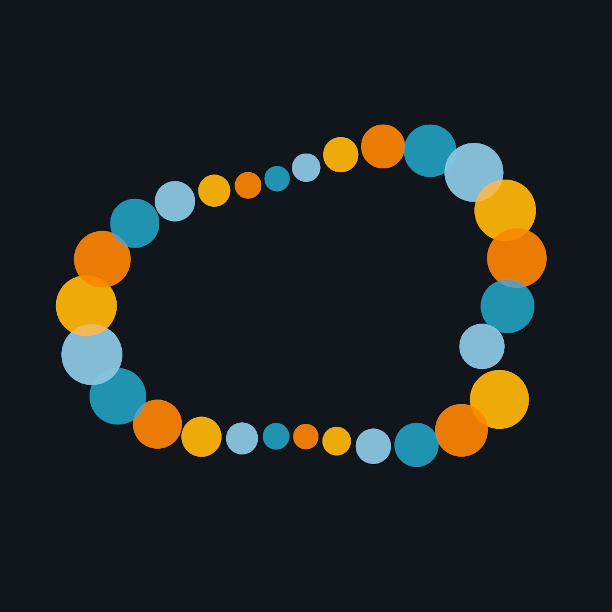
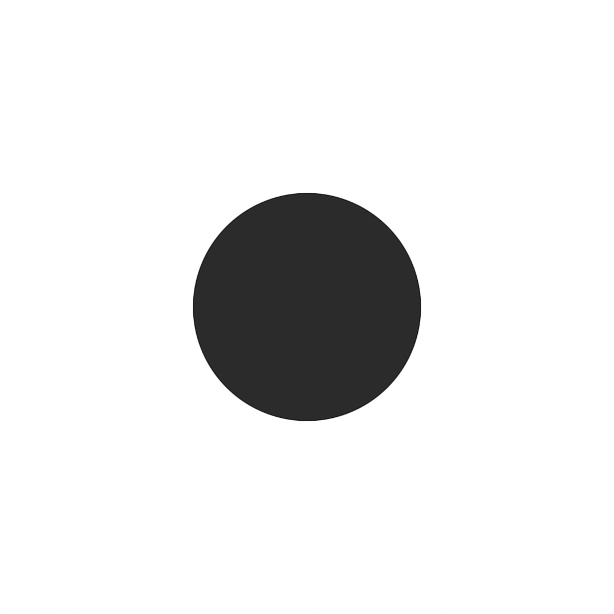
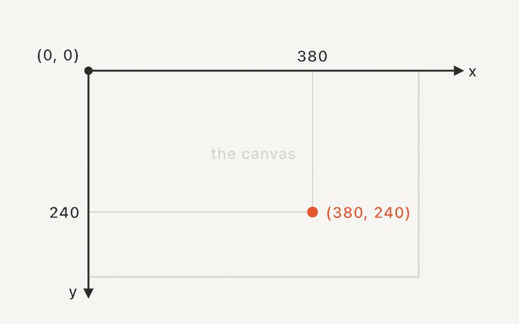
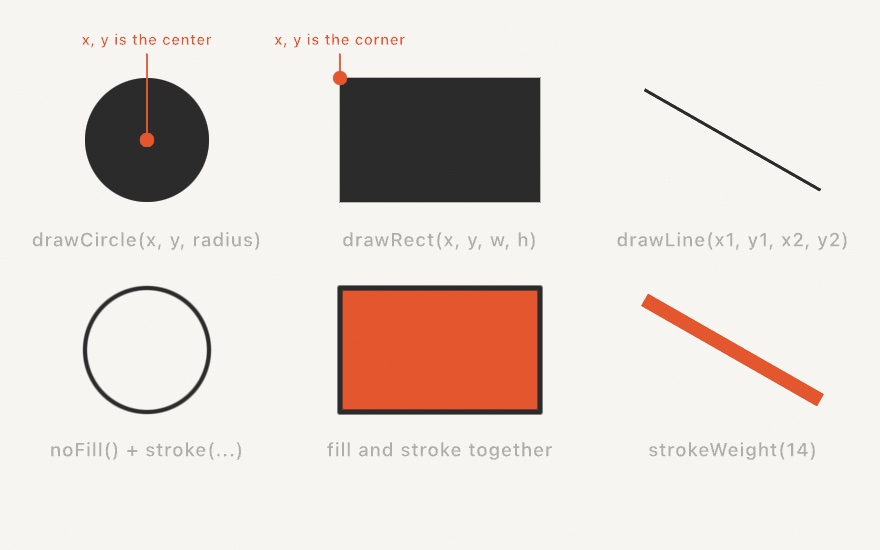
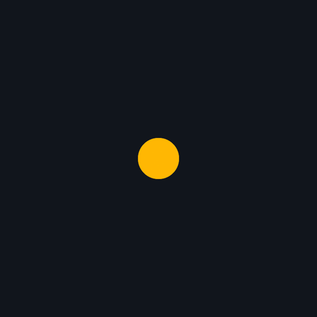
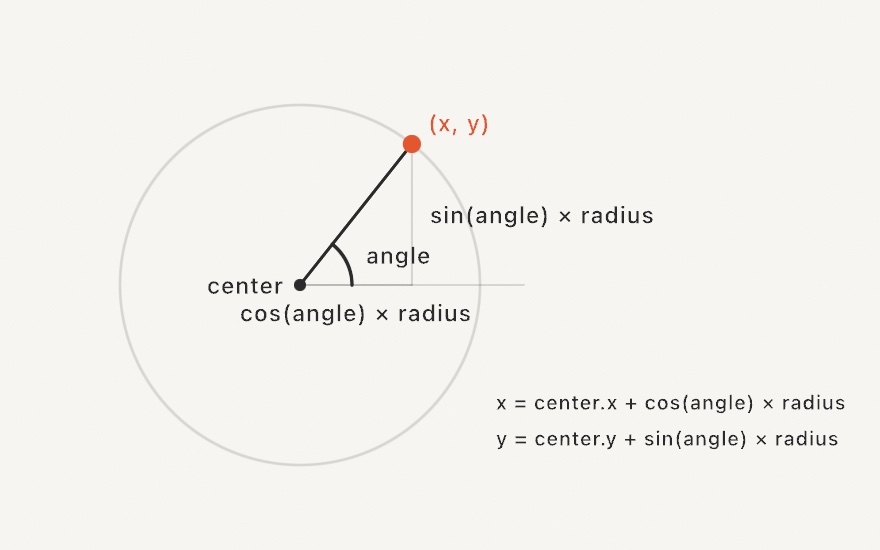

#### <sup>[Ollin](../README.md) → [Guide](README.md) → Chapter 1</sup>

---

# 1. Hello, Ollin



By the end of this chapter, this piece is yours: twenty-eight circles drifting around a ring, each breathing slightly out of step with its neighbors, with a small panel of knobs to play it like an instrument. Every dot is placed and moved by code you'll understand line by line. Getting there takes a working toolchain, one new file, three shapes, and a single idea that carries the whole guide: in Ollin, things move by default.

## What you need

A Mac running macOS 26 or newer, with Apple's Swift tools installed. The easiest way to get them is to install Xcode from the App Store once; you never have to open it, everything in this guide happens in the terminal and your text editor. To check you're ready:

```sh
swift --version
```

If that prints a version, clone the repository and run your first example:

```sh
git clone https://github.com/eaviles/Ollin.git
cd Ollin
swift run Example-Basic-HelloCircle
```

The first build takes a few minutes; after that, builds are quick. A window opens with a circle slowly breathing on a white canvas. That's a sketch: a small program that draws, over and over, fast enough that drawing becomes motion.

While you're here, try `swift run OllinExamples` too. It opens a gallery of every example in the repository with a sidebar to browse them. When a chapter mentions an example, this is a comfortable way to see it.

## Your first sketch

Make a folder for your own work and a file in it. Anywhere works; a folder inside the cloned repository is convenient because you'll run everything from there:

```sh
mkdir MySketches
```

Create `MySketches/FirstCircle.swift` in your editor, with exactly this in it:

```swift
import Ollin

final class FirstCircle: Sketch {
    override func draw() {
        background(.white)
        fill(Color(hex: 0x2B2B2B))
        drawCircle(width / 2, height / 2, 200)
    }
}
```

Then, from the repository folder:

```sh
swift run OllinLive MySketches/FirstCircle.swift
```



A window opens with your circle in it. Three calls made it: `background(.white)` painted the ground, `fill` chose the ink, and `drawCircle` put a circle at a position with a radius.

> **Swift note.** `import Ollin` brings the framework in. `final class FirstCircle: Sketch` declares your sketch: a new thing named `FirstCircle`, built on Ollin's `Sketch`, which is what gives you the canvas, the drawing calls, and the loop. `override func draw()` fills in the one function Ollin calls to render a frame. You never call `draw()` yourself; Ollin calls *you*.

Here is the part that changes how you work. Keep the window open, go back to your editor, change `200` to `320`, and save. The circle grows in place. `OllinLive` watches the file and swaps in every save while the window keeps running. Try breaking it: delete a parenthesis and save. An error prints in the terminal, and your last working sketch keeps drawing. Fix it, save, and you're back. This edit-save-watch loop is how you'll work through the whole guide, so keep the window and the editor side by side.

## Where things go

Every position in a sketch is measured from the canvas's top-left corner: x grows to the right, y grows *downward*. That surprises people who remember math class, where y goes up, but it's how screens have worked for decades, and it's the same convention p5.js and Processing use.



Your canvas is 1080 by 1080 by default (the window is just a scaled preview of it; the [Canvas](../Docs/Core/Canvas.md) page covers choosing other sizes). Inside `draw()`, `width` and `height` always hold the canvas size, which is why `drawCircle(width / 2, height / 2, 200)` lands dead center. Try replacing the coordinates with plain numbers, like `drawCircle(380, 240, 60)`, and check the result against the diagram. Getting a feel for "where is (380, 240)" pays off in every chapter after this one.

## Shapes and ink

You've met `drawCircle`. Its siblings work the same way: a position, then dimensions.



The styling calls around them set what everything after wears. Think of it as picking up a pen: once you set `fill` or `stroke`, every shape you draw from then on uses it, until you change it.

```swift
fill(Color(hex: 0xE4572E))   // shapes get an orange interior
stroke(.black)               // and a black outline
strokeWeight(5)              // five points thick
noFill()                     // or: outline only
noStroke()                   // or: interior only
```

Colors come as names (`.white`, `.black`, and the rest of the CSS set) or as hex values, `Color(hex: 0xE4572E)`, the same six digits you'd use on the web. `background(...)` repaints the whole canvas, so it goes first in `draw()`; everything drawn before it would be covered. There are many more shapes where these came from (ellipses, triangles, stars, even hearts); the [Drawing](../Docs/Drawing/Drawing.md) page is the full catalog.

> **Swift note.** Some calls take bare values in a fixed order, like `drawCircle(540, 540, 200)`: x, y, radius, a convention you'll internalize fast. Others name their values, like `Color(hex: 0xE4572E)`; the `hex:` is part of the call. And `.white` is shorthand for `Color.white`; Swift lets you drop the type name when it's obvious.

## It moves on its own

Now the idea this framework is named for. Change your `drawCircle` line to:

```swift
drawCircle(width / 2 + time * 120, height / 2, 200)
```

Save, and the circle drifts to the right until it leaves the canvas. You didn't set up an animation, and there was no play button to press: `draw()` was already running over and over, at your display's refresh rate (usually 60 or 120 times a second), and `time` simply holds the seconds since the sketch started. Since `time` grows, an x that includes it grows too, and a slightly different picture 60 times a second *is* motion. Everything animated in this guide, from breathing dots to flocking birds, is this one trick: put time into an expression.

(`time` has siblings: `frameCount`, `deltaTime`, `frameRate`. The [Sketch](../Docs/Core/Sketch.md#temporal-state) page lists them; you'll meet them properly in Chapter 3.)

Our drifting circle has a problem, though: it left. To make motion that stays, we'll borrow one recipe from Chapter 3 ahead of time: **`sin`**. For now, all you need to know is this: as its input grows, `sin` glides smoothly between −1 and 1, forever, like a pendulum. Multiply it by a distance and you have a swing:

```swift
let x = width / 2 + sin(time * .tau / 3) * 300
drawCircle(x, height / 2, 70)
```



The `* 300` is how far it swings; `.tau` is the angle of one full turn (about 6.28), and dividing by 3 makes each complete back-and-forth take three seconds. Chapter 3 unpacks why; today it's a recipe.

> **Swift note.** `let x = ...` gives a value a name. Use `let` for values computed fresh each frame (most of what you'll write in `draw()`); `var` is for values that need to change after they're set.

The recipe has a second half, and it's the key to this chapter's finale. `sin` has a twin, `cos`, and together they turn an angle into a point on a circle:



Feed the pair an angle and a radius, and they hand you the x and y of the point that far around the circle. Grow the angle, and the point walks the rim. That's all this guide asks of `cos` and `sin`: they're how you place things *around* something. Chapter 3 shows why it works; Appendix B keeps this picture for whenever you want it back.

## The mouse joins in

Your sketch already knows where the cursor is. Change the drawing line in `FirstCircle.swift` to:

```swift
drawCircle(mouseX, mouseY, 80)
```

The circle now follows your mouse; `mouseX` and `mouseY` update continuously. And since `draw()` runs every frame anyway, reacting to a held button is just an `if`:

```swift
if mouseIsPressed {
    fill(Color(hex: 0xE4572E))
} else {
    fill(Color(hex: 0x2B2B2B))
}
drawCircle(mouseX, mouseY, 80)
```

Hold the button and the circle turns orange. You don't wire up events or register callbacks for this; you ask, every frame, "is the button down right now?", and draw accordingly. Clicks, releases, and the keyboard work similarly; see [Input](../Docs/Helpers/Input.md).

## The payoff: a breathing ring

Time to build the piece from the top of the chapter. Everything in it is something this chapter already taught: a loop places 28 circles around a ring with the `cos`/`sin` recipe, `time` in the angle makes the ring drift, and `sin` swings each circle's ring radius and size so it breathes. Make a new file, `MySketches/HelloMotion.swift`:

```swift
import Ollin

final class HelloMotion: Sketch {
    @Param("Speed", 0...2) var speed = 0.3
    @Param("Size", 8...80) var size = 38.0
    @Param("Circles", 4...120) var count = 28
    @Param("Ground") var ground = Color(hex: 0x11151C)

    let colors: [Color] = [
        Color(hex: 0xFFB703, alpha: 0.85), Color(hex: 0xFB8500, alpha: 0.85),
        Color(hex: 0x219EBC, alpha: 0.85), Color(hex: 0x8ECAE6, alpha: 0.85),
    ]

    override func draw() {
        background(ground)
        noStroke()
        for i in 0..<count {
            let angle = Double(i) / Double(count) * .tau + time * speed
            let breathe = sin(time * 1.4 + Double(i) * 0.5)
            let ring = 310 + breathe * 80
            let x = width / 2 + cos(angle) * ring
            let y = height / 2 + sin(angle) * ring
            fill(colors[i % colors.count])
            drawCircle(x, y, size + breathe * 16)
        }
    }
}
```

Run it with `swift run OllinLive MySketches/HelloMotion.swift` and walk through what each line contributes:

- `Double(i) / Double(count) * .tau` divides the full turn into one slot per circle. Adding `time * speed` grows every angle together, so the whole ring rotates.
- `breathe` is the pendulum again, but notice the `+ Double(i) * 0.5`: each circle runs the same swing slightly out of step with its neighbor. That small offset is what makes the ring ripple organically instead of pulsing in lockstep. Try deleting it and watch the difference.
- `breathe` gets used twice, swinging both the ring's radius (`310 + breathe * 80`) and each circle's size (`size + breathe * 16`), so position and scale breathe together.
- `colors[i % colors.count]` cycles through the palette: circle 0 gets the first color, circle 4 wraps back around.

> **Swift note.** `for i in 0..<count` counts from 0 up to, but not including, `count`. `i` is an `Int` (a whole number) while positions want `Double` (numbers with fractions), so `Double(i)` converts. `[Color]` is a list of colors, `colors.count` its length, and `%` is the remainder after division, which is what makes the palette repeat. These four keep coming back; there's more Swift in the [Swift quick reference](../Docs/Swift.md) whenever you want it.

And the four `@Param` lines? Look at the sidebar of the `OllinLive` window: they became a little control panel. `@Param("Speed", 0...2) var speed = 0.3` declares a knob with a label, a range, and a starting value, and the sketch reads it like any other property. Notice that each knob got the control its type asks for: the two `Double`s became sliders, the whole-number `count` became a stepper, and `ground`, a `Color`, became a color well you can click to open a picker. (There are more: a `Bool` becomes a toggle, a point can even become a draggable pad. You'll meet them as the guide goes on.) The number next to any knob is live too: drag it sideways to scrub the value, or click it to type one in.

Play the panel while the piece runs. Tuned values even survive a save: edit the code, save, and your knob positions carry over into the reloaded sketch instead of snapping back. When a value feels right, copy it back into the code as the new default. This tune-while-it-runs habit is worth building early; almost every piece in this guide gets better when its magic numbers become knobs.

Before moving on, make the piece yours. Some directions worth a try:

- Run `Circles` from 4 to 120 with `Size` low and see what the ring wants to be: a clock face, a chain, a halo.
- Swap the palette. Pick four hex colors you like and paste them in.
- Add a second ring: another loop with a different base radius and its own speed.
- Make the breathing depth (the `80`) a fifth knob and play it.
- Replace `drawCircle` with `drawRect(x, y, size, size)` and see how the character changes.

## Where this comes from

The `setup()`/`draw()` sketch model comes from [Processing](https://processing.org) (Casey Reas and Ben Fry, 2001), the project that made creative coding a field, and continues through [p5.js](https://p5js.org), [openFrameworks](https://openframeworks.cc), and [OPENRNDR](https://openrndr.org), each of which shaped Ollin's design. Ollin's particular bet, motion on by default, inverts the usual arrangement where animation is something you opt into; the name is the Nahuatl word for movement, the seventeenth day sign of the Aztec calendar. The edit-and-watch live-reload loop belongs to a long lineage of live-coding tools; you'll meet its stage-performance form in Chapter 22.

## Go deeper

- [Sketch](../Docs/Core/Sketch.md): the full lifecycle, `noLoop()` for stills, and running a sketch as its own standalone program with `@main`.
- [Canvas](../Docs/Core/Canvas.md): canvas sizes and presets, the preview window, and writing sketches that hold up at any resolution.
- [Drawing](../Docs/Drawing/Drawing.md): every shape and the complete ink state.
- [Input](../Docs/Helpers/Input.md): the keyboard, click hooks, and the rest of the mouse.
- [Parameters](../Docs/Helpers/Parameters.md): the full knob family (toggles, menus, pads, and friends), grouping knobs into cards, icons, smoothing, and driving knobs from MIDI or OSC hardware.
- [The Swift quick reference](../Docs/Swift.md): just enough of the language, for whenever a construct here felt mysterious.
- Worked examples: [`Examples/Basic/HelloCircle`](../Examples/Basic/HelloCircle/Sketch.swift) and the knobs demo [`Examples/Live/Parameters`](../Examples/Live/Parameters/Sketch.swift).

---

[Contents](README.md#contents) · Next: [Chapter 2, Color that works](02-Color.md)
