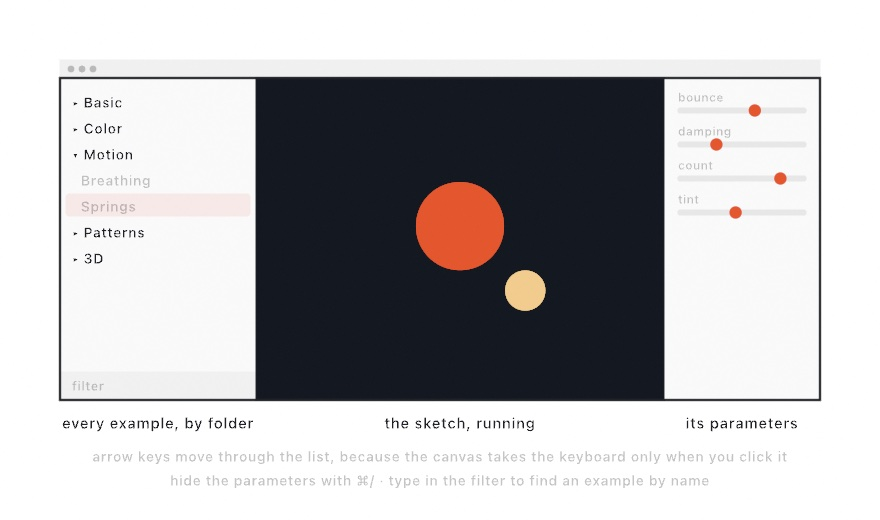
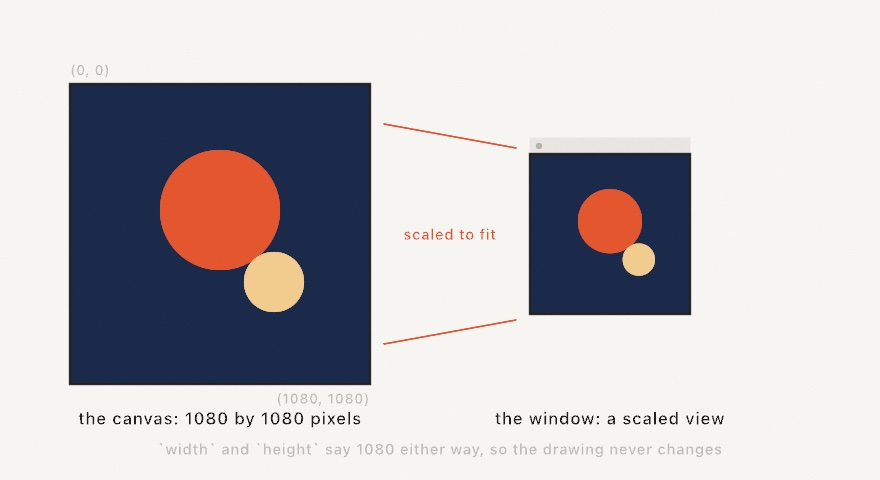
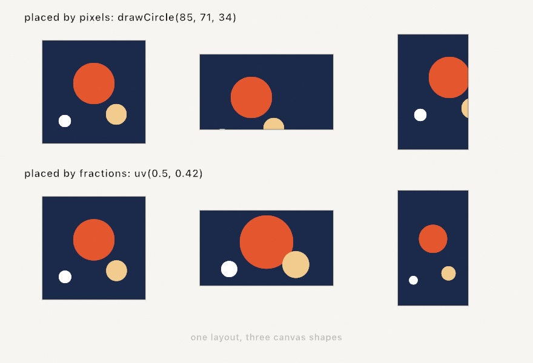
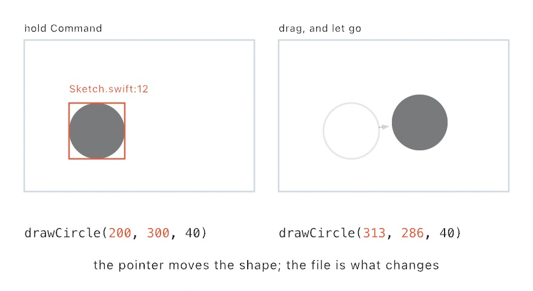
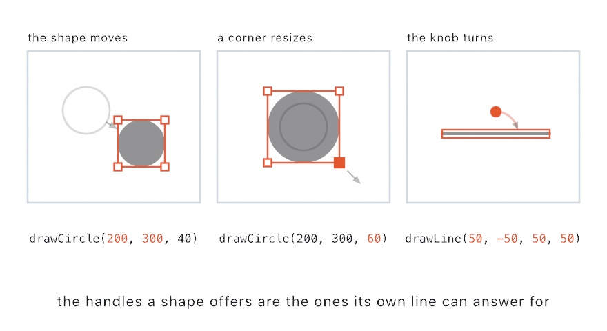
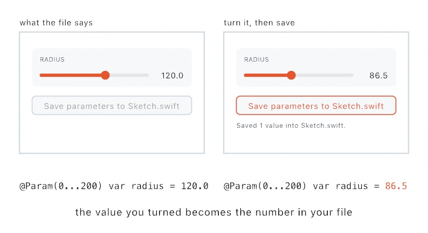

#### <sup>[Ollin](../README.md) → [Guide](README.md) → Chapter 1</sup>

---

# 1. Hello, Ollin


By the end of this chapter you'll have built the piece above. It's twenty-eight circles drifting around a ring, each one breathing slightly out of step with its neighbors, and a small panel of parameters for playing it like an instrument. Every dot is placed and moved by code you'll understand line by line. To get there you need a working toolchain, one new file, and three shapes, and along the way you'll meet the idea that runs through the whole guide: in Ollin, things move by default.

## What you need

A Mac running macOS 26 or newer, with Apple's Swift tools installed. The easiest way to get them is to install Xcode from the App Store once; you never have to open it, everything in this guide happens in the terminal and your text editor. You don't need to know Swift, either. The guide teaches what each step needs as it comes up. [Appendix A](A-JustEnoughSwift.md) is the primer to read first, if you'd rather meet the language whole. To check you're ready:

```sh
swift --version
```

If that prints a version, clone the repository and run your first example:

```sh
git clone https://github.com/eaviles/Ollin.git
cd Ollin
swift run --package-path Examples Example-Basic-HelloCircle
```

The first build takes a few minutes, and after that builds are quick. A window opens with a circle slowly breathing on a white canvas. What you're looking at is a sketch, which is a small program that draws the same picture over and over, changing it a little each time so that the drawing turns into motion.

### The gallery

While you're here, run this too:

```sh
swift run OllinExamples
```

That opens the **gallery**, a window holding every example in the repository. It's worth two minutes now, because this guide points at examples constantly and the gallery is the comfortable way to see them.

<picture>
  <source media="(prefers-color-scheme: dark)" srcset="Images/01-HelloOllin/Gallery-dark.jpg">
  
</picture>

Three panes, and each is doing an obvious job. On the left, every example as a collapsible tree that mirrors the folders on disk, with a filter field at the bottom for finding one by name. In the middle, the selected sketch, actually running rather than pictured. On the right, that sketch's parameters, which you can drag while it runs, and hide with ⌘/ when you want the picture to yourself.

One piece of behavior will confuse you for a moment if nobody mentions it. **Arrow keys move through the example list**, not into the sketch, because the canvas only takes the keyboard once you *click* it. That's deliberate: plenty of examples read key presses, and if the canvas grabbed the keyboard on selection you could never arrow to the next one. Examples that use the keyboard show a small hint saying so, and clicking the canvas hands the keys over.

The thing to remember about the gallery is what it isn't. It's not a separate collection of demos: every entry is an ordinary sketch file sitting at `Examples/<Group>/<Name>/Sketch.swift`, the same shape as the file you're about to write. When one does something you want, open it, read it, copy the part you need.

## Your first sketch

Make a folder for your own work and a file in it. Anywhere works; a folder inside the cloned repository is convenient because you'll run everything from there:

```sh
mkdir MySketches
```

Create `MySketches/FirstCircle.swift` in your editor, with exactly this in it:

```swift
import Ollin

final class FirstCircle: Sketch {
    override func draw() {
        background(.white)
        fill(Color(hex: 0x2B2B2B))
        drawCircle(width / 2, height / 2, 200)
    }
}
```

Then, from the repository folder:

```sh
swift run OllinLive MySketches/FirstCircle.swift
```


A window opens with your circle in it. Three calls made it happen. `background(.white)` painted the ground, `fill` chose the ink, and `drawCircle` put a circle at a position with a radius.

> **Swift note.** `import Ollin` brings the framework in. `final class FirstCircle: Sketch` declares your sketch, a new thing named `FirstCircle` built on Ollin's `Sketch`, which is what gives you the canvas, the drawing calls, and the loop. `override func draw()` fills in the one function Ollin calls to render a frame. You never call `draw()` yourself, because Ollin is the one calling it.

The next part is what will change how you work. Keep the window open, go back to your editor, change `200` to `320`, and save. The circle grows in place, because `OllinLive` watches the file and swaps in every save while the window keeps running. Now try breaking it on purpose: delete a parenthesis and save. An error prints in the terminal while your last working sketch keeps drawing, so nothing is lost. Fix the parenthesis, save again, and you're back where you were. You'll work this way through the whole guide, so it's worth arranging the window and the editor side by side now.

## Once, then every frame

`draw()` is one of two functions Ollin calls for you. The other is `setup()`, and it runs a single time, before the first frame is drawn:

```swift
final class FirstCircle: Sketch {
    override func setup() {
        // runs once, before anything is drawn
    }

    override func draw() {
        // runs again for every frame, for as long as the window is open
    }
}
```

Anything that should happen once belongs in `setup()`. That means work heavy enough that repeating it sixty times a second would slow the sketch down, and decisions you want the sketch to make once and then keep. You don't need it yet, since everything in this chapter is drawn fresh each frame from numbers that are cheap to compute. It arrives properly in [Chapter 2](02-Color.md), where reading the colors out of a photograph turns out to be too slow to repeat, and again in [Chapter 3](03-MotionAndTime.md), where an animation has to be told once that it should loop.

## Where things go

Every position in a sketch is measured from the canvas's top-left corner, with x growing to the right and y growing *downward*. That surprises people who remember math class, where y goes up, but it's how screens have worked for decades, and it's the same convention p5.js and Processing use.

<picture>
  <source media="(prefers-color-scheme: dark)" srcset="Images/01-HelloOllin/CoordinateSystem-dark.jpg">
  
</picture>

Inside `draw()`, `width` and `height` always hold the canvas size, which is why `drawCircle(width / 2, height / 2, 200)` lands dead center. Try replacing the coordinates with plain numbers, like `drawCircle(380, 240, 60)`, and check the result against the diagram. Building a feel for where a coordinate lands will serve you in every chapter after this one.

## The canvas is not the window

This trips up almost everyone once, so it's worth being clear about early. The thing you draw on and the thing you look at are two different things.

<picture>
  <source media="(prefers-color-scheme: dark)" srcset="Images/01-HelloOllin/CanvasVsWindow-dark.jpg">
  
</picture>

The **canvas** is a fixed grid of pixels, 1080 by 1080 unless you say otherwise, and it's what all your coordinates are measured against. The **window** is a scaled view of that canvas, sized to fit comfortably on your screen. Drag the window smaller and the picture gets smaller on screen, but nothing about your sketch changes. `width` still reports 1080, a circle at `(540, 540)` is still exactly in the middle, and an exported image comes out at full canvas resolution regardless of how big the window happened to be.

Two properties control the pair, and they're independent:

```swift
override var canvasSize: CanvasSize { .square(1080) }   // the pixels you draw on
override var windowMode: WindowMode { .auto }           // how it's previewed
```

`canvasSize` takes a square, an explicit width and height, or one of the named presets, and the presets are worth skimming once so you know what's there: `.fhd1080` and `.uhd4K` for video, `.vertical1080` for a phone screen, and real paper sizes like `.a4` and `.usLetter` for printing. Paper sizes come with a companion, since `.a4.dpi(300)` keeps the page the same physical size while raising the pixel grid to print resolution.

`windowMode` is `.auto` by default, which picks a preview size that fits your screen. `.fixed(0.5)` pins the preview to a specific fraction, and `.resizable` lets you drag it. None of these change the drawing.

## Placing things without pixels

Once you know the canvas can be any size, a habit becomes worth forming immediately, because it will save you rewriting layouts later.

<picture>
  <source media="(prefers-color-scheme: dark)" srcset="Images/01-HelloOllin/NormalizedPlacement-dark.jpg">
  
</picture>

Writing `drawCircle(85, 71, 34)` says "85 pixels from the left". That's fine until the canvas changes shape, and then, as the top row shows, your careful arrangement slides off the edge. Writing the same position as a *fraction* of the canvas says "a bit left of center, near the top", which is what you actually meant, and it survives any canvas you give it.

```swift
drawCircle(center: uv(0.5, 0.42), radius: scale * 0.2)
```

`uv(u, v)` hands back the canvas point at those fractions, so `uv(0, 0)` is the top-left corner, `uv(1, 1)` the bottom-right, and `uv(0.5, 0.5)` the middle. Sizes want the same treatment, and `scale` is a single number that tracks the canvas dimensions, so multiplying by it keeps a circle the same relative size whether you render at 1080 pixels or at print resolution.

You don't have to do this everywhere, and plenty of sketches in this guide use plain pixels because they only ever run at one size. But when you find yourself wanting to export a piece for a poster as well as a screen, the sketch that was written in fractions just works.

## Shapes and ink

You've met `drawCircle`. Its siblings follow the same pattern, a position first and then dimensions, with one difference that's worth knowing before it surprises you: a circle's position is its *center*, while a rectangle's is its *top-left corner*.

<picture>
  <source media="(prefers-color-scheme: dark)" srcset="Images/01-HelloOllin/FirstShapes-dark.jpg">
  
</picture>

The styling calls around them set what everything after wears. Think of it as picking up a pen: once you set `fill` or `stroke`, every shape you draw from then on uses it, until you change it.

```swift
fill(Color(hex: 0xE4572E))   // shapes get an orange interior
stroke(.black)               // and a black outline
strokeWeight(5)              // five points thick
noFill()                     // or: outline only
noStroke()                   // or: interior only
```

Colors come as names (`.white`, `.black`, and the rest of the CSS set) or as hex values like `Color(hex: 0xE4572E)`, the same six digits you'd use on the web. `background(...)` repaints the whole canvas, so it goes first in `draw()`, since anything drawn before it would be covered up. There are many more shapes where these came from, including ellipses, triangles, stars, and even hearts, and the [Drawing](../Docs/Drawing/Drawing.md) page is the full catalog.

When you want a rectangle centered on a point instead of hung from its corner, ask for it by name: `drawRect(center: Vector2(x, y), width: w, height: h)`. Most shapes offer both forms, one taking bare numbers in a fixed order and one naming the anchor, and naming the anchor is how you say which part of the shape the position refers to.

> **Swift note.** `Vector2(x, y)` bundles an x and a y into a single value, so you can pass a position around as one thing instead of two loose numbers. That's all you need from it here. [Chapter 10](10-Vectors.md) gives it a whole chapter, because once a position is one value you can add positions together, and that turns out to be how motion and forces get written.

> **Swift note.** Some calls take bare values in a fixed order, like `drawCircle(540, 540, 200)` for x, y, and radius, which is a convention you'll internalize quickly. Others name their values, like `Color(hex: 0xE4572E)`, where the `hex:` is part of the call. And `.white` is shorthand for `Color.white`, because Swift lets you drop the type name when it can already tell what you mean.

## Moving something by hand

Placing a shape by typing numbers is fine until you want it *a bit to the left*. Then it becomes a loop of guessing: change 300 to 280, save, look, change it again.

While the sketch is running under `swift run OllinLive`, you can skip that. Hold Command and move the pointer over the window. The shape under it is outlined, and the line of your file that drew it is named above the outline. Drag the shape where you want it, let go, and those numbers in your file are the ones that change.

<picture>
  <source media="(prefers-color-scheme: dark)" srcset="Images/01-HelloOllin/DragToSource-dark.jpg">
  
</picture>

Your editor will offer to reload the file, and the running window has already reloaded itself. Nothing else on the line moves: the radius, your spacing, and the comment you left at the end are all where you put them.

The shape itself is only the first of three things to take hold of. Small squares sit on its corners, and a small circle stands clear above it.

<picture>
  <source media="(prefers-color-scheme: dark)" srcset="Images/01-HelloOllin/DragHandles-dark.jpg">
  
</picture>

A corner changes the numbers that *size* the shape and leaves the ones that place it alone. So a circle grows from its middle. A rectangle written `drawRect(x, y, width, height)` grows from its top-left corner, which is where those first two numbers put it. That is also why such a rectangle offers three corners and not four. The fourth sits on the corner that places it, and has nothing to scale.

The knob turns the shape, and it only appears when the line can say which way the shape faces. A line has two ends, so both swing about the middle. An arc carries its own two angles, so those move instead. A circle has neither, so it shows no knob at all. What turns a circle is a `rotate` further up the file, which this does not touch.

Two things are worth knowing before you rely on any of it. A number written whole stays whole: a shape placed at `300` lands on `286`, never `285.7`, and a nudge under half a point changes nothing. And only a plain number can be dragged. If you wrote `drawCircle(width / 2, 300, 40)`, that first slot holds no number to change. The host says so rather than moving anything: *places this shape with `width / 2`, so there is no number to move.*

There is one exception, and you will meet the parameters it needs in a moment. A coordinate written as the name of a `@Param` has no number on the line either, but it does have somewhere to put the value:

```swift
@Param(60 ... 660) var sunX = 120.0

drawCircle(sunX, 120, 40)     // dragging this turns sunX
```

The drag sets that parameter instead of writing the file. Nothing recompiles, so it is the quickest of the three. The value stays put across the next reload, the way any parameter you change by hand does.

That limit is the honest shape of the feature. The file is the sketch, and dragging edits the file. So anything the file works out for itself is changed the way it was written. [Dragging a shape](../Docs/Tools/DragToEdit.md) covers the rest, including named points and lines with two ends.

## It moves on its own

This is the idea the framework is named for. Change your `drawCircle` line to:

```swift
drawCircle(width / 2 + time * 120, height / 2, 200)
```

Save, and the circle drifts to the right until it leaves the canvas. You didn't set up an animation and there was no play button to press. `draw()` was already running over and over, at your display's refresh rate of 60 or 120 times a second, and `time` holds the seconds since the sketch started. So when `time` grows, an x computed from it grows along with it, and the circle lands somewhere slightly different on every frame. Drawing that sequence quickly is what we read as motion. Nearly everything animated in this guide works this way, from breathing dots to flocking birds: you put time into an expression.

(`time` has siblings called `frameCount`, `deltaTime`, and `frameRate`. The [Sketch](../Docs/Core/Sketch.md#temporal-state) page lists them, and you'll meet them properly in [Chapter 3](03-MotionAndTime.md).)

Our drifting circle has a problem, though, which is that it left. To make motion that stays on the canvas, we'll borrow one recipe from [Chapter 3](03-MotionAndTime.md) ahead of time: `sin`. All you need to know for now is that as its input grows, `sin` glides smoothly between −1 and 1 and then back again, forever, the way a pendulum swings. Multiply it by a distance and you have a swing of your own:

```swift
let x = width / 2 + sin(time * .tau / 3) * 300
drawCircle(x, height / 2, 70)
```


The `* 300` is how far it swings. `.tau` is the angle of one full turn, about 6.28, and dividing it by 3 makes each complete back-and-forth take three seconds. [Chapter 3](03-MotionAndTime.md) explains why that works, and for today you can use it as a recipe.

> **Swift note.** `let x = ...` gives a value a name. Use `let` for values computed fresh each frame (most of what you'll write in `draw()`); `var` is for values that need to change after they're set.

The recipe has a second half, and it's what the end of this chapter is built on. `sin` has a twin called `cos`, and together they turn an angle into a point on a circle:

<picture>
  <source media="(prefers-color-scheme: dark)" srcset="Images/01-HelloOllin/AroundACircle-dark.jpg">
  
</picture>

Feed the pair an angle and a radius, and they hand you the x and y of the point that far around the circle. Grow the angle and the point walks the rim. For now that's all this guide asks of `cos` and `sin`, that they're how you place things *around* something. [Chapter 3](03-MotionAndTime.md) shows why it works, and [Appendix B](B-JustEnoughMath.md#an-angle-and-a-radius-make-a-point) keeps this picture for whenever you want it back.

## The mouse joins in

Your sketch already knows where the cursor is. Change the drawing line in `FirstCircle.swift` to:

```swift
drawCircle(mouseX, mouseY, 80)
```

The circle now follows your mouse; `mouseX` and `mouseY` update continuously. And since `draw()` runs every frame anyway, reacting to a held button is just an `if`:

```swift
if mouseIsPressed {
    fill(Color(hex: 0xE4572E))
} else {
    fill(Color(hex: 0x2B2B2B))
}
drawCircle(mouseX, mouseY, 80)
```

Hold the button and the circle turns orange. You don't wire up events or register callbacks for this. Because `draw()` is running anyway, you can simply ask "is the button down right now?" on every frame and draw accordingly. Clicks, releases, and the keyboard work the same way, and [Input](../Docs/Helpers/Input.md) has the rest of them.

### A shorter way to run things

Typing `swift run OllinLive path/to/thing.swift` from inside the repository folder every time gets old, and it also means your sketches have to live somewhere near the repository. There's a one-time fix.

```sh
Scripts/ollin install        # run once, from the repository folder
```

That puts an `ollin` command on your path, and from then on a sketch is just a file you can run from anywhere:

```sh
ollin new NextIdea.swift     # writes a starter sketch, named after the file
ollin NextIdea.swift         # opens it in the live window
```

The thing worth understanding here is what a sketch actually *is* in Ollin. It's one `.swift` file. Not a project, not a folder with configuration in it, not something you have to register anywhere. That's deliberate, because it means a sketch is small enough to keep in a notes folder, mail to someone, or paste into a message, and it will run on any machine that has Ollin. Every export option works on a loose file too, so `ollin NextIdea.swift --export-gif out.gif` renders a GIF from a file sitting on your desktop.

If you want to go one step further, putting `#!/usr/bin/env ollin` on the first line and running `chmod +x` on the file makes the sketch directly executable, so `./NextIdea.swift` opens it.

The guide keeps writing the full `swift run OllinLive` form so everything works whether or not you installed the shortcut. [Single-file sketches](../Docs/Tools/SingleFile.md) covers the rest.

## When one file isn't enough

A file stops being enough the moment the sketch needs things next to it: photographs, a font, a shader, a second file's worth of code. At that point you want a folder, and you should not have to build one by hand.

```sh
ollin new MyPiece                                  # a folder that builds and runs
ollin new MyPiece --template shader --with audio   # wired for a shader and the microphone
```

That writes a small project: the sketch, a manifest that already knows where the framework is, a place to put your material, and a README with the commands in it. `swift run MyPiece` runs it, and `ollin Sources/MyPiece/Sketch.swift` opens that same file in the live window, so you keep the edit-and-save loop you just learned.

The `--template` part is worth knowing about early. A template is not an empty file; it is a small sketch that already does something, so you start by changing something that works instead of facing a blank `draw()`. There are ten, from a plain breathing circle to pen-ready line work to a lit 3D solid.

```sh
ollin generate
```

This is the same thing in a window, and it does one thing the terminal cannot: it *runs* each template while you look at it. Pick a starting point by watching it move, tick what the sketch should be wired for, and press Create.

Nothing about this changes what a sketch is. It is still your `.swift` file, still readable on its own, and the folder is just somewhere to keep it and its material. [The project generator](../Docs/Tools/ProjectGenerator.md) has the whole list of templates and options.

## Looking something up without leaving the terminal

You are going to want to look things up constantly, and switching to a browser to do it breaks the loop you just built. Everything the documentation says is already on your machine, in the folder you cloned, so you can read it where you are working:

```sh
ollin docs color             # the page about color
ollin examples flocking      # the example, what it shows, how to run it
```

Name a page however you happen to think of it. `Color`, `Drawing/Color`, and a word from its description all land on the same page. An exact name always wins over a page that merely mentions the word. A long page can be opened at one part of itself:

```sh
ollin docs Color#ramps
```

The command that pays for itself, though, is the one for when you know what you want and not what it is called:

```sh
ollin docs --search "long exposure"
```

That reads every page and shows you each line that says it, with the page and the heading it sits under. A topic that matches no page falls through to the same search, so a wrong guess still tells you something.

The examples answer the other half of the question. `ollin examples` with no filter lists all of them, grouped by folder. With a word, it finds the ones whose name, folder, or description matches. And `--source` prints the sketch itself, which is often the fastest answer there is:

```sh
ollin examples ocean --source
```

None of this needs a network. [The reference offline](../Docs/Tools/Reference.md) covers the rest, including how it behaves in a pipe.

## Putting it together: a breathing ring

Now we can build the piece from the top of the chapter, and everything in it is something this chapter has already covered. A loop places 28 circles around a ring using the `cos` and `sin` recipe, `time` inside the angle makes the whole ring drift, and `sin` swings both the ring's radius and each circle's size so that the piece breathes. Make a new file, `MySketches/HelloMotion.swift`:

```swift
import Ollin

final class HelloMotion: Sketch {
    @Param("Speed", 0...2) var speed = 0.3
    @Param("Size", 8...80) var size = 38.0
    @Param("Circles", 4...120) var count = 28
    @Param("Ground") var ground = Color(hex: 0x11151C)

    let colors: [Color] = [
        Color(hex: 0xFFB703, alpha: 0.85), Color(hex: 0xFB8500, alpha: 0.85),
        Color(hex: 0x219EBC, alpha: 0.85), Color(hex: 0x8ECAE6, alpha: 0.85),
    ]

    override func draw() {
        background(ground)
        noStroke()
        for i in 0..<count {
            let angle = Double(i) / Double(count) * .tau + time * speed
            let breathe = sin(time * 1.4 + Double(i) * 0.5)
            let ring = 310 + breathe * 80
            let x = width / 2 + cos(angle) * ring
            let y = height / 2 + sin(angle) * ring
            fill(colors[i % colors.count])
            drawCircle(x, y, size + breathe * 16)
        }
    }
}
```

Run it with `swift run OllinLive MySketches/HelloMotion.swift` and walk through what each line contributes:

- `Double(i) / Double(count) * .tau` divides the full turn into one slot per circle. Adding `time * speed` grows every angle together, so the whole ring rotates.
- `breathe` is the pendulum again, and the part to notice is the `+ Double(i) * 0.5`, which starts each circle's swing a little later than its neighbor's. That small offset is what makes the ring ripple organically instead of pulsing in lockstep. Try deleting it and watch the difference.
- `breathe` gets used twice, swinging both the ring's radius (`310 + breathe * 80`) and each circle's size (`size + breathe * 16`), so position and scale breathe together.
- `colors[i % colors.count]` cycles through the palette, so circle 0 gets the first color and circle 4 wraps back around to it.

> **Swift note.** `for i in 0..<count` counts from 0 up to, but not including, `count`. `i` is an `Int` (a whole number) while positions want `Double` (numbers with fractions), so `Double(i)` converts. `[Color]` is a list of colors, `colors.count` its length, and `%` is the remainder after division, which is what makes the palette repeat. These four keep coming back; there's more Swift in the [Swift quick reference](../Docs/Swift.md) whenever you want it.

That leaves the four `@Param` lines. Look at the sidebar of the `OllinLive` window and you'll find they became a small control panel. `@Param("Speed", 0...2) var speed = 0.3` declares a parameter with a label, a range, and a starting value, and the sketch reads it like any other property. Each parameter arrived as the control its type asks for, so the two `Double`s became sliders, the whole-number `count` became a stepper, and `ground`, being a `Color`, became a well you can click to open a picker. There are more of these, including a toggle for a `Bool` and a draggable pad for a point, and you'll meet them as the guide goes on. The number beside any parameter is live as well, so you can drag it sideways to scrub the value or click it to type one in.

Play the panel while the piece runs. Your tuned values survive a save, which means you can edit the code, save, and find your parameter positions carried over into the reloaded sketch instead of snapping back to the defaults. It's a habit worth building early, because almost every piece in this guide gets better once its magic numbers become parameters.

Before moving on, make the piece yours. Some directions worth trying:

- Run `Circles` from 4 to 120 with `Size` low and see what the ring wants to be: a clock face, a chain, a halo.
- Swap the palette. Pick four hex colors you like and paste them in.
- Add a second ring: another loop with a different base radius and its own speed.
- Make the breathing depth (the `80`) a fifth parameter and play it.
- Replace `drawCircle` with `drawRect(center: Vector2(x, y), width: size, height: size)` and see how the character changes. Use the `center:` form here, because the positional `drawRect(x, y, size, size)` would hang each square down and to the right of its place on the ring.

## Keeping the numbers you turned

There is one thing the panel cannot do on its own, and it is the obvious one: remember. A tuned value lives in the running program, so quitting drops it. That is why tuning used to end by hand. You copied each parameter position back into the code, one at a time, and hoped you read the right one.

The button under the rows does that for you. Press **Save parameters to Sketch.swift**, and every value you turned goes into the `@Param` line that declared it.

<picture>
  <source media="(prefers-color-scheme: dark)" srcset="Images/01-HelloOllin/ParametersToSource-dark.jpg">
  
</picture>

Only the parameters you actually moved are written, and only the value on the line changes. Your label, your range, your spacing, and the comment you left at the end are all where you put them. The host then reloads the sketch from the file, the same way it does after any save of your own.

A number keeps the shape you gave it. A whole default stays whole while the value is whole, and one written with a point keeps its point. That second rule matters more than it looks, because `86` and `86.0` are different types to Swift, and only one of them is the parameter you declared.

The same limit as the drag applies, for the same reason. A default the sketch works out has no value to replace:

```swift
@Param(0...900) var radius = side / 3
```

The line under the button says so and names what stands there. Write a number in its place if you want the parameter to reach it.

## Where this comes from

The `setup()` and `draw()` sketch model comes from [Processing](https://processing.org) (Casey Reas and Ben Fry, 2001), the project that made creative coding a field, and it continues through [p5.js](https://p5js.org), [openFrameworks](https://openframeworks.cc), and [OPENRNDR](https://openrndr.org), each of which shaped Ollin's design. What Ollin does differently is leave motion on by default, turning around the usual arrangement where animation is something you opt into. The name is the Nahuatl word for movement, the seventeenth day sign of the Aztec calendar. The edit-and-watch live-reload loop belongs to a long lineage of live-coding tools, and you'll meet its stage-performance form in [Chapter 31](31-SharingAndPerforming.md).

## Go deeper

- [The frame](../Docs/Concepts/Frame.md): one screen on what a drawing call actually does, why the picture is built from nothing each time, and what happens once `draw()` returns.
- [Where a point is](../Docs/Concepts/Coordinates.md): one screen on the coordinates above, the difference between a point and a pixel, and the other frames that arrive with a camera, a 3D scene, or a machine.
- [Sketch](../Docs/Core/Sketch.md): the full lifecycle, `noLoop()` for stills, and running a sketch as its own standalone program with `@main`.
- [Canvas](../Docs/Core/Canvas.md): canvas sizes and presets, the preview window, and writing sketches that hold up at any resolution (`scale` for sizes, and `uv(u, v)` for placing things as 0…1 fractions of the canvas).
- [Drawing](../Docs/Drawing/Drawing.md): every shape and the complete ink state.
- [The project generator](../Docs/Tools/ProjectGenerator.md): every template and option behind `ollin new` and `ollin generate`, what a generated folder holds, and how to add a template of your own.
- [Dragging a shape](../Docs/Tools/DragToEdit.md): everything a Command-drag can move, what it writes, and why a calculation is refused by name.
- [The reference offline](../Docs/Tools/Reference.md): `ollin docs` and `ollin examples` in full, including one section of a page, the search across everything, and what happens in a pipe.
- [Input](../Docs/Helpers/Input.md): the keyboard, click hooks, and the rest of the mouse.
- [Parameters](../Docs/Helpers/Parameters.md): the full parameter family (toggles, menus, pads, and friends), grouping parameters into cards (with an advanced group folded behind a disclosure row), icons, smoothing, saving a tuned set back into the code, and driving parameters from MIDI or OSC hardware.
- [Appendix A, Just enough Swift](A-JustEnoughSwift.md): the language met properly, every construct these sketches lean on taught in order. [The Swift quick reference](../Docs/Swift.md) is its terse sibling, for whenever a single construct felt mysterious.
- Appendix B draws this chapter's math, one picture per idea: [Where things are](B-JustEnoughMath.md#where-things-are), [Angles and circles](B-JustEnoughMath.md#angles-and-circles), [Fractions, mapping, and wrapping](B-JustEnoughMath.md#fractions-mapping-and-wrapping).
- Worked examples: [`Examples/Basic/HelloCircle`](../Examples/Basic/HelloCircle/Sketch.swift), the parameters demo [`Examples/Live/Parameters`](../Examples/Live/Parameters/Sketch.swift), a page of shapes to drag around, [`Examples/Live/DragToEdit`](../Examples/Live/DragToEdit/Sketch.swift), and the whole press-drag-release surface as a toy, [`Examples/Input/Drag`](../Examples/Input/Drag/Sketch.swift).

---

[Contents](README.md#contents) · Next: [Chapter 2, Color that works](02-Color.md)
