#### <sup>[Ollin](../README.md) → [Guide](README.md) → Chapter 1</sup>

---

# 1. Hello, Ollin

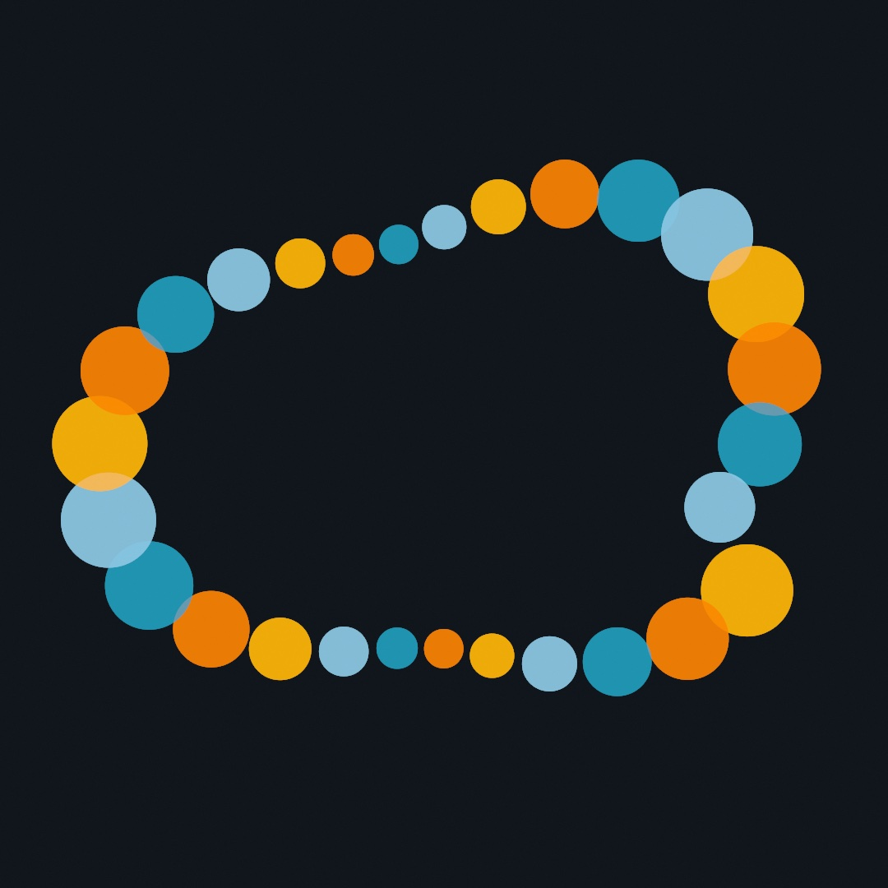

This chapter builds the sketch above. Twenty-eight circles drift around a ring, each breathing a little out of step with its neighbors. A small panel of parameters tunes them while it runs. Every dot is placed and moved by code you can read line by line. Getting there takes a working toolchain, one new file, and three shapes. On the way you learn what creative coding is and how its work goes. You also meet the idea this guide returns to in every chapter: in Ollin, things move by default. After the sketch, two more sections show how to move a shape by dragging it, and the `ollin` command that runs a sketch from anywhere.

## What you need

You need a Mac running macOS 26 or newer, and Apple's Swift tools. Installing Xcode from the App Store is the easiest way to get them. Once its first-run setup finishes you never have to open it again. Everything in this guide happens in the terminal and your text editor. You don't need to know Swift either, because the guide teaches what each step needs as it comes up. [Appendix A](A-JustEnoughSwift.md) is the primer to read first, if you'd rather meet the language whole.

Two commands say whether the machine is ready:

```sh
swift --version        # Ollin needs 6.3 or newer
xcrun --find metal     # the Metal compiler Ollin draws with
```

If either one fails, finish Xcode's setup and let it install its additional components, then try again. With both working, clone the repository:

```sh
git clone https://github.com/eaviles/Ollin.git
cd Ollin
```

The repository carries a fuller check than those two commands, and it is the first thing to run when something later refuses to work. From the folder you just cloned:

```sh
Scripts/ollin doctor
```

It asks about the system, the Swift compiler, the graphics chip, the shaders, the `ollin` command, and the permissions a sketch might need. Metal is the part of macOS that draws with the graphics chip, and a shader is a small program that runs on it. Ollin draws through both, and you write a shader of your own in [Chapter 18](18-YourFirstShader.md). Each answer gets a mark. `ok` is settled. `--` is a note, and nothing is waiting on it. `no` would stop a sketch from running, and a `fix:` line under it says what to do.

<picture>
  <source media="(prefers-color-scheme: dark)" srcset="Images/01-HelloOllin/CheckingTheMachine-dark.jpg">
  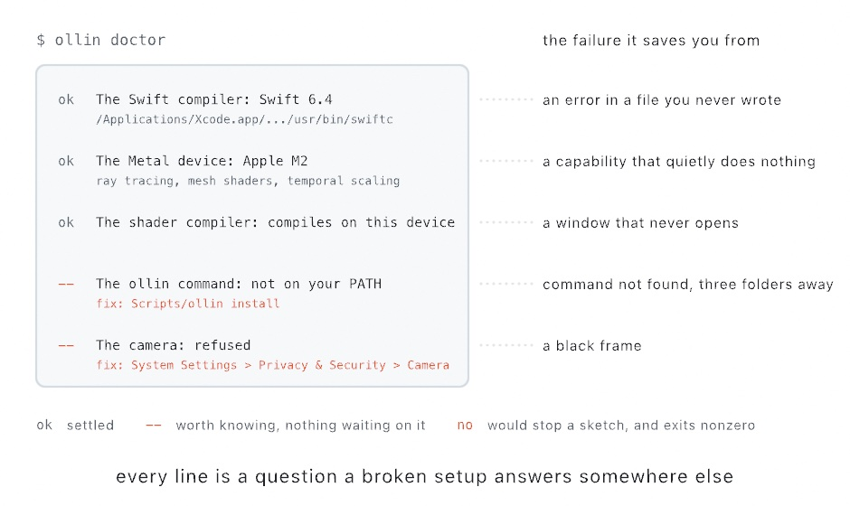
</picture>

The report exists because a broken setup rarely fails where the problem is. A shader library that won't compile reads as a window that never opens, and a camera nobody granted reads as a black frame. The figure pairs five of the answers with the failure each one saves you from. [Checking the machine](../Docs/Tools/Doctor.md) goes through the report answer by answer.

Now run your first example:

```sh
swift run --package-path Examples Example-Basic-HelloCircle
```

The first build takes a few minutes, and after that builds are quick. A window opens with a circle slowly breathing on a white canvas. That is a **sketch**: a small program that draws a picture. Ollin runs its drawing commands again for every frame, and changing the numbers between frames is what turns the picture into motion.

A running sketch keeps the terminal busy, so quit it with ⌘Q when you've looked at it.

### The gallery

The repository holds a few hundred examples, and one command opens all of them:

```sh
swift run OllinExamples
```

That opens the **gallery**, a window holding every example in the repository. Give it two minutes now, because this guide points at examples constantly and the gallery is where you look at them.

<picture>
  <source media="(prefers-color-scheme: dark)" srcset="Images/01-HelloOllin/Gallery-dark.jpg">
  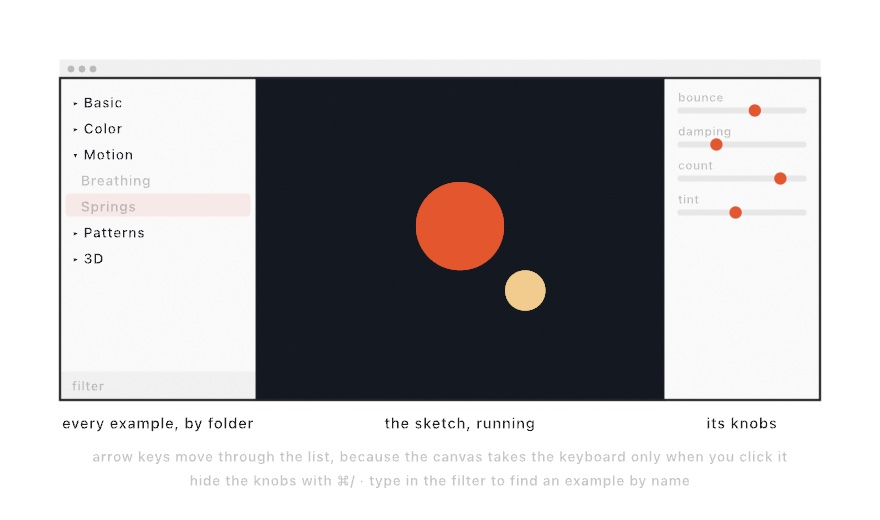
</picture>

The window has three panes. On the left, every example, as a collapsible tree that mirrors the folders on disk. A filter field at the bottom finds one by name. In the middle, the selected sketch, running rather than pictured. On the right, that sketch's parameters, which you can drag while it runs, and hide with ⌘/ when you want the picture to yourself.

**Arrow keys move through the example list**, not into the sketch. The canvas takes the keyboard only once you *click* it. That way you can still arrow to the next example while a sketch is reading key presses. Examples that use the keyboard show a small hint saying so, and clicking the canvas hands the keys over.

Every entry is an ordinary sketch file sitting at `Examples/<Group>/<Name>/Sketch.swift`, the same shape as the file you're about to write. When one does something you want, open it, read it, copy the part you need.

Quit the gallery with ⌘Q before the next command, or leave it running and open a second terminal tab in the repository folder.

## Your first sketch

Make a folder for your own work and a file in it. A folder inside the cloned repository is convenient, because the commands below all run from the repository folder:

```sh
mkdir MySketches
```

Create `MySketches/FirstCircle.swift` in your editor, with exactly this in it:

```swift
import Ollin

final class FirstCircle: Sketch {
    override func draw() {
        background(.white)
        fill(Color(hex: 0x2B2B2B))
        drawCircle(width / 2, height / 2, 200)
    }
}
```

Then, from the repository folder:

```sh
swift run OllinLive MySketches/FirstCircle.swift
```

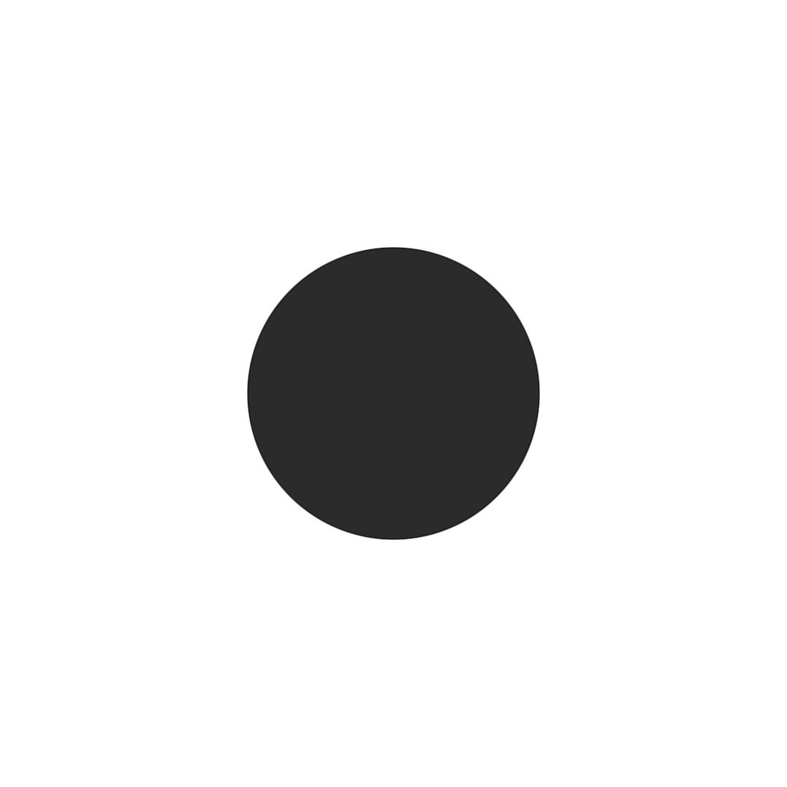

A window opens with your circle in it. Three calls made it happen. `background(.white)` fills the canvas, `fill` sets the color the next shape is drawn in, and `drawCircle` draws it. Its three numbers are x, y, and radius, in that order, and the radius is the distance from the circle's center to its edge. `width` and `height` are the size of the canvas, so halving each puts the circle in the middle. `.white` is one of the colors Ollin names, and `Color(hex: 0x2B2B2B)` names one by the same six hex digits a color picker or a web page uses. There is more on both in [Shapes and ink](#shapes-and-ink).

> **Swift note.** `import Ollin` brings the framework in. `final class FirstCircle: Sketch` declares your sketch, a new thing named `FirstCircle` built on Ollin's `Sketch`, which is what gives you the canvas, the drawing calls, and the loop. `final` says nothing else will build on `FirstCircle` in turn, which is the usual choice for a sketch. `override func draw()` fills in the one function Ollin calls to render a frame. You never call `draw()` yourself, because Ollin is the one calling it.

Now keep the window open, go back to your editor, change `200` to `320`, and save. The circle grows in place, because `OllinLive` watches the file and swaps in every save while the window keeps running. Try breaking it on purpose: delete a parenthesis and save. An error prints in the terminal while your last working sketch keeps drawing, so nothing is lost. Fix the parenthesis, save again, and you're back where you were.

You'll work this way in every chapter, so arrange the window and the editor side by side now. Leave `OllinLive` running in its own terminal tab, and open a second tab in the repository folder for the commands that come later.

## What creative coding is

You have just done all of it once, at a small scale. You wrote a program whose output is a picture, ran it, changed a number, and looked again. Creative coding is that loop, kept up until the picture is one you want to keep.

The program is the material. Instead of drawing a shape by hand, you write the rule that places it. The same rule can then place a thousand shapes, move them, or let chance decide where each one goes. You decide how things get placed, and the computer carries the decision out as many times as you like.

People use it for prints and posters, animation and motion graphics, visuals for music and for the stage, installations that fill a room, drawings for a pen plotter, and data made visible. The practice goes back to the 1960s, when Georg Nees, Frieder Nake, and Vera Molnár wrote programs that drove pen plotters. In the same years Sol LeWitt wrote instructions for other people to draw. [`Examples/Recreations/`](../Examples/Recreations/) holds sketches after their work and after later artists, and [Chapter 4](04-Randomness.md) builds a grid in Molnár's manner.

The word *sketch* comes from Processing, which called its programs sketches and kept them in a sketchbook folder. The idea was that a program can be as quick and as disposable as a drawing in a notebook. You make one to try an idea out. Ollin keeps the word and the attitude. A sketch is one file, most of them are short, and you make many.

The work has a shape, and this guide follows it. Each step below names the chapter that teaches it.

- **Write.** A sketch is a short program: `setup()` runs once and `draw()` runs every frame, and the drawing calls go in `draw()`. This chapter covers that, and [Chapter 2](02-Color.md) and [Chapter 3](03-MotionAndTime.md) give you color and motion to write with.
- **Run.** Under `swift run OllinLive`, which reloads the sketch on every save, so you look at the result while you edit. You set that up a page ago.
- **Tune.** Numbers you keep changing become parameters you turn while the sketch runs. This chapter's finished sketch declares four, and most chapters after it use them.
- **Keep the variation you like.** Once chance enters a sketch, every run is a different picture, and a seed lets you get one of them back. [Chapter 4](04-Randomness.md#finding-a-seed-worth-keeping) teaches that.
- **Finish.** Pick the version to keep, fix its seed and its parameters, size it for where it will go, and check it. [Chapter 38](38-FinishingASketch.md) opens on that practice.
- **Export.** A still, a video, a GIF that loops, a file a plotter draws, or a page that plays in a browser. This chapter's sketch leaves as a still, [Chapter 3](03-MotionAndTime.md) exports a looping GIF, and [Chapter 38](38-FinishingASketch.md) covers the rest.

The rest of this chapter stays on writing, running, and tuning. The techniques the field is built on come in the chapters after it, one technique per chapter, each taught through a sketch you make.

## Once, then every frame

`draw()` is one of two functions Ollin calls for you. The other is `setup()`, and it runs a single time, before the first frame is drawn. Both go inside your class:

```swift
final class FirstCircle: Sketch {
    override func setup() {
        // runs once, before anything is drawn
    }

    override func draw() {
        // runs again for every frame, for as long as the window is open
    }
}
```

Keep your own drawing commands in `draw()`. The skeleton above only shows where the two functions sit. Anything that should happen once belongs in `setup()`. That means work heavy enough to slow the sketch if it ran every frame, and decisions the sketch should make once and then keep. You don't need it yet, since everything in this chapter is drawn fresh each frame from numbers that are cheap to compute. It arrives properly in [Chapter 3](03-MotionAndTime.md), where a timeline is told once that it should loop. From [Chapter 9](09-Pictures.md) on it carries the heavy work, such as reading a photograph once and keeping it.

## Where things go

Your circle sat in the middle because `width / 2` and `height / 2` put it there. To put a shape anywhere else, you need to know how a position is measured. Every position in a sketch is measured from the canvas's top-left corner, with x growing to the right and y growing *downward*. If you remember y going up from math class, this is the other way round. It's how screens have worked for decades, and p5.js and Processing use the same convention.

<picture>
  <source media="(prefers-color-scheme: dark)" srcset="Images/01-HelloOllin/CoordinateSystem-dark.jpg">
  
</picture>

The diagram names one point by how far it sits from that corner, which is all a pair of coordinates ever says. Inside `draw()`, `width` and `height` always hold the canvas size. That is why `drawCircle(width / 2, height / 2, 200)` lands in the middle. Try replacing the coordinates with plain numbers and see where the circle goes. The default canvas is 1080 pixels square, so `drawCircle(380, 240, 60)` sits left of center and above it, because 380 is less than half of 1080 and so is 240.

## The canvas is not the window

`width` reads 1080, and the window on your screen is smaller than that. The thing you draw on and the thing you look at are two different things.

<picture>
  <source media="(prefers-color-scheme: dark)" srcset="Images/01-HelloOllin/CanvasVsWindow-dark.jpg">
  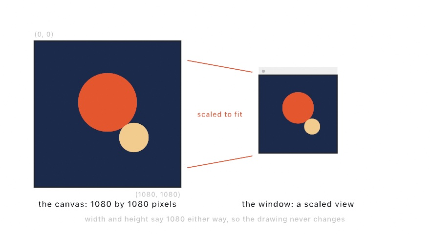
</picture>

The **canvas** is a fixed grid of pixels, 1080 by 1080 unless you say otherwise. It's what all your coordinates are measured against. The **window** is a view of that canvas, scaled to fit comfortably on your screen. So `width` reports 1080 whatever the window is doing, and a circle at `(540, 540)` is in the middle. An exported image comes out at the full canvas resolution.

Two properties control the pair, and they're independent:

```swift
override var canvasSize: CanvasSize { .square(1080) }   // the pixels you draw on
override var windowMode: WindowMode { .auto }           // how it's previewed
```

Those go inside your class, above `draw()`, like the two functions did.

> **Swift note.** `override var canvasSize: CanvasSize { .square(1080) }` is a *property* rather than a function, and the braces hold the value it answers with. It is the same move as `override func draw()`: Ollin asks, and your class answers. `.square(1080)` is short for `CanvasSize.square(1080)`, because Swift lets you drop the type name when it can already tell what you mean. `.white` is `Color.white` the same way.

`canvasSize` takes a square, an explicit width and height, or one of the named presets. Try `.fhd1080` for a wide canvas. The other presets cover video, phone screens, and real paper, so `.uhd4K`, `.vertical1080`, `.a4`, and `.usLetter` are all there. Paper sizes come with a companion, since `.a4.dpi(300)` keeps the page the same physical size while raising the pixel grid to print resolution.

`windowMode` is `.auto` by default, which picks a preview size that fits your screen and then holds it. `.fixed(0.5)` pins the preview to a fraction you choose, and holds that. Neither window can be dragged, and neither changes your drawing. `.resizable` is the one that can: the window is free, and the canvas follows it, so `width` and `height` change as you drag. Exports still come out at the size `canvasSize` declares.

### Looking closer

The window shows the whole canvas, scaled to fit. Sometimes you want to look at part of it up close, and leave the canvas as it is. One call hands that view to you:

```swift
override func draw() {
    background(.white)
    viewControl()
    // everything you draw, as usual
}
```

Drag to pan, scroll to zoom. A sketch that never calls it never pays for it, and [Chapter 25](25-3DGently.md) has the same idea for 3D, as a camera you can orbit.

<picture>
  <source media="(prefers-color-scheme: dark)" srcset="Images/01-HelloOllin/ViewCloser-dark.jpg">
  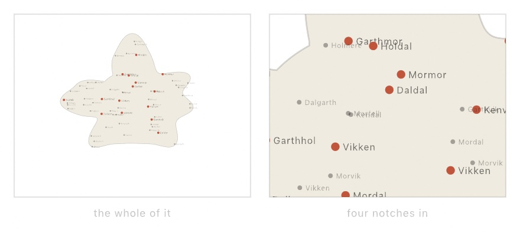
</picture>

The figure shows one reason to zoom. The place names are drawn at the same text size in both panels, and the zoom draws the outlines and the letters larger, so they arrive crisp. A shape is kept as geometry rather than as pixels, so looking closer shows more of it instead of a blur.

A drag moves the content as far as the pointer went, so the drawing stays under your finger. A zoom is anchored on the pointer, so whatever you are pointing at stays under it while the view grows around it. Neither is smoothed, on purpose: a flat plane under a finger reads better without inertia.

Only what you draw after `viewControl()` moves. Anything drawn *before* the call stays put, so a fixed backdrop goes there. A caption that has to be drawn last needs `withState { }`, which [Chapter 6](06-GridsAndRepetition.md#move-the-paper) introduces. Put the call and the drawing inside it, and draw the caption after it.

The mouse, which arrives [later in this chapter](#the-mouse-joins-in), comes in the coordinates now on screen. So `drawCircle(mouseX, mouseY, 20)` lands under the pointer at any zoom.

## Placing things without pixels

Once you know the canvas can be any size, there's a habit that saves rewriting layouts later.

<picture>
  <source media="(prefers-color-scheme: dark)" srcset="Images/01-HelloOllin/NormalizedPlacement-dark.jpg">
  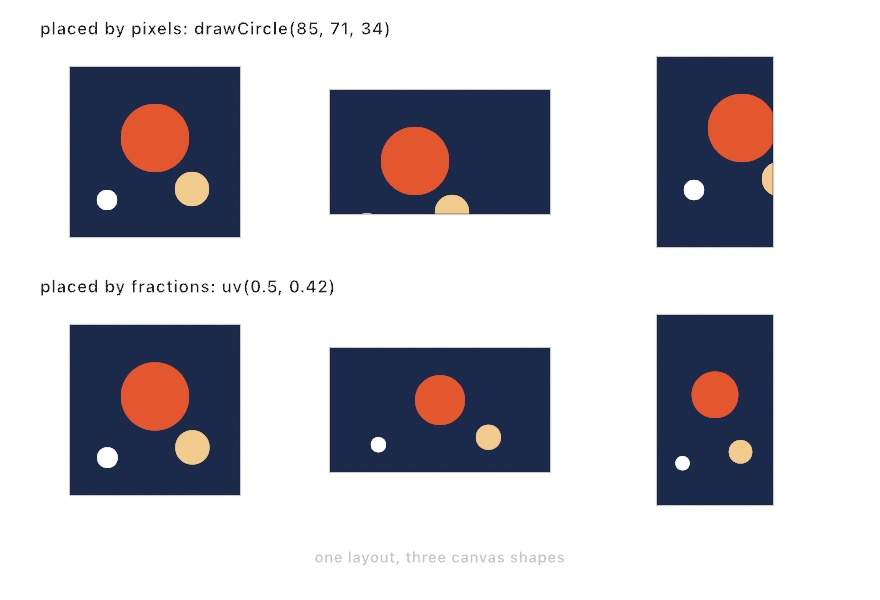
</picture>

Writing `drawCircle(85, 71, 34)` says "85 pixels from the left". That's fine until the canvas changes shape, and then, as the top row shows, your careful arrangement slides off the edge. Writing the same position as a *fraction* of the canvas says "half way across, a little above the middle". That survives any canvas you give it.

```swift
drawCircle(center: uv(0.5, 0.42), radius: 200 * scale)
```

This is the second way to call `drawCircle`. It names its parts, and `center:` takes the position as one value, a point, instead of as two numbers. `uv(u, v)` hands back the canvas point at those fractions, so `uv(0, 0)` is the top-left corner, `uv(1, 1)` the bottom-right, and `uv(0.5, 0.5)` the middle. Sizes want the same treatment. `scale` is the shorter canvas edge divided by 1000, so `200 * scale` is a fifth of that edge. That is 216 pixels on the default canvas, and proportionally more when you export the same sketch at print resolution.

You don't have to do this everywhere. Plenty of sketches in this guide use plain pixels, because they only ever run at one size. Fractions matter the day you want a sketch as a poster as well as on a screen. They keep the centers where you put them. They can't know what a square arrangement should become on a wide one, so look at the layout again when the shape changes. The sketch this chapter builds places its ring this way, from the middle of the canvas and in units of `scale`.

## Shapes and ink

You've met `drawCircle`. Its two companions take their numbers the same way, a position first and then dimensions. One difference matters from the start: a circle's position is its *center*, while a rectangle's is its *top-left corner*.

<picture>
  <source media="(prefers-color-scheme: dark)" srcset="Images/01-HelloOllin/FirstShapes-dark.jpg">
  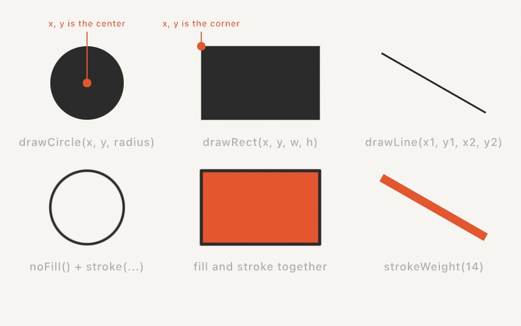
</picture>

Try each of them in place of your circle. `drawRect(300, 240, 240, 160)` puts a rectangle's top-left corner at `(300, 240)` and makes it 240 wide and 160 tall. `drawLine(100, 200, 700, 400)` runs from one point to another, a pair of numbers per end. A line needs a `stroke` color rather than a `fill`, because it has no interior to fill.

The styling calls set what everything after them wears. Once you set `fill` or `stroke`, every shape you draw from then on uses it, until you change it.

```swift
fill(Color(hex: 0xE4572E))   // an orange interior
stroke(.black)               // a black outline
strokeWeight(5)              // five pixels thick
```

To draw an outline and no interior, call `noFill()` in place of the `fill` line. For an interior and no outline, call `noStroke()` in place of the `stroke` line.

Shapes land in the order you call them, so where two overlap, the later one covers the earlier one. Draw two circles that overlap, then swap the two `drawCircle` lines and save:

```swift
fill(Color(hex: 0xE4572E))
drawCircle(460, 540, 200)
fill(Color(hex: 0x219EBC))
drawCircle(620, 540, 200)     // drawn second, so it sits on top
```

The blue circle sits on top because it was drawn second, and after the swap the orange one does. This is also why `background(...)` goes first in `draw()`: it repaints the whole canvas, so anything drawn before it is covered up. There is no other layering in a plain sketch. Whatever you want in front, you draw last.

Colors come as names or as hex values like `Color(hex: 0xE4572E)`, the same six digits you'd use on the web. Ollin ships a selected set of the CSS color names, `.white`, `.black`, `.orange`, `.crimson` and about forty more, and the [Color](../Docs/Drawing/Color.md) page lists them all. There are many more shapes where these three came from, including ellipses, triangles, stars, and hearts, and the [Drawing](../Docs/Drawing/Drawing.md) page is the full catalog.

When you want a rectangle centered on a point instead of hung from its corner, ask for it by name: `drawRect(center: Vector2(x, y), width: w, height: h)`. Most shapes offer both forms, one taking bare numbers in a fixed order and one naming the anchor. Naming the anchor is how you say which part of the shape the position refers to.

A rectangle can also round its corners. `cornerRadius: 20` rounds all four the same. `cornerRadii:` gives each corner its own radius, so a tab is rounded along its top and square where it meets the page:

```swift
drawRect(300, 240, 240, 160, cornerRadius: 20)          // every corner the same
drawRect(300, 440, 240, 60, cornerRadii: .top(20))       // a tab: the top two rounded
drawRect(300, 540, 240, 160, cornerRadii: CornerRadii(topLeft: 60, topRight: 0,
                                                       bottomRight: 60, bottomLeft: 0))
```

`.top`, `.bottom`, `.left`, and `.right` round one pair of corners, and `CornerRadii` names all four. A radius too large for its side is scaled down until it fits, so the shape is kept.

> **Swift note.** `Vector2(x, y)` bundles an x and a y into a single value, so you can pass a position around as one thing instead of two loose numbers. `uv(0.5, 0.5)` handed you one earlier, and `.x` and `.y` read its two numbers back. That's all you need from it here. [Chapter 10](10-Vectors.md) gives it a chapter of its own, because once a position is one value you can add positions together, and that is how motion and forces get written.

> **Swift note.** Some calls take bare values in a fixed order, like `drawCircle(540, 540, 200)` for x, y, and radius. Others name their values, like `Color(hex: 0xE4572E)`, where the `hex:` is part of the call. A call can offer both forms, and `drawCircle(center:radius:)` above is the named twin of the bare one.

## It moves on its own

Everything you have drawn so far held still. This section is the idea the framework is named for, since *ollin* is the Nahuatl word for movement. Put `draw()` back to the one centered circle from your first sketch, and change its line to:

```swift
drawCircle(width / 2 + time * 120, height / 2, 200)
```

Save, and the circle drifts to the right until it leaves the canvas. Nothing else was needed, because `draw()` was already running over and over, as fast as your display refreshes, often 60 or 120 times a second. `time` holds the seconds since the sketch started. So when `time` grows, an x computed from it grows along with it, and the circle lands somewhere slightly different on every frame. Drawing that sequence quickly is what we read as motion. Nearly everything animated in this guide works this way, from breathing dots to flocking birds: you put time into an expression.

`time` has siblings called `frameCount`, `deltaTime`, and `frameRate`. The [Sketch](../Docs/Core/Sketch.md#temporal-state) page lists them, and you'll meet them properly in [Chapter 3](03-MotionAndTime.md).

Our drifting circle has a problem, which is that it left. To make motion that stays on the canvas, we'll borrow one recipe from [Chapter 3](03-MotionAndTime.md) ahead of time: `sin`. All you need to know for now is what it does. As its input grows, `sin` glides smoothly between -1 and 1 and back again, forever, the way a pendulum swings. Multiply it by a distance and you have a swing of your own.

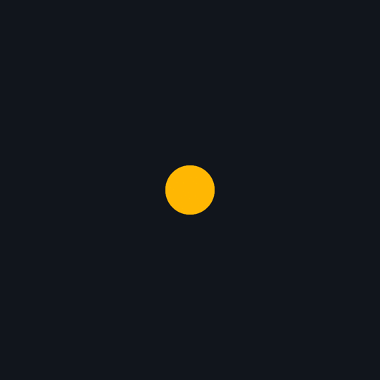

Replace everything inside `draw()` with this. It changes the colors as well as the motion, so your window matches the picture:

```swift
background(Color(hex: 0x11151C))
noStroke()
fill(Color(hex: 0xFFB703))
let x = width / 2 + sin(time * .tau / 3) * 300
drawCircle(x, height / 2, 70)
```

The `* 300` is how far it swings. `.tau` is the angle of one full turn, about 6.28. So `time * .tau / 3` completes one turn every three seconds, and the swing starts over. [Chapter 3](03-MotionAndTime.md) explains why that works, and for today you can use it as a recipe.

> **Swift note.** `let x = ...` gives a value a name. Use `let` for values computed fresh each frame (most of what you'll write in `draw()`); `var` is for values that need to change after they're set.

The recipe has a second half, and it's what the finished sketch is built on. `sin` has a twin called `cos`, and together they turn an angle into a point on a circle:

<picture>
  <source media="(prefers-color-scheme: dark)" srcset="Images/01-HelloOllin/AroundACircle-dark.jpg">
  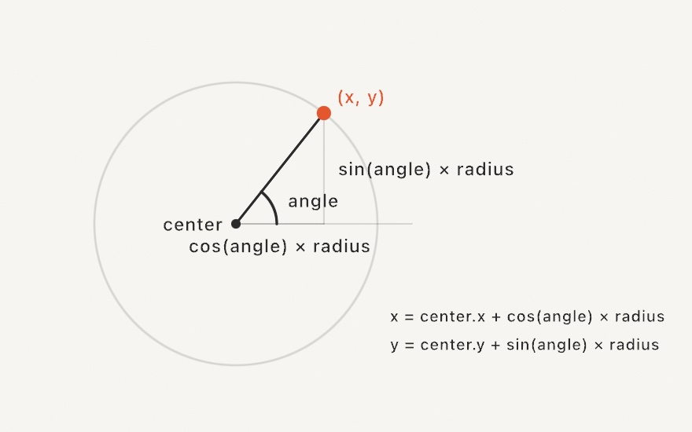
</picture>

Angles here are radians rather than degrees, and one full turn is `.tau`. Angle zero points to the right, and since y grows downward, a growing angle sweeps clockwise. The angle in the diagram is negative, which is why its point sits above the center rather than below.

Give the pair an angle and a radius, and `cos(angle) * radius` is how far across the point sits and `sin(angle) * radius` how far down. Grow the angle and the point walks the rim. For now that's all this guide asks of `cos` and `sin`, that they're how you place things *around* something. [Chapter 3](03-MotionAndTime.md) shows why it works, and [Appendix B](B-JustEnoughMath.md#an-angle-and-a-radius-make-a-point) keeps this picture for whenever you want it back.

## The mouse joins in

Your sketch already knows where the cursor is. Change the drawing line in `FirstCircle.swift` to:

```swift
drawCircle(mouseX, mouseY, 80)
```

The circle now follows your mouse, because `mouseX` and `mouseY` update continuously. And since `draw()` runs every frame anyway, reacting to a held button is just an `if`:

```swift
if mouseIsPressed {
    fill(Color(hex: 0xE4572E))
} else {
    fill(Color(hex: 0x2B2B2B))
}
drawCircle(mouseX, mouseY, 80)
```

Hold the button and the circle turns orange. Because `draw()` is running anyway, you can ask "is the button down right now?" on every frame and draw accordingly. `mouseIsPressed` is that question. Reacting *once* to a press or a release is a different question. So is the keyboard, which has both a held form and a one-shot form. [Input](../Docs/Helpers/Input.md) covers them all.

## Putting it together: a breathing ring

Now we can build the sketch from the top of the chapter, out of the steps above. A loop places 28 circles around a ring using the `cos` and `sin` recipe. `time` inside the angle makes the ring drift, and `sin` swings both the ring's radius and each circle's size so that the sketch breathes. The ring is placed from the middle of the canvas with `uv` and sized in units of `scale`, as [Placing things without pixels](#placing-things-without-pixels) advised, and each circle wears a fill from a short list of colors. The four `@Param` lines are the panel of controls, and they are the one thing the steps above did not cover.

Two more things in the listing are new. The circles run inside a `for` loop, which repeats the drawing commands once per circle. And each color carries an `alpha`, which is how opaque it is. 1 is solid, 0 is invisible, and 0.85 lets overlapping circles show a little of each other.

> **Swift note.** `for i in 0..<count` counts from 0 up to, but not including, `count`, so `i` names each circle in turn. `i` is an `Int` (a whole number) while positions want `Double` (numbers with fractions), so `Double(i)` converts. `[Color]` is a list of colors, `colors[0]` is its first, `colors.count` is its length, and `%` is the remainder after division, which is what makes the palette repeat. These keep coming back; there's more Swift in the [Swift quick reference](../Docs/Swift.md) whenever you want it.

Make a new file, `MySketches/HelloMotion.swift`:

```swift
import Ollin

final class HelloMotion: Sketch {
    @Param("Speed", 0...2) var speed = 0.3
    @Param("Size", 8...80) var size = 38.0
    @Param("Circles", 4...120) var count = 28
    @Param("Ground") var ground = Color(hex: 0x11151C)

    let colors: [Color] = [
        Color(hex: 0xFFB703, alpha: 0.85), Color(hex: 0xFB8500, alpha: 0.85),
        Color(hex: 0x219EBC, alpha: 0.85), Color(hex: 0x8ECAE6, alpha: 0.85),
    ]

    override func draw() {
        background(ground)
        noStroke()
        let center = uv(0.5, 0.5)
        for i in 0..<count {
            let angle = Double(i) / Double(count) * .tau + time * speed
            let breathe = sin(time * 1.4 + Double(i) * 0.5)
            let ring = (310 + breathe * 80) * scale
            let x = center.x + cos(angle) * ring
            let y = center.y + sin(angle) * ring
            fill(colors[i % colors.count])
            drawCircle(x, y, (size + breathe * 16) * scale)
        }
    }
}
```

Run it with `swift run OllinLive MySketches/HelloMotion.swift` and walk through what each line contributes:

- `Double(i) / Double(count) * .tau` divides the full turn into one slot per circle. Adding `time * speed` grows every angle together, so the ring rotates.
- `breathe` is the pendulum again, and the part to notice is the `+ Double(i) * 0.5`, which gives each circle a head start over its neighbor. That small offset is what makes the ring ripple instead of pulsing all at once. Try deleting it and watch the difference.
- `breathe` gets used twice, swinging both the ring's radius (`310 + breathe * 80`) and each circle's size (`size + breathe * 16`). So each circle grows as it swings outward and shrinks as it comes back.
- `center` is `uv(0.5, 0.5)`, the middle of the canvas, and `* scale` turns the ring's radius and each circle's size from units into pixels of the shorter canvas edge. Change `canvasSize` to `.fhd1080` and the ring keeps its place and its size.
- `colors[i % colors.count]` cycles through the palette, so circle 0 gets the first color and circle 4 wraps back around to it.

That leaves the four `@Param` lines. Look at the sidebar of the `OllinLive` window and you'll find they became a small control panel. `@Param("Speed", 0...2) var speed = 0.3` declares a parameter with a label, a range, and a starting value, and the sketch reads it like any other property. Each parameter arrived as the control its type calls for. Speed and Size hold `Double`s, so they are sliders. Circles holds a whole number, so it is a stepper. Ground holds a `Color`, so it is a swatch you click to open a picker. There are more of these, including a toggle for a `Bool` and a draggable pad for a point. You'll meet them as the guide goes on. Beside a numeric control the value itself is live, so you can drag it sideways to scrub or click it to type one in.

Play the panel while the sketch runs. Your tuned values survive a save. Edit the code, save, and your parameter positions carry over into the reloaded sketch instead of snapping back to the defaults. Build that habit early, because a number you find yourself trying three values of is a number that wants to be a parameter.

### Saving the values you tuned

There is one thing the panel cannot do on its own, which is remember. A tuned value lives in the running program, so quitting drops it.

The button under the rows writes them down for you. Press **Save parameters to HelloMotion.swift**, and every value you turned goes into the `@Param` line that declared it. The figure shows the same press on a sketch with one parameter.

<picture>
  <source media="(prefers-color-scheme: dark)" srcset="Images/01-HelloOllin/ParametersToSource-dark.jpg">
  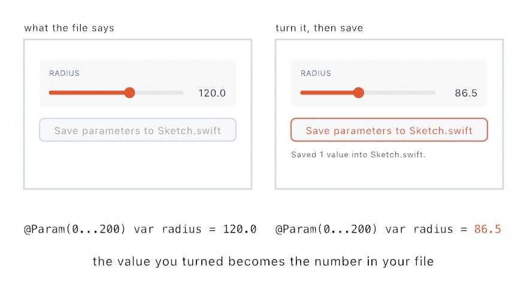
</picture>

Only the parameters you moved are written, and only the value on the line changes. Your label, your range, your spacing, and the comment you left at the end are all where you put them. The host then reloads the sketch from the file, the same way it does after any save of your own.

Going the other way is one click. Every parameter you turn wears a small dot after its name. Click it, or right-click the row and choose **Reset**, and the value goes back to what the `@Param` line declares while the sketch keeps running. **Reset all** beside the save button puts every parameter back at once.

A number keeps the shape you gave it. A whole default stays whole while the value is whole, and one written with a point keeps its point. That second rule matters because `86` and `86.0` are different types to Swift, and only `86.0` is the `Double` you declared.

One limit applies. A default the sketch works out has no value to replace. See it for yourself by making the `Size` line a calculation and pressing the button again:

```swift
@Param("Size", 8...80) var size = 114.0 / 3
```

The line under the button says so and names what stands there. Put `38.0` back when you've seen it.

### Make it yours

The sketch is small enough to change freely, and three directions are a good start:

- Run `Circles` from 4 up to 120 and watch the gaps close. Keep `Size` above 16 while you do, because below that the breathing takes some radii to zero, and a circle with no radius isn't drawn at all.
- Swap the palette. Pick four hex colors you like and paste them in.
- Replace `drawCircle` with `drawRect(center: Vector2(x, y), width: size * scale, height: size * scale)`. Use the `center:` form here, because the positional `drawRect(x, y, size, size)` would hang each square down and to the right of its place on the ring.

When you want to keep a moment of it, one flag writes a still at the full canvas size, and no window opens:

```sh
swift run OllinLive MySketches/HelloMotion.swift --export ring.png --frame 90
```

`--frame 90` names the frame, so the same command gives the same picture every time. [Chapter 3](03-MotionAndTime.md) exports its sketch as a GIF that loops, and [Chapter 38](38-FinishingASketch.md) has every other way a sketch can leave.

## Moving something by hand

The ring above is placed by arithmetic, and its parameters are tuned in the panel. A shape you placed with plain numbers has a third way to move. It is the one for when you want it *a bit to the left*. Typing gets you there by guessing: change 300 to 280, save, look, change it again.

While the sketch is running under `swift run OllinLive`, you can skip that. Go back to `FirstCircle.swift` and give the circle plain numbers, because a drag rewrites numbers and a calculation has none to rewrite:

```swift
drawCircle(300, 300, 40)
```

Save, then hold Command and move the pointer over the window. The shape under it is outlined, and the line of your file that drew it is named above the outline. Drag the shape where you want it, let go, and those numbers in your file are the ones that change.

<picture>
  <source media="(prefers-color-scheme: dark)" srcset="Images/01-HelloOllin/DragToSource-dark.jpg">
  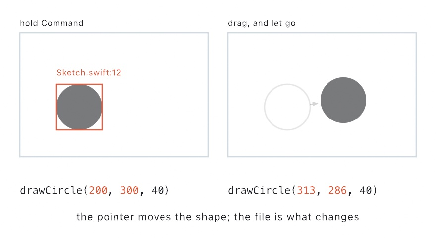
</picture>

Your editor may reload the file on its own or ask you first, and the running window has already reloaded itself. Nothing else on the line moves. The radius, your spacing, and the comment you left at the end are all where you put them. The performance host in [Chapter 39](39-Performing.md#performing-the-code-itself) has the same drag. There the numbers change in the code on the stage, and the host evaluates it for you.

The shape itself is only the first of three things to take hold of. Small squares sit on its corners, and a knob stands clear above it.

<picture>
  <source media="(prefers-color-scheme: dark)" srcset="Images/01-HelloOllin/DragHandles-dark.jpg">
  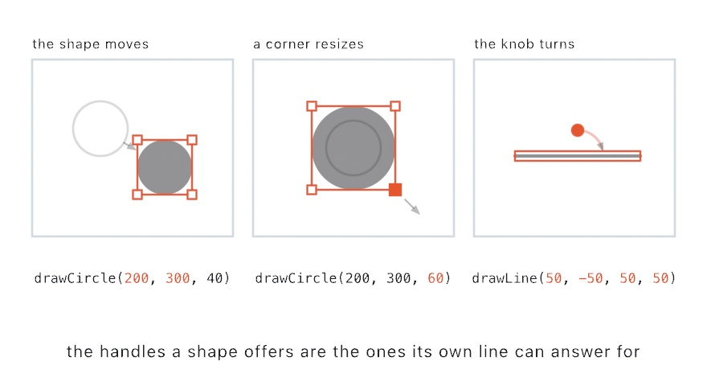
</picture>

A corner changes the numbers that *size* the shape and leaves the ones that place it alone, so a circle grows from its middle. A rectangle written `drawRect(x, y, width, height)` grows from its top-left corner, which is where those first two numbers put it. That is also why such a rectangle offers three corners and not four. The fourth sits on the corner that places it, and has nothing to size.

The knob turns the shape, and it only appears when the line can say which way the shape faces. A line has two ends, so both swing about the middle. An arc, a piece of a circle's edge, carries its own two angles, so those move instead. A circle looks the same however you turn it, so it shows no knob at all. Turning a circle takes a `rotate` further up the file, which [Chapter 6](06-GridsAndRepetition.md) introduces and which this doesn't touch.

One more move belongs here, and it's the one a number cannot express. A shape drawn later lands on top, as [Shapes and ink](#shapes-and-ink) showed. With a shape outlined, press `⌘]` to bring it forward or `⌘[` to send it back, and its line moves past its neighbor's in the file. The `fill` it was drawn with travels along and is said again where it lands, and the ink the shapes after it had is put back. So the only thing that changes is which shape is in front. Shift takes it all the way to the front or the back.

Two rules apply before you rely on any of it, and the first is the save button's. A number written whole stays whole, so a shape dragged to 285.7 lands on 286, and a nudge under half a pixel changes nothing. And only a plain number can be dragged. If you wrote `drawCircle(width / 2, 300, 40)`, that first slot holds no number to change. The host says so rather than moving anything: *places this shape with `width / 2`, so there is no number to move.*

There is one exception. A coordinate written as the name of a `@Param` has no number on the line either. It does have somewhere to put the value, though.

```swift
@Param(60 ... 660) var sunX = 120.0
@Param(60 ... 660) var sunY = 120.0

drawCircle(sunX, sunY, 40)     // dragging this moves both parameters
```

The drag sets those parameters instead of writing the file, so nothing recompiles, and the values stay put across the next reload the way any parameter you change by hand does. Both coordinates have to be parameters for that. With a parameter in one slot and a plain number in the other, the number is still written into the file and the sketch reloads.

That limit follows from what the drag is. The file is the sketch, and dragging edits the file, so anything the file works out for itself has to be changed where it's written. [Dragging a shape](../Docs/Tools/DragToEdit.md) covers the rest: named points, lines with two ends, and what stops a shape from moving past a line that is not ink.

## A shorter way to run things

Every sketch of yours so far ran as `swift run OllinLive` from the repository folder. Every chapter keeps writing that form, so nothing later depends on this section. It is here because typing the full command every time gets tiring, and because it means every session starts with a `cd`. There is a one-time fix.

```sh
Scripts/ollin install        # run once, from the repository folder
```

That links an `ollin` command into a folder on your `PATH`, which is the list of places your shell looks for commands. If it reports that the folder it picked isn't on yours, run the line it prints, then `source ~/.zshrc`. After that, a sketch is a file you can run from anywhere:

```sh
ollin new NextIdea.swift     # writes a starter sketch, named after the file
ollin NextIdea.swift         # opens it in the live window
```

A sketch in Ollin is one `.swift` file. It is small enough to keep in a notes folder, mail to someone, or paste into a message. It runs on any machine that has Ollin. Every export option works on a loose file too, so this writes four seconds of a sketch on your desktop as a GIF:

```sh
ollin NextIdea.swift --export-gif out.gif --seconds 4
```

`ollin new` also writes `#!/usr/bin/env ollin` on the first line and marks the file executable, so `./NextIdea.swift` opens it as well. [Single-file sketches](../Docs/Tools/SingleFile.md) covers the rest, including how to do that to a file you wrote by hand.

The install puts one more thing in place: zsh completions. Press Tab after `ollin` and the subcommands come up. Press it after a `--` and you get the flags of whichever command you are typing, each with the line that says what it does. There are more than a hundred flags, so Tab is how you find the one you want.

```
$ ollin dots.swift --export-<TAB>
--export-gif        -- write an animated GIF
--export-grid       -- write a contact sheet of seeds
--export-video      -- write a movie
...
```

One flag belongs beside the parameters you just tuned. `ollin HelloMotion.swift --list-params` prints every `@Param` the sketch declares: its kind, its range, and what it holds. Each is in the spelling `--param` reads back, so a value can be set for a run from the command line. [Checking the machine](../Docs/Tools/Doctor.md#what-the-sketch-itself-declares) shows the listing.

The command does two more things beyond running a file, and each has a page of its own in the reference.

### When one file isn't enough

A loose sketch can load a photograph, a font, or a shader sitting in its own folder. What one file can't hold is a second file's worth of code, or a program you build once and hand to somebody. At that point you want a package, and `ollin new MySketch` writes one. It holds the sketch, a manifest that already knows where the framework is, a folder for your material, and a README with the commands in it. `swift run MySketch` runs it from inside the folder. `ollin Sources/MySketch/Sketch.swift` opens the same file in the live window, so the edit-and-save loop is unchanged. `ollin new MySketch --from Basic/HelloCircle` starts the folder from [`Examples/Basic/HelloCircle`](../Examples/Basic/HelloCircle/Sketch.swift) instead of a blank `draw()`. `ollin generate` makes the same choices in a window, running each starting point while you look. [The project generator](../Docs/Tools/ProjectGenerator.md) has every template and option.

### Looking something up without leaving the terminal

Everything the reference says is in the folder you cloned, so you can read it where you work. `ollin docs color` opens the page about color in a pager, where Space scrolls and `q` returns the prompt, and `ollin docs Color#ramp` opens one section of it. `ollin docs --search "long exposure"` finds every line that says it, with the page and the heading it sits under. `ollin examples flocking` lists the examples that match a word, and `ollin examples ocean --source` prints the sketch itself, here [`Examples/3D/Geometry/Ocean`](../Examples/3D/Geometry/Ocean/Sketch.swift). `ollin api drawCircle` prints each way to call it with its labels. None of this needs a network. [The reference offline](../Docs/Tools/Reference.md) covers the rest, including `ollin site`, which writes the pages out as a website.

## Where this comes from

The `setup()` and `draw()` sketch model comes from [Processing](https://processing.org), started by Casey Reas and Ben Fry in 2001. It continues through [p5.js](https://p5js.org), [openFrameworks](https://openframeworks.cc), and [OPENRNDR](https://openrndr.org), each of which shaped Ollin's design. Processing also gave the field the word *sketch*, and the sketchbook folder its programs live in. Processing and p5.js repeat `draw()` while a sketch runs, and Ollin keeps that, at the display's refresh rate, with `noLoop()` as the escape hatch for a still. The artists named under [What creative coding is](#what-creative-coding-is), Georg Nees, Frieder Nake, Vera Molnár, and Sol LeWitt, are credited with the others in [`Examples/Recreations/`](../Examples/Recreations/README.md). The name is the Nahuatl word for movement, the seventeenth day sign of the Aztec calendar. The edit-and-watch live-reload loop belongs to a long lineage of live-coding tools, and you'll meet its stage-performance form in [Chapter 39](39-Performing.md).

## Go deeper

- [The frame](../Docs/Concepts/Frame.md): one screen on what a drawing call does, why the picture is built from nothing each time, and what happens once `draw()` returns.
- [Where a point is](../Docs/Concepts/Coordinates.md): one screen on the coordinates above, the difference between a point and a pixel, and the other frames that arrive with a camera, a 3D scene, or a machine.
- [Sketch](../Docs/Core/Sketch.md): the full lifecycle, `noLoop()` for stills, and running a sketch as its own standalone program with `@main`.
- [Canvas](../Docs/Core/Canvas.md): canvas sizes and presets, the preview window, and writing sketches that hold up at any resolution (`scale` for sizes, and `uv(u, v)` for placing things as 0…1 fractions of the canvas).
- [Drawing](../Docs/Drawing/Drawing.md): every shape and the complete ink state, and [`viewControl`](../Docs/Drawing/Drawing.md#viewcontrol) with its opening framing, its zoom range, and `resetView()`.
- [Single-file sketches](../Docs/Tools/SingleFile.md): installing `ollin`, running one loose `.swift` file, the hashbang form, and exporting from the command line.
- [The project generator](../Docs/Tools/ProjectGenerator.md): every template and option behind `ollin new` and `ollin generate`, what a generated folder holds, and how to add a template of your own.
- [Dragging a shape](../Docs/Tools/DragToEdit.md): everything a Command-drag can move, what it writes, and why a calculation is refused by name.
- [Checking the machine](../Docs/Tools/Doctor.md): `ollin doctor` answer by answer, installing the shell completions, and `--list-params` for everything a sketch declares.
- [The reference offline](../Docs/Tools/Reference.md): `ollin docs`, `ollin examples`, and `ollin api` in full, including one section of a page, the search across everything, and what happens in a pipe.
- [The Ollin quick reference](../Docs/QuickReference.md): the whole framework on one page, with the units every call takes and the mistakes that give a wrong picture with no error. Keep it open while you work.
- [Input](../Docs/Helpers/Input.md): the keyboard, click hooks, and the rest of the mouse.
- [Parameters](../Docs/Helpers/Parameters.md): the full parameter family, from toggles and menus to draggable pads, plus grouping them into cards, icons, smoothing, saving a tuned set back into the code, and driving parameters from MIDI or OSC hardware.
- [Appendix A, Just enough Swift](A-JustEnoughSwift.md): the language taught in order, every construct these sketches lean on. [The Swift quick reference](../Docs/Swift.md) is the short version, for whenever a single construct felt mysterious.
- Appendix B draws this chapter's math, one picture per idea: [Where things are](B-JustEnoughMath.md#where-things-are), [Angles and circles](B-JustEnoughMath.md#angles-and-circles), [Fractions, mapping, and wrapping](B-JustEnoughMath.md#fractions-mapping-and-wrapping).
- Worked examples: [`Examples/Basic/HelloCircle`](../Examples/Basic/HelloCircle/Sketch.swift), the parameters demo [`Examples/Live/Parameters`](../Examples/Live/Parameters/Sketch.swift), a page of shapes to drag around, [`Examples/Live/DragToEdit`](../Examples/Live/DragToEdit/Sketch.swift), and a sketch you can grab, drag, and release with the mouse, [`Examples/Input/Drag`](../Examples/Input/Drag/Sketch.swift).

---

[Contents](README.md#contents) · Next: [Chapter 2, Color that works](02-Color.md)
