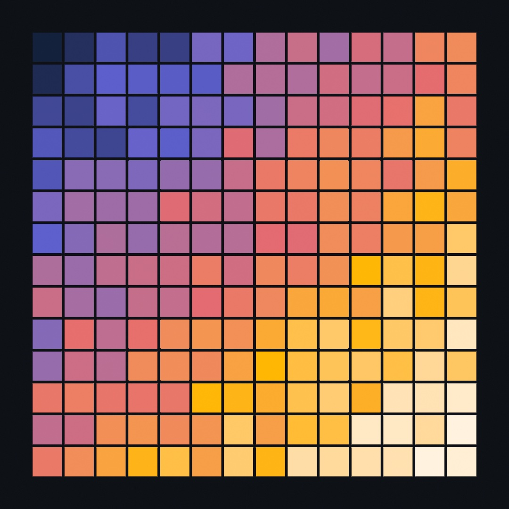
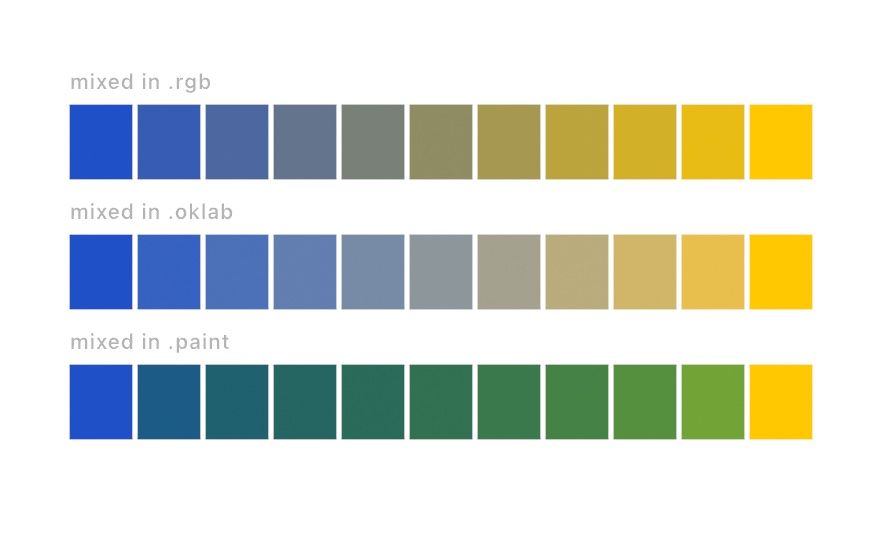
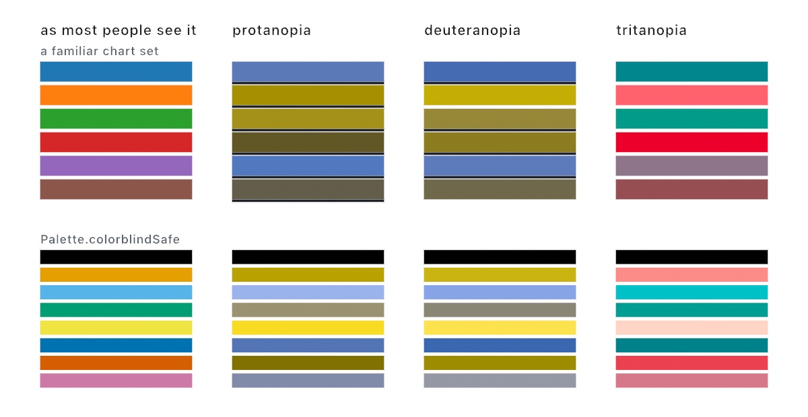

#### <sup>[Ollin](../README.md) → [Guide](README.md) → Chapter 2</sup>

---

# 2. Color that works



Color is where a sketch gets its voice, and it is also where the arithmetic quietly works against you. Mixes turn to mud, palettes fight each other, and colors read brighter or darker than their numbers say they should. This chapter is the set of tools that avoid all of that. You'll learn the ways to name a color, how to think in hue rather than in amounts of light, how to mix in a way that trusts your eye instead of the machine's arithmetic, how to carry palettes and ramps around as ready-made kits, and how to paint with a gradient. It ends in the sketch above, which redraws itself as a fresh variation on every click.

Everything here builds on [Chapter 1](01-HelloOllin.md); keep working the same way, one file under `OllinLive`, saving as you go.

## Naming a color

You've been writing `Color(hex: 0x2B2B2B)` since your first sketch. Here is the full menu:

```swift
fill(.coral)                                   // the CSS named set
fill(Color(hex: 0x5E60CE))                     // six hex digits, straight from a color picker
fill(Color(hex: 0xE4572E, alpha: 0.5))         // alpha is its own parameter
fill(Color(white: 0.15))                       // a quick gray
fill(Color(red: 0.95, green: 0.45, blue: 0.25))
```

The named constants cover the essentials (`.white`, `.black`, `.red`, …) plus a selected set of the CSS names, so `.coral`, `.teal`, `.crimson`, and `.lavender` all read like what they are. The integer hex form is the one you will use most, because any color picker gives you those six digits. Go back to `FirstCircle.swift` and try a few of these in its `fill` line; this chapter is best read with a sketch open.

Colors can also arrive as *strings*, `Color(hex: "#ff0066")`, which matters once a color comes from somewhere else (a file, a website's palette). Strings can be malformed, so this form can fail, and Swift makes that visible:

> **Swift note.** `Color(hex: String)` returns an *optional*: a `Color?` that is either a color or nothing. Swift won't let you use it until you say what happens in the nothing case: `if let c = Color(hex: text) { fill(c) }` runs only when it parsed, and `Color(hex: "#ff0066")!` (the `!`) means "I promise this literal is well formed", crashing if you're wrong. You'll meet optionals again; this is the pattern.

## Thinking in hue

A **color model** is a set of dials for naming a color. Pick how many dials there are and what each one does, and you have a model. There is no single right answer, because a set of dials that suits a screen does not suit a hand mixing paint, and neither suits an eye judging whether two colors match.

RGB has three dials, one per amount of light, because that is what a screen emits and a sensor measures. It goes back to nineteenth-century experiments on how three lights can be matched against a fourth, and it is how the machine stores color. That makes it good for storing and poor for choosing, because nobody thinks "a little less green" when what they want is a warmer orange.

HSB rearranges the same colors onto dials a person can steer: pick the hue on a wheel, then decide how vivid it is (saturation) and how bright (brightness). It arrived with computer graphics in the 1970s, as the model you could actually put under a designer's hand. Later in this chapter you will meet a third family, the OK models, which arrange the dials so that equal moves *look* equal.

<picture>
  <source media="(prefers-color-scheme: dark)" srcset="Images/02-Color/HueWheels-dark.jpg">
  
</picture>

```swift
fill(Color(hue: 0.07, saturation: 0.85, brightness: 0.95))   // a warm orange
```

All three run from 0 to 1, and hue *wraps*, so 1.2 means the same as 0.2, a full turn around the wheel plus a bit. That makes hue safe to drive with `time` directly, with no bookkeeping to keep it in range. Try it in `FirstCircle.swift`, replacing its `fill` line:

```swift
fill(Color(hue: time * 0.1, saturation: 0.8, brightness: 0.95))
```

The circle now cycles through the whole rainbow every ten seconds while it swings. One value goes in and continuous color comes out, and that one move powers a great deal of generative color.

## Mixing you can trust

Take a blue and a yellow, average their RGB numbers to get the halfway color, and you get… mud. Averaging the machine's storage format tells you nothing about what the *eye* considers halfway:

<picture>
  <source media="(prefers-color-scheme: dark)" srcset="Images/02-Color/MixingSpaces-dark.jpg">
  
</picture>

Ollin gives you mixing as one call, with the space as a choice:

```swift
Color.mix(blue, yellow, 0.5)              // OKLab, the default
Color.mix(blue, yellow, 0.5, in: .rgb)    // the muddy one, when you want it
Color.mix(blue, yellow, 0.5, in: .hsb)    // walks the hue wheel between them
```

`t` says how far along you are, so 0 gives the first color, 1 gives the second, and 0.5 gives the halfway point. The default space is **OKLab**, which arranges color's numbers so that equal moves *look* equal, meaning a step of a given size changes the appearance by about the same amount wherever you take it. Blue and yellow are opposites, so their midpoint is still a neutral, but it's an even, steady neutral with no lurch in brightness and no accidental detour through some other hue. You don't need the math behind it, and this guide doesn't contain any. The practical version is short: mix in OKLab unless you have a reason not to.

Try it live on the swinging circle:

```swift
fill(Color.mix(Color(hex: 0x2050C8), Color(hex: 0xFFC800), sin(time) * 0.5 + 0.5))
```

The `sin(time) * 0.5 + 0.5` squeezes the pendulum's `-1...1` swing into the `0...1` that `t` wants, so the circle breathes between the two colors. Remember that squeeze. [Chapter 3](03-MotionAndTime.md) turns it into a proper tool with a name.

The same perceptual model comes in two more shapes. **OKLCH** turns OKLab into dials for lightness, chroma, and hue, so nudging a hue leaves the lightness alone, and mixing with `.oklch` holds a color's identity while it arcs between hues. **OKHSL** guarantees that everything you ask for is actually displayable, which makes it the space to reach for when a sketch is *generating* colors rather than using ones you picked.

Three everyday moves come ready-made on top of OKLCH, so a shadow, a highlight, and an accent can all come from the one color you chose:

```swift
ink.lighter()          // same hue, a step up in lightness
ink.darker(by: 0.25)   // and down, by as much as you ask for
ink.complement         // the opposite hue at the same weight
```

OKHSL earns its place here for something else: hues that match in weight.

```swift
for i in 0..<12 {
    fill(Color(OKHSL(h: Double(i) / 12, s: 0.9, l: 0.65)))
    drawCircle(90 + Double(i) * 82, height / 2, 32)
}
```

Twelve different hues, and none of them shouts over the others, because they genuinely share a lightness. Do the same with `Color(hue:...)` and the yellow will glow while the blue turns heavy and dark.

## Blue and yellow make green

Every space above still disagrees with your childhood. Mix blue and yellow in RGB or the OK family and you land on a neutral, never on green. That's not a bug. A screen mixes *light*, and halfway between two opposite lights sits gray. Paint works the other way around: pigment absorbs light, and green is what survives both pigments. Two kinds of mixing, two different answers.

`.paint` is the second kind, in the same call:

<picture>
  <source media="(prefers-color-scheme: dark)" srcset="Images/02-Color/PaintMixing-dark.jpg">
  
</picture>

```swift
Color.mix(blue, yellow, 0.5, in: .paint)   // green, the way a palette gives it
```

Behind the call, each color becomes the reflectance curve of a surface painted with it. The two curves then mix the way scattering pigments mix, wavelength by wavelength. The mixes also darken a little, because pigment only ever absorbs, and that darkening is half of what makes the result read as paint. It's the same trade as before, one level up: `.oklab` gives you even steps, `.paint` gives you a medium's honesty. Pick by what the piece needs.

That curve is a type you can hold, called `Spectrum`, and paint mixing is only the first thing it is good for. Three more come with it, and each is one call:

```swift
Color(wavelength: 590)        // the single wavelength the eye reads as yellow
Color(.blackbody(1800))       // the color of a thing heated to candle temperature
Spectrum.blackbody(6500)      // and as a curve: roughly daylight
```

`Color(wavelength:)` sweeps a physical rainbow if you run it from 400 to 700 nanometers, which is not the same rainbow a hue wheel gives you. `blackbody` is why a candle is orange and a hot star is blue, from one number in kelvin. There are also three GPU effects that work wavelength by wavelength instead of channel by channel: `.thinFilm` for the colors in a soap bubble, `.diffraction` for the rainbow split off a grating, and `.paintMix` for the paint mixing above, run over a whole layer. The [Spectral color](../Docs/Drawing/Spectrum.md) reference has all of it.

## Kits you carry: Palette and Ramp

Individual colors get you started, but finished sketches usually run on a kit of colors chosen once and used throughout. Ollin has two kinds, plus two ready-made variants of the second:

<picture>
  <source media="(prefers-color-scheme: dark)" srcset="Images/02-Color/PaletteShelf-dark.jpg">
  
</picture>

A **`Palette`** is a fixed set of separate colors. Indexing wraps in both directions, so any counter cycles through it forever, and `color(at:)` slices `0...1` into equal bands:

```swift
let p = Palette.set2                  // eight ColorBrewer colors, ready to go
fill(p[i])                            // wraps: p[9] is p[1]
fill(p.color(at: t))                  // 0...1 quantized into eight bands
```

Eight classic sets ship built in, from `.set1` through `.accent`. The **harmony builders** grow a whole palette out of one base color, and because they work in OKLCH the companions keep the base's weight rather than drifting lighter or darker: `Palette.complementary(of: base)`, `.triadic(of: base)`, `.analogous(of: base)`, and `.splitComplementary(of: base)`.

A **`Ramp`** is the continuous version, a gradient you can sample anywhere along its length. Give it a list of colors to spread evenly, or explicit stops if you want to place them yourself, and read it with `color(at:)`. Blending runs through OKLab by default, so the in-betweens stay clean. Every mixing space from earlier is on the menu, `.paint` included, so `Ramp([blue, yellow], in: .paint)` travels through green:

```swift
let dusk = Ramp([Color(hex: 0x14213D), Color(hex: 0x5E60CE),
                 Color(hex: 0xE56B6F), Color(hex: 0xFFB703), Color(hex: 0xFFF3E0)])
fill(dusk.color(at: t))
```

Two kinds of ramp come pre-made. **`Colormap`** holds [eight scientific maps](../Docs/Drawing/Color.md#colormap) such as `.viridis` and `.magma`, built so that perceived brightness climbs evenly from one end to the other, which makes them the standard way to turn a number into color a viewer can read. **`CosinePalette`** holds seven cyclic palettes such as `.sunset` and `.neon`, all generated from one small formula, and because they loop they work beautifully when fed with `time`. Both answer to the same `color(at:)`.

Either one can be a `@Param`, which saves a lot of editing and rerunning. A parameter is a value with a control in the inspector, so you turn it while the sketch runs instead of editing a number and saving. [Chapter 1](01-HelloOllin.md#putting-it-together-a-breathing-ring) declared four of them, and [Parameters](../Docs/Helpers/Parameters.md) is the whole family.

```swift
@Param var inks = Palette(.red, .white, .black)      // a strip of blocks
@Param var dusk = Ramp([.black, .white])             // a band with a handle per stop
```

The palette shows in the inspector as its colors side by side. Click one and the color well beside the label edits it. The ramp shows as the gradient itself, and its handles drag along the band to move a stop. The `+` and `−` buttons add and remove a color in either. When you like what you see, copy the colors back into the code.

## Palettes from a file

Typing hex codes gets tiring, and two calls let you skip it.

The first reads a palette someone else already made. `loadPalettes` returns every palette in a file, while `loadPalette` returns just the first one, or nothing if the file will not read. You never have to say what format the file is in, because the loader looks at the bytes and works it out. It reads a plain list of hex codes one per line, a CSV or TSV with a palette on each line, JSON, and Adobe `.ase` swatch files from Illustrator or Photoshop.

```swift
let sets = loadPalettes("1000.json")      // however many the file holds
let one  = loadPalette("sunset.hex")!     // just the first
```

A good place to get palettes is [nice-color-palettes](https://github.com/Experience-Monks/nice-color-palettes), an npm package carrying a thousand of them as JSON, in exactly the shape `loadPalettes` expects. You do not need npm to use it: the repository holds the files, so take `100.json` or `1000.json` from it, drop the file next to your sketch, and the call above reads it as is. Two things to know about that file. Its palettes were collected from [COLOURlovers](https://www.colourlovers.com), whose default license forbids commercial use, so Ollin doesn't bundle them and you should check the terms before selling work that uses them. And because so many people have reached for it, its very first palette (`#69d2e7`, `#a7dbd8`, `#e0e4cc`, `#f38630`, `#fa6900`) shows up in a great deal of generative art. If you want your work to look like yours, that is a reason to keep reading.

## Palettes from a photograph

The second call takes the colors out of a picture. Give it an image and how many colors you want, and it groups the pixels by how similar they look and hands back the center of each group:

```swift
let photo = loadImage("beach.jpg")!
let p = Palette(extractedFrom: photo, count: 5)
fill(p[0])     // the color the photo is mostly made of
```

The colors come back most-used first, so `p[0]` is the one you'd name if someone asked what color the photo is. The grouping happens in OKLab for the same reason mixing does, which is that it groups colors the way your eye does rather than the way the numbers do. Ask for fewer colors than the picture holds and it merges the closest ones together instead of dropping any.

Two practical notes. The first is that it gives the same answer every time for the same picture, so a sketch that extracts a palette still reproduces exactly, which will matter once you start exporting. The second is that it does real work, enough that you don't want it running sixty times a second. This is what `setup()` from [Chapter 1](01-HelloOllin.md) is for. Load the photo and extract the palette once, keep both in properties, and let `draw()` read what's already there:

```swift
var photo: Image?
var palette = Palette([])

override func setup() {
    photo = loadImage("beach.jpg")
    if let photo { palette = Palette(extractedFrom: photo, count: 5) }
}
```

A palette pulled from a photograph you took is a palette nobody else has.

## Fewer colors than the picture needs: dithering

Once you have those colors, you can put the picture back together in them:

```swift
if let photo {
    let poster = photo.dithered(.floydSteinberg, to: palette)
    drawImage(poster, in: bounds)
}
```

Every pixel of the result is one of your five colors. (`bounds` there is the whole canvas as a rectangle, which every sketch has ready to hand, so it's a convenient way to say "fill the frame".)

`dithered` is the word to understand rather than just call, because it answers a problem you will meet constantly. You have fewer colors than the picture needs.

<picture>
  <source media="(prefers-color-scheme: dark)" srcset="Images/02-Color/Dithering-dark.jpg">
  
</picture>

The first panel is the picture as it came. Snapping each pixel to the nearest available color is the obvious way to fit it into five, and the second panel shows what that costs. Smooth regions turn into flat bands with hard edges, because a whole stretch of subtly different tones all round to the same color. Dithering trades those bands for texture. Where a tone falls between two of your colors, it scatters both of them in the right proportion, and your eye, blurring them together at any normal distance, reads the tone that was actually there. The picture keeps its gradients using colors it doesn't have.

There are two families, and they look different on purpose.

**Threshold maps** decide each pixel from its position alone, using a repeating tile. `.ordered(size: 8)` uses a Bayer matrix and lays down the regular crosshatch of retro graphics and old newsprint, while `.blueNoise` uses a tile with no structure in it and gives an even, pattern-free grain. Because the decision is positional, these are cheap and completely local.

**Error diffusion** works differently. It commits to a color for one pixel, measures how far off that was, and pushes the leftover error onto neighbors it hasn't reached yet, so every mistake gets paid back nearby. `.floydSteinberg` is the classic, and it gives the organic scattered look in the last panel. `.atkinson` deliberately throws away a quarter of the error, which blows highlights and shadows out to clean white and black. That look has a name because people go looking for it.

A few practical notes. `.none` skips the scattering entirely, which is what the second panel uses and what you reach for to show someone the difference. There's a second form, `dithered(.atkinson, levels: 2)`, that quantizes to evenly spaced steps per channel instead of to a palette, which is the posterizing one. And this is CPU work over every pixel, so do it in `setup()` and hold the result rather than redoing it each frame. [The color reference](../Docs/Drawing/Color.md#dithering) has the full method list, and the `Dithering` example puts six of them side by side.

## Gradients as paint

A `Ramp` can also *be* the paint. Anywhere `fill` or `stroke` accepts a color it will also accept a gradient, laid over the canvas in one of three ways:

<picture>
  <source media="(prefers-color-scheme: dark)" srcset="Images/02-Color/GradientPaint-dark.jpg">
  
</picture>

```swift
fill(.linear(from: Vector2(0, 0), to: Vector2(0, height), dusk))   // along a line
fill(.radial(center: spot, radius: 260, glow))                     // out from a point
stroke(.alongPath(wheel))                                          // along the stroke itself
```

Each of them takes a `Ramp` or a plain list of colors. Alpha rides along, so a radial ramp that ends in a transparent color gives you an instant soft glow, which is the middle panel above. The coordinates live in drawing space, so gradients move with the shapes they paint. `.alongPath` runs from the start of a line to its end, and on a closed shape it sweeps once around, which is how the ring above became a color wheel.

## Will everybody see it?

Pick two colors that read as clearly different to you, and there is a fair chance somebody cannot tell them apart. About one person in twenty sees color differently from the palette most work is designed against. That is not a rare edge case. In a room of twenty people it is one of them.

You can look at your own colors through that difference:

```swift
let seen = Color.red.simulated(.deuteranopia)
```

<picture>
  <source media="(prefers-color-scheme: dark)" srcset="Images/02-Color/ColorVision-dark.jpg">
  
</picture>

The picture at the top is a wall of woven blankets, where red sits beside green in nearly every stripe. Under the two commonest kinds those stripes arrive as one olive band, and only the blues survive. The middle block is a palette you have met in a hundred charts, and its orange, green and red land on that same olive. The bottom block is `Palette.colorblindSafe`, eight colors published for exactly this, and it holds together.

To see a whole sketch rather than a swatch, put the reading over the frame. `postProcess` filters the finished frame just before it is shown, so it belongs in `draw()` rather than `setup()`, and the usual place is the last line:

```swift
override func draw() {
    // everything you were drawing anyway
    postProcess(.colorVision(.deuteranopia))
}
```

Put it behind a `@Param` toggle and it becomes a switch you flick while you work.

The picture row above is the same filter run over one layer per column, which is how you check a photograph rather than a whole canvas.

You can also ask, rather than look:

```swift
if !myPalette.isColorblindSafe() {
    print(myPalette.confusions())     // worst pair first
}
```

The rule underneath all of this is short. Red and green do look alike to a protanope, and the pair is often still fine, because one is much darker than the other. What merges is two colors of the same lightness that differ only in hue. Measured on a matched pair, they sit 0.281 apart for average vision and 0.014 apart under the worst kind. So vary lightness, not only hue, and give a shape or a label to anything that color alone is carrying.

## A recipe borrowed early: random

[Chapter 1](01-HelloOllin.md) borrowed `sin` from [Chapter 3](03-MotionAndTime.md), and this chapter's finale borrows `random` from [Chapter 4](04-Randomness.md). Three sentences will get you through it. `random(-1, 1)` hands you a fresh unpredictable number in that range every time you call it. On its own that's a problem for a piece that redraws sixty times a second, because every frame would roll new numbers and the canvas would boil. The fix is `randomSeed(n)`, which restarts the randomness from a fixed point, so the *same* seed always produces the *same* sequence of "random" numbers. Seed at the top of `draw()` and every frame makes identical choices, which holds the picture still; change the seed and you get a brand-new variation that's just as coherent. [Chapter 4](04-Randomness.md) tells the whole story, and this is enough to be going on with.

## Putting it together: a color field

The sketch is one ramp and a quilt of cells, with three ideas layered on top. Each cell samples the ramp according to its *diagonal position*, so the top-left corner is 0 and the bottom-right is 1. Seeded randomness then jitters every sample, which is what makes the field read as organic rather than mechanical. And a slow `sin` shimmer keeps the whole thing alive. Make `MySketches/ColorField.swift`:

```swift
import Ollin

final class ColorField: Sketch {
    @Param("Columns", 4...28) var columns = 14
    @Param("Jitter", 0...1) var jitter = 0.4

    var fieldSeed = 7

    let ramp = Ramp([
        Color(hex: 0x14213D), Color(hex: 0x5E60CE),
        Color(hex: 0xE56B6F), Color(hex: 0xFFB703), Color(hex: 0xFFF3E0),
    ])

    override func draw() {
        randomSeed(fieldSeed)
        background(Color(hex: 0x0E1116))
        noStroke()
        let margin = 70.0, gutter = 7.0
        let cell = (width - margin * 2 - gutter * Double(columns - 1)) / Double(columns)
        for c in 0..<columns {
            for r in 0..<columns {
                let x = margin + Double(c) * (cell + gutter)
                let y = margin + Double(r) * (cell + gutter)
                let diagonal = Double(c + r) / Double(columns * 2 - 2)
                let t = diagonal
                    + random(-0.5, 0.5) * jitter * 0.5
                    + sin(time * 0.4 + diagonal * 3) * 0.05
                fill(ramp.color(at: t))
                drawRect(x, y, cell, cell)
            }
        }
    }

    override func mousePressed() {
        fieldSeed += 1
    }
}
```


Run it and walk the interesting lines:

- `randomSeed(fieldSeed)` runs at the top of every frame, so all the `random(-0.5, 0.5)` calls that follow roll the same numbers each time and the quilt holds still. Now click the canvas. `mousePressed()` bumps the seed, and the next frame rolls an entirely new set of jitters, giving you the same sketch as a fresh variation, as many as you care to click through.
- Two loops, one inside the other, visit every column and row, and `diagonal` turns each cell's position into the `0...1` the ramp wants.
- The `t` line carries the whole look: position, plus seeded jitter scaled by the parameter, plus a slow shimmer. Comment out one term at a time to see what each contributes. With jitter at zero you get a clean mechanical gradient, which is a good look in its own right.
- The parameters do a lot of work here. `Columns` changes the sketch's whole character, chunky at 5 and woven at 28, and `Jitter` takes it from formal to painterly.

> **Swift note.** `var fieldSeed = 7` is a *property*, declared on the class rather than inside `draw()`, and that's what lets it survive from one frame to the next. A `let` or `var` written inside `draw()` is born and dies with that frame. `mousePressed()` is another function Ollin calls for you, once per click, alongside `setup()` and `draw()`. And a loop inside a loop does what it sounds like: for every column, visit every row.

Directions to try before [Chapter 3](03-MotionAndTime.md):

- Swap the ramp for `Colormap.viridis` or `CosinePalette.sunset` (both answer `color(at:)`, so it's a one-line change).
- Make the cells circles, or shrink each one by a little `random(0, cell * 0.3)` for a hand-placed feel.
- Replace the flat background with a `.linear` gradient of the ramp's two end colors.
- Build the ramp from a harmony instead: `Palette.analogous(of: .coral, count: 5).ramp()`.

## Where this comes from

The OKLab family (OKLab, OKLCH, OKHSL) is the work of Björn Ottosson, published openly in 2020 and now part of the CSS color standard, which is why "mix in OKLab" is advice you'll meet across modern tools. The built-in qualitative palettes are Cynthia Brewer's ColorBrewer sets, designed for map readability and loved far beyond maps. The colormaps come from the scientific-visualization world, with viridis and its relatives from matplotlib (Stéfan van der Walt and Nathaniel Smith) and turbo from Google. The cosine palette formula is Inigo Quilez's, a name that will keep coming up in this guide. Full credits live in the project's [attribution notes](../ATTRIBUTION.md#color).

## Go deeper

- [Color](../Docs/Drawing/Color.md): the complete reference, including color temperature (`Color(kelvin:)`) and the string-hex grammar.
- [Light and color](../Docs/Concepts/Light.md): one screen on why the middle of a frame is linear light, and what the last pass does to it before the screen.
- Appendix B draws this chapter's math, one picture per idea: [Fractions, mapping, and wrapping](B-JustEnoughMath.md#fractions-mapping-and-wrapping), [Color and light as numbers](B-JustEnoughMath.md#color-and-light-as-numbers).
- Worked examples, all in [`Examples/Color/`](../Examples/Color/): `Mixing` (the five spaces side by side), `Harmonies`, `Swatchbook`, `PaletteFile`, `PaletteFromImage`, `Colormaps`, `HSBWheel`, `Gradients`, `Dithering`, and `ColorVision`.
- [Accessibility](../Docs/Helpers/Accessibility.md): the color-vision simulation, the palette check, and the reduce-motion setting.
- [Drawing](../Docs/Drawing/Drawing.md): every place a `Paint` can go.

---

[Contents](README.md#contents) · Previous: [Chapter 1, Hello, Ollin](01-HelloOllin.md) · Next: [Chapter 3, Motion and time](03-MotionAndTime.md)
