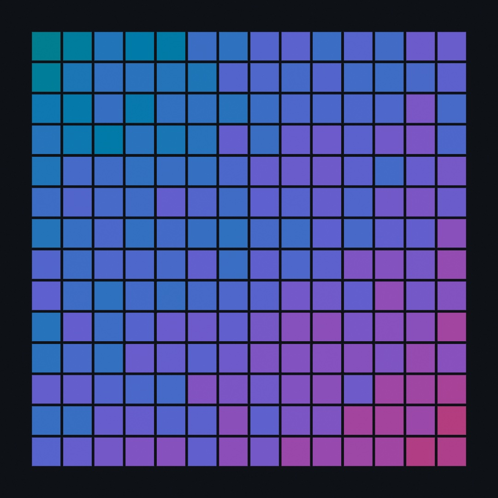
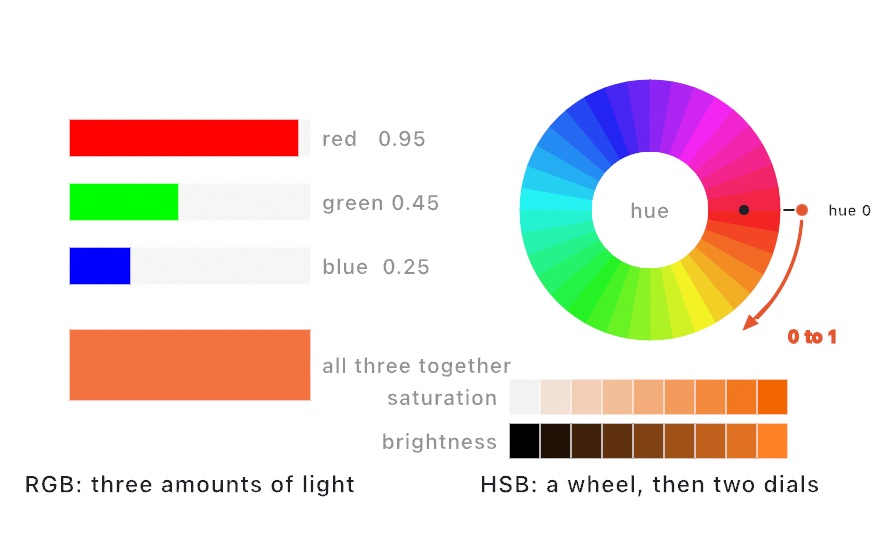
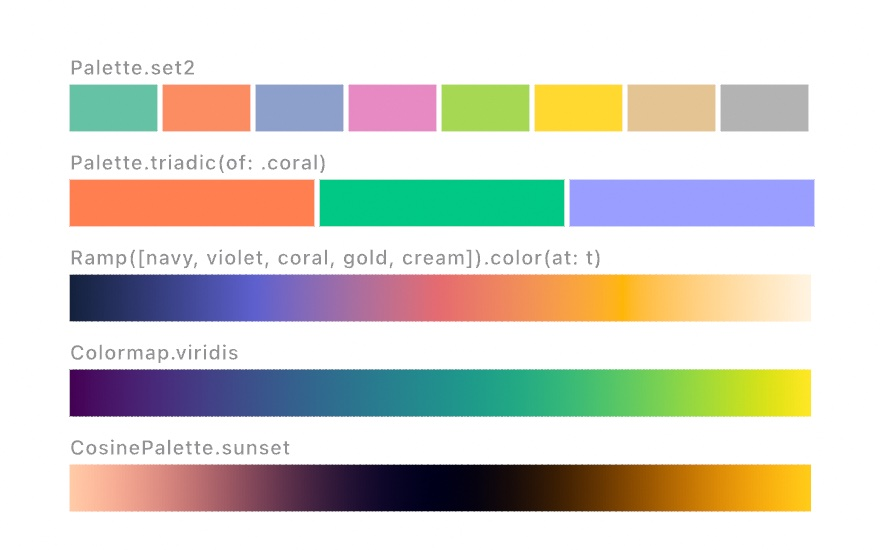
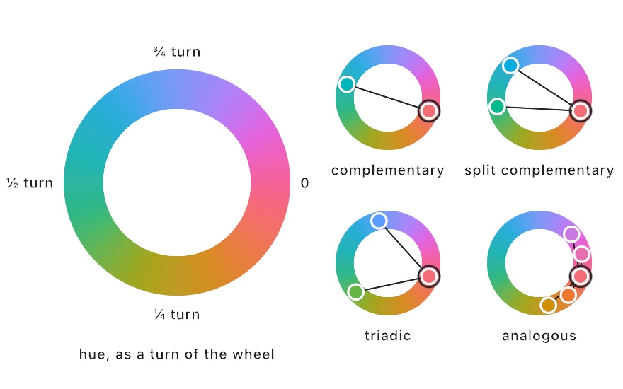
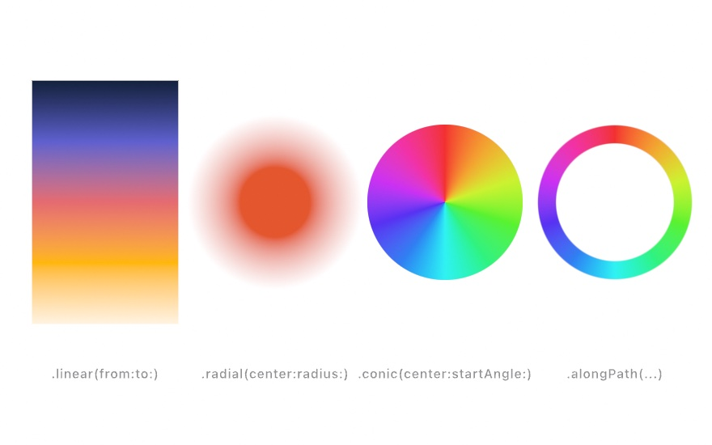
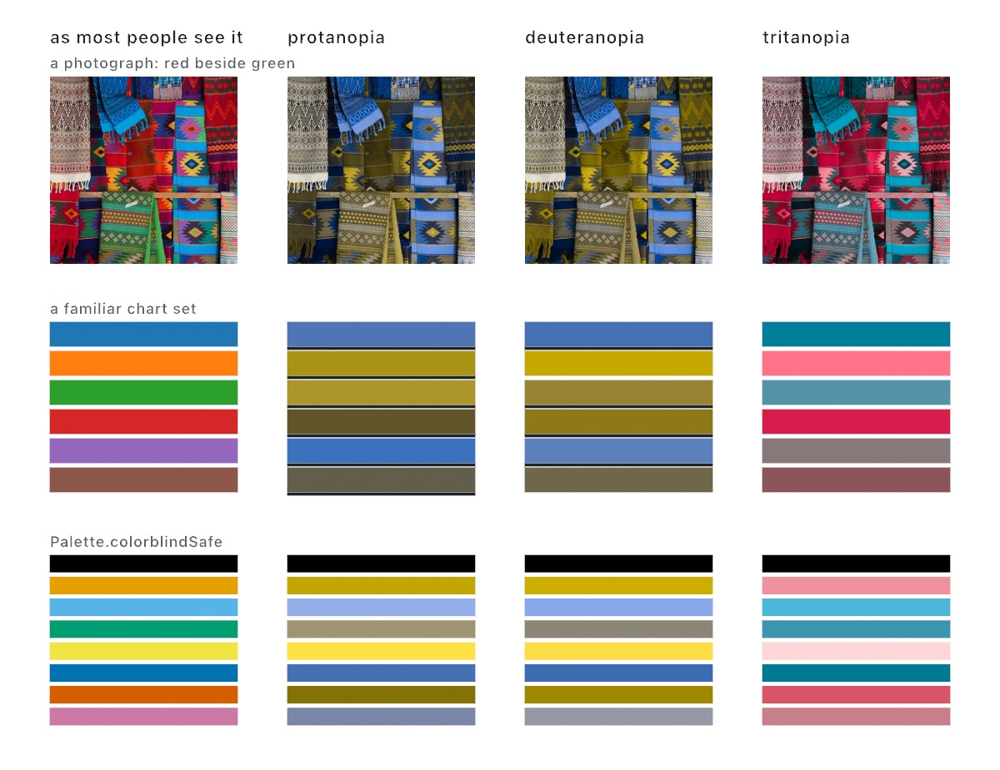
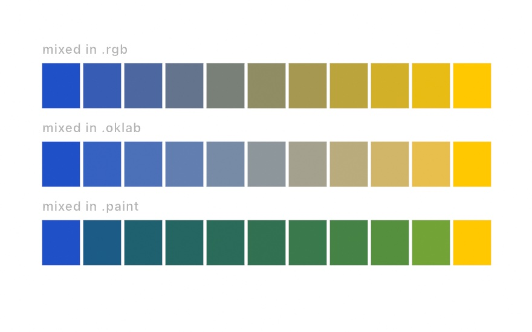

#### <sup>[Ollin](../README.md) → [Guide](README.md) → Chapter 2</sup>

---

# 2. Color that works



Color is the first thing a viewer reads in a sketch, and plain arithmetic mixes it to mud. Here you learn the tools that keep it clean, from thinking in hue to palettes grown from one color and gradients used as paint. The color field at the top is built on one harmony and redraws as a fresh variation on every click. A section after it mixes colors the way paint does.

Everything here builds on [Chapter 1](01-HelloOllin.md); keep working the same way, one file under `OllinLive`, saving as you go. Put the swinging yellow circle from [It moves on its own](01-HelloOllin.md#it-moves-on-its-own) back into `FirstCircle.swift`, because this chapter colors it.

## Naming a color

You've been writing `Color(hex: 0x2B2B2B)` since your first sketch. Here is the full menu:

```swift
fill(.coral)                                   // the CSS named set
fill(Color(hex: 0x5E60CE))                     // six hex digits, straight from a color picker
fill(Color(hex: 0xE4572E, alpha: 0.5))         // alpha is its own parameter
fill(Color(white: 0.15))                       // a quick gray
fill(Color(red: 0.95, green: 0.45, blue: 0.25))
```

The named constants cover the essentials (`.white`, `.black`, `.red`, …). They also include a selected set of the CSS names, so `.coral`, `.teal`, `.crimson`, and `.lavender` all read like what they are. The integer hex form is the one you will use most, because any color picker gives you those six digits. Go back to `FirstCircle.swift` and try a few of these in its `fill` line, and keep a sketch open through the chapter.

Colors can also arrive as *strings*, `Color(hex: "#ff0066")`, which matters once a color comes from somewhere else (a file, a website's palette). Strings can be malformed, so this form can fail, and Swift makes that visible:

> **Swift note.** `Color(hex: String)` returns an *optional*: a `Color?` that is either a color or nothing. Swift won't let you use it until you say what happens in the nothing case. The line `if let c = Color(hex: text) { fill(c) }` runs `fill(c)` only when the text parsed. The `!` in `Color(hex: "#ff0066")!` means "I promise this literal is well formed", and the sketch crashes if you're wrong. You'll meet optionals again; this is the pattern.

## Thinking in hue

Hex digits and names get you a color you already know. To find one you don't, you want dials you can turn, and which dials you get depends on the model. A **color model** is a set of dials for naming a color. Pick how many dials there are and what each one does, and you have a model. There is no single right answer. A set of dials that suits a screen does not suit a hand mixing paint, and neither suits an eye judging whether two colors match.

RGB has three dials, one per amount of light, because that is what a screen emits and a sensor measures. It goes back to nineteenth-century experiments on how three lights can be matched against a fourth, and it is how the machine stores color. That makes it good for storing and poor for choosing, because nobody thinks "a little less green" when what they want is a warmer orange.

HSB rearranges the same colors onto dials a person can steer. Pick the hue on a wheel, then decide how vivid it is (saturation) and how bright (brightness). It arrived with computer graphics in the 1970s, made for a designer's hand. Later in this chapter you will meet a third family, the OK models, which arrange the dials so that equal moves *look* equal.

<picture>
  <source media="(prefers-color-scheme: dark)" srcset="Images/02-Color/HueWheels-dark.jpg">
  
</picture>

```swift
fill(Color(hue: 0.07, saturation: 0.85, brightness: 0.95))   // a warm orange
```

All three run from 0 to 1. Hue *wraps*, so 1.2 means the same as 0.2, a full turn around the wheel plus a bit. That makes hue safe to drive with `time` directly, with no bookkeeping to keep it in range. Try it in `FirstCircle.swift`, replacing its `fill` line:

```swift
fill(Color(hue: time * 0.1, saturation: 0.8, brightness: 0.95))
```

The circle now cycles through the rainbow every ten seconds while it swings. One value goes in and continuous color comes out. A great deal of generative color is that one move.

## Mixing you can trust

The wheel names one color at a time. The next thing you want is the color halfway between two, and that is where the arithmetic goes wrong. Take a blue and a yellow, average their RGB numbers to get the halfway color, and you get… mud. Averaging the machine's storage format tells you nothing about what the *eye* considers halfway:

<picture>
  <source media="(prefers-color-scheme: dark)" srcset="Images/02-Color/MixingSpaces-dark.jpg">
  
</picture>

Ollin gives you mixing as one call, with the space as a choice. With `blue` and `yellow` standing for any two colors you hold:

```swift
Color.mix(blue, yellow, 0.5)              // OKLab, the default
Color.mix(blue, yellow, 0.5, in: .rgb)    // the muddy one, when you want it
Color.mix(blue, yellow, 0.5, in: .hsb)    // walks the hue wheel between them
```

The third number says how far along you are, and this guide calls it `t`. 0 gives the first color, 1 gives the second, and 0.5 gives the halfway point. The default space is **OKLab**, which arranges color's numbers so that equal moves *look* equal. A step of a given size changes the appearance by about the same amount wherever you take it. Blue and yellow are opposites, so their midpoint is still a neutral. It is an even, steady neutral, though, with no lurch in brightness and no detour through some other hue. [Appendix B](B-JustEnoughMath.md#numeric-vs-perceptual-mixing) has the idea underneath, when you're curious. The practical version is short: mix in OKLab unless you have a reason not to.

Try it live on the swinging circle:

```swift
fill(Color.mix(Color(hex: 0x2050C8), Color(hex: 0xFFC800), sin(time) * 0.5 + 0.5))
```

The `sin(time) * 0.5 + 0.5` squeezes the `-1...1` that `sin` gives into the `0...1` that `t` wants, so the circle breathes between the two colors. Remember that squeeze. [Chapter 3](03-MotionAndTime.md) turns it into a proper tool with a name.

## Hues that weigh the same: lightness

Mixing was the first place the eye and the numbers disagreed. The second is lightness. Two hues with the same `brightness` in HSB do not look equally bright. The eye weighs hues differently, so a yellow glows and a blue turns heavy. The same perceptual model as OKLab comes in two more shapes that put lightness on a dial of its own. **OKLCH** turns OKLab into dials for lightness, chroma (how far from gray a color sits), and hue, so nudging a hue leaves the lightness alone. Mixing with `.oklch` holds a color's identity while it arcs between hues. **OKHSL** arranges the same three dials so that everything you ask for is displayable. That makes it the space to reach for when a sketch is *generating* colors rather than using ones you picked.

Three everyday moves come ready-made on top of OKLCH. A shadow, a highlight, and an accent can all come from the one color you chose, here called `ink`:

```swift
ink.lighter()          // same hue, a step up in lightness
ink.darker(by: 0.25)   // and down, by as much as you ask for
ink.complement         // the opposite hue at the same weight
```

OKHSL does one more thing: hues that match in weight.

```swift
for i in 0..<12 {
    fill(Color(OKHSL(h: Double(i) / 12, s: 0.9, l: 0.65)))
    drawCircle(90 + Double(i) * 82, height / 2, 32)
}
```

Twelve different hues, and none of them shouts over the others, because they share a lightness. Do the same with `Color(hue:...)` and the yellow will glow while the blue turns heavy and dark. The harmonies in the next section lean on this. A palette grown from one color only works as a kit when its colors weigh the same.

## Kits you carry: Palette and Ramp

Individual colors get you started, but finished sketches usually run on a kit of colors chosen once and used throughout. Ollin has two kinds, plus two ready-made variants of the second:

<picture>
  <source media="(prefers-color-scheme: dark)" srcset="Images/02-Color/PaletteShelf-dark.jpg">
  
</picture>

A **`Palette`** is a fixed set of separate colors. Indexing wraps in both directions, so any counter cycles through it forever, and `color(at:)` slices `0...1` into equal bands:

```swift
let p = Palette.set2                  // eight ColorBrewer colors, ready to go
fill(p[i])                            // wraps: p[9] is p[1]
fill(p.color(at: t))                  // 0...1 quantized into eight bands
```

It is also a collection, so you can walk it the way you walk an array. The loop `for (i, color) in p.enumerated()` walks it with a counter, which is how you draw a strip of its swatches. You can also use `map`, `first` and `reversed()` on it, and `Array(p)` turns it into a plain array.

Eight classic sets ship built in, from `.set1` through `.accent`. A palette can also be grown out of one color you chose, and that is what the **harmony builders** do. They pick companions by turning around the hue wheel. The wheel itself is old. Isaac Newton bent the spectrum into a circle in *Opticks* (1704) so that its two ends met. Johannes Itten's *The Art of Color* (1961) gave painters the twelve-hue version most design teaching still uses. On it, the relations that keep coming back are angles.

- **Complementary** is the base and the hue directly opposite it, half a turn away. The pair has the most contrast the wheel can give, so it is for an accent against a ground.
- **Split complementary** is the base and the two hues flanking its opposite. It keeps most of that contrast with less of the clash two exact opposites can produce. It also gives you one more color to work with.
- **Triadic** is three hues a third of a turn apart. Nothing in it is the ground, so it reads as lively, and it wants one of the three kept small.
- **Analogous** is the base and its neighbors, a twelfth of a turn apart by default. It is calm, because every color shares most of its hue with the next. A sunset or a forest reads as one thing for the same reason.

<picture>
  <source media="(prefers-color-scheme: dark)" srcset="Images/02-Color/HarmonyWheel-dark.jpg">
  
</picture>

The builders work in OKLCH, so the companions keep the base's lightness and chroma rather than drifting lighter or darker. That is the weight matching from the section above:

```swift
Palette.complementary(of: base)
Palette.splitComplementary(of: base)
Palette.triadic(of: base)
Palette.analogous(of: base, count: 5)
```

`spread:` on `splitComplementary` and `analogous` sets how far apart the companions sit, as a fraction of a turn. A harmony is a `Palette`, so it indexes and walks like `.set2` does. `.ramp()` turns it into the smooth kind, which is what the finished sketch does with one.

A **`Ramp`** is the continuous version, a gradient you can sample anywhere along its length. Give it a list of colors to spread evenly, or explicit stops if you want to place them yourself. Then read it with `color(at:)`. Blending runs through OKLab by default, so the in-betweens stay clean. Every mixing space from earlier is on the menu, so `Ramp([blue, yellow], in: .hsb)` walks the hue wheel between its two colors:

```swift
let dusk = Ramp([Color(hex: 0x14213D), Color(hex: 0x5E60CE),
                 Color(hex: 0xE56B6F), Color(hex: 0xFFB703), Color(hex: 0xFFF3E0)])
fill(dusk.color(at: t))
```

Two kinds of ramp come pre-made. **`Colormap`** holds [eight scientific maps](../Docs/Drawing/Color.md#colormap) such as `.viridis` and `.magma`. Seven of them are built so that perceived brightness climbs evenly from one end to the other. Those seven are the standard way to turn a number into a color a viewer can read. `.turbo` is a rainbow instead, brightest in the middle. **`CosinePalette`** holds seven cyclic palettes such as `.sunset` and `.neon`, all generated from one small formula. Because they loop, they work well when fed with `time`. Both answer to the same `color(at:)`.

A palette or a ramp can be a `@Param`, which saves a lot of editing and rerunning. A parameter is a value with a control in the panel beside the window, which the hosts call the inspector. You turn it while the sketch runs instead of editing a number and saving. [Chapter 1](01-HelloOllin.md#putting-it-together-a-breathing-ring) declared four of them, and [Parameters](../Docs/Helpers/Parameters.md) is the rest of the family.

```swift
@Param var inks = Palette(.red, .white, .black)      // a strip of blocks
@Param var dusk = Ramp([.black, .white])             // a band with a handle per stop
```

The palette shows in the inspector as its colors side by side. Click one and the color well beside the label edits it. The ramp shows as the gradient itself, and its handles drag along the band to move a stop. The `+` and `−` buttons add and remove a color in either. When you like what you see, press **Save parameters**, as in [Chapter 1](01-HelloOllin.md#saving-the-values-you-tuned). It writes the colors back into the code, and a ramp comes back in full, with each stop's position beside its color.

## Gradients as paint

A `Ramp` can also *be* the paint. Anywhere `fill` or `stroke` accepts a color it will also accept a gradient, laid over the canvas in one of four ways. Below, `dusk` is the ramp from the kit section and `glow` is a ramp that ends in a transparent color. The last one, `wheel`, is a ramp of hues around the wheel:

<picture>
  <source media="(prefers-color-scheme: dark)" srcset="Images/02-Color/GradientPaint-dark.jpg">
  
</picture>

```swift
fill(.linear(from: Vector2(0, 0), to: Vector2(0, height), dusk))   // along a line
fill(.radial(center: spot, radius: 260, glow))                     // out from a point
fill(.conic(center: spot, startAngle: -.pi / 2, wheel))            // once around a point
stroke(.alongPath(wheel))                                          // along the stroke itself
```

Each of them takes a `Ramp` or a plain list of colors. Alpha is kept too. A radial ramp that ends in a transparent color gives you a soft glow, as in the second panel above. The coordinates live in drawing space, so gradients move with the shapes they paint. `.conic` sweeps the ramp once around a point you choose, starting from an angle you choose. That is a color wheel, a dial, or a pie in one call. A ramp whose last color repeats its first hides the seam where the sweep comes back around. `.alongPath` runs from the start of a line to its end. On a closed shape it sweeps once around its own center, which is how the ring above became a wheel too.

## Palettes from a file

Every kit so far was typed in, and typing hex codes gets tiring. A file lets you skip it. `loadPalettes` reads palettes someone else already made. It returns every palette in a file, while `loadPalette` returns just the first one. Both throw when the file will not read. You never have to say what format the file is in, because the loader looks at the bytes and works it out. It reads a plain list of hex codes one per line, a CSV or TSV with a palette on each line, and JSON. It also reads Adobe `.ase` swatch files from Illustrator or Photoshop.

```swift
let sets = try! loadPalettes("1000.json")      // however many the file holds
let one  = try! loadPalette("sunset.hex")     // just the first
```

> **Swift note.** A call that can fail on the way, like reading a file, is marked `throws`, and you call it with `try`. `try!` says "I promise this works", and crashes if it doesn't, the way `!` did for the optional earlier. `try?` hands you `nil` instead of a crash. [Appendix A](A-JustEnoughSwift.md) has the rest of the story.

A good place to get palettes is [nice-color-palettes](https://github.com/Experience-Monks/nice-color-palettes), an npm package carrying a thousand of them as JSON, in the shape `loadPalettes` expects. You do not need npm to use it. The repository holds the files, so take `100.json` or `1000.json` from it and drop the file next to your sketch. The call above reads it as is. Two things to know about that file. Its palettes were collected from [COLOURlovers](https://www.colourlovers.com), whose default license forbids commercial use. So Ollin doesn't bundle them, and you should check the terms before selling work that uses them. And so many people have reached for this collection that its first palette shows up in a great deal of generative art. That palette's colors are `#69d2e7`, `#a7dbd8`, `#e0e4cc`, `#f38630`, and `#fa6900`. If you want your work to look like yours, [Chapter 9](09-Pictures.md#palettes-from-a-photograph) takes a palette out of a photograph you took.

## Will everybody see it?

You now have colors, mixes, kits, and gradients. Before they go into a sketch, one check applies to all of them. Pick two colors that read as clearly different to you, and there is a fair chance somebody cannot tell them apart. About one person in twenty sees color differently from the palette most work is designed against. In a room of twenty people it is one of them.

Three kinds are common enough to have names. Protanopia and deuteranopia both blur red against green, and between them they are most of the one in twenty. Tritanopia, which blurs blue against yellow, is rare. You can look at your own colors through any of the three:

```swift
let seen = Color.red.simulated(.deuteranopia)
```

<picture>
  <source media="(prefers-color-scheme: dark)" srcset="Images/02-Color/ColorVision-dark.jpg">
  
</picture>

The picture at the top is a wall of woven blankets, where red sits beside green in nearly every stripe. Under the two commonest kinds those stripes arrive as one olive band, and only the blues survive. The middle block is a palette common in charts, and its orange, green and red land on that same olive. The bottom block is `Palette.colorblindSafe`, eight colors published for this, and it holds together.

To see a whole sketch rather than a swatch, put the reading over the frame. The call `postProcess` filters the finished frame just before it is shown, so it belongs in `draw()` rather than `setup()`. The usual place is the last line:

```swift
override func draw() {
    // everything you were drawing anyway
    postProcess(.colorVision(.deuteranopia))
}
```

Put it behind a `@Param` toggle and it becomes a switch you flick while you work.

You can also ask, rather than look:

```swift
if !myPalette.isColorblindSafe() {
    print(myPalette.confusions())     // worst pair first
}
```

The rule underneath all of this is short. Red and green do look alike to a protanope, and the pair is often still fine, because one is much darker than the other. What merges is two colors of the same lightness that differ only in hue. Distances here are measured in OKLab, the same space a mix works in, where black to white is 1. A red and a green matched for lightness sit 0.281 apart for average vision, and 0.014 apart under the worst kind. So vary lightness, not only hue, and give a shape or a label to anything that color alone is carrying.

## A recipe borrowed early: random

[Chapter 1](01-HelloOllin.md) borrowed `sin` from [Chapter 3](03-MotionAndTime.md), and this chapter's finale borrows `random` from [Chapter 4](04-Randomness.md). A short version will get you through it. `random(-1, 1)` hands you a fresh unpredictable number in that range every time you call it. On its own that's a problem for a sketch that redraws sixty times a second. Every frame would roll new numbers, and the canvas would boil. The fix is `randomSeed(n)`, which restarts the randomness from a fixed point. The *same* seed then always produces the *same* sequence of "random" numbers. Seed at the top of `draw()` and every frame makes identical choices, which holds the picture still. Change the seed and you get a brand-new variation that's just as coherent. [Chapter 4](04-Randomness.md) has the rest of the story, and this is enough to be going on with.

## Putting it together: a color field

The sketch is one ramp grown from one color, and a quilt of cells, with three ideas layered on top. The ramp is an analogous harmony of the base color, the base and four neighbors on the wheel at one weight, blended in OKLCH. Turning the base re-colors the whole field. Each cell samples the ramp according to its *diagonal position*, so the top-left corner is 0 and the bottom-right is 1. Seeded randomness then jitters every sample, which is what makes the field read as organic rather than mechanical. And a `sin` wave rolls across the quilt, so the colors travel rather than sit. Make `MySketches/ColorField.swift`:

```swift
import Ollin

final class ColorField: Sketch {
    @Param("Base") var base = Color(hex: 0x5E60CE)
    @Param("Columns", 4...28) var columns = 14
    @Param("Jitter", 0...1) var jitter = 0.4

    var fieldSeed = 7

    var ramp: Ramp {
        Palette.analogous(of: base, count: 5, spread: 1.0 / 8).ramp(in: .oklch)
    }

    override func draw() {
        randomSeed(fieldSeed)
        background(Color(hex: 0x0E1116))
        noStroke()
        let margin = 70.0, gutter = 7.0
        let cell = (width - margin * 2 - gutter * Double(columns - 1)) / Double(columns)
        for c in 0..<columns {
            for r in 0..<columns {
                let x = margin + Double(c) * (cell + gutter)
                let y = margin + Double(r) * (cell + gutter)
                let diagonal = Double(c + r) / Double(columns * 2 - 2)
                let t = diagonal
                    + random(-0.5, 0.5) * jitter * 0.5
                    + sin(time * .tau / 5 + diagonal * 4) * 0.16
                fill(ramp.color(at: t))
                drawRect(x, y, cell, cell)
            }
        }
    }

    override func mousePressed() {
        fieldSeed += 1
    }
}
```

Run it and walk the interesting lines:

- `randomSeed(fieldSeed)` runs at the top of every frame. So all the `random(-0.5, 0.5)` calls that follow roll the same numbers each time, and the quilt holds still. Now click the canvas. Then `mousePressed()` bumps the seed, and the next frame rolls a new set of jitters. Each click gives you the same sketch as a fresh variation, and you can click through as many as you like.
- `ramp` is worked out from `base` each time it is read, so the `Base` swatch in the panel re-colors the field as you pick. The call `Palette.analogous(of:count:spread:)` is the harmony from [Kits you carry](#kits-you-carry-palette-and-ramp), five hues an eighth of a turn apart centered on the base. Then `.ramp(in: .oklch)` blends them the short way around the wheel.
- Two loops, one inside the other, visit every column and row, and `diagonal` turns each cell's position into the `0...1` the ramp wants.
- The `t` line carries the look: position, plus seeded jitter scaled by the parameter, plus the rolling wave. Comment out one term at a time to see what each contributes. With jitter at zero you get a clean mechanical gradient, which is a good look in its own right.
- The parameters do a lot of work here. `Columns` changes the sketch's character, chunky at 5 and woven at 28, and `Jitter` takes it from formal to painterly.

> **Swift note.** `var fieldSeed = 7` is a *property*, declared on the class rather than inside `draw()`. Because it lives on the class, it survives from one frame to the next. A `let` or `var` written inside `draw()` is born and dies with that frame. The line `var ramp: Ramp { … }` is a property too, but a *computed* one, like `canvasSize` in [Chapter 1](01-HelloOllin.md#the-canvas-is-not-the-window). Its braces work the value out each time the name is read. `mousePressed()` is another function Ollin calls for you, once per click, alongside `setup()` and `draw()`. And a loop inside a loop does what it sounds like: for every column, visit every row.

Directions to try before [Chapter 3](03-MotionAndTime.md):

- Swap the harmony for `.triadic(of: base)` or `.splitComplementary(of: base)` and watch how much more the field contrasts.
- Swap the ramp for `Colormap.viridis` or `CosinePalette.sunset`, or for a list you picked by hand, like the dusk ramp from [Kits you carry](#kits-you-carry-palette-and-ramp). Neither of the first two is a `Ramp`, but both answer `color(at:)`. So in the `fill` line, write `Colormap.viridis.color(at: t)` in place of `ramp.color(at: t)`.
- Make the cells circles, or shrink each one by a little `random(0, cell * 0.3)` for a hand-placed feel.
- Replace the flat background with a `.linear` gradient of the ramp's two end colors.

A variation you like is a seed, and the seed is what each click changed. The one on screen is `7` plus the number of clicks it took, so write that number into the `var fieldSeed` line. Then export a still of the sketch at a frame you name, so the wave sits where you saw it:

```sh
swift run OllinLive MySketches/ColorField.swift --export field.png --frame 60
```

[Chapter 4](04-Randomness.md#finding-a-seed-to-keep) turns that counting into a tool, with the seed printed on the canvas and a key that steps through them.

## Mixing like paint

The field above mixes light. Every ramp and every `Color.mix` so far did, because a screen is made of light. Halfway between two lights of opposite hue sits gray. Paint answers the same question differently, and Ollin can mix that way too. The sketch had no need of it. A palette that has to read as gouache or watercolor does. So does a ramp that has to pass through the green a painter expects.

### Blue and yellow make green: mixing in `.paint`

Mixing in `.paint` follows pigment rather than light. It is for ramps and palettes that should behave like a box of paints. There, blue and yellow give green and every mix darkens a little. It comes from the layer optics Paul Kubelka and Franz Munk published in 1931 for paint films, applied to the light each color reflects.

The spaces earlier in the chapter disagree with your childhood. Mix blue and yellow in RGB or the OK family and you land on a neutral or a mud. Neither space reaches the green a paintbox gives. HSB finds green only by walking the hue wheel through it. A screen mixes *light*, and halfway between two opposite lights sits gray. Paint works the other way around: pigment absorbs light, and green is what survives both pigments.

`.paint` is the second kind of mixing, in the same call:

<picture>
  <source media="(prefers-color-scheme: dark)" srcset="Images/02-Color/PaintMixing-dark.jpg">
  
</picture>

```swift
Color.mix(blue, yellow, 0.5, in: .paint)   // green, the way a palette gives it
```

Behind the call, each color becomes the reflectance curve of a surface painted with it. The two curves then mix the way scattering pigments mix, wavelength by wavelength. The mixes also darken a little, because pigment only ever absorbs, and that darkening is half of what makes the result read as paint. `.oklab` gives you even steps, and `.paint` gives you what pigment does. Pick by what the sketch needs. The `Ramp` form takes the same space, so `Ramp([blue, yellow], in: .paint)` travels through green.

### Light by wavelength: `Spectrum`

That curve is a type you can hold, called `Spectrum`. It keeps a color as the amount of light at each wavelength rather than as three numbers. It is for colors that come from physics: a single wavelength, a hot body, a soap film. Turning a curve back into a color uses measurements of how the eye weighs each wavelength. The international commission on lighting (the CIE) published them in 1931. Paint mixing is the first thing a `Spectrum` is good for, and three more come with it, each one call:

```swift
Color(wavelength: 590)        // the single wavelength the eye reads as yellow
Color(.blackbody(1800))       // the color of a thing heated to candle temperature
Spectrum.blackbody(6500)      // and as a curve: roughly daylight
```

Run `Color(wavelength:)` from 400 to 700 nanometers and it sweeps a physical rainbow. A hue wheel gives you a different rainbow. `blackbody` is why a candle is orange and a hot star is blue, from one number in kelvin. Three GPU effects also work wavelength by wavelength instead of channel by channel. They are `.thinFilm` for the colors in a soap bubble and `.diffraction` for the rainbow split off a grating. The third, `.paintMix`, runs the paint mixing above over a whole picture at once. The [Spectral color](../Docs/Drawing/Spectrum.md) reference has all of it.

## Where this comes from

The hue wheel goes back to Isaac Newton, who bent the spectrum into a circle in *Opticks* in 1704. The twelve-hue wheel with harmonies read as angles on it is from Johannes Itten's *The Art of Color*, from 1961. The OKLab family, OKLab, OKLCH, and OKHSL, is the work of Björn Ottosson. He published it openly in 2020 and 2021, and OKLab and OKLCH are now part of the CSS color standard. That is why "mix in OKLab" is advice you'll meet across modern tools. Paint mixing follows Paul Kubelka and Franz Munk's 1931 layer optics. It works over reflectance curves built by the method Agatha Mallett and Cem Yuksel published in 2019. The built-in qualitative palettes are Cynthia Brewer's ColorBrewer sets, designed for map readability and used far beyond maps. The colormaps come from the scientific-visualization world. Viridis and its relatives are from matplotlib, by Stéfan van der Walt and Nathaniel Smith, and turbo is from Google. The cosine palette formula is Inigo Quilez's, a name that will keep coming up in this guide. Full credits live in the project's [attribution notes](../ATTRIBUTION.md#color).

## Go deeper

- [Color](../Docs/Drawing/Color.md): the complete reference, including color temperature (`Color(kelvin:)`) and the string-hex grammar.
- [Light and color](../Docs/Concepts/Light.md): one screen on why the middle of a frame is linear light, and what the last pass does to it before the screen.
- Appendix B draws this chapter's math, one picture per idea: [Fractions, mapping, and wrapping](B-JustEnoughMath.md#fractions-mapping-and-wrapping), [Color and light as numbers](B-JustEnoughMath.md#color-and-light-as-numbers).
- Worked examples, all in [`Examples/Color/`](../Examples/Color/): `Mixing` (the six spaces side by side), `Harmonies`, `Swatchbook`, `PaletteFile`, `PaletteFromImage`, `Colormaps`, `HSBWheel`, `Gradients`, `Dithering`, and `ColorVision`.
- [Accessibility](../Docs/Helpers/Accessibility.md): the color-vision simulation, the palette check, and the reduce-motion setting.
- The Schuh homages in [`Examples/Recreations/OwenSchuh/`](../Examples/Recreations/OwenSchuh/): both pages use color as a code. A digit is one step of a ten-step scale, so a number can be read off the picture. Colored this way, a page of arithmetic comes out as a piece of cloth.
- The Melehi homage [`Waves`](../Examples/Recreations/MohamedMelehi/Waves/Sketch.swift): a palette handed out by shares. Each color declares how many of every cycle's bands it gets, and a weighted round robin deals them in the palette's order. A rainbow keeps its order, and the share decides how often a color comes back.
- [Drawing](../Docs/Drawing/Drawing.md): every place a gradient can go as paint.

---

[Contents](README.md#contents) · Previous: [Chapter 1, Hello, Ollin](01-HelloOllin.md) · Next: [Chapter 3, Motion and time](03-MotionAndTime.md)
