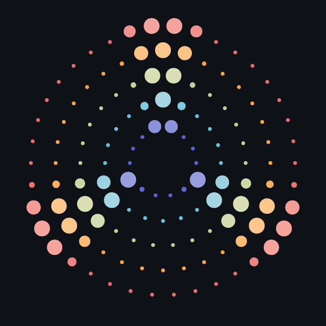
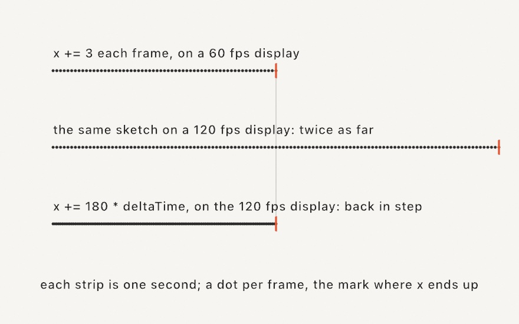
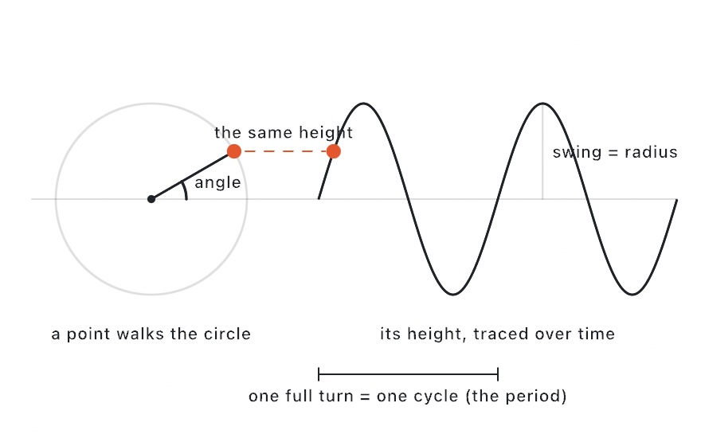
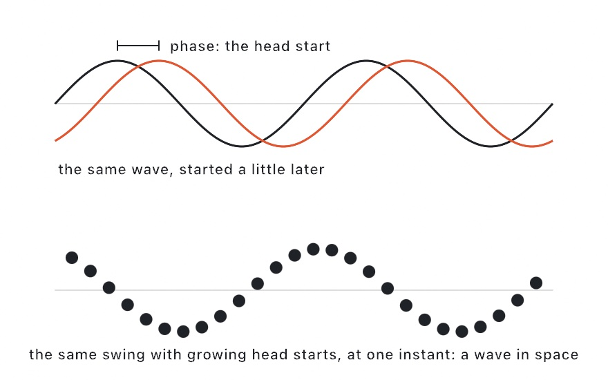
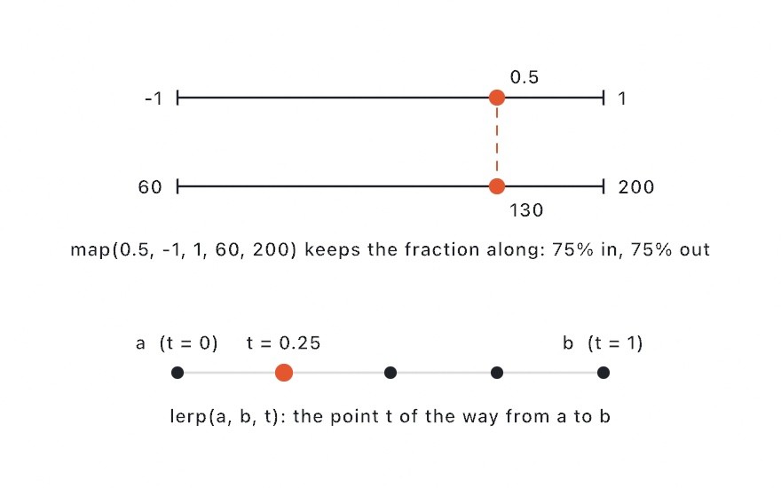
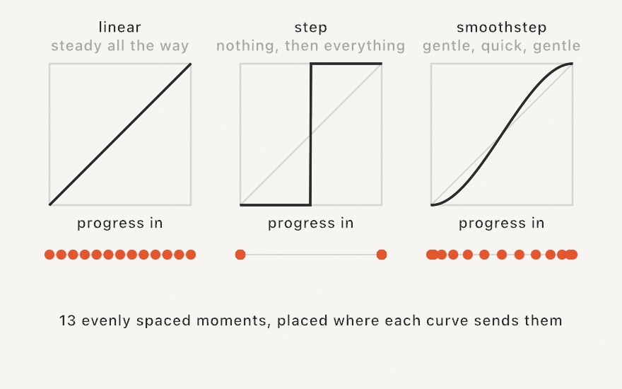
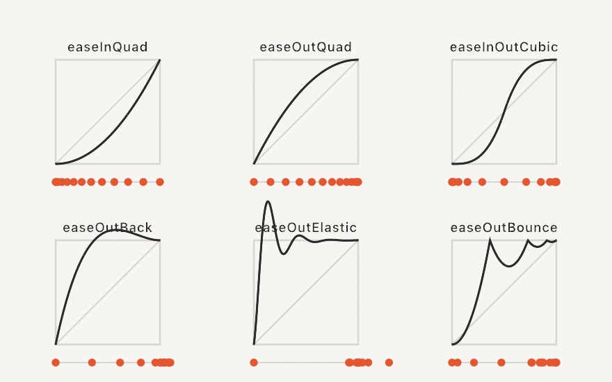
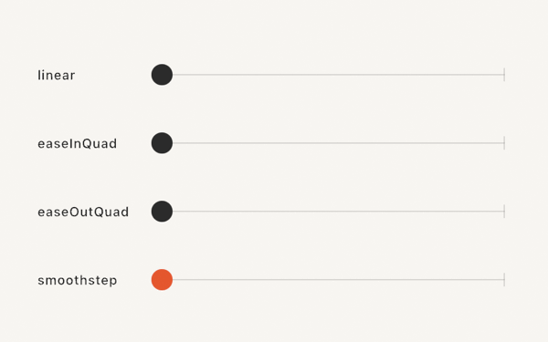
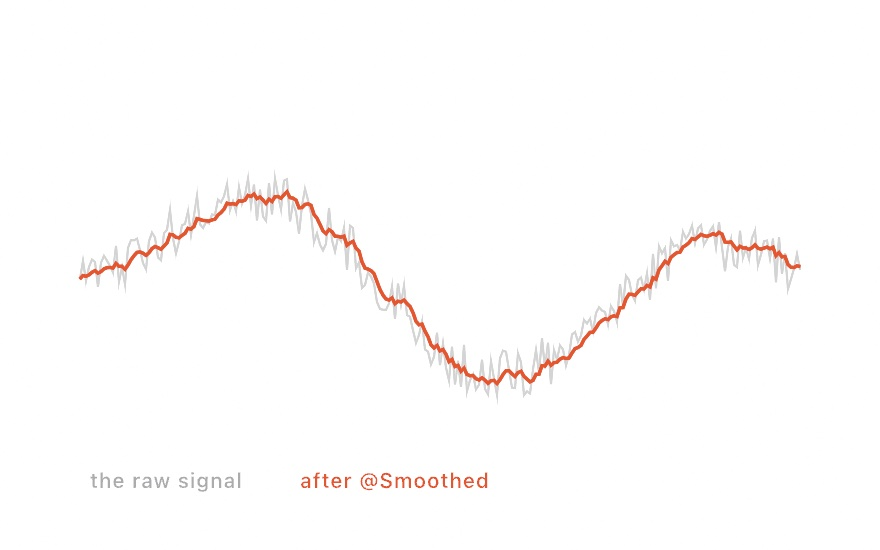
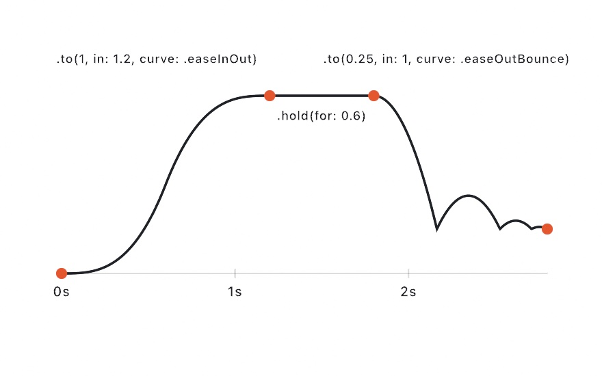

#### <sup>[Ollin](../README.md) → [Guide](README.md) → Chapter 3</sup>

---

# 3. Motion and time



Chapter 1 handed you `sin` as a recipe and promised an explanation later, and this is later. By the end of this chapter you'll know where that wave comes from, how to make motion run at the same speed on every display, and how to bend plain constant-rate movement into motion with character, the kind that eases, snaps, springs, and bounces. It all comes together in the piece above, a loop that ends exactly where it begins, which you'll export as the first file in this guide you can share with someone.

## The clock

Every sketch carries a clock, and you've already used it: `time` is the seconds since the sketch started. It has three siblings, all free to read inside `draw()`:

- `frameCount`: how many frames have been drawn so far (1 on the first).
- `deltaTime`: the seconds since the previous frame, around 0.0167 at 60 fps.
- `frameRate`: the current frames-per-second estimate.

`deltaTime` is worth understanding early, because your sketch's frame rate is not a constant of the universe. `draw()` runs at whatever your display refreshes at, which is 60 times a second on many screens and 120 on recent MacBooks, and a step like `x += 3` happens once per *frame*. That means the same sketch covers twice the distance on the faster display:



There are two reliable ways to move, and this guide uses both:

- **Derive positions from `time`.** `width / 2 + time * 120` is at the same place after one second on any display, because it says where to *be*, not how far to *step*. Most of what you've written so far works this way, and it's the default habit to build.
- **Scale steps by `deltaTime`.** When a value has to accumulate (a particle that remembers where it was, which is most of Part II), write the speed per second and multiply: `x += 120 * deltaTime`. Now a fast display takes more, smaller steps and lands in the same place.

What you want to avoid is the third way, a bare per-frame step, which silently bakes your display's refresh rate into the artwork.

## The circle behind sin

Here is where the wave comes from, and it's the promise Chapter 1 made:



Picture a point walking around a circle at a steady speed. Ask at every moment "how high is it?" and write the answers down from left to right. The trace you get is the sine wave, and that's all `sin` is: **the height of a point going around a circle**. Its partner `cos` gives you the same point's distance across. Now you can see why the pair places things around a circle the way Chapter 1's ring of dots did. They were never two separate tools, just the two coordinates of one walking point.

Everything you need to control follows from the picture:

- **One full turn is one full cycle.** The angle of a full turn is `.tau`, so `sin(time * .tau)` swings exactly once per second and `sin(time * .tau / 5)` once every five seconds. The mysterious `/ 3` in Chapter 1's swinging circle was setting the period all along, one back-and-forth every three seconds.
- **The swing is the radius.** `sin` runs between -1 and 1, so multiplying is what makes it cover ground, and `sin(...) * 300` swings 300 pixels each way.

Put both to work and the walking point itself appears:

```swift
let angle = time * .tau / 5          // one full turn every five seconds
let x = width / 2 + cos(angle) * 320
let y = height / 2 + sin(angle) * 320
drawCircle(x, y, 60)
```

That's an orbit, built from nothing but the clock and the pair. Slow it down, speed it up, or shrink the radius, and every number you touch now means something you can name.

## Phase: the head start

One more idea falls out of the circle picture. Suppose a second point starts its walk a little further along the rim. It travels the same circle at the same speed and traces the same wave, just shifted in time. That shift is called **phase**, and you make one by adding a constant inside `sin`:



Things get interesting when *neighbors get different head starts*. Give each dot in a row a phase proportional to its position, then look at any single instant, and a wave appears across space, even though no dot is doing anything but its own private swing:

```swift
for i in 0..<24 {
    let x = 80 + Double(i) * 40
    let y = height / 2 + sin(time * .tau / 3 + Double(i) * 0.4) * 160
    drawCircle(x, y, 15)
}
```

Run that and you've built the bottom half of the diagram, live. You've also seen the move before, because Chapter 1's breathing ring offset each circle's swing with `+ Double(i) * 0.5`. That was phase, used before it had a name. It's the cheapest way there is to make many things feel alive together, and the finished piece at the end of this chapter leans on it heavily.

## map and lerp: moving between ranges

`sin` hands you `-1...1`, but that's rarely the range you actually want. You want 40 to 220 pixels of radius, or `0...1` to feed a color ramp. Chapter 2 patched this with the squeeze, `sin(...) * 0.5 + 0.5`. The proper tool is `map`, which carries a value from one range into another by keeping its *fraction along*:



```swift
let radius = map(sin(time * .tau / 4), -1, 1, 40, 220)
drawCircle(width / 2, height / 2, radius)
```

Read it as a sentence: "take this value, which lives in `-1...1`, and restate it in `40...220`." You get a breathing circle, and every number in sight says what it means. (By default `map` extrapolates past the ends, so add `clamp: true` when you want the result pinned inside the target range.)

Its smaller sibling `lerp(a, b, t)` skips the first range entirely. Here `t` is already a `0...1` "how far along", the same `t` you fed to `Color.mix` and to ramps in Chapter 2, and `lerp` returns the point that far from `a` to `b`. So `lerp(140, 940, 0.5)` is halfway, which is 540.

That raises the question of where a moving `t` comes from, and the answer is the clock, wrapped. Divide `time` by how long one lap should take and keep only the fraction of the current lap you're through. The move is common enough to have its own name, so every sketch can just ask for it:

```swift
let t = loopProgress(over: 3)          // 0...1, every 3 seconds
let x = lerp(140, width - 140, t)
drawCircle(x, height / 2, 50)
```

The dot crosses the canvas in three seconds, snaps back, and crosses again. There's no magic inside it, since `loopProgress(over: 3)` is simply `fract(time / 3)`, where `fract` keeps a number's fractional part. Seven and a half seconds in, that's `fract(2.5)`, which is halfway through the third lap. You can call `fract` yourself whenever you want to wrap something by hand.

If the snap back to the start bothers you, and it probably should a little, ask for the fold instead. `pingPong(over:)` runs from 0 up to 1 and back down to 0 over the same period, so the trip retraces itself rather than teleporting home:

```swift
let back = pingPong(over: 3)           // 0 to 1 to 0, every 3 seconds
let x = lerp(140, width - 140, back)
```

## Shaping time

This is the heart of the chapter. Everything so far moves at a constant rate, and constant-rate motion has no character, because real things lean into a start and brake into an arrival. What fixes it is a small family of functions with a single job. Each one **takes a plain `0...1` progress and hands back a reshaped `0...1` progress**, and feeding the reshaped value to `lerp` runs the same trip with a different personality.

Because they're functions you can draw them, and drawing them is really the only way they make sense. Every plot below reads the same way. The input progress runs along the bottom, the reshaped output is the height, and the thin diagonal shows what "unchanged" would look like for reference. Under each plot is the same experiment, thirteen evenly spaced *moments* placed where the curve sends them. Where the dots bunch up the motion is slow, and where they spread out it's fast.



- **linear** is the diagonal itself, where the output equals the input and the pace never changes. It's what you've been using so far.
- **step** is an `if` written as a function. It stays at 0 until the halfway point and then jumps to 1, with no in-between at all, which is exactly what you want for a blink, a flip, or a light switching on.
- **smoothstep** is the S between them, and it's the one worth committing to memory. Follow the curve and you'll see it leave the floor gently, hurry through the middle, and settle onto the ceiling gently. In the dot strip that shows up as tight spacing, then wide, then tight again, which is a motion that eases out, travels, and eases in. No corners and no jolt, just an arrival that feels finished.

In Ollin both ship as bare functions, `step(edge, x)` and `smoothstep(edge0, edge1, x)`. The extra numbers are *edges*, meaning where the ramp begins and where it ends. With the edges at 0 and 1, smoothstep is exactly the S in the figure:

```swift
let t = loopProgress(over: 3)
let x = lerp(140, width - 140, smoothstep(0, 1, t))
drawCircle(x, height / 2, 50)
```

Same dot, same three seconds, but now it *departs* and *arrives*. (Under the hood the S is one line of algebra, `t * t * (3 - 2 * t)`. You'll never need to write it, but it's nice to know the whole curve is that small.)

Because the edges are yours to place, smoothstep does more than reshape a progress. It also works as a **window cutter**. Read `smoothstep(0.3, 1.0, wave)` as "0 until the wave climbs past 0.3, then 1 once it reaches the top, with a soft shoulder in between", and you have a way of turning any signal into a smooth spotlight. Hold on to that, because the piece at the end of this chapter runs on it. This little S-curve is one of the great workhorses of computer graphics, and when you reach shaders in Chapter 15 you'll find it waiting there, spelled exactly the same, doing per-pixel what it does per-frame here.

## A catalog of curves

Once you can read a curve and its dot strip together, you can read any easing function at a glance, and Ollin ships a whole catalog of them. They're Robert Penner's classic easing equations, thirty curves across ten families, each available in an ease-in form for a slow start, an ease-out form for a slow arrival, and an ease-in-out form for both.



The top row stays inside `0...1`, quadratics and cubics that differ mainly in how hard they lean. The bottom row overshoots on purpose. `easeOutBack` goes past the target and comes back, the way your hand does when you reach past a shelf. `easeOutElastic` arrives like a plucked rubber band. `easeOutBounce` drops the value onto its target in shrinking hops. Watch four of them run the same trip:



Same start, same finish, same four seconds. The only difference is *when* each dot spends its time, and that's the whole craft of easing: an animation's character lives in the spacing rather than the path. Hand the dot listing `Easing.easeOutBounce(t)` in place of `smoothstep(0, 1, t)` and the trip is unchanged in every measurable way while feeling completely different. (The S itself is in the catalog too, as `Easing.smoothstep`, for anywhere that wants a curve by name.)

The full table of thirty names is in the [Animation](../Docs/Helpers/Animation.md#catalog) reference, and the [EasingGallery example](../Examples/Motion/EasingGallery/Sketch.swift) plots them all side by side.

## Values that chase, signals that shake

The shaping functions all assume you're steering `t` yourself. Three property wrappers handle the everyday cases where you'd rather not.

**`@Eased`** is for a value with a *target*. Assign where it should go, read where it currently is, and it glides over on its own along a curve and duration you pick once:

```swift
final class Springy: Sketch {
    @Eased(duration: 0.9, curve: .easeOutElastic) var x = 540.0
    @Eased(duration: 0.9, curve: .easeOutElastic) var y = 540.0

    override func draw() {
        background(.white)
        fill(.coral)
        drawCircle(x, y, 60)
    }

    override func mousePressed() {
        x = mouseX
        y = mouseY
    }
}
```

Click around and the dot springs to each click, with no progress variable for you to manage. Like everything in this chapter the tween is timed in seconds, so it feels identical at 60 and 120 fps.

**`@Sprung`** answers the same question a different way. Where `@Eased` follows a curve you chose for a duration you fixed, a spring is a physical model: it accelerates toward the target, overshoots if it has the energy, and settles. That difference matters most when the target *moves*. Retarget an `@Eased` value mid-flight and it restarts its curve from wherever it happens to be, which reads as a stutter; retarget a spring and it carries its current velocity into the new journey, which is why interfaces that follow a dragging finger tend to be spring-driven:

```swift
@Sprung(duration: 0.5, bounce: 0.3) var x = 540.0
```

The two knobs are chosen to be describable rather than physical. `duration` is roughly how long a settle takes. `bounce` sets the character: 0 arrives without any overshoot at all, positive values up toward 1 wobble more and more before settling, and negative values drag in slowly. There's also `kick(_:)`, which shoves a spring without moving its target, and that's how you make something recoil in place. Behind the wrapper, `DampedSpring` evaluates the exact solution for a damped oscillator at each step instead of integrating one step at a time, so any frame rate produces the same motion.

**`@Smoothed`** is for the opposite situation, where the value arrives *from outside*, continuously, and shakes. A jittery mouse is the obvious case, and later in this guide it'll be MIDI knobs, camera trackers, and phone sensors. There's no target to ease toward here, only a noisy stream to clean up as it comes:



```swift
@Smoothed var x = 0.0
// each frame: feed the raw value in, read the calm one back
x = mouseX
```

Behind it is an adaptive filter that stays steady while the signal is slow and snaps awake when it moves fast, which a simple average can't manage. File it away until Part V hands you your first shaky tracker, and the [Animation](../Docs/Helpers/Animation.md#smoothed) page has the tuning knobs when you need them.

## Choreography: Timeline

`@Eased` and `@Sprung` each chase one target at a time. When a value should follow a *script* instead, rising over 1.2 seconds, holding, then tumbling back down, build a `Timeline`. It's a sequence of timed keyframes, each segment with its own easing, that you read like a plain value:



```swift
final class Rise: Sketch {
    let move = Timeline(0.0)
        .to(1, in: 1.2, ease: .easeInOut)
        .hold(for: 0.6)
        .to(0.25, in: 1.0, ease: .easeOutBounce)

    override func setup() {
        move.loops = true
    }

    override func draw() {
        background(.white)
        fill(Color(hex: 0x5E60CE))
        let y = map(move.value, 0, 1, height - 200, 200)
        drawCircle(width / 2, y, 70)
    }
}
```

The plot above *is* this timeline, sampled and drawn by an Ollin sketch like every figure in this guide. Notice `setup()` doing its Chapter 1 job here: `move.loops = true` is a decision the sketch makes once and then keeps. Timelines advance themselves once per frame as long as they're stored properties on the sketch, the way `move` is; one you create on the fly inside `draw()` has to be stepped by hand with `move.advance(by: deltaTime)`. They loop, report `progress` and `isFinished`, can be restarted and scrubbed, and sequence 2D and 3D positions as happily as they do numbers. The details live in [Animation](../Docs/Helpers/Animation.md#timeline).

## Putting it together: a loop that never ends

Here's the piece from the top of the chapter, and it needs one new idea, the **perfect loop**. A GIF plays its frames in a ring, so if the last frame flows into the first the motion reads as endless. The recipe comes straight out of the circle-to-sine picture. Since `sin` repeats every full turn, you *pick a loop length and make every time-driven term complete a whole number of turns within it*. In code that means choosing a `loopTime`, building one beat from it with `loopProgress(over: loopTime) * .tau` so the beat turns exactly once per lap, and then letting that beat, or a whole multiple of it, be the only source of time in the sketch. Phase offsets cost you nothing here, since they only shift where each swing starts. Space follows the same rule bent into a circle: a wave wrapped around a ring has to fit a whole number of times, or it won't meet itself where the ring closes.

That's the entire theory of the piece. Make `MySketches/RingPulse.swift`:

```swift
import Ollin

final class RingPulse: Sketch {
    @Param("Waves", 1...6) var waves = 3
    @Param("Pulse width", 0.1...0.9) var pulseWidth = 0.35

    let loopTime = 4.0
    override var loopDuration: Double? { loopTime }
    let ramp = Ramp([
        Color(hex: 0x5E60CE), Color(hex: 0x64DFDF),
        Color(hex: 0xFFB703), Color(hex: 0xE56B6F),
    ])

    override func draw() {
        background(Color(hex: 0x0E1116))
        noStroke()
        let beat = loopProgress(over: loopTime) * .tau   // one full turn per loop
        for ring in 0..<5 {
            let radius = 110.0 + Double(ring) * 82
            let count = 14 + ring * 6
            let base = ramp.color(at: Double(ring) / 4)
            var direction = 1.0
            if ring % 2 == 1 { direction = -1 }
            for i in 0..<count {
                let angle = Double(i) / Double(count) * .tau
                let wave = sin(angle * Double(waves) - beat * 2 * direction)
                let lit = smoothstep(1 - pulseWidth * 2, 1, wave)
                fill(Color.mix(base, Color(hex: 0xFFF6E8), t: lit * 0.4))
                let x = width / 2 + cos(angle) * (radius + lit * 18)
                let y = height / 2 + sin(angle) * (radius + lit * 18)
                drawCircle(x, y, 6 + lit * 20)
            }
        }
    }
}
```

Run it with `swift run OllinLive MySketches/RingPulse.swift` and take the interesting lines apart:

- `beat` is the loop's heartbeat. `loopProgress` laps `0...1` once every `loopTime` seconds, so multiplying by `.tau` turns it into exactly one full circle per lap. The only other time term in the sketch is `beat * 2`, which is a whole multiple, so frame 0 and the frame at `loopTime` are identical. The loop rule is enforced by how the sketch is built rather than by checking afterward.
- `wave` is the phase trick from earlier, bent into a circle. Each dot's head start is its angle times the wave count, so the crests *travel* around the ring. That count has to stay a whole number or the wave won't meet itself where the ring closes, which is why `waves` starts at `3` rather than `3.0`. A whole-number property makes a whole-number knob, stepping 1, 2, 3 instead of sliding through fractions, and `Double(waves)` converts it for the math, the same move as Chapter 1's `Double(i)`.
- `lit` is the window cutter from the shaping section, working here as a **soft spotlight**. The wave lives in `-1...1`, and smoothstep's edges carve out its crest, giving 0 below the threshold, 1 at the peak, and soft shoulders in between, so the dots swell and fade rather than switching on and off. Widen `Pulse width` and the lower edge drops, which opens the window until the whole ring breathes at once.
- Everything `lit` touches is a `lerp` in spirit. The color leans toward warm white by `lit * 0.4` using Chapter 2's `Color.mix`, the dot lifts outward by `lit * 18`, and it swells from 6 up to 26. One shaped value drives all three.
- `direction` flips alternate rings, and that alone is most of why the piece feels alive rather than mechanical.

When it feels right in the live window, export it. Anything Ollin can run it can also render to a file without opening a window, and the live host accepts the same export flags the example targets do:

```sh
swift run OllinLive MySketches/RingPulse.swift --export-loop ring.gif --gif-width 540
```

That's one lap at the default 25 fps, scaled to 540 pixels, which makes a small file that loops forever. Notice there's no duration on the command. The sketch declares its own through `loopDuration`, the one-line override in the listing, and `--export-loop` renders exactly one period, so the file and the loop can't drift apart. This is your first export, and it's the piece at the top of this chapter, made by this same command. For a sketch that doesn't declare a loop, `--export-gif ring.gif --seconds 4` is the general form; `--export-video ring.mp4` writes a real video instead, and `--export frame.png` grabs a single still. The whole menu is in [Export](../Docs/Output/Export.md).

Then make it yours:

- Set `Waves` to 1 for a slow radar sweep, or 6 for a glitter of small pulses.
- Add a breath: make each `radius` line `radius + sin(beat + Double(ring)) * 10`. One whole multiple of the beat, so the loop survives. Check it by re-exporting.
- Replace the `smoothstep` in `lit` with `step(1 - pulseWidth * 2, wave)` and the glow becomes a hard blink: same window, no shoulders. Put the smoothstep back and appreciate the shoulders.
- Make all rings run the same `direction`, or give the ramp four colors of your own.

## Where this comes from

The named easing curves are Robert Penner's easing equations, published with his 2002 book *Programming Macromedia Flash MX* and since absorbed into practically every animation system; Ollin's are written from the formulas catalogued at [easings.net](https://easings.net). The craft behind them is older than software, since the animator's principles of slow-in and slow-out grew out of the Disney studio of the 1930s, and "the spacing is the animation" is their lesson. Smoothstep is a small classic of computer graphics shading languages, where it does per-pixel what this chapter does per-frame; [The Book of Shaders](https://thebookofshaders.com) by Patricio Gonzalez Vivo and Jen Lowe teaches that per-pixel world beautifully, and its insistence on *drawing* shaping functions rather than defining them shaped this chapter. Describing a spring by duration and bounce instead of by stiffness and damping is the approach Apple introduced with SwiftUI's spring animations, and it's a good deal kinder to work with than the physical parameters. `@Smoothed` implements the [1€ filter](https://gery.casiez.net/1euro/) by Géry Casiez, Nicolas Roussel, and Daniel Vogel (CHI 2012). Full credits are in the project's [attribution notes](../ATTRIBUTION.md).

## Go deeper

- [Math helpers](../Docs/Helpers/Math.md): `map`, `lerp`, `dist`, the shaping scalars, and the constants.
- [Animation](../Docs/Helpers/Animation.md): the full easing catalog, `@Eased`, `@Sprung`, `@Smoothed`, and `Timeline`.
- [Sketch](../Docs/Core/Sketch.md#temporal-state): the clock properties in one table.
- [Export](../Docs/Output/Export.md): stills, sequences, video, GIF sizing, and render quality.
- Worked examples, all in [`Examples/Motion/`](../Examples/Motion/): `Breathing` (map on a pulse), `Easing` (four dots racing to a click), `EasingGallery` (all thirty curves), `Springs` (`@Sprung` against a moving target), `Timeline` (a scripted tour of a square, one easing per side), `Smoothing` (the filter chasing a shaky target), `SineSweep`, and `Orbits`.

---

[Contents](README.md#contents) · Previous: [Chapter 2, Color that works](02-Color.md) · Next: [Chapter 4, Randomness](04-Randomness.md)
