#### <sup>[Ollin](../README.md) → [Guide](README.md) → Chapter 3</sup>

---

# 3. Motion and time

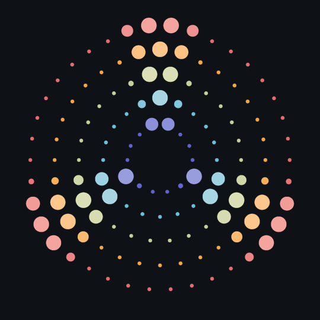

Motion needs a clock you can trust and curves that give it character. You learn both, from the clock and the circle behind `sin` to shaping curves that ease, snap, and bounce. The rings above loop without a seam, and you export them as a GIF. Past the rings comes the motion Ollin runs for you, from a sway in one call to timers, and the setting that holds it still.

## The clock

Every sketch carries a clock, and you've already used it: `time` is the seconds since the sketch started. Three more properties come with it, and you read them inside `draw()` the same way:

- `frameCount` is how many frames have been drawn so far, and it reads 1 on the first.
- `deltaTime` is the seconds since the previous frame, around 0.0167 at 60 fps.
- `frameRate` is the current frames-per-second estimate.

`deltaTime` matters early, because you cannot count on the frame rate. `draw()` runs at whatever your display refreshes at, which is 60 times a second on many screens and 120 on recent MacBooks. A step like `x += 3` happens once per *frame*. That means the same sketch covers twice the distance on the faster display:

<picture>
  <source media="(prefers-color-scheme: dark)" srcset="Images/03-MotionAndTime/DeltaTime-dark.jpg">
  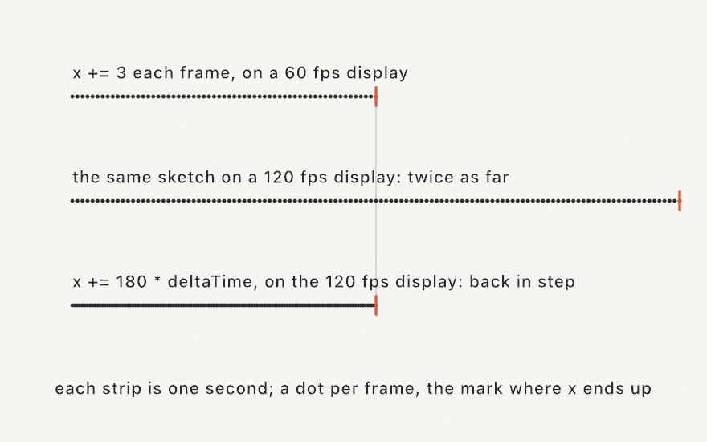
</picture>

The first two strips are that bare step, on a slow display and a fast one, and they are what to avoid. A step written per frame silently bakes your display's refresh rate into the artwork. The third strip is the fix, and there are two ways to reach it:

- **Derive positions from `time`.** `width / 2 + time * 120` is at the same place after one second on any display. It says where to *be*, not how far to *step*. Most of what you've written so far works this way, and it's the default habit to build.
- **Scale steps by `deltaTime`.** Some values have to accumulate, like a particle that remembers where it was, which is most of Part II. Write the speed per second and multiply, as in `x += 180 * deltaTime`. That is the third strip: a fast display takes more, smaller steps and lands in the same place.

## When a frame takes too long

The refresh rate is a ceiling. Give `draw()` more work than fits in a frame and it takes longer, so fewer frames land each second. Nothing warns you, and the frame you asked for is still drawn in full, only later.

Here is what a sketch drawing more and more circles read off its own clock:

| circles per frame | `frameRate` | `deltaTime` |
| --- | --- | --- |
| none | 60 | 0.017 |
| 100,000 | 51 | 0.021 |
| 160,000 | 41 | 0.047 |

Read across and you can see which of the three properties to trust. `frameRate` falls, because that is what it measures. `deltaTime` grows, because it is the real gap between this frame and the last. And `time` keeps counting real seconds throughout, because it is a clock rather than a frame counter.

That is the reason for the two habits above. Motion derived from `time`, or stepped by `deltaTime`, keeps its speed as the rate falls. It gets choppier, and it does not get slower.

Two more facts belong here. If the machine falls far enough behind, the window drops a refresh rather than queuing work it cannot finish. `draw()` is not called at all that time, because skipping a frame is better than a window that stops answering the mouse. And an export does not have this problem in the first place. It runs on a fixed clock that gives every frame exactly `1 / fps`, however long the drawing takes. A sketch too heavy to play smoothly still exports at full speed.

To see where a slow frame's time goes, press **⌘/** for the inspector. Its last row has two bars, one for your `draw()` and one for the graphics card, each drawn against the length of one frame. The longer bar is the one to shorten. [Chapter 19](19-LayersAndEffects.md#which-half-is-slow-the-cost-row) reads the whole row once layers are part of the picture, and the [profiler reference](../Docs/Tools/Profiling.md) has the rest.

## The circle behind `sin`

Here is where the wave comes from, which [Chapter 1](01-HelloOllin.md) left for this chapter:

<picture>
  <source media="(prefers-color-scheme: dark)" srcset="Images/03-MotionAndTime/CircleToSine-dark.jpg">
  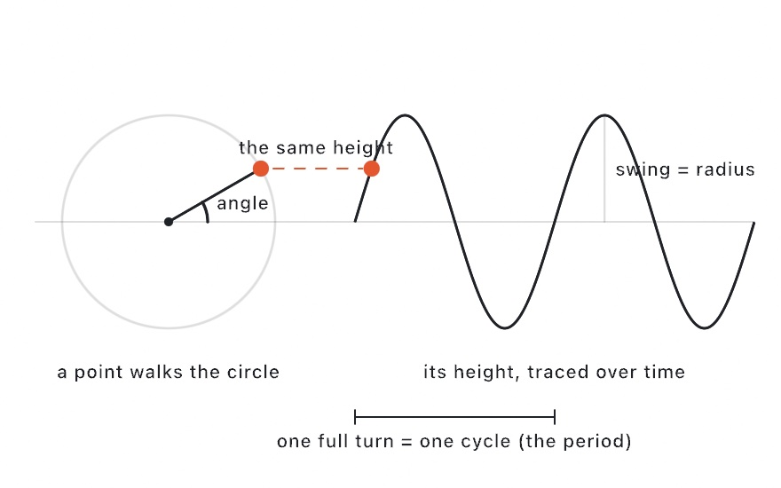
</picture>

Picture a point walking around a circle at a steady speed. Ask at every moment "how high is it?" and write the answers down from left to right. The trace you get is the sine wave, and that's all `sin` is: **the height of a point going around a circle**. Its partner `cos` gives you the same point's distance across. Now you can see why the pair places things around a circle the way [Chapter 1](01-HelloOllin.md)'s ring of dots did. They are the two coordinates of one walking point.

Everything you need to control follows from the picture:

- **One full turn is one full cycle.** The angle of a full turn is `.tau`. So `sin(time * .tau)` swings exactly once per second, and `sin(time * .tau / 5)` once every five seconds. The `/ 3` in [Chapter 1](01-HelloOllin.md)'s swinging circle was setting the period, one back-and-forth every three seconds.
- **The swing is the radius.** `sin` runs between -1 and 1, so multiplying is what makes it cover ground. `sin(...) * 300` swings 300 pixels each way.

Put both to work and the walking point itself appears:

```swift
let angle = time * .tau / 5          // one full turn every five seconds
let x = width / 2 + cos(angle) * 320
let y = height / 2 + sin(angle) * 320
drawCircle(x, y, 60)
```

That's an orbit, built from nothing but the clock and the pair. Slow it down, speed it up, or shrink the radius, and every number you touch now means something you can name.

## Phase: the head start

One more idea falls out of the circle picture. Suppose a second point starts its walk a little further along the rim. It travels the same circle at the same speed and traces the same wave, just shifted in time. That shift is called **phase**, and you make one by adding a constant inside `sin`:

<picture>
  <source media="(prefers-color-scheme: dark)" srcset="Images/03-MotionAndTime/Phase-dark.jpg">
  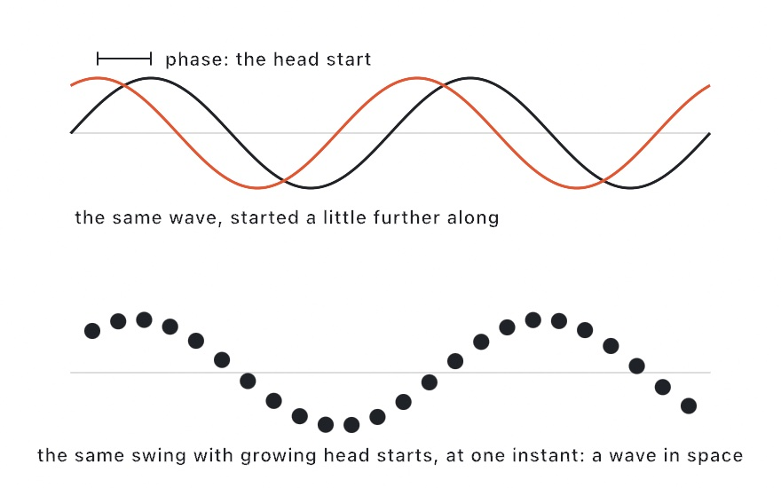
</picture>

The move that matters is giving *neighbors different head starts*. Give each dot in a row a phase proportional to its position, then look at any single instant. A wave appears across space, even though no dot is doing anything but its own private swing:

```swift
for i in 0..<24 {
    let x = 80 + Double(i) * 40
    let y = height / 2 + sin(time * .tau / 3 + Double(i) * 0.4) * 160
    drawCircle(x, y, 15)
}
```

Run that and you've built the bottom half of the diagram, live. You've also seen the move before, because [Chapter 1](01-HelloOllin.md)'s breathing ring offset each circle's swing with `+ Double(i) * 0.5`. That was phase, used before it had a name. It's the cheapest way to make many things move together as one, and the finished sketch leans on it.

## `map` and `lerp`: moving between ranges

You now have a clock and the wave it drives. The next job is to put what they produce into the range you need, because `sin` hands you `-1...1` and that is rarely it. You want 40 to 220 pixels of radius, or `0...1` to feed a color ramp. [Chapter 2](02-Color.md) patched this with the squeeze, `sin(...) * 0.5 + 0.5`. The proper tool is `map`, which carries a value from one range into another by keeping its *fraction along*:

<picture>
  <source media="(prefers-color-scheme: dark)" srcset="Images/03-MotionAndTime/MapAndLerp-dark.jpg">
  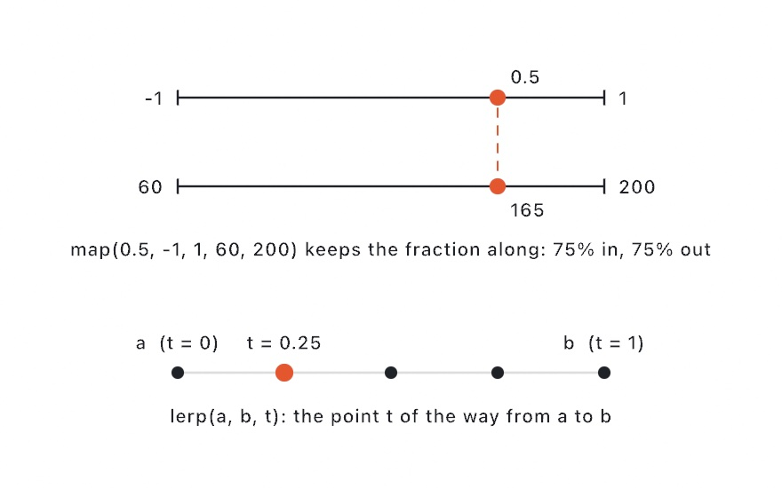
</picture>

```swift
let radius = map(sin(time * .tau / 4), -1, 1, 40, 220)
drawCircle(width / 2, height / 2, radius)
```

Read it as a sentence. It says "take this value, which lives in `-1...1`, and restate it in `40...220`". You get a breathing circle, and every number in sight says what it means. By default `map` carries on past the ends, so add `clamped: true` when you want the result pinned inside the target range.

Its smaller sibling `lerp(a, b, t)` skips the first range entirely. Here `t` is already a `0...1` "how far along", the same `t` you fed to `Color.mix` and to ramps in [Chapter 2](02-Color.md). `lerp` returns the point that far from `a` to `b`. So `lerp(140, 940, 0.5)` is halfway, which is 540.

The two order their arguments differently, and reading each as a sentence says why. `map` names the value first, because the value is the thing being carried somewhere. `lerp` names it last, because the two ends are the journey and `t` is how far along it you are.

That raises the question of where a moving `t` comes from, and the answer is the clock, wrapped. Divide `time` by how long one lap should take and keep only the fraction of the current lap you're through. The move is common enough to have its own name, so every sketch can just ask for it:

```swift
let t = loopProgress(over: 3)          // 0...1, every 3 seconds
let x = lerp(140, width - 140, t)
drawCircle(x, height / 2, 50)
```

The dot crosses the canvas in three seconds, snaps back, and crosses again. Inside, `loopProgress(over: 3)` is `fract(time / 3)`, where `fract` keeps a number's fractional part. Seven and a half seconds in, that's `fract(2.5)`, which is halfway through the third lap. You can call `fract` yourself whenever you want to wrap something by hand.

When the snap back to the start is not what you want, ask for the fold instead. The call `pingPong(over:)` runs from 0 up to 1 and back down to 0 over the same period. So the trip retraces itself instead of jumping back to the start:

```swift
let back = pingPong(over: 3)           // 0 to 1 to 0, every 3 seconds
let x = lerp(140, width - 140, back)
```

<picture>
  <source media="(prefers-color-scheme: dark)" srcset="Images/03-MotionAndTime/LoopProgress-dark.jpg">
  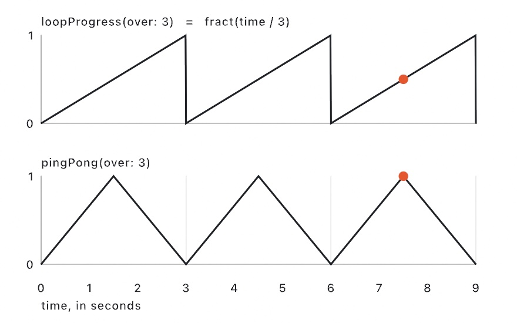
</picture>

Both come back to the same number every lap, whatever `time` reads. That is the property the finished sketch is built on. A loop that has to end where it began needs every moving part to close its lap at the same moment.

## Shaping time

This is the heart of the chapter. Everything so far moves at a constant rate. Constant-rate motion has no character, because real things lean into a start and brake into an arrival. What fixes it is a small family of functions with a single job. Each one **takes a plain `0...1` progress and hands back a reshaped `0...1` progress**. Feeding the reshaped value to `lerp` runs the same trip with a different personality.

Because they're functions you can draw them, and drawing them is how they make sense. Every plot below reads the same way. The input progress runs along the bottom, the reshaped output is the height, and the thin diagonal shows what "unchanged" would look like for reference. Under each plot is the same experiment, thirteen evenly spaced *moments* placed where the curve sends them. Where the dots bunch up the motion is slow, and where they spread out it's fast.

<picture>
  <source media="(prefers-color-scheme: dark)" srcset="Images/03-MotionAndTime/ShapingCurves-dark.jpg">
  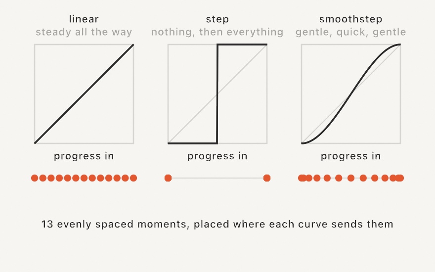
</picture>

- **linear** is the diagonal itself, where the output equals the input and the pace never changes. It's what you've been using so far.
- **step** is an `if` written as a function. It stays at 0 until the halfway point and then jumps to 1, with no in-between at all. That is what you want for a blink, a flip, or a light switching on.
- **smoothstep** is the S between them, and it's the one to remember. Follow the curve and you'll see it leave the floor gently, hurry through the middle, and settle onto the ceiling gently. In the dot strip that shows up as tight spacing, then wide, then tight again. The motion eases out, travels, and eases in. No corners and no jolt, just an arrival that feels finished.

In Ollin both ship as bare functions, `step(edge, x)` and `smoothstep(edge0, edge1, x)`. The extra numbers are *edges*, meaning where the ramp begins and where it ends. With the edges at 0 and 1, smoothstep is exactly the S in the figure:

```swift
let t = loopProgress(over: 3)
let x = lerp(140, width - 140, smoothstep(0, 1, t))
drawCircle(x, height / 2, 50)
```

Same dot, same three seconds, but now it *departs* and *arrives*. Inside, the S is one line of algebra, `t * t * (3 - 2 * t)`, and you never need to write it.

Because the edges are yours to place, smoothstep does more than reshape a progress. It also works as a **window cutter**. Read `smoothstep(0.3, 1.0, wave)` as "0 until the wave climbs past 0.3, then 1 once it reaches the top". In between, the value rises along a soft shoulder. That gives you a way of turning any signal into a smooth spotlight:

<picture>
  <source media="(prefers-color-scheme: dark)" srcset="Images/03-MotionAndTime/WindowCutter-dark.jpg">
  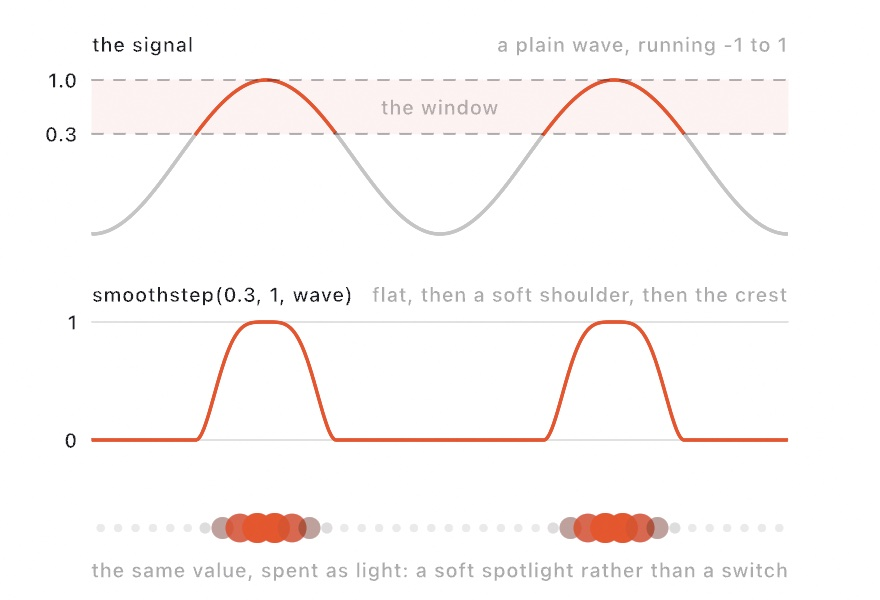
</picture>

The wave never changes. All the window does is decide how much of each crest counts, and the dots along the bottom are that decision spent as light. Hold on to it, because the finished sketch runs on this. The same S-curve is used all through computer graphics. It is waiting in [Chapter 18](18-YourFirstShader.md) spelled the same, doing per pixel what it does per frame here.

## A catalog of curves

Once you can read a curve and its dot strip together, you can read any easing function at a glance. Ollin ships a catalog of them. They're Robert Penner's classic easing equations, thirty curves across ten families. Each comes in an ease-in form for a slow start, and an ease-out form for a slow arrival. There is an ease-in-out form for both.

<picture>
  <source media="(prefers-color-scheme: dark)" srcset="Images/03-MotionAndTime/EasingFamilies-dark.jpg">
  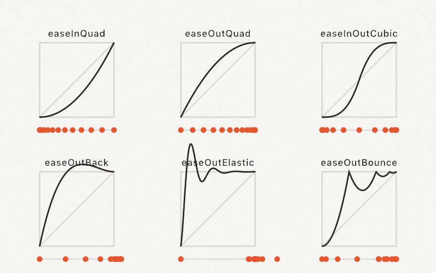
</picture>

The top row stays inside `0...1`, quadratics and cubics that differ mainly in how hard they lean. The bottom row reaches its target early and leaves it again, on purpose. `easeOutBack` goes past the target and comes back, the way your hand does when you reach past a shelf. `easeOutElastic` arrives like a plucked rubber band. `easeOutBounce` drops the value onto its target in shrinking hops. Watch four of them run the same trip:

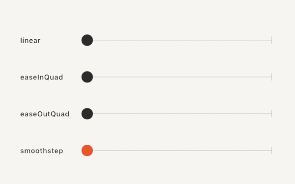

Same start, same finish, same four seconds. The only difference is *when* each dot spends its time. That's the craft of easing: an animation's character lives in the spacing rather than the path. Hand the dot listing `Easing.easeOutBounce(t)` in place of `smoothstep(0, 1, t)`. The trip keeps its start, its end, and its three seconds, but it feels different. The S itself is in the catalog too, as `Easing.smoothstep`, for anywhere that wants a curve by name.

The full table of thirty names is in the [Animation](../Docs/Helpers/Animation.md#catalog) reference, and the [EasingGallery example](../Examples/Motion/EasingGallery/Sketch.swift) plots them all side by side.

Picking a curve by reading a table is slow work, so a curve can be a parameter instead. Write `@Param var curve: Easing = .easeInOut` and the inspector shows a menu of every named curve. Try them against the motion itself and keep the one that feels right. The finished sketch offers its pulse's curve this way.

Once a curve is a value, you can make another from it. `curve.reversed()` runs the same curve from its other end, so an ease-in becomes its ease-out. The trip that lagged and then rushed now leaps and then settles. `curve.mirrored()` puts the curve on the way out and its reverse on the way back, squeezed into one trip. That is how the catalog builds most of its ease-in-out curves from their ease-ins. The back and elastic families carry their own constants instead. Reverse `easeInQuad` and you have `easeOutQuad`. Mirror it and you have `easeInOutQuad`. Mirror an ease-out instead and you get a curve the catalog does not carry, fast at both ends and slow through the middle.

<picture>
  <source media="(prefers-color-scheme: dark)" srcset="Images/03-MotionAndTime/DerivedCurves-dark.jpg">
  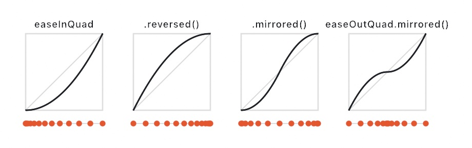
</picture>

That is the reason to want it. A sketch that holds one curve as a parameter can send a shape out on `curve` and bring it home on `curve.reversed()`. The pair stays matched whatever the menu picks. The [DerivedCurves example](../Examples/Motion/DerivedCurves/Sketch.swift) does that with three dots on one trip.

## Putting it together: a loop that never ends

Here's the sketch from the top of the chapter, and it needs one new idea, the **perfect loop**. A GIF plays its frames in a ring, so if the last frame flows into the first the motion reads as endless. The recipe comes straight out of the circle-to-sine picture. Since `sin` repeats every full turn, you *pick a loop length and make every time-driven term complete a whole number of turns within it*. In code, you first choose a `loopTime`. Then you build one beat from it with `loopProgress(over: loopTime) * .tau`, so the beat turns exactly once per lap. That beat, or a whole multiple of it, is then the only source of time in the sketch. Phase offsets are safe here, since they only shift where each swing starts. Space follows the same rule bent into a circle. A wave wrapped around a ring has to fit a whole number of times, or it won't meet itself where the ring closes.

That is all the theory the sketch needs. It also offers its curve as a parameter, the way [A catalog of curves](#a-catalog-of-curves) showed. Make `MySketches/RingPulse.swift`:

```swift
import Ollin

final class RingPulse: Sketch {
    @Param("Waves", 1...6) var waves = 3
    @Param("Pulse width", 0.1...0.9) var pulseWidth = 0.35
    @Param var curve: Easing = .smoothstep

    let loopTime = 4.0
    override var loopDuration: Double? { loopTime }
    let ramp = Ramp([
        Color(hex: 0x5E60CE), Color(hex: 0x64DFDF),
        Color(hex: 0xFFB703), Color(hex: 0xE56B6F),
    ])

    override func draw() {
        background(Color(hex: 0x0E1116))
        noStroke()
        let beat = loopProgress(over: loopTime) * .tau   // one full turn per loop
        for ring in 0..<5 {
            let radius = 110.0 + Double(ring) * 82
            let count = 14 + ring * 6
            let base = ramp.color(at: Double(ring) / 4)
            var direction = 1.0
            if ring % 2 == 1 { direction = -1 }
            for i in 0..<count {
                let angle = Double(i) / Double(count) * .tau
                let wave = sin(angle * Double(waves) - beat * 2 * direction)
                let window = map(wave, 1 - pulseWidth * 2, 1, 0, 1, clamped: true)
                let lit = curve(window)
                fill(Color.mix(base, Color(hex: 0xFFF6E8), lit * 0.4))
                let x = width / 2 + cos(angle) * (radius + lit * 18)
                let y = height / 2 + sin(angle) * (radius + lit * 18)
                drawCircle(x, y, 6 + lit * 20)
            }
        }
    }
}
```

Run it with `swift run OllinLive MySketches/RingPulse.swift` and take the interesting lines apart:

- `beat` is the loop's heartbeat. `loopProgress` laps `0...1` once every `loopTime` seconds, so multiplying by `.tau` turns it into exactly one full circle per lap. The only other time term in the sketch is `beat * 2`, which is a whole multiple. So frame 0 and the frame at `loopTime` are identical. The loop rule is enforced by how the sketch is built rather than by checking afterward.
- `wave` is the phase trick from earlier, bent into a circle. Each dot's head start is its angle times the wave count, so the crests *travel* around the ring. That count has to stay a whole number, as the theory above said, and that is why `waves` starts at `3` rather than `3.0`. A whole-number property makes a whole-number parameter, stepping 1, 2, 3 instead of sliding through fractions. `Double(waves)` converts it for the math, the same move as [Chapter 1](01-HelloOllin.md)'s `Double(i)`.
- `window` and `lit` are the window cutter from the shaping section, taken apart so that the curve can be a parameter. The wave lives in `-1...1`. Using `map` with `clamped: true` cuts out its crest as a `0...1`, which is 0 below the threshold and 1 at the peak. Then `curve` shapes that progress. With `.smoothstep`, the pair gives the same soft spotlight as `smoothstep(1 - pulseWidth * 2, 1, wave)`, shoulders included. The dots swell and fade rather than switching on and off. Widen `Pulse width` and the lower edge drops, which opens the window until the whole ring breathes at once. Pick `easeOutBounce` from the `curve` menu and every pulse lands in hops; pick `easeInQuad` and each stays dim until its last moment.
- Everything `lit` touches is a `lerp` in spirit. The color leans toward warm white by `lit * 0.4`, using [Chapter 2](02-Color.md)'s `Color.mix`. The dot lifts outward by `lit * 18`, and it swells from 6 up to 26. One shaped value drives all three.
- `direction` flips alternate rings, so neighboring rings run against each other. Make them all run the same way and see how much of the sketch's character that was.

When it feels right in the live window, export it. Anything Ollin can run it can also render to a file without opening a window. The live host accepts the same export flags the example targets do:

```sh
swift run OllinLive MySketches/RingPulse.swift --export-loop ring.gif --gif-width 540
```

That's one lap at the default 25 fps, scaled to 540 pixels, which makes a small file that loops forever. Notice there's no duration on the command. The sketch declares its own through `loopDuration`, the one-line override in the listing. `--export-loop` renders exactly one period, so the file and the loop can't drift apart. The sketch at the top of this chapter is this file, made by this same command. For a sketch that doesn't declare a loop, `--export-gif ring.gif --seconds 4` is the general form. `--export-video ring.mp4` writes a video instead, and `--export frame.png` grabs a single still. The full menu is in [Export](../Docs/Output/Export.md).

Then make it yours:

- Set `Waves` to 1 for a slow radar sweep, or 6 for a glitter of small pulses.
- Add a breath. Make each `radius` line `radius + sin(beat + Double(ring)) * 10`. One whole multiple of the beat, so the loop survives. Check it by re-exporting.
- Replace `curve(window)` with `step(0.5, window)` and the glow becomes a hard blink. It switches on at the middle of the window, with no shoulders. Put the curve back and the shoulders return.
- Give the ramp four colors of your own.

## Motion the framework runs for you

The ring above drives every motion from the clock by hand: a wrap, a phase, a window, a curve. You can now write that arithmetic yourself, and the calls below do the common cases for you in a line or two. The sketch needed none of them. Reduced motion, at the end, is different in kind: it is the one setting that asks you to hold back.

### The sway you write over and over: `sway`

One `sway` call does the wrap, the return trip, and the carry into a range. By default, it also rounds off the turn at each end. It gives a value that travels smoothly from one end of a range to the other and back, once per lap of so many seconds. It is for the breathing radius, the drifting position, and every other swing you would otherwise write as a `lerp` over a `pingPong`. It is Ollin's own shorthand for what [`map` and `lerp`](#map-and-lerp-moving-between-ranges) built by hand. A breathing circle like the one from there is one line with it:

```swift
drawCircle(width / 2, height / 2, sway(over: 4, in: 100...300))
```

The circle breathes between a radius of 100 and 300, once every four seconds. `sway` leaves the low end, reaches the high end halfway through the lap, and is back at the low end as the lap closes. With no range it hands you a plain `0...1`. The `phase:` argument gives one sway a head start, as a fraction of its lap. So a row of sways with growing phases makes a traveling wave, the way a constant inside `sin` did under [Phase](#phase-the-head-start).

When you would rather keep the raw sine spelling, `wave` names its parts instead. `wave(0.8, amplitude: 40, around: 150)` is `150 + sin(time * 0.8) * 40` with the center and the swing said out loud. `sway` thinks in seconds per lap and always closes one. `wave` thinks in the sine's own rate, the spelling to carry over when you already have one.

What changes between one sway and another is the path it takes between the two ends, and `shape:` names five of them:

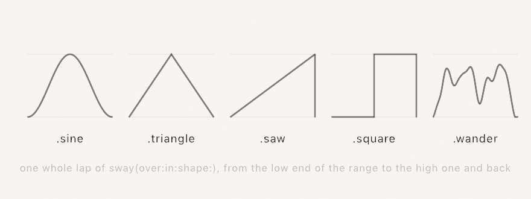

```swift
sway(over: 4, in: 100...300, shape: .triangle)
```

The four worked-out shapes all start at the low end, so changing your mind about the path never moves where the value begins. `.triangle` and `.saw` are `pingPong` and `loopProgress`, carried into a range. `.square` does not travel at all. It sits at one end for half the lap and at the other end for the rest. Use it to switch something rather than move it.

`.wander` is the fifth path. It drifts through noise rather than following a curve, and [Chapter 5](05-Noise.md#coming-home-the-loop-argument) shows how a drift like that can still come home. Every shape here arrives back where it started at the end of a lap. That is what lets a swaying sketch declare a `loopDuration` and export a loop with no visible seam, the way the ring did. [Animation](../Docs/Helpers/Animation.md#sway) has the call in full, and the [`Sway`](../Examples/Motion/Sway/Sketch.swift) example runs the five shapes side by side.

### Values that chase a target: `@Eased` and `@Sprung`

`@Eased` and `@Sprung` are values that move themselves toward a target you set. They are for the shape that should glide to a click and the shape that should follow a drag. They also suit any value you would rather assign than steer. The first runs a curve from the catalog over a duration. Animation tools have moved a value from one setting to the next that way since Flash. The second runs a spring with friction, the model interfaces settle with. Both are written with an `@` prefix, like `@Param`. The prefix marks a property that does something on its own.

**`@Eased`** is for a value with a *target*. Assign where it should go, read where it is now, and it glides over on its own along a curve and duration you pick once:

```swift
final class Glide: Sketch {
    @Eased(duration: 0.9, curve: .easeOutElastic) var x = 540.0
    @Eased(duration: 0.9, curve: .easeOutElastic) var y = 540.0

    override func draw() {
        background(.white)
        fill(.coral)
        drawCircle(x, y, 60)
    }

    override func mousePressed() {
        x = mouseX
        y = mouseY
    }
}
```

Click around and the dot glides to each click, with no progress variable for you to manage. Like `time` and `deltaTime`, the glide is timed in seconds, so it feels identical at 60 and 120 fps.

**`@Sprung`** answers the same question a different way. Where `@Eased` follows a curve you chose for a duration you fixed, a spring is a physical model. It accelerates toward the target, overshoots if it has the energy, and settles. That difference matters most when the target *moves*. Retarget an `@Eased` value mid-flight and it restarts its curve from wherever it happens to be, which reads as a stutter. Retarget a spring and it carries its current velocity into the new journey. That is why interfaces that follow a dragging finger tend to be spring-driven:

```swift
@Sprung(duration: 0.5, bounce: 0.3) var x = 540.0
```

The two arguments are chosen to be describable rather than physical. `duration` is roughly how long a settle takes. `bounce` sets the character. At 0 it arrives without any overshoot at all. Positive values up toward 1 wobble more and more before settling, and negative values drag in slowly. There's also `$x.kick(200)`, reached through the `$` form of the property. The kick pushes the spring without moving its target, which is how you make something recoil in place. Behind the wrapper, `DampedSpring` uses the formula for a spring with friction. It works out where the spring is at any moment rather than moving it a little each frame. So any frame rate produces the same motion.

### Choreography: `Timeline`

A `Timeline` is a value that follows a script. The script is a sequence of timed keyframes, each segment with its own easing, and you read the result like a plain value. It is for a motion with stages, such as a rise, a hold, and a fall. It is also for choreography that has to repeat the same way every time. Keyframes are the animator's own tool, older than software, and every animation program has them. `@Eased` and `@Sprung` each chase one target at a time. When a value should rise over 1.2 seconds, hold, then tumble back down, build a timeline instead:

<picture>
  <source media="(prefers-color-scheme: dark)" srcset="Images/03-MotionAndTime/TimelineCurve-dark.jpg">
  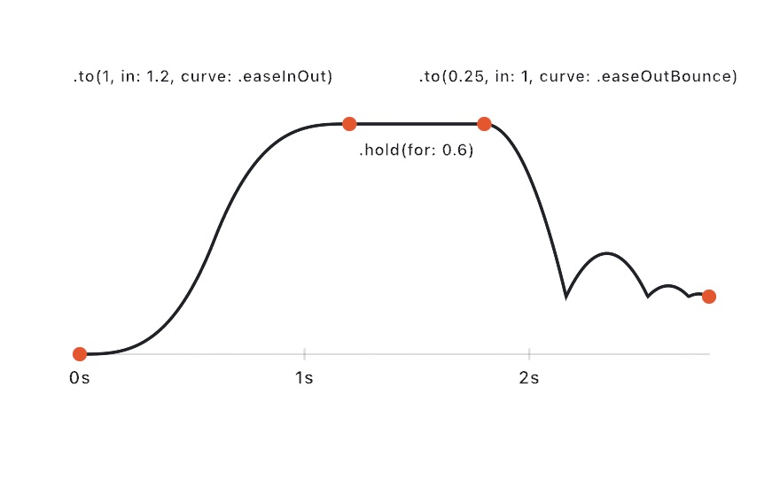
</picture>

```swift
final class Rise: Sketch {
    let move = Timeline(0.0)
        .to(1, in: 1.2, curve: .easeInOut)
        .hold(for: 0.6)
        .to(0.25, in: 1.0, curve: .easeOutBounce)

    override func setup() {
        move.loops = true
    }

    override func draw() {
        background(.white)
        fill(Color(hex: 0x5E60CE))
        let y = map(move.value, 0, 1, height - 200, 200)
        drawCircle(width / 2, y, 70)
    }
}
```

The plot above is this timeline's value over its 2.8 seconds. Notice `setup()` doing its [Chapter 1](01-HelloOllin.md) job here: `move.loops = true` is a decision the sketch makes once and then keeps. Timelines advance themselves once per frame, as long as they're stored properties on the sketch, the way `move` is. One you create on the fly inside `draw()` has to be stepped by hand with `move.advance(by: deltaTime)`. They loop, report `progress` and `isFinished`, can be restarted and scrubbed, and sequence 2D and 3D positions as happily as they do numbers. The details live in [Animation](../Docs/Helpers/Animation.md#timeline).

### Doing something now and then: `every`, `after`, and `everyFrames`

`every`, `after`, and `everyFrames` answer a different question from every value above. They say whether a *moment* has arrived rather than how far a motion has got. They are for events: add a dot every two seconds, reveal a caption three seconds in, step a simulation every tenth frame. There is no progress to read here, only a yes or a no, asked on every frame.

The hand-rolled version is a counter plus a variable you keep updating, and it goes wrong quietly. Ollin gives you three questions instead:

```swift
if every(2) { dots.append(Vector2(random(width), random(height))) }
if after(3) { revealed = true }
if everyFrames(10) { sim.step() }
```

`every(2)` is true on the one frame that crosses each two-second mark, and false on all the rest. The clock starts at zero, and zero is a crossing, so your first dot arrives at once rather than two seconds late. The `phase:` argument shifts the beat by a fraction of its own length, as it did for `sway` above. So two rhythms of one period can take turns:

<picture>
  <source media="(prefers-color-scheme: dark)" srcset="Images/03-MotionAndTime/Beats-dark.jpg">
  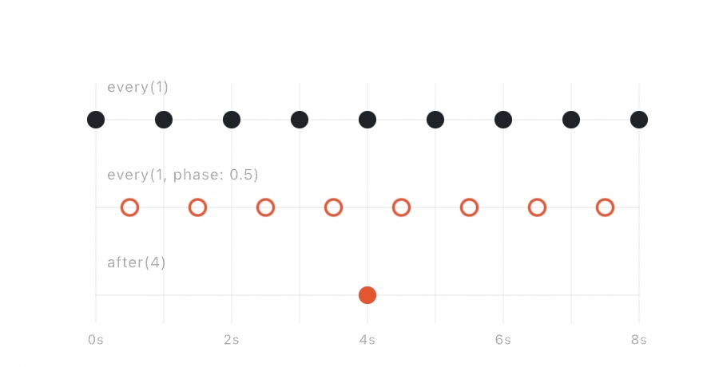
</picture>

`after(3)` fires once, ever. That is not the same as `if time > 3`, which is true on every frame from then on. For setting a flag, either works. For anything that appends, spends, or plays a sound, the difference is one dot or six hundred.

`everyFrames(10)` counts frames instead of seconds. Reach for it when the beat belongs to the work rather than to the wall clock. A simulation stepping every tenth frame keeps its rate whether the window runs fast or slow, where a beat in seconds does not.

Each one asks the clock a question and keeps nothing. That is what makes them safe to build on. A video export lands the beats on the same seconds the window did. A recording of a run ([Chapter 43](43-Performing.md)'s takes) replays them exactly. The one thing they cannot do is count. A frame long enough to cover two crossings still answers yes once, because a yes is a yes. [Animation](../Docs/Helpers/Animation.md#timers) has the three in full, and the [`Beats`](../Examples/Motion/Beats/Sketch.swift) example lays them out against a ruler.

### When somebody would rather it stopped: reduced motion

Motion is the default here, and for some people it is a problem. Movement can bring on nausea or a headache, which is why macOS carries a Reduce Motion setting. A sketch can ask for it:

```swift
let speed = prefersReducedMotion ? 0.1 : 1.0
```

Nothing changes on its own, and that is deliberate. Only you know which of your movements is the sketch and which is decoration. Slow a drift, hold something that was oscillating, drop a flash, and the work still reads. A headless export always reads `false`, so a file you render is the same file anywhere.

## Where this comes from

The named easing curves are Robert Penner's easing equations, published with the 2002 book *Programming Macromedia Flash MX*. They have since been absorbed into most animation systems. Ollin's are written from the formulas cataloged at [easings.net](https://easings.net). The craft behind them is older than software. The animator's principles of slow-in and slow-out grew out of the Disney studio of the 1930s. Frank Thomas and Ollie Johnston wrote them down in *Disney Animation: The Illusion of Life* (1981). Their point is that the spacing of the drawings is the motion. Smoothstep is a small classic of computer graphics shading languages, where it does per-pixel what this chapter does per-frame. That per-pixel world is taught in [The Book of Shaders](https://thebookofshaders.com) by Patricio Gonzalez Vivo and Jen Lowe. Its insistence on *drawing* shaping functions rather than defining them shaped this chapter. Describing a spring by duration and bounce instead of by stiffness and damping is the approach Apple introduced with SwiftUI's spring animations. It's easier to work with than stiffness and damping. The argument order of `map` and `lerp` is Processing's, which p5.js and openFrameworks kept, so a call you already know reads the same here. Full credits are in the project's [attribution notes](../ATTRIBUTION.md).

## Go deeper

- [Math helpers](../Docs/Helpers/Math.md): `map`, `lerp`, `dist`, the shaping scalars, and the constants.
- [Animation](../Docs/Helpers/Animation.md): the full easing catalog, `sway`, `@Eased`, `@Sprung`, `Timeline`, and the timers, plus `@Smoothed`, which [Chapter 38](38-ControlsAndSignals.md) teaches.
- [Sketch](../Docs/Core/Sketch.md#temporal-state): the clock properties in one table.
- [Accessibility](../Docs/Helpers/Accessibility.md): `prefersReducedMotion`, and the color half beside it.
- [Export](../Docs/Output/Export.md): stills, sequences, video, GIF sizing, and render quality.
- Appendix B draws this chapter's math, one picture per idea: [Angles and circles](B-JustEnoughMath.md#angles-and-circles), [Fractions, mapping, and wrapping](B-JustEnoughMath.md#fractions-mapping-and-wrapping), [Shaping a value](B-JustEnoughMath.md#shaping-a-value), [Vectors, motion, and forces](B-JustEnoughMath.md#vectors-motion-and-forces).
- The Melehi homage [`Waves`](../Examples/Recreations/MohamedMelehi/Waves/Sketch.swift): the phase is the clock. The wave is a sine of `t / wavelength - time / seconds`, so it travels one wavelength every `seconds` while the straight run holds still. `loopDuration` is that same number, which is what closes the export loop.
- Worked examples, all in [`Examples/Motion/`](../Examples/Motion/): `Easing` (four dots racing to a click), `EasingGallery` (all thirty curves), `Springs` (`@Sprung` against a moving target), `Timeline` (a scripted tour of a square, one easing per side), `Sway`, `Beats`, `SineSweep`, and `Orbits`.

---

[Contents](README.md#contents) · Previous: [Chapter 2, Color that works](02-Color.md) · Next: [Chapter 4, Randomness](04-Randomness.md)
