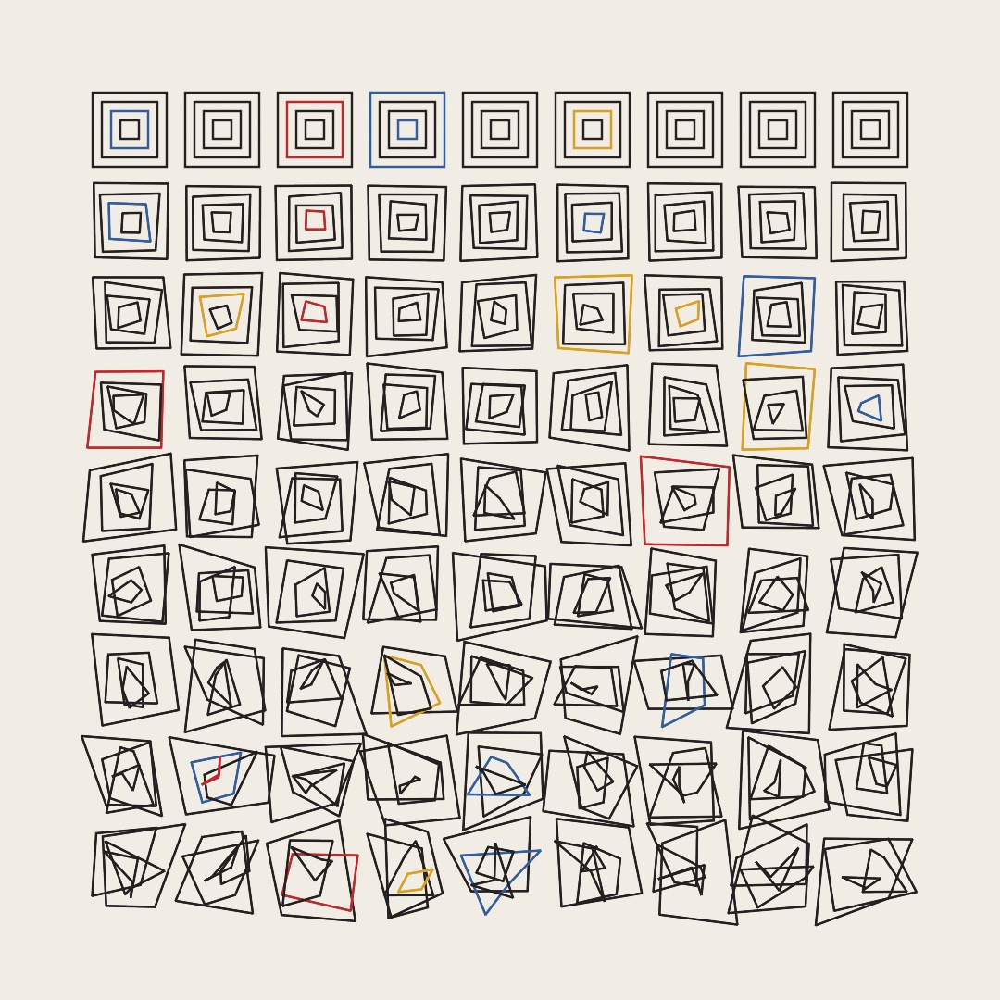
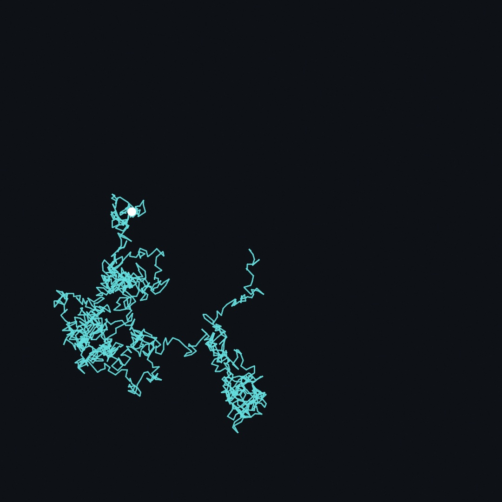

#### <sup>[Ollin](../README.md) → [Guide](README.md) → Chapter 4</sup>

---

# 4. Randomness



Randomness is the "generative" in generative art: you stop placing every mark yourself and start writing the rules that place them. Adding chance takes one call; the craft is in *controlling* it, deciding what may vary and by how much, and getting the exact same "accident" back tomorrow. Chapter 2 borrowed all of this on credit for its poster. This chapter pays the debt in full, and it ends in the piece above: a grid that begins in perfect order and comes apart, one row at a time.

## Rolling dice

`random` is the dice, and it comes in three grips:

```swift
random()          // 0 up to 1
random(8)         // 0 up to 8
random(-20, 20)   // anywhere between the two
```

Each call hands back a fresh, unpredictable number in the range (up to but never touching the top). That's all the machinery you need for a while. Roll positions and sizes and you have the oldest generative move there is, the scatter. Make `MySketches/Scatter.swift`:

```swift
import Ollin

final class Scatter: Sketch {
    override func draw() {
        background(Color(hex: 0x0E1116))
        noStroke()
        fill(Color(hex: 0xFFB703, alpha: 0.85))
        for _ in 0..<80 {
            drawCircle(random(width), random(height), random(3, 14))
        }
    }
}
```

Run it and you'll notice immediately that the canvas *boils*. Nothing is wrong. `draw()` runs sixty times a second, every frame rolls eighty fresh positions, and you're watching all of them. Sometimes that shimmer is exactly the texture a piece wants (the repository's [`Gaussian` example](../Examples/Randomness/Gaussian/Sketch.swift) leans into it). But most of the time you want chance to make its choices *once* and then hold the pose. For that, you need to know a small secret about where these numbers come from.

> **Swift note.** `for _ in 0..<80` is Chapter 1's counting loop with the counter thrown away: the underscore says "I don't need `i`, just do this eighty times."

## Seeds: randomness you can keep

The secret: there are no dice. A computer's `random` is a *pseudo-random* generator, a completely deterministic scramble that walks a fixed sequence of numbers so thoroughly shuffled they pass for chance. Where the walk starts is called the **seed**. Ordinarily the seed is grabbed from entropy at launch, so every run differs. But set it yourself, and the "randomness" replays exactly:

```swift
randomSeed(5)   // the same rolls, in the same order, every time
```

Add that line at the top of `Scatter`'s `draw()` and the boiling stops dead. Every frame now reseeds, rolls the *same* eighty positions and sizes, and draws the same constellation. Change the 5 to a 6 and you get a different constellation, equally frozen. Each seed is a complete, repeatable world:


This is the working rhythm of generative art, so it's worth spelling out. The code is the piece's grammar; a seed picks one of the things it can say. You write the rules, then audition seeds like contact prints (the sheet above is literally that), and you keep the ones with good bones. Reproducibility is what makes the whole thing art direction instead of a slot machine: a keeper is never lost, because code plus seed *is* the piece. Render it twice and the files match pixel for pixel.

One relative to know: `seed(5)` (without the `random` prefix) seeds `random` *and* its smooth cousin `noise` in one go. Noise is Chapter 5's whole subject; until then the two calls do the same job.

## Letting chance decide

So far chance has answered "where" and "how big": questions of amount. It can also answer yes-or-no and which-one, and those two turn randomness from decoration into composition:


The **gate** is an `if` with a threshold. `random()` lands uniformly in 0 to 1, so the fraction below your threshold is the probability of passing:

```swift
if random() < 0.25 {   // about a quarter of the time
    drawCircle(x, y, 9)
}
```

Read the top strip in the figure and count: about a quarter of the slots made it through, but in clumps and droughts, not neatly spaced. That lumpiness is what real chance looks like (dice have no memory of the last roll), and it's half of why generative pieces read as alive rather than patterned.

The **pick** chooses from a list, and it's one call:

```swift
let palette: [Color] = [.indigo, .teal, .gold, .coral]   // any four you like
fill(randomChoice(palette))
```

And when equal odds are too equal, hand the pick **weights**, one per choice, in any scale you like:

```swift
let trio = [Color.indigo, .coral, .gold]
fill(randomChoice(trio, weights: [6, 3, 1]))   // the figure's last strip
```

Six-three-one: the first color wins six times as often as the last, and a weight of zero would never win at all. Under the hood this is the gate again, one roll checked against thresholds stacked in proportion to the weights. Most compositions want a dominant, a support, and a spice, and three weights buy you that. (The same seeded dice also deal a whole deck: `shuffled(palette)` is the full list in a random order.)

## The two shapes of chance

Everything so far spreads its rolls *uniformly*: any value in the range, equally likely, like rain on a flat field. Nature rarely distributes things that way. Heights, errors, leaf sizes, the places darts actually land: they pile up near a middle and thin out symmetrically. That's the **Gaussian** (or normal) distribution, the bell curve, and Ollin rolls it directly:


```swift
let x = randomGaussian(mean: width / 2, deviation: 120)
```

`mean` is the center of the pile; `deviation` is its spread, in the same units. Most rolls (about two thirds) land within one deviation of the mean, nearly all within three; there's no hard edge, just increasing rarity. When you want scatter that reads as *settled* rather than *sprayed*, this is the tool: dust motes around a lamp, spatter around a brush stroke. Uniform says "anywhere here"; Gaussian says "around here."

## A walk with no destination

One more idea completes the starter kit, and it's the one that points at the rest of this book. Every roll so far has been an amnesiac: each value stands alone, no roll remembers the last. Watch what happens when you give chance a memory, by letting each roll *nudge* a value instead of replacing it:


The top strip re-rolls `y` from scratch at every step: hash, no history. The bottom strip keeps `y` and adds a small `random(-9, 9)` to it each step, and suddenly there's a *path*: it wanders, it has moods, it goes somewhere (nowhere in particular). This is the **random walk**, the humble ancestor of most organic motion in generative art. Give the same treatment to a point in two dimensions and it traces a journey. Make `MySketches/WalkGrows.swift`:

```swift
import Ollin

final class WalkGrows: Sketch {
    override func draw() {
        background(Color(hex: 0x0E1116))
        randomSeed(7)
        stroke(Color(hex: 0x64DFDF, alpha: 0.8))
        strokeWeight(2.5)

        var x = width / 2
        var y = height / 2
        let steps = min(2400, Int(time * 240))   // 240 new steps a second
        for _ in 0..<steps {
            let nx = x + random(-16, 16)
            let ny = y + random(-16, 16)
            drawLine(x, y, nx, ny)
            x = nx
            y = ny
        }

        noStroke()
        fill(.white)
        drawCircle(x, y, 9)
    }
}
```



Run it and the walk *grows* in front of you, ten seconds from first step to rest. The trick is a compact reprise of the whole chapter: the walk is seeded, so every frame redraws the *identical* path from the start; the only thing time controls is how many steps of it you get to see. Chance decides the shape once; the clock just pulls back the curtain. Notice the anatomy of the path, tight tangles connected by sudden corridors: statisticians call it the drunkard's walk, and the tangles are the lamp posts.

> **Swift note.** Wrapping a number in `Int(...)` drops its fraction, so `Int(time * 240)` counts up in whole steps, 240 of them a second. `min(a, b)` hands back the smaller of its two values, which is what stops the count at 2,400.

The walk's little `x = nx` heartbeat, a value carried forward and nudged, is where Part II begins: velocity, springs, and flocks all carry a value forward and nudge it. And the walk's one aesthetic flaw, that jittery stagger, is precisely the itch Chapter 5 scratches: noise is a random walk that learned to glide.

## The payoff: order, with a pinch of disorder

Time for the piece at the top of the chapter, and this one holds still on purpose: its motion lives *between* variations, one click apart. The idea is stolen honestly from the founding generation of computer artists, Vera Molnár above all, who worked in exactly this register: take an unimpeachably ordered structure, a grid of nested squares, and administer disorder in controlled doses. Here, each square's corners get a random nudge, and the permitted nudge grows from nothing in the top row to full strength at the bottom, so a single image walks from architecture to scribble. Make `MySketches/DisorderGrid.swift`:

```swift
import Ollin

final class DisorderGrid: Sketch {
    @Param("Disorder", 0...1) var disorder = 0.6
    @Param("Seed", 1...9999) var gridSeed = 7

    let ink = Color(hex: 0x232020)
    let accents: [Color] = [
        Color(hex: 0xC1272D), Color(hex: 0x2E5FA3), Color(hex: 0xD9A21B),
    ]

    override func draw() {
        randomSeed(gridSeed)
        background(Color(hex: 0xF2EDE4))
        noFill()
        strokeWeight(2.5)

        let columns = 9, rows = 9, layers = 4
        let margin = 90.0
        let cell = (width - margin * 2) / Double(columns)
        for r in 0..<rows {
            let unrest = Double(r) / Double(rows - 1) * disorder
            let d = unrest * cell * 0.35
            for c in 0..<columns {
                let left = margin + Double(c) * cell
                let top = margin + Double(r) * cell
                for k in 0..<layers {
                    let inset = cell * 0.1 * Double(k + 1)
                    let x1 = left + inset + random(-1, 1) * d
                    let y1 = top + inset + random(-1, 1) * d
                    let x2 = left + cell - inset + random(-1, 1) * d
                    let y2 = top + inset + random(-1, 1) * d
                    let x3 = left + cell - inset + random(-1, 1) * d
                    let y3 = top + cell - inset + random(-1, 1) * d
                    let x4 = left + inset + random(-1, 1) * d
                    let y4 = top + cell - inset + random(-1, 1) * d
                    stroke(ink)
                    if random() < 0.08 {
                        stroke(randomChoice(accents))
                    }
                    drawLine(x1, y1, x2, y2)
                    drawLine(x2, y2, x3, y3)
                    drawLine(x3, y3, x4, y4)
                    drawLine(x4, y4, x1, y1)
                }
            }
        }
    }

    override func mousePressed() {
        gridSeed += 1
    }
}
```

Run it with `swift run OllinLive MySketches/DisorderGrid.swift` and take it apart:

- `randomSeed(gridSeed)` opens the frame, so the whole drawing is one seed's story, held perfectly still. The `Seed` knob picks which story: click the canvas to step to the next variation, or click the knob's value box and type a favorite. `Seed` starts at a whole number (`7`, not `7.0`), so it's a whole-number knob, the same move as Chapter 3's `Waves`.
- `unrest` is the composition. Row 0 computes it as zero (no nudge allowed, perfect nesting), the bottom row gets the full `Disorder` knob, and every row between gets its share. One line decides the piece's entire top-to-bottom narrative.
- Each quadrilateral is four corners sitting on the posts of a perfect square, `inset` deep into its cell, and every corner coordinate rolls its own `random(-1, 1)` nudge, scaled by the row's reach `d`: eight rolls per shape, so squares don't just shift, they *deform*. Four `drawLine` calls close the loop.
- The accent is a gate and a pick working together, straight from this chapter: eight percent of quads trade ink for `randomChoice(accents)`.
- Turn `Disorder` to zero and the grid snaps to perfect order: the piece contains its own before picture. Because the *pattern* of rolls never changes with the knob (only their reach), the same tangles grow back in the same places as you turn it up again.

When a seed earns it, export the still:

```sh
swift run OllinLive MySketches/DisorderGrid.swift --export disorder.png
```

Then push it somewhere new:

- Let the disorder grow left to right instead: build `unrest` from `c` and `columns`.
- Give the inner squares more license than the outer ones: scale `d` by `Double(k + 1) / 4`.
- Re-animate it: `let d = unrest * cell * 0.35 * (sin(time * .tau / 8) * 0.5 + 0.5)` breathes the piece between order and chaos every eight seconds, and Chapter 3's loop rule means a `--export-gif` of it loops seamlessly.
- Retune the dose: accents at `0.02` read as errors, at `0.3` as confetti. Both are moods.

## Where this comes from

The grammar of this chapter is the founding grammar of computer art. Vera Molnár, who began making combinatorial drawings by hand in 1959 with what she called her *machine imaginaire* (dice standing in for the computer she didn't yet have), spent six decades administering precise doses of chance to grids of squares; her phrase "1% of disorder" is the payoff piece's entire recipe, and this book's repository carries two homages to her plotter work in [`Examples/Recreations/VeraMolnar`](../Examples/Recreations/VeraMolnar/). Georg Nees's *Schotter* (1968), a column of squares tumbling from order into rubble, set the order-above, chaos-below composition this chapter's payoff borrows. The "pseudo" in pseudo-random goes back to John von Neumann's 1940s number generators; Ollin's is SplitMix64 (Guy L. Steele Jr., Doug Lea, and Christine H. Flood, 2014). `randomGaussian` uses George Marsaglia's polar method (1964), and the random walk got its enduring nickname from Karl Pearson's 1905 letter to *Nature* asking where a drunk man ends up. Full credits are in the project's [attribution notes](../ATTRIBUTION.md).

## Go deeper

- [Random](../Docs/Generators/Random.md): the full reference, including `randomVector` (a roll inside a rectangle), `ring` (a roll inside a ring, great for halos), and the seeded `shuffled`.
- [Noise](../Docs/Generators/Noise.md): the next chapter's subject, if you can't wait to make chance glide.
- Worked examples, all in [`Examples/Randomness/`](../Examples/Randomness/): `Gaussian` (the bell curve as boiling scatter), `RandomBand` (uniform, for contrast), and `Ring` (the annulus roll).
- The Molnár homages in [`Examples/Recreations/VeraMolnar/`](../Examples/Recreations/VeraMolnar/): `DesOrdres` (seeded disorder scrubbed by the mouse) and `Interruptions` (a field of tilted ticks, its gaps carved by the noise you'll meet in Chapter 5).

---

[Contents](README.md#contents) · Previous: [Chapter 3, Motion and time](03-MotionAndTime.md) · Next: Chapter 5, Noise
