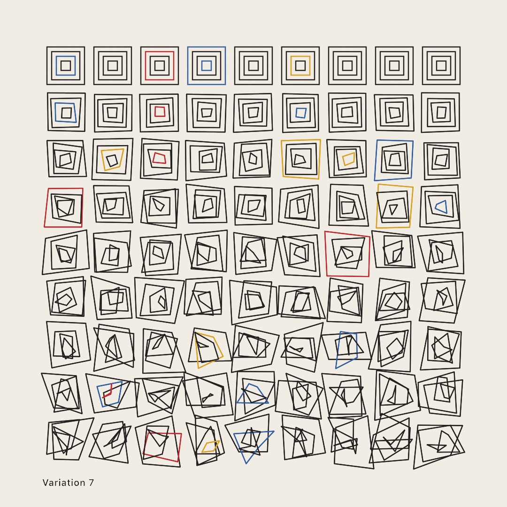
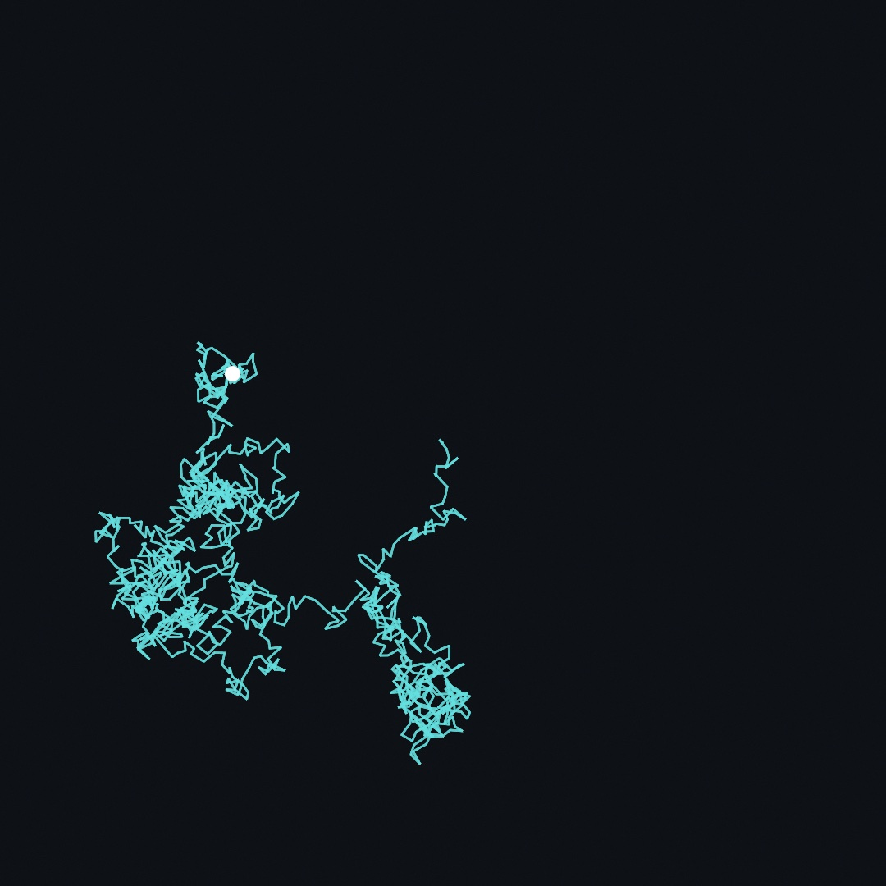
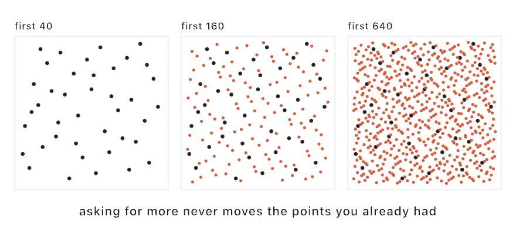
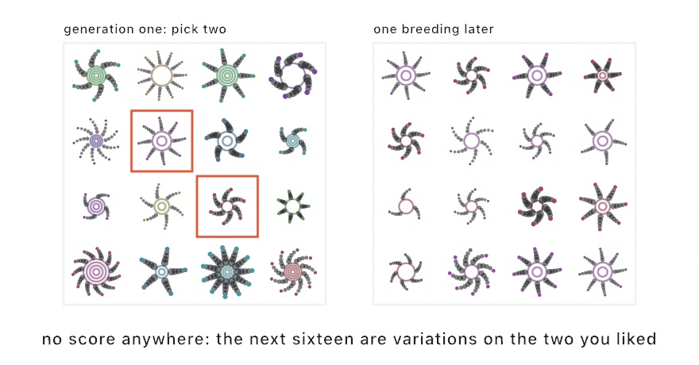

#### <sup>[Ollin](../README.md) → [Guide](README.md) → Chapter 4</sup>

---

# 4. Randomness



Randomness is the "generative" in generative art, and the craft is in controlling it. You decide what may vary and by how much, and a seed brings the same accident back tomorrow. In the grid above, perfect order at the top comes apart one row at a time. After it come chance with a memory, chance spread evenly, and variations you breed by eye.

## Rolling dice

`random` is the dice, and it comes in three forms:

```swift
random()          // 0 up to 1
random(8)         // 0 up to 8
random(-20, 20)   // anywhere between the two
```

Each call hands back a fresh, unpredictable number in the range (up to but never touching the top). That is all the machinery you need for a while. Roll positions and sizes and you have the oldest generative move, the scatter. Make `MySketches/Scatter.swift`:

```swift
import Ollin

final class Scatter: Sketch {
    override func draw() {
        background(Color(hex: 0x0E1116))
        noStroke()
        fill(Color(hex: 0xFFB703, alpha: 0.85))
        for _ in 0..<80 {
            drawCircle(random(width), random(height), random(3, 14))
        }
    }
}
```

Run it and the canvas boils, which is what the code asks for. Your `draw()` runs at the display's rate, sixty or more times a second. Every frame rolls eighty fresh positions, and you are watching all of them. Sometimes that shimmer is the texture a sketch wants, and the repository's [`Gaussian` example](../Examples/Randomness/Gaussian/Sketch.swift) uses it on purpose. Most of the time you want chance to make its choices once and keep them. For that, you need to know where these numbers come from.

> **Swift note.** `for _ in 0..<80` is [Chapter 1](01-HelloOllin.md)'s counting loop with the counter thrown away. The underscore says "I don't need `i`, just do this eighty times."

## Seeds: randomness you can keep

The dice are a figure of speech. A computer's `random` is a *pseudo-random* generator, a deterministic scramble that walks a fixed sequence of numbers shuffled so well they pass for chance. Where the walk starts is called the **seed**. Ordinarily the seed is rolled at launch from the system's own randomness, so every run differs. Set it yourself, and the "randomness" replays:

```swift
randomSeed(5)   // the same rolls, in the same order, every time
```

Add that line at the top of `Scatter`'s `draw()` and the boiling stops. Every frame now reseeds, rolls the *same* eighty positions and sizes, and draws the same constellation. Change the 5 to a 6 and you get a different constellation, equally frozen. Each seed is a complete, repeatable world:

<picture>
  <source media="(prefers-color-scheme: dark)" srcset="Images/04-Randomness/SeedSheet-dark.jpg">
  
</picture>

This is the working rhythm of generative art. The code decides everything the sketch *could* be, and a seed picks one of them. You write the rules, then flip through seeds the way a photographer reads a contact sheet, and keep the ones you like. The figure above is one such sheet. Reproducibility is what makes this art direction. A keeper is never lost, because the code plus the seed is the sketch. Render it twice and the files match pixel for pixel.

One relative comes with it. `seed(5)`, without the `random` prefix, seeds `random` *and* its smooth cousin `noise` in one go. It also records the number as the run's variation, which [Finding a seed to keep](#finding-a-seed-to-keep) uses. Noise is [Chapter 5](05-Noise.md)'s whole subject.

One thing can break all of this quietly. Swift brings randomness of its own, and it is not yours. Calls such as `colors.randomElement()` and `points.shuffled()` roll the system's dice. So a seeded sketch that calls either stops reproducing, while every line of it still looks right. Hand those calls your generator instead, and they follow your seed:

```swift
let pick = colors.randomElement(using: &randomness)
let order = points.shuffled(using: &randomness)
let roll = Int.random(in: 1 ... 6, using: &randomness)
```

The property `randomness` is the sketch's own generator, the same stream `random()` draws from. The `using:` label is how the standard library asks which dice to roll. The `&` in front hands the call the generator itself to advance, rather than a copy of it. Anything that takes it lands on your seed.

## Letting chance decide

So far chance has answered "where" and "how big", which are both questions of amount. It can also answer yes-or-no and which-one, and those two turn randomness from decoration into composition:

<picture>
  <source media="(prefers-color-scheme: dark)" srcset="Images/04-Randomness/Choices-dark.jpg">
  
</picture>

The **gate** is an `if` with a threshold. `random()` lands uniformly in 0 to 1, so the fraction below your threshold is the probability of passing:

```swift
if random() < 0.25 {   // about a quarter of the time
    drawCircle(x, y, 9)
}
```

Read the top strip in the figure and count. About a quarter of the slots made it through, but they arrive in clumps and gaps rather than neatly spaced. That lumpiness is what chance looks like, because dice have no memory of the last roll. It is part of why a generative sketch reads as alive rather than patterned.

The **pick** chooses from a list, and it is one call:

```swift
let palette: [Color] = [.indigo, .teal, .gold, .coral]   // any four you like
fill(randomChoice(palette))
```

When equal odds are too equal, hand the pick **weights**, one per choice, in any scale you like:

```swift
let trio = [Color.indigo, .coral, .gold]
fill(randomChoice(trio, weights: [6, 3, 1]))   // the figure's last strip
```

With weights of six, three, and one, the first color wins six times as often as the last. A weight of zero would never win at all. Under the hood this is the gate again, one roll checked against thresholds stacked in proportion to the weights. Most compositions want a dominant, a support, and a spice, and three weights give you that. A related call, `shuffled(palette)`, hands back the whole list in a seeded random order.

## Two shapes of chance: uniform and Gaussian

Everything so far spreads its rolls *uniformly*, meaning every value in the range is equally likely, like rain on a flat field. Nature rarely distributes things that way. Heights, errors, leaf sizes, and the places darts land all pile up near a middle and thin out symmetrically. That is the **Gaussian** (or normal) distribution, the bell curve, and Ollin rolls it directly:

<picture>
  <source media="(prefers-color-scheme: dark)" srcset="Images/04-Randomness/UniformVsGaussian-dark.jpg">
  
</picture>

```swift
let x = randomGaussian(mean: width / 2, deviation: 120)
```

`mean` is the center of the pile, and `deviation` is its spread, in the same units. About two thirds of the rolls land within one deviation of the mean, and nearly all within three. So there is no hard edge, only increasing rarity. Reach for this whenever you want scatter that reads as *settled* rather than *sprayed*. Think of dust motes around a lamp, or spatter around a brush stroke. Uniform says "anywhere here"; Gaussian says "around here."

## Finding a seed to keep

Editing the seed and rebuilding to see the next constellation is slow, and every sketch so far had to be told its seed. Ollin does both jobs for you. Every sketch is born on a seed, called its `variation`, rolled fresh at launch and applied to `random` before `setup()` runs. So a run is already repeatable, and all you need is its number. `variation` is readable, and `drawCaption` prints a line of text along the bottom edge of the canvas:

```swift
drawCaption("Variation \(variation)")
```

> **Swift note.** `\(variation)` inside a string is *interpolation*. Swift replaces it with the value's text, so the caption reads `Variation 48213`.

Add that line to `Scatter` and take the `randomSeed` line out. The number shows, and the canvas boils again, because `draw()` still rolls eighty fresh positions a frame. The seed decided the first eighty, and every frame after keeps walking the same sequence. The fix is a habit most sketches in this guide use. Roll in `setup()`, which runs once, keep what the rolls decided, and let `draw()` draw it. Make `MySketches/SeedScatter.swift`:

```swift
import Ollin

final class SeedScatter: Sketch {
    var centers: [Vector2] = []
    var sizes: [Double] = []

    override func setup() {
        roll()
    }

    func roll() {
        centers = []
        sizes = []
        for _ in 0..<80 {
            centers.append(Vector2(random(width), random(height)))
            sizes.append(random(3, 14))
        }
    }

    override func draw() {
        background(Color(hex: 0x0E1116))
        noStroke()
        fill(Color(hex: 0xFFB703, alpha: 0.85))
        for i in 0..<80 {
            drawCircle(center: centers[i], radius: sizes[i])
        }
        drawCaption("Variation \(variation)")
    }

    override func keyPressed() {
        if keyCode == .rightArrow {
            seed(variation + 1)
            roll()
        }
    }
}
```

> **Swift note.** `var centers: [Vector2] = []` declares a property holding a list of points, empty to start. `append` adds one to the end, and `centers[i]` reads the one at position `i`, counting from 0. `func roll()` declares a function of your own on the sketch, called by name. `keyPressed()` is the keyboard's twin of [Chapter 1](01-HelloOllin.md)'s `mousePressed()`, and `keyCode` names the key that fired.

The constellation holds still, with its number under it, and no seed number is written anywhere. `roll()` is a function of your own that does the rolling. `setup()` calls it once, and the right arrow calls it again after `seed(variation + 1)` moves the sketch to the next variation. So one key steps through constellations one seed at a time, and the number under each tells you which one you are looking at.

The inspector does the same stepping without code. Its Variation card (press ⌘/ if you launched the sketch on its own) shows the number. Beside it are arrows to the neighboring seeds, a die that rolls a random one, and a field to type one in. Each move runs `setup()` again on the new seed while your parameters stay where you set them.

To see many at once, ask for a contact sheet. It renders one frame per seed and tiles them into one labeled image, like the nine-tile sheet in [Seeds](#seeds-randomness-you-can-keep):

```sh
swift run OllinLive MySketches/SeedScatter.swift --export-grid sheet.png --seeds 25
```

When one of them is a keeper, render it alone at full size. `--seed` puts the sketch on that variation before `setup()` runs, on every kind of export:

```sh
swift run OllinLive MySketches/SeedScatter.swift --export keeper.png --seed 10
```

Or write it into the sketch. `seed(10)` at the top of `setup()` pins the sketch to variation 10 on every run, whatever the card says. That is the line to add once you have found the one you want, and to take out when you want to explore again.

One rule makes the seed a tool. A seed is only useful to flip through when it decides something structural: which palette, how dense, how large. Make those choices in `setup()`, where the seeded rolls happen once, and let `draw()` animate what `setup()` decided. Roll in `draw()` instead and every seed gives you the same picture, shaken slightly differently.

## Putting it together: order, with a pinch of disorder

This is the sketch from the top of the chapter. It holds still on purpose, because its motion lives *between* variations, one key press apart. The idea is borrowed openly from the founding generation of computer artists, Vera Molnár above all, who worked this way. You take a perfectly ordered structure, a grid of nested squares, and add disorder in small, controlled amounts. Here each square's corners get a random nudge. The permitted nudge grows from nothing in the top row to full strength at the bottom, so a single image walks from architecture to scribble. Make `MySketches/DisorderGrid.swift`:

```swift
import Ollin

final class DisorderGrid: Sketch {
    @Param("Disorder", 0...1) var disorder = 0.6

    let columns = 9, rows = 9, layers = 4
    let ink = Color(hex: 0x232020)
    let accents: [Color] = [
        Color(hex: 0xC1272D), Color(hex: 0x2E5FA3), Color(hex: 0xD9A21B),
    ]
    var nudges: [Double] = []   // eight per quadrilateral, rolled once
    var inks: [Color] = []      // one per quadrilateral

    override func setup() {
        seed(7)   // the variation on this page; delete the line to roll a fresh one
        roll()
    }

    func roll() {
        nudges = []
        inks = []
        for _ in 0..<(rows * columns * layers) {
            for _ in 0..<8 {
                nudges.append(random(-1, 1))
            }
            if random() < 0.08 {
                inks.append(randomChoice(accents))
            } else {
                inks.append(ink)
            }
        }
    }

    override func draw() {
        background(Color(hex: 0xF2EDE4))
        noFill()
        strokeWeight(2.5)

        let margin = 90.0
        let cell = (width - margin * 2) / Double(columns)
        var quad = 0
        for r in 0..<rows {
            let unrest = Double(r) / Double(rows - 1) * disorder
            let d = unrest * cell * 0.35
            for c in 0..<columns {
                let left = margin + Double(c) * cell
                let top = margin + Double(r) * cell
                for k in 0..<layers {
                    let inset = cell * 0.1 * Double(k + 1)
                    let n = quad * 8
                    let x1 = left + inset + nudges[n] * d
                    let y1 = top + inset + nudges[n + 1] * d
                    let x2 = left + cell - inset + nudges[n + 2] * d
                    let y2 = top + inset + nudges[n + 3] * d
                    let x3 = left + cell - inset + nudges[n + 4] * d
                    let y3 = top + cell - inset + nudges[n + 5] * d
                    let x4 = left + inset + nudges[n + 6] * d
                    let y4 = top + cell - inset + nudges[n + 7] * d
                    stroke(inks[quad])
                    drawLine(x1, y1, x2, y2)
                    drawLine(x2, y2, x3, y3)
                    drawLine(x3, y3, x4, y4)
                    drawLine(x4, y4, x1, y1)
                    quad += 1
                }
            }
        }
        drawText("Variation \(variation)", margin, height - margin / 2,
                 size: 20, color: ink)
    }

    override func keyPressed() {
        if keyCode == .rightArrow {
            seed(variation + 1)
            roll()
        }
        if keyCode == .leftArrow {
            seed(variation - 1)
            roll()
        }
    }
}
```

> **Swift note.** `let columns = 9, rows = 9, layers = 4` declares three constants on one line, the same as three `let` lines.

Run it with `swift run OllinLive MySketches/DisorderGrid.swift` and take it apart:

- `setup()` pins variation 7 and calls `roll()`, so the whole drawing is one seed's variation, held still. Every nudge is rolled once there, into `nudges`, and every quadrilateral's ink into `inks`. Nothing in `draw()` rolls.
- `unrest` is the composition. Row 0 computes it as zero, so no nudge is allowed and the squares nest perfectly. The bottom row gets the full `Disorder` parameter, and every row between gets its share. One line decides the sketch's top-to-bottom structure.
- Each quadrilateral is four corners sitting on the posts of a perfect square, `inset` deep into its cell. Each corner coordinate adds its own stored nudge, a number between -1 and 1, scaled by the row's reach `d`. That is eight rolls per shape, so the squares deform rather than shift. Four `drawLine` calls close the loop, and `quad` counts which shape is being drawn, so the right eight nudges are read.
- The accent is a gate and a pick working together, from [Letting chance decide](#letting-chance-decide). Eight percent of quadrilaterals trade ink for `randomChoice(accents)`, decided in `roll()`.
- `drawText` writes the variation into the bottom margin. It draws a line of text with its left end at the x and its baseline at the y. It uses the size and color you give it. [Chapter 8](08-Words.md) is about text, and this is all of it you need here.
- The arrow keys change the variation. Right steps to the next one and left to the one before. Each key calls `roll()` again, so the grid redraws with new nudges and the label follows.
- Turn `Disorder` to zero and the grid snaps to perfect order, so the sketch contains its own before picture. The nudges never change with the parameter, only their reach does. So the same tangles grow back in the same places as you turn it up again.

When a variation is a keeper, write its number into the `seed(7)` line and export the still:

```sh
swift run OllinLive MySketches/DisorderGrid.swift --export disorder.png
```

Delete that line instead and the sketch rolls a fresh variation on every run. Then the inspector's card and `--export-grid` flip through them too, and `--seed` brings any of them back.

Then push it somewhere new:

- Let the disorder grow left to right instead. Move the `unrest` and `d` lines into the column loop and build `unrest` from `c` and `columns`.
- Give the inner squares more freedom than the outer ones, by scaling `d` with `Double(k + 1) / 4`.
- Change the shape of the nudges. Rolling them with `randomGaussian(mean: 0, deviation: 0.5)` in `roll()` keeps most corners near their posts and lets a few wander far. This gives the settled scatter from [Two shapes of chance](#two-shapes-of-chance-uniform-and-gaussian).
- Put the motion back. Replace the `d` line with `let d = unrest * cell * 0.35 * (sin(time * .tau / 8) * 0.5 + 0.5)`. The grid then moves from order to chaos and back every eight seconds. By [Chapter 3](03-MotionAndTime.md)'s loop rule, a `--export-gif` of it with `--seconds 8` loops seamlessly.
- Retune the accents. At `0.02` they read as stray errors, and at `0.3` as confetti. Try both.

## Chance with a memory: random walks

Every roll in the finished sketch stands alone. A corner's nudge knows nothing about its neighbor's, and that independence is what keeps the grid legible. Give a roll a memory instead, by letting each one nudge a value rather than replace it, and chance starts to draw paths. The sketch has no use for that, but most organic motion in this guide grows from it. So here is the walk written by hand, and then the three the framework ships.

### The random walk, by hand

The figure shows the difference:

<picture>
  <source media="(prefers-color-scheme: dark)" srcset="Images/04-Randomness/WalkVsJumps-dark.jpg">
  
</picture>

The top strip re-rolls `y` from scratch at every step, so it stays a jagged hash. The bottom strip keeps `y` and adds a small `random(-9, 9)` to it each step. The result is a *path* that wanders, drifts, and doubles back. This is the **random walk**. Its name comes from Karl Pearson, who asked in a 1905 letter to *Nature* where a walker taking steps in random directions ends up. Give the same treatment to a point in two dimensions and it traces a journey.

To draw that journey you need `drawLine`, which [Chapter 1](01-HelloOllin.md) showed beside the circle and the rectangle. `drawLine(x1, y1, x2, y2)` draws a straight segment between two points. Joining each step of the walk to the next is all it takes. Make `MySketches/WalkGrows.swift`:

```swift
import Ollin

final class WalkGrows: Sketch {
    override func draw() {
        background(Color(hex: 0x0E1116))
        randomSeed(7)
        stroke(Color(hex: 0x64DFDF, alpha: 0.8))
        strokeWeight(2.5)

        var x = width / 2
        var y = height / 2
        let steps = min(2400, Int(time * 240))   // 240 new steps a second
        for _ in 0..<steps {
            let nx = x + random(-16, 16)
            let ny = y + random(-16, 16)
            drawLine(x, y, nx, ny)
            x = nx
            y = ny
        }

        noStroke()
        fill(.white)
        drawCircle(x, y, 9)
    }
}
```



Run it and the walk *grows* in front of you, ten seconds from first step to rest. This one listing ties seeds and time together. The walk is seeded, so every frame redraws the same path from the start. The only thing time controls is how many steps of it you get to see. Chance decides the shape once, and time reveals more of it. Notice the anatomy of the path, tight tangles connected by sudden corridors. Statisticians call this the drunkard's walk.

> **Swift note.** Wrapping a number in `Int(...)` drops its fraction, so `Int(time * 240)` counts up in whole steps, 240 of them a second. `min(a, b)` hands back the smaller of its two values, which is what stops the count at 2,400.

The walk's core move is a value carried forward and nudged (`x = nx`). It is where Part II begins, because velocity, springs, and flocks all carry a value forward and nudge it. The walk does have one visual flaw, the constant jitter, and [Chapter 5](05-Noise.md)'s noise wanders the same way without it.

### Three walks, three rules: `randomWalk`, `levyFlight`, and `selfAvoidingWalk`

Write that walk by hand once. After that Ollin has it ready, along with two relatives that each change one rule about what the next step may be.

<picture>
  <source media="(prefers-color-scheme: dark)" srcset="Images/04-Randomness/WalkFamily-dark.jpg">
  
</picture>

**`randomWalk`** is the one you just wrote, seeded and shipped. Notice what it does with five thousand steps in the first panel: it pools. A walk with equal-sized steps spreads outward only as fast as the square root of the number of steps. So it spends most of its time revisiting a small patch.

**`levyFlight`** changes the step size rule. Its steps are no longer all about the same length. Their lengths come from a distribution where small steps are overwhelmingly likely, but occasionally an enormous one comes up. The result is the second panel: tight clusters joined by long straight leaps. Biologists have used it as a model of animals searching for food they cannot see. Benoit Mandelbrot named it after the mathematician Paul Lévy, who studied these heavy-tailed distributions. One argument needs care. `minStep` must stay above zero, because the distribution runs to infinity at zero, so a zero minimum hands back only the starting point.

**`selfAvoidingWalk`** changes the memory rule. It moves on a grid and refuses to enter a cell it has already visited, so it cannot pool, and it fills its region instead. When every neighbor of a cell has been used, it backs out of the dead end and tries another way. The call hands back the longest path it found. Paul Flory proposed the walk in 1953 as a model of a polymer chain, which cannot pass through itself.

```swift
randomWalk(steps: 5000, stepLength: 3)
levyFlight(steps: 900, minStep: 1.5, maxStep: 90)
selfAvoidingWalk(cellSize: 22)
```

Each call hands back the walk's points as a list, ready to draw. All three draw from the seeded `random`, so the same seed gives the same journey. [Walks](../Docs/Generators/Walks.md) has every argument, and the [`Walk`](../Examples/Randomness/Walk/Sketch.swift) example is the hand-written walk with a click that starts a fresh one.

## Chance spread evenly: blue noise and low-discrepancy sequences

The finished sketch puts every square in its place and lets chance nudge it. The opposite job comes up as often: points placed by chance, but spread evenly. Plain `random` placement clumps and leaves bare patches, as the strip in [Letting chance decide](#letting-chance-decide) showed, because independent rolls have no memory of each other. Two techniques give an even scatter, and they differ in one way that decides which you want.

### Darts that keep their distance: `poissonDisk`

**Blue noise** is a scatter with no two points closer than a chosen distance and no visible grid. Use it when points stand in for things that would not crowd: trees in a wood, cells in a tissue, the dots of a stipple. The recipe is Robert Bridson's, from 2007, and it works like throwing darts. Throw a dart, then keep throwing darts *near existing ones*, keeping only throws that land at least `radius` from everybody placed so far. When a dart cannot find room after thirty tries, its neighborhood is full. The result is even but never gridded:

<picture>
  <source media="(prefers-color-scheme: dark)" srcset="Images/04-Randomness/ScatterCompare-dark.jpg">
  
</picture>

```swift
let scatter = poissonDisk(radius: 26)             // over the whole canvas
let some = poissonDisk(in: region, radius: 26)    // or a region
```

One number, `radius`, sets the density. Later chapters start from these points. [Chapter 13](13-GrowingThings.md)'s trees grow toward them, [Chapter 14](14-FieldsAndFlow.md)'s flow lines begin at them, and [Chapter 15](15-ShapesAsMaterial.md) builds its mosaic on them. [Blue noise](../Docs/Generators/BlueNoise.md) is the reference.

### Points that never move: `haltonPoints` and `sobolPoints`

A **low-discrepancy sequence** is the second kind of even, and it is not random at all. Each one is a fixed list of positions, computed from an index, so point number 57 is always in the same place. Use it when you keep adding points to something already on screen, because asking for more never moves the ones you already had. The two sequences are John Halton's, from 1960, and Ilya Sobol's, from 1967. Both were invented for numerical integration rather than for drawing.

```swift
let points = haltonPoints(count: 500)
let finer = sobolPoints(count: 5000, in: bounds)   // or any rectangle
```

<picture>
  <source media="(prefers-color-scheme: dark)" srcset="Images/04-Randomness/HaltonGrowth-dark.jpg">
  
</picture>

The figure shows what the fixed list gives you. Every new point lands in the largest gap left so far, and the points you had stay where they were. Blue noise cannot do that, because adding a dart to a Poisson-disk scatter means running the whole process again and getting a different arrangement. A sequence also never touches your sketch's `random`, being pure arithmetic on the index, so mixing it into a seeded sketch changes nothing else.

`halton(i, base:)` is the one-dimensional version, and it is useful well away from scatters. Space hues around a wheel, offset animation phases, or choose sample times. It suits anywhere you want values that spread out evenly, no matter how many you end up taking. [Low-discrepancy sampling](../Docs/Generators/LowDiscrepancy.md) covers the bases and `startIndex`.

## Breeding what you picked: interactive evolution

[Finding a seed to keep](#finding-a-seed-to-keep) picks one keeper out of many rolls. Your picks can also breed. Each round, the sketch draws a handful of variations, you choose the ones you like, and the next handful is made from those. The finished sketch has no need for it, because one seed is its whole recipe. A sketch with a dozen dials does, since no contact sheet can show every combination of them.

### Sixteen things and no opinion about them: `Population`

`Population` is a handful of genomes, each a bag of numbers between 0 and 1 that your sketch reads however it likes. It is for the search a score cannot do: a search where the only judge is a person looking. Breeding pictures by eye is Karl Sims's idea, from his 1991 paper *Artificial Evolution for Computer Graphics*. His *Genetic Images* installation let visitors breed pictures by standing in front of the ones they liked. You draw the genomes, somebody picks the ones they like, and those breed:

```swift
pool = population(count: 16, genes: 8)      // in setup()

// a genome, read as a drawing:
let arms  = g.value(0, in: 3 ... 11)
let hue   = g.value(1, in: 0.0 ... 1.0)
let rings = g.value(2, in: 1 ... 4)

// when someone has picked their favorites:
pool.breed(from: chosen)
```

<picture>
  <source media="(prefers-color-scheme: dark)" srcset="Images/04-Randomness/PickAndBreed-dark.jpg">
  
</picture>

Pick one genome and the next round is made of copies of it, each with a few numbers nudged at random. That nudge is called a **mutation**. Pick two or more and they are mated in pairs, each child taking its numbers from both parents. Nothing in a `Genome` knows what its numbers mean, which is what lets the framework mate and mutate one without knowing what is being evolved. Sixteen ornaments become sixteen slightly different ornaments, then sixteen variations on the two you liked. After a dozen rounds the grid is full of things nobody drew.

The mutation rate defaults far higher than the scored search of [Chapter 24](24-ParticleSimulations.md#letting-the-sketch-find-it-evolution) uses, and the reason is arithmetic about people. A search judged by eye gets maybe twenty candidates a generation, and maybe twenty generations before a person stops looking. So a few hundred looks have to cover ground a scored run covers in millions. For the same reason the genomes you picked are carried into the next generation untouched. The thing you just chose does not vanish the moment you choose it.

A scored search can only find what its score was written to want. A search judged by eye can arrive somewhere you did not know you were going, because you may change your mind between generations. The [`Simulation/Breeding`](../Examples/Simulation/Breeding/Sketch.swift) example is sixteen ornaments you breed this way, and [Breeding by hand](../Docs/Simulation/Evolution.md#population) is the reference.

## Where this comes from

The grammar of this chapter is the founding grammar of computer art. Vera Molnár began making combinatorial drawings by hand in 1959, with what she called her *machine imaginaire*. She followed rules as a machine would, with dice standing in for the computer she did not yet have. She spent six decades applying precise doses of chance to grids of squares. Her phrase "1% of disorder" is the finished sketch's entire recipe. This guide's repository carries two homages to her plotter work in [`Examples/Recreations/VeraMolnar`](../Examples/Recreations/VeraMolnar/). Georg Nees's *Schotter* (1968), a column of squares tumbling from order into rubble, set the order-above, chaos-below composition this chapter's finished sketch borrows. The "pseudo" in pseudo-random goes back to John von Neumann's number generators of the 1940s. Ollin's generator is SplitMix64 (Guy L. Steele Jr., Doug Lea, and Christine H. Flood, 2014), and `randomGaussian` uses George Marsaglia's polar method (1964). The family sections name their own sources as they go: Pearson, Lévy and Mandelbrot, Flory, Bridson, Halton, Sobol, and Sims. Full credits are in the project's [attribution notes](../ATTRIBUTION.md).

## Go deeper

- [Random](../Docs/Generators/Random.md): the full reference. It includes `randomVector(in:)` (a roll inside a rectangle), `randomVector(innerRadius:outerRadius:)` (a roll inside a ring, for halos), and the seeded `shuffled`.
- [Variations](../Docs/Core/Variations.md): `variation` and the seed-exploration tools in full, including contact sheets (`--export-grid`) and re-rendering a keeper (`--seed`).
- [Why a run repeats](../Docs/Concepts/Determinism.md): one screen on the seed and the export's fixed clock, and the habits that break a repeat.
- [Walks](../Docs/Generators/Walks.md): the hand-rolled walk from this chapter, shipped and seeded, plus two relatives that each change one rule. `levyFlight` mostly shuffles and occasionally leaps, and `selfAvoidingWalk` refuses to cross its own path.
- [Blue noise](../Docs/Generators/BlueNoise.md): `poissonDisk` in full, feeding its points to the tessellators, and calling it outside a sketch.
- [Low-discrepancy sampling](../Docs/Generators/LowDiscrepancy.md): Halton bases, Sobol, `startIndex`, and the scalar `halton`.
- [Breeding by hand](../Docs/Simulation/Evolution.md#population): `Population` and `Genome` in full, the mutation rate, keeping the picks, and why the pool never touches the sketch's `random`.
- [Noise](../Docs/Generators/Noise.md): the next chapter's subject, if you cannot wait to make chance glide.
- Appendix B draws this chapter's math, one picture per idea: [Randomness](B-JustEnoughMath.md#randomness).
- Worked examples, all in [`Examples/Randomness/`](../Examples/Randomness/): `Variations` (a whole composition per seed), `Gaussian` (the bell curve as boiling scatter), `RandomBand` (uniform, for contrast), `Ring` (the ring roll), and `Walk` (the seeded walk revealed over time).
- The Molnár homages in [`Examples/Recreations/VeraMolnar/`](../Examples/Recreations/VeraMolnar/): `DesOrdres` (seeded disorder scrubbed by the mouse) and `Interruptions` (a field of tilted ticks). The gaps in `Interruptions` come from the noise you meet in [Chapter 5](05-Noise.md).
- The LeWitt homage [`FiftyPoints`](../Examples/Recreations/SolLeWitt/FiftyPoints/Sketch.swift): an instruction from 1971 that asks for fifty points "at random" and "evenly distributed" at once. Plain chance cannot give both, so the drafter keeps the farthest of a handful of throws for each point.
- The Winiarski homages in [`Examples/Recreations/RyszardWiniarski/`](../Examples/Recreations/RyszardWiniarski/): `Obszar` is the program behind his areas. A coin or a die decides every square of a grid, starting from a drawn corner. Under the grid the sketch writes the rule and the count of black against what the distribution promised. `LosowanieDwiemaKostkami` lays black and white runs whose lengths are the sums of two dice, so the histogram of two dice is painted out as bars.
- The Sharif homages in [`Examples/Recreations/HassanSharif/`](../Examples/Recreations/HassanSharif/): `DotsLinesForms` picks a pair of numbered points for every column of a table. It draws what the rule makes of them three times over. The picks are written on a draft paper beside the sheet, which is how a picked number stays readable in the picture. `AngularLines` picks six of twenty-five crossings for every cell, without repeating, then picks one of the finished lines to paint large. In `OctoberLines`, chance draws one wavy cut down a table of numbers. The rule does everything after that: the digit sums, the repeats dropped, and the bands of lines. So the same seed is the same wall. In `BodyAndSquares`, chance picks five squares of a grid for a body's head, hands, and feet. Then the body has to find a way to lie on them. A pick the body cannot reach is struck out and picked again, which is chance with a physical check on it.
- The Bonačić homage [`DynamicObject`](../Examples/Recreations/VladimirBonacic/DynamicObject/Sketch.swift): the other answer to chance, from an artist who distrusted it. It is a square of lamps that looks like noise but is not. Each pattern is the one before multiplied by x in a finite field. So it can be read, set by hand, and predicted, yet it takes more than 270 years to repeat.
- The Bonačić homage [`Random63`](../Examples/Recreations/VladimirBonacic/Random63/Sketch.swift): his one work built on chance. Each of its sixty-three bulbs is switched by a random source of its own. The sketch hangs them beside the same bulbs driven by a field. On the field's panel every bulb blinks one sequence, a tick behind the next, and the left half lights up alone every sixty-three ticks. On the other panel, no two bulbs agree.
- The Sato homage [`TotemBuilder`](../Examples/Recreations/OsamuSato/TotemBuilder/Sketch.swift): a whole monster dealt in `setup()`. The deal is one form for each of the monster's pieces, plus the proportions of head, neck, and body. `draw()` only moves what was dealt, so the seed is the monster. Proof a day's monsters with `--export-grid`.

---

[Contents](README.md#contents) · Previous: [Chapter 3, Motion and time](03-MotionAndTime.md) · Next: [Chapter 5, Noise](05-Noise.md)
