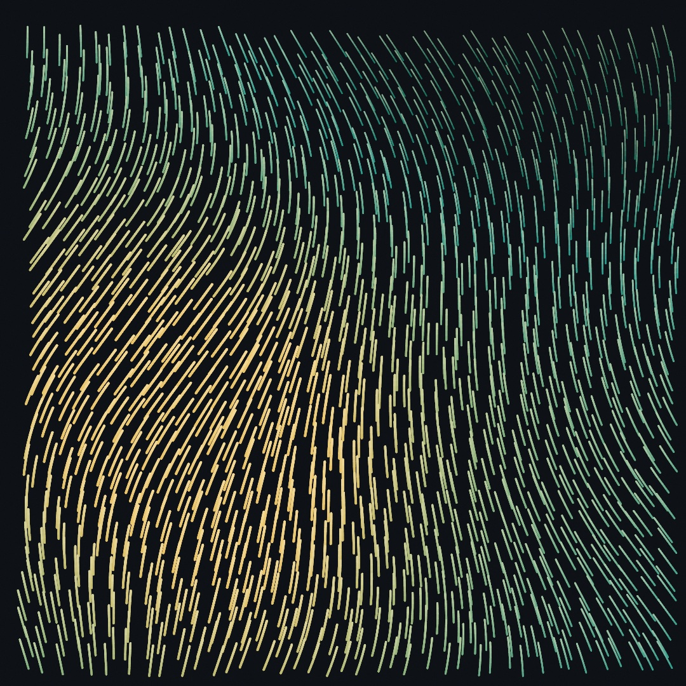
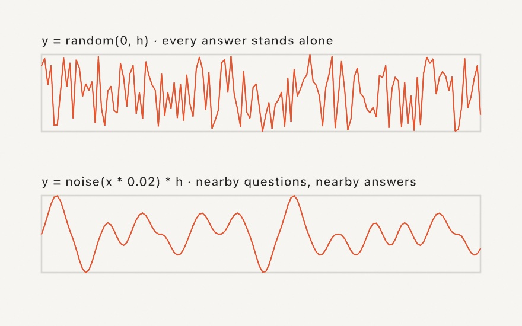
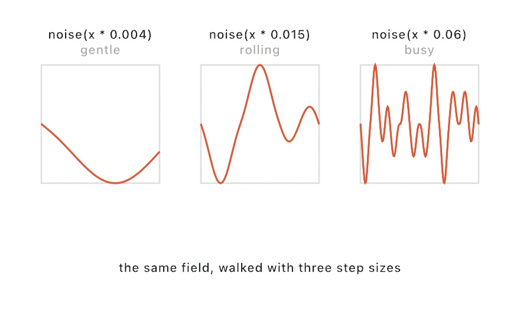
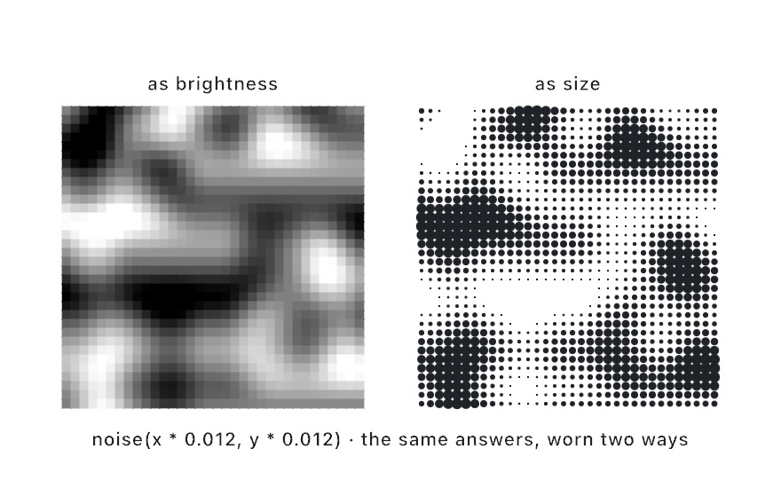
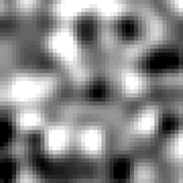
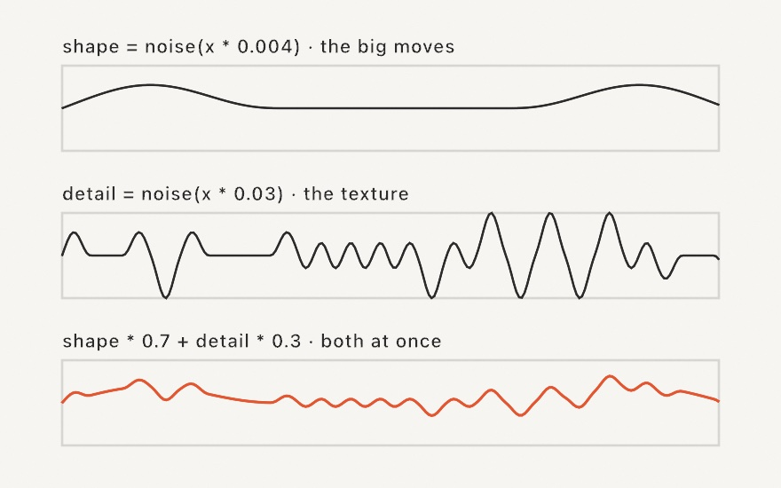
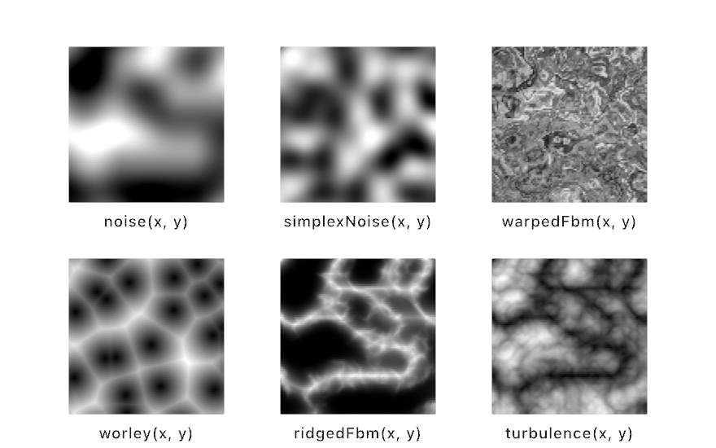
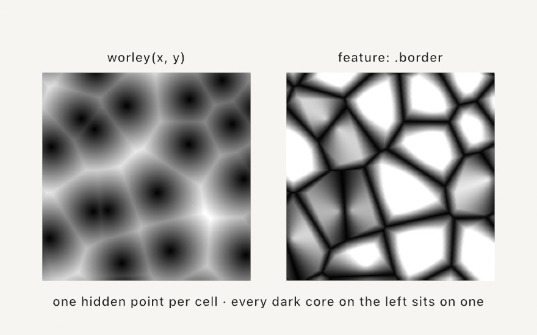

#### <sup>[Ollin](../README.md) → [Guide](README.md) → Chapter 5</sup>

---

# 5. Noise



[Chapter 4](04-Randomness.md) ended with a complaint. The random walk goes interesting places, but its path is all jitter. Every organic thing you might want to draw (grass, smoke, coastlines, a hand-drawn line) varies smoothly, and `random` only knows how to jump. This chapter is about `noise`, the function that fixes that. It ends in the piece above: a meadow of fifteen hundred blades, combed by a wind you never see, all of it grown from one function.

## Random that remembers

Here is the difference in one picture. Both strips march across the canvas asking for a height at every step. The top one asks `random`, and every answer stands alone. The bottom one asks `noise`, and something new happens: **nearby questions get nearby answers**.

<picture>
  <source media="(prefers-color-scheme: dark)" srcset="Images/05-Noise/RandomVsNoise-dark.jpg">
  
</picture>

That's the whole idea. `noise` takes a number in and hands back a value between 0 and 1, just like `random()`. But it isn't a roll, it's a *lookup*. Somewhere at launch a smooth invisible landscape got laid out, and `noise(x)` simply reports its height at position `x`. Ask at `2.00` and then at `2.01` and you get almost the same answer, because you asked almost the same place. Ask far apart and the answers are unrelated. Random forgets; noise remembers where it is.

Feel it move. Make `MySketches/Glide.swift`:

```swift
import Ollin

final class Glide: Sketch {
    override func draw() {
        background(Color(hex: 0x0E1116))
        noStroke()
        fill(Color(hex: 0x64DFDF))
        let y = noise(time * 0.4) * height
        drawCircle(width / 2, y, 44)
    }
}
```

The dot floats up and down like something breathing underwater. There's no rhythm you can predict, but there's also never a jolt. The input is `time * 0.4`, so the dot is *strolling along the landscape* at 0.4 units a second and reporting the terrain as it goes. Now swap `noise` for `random()` (drop the argument) and run it again. The dot teleports sixty times a second. Same range, same canvas, completely different feel. Put `noise` back.

One habit carries over from [Chapter 4](04-Randomness.md). The landscape itself is rolled from entropy at launch, so every run strolls different hills. `noiseSeed(6)` pins the landscape (and `seed(6)`, which you met in [Chapter 4](04-Randomness.md), pins `noise` and `random` together). Same seed, same hills, same piece.

## The zoom knob

That `* 0.4` deserves its own section, because it's the knob you will turn most. The input to `noise` is a position, so the multiplier decides **how far apart your questions land** on the landscape:

<picture>
  <source media="(prefers-color-scheme: dark)" srcset="Images/05-Noise/NoiseZoom-dark.jpg">
  
</picture>

Tiny steps stay on one hillside, so the result glides. Bigger steps cross whole hills between asks, so the result gets busy. Steps that are too big land on unrelated terrain every time, and noise stops looking smooth at all. If your noise ever looks like static, your multiplier is too big.

There's a rule of thumb hiding in the panels. When you feed noise *pixel* coordinates, which you're about to, multiply them by something small, usually between `0.001` and `0.02`. A 1080-pixel canvas times `0.006` spans about six of the landscape's hills: features big enough to read as shapes, small enough to be interesting. You'll tune this by eye forever, and it stops feeling mysterious the moment you think of it as zoom.

## Two dimensions: a field

Here's where noise pulls ahead of anything [Chapter 4](04-Randomness.md) could do. Give it *two* numbers, `noise(x, y)`, and the landscape becomes a smooth surface: an answer at every point of a plane. Ask at every cell of a grid and you can *see* it:

<picture>
  <source media="(prefers-color-scheme: dark)" srcset="Images/05-Noise/NoiseTerrain-dark.jpg">
  
</picture>

Make `MySketches/Clouds.swift`:

```swift
import Ollin

final class Clouds: Sketch {
    override func setup() {
        noiseSeed(6)
        noStroke()
    }

    override func draw() {
        let cells = 45
        let cell = width / Double(cells)
        for row in 0..<cells {
            for col in 0..<cells {
                let x = Double(col) * cell
                let y = Double(row) * cell
                let n = noise(x * 0.006, y * 0.006)
                fill(Color(white: n))
                drawRect(x, y, cell, cell)
            }
        }
    }
}
```

Clouds, in about twenty lines. Each cell asks the field at its own position (times the zoom knob) and paints the answer as a gray, since `Color(white:)` runs from 0, black, to 1, white. Neighboring cells ask neighboring places, so the shades drift instead of flickering, and cloudy continents appear. The right panel of the figure is the same field with its answers drawn as dot *sizes* instead, and the pointillist look is one changed line. This move, compute a value per position and let it drive any visual property you like, is most of what noise is *for*.

## The third dimension is time

The field is frozen, and the fix is literal. Ask for one more dimension. `noise(x, y, z)` is a smooth *volume* of answers, and if you slide `z` gently while keeping `x` and `y` put, every point of your 2D field changes, smoothly, each at its own pace:



In `Clouds`, change one line:

```swift
let n = noise(x * 0.006, y * 0.006, time * 0.15)
```

The clouds become weather. Nothing scrolls, since sliding `x` instead of `z` is what does that. The field boils in place, the way clouds actually do. The `0.15` is the zoom knob again, pointed at time, so smaller drifts slower.

There's one caveat, and [Chapter 3](03-MotionAndTime.md) taught you to care about it. A `z` that grows with `time` never returns to where it started, so this drift can't close a perfect GIF loop on its own. You could fold time with [Chapter 3](03-MotionAndTime.md)'s `pingPong`, and out-and-back does loop, but then the weather spends half of every lap running in reverse. Noise has a better answer built in. Walk a *circle* through the field instead of a straight line and you end exactly where you began, facing the way you started, with no reversal and no seam. That's the `loop:` parameter:

```swift
let n = noise(x * 0.006, y * 0.006, loop: loopProgress(over: 4), radius: 0.6)
```

One lap of `loop` (a `0...1` progress, which [Chapter 3](03-MotionAndTime.md)'s `loopProgress` makes a four-second one here) tours a closed circle through the field, and `radius` sets how much terrain the lap covers, so bigger is windier weather. The drifting figure above is exactly this move. Under the hood the circle rides extra noise dimensions, a beloved trick of the looping-GIF artists, and the [Noise reference](../Docs/Generators/Noise.md#loop) has the details, including using `loop:` to close a wave around a ring in *space*.

## signedNoise: drift that swings

[Chapter 4](04-Randomness.md) settled on an idiom for jitter: `random(-1, 1) * amount`, a swing both ways that you scale. Noise has the same convention built in. `signedNoise` is the identical field spoken in `-1...1`, for when the natural resting point is a center rather than a floor:

```swift
let x = width / 2 + signedNoise(time * 0.3, 10) * 300
let y = height / 2 + signedNoise(time * 0.3, 99) * 300
drawCircle(x, y, 44)
```

You get a dot wandering *around the center*, drifting up to 300 pixels in any direction and always coming back. There's a small trick in those second arguments worth keeping. Both coordinates stroll the field at the same speed, but along different rows of it, `10` and `99`. Far-apart rows are unrelated terrain, so `x` and `y` drift independently from one shared field. Any time you need several unrelated glides, don't reach for several noises; ask one noise in several far-apart places.

## Layering: shape plus detail

Look at a mountain ridge and there are really two ridges: the huge slow silhouette, and the small jagged texture riding on it. One noise call gives you one or the other, never both, because one zoom level only has features of one size. The fix is to ask twice and add:

<picture>
  <source media="(prefers-color-scheme: dark)" srcset="Images/05-Noise/NoiseLayers-dark.jpg">
  
</picture>

```swift
let n = noise(x * 0.004) * 0.7 + noise(x * 0.03) * 0.3
```

The big-scale sample carries most of the weight and decides the composition; the small-scale sample gets the rest and supplies the grain. The weights should sum to about 1 so `n` stays in `0...1`. Graphics people call these layers *octaves* and stack four or five of them, each layer half the size and half the weight of the last. The technique has a grand name, fractal noise, but as you can see it's two lines of arithmetic and you now own it.

Because you'll reach for it constantly, Ollin also packages the stack as one call: `fbm(x * 0.004)` layers four octaves (each half the size and half the weight of the one before) and still fills `0...1`. Its knobs are `octaves:`, `gain:` (how fast the weights shrink), and `lacunarity:` (how fast the features shrink), and `fbm(x, octaves: 1)` is plain `noise` again, so nothing new to unlearn. It comes in the same shapes as `noise` does: `fbm(x, y)`, `signedFbm`, even `fbm(x, y, loop:)` for layered weather that comes home each lap.

## A family of fields

Once you think of noise as a landscape you can ask, a door opens. There are other landscapes, laid out by other rules. Ollin ships a small family of them. They all answer in roughly `0...1`, take the same zoom knob, and are pinned by the same `noiseSeed`, so everything this chapter taught carries over unchanged.

<picture>
  <source media="(prefers-color-scheme: dark)" srcset="Images/05-Noise/NoiseFlavors-dark.jpg">
  
</picture>

**`simplexNoise` is a second opinion.** Same idea as `noise`, smooth and coherent, but its landscape is laid out on triangles where the classic one is laid out on squares. The practical difference is grain. Simplex is even in every direction, while the classic field carries a faint left-right and up-down bias you can sometimes spot in big soft washes. The two take identical inputs, so trying both is a one-word edit. `signedSimplexNoise` swings `-1...1`, as you'd guess.

**`worley` remembers places, not heights.** It scatters one hidden point into each cell of an invisible grid, and its answer at any position is the distance to the nearest of them, near zero beside a point and peaking on the walls between two. Shade the answers and the canvas divides itself into cells. The pattern is everywhere in nature: stone, foam, cracked earth.

<picture>
  <source media="(prefers-color-scheme: dark)" srcset="Images/05-Noise/CellsFromPoints-dark.jpg">
  
</picture>

```swift
let cell = worley(x * 0.02, y * 0.02)                       // stone-wall shading
let crack = worley(x * 0.02, y * 0.02, feature: .border)    // zero on the walls
let foam = worley(x * 0.02, y * 0.02, time * 0.3)           // cells that reform
```

The `feature:` argument picks the reading. `.border` asks how much farther the *second*-nearest point is, an answer that is exactly zero on the wall between two cells, so small values trace the walls. Threshold it and you have cracks and veins for free. A `jitter:` of 0 pins every point to its cell center for a regular grid, while the default of 1 scatters them fully. And the third coordinate works like it does everywhere else in this chapter, so drift it with time and the cells bubble and reform in place.

**`ridgedFbm` and `turbulence` fold the field.** Both start from the signed field and flip every dip upward, and wherever the field crossed zero the fold leaves a sharp crease. `turbulence` layers those folded octaves the way `fbm` does, and the result is billows with creased seams, the classic basis for clouds, smoke, and marble. `ridgedFbm` pushes further. It makes the creases the *bright* lines and lets each octave add detail only where the one below was strong, so the fine grain gathers on the crests instead of filling the valleys. A row of `ridgedFbm` samples reads as a mountain skyline, which is exactly what the `RidgeLines` example stacks into a landscape. Both take `fbm`'s knobs, and both have the `loop:` form.

**`warpedFbm` asks the field where to ask.** Instead of sampling `fbm` at your position, it first asks the field to nudge that position, then asks again, and only then reads the answer. The layers smear into flowing marble, a look no amount of plain layering produces. `warp:` scales the nudging: `0` is exactly `fbm`, `1` is the classic strength, and past `1` the field tears into churn.

```swift
let marble = warpedFbm(x * 0.004, y * 0.004)
```

That's the whole tour. You won't need most of these most days, since `noise` and `fbm` do the daily work. But when a sketch wants stone instead of clouds, or a skyline instead of hills, the right field is one call away, and every habit transfers: zoom knob, seeding, far-apart rows, `loop:`.

## Putting it together: a meadow in the wind

The piece at the top of this chapter uses everything at once, in a field of about 1,500 blades. Each blade *grows* the way [Chapter 4](04-Randomness.md)'s walker walked, one step at a time, except that its steps don't jump at random. At every step it asks a `signedNoise` field which way to lean. Nearby blades ask nearby places, so they lean together, and currents appear. A second, bigger-scale ask decides each blade's color and thickness, the layering idea working as composition. And the whole field rides `loop:`, one lap of wind every six seconds, so it sways forever without a seam. Make `MySketches/Meadow.swift`:

```swift
import Ollin

final class Meadow: Sketch {
    @Param("Sway", 0...1) var sway = 0.55
    @Param("Glow", 0...1) var glow = 0.4

    let ramp = Ramp([
        Color(hex: 0x11553F), Color(hex: 0x2A9D8F),
        Color(hex: 0x8AB17D), Color(hex: 0xE9C46A),
    ])

    override func setup() {
        noiseSeed(11)
        strokeCap(.round)   // segments overlap their joints into one blade
    }

    override func draw() {
        background(Color(hex: 0x0E1116))
        noFill()
        randomSeed(3)                          // the same planting every frame
        let up = -Double.tau / 4
        let breeze = loopProgress(over: 6)     // one lap of wind per six seconds

        for row in 0..<38 {
            for col in 0..<40 {
                let x = 45.0 + Double(col) * 26 + random(-1, 1) * 8
                let y = 95.0 + Double(row) * 26 + random(-1, 1) * 8
                let weather = noise(x * 0.0011, y * 0.0011, loop: breeze, radius: 0.5)
                let blade = ramp.color(at: weather)
                strokeWeight(1.5 + weather * 2.3)

                var px = x, py = y
                for segment in 0..<6 {
                    let angle = up + signedNoise(px * 0.0016, py * 0.0016, loop: breeze, radius: 0.5) * 1.15 * sway
                    let nx = px + cos(angle) * 8
                    let ny = py + sin(angle) * 8
                    stroke(Color.mix(blade, Color(hex: 0xFFF2CC), Double(segment) / 5 * glow))
                    drawLine(px, py, nx, ny)
                    px = nx
                    py = ny
                }
            }
        }
    }
}
```

Run it with `swift run OllinLive MySketches/Meadow.swift` and take it apart:

- [Chapter 4](04-Randomness.md) and this chapter share the work here, and it's worth seeing who does what. The grid plants a blade every 26 pixels, and seeded `random` jitter (the `random(-1, 1) * 8` pair, under `randomSeed(3)` so the planting holds still) breaks the rows so it reads as sown rather than tiled. Random scatters; noise flows.
- Each blade really is [Chapter 4](04-Randomness.md)'s walker, minus the jitter. The inner loop is the same: keep a position, step, repeat. But the step direction now comes from `signedNoise` *at the blade's current position*, so the walk is steered by a smooth field instead of jumping at random. Six steps of 8 pixels, each leaning up to almost a fifth of a turn off vertical at full `Sway` (`up` is minus a quarter of `.tau`, the angle that points straight up on this canvas), and because the field is smooth, the blade *curves*.
- `weather` is the layering idea doing the composing, a much bigger-scale ask (`0.0011`, about one feature per canvas) that colors whole regions warm or cool through the `Ramp` and thickens their strokes. Two zoom levels of one field: one composes, one textures.
- The tip-light is [Chapter 2](02-Color.md) at work, with each segment mixing the blade color toward warm white by `Glow`, brightening toward the tip.
- `strokeCap(.round)` puts round tips on line segments so the six of them join into one continuous blade instead of a dashed one.
- `breeze` is `loopProgress(over: 6)` feeding both asks' `loop:`, so the whole field tours one closed circle through the noise every six seconds. The wind never reverses and never jumps, and any six-second export loops exactly. (Both asks share the same lap but different spatial scales, which is why color-weather and lean-weather move together without being copies.)

When it feels right, export it. Video keeps the most quality, while a GIF loops anywhere you paste it (trim its width and frame rate, since meadows make heavy files):

```sh
swift run OllinLive MySketches/Meadow.swift --export-video meadow.mp4 --seconds 6
swift run OllinLive MySketches/Meadow.swift --export-gif meadow.gif --seconds 6 --gif-width 420 --fps 15
```

Then make it yours:

- Turn `Sway` up to 1 and the meadow becomes kelp; near 0 it becomes fur.
- Change `up` to `0` and the field combs sideways into wind-swept dunes.
- Give the blades more steps, and smaller ones. Using `0..<12` with `* 4` steps grows finer, longer grass.
- Swap the ramp for four colors of your own, since the `weather` ask does the composing either way.
- Plant sparser (`* 26` up to `* 40`) and thicken the strokes for a reed bed.

## Where this comes from

Noise has a birthplace. Ken Perlin built it in 1983, fresh from working on the computer imagery of the film *TRON* and frustrated that everything the machine made looked too clean, and published it in his 1985 SIGGRAPH paper "An Image Synthesizer." The Academy of Motion Picture Arts and Sciences gave him a Technical Achievement Award for it in 1997, possibly the only Oscar ever won by a math function. Ollin implements his refined 2002 "improved noise" algorithm. The layering-octaves idea grew alongside it in the fractal-terrain tradition (Benoit Mandelbrot's fractional Brownian motion, brought to graphics by Perlin and the terrain artists who followed), and `fbm` keeps that tradition's name. Daniel Shiffman's *The Nature of Code* and its video incarnations made `noise` a first-class citizen of creative-coding pedagogy, and this chapter walks in those footsteps. The rest of the family has its own lineage. Perlin returned in 2001 with simplex noise, the triangle-lattice redesign, which Ollin implements from Stefan Gustavson's lucid "Simplex noise demystified." The cellular field is Steven Worley's, from his 1996 paper "A Cellular Texture Basis Function," and the ridged fold comes from F. Kenton Musgrave, whose fractal terrains defined the look of a generation of digital mountains. Domain warping as a named, shareable recipe is Inigo Quilez's, from the article this guide's `warpedFbm` follows. The `loop:` trick, touring a circle through a higher-dimensional field so a drift comes home, was popularized by Étienne Jacob's [necessary-disorder tutorials](https://necessarydisorder.wordpress.com/), a rabbit hole of looping-GIF craft worth losing an evening to. The finished piece is a first cousin of the *flow field*, a technique with a rich generative-art tradition of its own that [Chapter 14](14-FieldsAndFlow.md) meets properly. Full credits are in the project's [attribution notes](../ATTRIBUTION.md).

## Go deeper

- [Noise](../Docs/Generators/Noise.md): the full reference, including the looping `loop:` forms, layered `fbm`, the whole field family from this chapter's tour, and `curlNoise`, the swirling vector cousin waiting for [Chapter 14](14-FieldsAndFlow.md).
- [Random](../Docs/Generators/Random.md): the uncorrelated sibling, for when you *want* the jump.
- The family at work: [`Patterns/RidgeLines`](../Examples/Patterns/RidgeLines/Sketch.swift) stacks `ridgedFbm` skylines into a looping landscape. The same fields also run per pixel on the GPU: [`Effects/Cellular`](../Examples/Effects/Cellular/Sketch.swift) is `worley` as a generated layer ([Chapter 16](16-LayersAndEffects.md) territory) and [`Shaders/DomainWarp`](../Examples/Shaders/DomainWarp/Sketch.swift) opens up the warp recipe in shader code ([Chapter 17](17-YourFirstShader.md)'s).
- Appendix B draws this chapter's math, one picture per idea: [Fractions, mapping, and wrapping](B-JustEnoughMath.md#fractions-mapping-and-wrapping), [Noise](B-JustEnoughMath.md#noise), [Fields and following them](B-JustEnoughMath.md#fields-and-following-them).
- Worked examples: [`Randomness/NoiseField`](../Examples/Randomness/NoiseField/Sketch.swift) (the cloud field, scrubbed by the mouse), [`Randomness/NoiseWave`](../Examples/Randomness/NoiseWave/Sketch.swift) (1D noise as a wave, beside its jagged twin [`RandomBand`](../Examples/Randomness/RandomBand/Sketch.swift)), and [`Motion/EllipseField`](../Examples/Motion/EllipseField/Sketch.swift) (`signedNoise` driving a whole field of shapes: ellipses in one column, chord-closed arcs in the other).
- The Molnár homage [`Interruptions`](../Examples/Recreations/VeraMolnar/Interruptions/Sketch.swift): a field of ticks like the meadow's ancestor, its gaps carved by noise.

---

[Contents](README.md#contents) · Previous: [Chapter 4, Randomness](04-Randomness.md) · Next: [Chapter 6, Grids and repetition](06-GridsAndRepetition.md)
