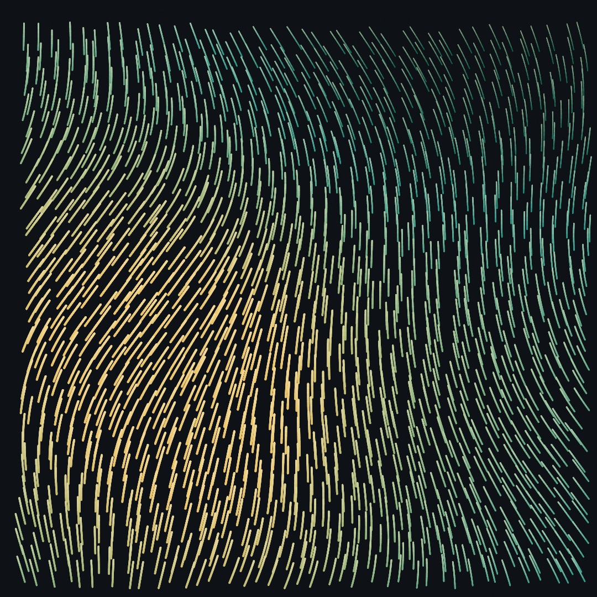
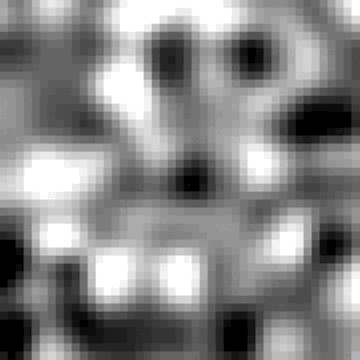
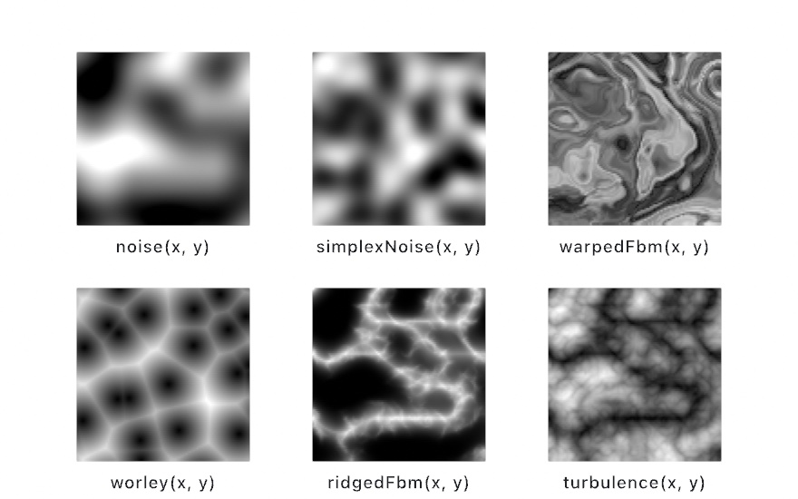

#### <sup>[Ollin](../README.md) → [Guide](README.md) → Chapter 5</sup>

---

# 5. Noise



Grass, smoke, coastlines, and a hand-drawn line all vary smoothly, and `random` only knows how to jump. The function that varies smoothly is `noise`, and this chapter teaches it from a single drift to layered fields that change with time and loop. The meadow above is fifteen hundred blades combed by one wind, all grown from that function. Other fields follow it, built by other rules: triangles, cells, folds, and warps.

## Random that remembers: `noise`

Here is the difference in one picture. Both strips march across the canvas asking for a height at every step. The top one asks `random`, and every answer stands alone. The bottom one asks `noise`, and something new happens: **nearby questions get nearby answers**.

<picture>
  <source media="(prefers-color-scheme: dark)" srcset="Images/05-Noise/RandomVsNoise-dark.jpg">
  
</picture>

That is the whole idea. `noise` takes a number in and hands back a value between 0 and 1, like `random()` does. But it is a *lookup*. At launch a smooth invisible landscape is laid out, and `noise(x)` reports its height at position `x`. Ask at `2.00` and then at `2.01` and you get almost the same answer, because you asked almost the same place. Ask far apart and the answers are unrelated. Random forgets; noise remembers where it is.

Here it is in motion. Make `MySketches/Glide.swift`:

```swift
import Ollin

final class Glide: Sketch {
    override func draw() {
        background(Color(hex: 0x0E1116))
        noStroke()
        fill(Color(hex: 0x64DFDF))
        let y = noise(time * 0.4) * height
        drawCircle(width / 2, y, 44)
    }
}
```

The dot floats up and down. There is no rhythm you can predict, but there is also never a jolt. The input is `time * 0.4`, so the dot is *strolling along the landscape* at 0.4 units a second and reporting the terrain as it goes. Now swap `noise` for `random()` (drop the argument) and run it again. The dot teleports every frame. The range and the canvas are the same, and the feel is completely different. Put `noise` back.

One habit carries over from [Chapter 4](04-Randomness.md). The landscape is laid out from the sketch's `variation` at launch, so every run strolls different hills. `noiseSeed(6)` pins the landscape, and `seed(6)`, which you met in [Chapter 4](04-Randomness.md), pins `noise` and `random` together. The same seed gives the same hills.

## Drift that swings: `signedNoise`

[Chapter 4](04-Randomness.md)'s grid nudged its corners with `random(-1, 1)` scaled by an amount, a swing both ways. Noise has the same convention built in. `signedNoise` is the same landscape spoken in `-1...1`, for when the natural resting point is a center rather than a floor. In `Glide`, replace the two lines that place the dot:

```swift
let x = width / 2 + signedNoise(time * 0.3) * 300
let y = height / 2 + signedNoise(time * 0.3 + 500) * 300
drawCircle(x, y, 44)
```

You get a dot wandering *around the center*, drifting up to 300 pixels in any direction and always coming back. There is a small trick in the second line. Both coordinates stroll the landscape at the same speed, but 500 units apart, and places that far apart are unrelated terrain. So `x` and `y` drift independently from one shared landscape. Whenever you need several unrelated glides, ask one noise in several far-apart places rather than reaching for several noises.

## The zoom multiplier

The `* 0.4` in `Glide` and the `* 0.3` after it are the number that sets a noise's scale. The input to `noise` is a position, so the multiplier decides **how far apart your questions land** on the landscape:

<picture>
  <source media="(prefers-color-scheme: dark)" srcset="Images/05-Noise/NoiseZoom-dark.jpg">
  
</picture>

Tiny steps stay on one hillside, so the result glides. Bigger steps cross whole hills between asks, so the result gets busy. Steps that are too big land on unrelated terrain every time, and noise stops looking smooth at all. If your noise ever looks like static, your multiplier is too big.

The panels suggest a working range. When you feed noise *pixel* coordinates, which you are about to, multiply them by something small, usually between `0.001` and `0.02`. A 1080-pixel canvas times `0.006` spans about six of the landscape's hills: features big enough to read as shapes, small enough to be interesting. You tune this by eye, and it is easier to tune once you think of it as zoom.

## Two dimensions: a field

Here is where noise does what [Chapter 4](04-Randomness.md)'s rolls could not. Give it *two* numbers, `noise(x, y)`, and the landscape becomes a smooth surface: an answer at every point of a plane. Ask at every cell of a grid and you can *see* it:

<picture>
  <source media="(prefers-color-scheme: dark)" srcset="Images/05-Noise/NoiseTerrain-dark.jpg">
  
</picture>

Make `MySketches/Clouds.swift`:

```swift
import Ollin

final class Clouds: Sketch {
    override func setup() {
        noiseSeed(6)
        noStroke()
    }

    override func draw() {
        let cells = 45
        let cell = width / Double(cells)
        for row in 0..<cells {
            for col in 0..<cells {
                let x = Double(col) * cell
                let y = Double(row) * cell
                let n = noise(x * 0.006, y * 0.006)
                fill(Color(white: n))
                drawRect(x, y, cell, cell)
            }
        }
    }
}
```

That is clouds, in about twenty lines. Each cell asks the field at its own position, times the zoom multiplier, and paints the answer as a gray. `Color(white:)` runs from 0, black, to 1, white. Neighboring cells ask neighboring places, so the shades drift instead of flickering, and cloudy continents appear. The right panel of the figure is the same field with its answers drawn as dot *sizes* instead. That pointillist look is a two-line change: a fixed fill, and a `drawCircle` sized by `n`. This move, compute a value per position and let it drive any visual property you like, is most of what noise is *for*.

## The third dimension is time

The `Clouds` field holds still. To move it, ask for one more dimension. `noise(x, y, z)` is a smooth *volume* of answers. Slide `z` gently while keeping `x` and `y` put, and every point of your 2D field changes, smoothly, each at its own pace. In `Clouds`, change one line:

```swift
let n = noise(x * 0.006, y * 0.006, time * 0.15)
```

The clouds become weather. Nothing scrolls, since sliding `x` instead of `z` is what does that. The field boils in place, the way clouds do. The `0.15` is the zoom parameter again, pointed at time, so smaller drifts slower.

## Coming home: the `loop:` parameter

A drift that never returns cannot loop, and [Chapter 3](03-MotionAndTime.md) taught you to care about that. A `z` that grows with `time` never comes back to where it started, so this weather cannot close a GIF loop on its own. You could fold time with [Chapter 3](03-MotionAndTime.md)'s `pingPong`, and out-and-back does loop. But then the weather spends half of every lap running in reverse. Noise has a better answer built in. Walk a *circle* through the field instead of a straight line and you end where you began, facing the way you started. There is no reversal and no seam. That is the `loop:` parameter. In `Clouds`, change the same line again:

```swift
let n = noise(x * 0.006, y * 0.006, loop: loopProgress(over: 4), radius: 0.6)
```



`loop` takes a `0...1` progress, which [Chapter 3](03-MotionAndTime.md)'s `loopProgress` makes a four-second one here. One lap of it tours a closed circle through the field, and `radius` sets how much terrain the lap covers, so bigger is windier weather. The figure is this move, and it loops because of it. Inside, the circle runs through extra noise dimensions, a trick the looping-GIF artists use. The [Noise reference](../Docs/Generators/Noise.md#loop) has the details, including using `loop:` to close a wave around a ring in *space*.

The same circle is built into the `sway` from [Chapter 3](03-MotionAndTime.md#the-sway-you-write-over-and-over-sway). Its `.wander` shape reads the noise field instead of a curve, so it never repeats inside a lap. It walks a closed circle like this one, so it still arrives home at the end of the lap:

```swift
drawCircle(width / 2, height / 2, sway(over: 4, in: 100...300, shape: .wander))
```

## Layering shape and detail: `fbm`

Look at a mountain ridge and there are two ridges: the huge slow silhouette, and the small jagged texture on top of it. One noise call gives you one or the other, never both, because one zoom level only has features of one size. The fix is to ask twice and add:

<picture>
  <source media="(prefers-color-scheme: dark)" srcset="Images/05-Noise/NoiseLayers-dark.jpg">
  
</picture>

```swift
let n = noise(x * 0.004) * 0.7 + noise(x * 0.03) * 0.3
```

The big-scale sample carries most of the weight and decides the composition. The small-scale sample gets the rest and supplies the grain. The weights should sum to about 1 so `n` stays in `0...1`. Graphics people call these layers *octaves* and stack four or five of them, each layer half the size and half the weight of the last. The technique's name is fractal noise, and it is two lines of arithmetic.

Ollin also packages the stack as one call. `fbm(x * 0.004)` layers four octaves, each half the size and half the weight of the one before, and still fills `0...1`. Three arguments tune it. The `octaves:` argument is how many layers. The `gain:` argument is how fast the weights shrink, and `lacunarity:` is how fast the features shrink. `fbm(x, octaves: 1)` is plain `noise` again, so there is nothing new to unlearn. It comes in the same shapes as `noise` does, such as `fbm(x, y)` and `signedFbm`. There is also `fbm(x, y, loop:)`, for layered weather that comes home each lap.

## Putting it together: a meadow in the wind

The meadow at the top of this chapter puts a noise field, time, and layering to work on about 1,500 blades. Each blade *grows* the way [Chapter 4](04-Randomness.md)'s walker walked, one step at a time, except that its steps do not jump at random. At every step it asks a `signedNoise` field which way to lean. Nearby blades ask nearby places, so they lean together, and currents appear. A second, bigger-scale ask decides each blade's color and thickness, the layering idea working as composition. And the whole field uses `loop:`, one lap of wind every six seconds, so it sways forever without a seam. One call is new here, `strokeCap(.round)`, which rounds the ends of every line so six short segments join into one blade. Make `MySketches/Meadow.swift`:

```swift
import Ollin

final class Meadow: Sketch {
    @Param("Sway", 0...1) var sway = 0.55
    @Param("Glow", 0...1) var glow = 0.4

    let ramp = Ramp([
        Color(hex: 0x11553F), Color(hex: 0x2A9D8F),
        Color(hex: 0x8AB17D), Color(hex: 0xE9C46A),
    ])

    override func setup() {
        noiseSeed(11)
        strokeCap(.round)   // segments overlap their joints into one blade
    }

    override func draw() {
        background(Color(hex: 0x0E1116))
        noFill()
        randomSeed(3)                          // the same planting every frame
        let up = -Double.tau / 4
        let breeze = loopProgress(over: 6)     // one lap of wind per six seconds

        for row in 0..<38 {
            for col in 0..<40 {
                let x = 45.0 + Double(col) * 26 + random(-1, 1) * 8
                let y = 95.0 + Double(row) * 26 + random(-1, 1) * 8
                let weather = noise(x * 0.0011, y * 0.0011, loop: breeze, radius: 0.5)
                let blade = ramp.color(at: weather)
                strokeWeight(1.5 + weather * 2.3)

                var px = x, py = y
                for segment in 0..<6 {
                    let angle = up + signedNoise(px * 0.0016, py * 0.0016, loop: breeze, radius: 0.5) * 1.15 * sway
                    let nx = px + cos(angle) * 8
                    let ny = py + sin(angle) * 8
                    stroke(Color.mix(blade, Color(hex: 0xFFF2CC), Double(segment) / 5 * glow))
                    drawLine(px, py, nx, ny)
                    px = nx
                    py = ny
                }
            }
        }
    }
}
```

Run it with `swift run OllinLive MySketches/Meadow.swift` and take it apart:

- [Chapter 4](04-Randomness.md) and this chapter share the work here, so it helps to see who does what. The grid plants a blade every 26 pixels. Seeded `random` jitter breaks the rows, so the meadow reads as sown rather than tiled. The jitter is the `random(-1, 1) * 8` pair, under `randomSeed(3)` so the planting holds still. Random scatters; noise flows.
- Each blade is [Chapter 4](04-Randomness.md)'s walker, minus the random step. The inner loop is the same: keep a position, step, repeat. But the step direction now comes from `signedNoise` *at the blade's current position*. So the walk is steered by a smooth field instead of jumping at random. Each of the six steps is 8 pixels long and leans up to almost a fifth of a turn off vertical at full `Sway`. `up` is minus a quarter of `.tau`, the angle that points straight up on this canvas. Because the field is smooth, the blade *curves*.
- `weather` is the layering idea doing the composing. It asks the same field at a coarser zoom, so it changes over broader regions. The zoom is `0.0011` against the lean's `0.0016`. The `weather` value colors those regions warm or cool through the `Ramp` and thickens their strokes.
- The tip-light is [Chapter 2](02-Color.md)'s mixing, with each segment mixing the blade color toward warm white by `Glow`, brightening toward the tip.
- `strokeCap(.round)` is what joins the six segments into one continuous blade instead of a dashed one.
- `breeze` is `loopProgress(over: 6)` feeding both asks' `loop:`, so the whole field tours one closed circle through the noise every six seconds. The wind never reverses and never jumps, and any six-second export loops. Both asks share the same lap but different spatial scales, which is why color-weather and lean-weather move together without being copies.

When it feels right, export it. Video keeps the most quality, while a GIF loops anywhere you paste it (trim its width and frame rate, since meadows make heavy files):

```sh
swift run OllinLive MySketches/Meadow.swift --export-video meadow.mp4 --seconds 6
swift run OllinLive MySketches/Meadow.swift --export-gif meadow.gif --seconds 6 --gif-width 420 --fps 15
```

Then make it yours:

- Turn `Sway` up to 1 and the meadow becomes kelp; near 0 it becomes fur.
- Change `up` to `0` and the field combs sideways into wind-swept dunes.
- Give the blades more steps, and smaller ones. Using `0..<12` with `* 4` steps grows finer, longer grass.
- Swap the ramp for four colors of your own, since the `weather` ask does the composing either way.
- Plant sparser (`* 26` up to `* 40`) and thicken the strokes for a reed bed.

## A family of fields

The meadow asked one landscape, the classic `noise`, at two zoom levels. Once you think of noise as a landscape you can ask, there are other landscapes, laid out by other rules. Ollin ships a small family of them. The meadow has no need for them, but a sketch that wants stone instead of clouds, or a skyline instead of hills, does. The four below all answer in roughly `0...1` and take the same zoom multiplier. The same `noiseSeed` pins them, so the meadow's zoom and seeding carry over unchanged.

<picture>
  <source media="(prefers-color-scheme: dark)" srcset="Images/05-Noise/NoiseFlavors-dark.jpg">
  
</picture>

### The same idea on triangles: `simplexNoise`

`simplexNoise` is the same idea as `noise`, smooth and coherent. But its landscape is laid out on triangles, where the classic one is laid out on squares. The practical difference is grain. Simplex is even in every direction, while the classic field carries a faint left-right and up-down bias you can sometimes spot in big soft washes. So simplex is the one to try when a wash looks combed. Ken Perlin designed it in 2001 as a redesign of his own function. The two take identical inputs, so trying both is a one-word edit, and `signedSimplexNoise` swings `-1...1`:

```swift
let n = simplexNoise(x * 0.006, y * 0.006)
```

[Noise § simplexNoise](../Docs/Generators/Noise.md#simplexNoise) is the reference, and the [`Randomness/NoiseKinds`](../Examples/Randomness/NoiseKinds/Sketch.swift) example puts it beside the others on one set of coordinates.

### Cells from hidden points: `worley`

`worley` remembers places. It scatters one hidden point into each cell of an invisible grid. Its answer at any position is the distance to the nearest of those points. That is near zero beside a point and peaks on the walls between two. Shade the answers and the canvas divides itself into cells, a pattern that is everywhere in nature: stone, foam, cracked earth. It is Steven Worley's, from his 1996 paper on cellular textures.

<picture>
  <source media="(prefers-color-scheme: dark)" srcset="Images/05-Noise/CellsFromPoints-dark.jpg">
  
</picture>

```swift
let cell = worley(x * 0.02, y * 0.02)                       // stone-wall shading
let crack = worley(x * 0.02, y * 0.02, feature: .border)    // zero on the walls
let foam = worley(x * 0.02, y * 0.02, time * 0.3)           // cells that reform
```

The `feature:` argument picks the reading. The `.border` reading asks how much farther the *second*-nearest point is. That answer is zero on the wall between two cells, so small values trace the walls. Threshold it and you have cracks and veins. A `jitter:` of 0 pins every point to its cell center for a regular grid, while the default of 1 scatters them fully. And the third coordinate works like it does everywhere else in this chapter. Drift it with time and the cells bubble and reform in place. [Noise § worley](../Docs/Generators/Noise.md#worley) is the reference, and the [`Effects/Cellular`](../Examples/Effects/Cellular/Sketch.swift) example runs the same field per pixel on the GPU.

### Folding the field: `ridgedFbm` and `turbulence`

Both `turbulence` and `ridgedFbm` start from the signed field and flip every dip upward. Wherever the field crossed zero, the fold leaves a sharp crease. `turbulence` layers those folded octaves the way `fbm` does. The result is billows with creased seams, the classic basis for clouds, smoke, and marble. It is as old as noise itself, from Ken Perlin's 1985 paper. `ridgedFbm` pushes further. It makes the creases the *bright* lines and lets each octave add detail only where the one below was strong. So the fine grain gathers on the crests instead of filling the valleys. A row of `ridgedFbm` samples reads as a mountain skyline. The ridged fold is F. Kenton Musgrave's, from his fractal terrains. Both take `fbm`'s arguments, and both have the `loop:` form:

```swift
let smoke = turbulence(x * 0.004, y * 0.004)
let skyline = ridgedFbm(x * 0.004)
```

[Noise § ridgedFbm](../Docs/Generators/Noise.md#ridgedFbm) is the reference, and the [`Patterns/RidgeLines`](../Examples/Patterns/RidgeLines/Sketch.swift) example stacks `ridgedFbm` skylines into a landscape.

### Asking the field where to ask: `warpedFbm`

`warpedFbm` samples the field at a position the field itself chose. Instead of reading `fbm` at your position, it first asks the field to nudge that position, then asks again, and only then reads the answer. The layers smear into flowing marble, a look no amount of plain layering produces. Domain warping as a named, shareable recipe is Inigo Quilez's, from the article Ollin's implementation follows. `warp:` scales the nudging: `0` is plain `fbm`, `1` is the classic strength, and past `1` the field tears into churn.

```swift
let marble = warpedFbm(x * 0.004, y * 0.004)
```

[Noise § warpedFbm](../Docs/Generators/Noise.md#warpedFbm) is the reference, and the [`Shaders/DomainWarp`](../Examples/Shaders/DomainWarp/Sketch.swift) example opens up the same recipe in shader code.

Two more live in the reference. `gaborNoise` lays its waves at one wavelength and, if you ask, in one direction, which gives you brushed metal, wood grain, and silk. It takes pixel coordinates and a `seed:` of its own rather than the zoom multiplier and `noiseSeed`. [Noise § gaborNoise](../Docs/Generators/Noise.md#gaborNoise) has its figure and parameters, and the [`Effects/GaborNoise`](../Examples/Effects/GaborNoise/Sketch.swift) example dots the crests of the field the GPU painted. `noiseFields` is the whole family as a plain value that other threads can read. It is for a sketch that asks a field a few hundred thousand times a frame. [Noise § noiseFields](../Docs/Generators/Noise.md#noiseFields) shows the call, and the [`Rendering/LineSpray`](../Examples/Rendering/LineSpray/Sketch.swift) example bends its tens of thousands of lines a frame this way.

`noise` and `fbm` cover clouds, weather, and terrain. When a sketch wants stone instead of clouds, the field for it is one of the four above. All four share the zoom, the seeding, and the far-apart places. The folded fields and `warpedFbm` also take `loop:`, while `simplexNoise` and `worley` do not.

## Where this comes from

Ken Perlin built noise in 1983, after working on the computer imagery of the film *TRON*. He was frustrated that everything the machine made looked too clean. He published it in his 1985 SIGGRAPH paper "An Image Synthesizer." The Academy of Motion Picture Arts and Sciences gave him a Technical Achievement Award for it in 1997. It may be the only Academy Award ever won by a math function. Ollin implements his refined 2002 "improved noise" algorithm, and its simplex noise follows Stefan Gustavson's "Simplex noise demystified." The layering-octaves idea grew alongside noise in the fractal-terrain tradition. It is Benoit Mandelbrot's fractional Brownian motion, brought to graphics by the fractal-terrain artists, Richard Voss and F. Kenton Musgrave among them. Ollin's `fbm` keeps that tradition's name.

Daniel Shiffman's *The Nature of Code* and its video incarnations made `noise` a first-class citizen of creative-coding pedagogy, and this chapter follows them. The `loop:` trick tours a circle through a higher-dimensional field so a drift comes home. It was popularized by Étienne Jacob's [necessary-disorder tutorials](https://necessarydisorder.wordpress.com/), a long series on looping-GIF craft. The family sections name their own sources: Perlin's simplex, Worley's cells, Musgrave's ridges, and Quilez's warp. The finished sketch is a near relative of the *flow field*, which [Chapter 14](14-FieldsAndFlow.md) teaches in full. That technique has a generative-art tradition of its own. Full credits are in the project's [attribution notes](../ATTRIBUTION.md).

## Go deeper

- [Noise](../Docs/Generators/Noise.md): the full reference, including the looping `loop:` forms, layered `fbm`, and the whole field family from this chapter's tour. It also covers Gabor noise, `noiseFields` for work off the main thread, and `curlNoise`, the swirling vector cousin waiting for [Chapter 14](14-FieldsAndFlow.md).
- [Random](../Docs/Generators/Random.md): the uncorrelated sibling, for when you *want* the jump.
- The family at work: [`Patterns/RidgeLines`](../Examples/Patterns/RidgeLines/Sketch.swift) stacks `ridgedFbm` skylines into a looping landscape, and [`Effects/GaborNoise`](../Examples/Effects/GaborNoise/Sketch.swift) reads the Gabor field the GPU painted. The same fields also run per pixel on the GPU. The [`Effects/Cellular`](../Examples/Effects/Cellular/Sketch.swift) example is `worley` as a generated layer. The [`Shaders/DomainWarp`](../Examples/Shaders/DomainWarp/Sketch.swift) example opens up the warp recipe in shader code. [Chapter 18](18-YourFirstShader.md) teaches both.
- Appendix B draws this chapter's math, one picture per idea: [Fractions, mapping, and wrapping](B-JustEnoughMath.md#fractions-mapping-and-wrapping), [Noise](B-JustEnoughMath.md#noise), [Fields and following them](B-JustEnoughMath.md#fields-and-following-them).
- Worked examples: [`Randomness/NoiseField`](../Examples/Randomness/NoiseField/Sketch.swift) (the cloud field, scrubbed by the mouse), [`Randomness/NoiseWave`](../Examples/Randomness/NoiseWave/Sketch.swift) (1D noise as a wave, beside its jagged twin [`RandomBand`](../Examples/Randomness/RandomBand/Sketch.swift)), [`Motion/EllipseField`](../Examples/Motion/EllipseField/Sketch.swift) (`signedNoise` driving a whole field of shapes: ellipses in one column, chord-closed arcs in the other), and [`Randomness/NoiseKinds`](../Examples/Randomness/NoiseKinds/Sketch.swift) (simplex, its signed reading, `worley`, and `turbulence` on one set of coordinates).
- The Molnár homage [`Interruptions`](../Examples/Recreations/VeraMolnar/Interruptions/Sketch.swift): a field of ticks like the meadow's ancestor, its gaps carved by noise.
- The Rojo homage [`MexicoBajoLaLluvia`](../Examples/Recreations/VicenteRojo/MexicoBajoLaLluvia/Sketch.swift): rain as a grid of small marks, colored by noise read along one diagonal. The streaks lean the way the rain falls, and slide down it over time.

---

[Contents](README.md#contents) · Previous: [Chapter 4, Randomness](04-Randomness.md) · Next: [Chapter 6, Grids and repetition](06-GridsAndRepetition.md)
