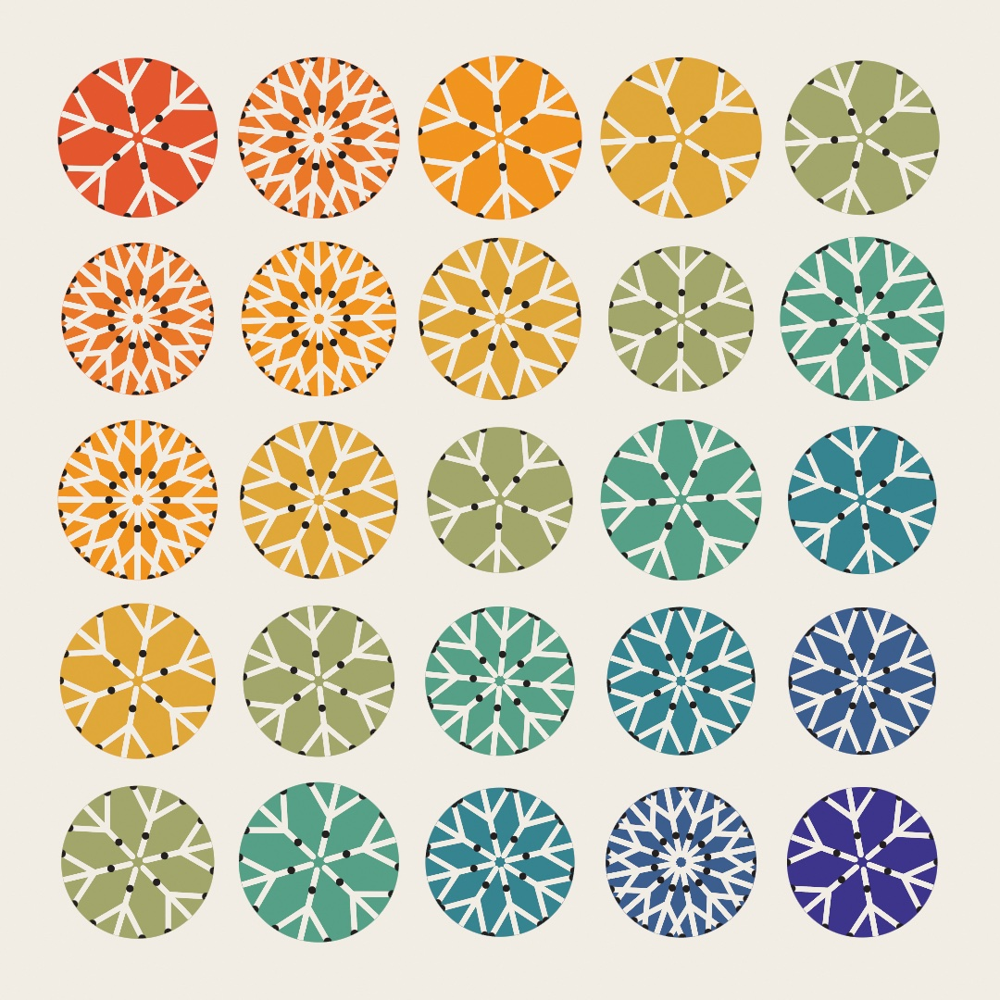
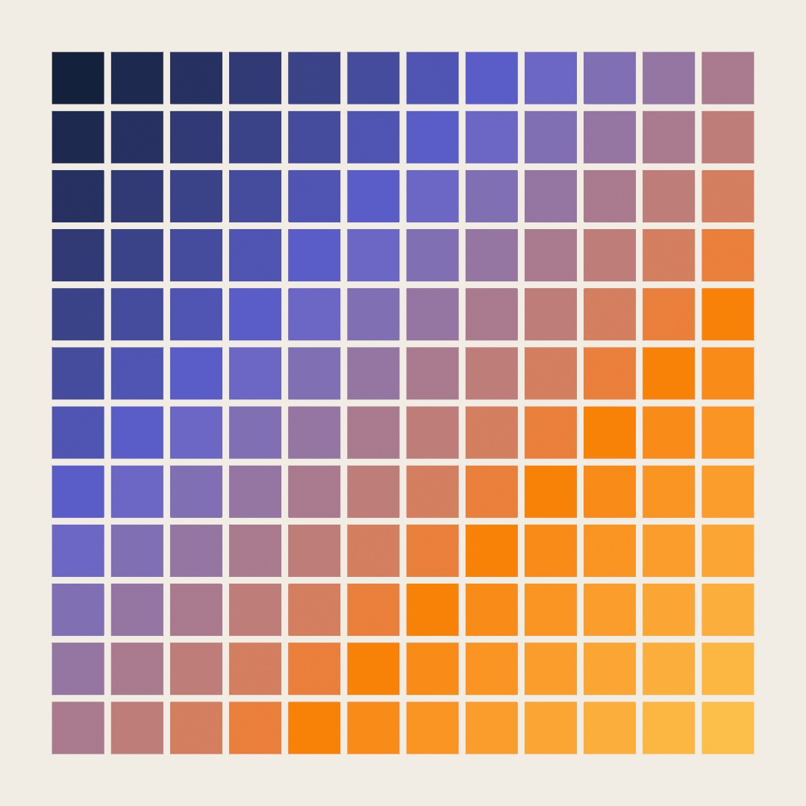
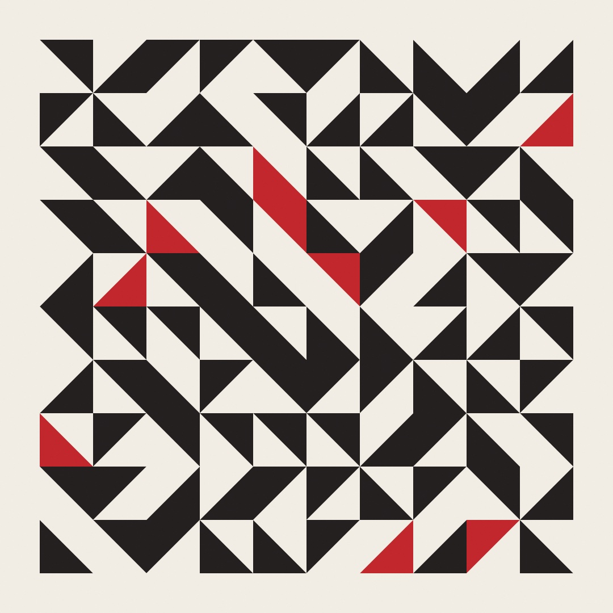
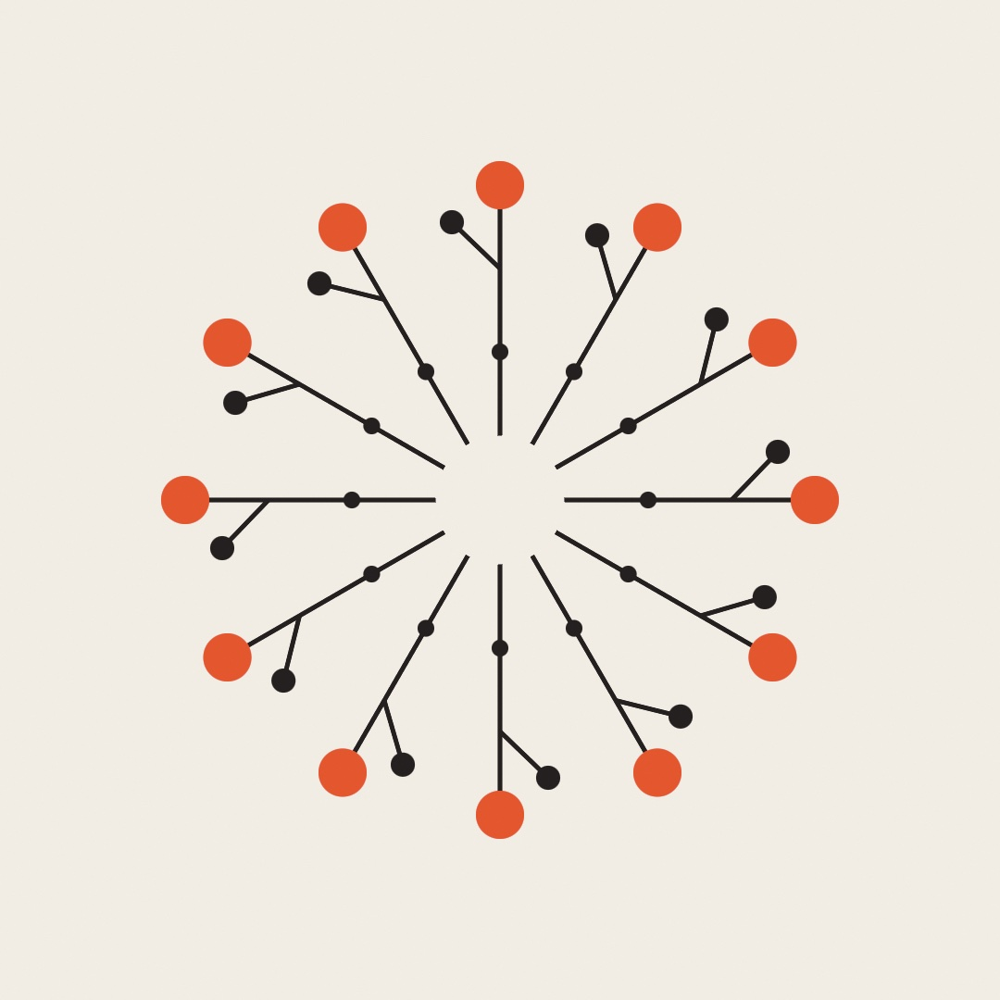
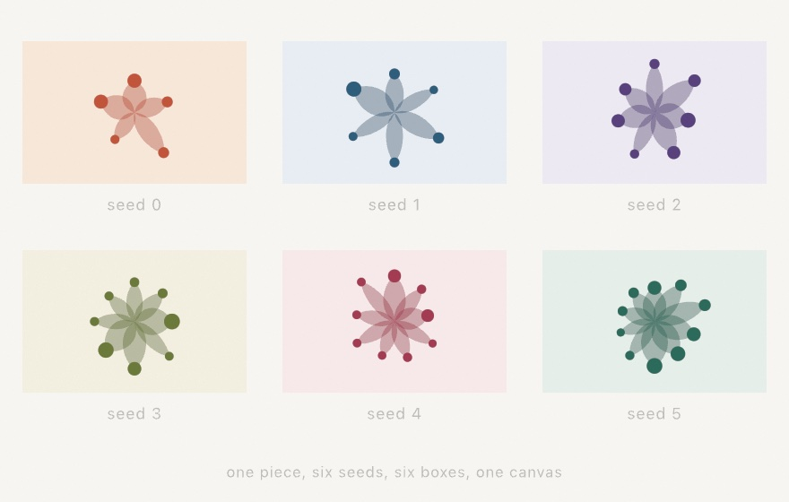
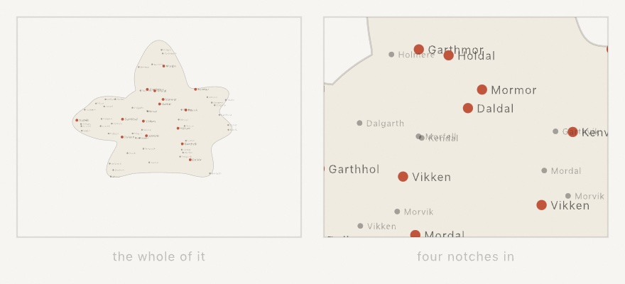
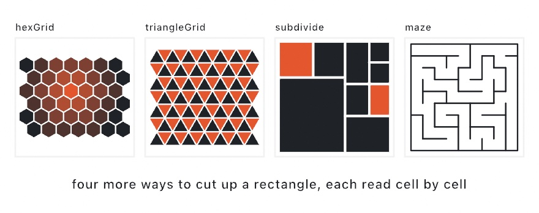
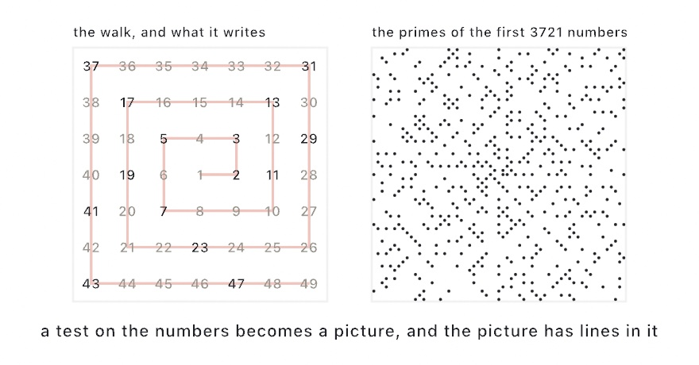
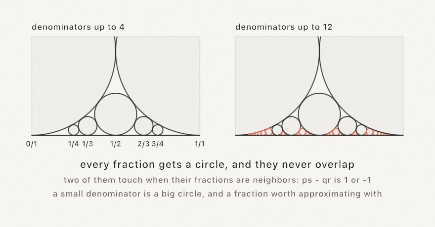

#### <sup>[Ollin](../README.md) → [Guide](README.md) → Chapter 6</sup>

---

# 6. Grids and repetition



There are twenty-five medallions up there, and one crooked little arm behind all of them. The arm is drawn once. A grid decides where each medallion sits, and the transforms turn and shrink it in place. Symmetry folds that single arm into a ring of copies, and a clip trims whatever runs past the rim.

Grids are how generative art gets its sense of order, and repetition is how it gets its rhythm. A little disorder inside a strict structure, the move you know from [Chapter 4](04-Randomness.md), is where the life comes from. By the end you'll have the wall above, and a click that re-rolls it forever. You'll also have the four tools that built it: a grid you loop once, transforms that move the paper under your shapes, a fold that repeats every drawing call, and a region that decides what survives.

## One loop, not two

You've already built grids twice, the long way. [Chapter 2](02-Color.md)'s color field and [Chapter 4](04-Randomness.md)'s disorder grid both did the same chores. Pick a margin, then divide the leftover width into cells. Run a loop inside a loop, and rebuild each cell's x and y from the indices. Those chores are what `grid` is for:

```swift
import Ollin

final class ColorTiles: Sketch {
    let ramp = Ramp([
        Color(hex: 0x14213D), Color(hex: 0x5E60CE),
        Color(hex: 0xF77F00), Color(hex: 0xFCBF49),
    ])

    override func draw() {
        background(Color(hex: 0xF2EDE4))
        noStroke()
        for cell in grid(columns: 12, rows: 12, padding: 70, gutter: 10).cells {
            let diagonal = Double(cell.column + cell.row) / 22
            fill(ramp.color(at: diagonal))
            drawRect(cell.frame)
        }
    }
}
```



One loop. `grid(columns:rows:padding:gutter:)` lays a grid over the canvas, where `padding` is the outer margin and `gutter` the gap between tiles. Its `cells` is a list you loop, and every cell arrives knowing everything about itself. It carries its `frame`, the rectangle to draw, plus its `center`, its `column` and its `row`. Those indices are the point. The old nested loops existed mostly so you'd have a column number and a row number in hand. Here every cell carries its own, so the indexed tricks stay one-loop simple. A checkerboard from `(cell.column + cell.row) % 2` is one, and this diagonal fade is another.

<picture>
  <source media="(prefers-color-scheme: dark)" srcset="Images/06-GridsAndRepetition/GridAnatomy-dark.jpg">
  
</picture>

The grid offers two things to loop, and you pick by what you're drawing. `cells` are the tiles. `points` are the dots, one per cell center by default. Pass `distribution: .spanning` for a lattice that reaches the edges, the layout you want when the piece *is* a grid of dots. A dot field is two lines:

```swift
for p in grid(columns: 12, rows: 12, padding: 70, distribution: .spanning).points {
    drawCircle(center: p.position, radius: 6)
}
```

Two more things before we move on. `grid(...)` covers the whole canvas, but `Grid(in: someRectangle, ...)` lays one inside any rectangle. Since a cell's `frame` is itself a rectangle, grids nest. A grid where each cell holds a smaller grid is one more loop, and a classic look. And for margins that differ per edge, `padding:` takes more than a bare number: `.symmetric(horizontal: 40, vertical: 20)`, or any mix via `Insets`.

> **Swift note.** `grid(...).cells` chains a call and a property, building the grid and then asking for its cells. `cell` in the loop is a small value with named parts you read with a dot (`cell.frame`, `cell.column`), and `drawRect` accepts the frame whole, with no unpacking into x and y. `p.position` is a `Vector2`, a pair of coordinates carried as one value, and `drawCircle(center:radius:)` takes it directly. [Chapter 10](10-Vectors.md) makes proper friends with vectors, and until then you can read `Vector2` as "a point".

## Move the paper

The grid raises a question immediately. How do you draw something *rotated* inside a cell? `drawRect` and friends don't take an angle. The answer is one of the oldest ideas in computer graphics, and it feels backwards for about ten minutes. You don't rotate the shape, you rotate the *paper*.

<picture>
  <source media="(prefers-color-scheme: dark)" srcset="Images/06-GridsAndRepetition/TransformSteps-dark.jpg">
  
</picture>

Three calls move the paper. `translate(x, y)` slides the origin, the point that counts as (0, 0), somewhere else. `rotate(angle)` turns the paper around that origin (angles work like [Chapter 3](03-MotionAndTime.md): `.tau / 4` is a quarter turn). `scale(factor)` stretches it. After any of them, every drawing call is measured on the moved paper, which is what the diagram shows. All four flags are the very same `drawRect` at the very same numbers, drawn on paper that had been slid, turned, and stretched first.

The moves accumulate as `draw()` runs, so you also need the undo. That's `withState`:

```swift
withState {
    translate(cell.center)      // origin to this cell's middle
    rotate(.tau / 8)            // paper turns an eighth
    drawRect(-40, -40, 80, 80)  // a tilted square, centered on (0, 0)
}                               // paper snaps back as if nothing happened
```

Everything inside the braces draws on the moved paper. At the closing brace the paper is restored, along with any `fill` or `stroke` you changed inside. This is the cell-drawing recipe you'll use for the rest of the guide. Translate to the cell's center, turn or stretch as the piece demands, then draw *around the origin*. Coordinates like `(-40, -40)` straddle (0, 0). Put the recipe in a grid, add a seeded coin flip from [Chapter 4](04-Randomness.md), and identical parts start composing figures nobody drew:

```swift
import Ollin

final class Pinwheels: Sketch {
    let ink = Color(hex: 0x232020)
    let accent = Color(hex: 0xC1272D)

    override func draw() {
        randomSeed(11)
        background(Color(hex: 0xF2EDE4))
        noStroke()

        for cell in grid(columns: 10, rows: 10, padding: 70).cells {
            let quarter = randomChoice([0, 1, 2, 3])
            withState {
                translate(cell.center)
                rotate(Double(quarter) * .tau / 4)
                fill(random() < 0.12 ? accent : ink)
                let h = cell.frame.width / 2
                drawPolygon([Vector2(-h, -h), Vector2(h, -h), Vector2(-h, h)])
            }
        }
    }
}
```



One right triangle, half a cell drawn by handing `drawPolygon` its three corners. Four possible spins, and the neighbors do the rest. Hourglasses, pinwheels, and arrows assemble themselves wherever the spins happen to agree. Nobody placed those figures. That's the effect this chapter keeps returning to. It only works because every triangle is *exactly* the same size in *exactly* the same place in its cell, so any two spins fit together. Hold that thought for Truchet.

> **Swift note.** `random() < 0.12 ? accent : ink` is the compact if, which reads as the condition, then the value when true, then the value when false. And notice that `withState { ... }` takes a block of code in braces, like `draw()` itself. Running the block with the paper moved and then restoring it is the whole trick.

## Symmetry for free

Rotating the paper around a cell gave a quilt. Rotate around the canvas center instead, and repetition becomes symmetry. Every sketch carries that center as a property called `center`, which is just the `Vector2` at `width / 2, height / 2` and saves you writing it out:

```swift
import Ollin

final class Rosette: Sketch {
    let ink = Color(hex: 0x232020)
    let accent = Color(hex: 0xE4572E)

    override func draw() {
        background(Color(hex: 0xF2EDE4))
        translate(center)

        for _ in 0..<12 {
            rotate(.tau / 12)
            drawArm()
        }
    }

    func drawArm() {
        stroke(ink)
        strokeWeight(5)
        drawLine(70, 0, 340, 0)
        drawLine(250, 0, 300, -52)

        noStroke()
        fill(accent)
        drawCircle(340, 0, 26)
        fill(ink)
        drawCircle(300, -52, 13)
        drawCircle(160, 0, 9)
    }
}
```



This time there's no `withState`, on purpose. Each `rotate(.tau / 12)` *adds* to the last, so the twelve copies of the arm land a twelfth of a turn apart and close the circle exactly. The arm itself is deliberately lopsided, a stem along the x axis, one branch reaching up, disks of different sizes. A symmetric arm makes a boring rosette. The symmetry comes from the repetition, so the part is free to be as crooked as it likes. Change `12` to `5` or `48`, redraw the arm, drop `time` into the rotation. Every mandala, snowflake, and kaleidoscope pattern you've seen is some cousin of this loop.

> **Swift note.** `func drawArm()` declares a helper function on your sketch, a named block you call like any built-in. Pulling the arm out of the loop keeps `draw()` readable and gives you one obvious place to redesign the arm.

## The fold, done for you

Write that loop yourself once, because it shows you what symmetry actually is. After that there's a shortcut, and it can do something the loop can't.

```swift
symmetry(8)                  // every draw call now happens eight times
symmetry(8, mirrored: true)  // sixteen times, alternate copies flipped
noSymmetry()                 // back to normal
```

`symmetry` is drawing state, like `fill` or a transform, so it applies to everything you draw until you turn it off, and `withState { }` scopes it. Once it's on you stop thinking about repetition entirely. You draw one wedge, and every circle, line, and shape in it lands in all the folds at once.

<picture>
  <source media="(prefers-color-scheme: dark)" srcset="Images/06-GridsAndRepetition/Kaleidoscope-dark.jpg">
  
</picture>

The mirrored form is the part worth having. A plain rotation copies your wedge around like a pinwheel, and every copy still leans the same way. Mirroring flips alternate copies, so neighbors face each other and the seams between them close. That's the difference between a pinwheel and an actual kaleidoscope. Doing it by hand means negative scales and reversed winding, a mess you now don't have to write.

The folds are computed around wherever you are when you call it, so `translate` first if the center isn't the canvas center. And because it happens per draw call rather than per shape, a whole composition folds just as easily as a single arm.

## Drawing inside a shape

Repetition fills space. Sometimes you want it to fill *only part* of the space, and specifically a part shaped like something.

```swift
withClip(star) {
    // everything here lands only inside the star
}
```

<picture>
  <source media="(prefers-color-scheme: dark)" srcset="Images/06-GridsAndRepetition/ClipRegions-dark.jpg">
  
</picture>

`withClip` takes a `Shape`, a `Rectangle`, or a `Circle`, and confines everything drawn inside the block to that region. What makes it useful rather than merely convenient is that you don't have to work out the intersection yourself. The stripes in the figure are the same handful of long diagonal lines in all three panels. They are drawn straight past the edges, and the region decides what survives.

Nesting is the other half. A clip inside a clip keeps only what falls in both. That is how the third panel gets the lens-shaped overlap, with no geometry on your part. Letters make good clips too, since [Chapter 8](08-Words.md)'s `textToShapes` hands back shapes, so you can pour a whole pattern into a word.

## A cell that is a whole canvas

A clip keeps drawing inside a region. A view box goes one step further and moves the coordinates too, so the block inside believes the region *is* the canvas:

```swift
withViewBox(cell.frame) {
    randomSeed(i)
    drawThePiece()
}
```

<picture>
  <source media="(prefers-color-scheme: dark)" srcset="Images/06-GridsAndRepetition/ViewBoxSheet-dark.jpg">
  
</picture>

Inside that block `width` and `height` still report the whole canvas, `center` is still the middle of it, and a circle at `(width / 2, height / 2)` lands in the middle of the cell. That is the point. You hand a piece written for the whole window to a box, and it runs there unchanged.

Two more things are quietly remapped so that stays true. `background` fills the box rather than the frame, because the frame belongs to every box at once and one of them wiping it would take the others with it. And the mouse arrives in the box's own coordinates, so an interactive piece works in each box separately.

The virtual canvas has the *sketch's* shape, not the box's, so a box shaped like the canvas is the case where everything lands exactly. When it does not, `fit:` decides, using the same words a picture uses in [Chapter 9](09-Pictures.md): `.contain` leaves the box showing along two edges, `.cover` fills it and crops, `.stretch` squashes.

Labels belong outside the block, in canvas coordinates, or they get scaled down with everything else. That is what keeps the six captions in the figure one size.

This is the fastest way to see a piece think. Change one number, run six of it, and the ones that are dead give themselves away immediately. You learn more from six of a piece than from one.

## Looking closer

A view box makes the canvas smaller. The other move is the opposite one: leave the canvas as it is and look at part of it, up close.

```swift
override func draw() {
    background(.white)
    viewControl()
    drawTheWholePiece()
}
```

Drag to pan, scroll to zoom. That is the whole of it, and it is the 2D counterpart of the camera you can take hold of in [Chapter 21](21-3DGently.md). Like that one, it is opt-in: a sketch that never calls it never pays for it.

<picture>
  <source media="(prefers-color-scheme: dark)" srcset="Images/06-GridsAndRepetition/ViewCloser-dark.jpg">
  
</picture>

The best reason to zoom is in that figure, and it is not the magnification. Nothing was re-rendered to get the right-hand panel. The place names are set at four units in both, and the outlines are simply drawn through a larger transform, so they arrive crisp. Vector drawing has no resolution to run out of.

Two details are what make the gestures feel like gestures rather than sliders. A drag moves the content exactly as far as the pointer went, so the piece sticks to your finger. And a zoom is anchored on the pointer, so whatever you are pointing at stays under it while the view grows around it. Neither is smoothed, on purpose. A 3D orbit is nicer with a little inertia; a flat plane under a finger is not.

What `viewControl()` leaves behind is an ordinary transform, which tells you where to put things. Anything drawn *before* the call stays put, so a fixed backdrop goes there. For a caption that has to be drawn last, wrap the call and the piece in a `withState { }` block and draw the caption after it, outside.

And the mouse arrives in the coordinates now on screen, the same courtesy a view box does, so `drawCircle(mouseX, mouseY, 20)` lands under the pointer at any zoom and hit-testing goes on working.

## Grids that aren't square

The `Grid` this chapter opened with divides a rectangle into rectangles, which covers a great deal but not everything. Four more shapes of division come with Ollin, and all of them read the same way. Ask for the cells, then loop over them once.

<picture>
  <source media="(prefers-color-scheme: dark)" srcset="Images/06-GridsAndRepetition/OtherGrids-dark.jpg">
  
</picture>

```swift
for cell in hexGrid(columns: 12, rows: 10, gutter: 6).cells {
    drawPolygon(cell.corners)
}
for cell in triangleGrid(columns: 21, rows: 10).cells {
    fill(cell.pointsUp ? .white : .black)
    drawPolygon(cell.vertices)
}
for cell in subdivide(minSize: 90, chance: 0.75) {
    drawRect(cell.frame)
}
drawMaze(maze(columns: 24, rows: 24))
```

`hexGrid` and `triangleGrid` are the other two regular tilings, the only other *regular polygons* that cover a plane with no gaps and no overlaps. Plenty of irregular shapes manage it, which is [Chapter 7](07-Tiles.md)'s subject. Hexagons can't stretch the way a rectangle can. So the block keeps its true proportions and centers itself, rather than distorting to fill your bounds. The hex grid also knows its own geometry, so `distance(from:to:)` counts rings between two cells. That is what colors the first panel, and exactly what a board game needs.

`subdivide` splits a rectangle in two, then splits the halves, and keeps going until the pieces hit `minSize` or a coin says stop. Uneven panels like that are hard to get from a grid and easy to get from recursion. That is why the result reads as a layout rather than a table.

`maze` carves a **perfect maze**. Every cell is reachable, and there is exactly one route between any two, so it has no loops and no isolated pockets. The algorithm you choose is a texture control as much as a technical one. `.backtracker` gives long winding corridors, while `.kruskal` gives an even sprawl of short dead ends. `drawMaze` strokes the walls, and the maze can also hand you its longest path, which is the single hardest route through it.

One more member of this family is a circle rather than a grid. `apollonianGasket(in:minRadius:)` fills a circle with the classic foam of ever-smaller kissing circles, each one the single circle that exactly touches its three neighbors. There's no randomness in it at all, so the same circle always gives the same foam. The circles come back in the order they were created, so their index doubles as an age you can color by.

## Walking a grid: numbers in a spiral

Every loop so far has read the grid the way a page is read: left to right, top to bottom. That order is a choice, and changing it changes what the grid can show you.

Walk it as a square spiral instead, from the middle outward, writing the whole numbers one per cell. Then mark the cells whose number passes some test. Mark the primes and something happens that has no business happening: the marks fall on diagonal lines.

<picture>
  <source media="(prefers-color-scheme: dark)" srcset="Images/06-GridsAndRepetition/NumbersInASpiral-dark.jpg">
  
</picture>

```swift
let spiral = ulamSpiral(size: 101)
noStroke(); fill(.white)
for point in spiral.primePoints { drawCircle(center: point, radius: 3) }
```

Stanisław Ulam found this on a notepad during a dull talk in 1963. The lines are not a mystery once you see where they come from. Step diagonally in a square spiral and the number under you grows by a quadratic, so a diagonal *is* a quadratic, and a crowded one is a quadratic that keeps returning primes. Mathematics has known such polynomials since Euler. What the picture does is make them visible.

The primes are only the famous test. `points(where:)` takes any test at all, and `numbers` hands you the whole square if you would rather ask your own question:

```swift
for point in spiral.points(where: { $0 % 7 == 0 }) { drawCircle(center: point, radius: 2) }
```

`start` is the other parameter, and it is the one to animate. Counting from somewhere other than 1 moves every number, so the diagonals break up and re-form, which is the same fact seen from a different place.

## A circle for every fraction

The spiral put whole numbers on a grid. The same move made with fractions has the arrangement doing the surprising part.

Take any fraction `p/q` in lowest terms. Give it a circle of radius `1/(2q²)`, sitting on the number line at `p/q`. Do that for every fraction at once.

<picture>
  <source media="(prefers-color-scheme: dark)" srcset="Images/06-GridsAndRepetition/CircleForEveryFraction-dark.jpg">
  
</picture>

```swift
noFill(); stroke(.white)
for ford in fordCircles(order: 12) { drawCircle(ford.circle) }
```

Nothing in that rule asks the circles to fit together. They fit anyway. **No two of them ever overlap**, and two of them touch exactly when their fractions are neighbors, which means `ps - qr` is `1` or `-1`. Lester Ford wrote this down in 1938.

Read the sizes and the picture tells you something. A small denominator gets a big circle, and a big circle is a fraction that stays close to everything near it. That is what "a good approximation" means, drawn.

The fractions come from `fareySequence(order:)`, which is worth knowing on its own. It hands you every fraction from 0 to 1 with a denominator inside the order, in order, and any two terms next to each other are neighbors. The first fraction ever to appear between two of them is their mediant, `(p+r)/(q+s)`, which is the wrong way to add fractions and the right way to grow this sequence.

Growing `order` over a loop is the animation, and it is arrival rather than motion: no circle ever moves, and each new denominator drops its circles into gaps that were waiting for them. The `Patterns/FordCircles` example does that, and draws a line between every touching pair on a mouse hold.

## A run that never repeats itself

This chapter has been about repetition. Here is its opposite, and it is just as exact.

Take four colors and lay out sixty-four beads so that **every** run of three colors appears somewhere around the ring, and no run appears twice. That is a de Bruijn sequence, and it is as short as such a ring can be: there are sixty-four possible triples and each takes one place.

<picture>
  <source media="(prefers-color-scheme: dark)" srcset="Images/06-GridsAndRepetition/EveryWindowOnce-dark.jpg">
  
</picture>

```swift
let code = DeBruijnCode(symbols: 4, window: 3)
code.sequence            // 64 symbols, every triple exactly once
code.position(of: seen)  // where those three beads sit
```

The reason to care is in that last line. Look at any three beads and you know where on the ring you are, because no other three look the same. That is how a rotary encoder finds its angle and how a camera finds its place on a printed ruler. Nothing has to be counted or remembered, only glimpsed.

The run always starts with a row of zeros, because the one Ollin builds is the smallest in dictionary order. The same arguments always give the same run, so a sketch built on it reproduces.

Two things are easy to get wrong. **The run is a ring**, so reading it means wrapping around the end, and drawing it as a straight strip leaves the last windows looking broken. And **the length grows fast**: five symbols with a window of five is already 3,125 beads. Choose the window from how much a reader can see at once, not from how long a run you want.

## Putting it together: a wall of rosettes

Now you can build the image at the top. The plan uses every tool in the chapter, and in the order you met them. A grid hands you the blocks, and inside each one the transforms place, turn, and shrink the work. Then symmetry folds a single arm into a medallion, and a clip cuts the result to a disc. Make a new file, `MySketches/RoseWall.swift`:

```swift
import Ollin

final class RoseWall: Sketch {
    @Param("Columns", 2...8) var columns = 5
    @Param("Seed", 1...9999) var wallSeed = 7
    @Param("Mirrored") var mirrored = true

    let paper = Color(hex: 0xF2EDE4)
    let ink = Color(hex: 0x232020)
    let ramp = Ramp([
        Color(hex: 0xE4572E), Color(hex: 0xF3A712),
        Color(hex: 0x2A9D8F), Color(hex: 0x3D348B),
    ])

    override func draw() {
        seed(wallSeed)
        background(paper)

        let blocks = grid(columns: columns, rows: columns, padding: 60, gutter: 18)
        for cell in blocks.cells {
            let radius = cell.frame.width / 2
            let folds = [5, 6, 8, 12][Int(random(4))]
            let reach = Double(cell.column + cell.row) / Double(2 * columns - 2)

            withState {
                translate(cell.center)
                rotate(random(.tau))
                scale(random(0.88, 1.0))

                noStroke()
                fill(ramp.color(at: reach))
                drawCircle(0, 0, radius)

                withClip(Circle(center: .zero, radius: radius)) {
                    symmetry(folds, mirrored: mirrored)
                    drawArm(radius: radius)
                }
            }
        }
    }

    // One arm, deliberately lopsided, drawn well past the edge of its block so
    // the clip is what gives every medallion its rim.
    func drawArm(radius: Double) {
        stroke(paper)
        strokeWeight(radius * 0.07)
        strokeCap(.round)
        drawLine(radius * 0.10, 0, radius * 1.30, 0)
        drawLine(radius * 0.58, 0, radius * 0.94, -radius * 0.34)

        noStroke()
        fill(paper)
        drawCircle(radius * 1.30, 0, radius * 0.10)
        fill(ink)
        drawCircle(radius * 0.94, -radius * 0.34, radius * 0.05)
        drawCircle(radius * 0.36, 0, radius * 0.045)
    }

    override func mousePressed() {
        wallSeed += 1
    }
}
```

Run it, then click. What each piece contributes:

- `blocks.cells` is the one loop. Each cell arrives knowing its own `frame` and `center`, so nothing here rebuilds an x and a y from indices, and `cell.column + cell.row` is the diagonal you already used for the color tiles.
- `withState` is what makes the block independent. Everything inside it, the position, the turn, the shrink, the fold, and the clip, is undone at the closing brace, so the next cell starts from a clean page.
- `translate` then `rotate` then `scale` is the usual order, and the order matters. The turn and the shrink both happen around the cell's center because `translate` moved the origin there first.
- The arm reaches to `radius * 1.30`, well outside its own block. That is deliberate. The clip is what cuts it back, which is why every medallion has a crisp rim and no two rims are cut the same way.
- `symmetry(folds, mirrored:)` is inside the clip, so the fold happens to the arm and not to the disc under it. Turn `Mirrored` off and the medallions become pinwheels: same arms, but every copy leaning the same way, and the seams between them stop closing.
- `seed(wallSeed)` at the top of `draw()` pins the fold counts, the turns, and the shrinks, so the wall holds still. The Seed parameter, or a click, deals a whole new wall.

Before moving on, make it yours:

- Redraw `drawArm`. It is the one place the sketch has a personality, and a straighter or busier arm changes all twenty-five medallions at once.
- Swap `[5, 6, 8, 12]` for `[3, 4]` and the wall goes from lace to heraldry.
- Give the disc a stroke in `ink` and drop the gutter to `4`, so the medallions crowd their neighbors like tiles rather than floating.
- Drive `reach` from `noise` at the cell center instead of the diagonal, and the color arrives in patches ([Chapter 5](05-Noise.md)) rather than a clean gradient.

## Where this comes from

The paper-moving transform model goes back to the earliest days of computer graphics, and reached creative coding through Processing's `pushMatrix`/`popMatrix`. The pinwheel quilt is older than all of it, pieced by quilters long before anyone had a coordinate system to rotate. The kaleidoscope is younger than it looks: David Brewster patented one in 1817, and it became a craze inside a year.

Mazes come from graph theory rather than from paper. A perfect maze is a spanning tree of its grid, so every algorithm that carves one is a spanning-tree algorithm in costume. That is why `.backtracker`, a depth-first walk, and `.kruskal`, after Joseph Kruskal's 1956 method, give such different textures from the same guarantee.

The circle foam is the oldest idea in the chapter by a long way. Apollonius of Perga asked which circle touches three given circles, around 200 BC. René Descartes worked out the arithmetic relating their sizes, in a 1643 letter to Princess Elisabeth of Bohemia, and that is why the relation carries his name.

The spiral of numbers is Stanisław Ulam's, drawn on a notepad during a talk in 1963 and published the year after with Myron Stein and Mark Wells. Martin Gardner's column carried it to everybody else, and it has been redrawn ever since.

The ring where every window is different is named for Nicolaas Govert de Bruijn, who counted the binary case in 1946, although Camille Flye Sainte-Marie had done it in 1894 and Sanskrit prosodists had the eight-bead version as a memory word centuries before either.

The circles on the number line are Lester Ford's, from a 1938 paper about approximating numbers with fractions. The sequence under them is named for John Farey, who noticed the mediant rule in 1816, although Charles Haros had published the same thing in 1802 and Augustin-Louis Cauchy supplied the proof Farey did not. Full credits are in the project's [attribution notes](../ATTRIBUTION.md).

## Go deeper

- [Geometry](../Docs/Drawing/Geometry.md): the full `Grid` reference (spanning points, nesting, singular access), `Insets`, and `Rectangle`.
- [Ulam spiral](../Docs/Generators/UlamSpiral.md): the walk, reading any test off it, and the prime helpers behind the marks.
- [Ford circles](../Docs/Generators/FordCircles.md): the circles, the Farey sequence and its mediant rule, and the `Fraction` type both rest on.
- [De Bruijn sequences](../Docs/Generators/DeBruijn.md): the run, the reader that turns a window into a position, and the Lyndon words it is built from.
- [Drawing](../Docs/Drawing/Drawing.md): the transform stack in detail, `pushState`/`popState` (the unscoped siblings of `withState`), and every shape that benefits.
- [Kaleidoscope symmetry](../Docs/Drawing/Drawing.md#symmetry): the full reference for `symmetry`/`noSymmetry`, including which drawing paths fold and which don't. The [`Patterns/Kaleidoscope`](../Examples/Patterns/Kaleidoscope/Sketch.swift) example draws a single arm and lets the folds do the rest.
- [Clipping](../Docs/Drawing/Drawing.md#clip): the reference, including how clips interact with layers and what vector export does with them. The [`Shapes/Clipping`](../Examples/Shapes/Clipping/Sketch.swift) example sweeps a lens across a striped star.
- [Tiling and layout](../Docs/Drawing/Tiling.md): every parameter for `HexGrid`, `TriangleGrid`, `Subdivision`, `Maze`, and `apollonianGasket`, including hex orientation and picking, the quadtree split style, all three maze algorithms, and the longest-path helper.
- Appendix B draws this chapter's math, one picture per idea: [Angles and circles](B-JustEnoughMath.md#angles-and-circles), [Moving the paper](B-JustEnoughMath.md#moving-the-paper).
- Worked examples: [`Patterns/Grid`](../Examples/Patterns/Grid/Sketch.swift) (the grid helper's tour) and the two named above.
- Next door: [Chapter 7](07-Tiles.md) keeps the grid and changes what goes in the cells, so that neighboring cells have to agree with each other.

---

[Contents](README.md#contents) · Previous: [Chapter 5, Noise](05-Noise.md) · Next: [Chapter 7, Tiles that cover the plane](07-Tiles.md)
