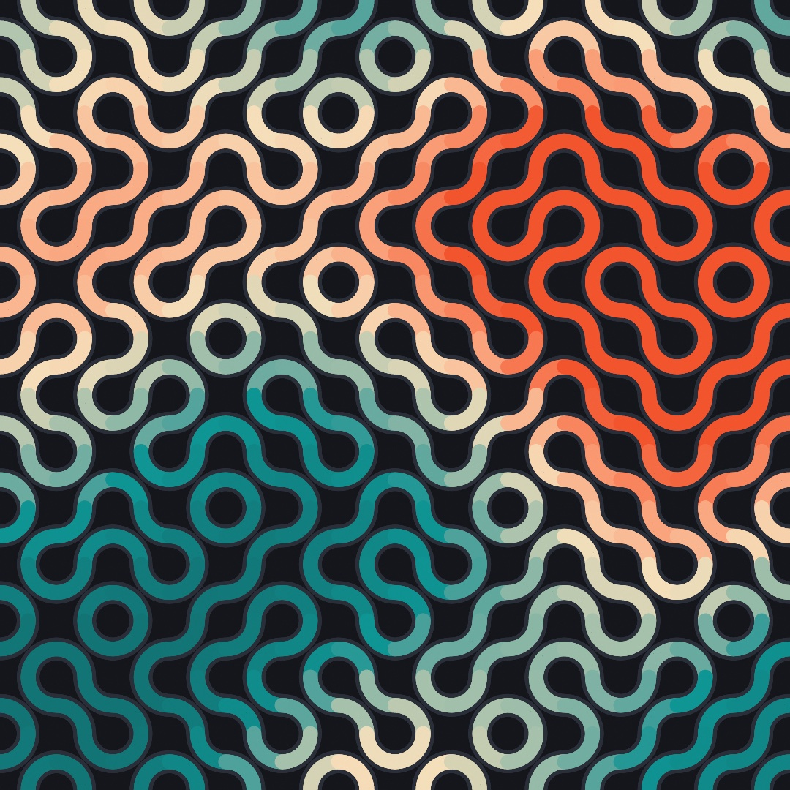
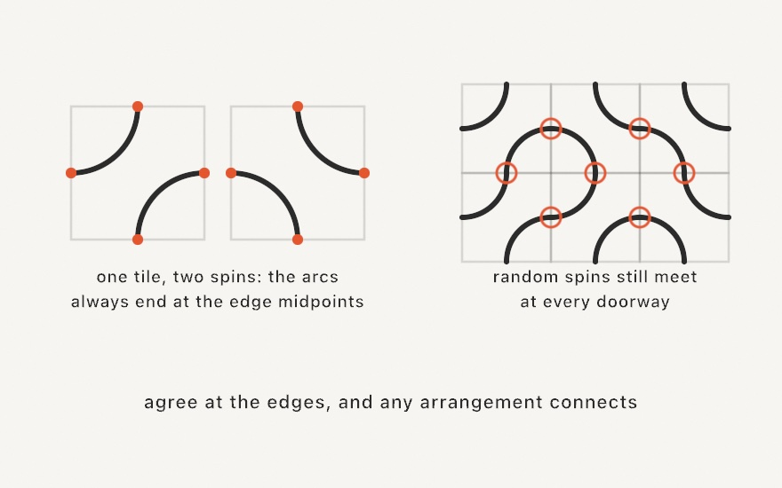

#### <sup>[Ollin](../README.md) → [Guide](README.md) → Chapter 6</sup>

---

# 6. Grids and repetition



Every strand in this tangle is built from one shape: a quarter circle, stamped into a grid a couple hundred times, each copy spun by a coin flip. That's the whole chapter in one image. Grids are how generative art gets its sense of order, repetition is how it gets its rhythm, and a little disorder inside a strict structure (you know this move from Chapter 4) is where the life comes from. By the end you'll have the tangle, a click that re-rolls it forever, and the two tools that carried it: a grid you loop once, and transforms that move the paper under your shapes.

## One loop, not two

You've already built grids twice, the long way. Chapter 2's color field and Chapter 4's disorder grid both did the same chores: pick a margin, divide the leftover width into cells, run a loop inside a loop, and rebuild each cell's x and y from the indices. Those chores are what `grid` is for:

```swift
import Ollin

final class ColorTiles: Sketch {
    let ramp = Ramp([
        Color(hex: 0x14213D), Color(hex: 0x5E60CE),
        Color(hex: 0xF77F00), Color(hex: 0xFCBF49),
    ])

    override func draw() {
        background(Color(hex: 0xF2EDE4))
        noStroke()
        for cell in grid(columns: 12, rows: 12, padding: 70, gutter: 10).cells {
            let diagonal = Double(cell.column + cell.row) / 22
            fill(ramp.color(at: diagonal))
            drawRect(cell.frame)
        }
    }
}
```


One loop. `grid(columns:rows:padding:gutter:)` lays a grid over the canvas: `padding` is the outer margin, `gutter` the gap between tiles. Its `cells` is a list you loop, and every cell arrives knowing everything about itself: its `frame` (the rectangle to draw), its `center`, and its `column` and `row`. Those indices are the point. The old nested loops existed mostly so you'd have a column number and a row number in hand; here every cell carries its own, so the indexed tricks (a checkerboard from `(cell.column + cell.row) % 2`, this diagonal fade) stay one-loop simple.


The grid offers two things to loop, and you pick by what you're drawing. `cells` are the tiles. `points` are the dots: one per cell center by default, or pass `distribution: .spanning` for a lattice that reaches the edges (the layout you want when the piece *is* a grid of dots). A dot field is two lines:

```swift
for p in grid(columns: 12, rows: 12, padding: 70, distribution: .spanning).points {
    drawCircle(center: p.position, radius: 6)
}
```

Two more things worth knowing before we move on: `grid(...)` covers the whole canvas, but `Grid(in: someRectangle, ...)` lays one inside any rectangle, and since a cell's `frame` is itself a rectangle, grids nest (a grid where each cell holds a smaller grid is one more loop, and a classic look). And for margins that differ per edge, `padding:` takes more than a bare number: `.symmetric(horizontal: 40, vertical: 20)`, or any mix via `Insets`.

> **Swift note.** `grid(...).cells` chains a call and a property: build the grid, then ask for its cells. `cell` in the loop is a small value with named parts you read with a dot (`cell.frame`, `cell.column`), and `drawRect` accepts the frame whole, no unpacking into x and y. `p.position` is a `Vector2`, a pair of coordinates carried as one value; `drawCircle(center:radius:)` takes it directly. Chapter 8 makes proper friends with vectors; until then, read `Vector2` as "a point".

## Move the paper

Here's a question the grid raises immediately: how do you draw something *rotated* inside a cell? `drawRect` and friends don't take an angle. The answer is one of the oldest ideas in computer graphics, and it feels backwards for about ten minutes: you don't rotate the shape, you rotate the *paper*.


Three calls move the paper. `translate(x, y)` slides the origin, the point that counts as (0, 0), somewhere else. `rotate(angle)` turns the paper around that origin (angles work like Chapter 3: `.tau / 4` is a quarter turn). `scale(factor)` stretches it. After any of them, every drawing call is measured on the moved paper, which is what the diagram shows: all four flags are the very same `drawRect` at the very same numbers, drawn on paper that had been slid, turned, and stretched first.

The moves accumulate as `draw()` runs, so you also need the undo. That's `withState`:

```swift
withState {
    translate(cell.center)      // origin to this cell's middle
    rotate(.tau / 8)            // paper turns an eighth
    drawRect(-40, -40, 80, 80)  // a tilted square, centered on (0, 0)
}                               // paper snaps back as if nothing happened
```

Everything inside the braces draws on the moved paper; at the closing brace the paper (and any `fill` or `stroke` you changed inside) is restored. This is the cell-drawing recipe you'll use for the rest of the book: translate to the cell's center, turn or stretch as the piece demands, then draw *around the origin*, using coordinates like `(-40, -40)` that straddle (0, 0). Put the recipe in a grid, add a seeded coin flip from Chapter 4, and identical parts start composing figures nobody drew:

```swift
import Ollin

final class Pinwheels: Sketch {
    let ink = Color(hex: 0x232020)
    let accent = Color(hex: 0xC1272D)

    override func draw() {
        randomSeed(11)
        background(Color(hex: 0xF2EDE4))
        noStroke()

        for cell in grid(columns: 10, rows: 10, padding: 70).cells {
            let quarter = randomChoice([0, 1, 2, 3])
            withState {
                translate(cell.center)
                rotate(Double(quarter) * .tau / 4)
                fill(random() < 0.12 ? accent : ink)
                let h = cell.frame.width / 2
                drawPolygon([Vector2(-h, -h), Vector2(h, -h), Vector2(-h, h)])
            }
        }
    }
}
```


One right triangle (half a cell, drawn by handing `drawPolygon` its three corners), four possible spins, and the neighbors do the rest: hourglasses, pinwheels, and arrows assemble themselves wherever the spins happen to agree. Nobody placed those figures. That's the quiet magic this chapter keeps returning to, and it only works because every triangle is *exactly* the same size in *exactly* the same place in its cell, so any two spins fit together. Hold that thought for Truchet.

> **Swift note.** `random() < 0.12 ? accent : ink` is the compact if: condition, then the value when true, then the value when false. And notice `withState { ... }` takes a block of code in braces, like `draw()` itself; running the block with the paper moved, then restoring, is the whole trick.

## Symmetry for free

Rotating the paper around a cell gave a quilt. Rotate around the canvas center instead, and repetition becomes symmetry:

```swift
import Ollin

final class Rosette: Sketch {
    let ink = Color(hex: 0x232020)
    let accent = Color(hex: 0xE4572E)

    override func draw() {
        background(Color(hex: 0xF2EDE4))
        translate(center)

        for _ in 0..<12 {
            rotate(.tau / 12)
            drawArm()
        }
    }

    func drawArm() {
        stroke(ink)
        strokeWeight(5)
        drawLine(70, 0, 340, 0)
        drawLine(250, 0, 300, -52)

        noStroke()
        fill(accent)
        drawCircle(340, 0, 26)
        fill(ink)
        drawCircle(300, -52, 13)
        drawCircle(160, 0, 9)
    }
}
```


This time there's no `withState`, on purpose: each `rotate(.tau / 12)` *adds* to the last, so the twelve copies of the arm land a twelfth of a turn apart and close the circle exactly. The arm itself is deliberately lopsided (a stem along the x axis, one branch reaching up, disks of different sizes), because a symmetric arm makes a boring rosette; the symmetry comes from the repetition, so the part is free to be as crooked as it likes. Change `12` to `5` or `48`, redraw the arm, drop `time` into the rotation. Every mandala, snowflake, and kaleidoscope pattern you've seen is some cousin of this loop.

> **Swift note.** `func drawArm()` declares a helper function on your sketch: a named block you call like any built-in. Pulling the arm out of the loop keeps `draw()` readable and gives you one obvious place to redesign the arm.

## Tiles that agree at their edges

The pinwheel quilt hinted at it: when identical parts meet their cell edges the same way, random spins still fit. In 1704 a French priest named Sébastien Truchet worked out how far that idea goes, and the tiles named after him are its purest form. Ollin ships two as `drawTruchet`:

```swift
randomSeed(4)
stroke(.white)
strokeWeight(7)
strokeCap(.round)
noFill()
drawTruchet(columns: 8, rows: 8, tile: .arcs)
```


`.arcs` is two quarter circles per cell; `.diagonals` is a single corner-to-corner stroke, and if you've ever seen the famous one-line maze program from 1982 home computers, that's exactly this tile. Both come out looking impossibly deliberate for what the code does (flip a coin per cell), and the diagram below is the reason:



The arc tile touches its cell's boundary in only four places, the edge midpoints, no matter which way it's spun. Think of the midpoints as doorways: every tile has a doorway in the middle of each wall, so whatever your neighbor did, your marks and theirs meet at the doorway and flow through. Local rule, global order. Each tile only promises to hit its own doorways, and the loops, corridors, and long wandering strands emerge across the whole canvas without any tile knowing about them.

The tiling is drawn from the seeded `random`, so it's reproducible like everything since Chapter 4: same seed, same maze. And when the plain white line-work isn't enough, `truchet(columns:rows:tile:)` hands you the raw strands instead of drawing them, one list of points per arc, which is exactly what the payoff wants.

## The payoff: a meandering tangle

Time to earn the image at the top. The plan: lay Truchet arcs over a grid, then stroke every strand twice, a wide pass in a dark rim tone and a narrower colored pass on top, so the strands read as piping with a little depth. For the color, reach back to Chapter 5: sample `noise` at each strand's midpoint, so neighbors wear neighboring colors and the palette drifts across the tangle like weather, slowly changing with `time`. Make a new file, `MySketches/Meander.swift`:

```swift
import Ollin

final class Meander: Sketch {
    @Param("Columns", 6...26) var columns = 14
    @Param("Seed", 1...9999) var quiltSeed = 3
    @Param("Diagonals") var diagonals = false

    let paper = Color(hex: 0x14161B)
    let ramp = Ramp([
        Color(hex: 0xF2542D), Color(hex: 0xF5DFBB),
        Color(hex: 0x0E9594), Color(hex: 0x127475),
    ])

    override func draw() {
        seed(quiltSeed)
        background(paper)
        noFill()
        strokeCap(.round)

        let cell = width / Double(columns)
        let strands = truchet(columns: columns, rows: columns,
                              tile: diagonals ? .diagonals : .arcs)

        // Two passes: first every strand slightly wide in a rim tone, then
        // the color on top, so strands running close stay separated.
        stroke(Color(hex: 0x2A2E38))
        strokeWeight(cell * 0.40)
        for strand in strands {
            drawPolyline(strand.points)
        }

        strokeWeight(cell * 0.26)
        for strand in strands {
            let mid = strand.points[strand.points.count / 2]
            let weather = noise(mid.x * 0.0016, mid.y * 0.0016, time * 0.06)
            stroke(ramp.color(at: weather))
            drawPolyline(strand.points)
        }
    }

    override func mousePressed() {
        quiltSeed += 1
    }
}
```

Run it, watch the colors migrate, and click for a fresh tangle. What each piece contributes:

- `seed(quiltSeed)` locks both `random` and `noise` at the top of every frame, so the layout holds still while `time` drifts the colors, and the Seed knob (or a click) is a whole new piece.
- `truchet(...)` returns the strands as values instead of drawing them. Each is a contour, a list of points in `.points`, and `drawPolyline` strokes one list.
- The two passes are an old illustrator's trick. The rim pass is a touch wider than the color pass, so wherever two strands run close, a dark seam keeps them apart; drawing *all* rims before *any* color is what keeps each strand's own segments merging smoothly into one pipe.
- `strand.points[strand.points.count / 2]` grabs a strand's middle point, and `noise` at that spot (scaled way down, Chapter 5's zoom knob) picks its color from the ramp. Nearby strands ask nearby questions, so color arrives in weather-like patches instead of confetti.
- The knobs earn their keep: `Columns` runs the piece from chunky plumbing at 6 to fine knitting at 26 (the stroke widths ride the cell size, so everything stays in proportion), and the `Diagonals` toggle swaps the whole mood from tangle to circuit board.

Before moving on, make it yours:

- Swap the ramp. Four colors change this piece more than anything else in it; try an all-warm set, or two blues and a shock of yellow.
- Color by strand *position* instead of noise: `mid.y / height` as the ramp's input turns the weather into a sunset gradient.
- Drop the rim pass's width to `cell * 0.55` and the color to `cell * 0.1` for wire-thin strands floating in fat shadows.
- Drive `strokeWeight` in the color pass from the same `weather` value, so warm patches also swell.

## Where this comes from

Truchet tiles are named for Sébastien Truchet, a French Carmelite priest who published a memoir in 1704 on the patterns a single diagonally-split tile can make, after watching ceramic tiles being laid for a château. The quarter-circle arc tile this chapter leans on is a later refinement by the metallurgist and historian Cyril Stanley Smith, from a lovely 1987 paper revisiting Truchet's work and connecting it to how structure builds hierarchy in materials; generative artists adopted it so thoroughly that "Truchet tiles" now usually *means* Smith's arcs. The diagonal tile has its own pop-culture monument: the Commodore 64 one-liner `10 PRINT CHR$(205.5+RND(1)); : GOTO 10`, a maze in thirty-eight characters, whose history got an entire (excellent) book, *10 PRINT*, by Nick Montfort and nine co-authors in 2012. The paper-moving transform model goes back to the earliest days of computer graphics and reached creative coding through Processing's `pushMatrix`/`popMatrix`; the pinwheel quilt is older than all of it, pieced by quilters long before anyone had a coordinate system to rotate. If the tangle left you wanting more, Christopher Carlson's multi-scale Truchet tiles (arcs at mixed cell sizes that still agree at the edges) are a beautiful rabbit hole. Full credits are in the project's [attribution notes](../ATTRIBUTION.md).

## Go deeper

- [Geometry](../Docs/Drawing/Geometry.md): the full `Grid` reference (spanning points, nesting, singular access), `Insets`, and `Rectangle`.
- [Drawing](../Docs/Drawing/Drawing.md): the transform stack in detail, `pushState`/`popState` (the unscoped siblings of `withState`), and every shape that benefits.
- [Truchet](../Docs/Drawing/Truchet.md): both tiles, the contour output, and feeding the strands to booleans, hatching, or SVG export.
- Worked examples: [`Patterns/Grid`](../Examples/Patterns/Grid/Sketch.swift) (the grid helper's tour) and [`Patterns/Truchet`](../Examples/Patterns/Truchet/Sketch.swift) (both tiles, animated).
- A teaser for later: [`Patterns/WaveFunctionCollapse`](../Examples/Patterns/WaveFunctionCollapse/Sketch.swift) plays the agree-at-the-edges game with *constraints*, tiles that refuse certain neighbors, and Chapter 11 watches it solve.

---

[Contents](README.md#contents) · Previous: [Chapter 5, Noise](05-Noise.md) · Next: Chapter 7, Words and pictures
