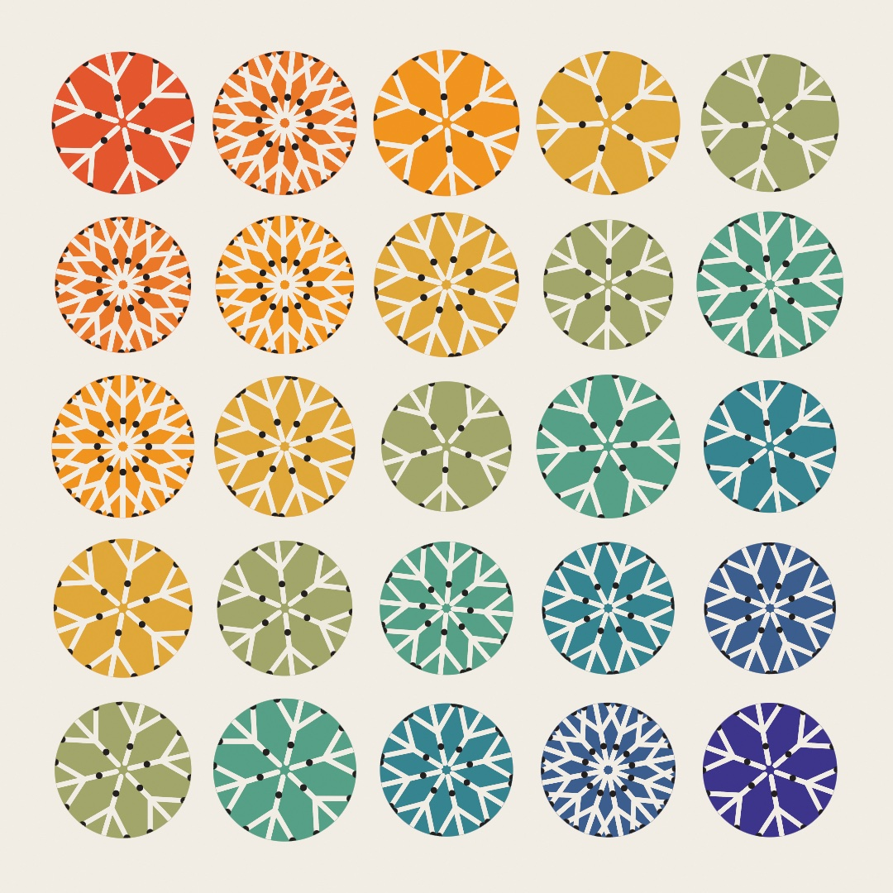
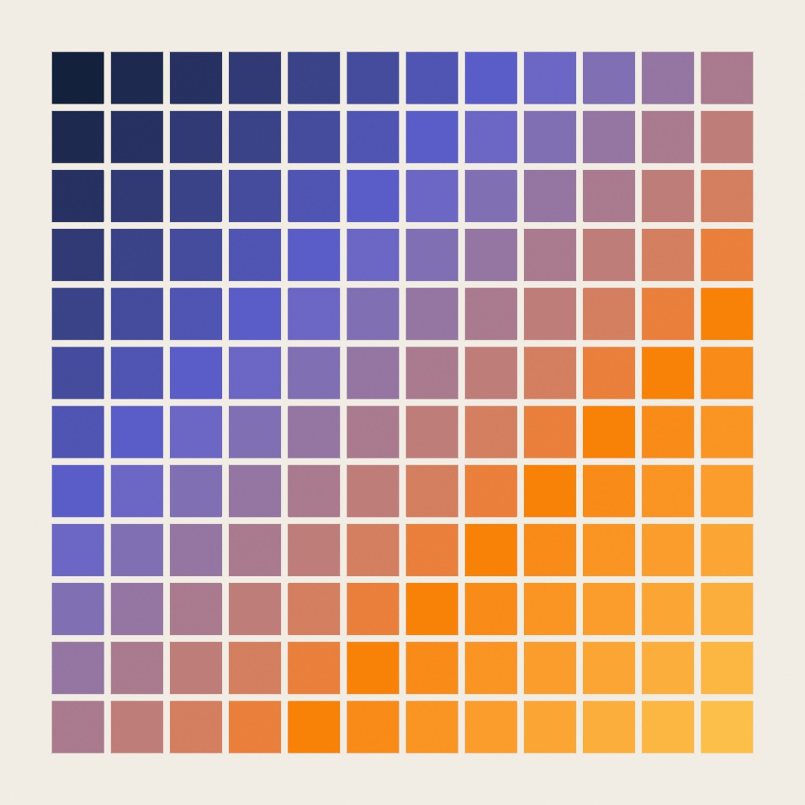
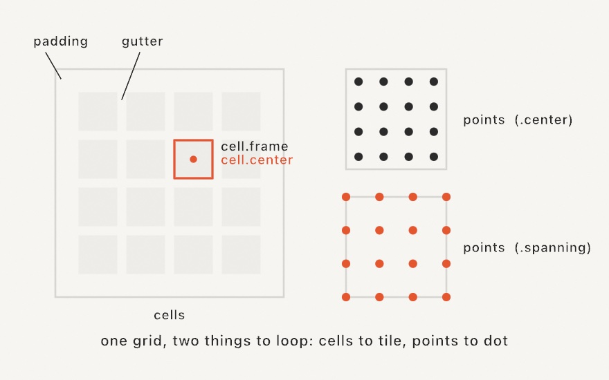
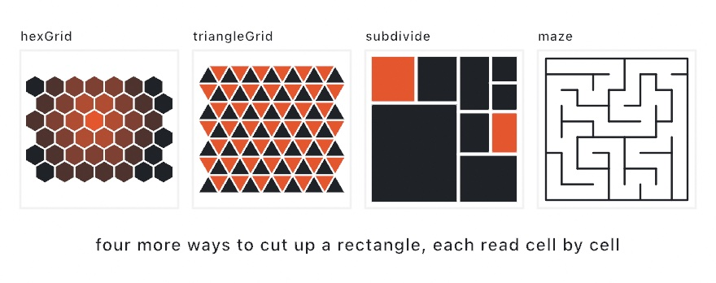
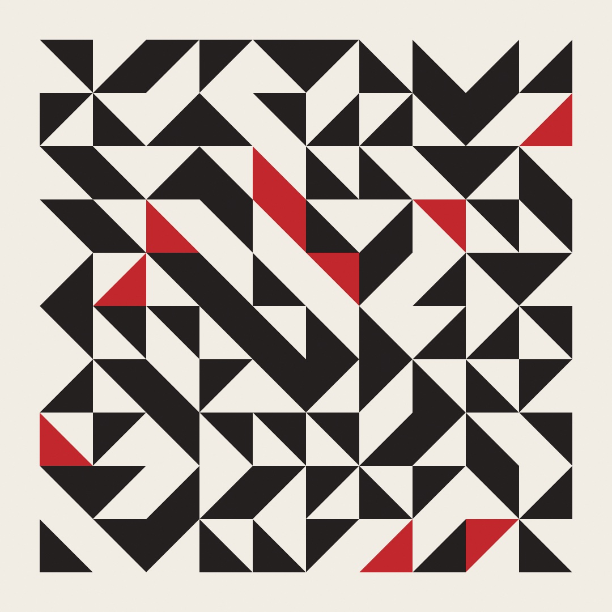
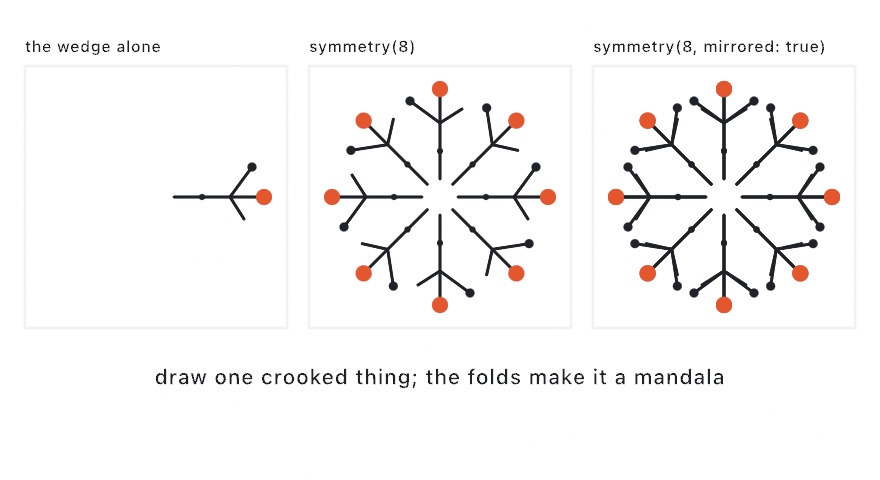
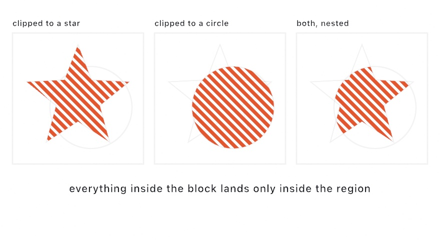
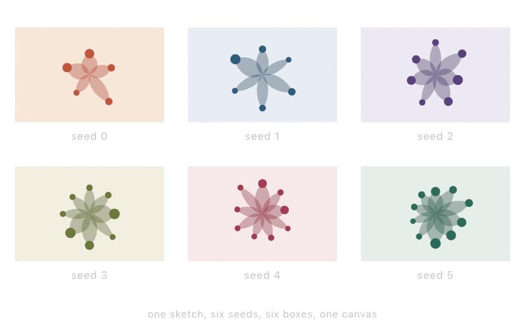
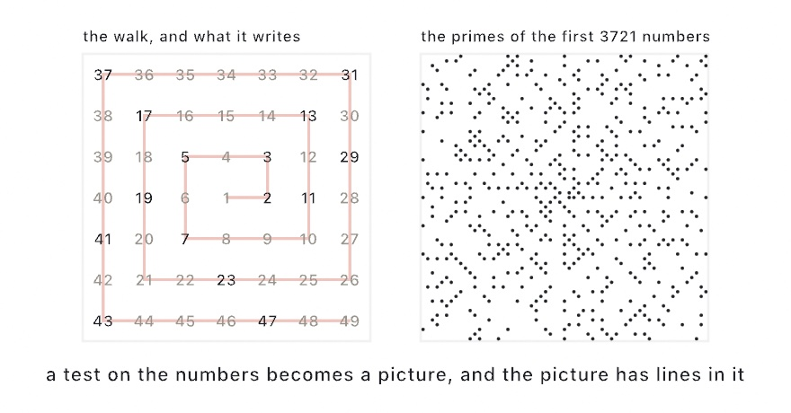

#### <sup>[Ollin](../README.md) → [Guide](README.md) → Chapter 6</sup>

---

# 6. Grids and repetition



Grids give generative art its order, and repetition gives it rhythm. The tools here place, turn, fold, and clip your shapes, and one of them runs a whole sketch inside a cell. The twenty-five medallions at the top all come from one crooked arm, drawn once and then placed, turned, folded, and trimmed. Uneven panels split by recursion and a spiral of numbers come after them.

## One loop, not two: `grid`

You have already built grids twice, the long way. [Chapter 2](02-Color.md)'s color field and [Chapter 4](04-Randomness.md)'s disorder grid both did the same chores. Pick a margin, then divide the leftover width into cells. Run a loop inside a loop, and rebuild each cell's x and y from the indices. Those chores are what `grid` is for:

```swift
import Ollin

final class ColorTiles: Sketch {
    let ramp = Ramp([
        Color(hex: 0x14213D), Color(hex: 0x5E60CE),
        Color(hex: 0xF77F00), Color(hex: 0xFCBF49),
    ])

    override func draw() {
        background(Color(hex: 0xF2EDE4))
        noStroke()
        for cell in grid(columns: 12, rows: 12, padding: 70, gutter: 10).cells {
            let diagonal = Double(cell.column + cell.row) / 22
            fill(ramp.color(at: diagonal))
            drawRect(cell.frame)
        }
    }
}
```



One loop does it. `grid(columns:rows:padding:gutter:)` lays a grid over the canvas, where `padding` is the outer margin and `gutter` the gap between tiles. Its `cells` is a list you loop, and every cell arrives knowing everything about itself. It carries its `frame`, the rectangle to draw, plus its `center`, its `column` and its `row`. Those indices are the point. The old nested loops existed mostly so you would have a column number and a row number in hand. Here every cell carries its own, so the indexed tricks stay one-loop simple. A checkerboard from `(cell.column + cell.row) % 2` is one, and this diagonal fade is another, where 22 is the far corner, column 11 plus row 11.

<picture>
  <source media="(prefers-color-scheme: dark)" srcset="Images/06-GridsAndRepetition/GridAnatomy-dark.jpg">
  
</picture>

The grid offers two things to loop, and you pick by what you are drawing. `cells` are the tiles. `points` are the dots, one per cell center by default. Pass `distribution: .spanning` for a lattice that reaches the edges, the layout you want when the sketch *is* a grid of dots. A dot field is two lines:

```swift
for p in grid(columns: 12, rows: 12, padding: 70, distribution: .spanning).points {
    drawCircle(center: p.position, radius: 6)
}
```

Two more things are useful to know. `grid(...)` covers the whole canvas, but `Grid(in: someRectangle, ...)` lays one inside any rectangle. Since a cell's `frame` is itself a rectangle, grids nest. A grid where each cell holds a smaller grid is one more loop, and a classic look. And for margins that differ per edge, `padding:` takes more than a bare number: `.symmetric(horizontal: 40, vertical: 20)`, or any mix via `Insets`.

> **Swift note.** `grid(...).cells` chains a call and a property, building the grid and then asking for its cells. You can also drop the `.cells` and loop the grid itself: `for cell in grid(columns: 12, rows: 12)`. As far as Swift is concerned a grid *is* its cells. It walks them in the same order, working each one out as the loop asks for it, so it never builds the array. Everything Swift can do to a list it reads, it can do to a grid, so after `let g = grid(columns: 12, rows: 12)`, `g.count` reads too. `cell` in the loop is a small value with named parts you read with a dot (`cell.frame`, `cell.column`), and `drawRect` accepts the frame whole, with no unpacking into x and y. `p.position` is a `Vector2`, a pair of coordinates carried as one value, and `drawCircle(center:radius:)` takes it directly. [Chapter 10](10-Vectors.md) teaches vectors properly, and until then you can read `Vector2` as "a point".

## Grids that aren't square: `hexGrid` and `triangleGrid`

`grid` divides a rectangle into rectangles, which covers a great deal but not everything. Two more regular divisions come with Ollin, and both read the same way. Ask for the cells, then loop over them once.

<picture>
  <source media="(prefers-color-scheme: dark)" srcset="Images/06-GridsAndRepetition/OtherGrids-dark.jpg">
  
</picture>

```swift
for cell in hexGrid(columns: 12, rows: 10, gutter: 6).cells {
    drawPolygon(cell.corners)
}
for cell in triangleGrid(columns: 21, rows: 10).cells {
    fill(cell.pointsUp ? .white : .black)
    drawPolygon(cell.vertices)
}
```

> **Swift note.** `cell.pointsUp ? .white : .black` is the compact if, which reads as the condition, then the value when true, then the value when false.

`hexGrid` and `triangleGrid` are the other two regular tilings, the only other *regular polygons* that cover a plane with no gaps and no overlaps. Plenty of irregular shapes manage it, which is [Chapter 7](07-Tiles.md)'s subject. Hexagons cannot stretch the way a rectangle can. So the block keeps its true proportions and centers itself, rather than distorting to fill your bounds. A hex cell hands you its `corners`, and `drawPolygon` draws a closed shape through a list of points, so a whole honeycomb is two lines. A triangle cell says whether it `pointsUp` and hands you its three `vertices`. The hex grid also knows its own geometry: keep the grid in a `let`, and its `distance(from:to:)` counts rings between two of its cells. That is what colors the first panel, and what a board game needs.

The figure's other two panels are divisions of another kind. The `subdivide` panel splits a rectangle into unequal panels by recursion, which comes after the finished sketch in [Uneven panels by recursion](#uneven-panels-by-recursion-subdivide). The maze is carved by `maze(columns:rows:)`, and [Chapter 7](07-Tiles.md#one-route-between-any-two-perfect-mazes) sets it beside the maze of diagonals and says what makes it perfect.

## Moving the paper: `translate`, `rotate`, and `scale`

The grid raises a question. How do you draw something *rotated* inside a cell? `drawRect` and friends do not take an angle. The answer is one of the oldest ideas in computer graphics. You do not rotate the shape, you rotate the *paper*.

<picture>
  <source media="(prefers-color-scheme: dark)" srcset="Images/06-GridsAndRepetition/TransformSteps-dark.jpg">
  
</picture>

Three calls move the paper. `translate(x, y)` slides the origin, the point that counts as (0, 0), somewhere else. `rotate(angle)` turns the paper around that origin (angles work like [Chapter 3](03-MotionAndTime.md): `.tau / 4` is a quarter turn). `scale(factor)` stretches it. After any of them, every drawing call is measured on the moved paper, which is what the diagram shows. All four flags are the same `drawRect` at the same numbers, drawn on paper that had been slid, turned, and stretched first.

The moves accumulate as `draw()` runs, and reset at the start of every frame. Within a frame you also need the undo, and that is `withState`:

```swift
withState {
    translate(cell.center)      // origin to this cell's middle
    rotate(.tau / 8)            // paper turns an eighth
    drawRect(-40, -40, 80, 80)  // a tilted square, centered on (0, 0)
}                               // paper snaps back as if nothing happened
```

Everything inside the braces draws on the moved paper. At the closing brace the paper is restored, along with any `fill` or `stroke` you changed inside. This is the cell-drawing recipe you will use for the rest of the guide. Translate to the cell's center, turn or stretch as the sketch demands, then draw *around the origin*. Coordinates like `(-40, -40)` straddle (0, 0). Put the recipe in a grid, add a seeded pick from [Chapter 4](04-Randomness.md), and identical parts start composing figures nobody drew:

```swift
import Ollin

final class Pinwheels: Sketch {
    let ink = Color(hex: 0x232020)
    let accent = Color(hex: 0xC1272D)

    override func draw() {
        randomSeed(11)
        background(Color(hex: 0xF2EDE4))
        noStroke()

        for cell in grid(columns: 10, rows: 10, padding: 70).cells {
            let quarter = randomChoice([0, 1, 2, 3])
            withState {
                translate(cell.center)
                rotate(Double(quarter) * .tau / 4)
                fill(random() < 0.12 ? accent : ink)
                let h = cell.frame.width / 2
                drawPolygon([Vector2(-h, -h), Vector2(h, -h), Vector2(-h, h)])
            }
        }
    }
}
```



It is one right triangle, half a cell, drawn by handing `drawPolygon` its three corners. There are four possible spins, and the neighbors do the rest. Hourglasses, pinwheels, and arrows assemble themselves wherever the spins happen to agree. Nobody placed those figures. That is the effect this chapter keeps returning to. It only works because every triangle is the same size in the same place in its cell, so any two spins fit together. [Chapter 7](07-Tiles.md)'s Truchet tiles rest on the same fact.

> **Swift note.** `withState { ... }` takes a block of code in braces, like `draw()` itself. Running the block with the paper moved and then restoring it is the whole trick.

## Symmetry by hand: rotating around the center

Rotating the paper around a cell gave a quilt. Rotate around the canvas center instead, and repetition becomes symmetry. Every sketch carries that center as a property called `center`, which is the `Vector2` at `width / 2, height / 2` and saves you writing it out:

```swift
import Ollin

final class Rosette: Sketch {
    let ink = Color(hex: 0x232020)
    let accent = Color(hex: 0xE4572E)

    override func draw() {
        background(Color(hex: 0xF2EDE4))
        translate(center)

        for _ in 0..<12 {
            rotate(.tau / 12)
            drawArm()
        }
    }

    func drawArm() {
        stroke(ink)
        strokeWeight(5)
        drawLine(70, 0, 340, 0)
        drawLine(250, 0, 300, -52)

        noStroke()
        fill(accent)
        drawCircle(340, 0, 26)
        fill(ink)
        drawCircle(300, -52, 13)
        drawCircle(160, 0, 9)
    }
}
```


This time there is no `withState`, on purpose. Each `rotate(.tau / 12)` *adds* to the last, so the twelve copies of the arm land a twelfth of a turn apart and close the circle. The arm itself is deliberately lopsided, a stem along the x axis, one branch reaching up, disks of different sizes. A symmetric arm makes a boring rosette. The symmetry comes from the repetition, so the part is free to be as crooked as it likes. Change both 12s to 5 or 48, redraw the arm, drop `time` into the rotation. Every mandala, snowflake, and kaleidoscope pattern you have seen is some cousin of this loop.

> **Swift note.** `func drawArm()` declares a helper function on your sketch, a named block you call like any built-in, the same move as [Chapter 4](04-Randomness.md)'s `roll()`. Pulling the arm out of the loop keeps `draw()` readable and gives you one place to redesign the arm.

## The fold, done for you: `symmetry`

Write that loop yourself once, because it shows you what symmetry is. After that there is a shortcut, and it can do something the loop makes awkward.

```swift
symmetry(8)                  // every draw call now happens eight times
symmetry(8, mirrored: true)  // sixteen times, alternate copies flipped
noSymmetry()                 // back to normal
```

`symmetry` is drawing state, like `fill` or a transform, so it applies to everything you draw until you turn it off, and `withState { }` scopes it. Once it is on you stop thinking about repetition. You draw one wedge, and every circle, line, and shape in it lands in all the folds at once.

<picture>
  <source media="(prefers-color-scheme: dark)" srcset="Images/06-GridsAndRepetition/Kaleidoscope-dark.jpg">
  
</picture>

The mirrored form is the one to use. A plain rotation copies your wedge around like a pinwheel, and every copy still leans the same way. Mirroring flips alternate copies, so neighbors face each other and the seams between them close. That is the difference between a pinwheel and a kaleidoscope. Doing it by hand means negative scales and reversed winding, a mess you now do not have to write.

The folds pivot on the origin as it stands at the call, the top-left corner unless you `translate` first. And because it is drawing state rather than a loop you write, a whole composition folds as easily as a single arm.

## Drawing inside a shape: `withClip`

Repetition fills space. Sometimes you want it to fill *only part* of the space, a part with a shape of its own: a star, a disc, a letter. `Profile.star` hands back the corners of a star around (0, 0), and `Shape` turns a list of points into a closed outline:

```swift
let star = Shape(Profile.star(points: 5, outerRadius: 300, innerRadius: 130)
                     .map { center + $0 })     // five points, around the middle
withClip(star) {
    // everything here lands only inside the star
}
```

> **Swift note.** `.map { center + $0 }` runs the code in the braces once per point, with `$0` standing for that point, and hands back the new list. `center + $0` slides each corner to the middle of the canvas, since adding two `Vector2` values adds their x's and their y's. [Chapter 10](10-Vectors.md) covers that arithmetic properly.

<picture>
  <source media="(prefers-color-scheme: dark)" srcset="Images/06-GridsAndRepetition/ClipRegions-dark.jpg">
  
</picture>

`withClip` takes a `Shape`, a `Rectangle`, or a `Circle`, and confines everything drawn inside the block to that region. You never work out the intersection yourself. The stripes in the figure are the same handful of long diagonal lines in all three panels. They are drawn straight past the edges, and the region decides what survives.

Nesting is the other half. A clip inside a clip keeps only what falls in both. That is how the third panel gets the lens-shaped overlap, with no geometry on your part. Letters make good clips too, since [Chapter 8](08-Words.md)'s `textToShapes` hands back shapes, so you can pour a whole pattern into a word.

## A cell that is a whole canvas: `withViewBox`

A clip keeps drawing inside a region. A view box goes one step further and moves the coordinates too, so the block inside believes the region *is* the canvas:

```swift
for cell in grid(columns: 3, rows: 2, padding: 40).cells {
    withViewBox(cell.frame) {
        randomSeed(cell.column + cell.row * 3)
        drawPetals()
    }
}
```

<picture>
  <source media="(prefers-color-scheme: dark)" srcset="Images/06-GridsAndRepetition/ViewBoxSheet-dark.jpg">
  
</picture>

Inside that block `width` and `height` still report the whole canvas, and `center` is still the middle of it. A circle at `(width / 2, height / 2)` lands in the middle of the cell. That is the point. You hand a sketch written for the whole window to a box, and it runs there unchanged. Here the last call inside the box stands for that whole drawing, under whatever name you gave it.

Two more things are quietly remapped so that stays true. `background` fills the box rather than the whole canvas. The canvas belongs to every box at once, and one of them wiping it would take the others with it. And the mouse arrives in the box's own coordinates, so an interactive sketch works in each box separately.

The virtual canvas has the *sketch's* shape, not the box's, so in a box shaped like the canvas everything lands as drawn. When the shapes differ, `fit:` decides, using the same words a picture uses in [Chapter 9](09-Pictures.md). `.contain`, the default, leaves the box showing along two edges, `.cover` fills it and crops, and `.stretch` squashes.

Labels belong outside the block, in canvas coordinates, or they get scaled down with everything else, so a caption under each box stays one size.

Change one number, run six of it, and the seeds that do not work show at once.

## Putting it together: a wall of rosettes

Now you can build the image at the top. The plan uses the grid, the transforms, symmetry, and a clip, in the order you met them. A grid hands you the blocks, and inside each one the transforms place, turn, and shrink the work. Then a clip opens around the arm, and inside it symmetry folds the arm into a medallion cut to a disc. Make a new file, `MySketches/RoseWall.swift`:

```swift
import Ollin

final class RoseWall: Sketch {
    @Param("Columns", 2...8) var columns = 5
    @Param("Seed", 1...9999) var wallSeed = 7
    @Param("Mirrored") var mirrored = true

    let paper = Color(hex: 0xF2EDE4)
    let ink = Color(hex: 0x232020)
    let ramp = Ramp([
        Color(hex: 0xE4572E), Color(hex: 0xF3A712),
        Color(hex: 0x2A9D8F), Color(hex: 0x3D348B),
    ])

    override func draw() {
        seed(wallSeed)
        background(paper)

        let blocks = grid(columns: columns, rows: columns, padding: 60, gutter: 18)
        for cell in blocks.cells {
            let radius = cell.frame.width / 2
            let folds = [5, 6, 8, 12][Int(random(4))]
            let reach = Double(cell.column + cell.row) / Double(2 * columns - 2)

            withState {
                translate(cell.center)
                rotate(random(.tau))
                scale(random(0.88, 1.0))

                noStroke()
                fill(ramp.color(at: reach))
                drawCircle(0, 0, radius)

                withClip(Circle(center: .zero, radius: radius)) {
                    symmetry(folds, mirrored: mirrored)
                    drawArm(radius: radius)
                }
            }
        }
    }

    // One arm, deliberately lopsided, drawn well past the edge of its block so
    // the clip is what gives every medallion its rim.
    func drawArm(radius: Double) {
        stroke(paper)
        strokeWeight(radius * 0.07)
        strokeCap(.round)
        drawLine(radius * 0.10, 0, radius * 1.30, 0)
        drawLine(radius * 0.58, 0, radius * 0.94, -radius * 0.34)

        noStroke()
        fill(paper)
        drawCircle(radius * 1.30, 0, radius * 0.10)
        fill(ink)
        drawCircle(radius * 0.94, -radius * 0.34, radius * 0.05)
        drawCircle(radius * 0.36, 0, radius * 0.045)
    }

    override func mousePressed() {
        wallSeed += 1
    }
}
```

Run it, then click. What each part contributes:

- `blocks.cells` is the one loop. Each cell arrives knowing its own `frame` and `center`, so nothing here rebuilds an x and a y from indices, and `cell.column + cell.row` is the diagonal you already used for the color tiles.
- `withState` is what makes the block independent. Everything inside it, the position, the turn, the shrink, the fold, and the clip, is undone at the closing brace, so the next cell starts fresh.
- `translate` then `rotate` then `scale` is the usual order, and the order matters. The turn and the shrink both happen around the cell's center because `translate` moved the origin there first.
- The arm reaches to `radius * 1.30`, well outside its own block. That is deliberate. The clip is what cuts it back, which is why every medallion has a crisp rim and no two rims are cut the same way.
- `folds` is one of four counts, picked by `[5, 6, 8, 12][Int(random(4))]`. `Int(random(4))` rolls 0, 1, 2, or 3, since `Int(...)` drops the fraction as in [Chapter 4](04-Randomness.md)'s walk, and the brackets take that entry of the list. The clip is `Circle(center: .zero, radius: radius)`, and `.zero` is the `Vector2` (0, 0), which is the cell's center once `translate` has moved the origin there.
- `symmetry(folds, mirrored:)` is inside the clip, so the fold happens to the arm and not to the disc under it. Turn `Mirrored` off and the medallions become pinwheels: same arms, but every copy leaning the same way, and the seams between them stop closing.
- `seed(wallSeed)` at the top of `draw()` pins the fold counts, the turns, and the shrinks, so the wall holds still, the reseed-every-frame habit from [Chapter 4](04-Randomness.md). The Seed parameter, or a click, deals a whole new wall.

When a wall is a keeper, export it as a still:

```sh
swift run OllinLive MySketches/RoseWall.swift --export wall.png
```

Before moving on, make it yours:

- Redraw `drawArm`. It is the one place the sketch's character comes from, and a straighter or busier arm changes all twenty-five medallions at once.
- Swap `[5, 6, 8, 12]` for `[3, 4]` and the wall goes from lace to heraldry.
- Give the disc a stroke in `ink` and drop the gutter to `4`, so the medallions crowd their neighbors like tiles rather than floating.
- Drive `reach` from `noise` at the cell center instead of the diagonal, and the color arrives in patches ([Chapter 5](05-Noise.md)) rather than a clean gradient.

## Other ways to divide and walk a grid

The wall's grid divided the canvas into equal blocks and read them the way a page is read, left to right, top to bottom. Neither is the only choice. The wall has no use for the other two. A layout wants panels of different sizes, and a picture of numbers wants a different reading order.

### Uneven panels by recursion: `subdivide`

`subdivide` splits a rectangle in two, then splits the halves, and keeps going until the pieces hit `minSize` or a coin says stop. It is for layouts: a poster's panels, a comic's frames, a wall of windows, anything that should read as designed rather than tabulated. The split is the binary space partition of computer graphics, a space cut in two and each half cut again, put to work on a page. The `subdivide` panel of the figure in [Grids that aren't square](#grids-that-arent-square-hexgrid-and-trianglegrid) is one such split. Every panel is a cell with a `frame`, so the loop reads like a grid's:

```swift
for cell in subdivide(minSize: 90, chance: 0.75) {
    drawRect(cell.frame)
}
```

`chance` is the coin. At `1` every piece splits until `minSize` or the depth limit stops it, and lower values leave some panels large. [Tiling and layout](../Docs/Drawing/Tiling.md) has the split styles.

### Walking a grid: numbers in a spiral

Walk the same grid as a square spiral instead, from the middle outward, writing the whole numbers one per cell. The grid becomes a picture of the numbers. Mark the cells whose number passes some test. Mark the primes, and the marks fall on diagonal lines. Stanisław Ulam found this in 1963, and the picture has been redrawn ever since.

<picture>
  <source media="(prefers-color-scheme: dark)" srcset="Images/06-GridsAndRepetition/NumbersInASpiral-dark.jpg">
  
</picture>

```swift
let spiral = ulamSpiral(size: 101)
noStroke(); fill(.white)
for point in spiral.primePoints { drawCircle(center: point, radius: 3) }
```

The lines are not a mystery once you see where they come from. Step diagonally in a square spiral and the number under you grows by a quadratic. So a diagonal *is* a quadratic, and a crowded one is a quadratic that keeps returning primes. Mathematics has known such polynomials since Euler. What the picture does is make them visible.

The primes are only the famous test. `points(where:)` takes any test at all, and `numbers` is the number in every cell, in the grid's own order, if you would rather ask your own question:

```swift
for point in spiral.points(where: { $0 % 7 == 0 }) { drawCircle(center: point, radius: 2) }
```

`start` is the parameter to animate, as in `ulamSpiral(size: 101, start: 1 + frameCount)`. Counting from somewhere other than 1 moves every number, so the diagonals break up and re-form. It is the same fact seen from a different place. [Ulam spiral](../Docs/Generators/UlamSpiral.md) is the reference.

## Where this comes from

The paper-moving transform model goes back to the earliest days of computer graphics, and reached creative coding through Processing's `pushMatrix`/`popMatrix`. The pinwheel quilt is older than all of it, pieced by quilters long before anyone had a coordinate system to rotate. The kaleidoscope is younger than it looks: David Brewster patented one in 1817, and it became a craze within a year.

The spiral of numbers is Stanisław Ulam's, drawn on a notepad during a talk in 1963 and published the year after with Myron Stein and Mark Wells. Martin Gardner's column carried it to everybody else, and it has been redrawn ever since. Full credits are in the project's [attribution notes](../ATTRIBUTION.md).

## Go deeper

- [Geometry](../Docs/Drawing/Geometry.md): the full `Grid` reference (spanning points, nesting, picking one cell by column and row), `Insets`, and `Rectangle`.
- [Ulam spiral](../Docs/Generators/UlamSpiral.md): the walk, reading any test off it, and the prime helpers behind the marks.
- [Drawing](../Docs/Drawing/Drawing.md): the transform stack in detail, and `pushState`/`popState` (the unscoped siblings of `withState`).
- [Kaleidoscope symmetry](../Docs/Drawing/Drawing.md#symmetry): the full reference for `symmetry`/`noSymmetry`, including which drawing paths fold and which do not. The [`Patterns/Kaleidoscope`](../Examples/Patterns/Kaleidoscope/Sketch.swift) example draws a single arm and lets the folds do the rest.
- [Clipping](../Docs/Drawing/Drawing.md#clip): the reference, including how clips interact with layers and what vector export does with them. The [`Shapes/Clipping`](../Examples/Shapes/Clipping/Sketch.swift) example sweeps a lens across a striped star.
- [Tiling and layout](../Docs/Drawing/Tiling.md): every parameter for `HexGrid`, `TriangleGrid`, `Subdivision`, and `Maze`, including hex orientation and picking, the quadtree split style, all three maze algorithms, and the longest-path helper.
- Appendix B draws this chapter's math, one picture per idea: [Angles and circles](B-JustEnoughMath.md#angles-and-circles), [Moving the paper](B-JustEnoughMath.md#moving-the-paper).
- Worked examples: [`Patterns/Grid`](../Examples/Patterns/Grid/Sketch.swift) (the grid helper's tour), `Patterns/Kaleidoscope`, and `Shapes/Clipping`.
- The Rojo homages in [`Examples/Recreations/VicenteRojo/`](../Examples/Recreations/VicenteRojo/): `Negaciones` is one letter on a grid of panels, each a different negation of it, painted over one at a time. `MexicoBajoLaLluvia` is a grid that covers the square, every cell painted and one mark set on it, with the diagonal deciding the kind. `Senales` stands one sign on the middle line and mirrors every piece of it, then gives each worked shape its texture inside a clip of its own outline, so the hand is the one thing on the canvas that is not mirrored.
- The Winiarski homage [`Obszar`](../Examples/Recreations/RyszardWiniarski/Obszar/Sketch.swift): a grid in which the only decision left in each cell is a throw, filled cell by cell from whichever corner chance drew, so the grid is the whole of the rule and the picture is its record.
- The Sharif homage [`DotsLinesForms`](../Examples/Recreations/HassanSharif/DotsLinesForms/Sketch.swift): a table whose every cell is its column's line laid over its row's, so the grid is a multiplication table of marks, drawn three times across one sheet as dots, as lines, and as squares.
- The Schuh homages in [`Examples/Recreations/OwenSchuh/`](../Examples/Recreations/OwenSchuh/): `CountingTheRationals` fills a table of fractions along its diagonals rather than row by row, which is how one walk reaches every cell of a grid with no edge. It weaves the result, so a crossing shows whichever ribbon the walk let pass. `DiagonalArgument` reads the diagonal of a grid of digits and writes a row that no row of the grid can equal.
- The Bonačić homage [`DynamicObject`](../Examples/Recreations/VladimirBonacic/DynamicObject/Sketch.swift): a 32 by 32 grid sorted into groups by `row ^ column`, each cell's row and column combined bit by bit. Every group has one cell in each row and each column. Lighting a few groups at a time makes rings, pairs of squares, and triangles, always symmetric about the diagonal.
- The Mohamedi homage [`Registers`](../Examples/Recreations/NasreenMohamedi/Registers/Sketch.swift): a grid with one axis taken away. The sheet is nothing but horizontals, and the whole picture is in how their intervals change. Within each register every interval is the last times a ratio, so the lines gather against a heavy line and open away from it. A field of parallels then reads as planes seen edge on.
- The Gego homage [`Tejedura`](../Examples/Recreations/Gego/Tejedura/Sketch.swift): a grid nobody drew. The columns are the strips a print was cut into and the rows the strips of foil woven through them, none of them the same width, and each cell shows whichever strip is on top there: the foil, or the print's own lines cut to that cell.
- The Farmanfarmaian homage [`Geometric`](../Examples/Recreations/MonirFarmanfarmaian/Geometric/Sketch.swift): a grid of triangles ruled across the whole sheet and used as the ruler for everything after it. The hexagons, the spokes, and the filled triangles all sit on its points. The hatching sits on the same grid cut finer, so the export can be checked point by point against the grid.
- The Sato homage [`StraightLines`](../Examples/Recreations/OsamuSato/StraightLines/Sketch.swift): copying, shifting, mirroring, and rotating as the whole method of a picture. Each lid of the eye is one bent line copied five times, each copy shifted up from the last. The blocks around it are one block turned sixteen times, and the whole eye is mirrored both ways.
- Next door: [Chapter 7](07-Tiles.md) keeps the grid and changes what goes in the cells, so that neighboring cells have to agree with each other.

---

[Contents](README.md#contents) · Previous: [Chapter 5, Noise](05-Noise.md) · Next: [Chapter 7, Tiles that cover the plane](07-Tiles.md)
