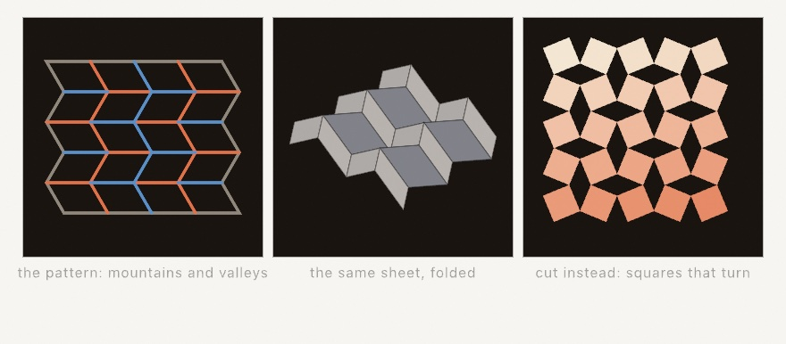
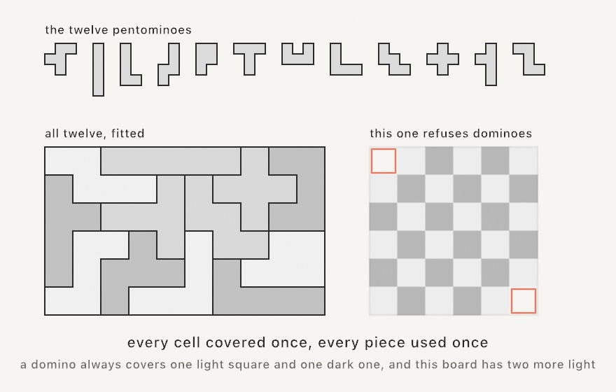
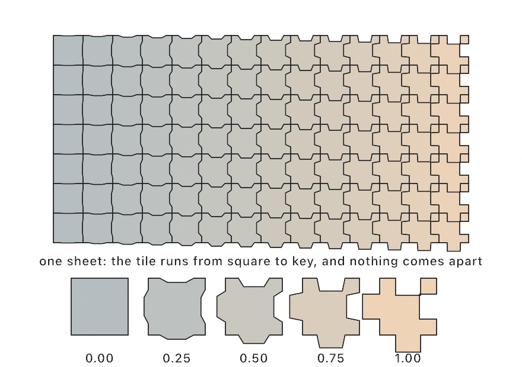

#### <sup>[Ollin](../README.md) → [Guide](README.md) → Chapter 7</sup>

---

# 7. Tiles that cover the plane


Every strand in this tangle is the same shape, a quarter circle. It is stamped into a grid a couple of hundred times, and each copy is spun by a coin flip. Nobody planned the long loops and corridors it makes. They come out of a rule each tile follows on its own, and that rule is the whole subject of this chapter. A tile only has to meet its neighbors correctly at the edges. Everything you can see across the page is a consequence of that one small promise.

[Chapter 6](06-GridsAndRepetition.md) built the grid these sit in. Here the cells stop being containers and start agreeing with each other. By the end you'll have the tangle above, and a click that re-rolls it forever. The tiles get stranger as the chapter goes: one coin per grid line instead of one per cell, a pair of shapes that can never repeat however you lay them, a single shape that manages the same trick alone, and a tiling that needs more room than a flat page has.

## Tiles that agree at their edges: Truchet

[Chapter 6](06-GridsAndRepetition.md)'s pinwheel quilt hinted at this. When identical parts meet their cell edges the same way, random spins still fit. In 1704 a French priest named Sébastien Truchet worked out how far that idea goes, and the tiles named after him are its purest form. Ollin ships two as `drawTruchet`:

```swift
randomSeed(4)
stroke(.white)
strokeWeight(7)
strokeCap(.round)
noFill()
drawTruchet(columns: 8, rows: 8, tile: .arcs)
```

<picture>
  <source media="(prefers-color-scheme: dark)" srcset="Images/07-Tiles/TruchetTiles-dark.jpg">
  
</picture>

`.arcs` is two quarter circles per cell, while `.diagonals` is a single corner-to-corner stroke. If you've ever seen the famous one-line maze program from 1982 home computers, that's exactly this tile. Both look far more planned than a coin flip per cell should allow, and the diagram below is the reason:

<picture>
  <source media="(prefers-color-scheme: dark)" srcset="Images/07-Tiles/TruchetJoins-dark.jpg">
  
</picture>

The arc tile touches its cell's boundary in only four places, the edge midpoints, no matter which way it's spun. Think of the midpoints as doorways. Every tile has a doorway in the middle of each wall. So whatever your neighbor did, your marks and theirs meet at the doorway and flow through. Local rule, global order. Each tile only promises to hit its own doorways. The loops, corridors, and long wandering strands emerge across the whole canvas, with no tile knowing about them.

The tiling is drawn from the seeded `random`, so it's reproducible like everything since [Chapter 4](04-Randomness.md). Same seed, same maze. And when the plain white line-work isn't enough, `truchet(columns:rows:tile:)` hands you the raw strands instead of drawing them. That is one list of points per arc, which is exactly what the finished piece wants.

## One coin per line: hitomezashi

Truchet spent one coin flip per cell. Hitomezashi, the one-stitch pattern of Japanese sashiko embroidery, spends even less: one flip per grid *line*. Every line carries a row of short dashes over alternating cells. The line's single bit picks which alternation, starting on the edge or one cell in. That's the whole rule. Neighboring lines shift against each other, so the dashes meet at the crossings and join into steps, staircases, and closed loops. A handful of coin flips reads as woven cloth.

```swift
seed(11)
stroke(.white); strokeWeight(4); strokeCap(.round)
drawHitomezashi(columns: 24, rows: 24)
```

One design has two faces, and `hitomezashi(columns:rows:)` hands you both. `.stitches` is the thread: one short strand per dash, ready for color, hatching, or a pen plotter, just like the Truchet strands above. `.parities` is the cloth. Every hitomezashi design splits into regions that exactly two tones can fill, and `parities` says which tone each cell wears. Draw the fill first and the stitches after, and every tone boundary lands exactly under a stitch:

```swift
let design = hitomezashi(columns: 24, rows: 24)
for (cell, tone) in zip(design.grid.cells, design.parities) {
    fill(tone ? Color(hex: 0x2C4A7F) : Color(hex: 0x18264A))
    drawRect(cell.frame)
}
stroke(Color(hex: 0xF2E9DC)); strokeWeight(4); strokeCap(.round)
for dash in design.stitches { drawPolyline(dash.points, closed: false) }
```

<picture>
  <source media="(prefers-color-scheme: dark)" srcset="Images/07-Tiles/HitomezashiFaces-dark.jpg">
  
</picture>

Bias the flips with `probability:` and the weave drifts into long diagonal staircases. Or skip the coin entirely. `Hitomezashi(grid:rowBits:columnBits:)` takes explicit bits, and shorter arrays repeat along their lines. A favorite trick encodes a word as bits, a vowel as a 1, so a name becomes a design.

## One coin per cell: a maze of diagonals

Hitomezashi spends one coin per grid *line*. Spend one per grid *cell* instead, and let the coin choose between two diagonals, and you get the other famous one-rule pattern.

<picture>
  <source media="(prefers-color-scheme: dark)" srcset="Images/07-Tiles/DiagonalMaze-dark.jpg">
  
</picture>

```swift
seed(6)
let maze = tenPrint(columns: 40, rows: 40)
stroke(.white); strokeWeight(6); strokeCap(.round)
for run in maze.runs { drawPolyline(run.points) }
```

That is the whole rule, and it is famous for being the whole rule. The picture came from a one-line program on an early home computer, printed forever down the screen, and people have been rewriting it in every language since.

What makes it more than a field of loose marks is that the diagonals **meet at the cells' corners**. Two neighbors that lean toward each other make a longer line, four that agree make a box, and the eye reads the whole field as paths rather than as marks. `runs` is that reading made real: the same diagonals joined end to end wherever they meet. The right panel above gives each joined run its own color, which is the clearest way to see what was already there.

Two things worth knowing before you use it. `strokeCap(.round)` is what makes the corners read as turns instead of notches. And `probability` biases the coin: pushed toward 0 or 1 the field combs into long parallel diagonals with the odd cell crossing them, which is quieter and, to some eyes, better.

## No coins at all: kolam and sona

Truchet spends a coin per cell. Hitomezashi spends one per line. This one spends none, and it is still the least predictable of the three.

Put down a field of dots. Launch a single line between them at 45 degrees. When it reaches the edge of the field it turns, like a ball on a billiard table, and carries on. Eventually it arrives back where it started, and the drawing is the path it took:

```swift
stroke(.white); strokeWeight(6); strokeJoin(.round)
drawKolam(columns: 7, rows: 5)
```

Here is the part worth keeping. **How many separate loops you get is decided before you draw anything.** It is the greatest common divisor of the two side counts. Seven by five share no factor, so that field is one unbroken line. Six by four share two, so that field is two loops that never touch. Five by five is five. You can pick the outcome by picking the numbers, which is not something most generative rules will let you do.

<picture>
  <source media="(prefers-color-scheme: dark)" srcset="Images/07-Tiles/KolamLoops-dark.jpg">
  
</picture>

This is an old idea in more than one place. In south India a **kolam** is chalked on the doorstep at dawn, around a grid of pulli, the dots. In Angola a **sona** is drawn in sand with one finger while the story that goes with it is told. Drawing it in a single unbroken line is the point in both, which is why the count matters to the people who draw them.

The third panel is how you steer it. A **wall** sits between two neighboring dots, and the line bounces off that too:

```swift
let design = kolam(columns: 7, rows: 5,
                   mirrors: [.rightOf(column: 2, row: 1), .below(column: 4, row: 2)])
```

Every wall inside the field moves the count by exactly one. It either cuts a loop in two or joins two into one, never more. So you can start from a field of the size you want and walk the count down to one, wall by wall. That is how the figures of a sona are built.

The value hands you `loops` as closed contours and `dots` as the field, so the line is geometry rather than a picture. Stroke it, cut it with the booleans, or send it to a pen plotter. A plotter draws it the way it was meant to be drawn, without lifting the pen. The walk turns square corners, and `smoothed(iterations:)` rounds them into the chalked form. `drawKolam` does that rounding for you.

## The same line, woven: Celtic knotwork

Give that line width, and one more rule, and it becomes something else entirely.

Wherever two passes meet, one has to go over and the other under. The rule that makes it work is that the choice **alternates**: follow any cord and it goes over, under, over, under, the whole way around. Knots drawn that way are called alternating, and that is what the eye reads as woven. Get it wrong in one place and the whole thing collapses into a heap of lines.

<picture>
  <source media="(prefers-color-scheme: dark)" srcset="Images/07-Tiles/KnotworkWeave-dark.jpg">
  
</picture>

`knotwork` hands the cords back **already broken where they dive under**, so stroking the pieces is the weave. There is nothing to mask and no draw order to get right:

```swift
let knot = knotwork(columns: 7, rows: 5)
for band in knot.bands(gap: 30) {
    let line = band.smoothed(iterations: 3)
    withState {
        stroke(.black); strokeWeight(22)          // the outline
        drawPolyline(line.points, closed: line.isClosed)
        stroke(.white); strokeWeight(15)          // the cord inside it
        drawPolyline(line.points, closed: line.isClosed)
    }
}
```

Draw one band at a time, outline then cord. The next band's outline is what cuts the last one where it passes over. The `withState` keeps the cord color from becoming that outline. `drawKnotwork` does all of that in one call when you don't need the pieces yourself.

Walls do the same job here as in the kolam, and a little more. Each one turns the line, so it joins or splits a cord, and it also removes the crossing that would have been at that spot. The middle panel is a plain plait. The right one is the same field with two pairs of walls in the middle. That is the whole distance between wallpaper and a knot with a shape.

## A pattern that folds: creases and cuts

The knot's rule was about drawing. This one is about paper.

A crease pattern is how a folded thing is written down. Every fold is a straight line on the flat sheet, and there are only two kinds. A **mountain** points up out of the sheet. A **valley** points down into it. Draw those lines and you have said everything about the finished form.

What is new here is that the pattern can be wrong. A tiling is a tiling whatever you do with it. A crease pattern is a set of instructions, and the paper is the test it has to pass.

Two laws decide it, and both look at a single vertex. **Kawasaki's law**: walk around the vertex and list the angles between one fold and the next. Add the first, take away the second, add the third, and keep going all the way around. The answer has to come to zero. **Maekawa's law**: count the mountains and the valleys meeting there. One count is always exactly two more than the other. `isFlatFoldable` asks both, at every vertex inside the sheet.

<picture>
  <source media="(prefers-color-scheme: dark)" srcset="Images/07-Tiles/CreaseAndFold-dark.jpg">
  
</picture>

The pattern on the left is the **Miura fold**, and it is the one worth knowing:

```swift
var sheet = MiuraFold(columns: 8, rows: 5, angle: .pi / 3)
drawCreases(sheet.pattern.fitted(in: bounds), .mountain)
```

You can read it off the picture. The zigzag folds running down the sheet are each one kind for their whole length, and they take turns across the sheet. The straight folds running across it change kind at every step. That is what a Miura pattern looks like, and you can spot one anywhere now.

The middle panel is the same sheet folded. `fold` runs from 0, the flat sheet, to 1, a flat packet, and `facets` hands back the panels in three dimensions:

```swift
sheet.fold = 0.5 * (1 - cos(time))
for panel in sheet.facets { ... }
```

Pull two opposite corners of a Miura sheet and the whole thing opens at once, in both directions together. There is no order of operations to remember. That is why it goes into maps, into medical stents, and into solar arrays that travel folded and open in orbit.

It does something stranger as well. The sheet gets narrower as it gets shorter. Squeeze a rubber band and it bulges out; this does the opposite, and `poissonRatio` is the negative number that says so.

The right panel is the other half of the craft. Kirigami is origami that is allowed to cut. `RotatingSquares` cuts a grid of squares, leaving a thread of material at each corner. The squares then turn one way and the next as the sheet is pulled:

```swift
var lattice = RotatingSquares(columns: 6, rows: 6, side: 90, ligament: 6)
lattice.opening = 0.5 * (1 - cos(time))
for square in lattice.squares { drawPolygon(square.points) }
```

Nothing stretches there either. The squares only turn, so the sheet grows the same amount in both directions at once.

Both patterns come out as ordinary geometry, which matters more here than usual. Run the sketch with `--export-svg` and the fold lines go to a scoring blade or a pen, and the cut lines go to a cutter. This is the one pattern in the chapter you can hold.

## Pieces that have to fit: polyominoes

Every tiling so far has been about *agreement*: neighbors that match at their edges. Here is the other kind of constraint, where the pieces have shapes and the only rule is that they fill the region exactly.

A polyomino is squares joined edge to edge. Five squares make a pentomino, and there are exactly twelve of them once a piece and its mirror count as one. Twelve pieces of five cover sixty squares, which is why the boards they are set against are always six by ten, five by twelve, four by fifteen, or three by twenty.



```swift
let board = Polyomino.rectangle(columns: 10, rows: 6)
guard let fit = tilePolyominoes(Polyomino.pentominoes, covering: board) else { return }
for placement in fit {
    for outline in placement.outlines(cellSize: 60) { drawShape(Shape(outline.points)) }
}
```

Write a piece by drawing it, `Polyomino([".X.", "XXX"])`, and ask it how many ways it can sit. A lopsided piece has eight, four turns and a mirror of each. A symmetric one has fewer: the plus has one. `outlines` hands back a placed piece's boundary as a closed contour, which is what makes a fit read as pieces rather than as squares.

Two switches change the puzzle. `reuse: true` lets a piece be used as often as it fits, which is a floor rather than a puzzle. `reflections: false` refuses to turn a piece over, and then a lopsided piece can no longer cover its own mirror.

**Sometimes there is no fit, and the answer is nil.** The famous case is on the right above: a board with two opposite corners cut off cannot be covered by dominoes, however long you try. Color it like a checkerboard and every domino covers one square of each color, but the cut board has two more of one color than the other. The search finds that out the hard way, by exhausting the whole space, so keep a region that might refuse down to a puzzle's size.

A fit of twelve pentominoes takes about a second, so solve it in `setup()` or on a click and animate the *drawing*. The placements come back in the order they were laid, so revealing them one at a time shows how the fit was found. The `Patterns/Pentominoes` example does exactly that.

## Tiles that never repeat: aperiodic tilings

Everything so far repeats. Slide a hex grid one cell over and it lands on itself. That regularity is most of its charm. But there are tile sets that *cannot* do this. However you lay them, the pattern never repeats, anywhere, ever. Order without repetition is a real, buildable thing.

<picture>
  <source media="(prefers-color-scheme: dark)" srcset="Images/07-Tiles/AperiodicTiles-dark.jpg">
  
</picture>

The famous pair is the **Penrose tiling**, two shapes whose edge rules force endless variety with perfect five-fold poise. They are kites and darts, or a thick and a thin rhombus. `penroseTiling` grows one to cover the canvas. Each tile tells you its `kind` and carries two `arcs`, the classic decoration whose ends meet across every edge. So the whole tiling becomes one weave of curves:

```swift
for tile in penroseTiling(.rhombs, tileEdge: 36) {
    fill(tile.kind == .thick ? .indigo : .navy)
    drawShape(tile.shape)
    stroke(.orange)
    for arc in tile.arcs { drawPolyline(arc.points, closed: false) }
}
```

There's no randomness in it. The variety is the geometry's own. And since 2023 there's something stranger, the **spectre**. It is a *single* shape that tiles the plane and can never repeat. Mathematicians called the search for it the einstein problem, "one stone". `spectreTiling(tileEdge:curve:)` grows a patch. Give `curve` about `0.5` and the edges bend, so the tile can't even be flipped over. Each tile flags the rare `isOdd` misfits that sit rotated 30° from all the others, which are exactly the accent marks the pattern wants.

Two more relatives round out the family, both on the [aperiodic tilings](../Docs/Drawing/AperiodicTilings.md) page. **Wang tiles** (`wangTiling`) are squares with colored edges that may only sit together where the colors agree. This is where never-repeating tilings were first discovered. Run the other way, with a seeded fill over a small friendly set, the edge rule turns independent random picks into one connected quilt. And **girih patterns** (`girihPattern`) take the Truchet doorway idea somewhere older and grander. From the midpoint of every tile edge, two rays walk into the tile at a chosen angle and stop where they meet another. Keep the crossings, erase the tiles, and an Islamic star pattern remains. It works over *any* edge-to-edge polygons, including your hex grid's cells and the five traditional girih tile shapes. The contact angle is one dial that morphs the whole design from spiky to woven:

```swift
let cells = hexGrid(columns: 9, rows: 8).cells.map(\.corners)
stroke(.white); noFill()
drawGirih(over: cells, angle: 60)   // 54° is the classic girih-tile angle
```

## More room than the page has: hyperbolic tiling

One last kind of repetition bends the page itself. Only three regular tilings fit on flat paper: triangles, squares, hexagons. The corners meeting at a vertex must sum to a full turn, and no other shape obliges. Hyperbolic geometry has room for all the rest. Seven-sided tiles meeting three to a corner, pentagons meeting four to a corner, any pair you like, as long as `(sides - 2) * (meeting - 2) > 4`. The Poincaré disk shows the whole infinite tiling at once: every tile is the same true size, only drawn smaller as it nears the circular horizon.

```swift
for tile in hyperbolicTiling(sides: 5, meeting: 4) {
    fill(tile.parity == 0 ? .ivory : .indigo)
    drawShape(tile.shape)
}
```

<picture>
  <source media="(prefers-color-scheme: dark)" srcset="Images/07-Tiles/HyperbolicDisks-dark.jpg">
  
</picture>

Each tile carries `parity`, which flips across every shared edge. When `meeting` is even, the two colors close cleanly around every vertex and the disk becomes a perfect curved checkerboard. When it's odd, fade by `depth` instead, the count of edge crossings out from the middle. And the disk has one more trick: pass a moving `viewpoint` and the camera pans across the tiling forever, tiles swelling as they reach the middle and shrinking away behind. The horizon never gets closer. The full reference is the [hyperbolic tiling](../Docs/Drawing/HyperbolicTiling.md) page; `Examples/Patterns/HyperbolicTiling` is the panning tour.

## A tile that changes as you read: parquet deformations

Every tiling so far repeats. One motif, laid down again and again, and the interest comes from how the copies meet. This last one breaks that rule on purpose: the tile is a little different in every cell, so reading the sheet from left to right you watch a square turn into an interlocking key, and the pattern is the *change* rather than the motif.

The obvious way to attempt this is the way that fails. Draw a tile, draw a slightly different tile beside it, and try to make their touching edges agree. You will be at it all afternoon, and one adjustment will break the neighbor you fixed a minute ago. The way out is to stop thinking about tiles at all.

Put the geometry on the **edges of the grid** instead. Give every edge a curve. A tile is then not something you draw; it is whatever the four edges around it happen to enclose, and the tile on the far side of any edge is built from that same curve, read backwards. Nothing can come apart, because there are no two versions of an edge to disagree.

That leaves you free to make the edges do anything. Each one is a `Profile`: a little curve in the edge's own frame, running from one grid corner to the other, with `y` as how far it wanders sideways. The ends are pinned, so the grid's corners stay put while everything between them moves.

```swift
let sheet = parquetDeformation(columns: 14, rows: 7,
                               from: .straight, to: .tooth(depth: 0.3))
stroke(.black); strokeWeight(2)
for edge in sheet.edges { drawPolyline(edge.points, closed: false) }
```

<picture>
  <source media="(prefers-color-scheme: dark)" srcset="Images/07-Tiles/ParquetRun-dark.jpg">
  
</picture>

Each edge blends the `from` profile into the `to` profile by how far across the sheet it sits, and the five tiles under the figure are that run stood still: the same piece at a quarter, a half, three quarters of the way over. Every neighbor in the sheet differs by about a fourteenth of that, which is little enough that the eye reads one tiling rather than a row of different ones.

The profiles are `.straight`, `.tooth`, `.zigzag`, `.wave`, `.bump`, and `.custom` for one you write out yourself. Any of them can be the start or the end, so `.wave(depth: 0.22)` running into `.tooth(depth: 0.3)` melts a soft pinwheel into a square key. Where the run goes is a `sweep`: left to right by default, or `.vertical`, `.diagonal`, `.radial` for a sheet that blooms out of its own middle.

The interesting sheets come from the other form of the builder, which takes a closure instead of a sweep. It hands you a point and asks how far along the run that point sits, and you can answer with anything: noise, the tone of a photograph, the distance from the mouse, or a front that slides with `time`:

```swift
let field = bounds.inset(by: .all(70))
let front = 0.5 + sin(time * 0.25) * 0.55
let sheet = ParquetDeformation(grid: Grid(in: field, columns: 15, rows: 15),
                               from: .wave(depth: 0.22),
                               to: .tooth(depth: 0.3, width: 0.42)) { point in
    smoothstep(front - 0.28, front + 0.28, (point.x - field.x) / field.width)
}
```

Now the whole sheet keeps turning one tile into the other and back, which is the form in time rather than in space. Two faces come out of it, as with hitomezashi: `tiles` for the interlocking pieces, each carrying the `amount` it was built at so you can color the drift, and `edges` for the line-work. Prefer `edges` when you are stroking, because it visits each grid edge exactly once. Stroking the tiles would draw every interior edge twice, which shows as a doubled line under a translucent stroke and costs a pen plotter a second pass over each one.

One thing to expect: the tiles on the outside of the sheet carry their deformed outer edges too, so the border comes out fringed rather than straight. That is honest, since every tile really is the shape the run asks for, but if you want a clean rectangle, cut the tiles against the bounds with the shape booleans from [Chapter 15](15-ShapesAsMaterial.md). The full reference is the [parquet deformations](../Docs/Drawing/ParquetDeformation.md) page; `Examples/Patterns/ParquetDeformation` is the moving front.

The form has a history worth knowing. It was a studio exercise William Huff set his design students from the 1960s on, drawn by hand on paper, and Douglas Hofstadter gave it a wider audience in a 1983 column. Reading it as a curve interpolated across a tiling, which is what makes it something a computer can do, is Craig Kaplan's.

## Putting it together: a meandering tangle

Now you can build the image at the top. The plan is to lay Truchet arcs over a grid, then stroke every strand twice. A wide pass in a dark rim tone comes first, then a narrower colored pass on top. The strands then read as piping with a little depth. For the color, reach back to [Chapter 5](05-Noise.md) and sample `noise` at each strand's midpoint. Neighbors then wear neighboring colors, and the palette drifts across the tangle like weather, slowly changing with `time`. Make a new file, `MySketches/Meander.swift`:

```swift
import Ollin

final class Meander: Sketch {
    @Param("Columns", 6...26) var columns = 14
    @Param("Seed", 1...9999) var quiltSeed = 3
    @Param("Diagonals") var diagonals = false

    let paper = Color(hex: 0x14161B)
    let ramp = Ramp([
        Color(hex: 0xF2542D), Color(hex: 0xF5DFBB),
        Color(hex: 0x0E9594), Color(hex: 0x127475),
    ])

    override func draw() {
        seed(quiltSeed)
        background(paper)
        noFill()
        strokeCap(.round)

        let cell = width / Double(columns)
        let strands = truchet(columns: columns, rows: columns,
                              tile: diagonals ? .diagonals : .arcs)

        // Two passes: first every strand slightly wide in a rim tone, then
        // the color on top, so strands running close stay separated.
        stroke(Color(hex: 0x2A2E38))
        strokeWeight(cell * 0.40)
        for strand in strands {
            drawPolyline(strand.points)
        }

        strokeWeight(cell * 0.26)
        for strand in strands {
            let mid = strand.midpoint
            let weather = noise(mid.x * 0.0016, mid.y * 0.0016, time * 0.06)
            stroke(ramp.color(at: weather))
            drawPolyline(strand.points)
        }
    }

    override func mousePressed() {
        quiltSeed += 1
    }
}
```

Run it, watch the colors migrate, and click for a fresh tangle. What each piece contributes:

- `seed(quiltSeed)` locks both `random` and `noise` at the top of every frame, so the layout holds still while `time` drifts the colors, and the Seed parameter (or a click) is a whole new piece.
- `truchet(...)` returns the strands as values instead of drawing them. Each is a contour, a list of points in `.points`, and `drawPolyline` strokes one list.
- The two passes are an old illustrator's trick. The rim pass is a touch wider than the color pass, so wherever two strands run close, a dark seam keeps them apart. Drawing *all* rims before *any* color is what keeps each strand's own segments merging smoothly into one pipe.
- `strand.midpoint` is the point halfway along a strand, and `noise` at that spot (scaled way down, [Chapter 5](05-Noise.md)'s zoom multiplier) picks its color from the ramp. Nearby strands ask nearby questions, so color arrives in weather-like patches instead of confetti.
- The parameters cover a lot of ground: `Columns` runs the piece from chunky plumbing at 6 to fine knitting at 26 (the stroke widths ride the cell size, so everything stays in proportion), and the `Diagonals` toggle swaps the whole mood from tangle to circuit board.

Before moving on, make it yours:

- Swap the ramp. Four colors change this piece more than anything else in it; try an all-warm set, or two blues and a shock of yellow.
- Color by strand *position* instead of noise: `mid.y / height` as the ramp's input turns the weather into a sunset gradient.
- Drop the rim pass's width to `cell * 0.55` and the color to `cell * 0.1` for wire-thin strands floating in fat shadows.
- Drive `strokeWeight` in the color pass from the same `weather` value, so warm patches also swell.

## Where this comes from

Truchet tiles are named for Sébastien Truchet, a French Carmelite priest. He published a memoir in 1704 on the patterns a single diagonally split tile can make, after watching ceramic tiles being laid for a château. The quarter-circle arc tile this chapter leans on is a later refinement by the metallurgist and historian Cyril Stanley Smith. His 1987 paper revisited Truchet's work, and connected it to how structure builds hierarchy in materials. Generative artists adopted it so thoroughly that "Truchet tiles" now usually *means* Smith's arcs. The diagonal tile has its own pop-culture monument. The Commodore 64 one-liner `10 PRINT CHR$(205.5+RND(1)); : GOTO 10` is a maze in thirty-eight characters. Its history got an entire excellent book, *10 PRINT*, by Nick Montfort and nine co-authors in 2012. Hitomezashi comes from a needle-first world rather than a mathematical one: a running-stitch mending tradition from Japan, worked one stitch per grid space. The mathematician Katherine Seaton, with Carol Hayes, showed its designs are exactly the one-bit-per-line encoding this chapter uses. She also proved the two-tone fill always works. Kolam and sona reach further back than any of it, and belong to the people who draw them rather than to a paper. What connects the two traditions was written down much later. Marcia Ascher's *Ethnomathematics* set the Indian kolam beside the Angolan sona. Paulus Gerdes spent decades recording sona in the field and working out their rules, the count of loops among them. Slavik Jablan named the general object a mirror curve, which is where the walls come from. Celtic knotwork is the same object again, wearing bands: the plait-and-breakline construction that Iain Bain set out for drawing them by hand, and that Peter Cromwell later described in the same mirror-curve terms. Crease patterns come from a craft with its own written mathematics. The two flat-folding laws are named for Toshikazu Kawasaki and Jun Maekawa, who set them down in the 1980s, and Jacques Justin found the first of them independently. The fold in the figure is the Miura-ori, devised by the astrophysicist Koryo Miura in 1970 for packing solar arrays into a rocket, and flown on Japan's Space Flyer Unit in 1995. Mark Schenk and Simon Guest later worked out its behavior as a material, including the pair of Poisson's ratios that multiply to one. The cut sheet is the rotating squares of Joseph Grima and Kenneth Evans, published in 2000, whose Poisson's ratio of exactly -1 is as far as a flat material can go. The pieces that have to fit are Solomon Golomb's. He named the polyomino in a 1953 talk to the Harvard Mathematics Club, published it the year after, and wrote a whole volume on them in 1965. Martin Gardner's column carried them to everybody else, as it did the spiral of numbers. The mutilated board is older than the name and has been used to teach the same lesson ever since: a proof can settle in one line what a search would take a long time to say. The never-repeating tiles have their own lineage. Hao Wang conjectured in 1961 that his edge-matching squares could always be made periodic, and his student Robert Berger proved him wrong. Roger Penrose got the tile count down to two in the 1970s. The one-tile question then stayed open until 2023. David Smith, a retired print technician playing with paper cutouts, found the hat. The spectre followed, with Joseph Myers, Craig Kaplan, and Chaim Goodman-Strauss. The girih strapwork method is E. H. Hankin's polygons-in-contact technique, formalized for the computer by Craig Kaplan. The five girih tiles decorate buildings from medieval Isfahan to Istanbul. The hyperbolic disk has the grandest lineage of all. The geometer H. S. M. Coxeter sent M. C. Escher a paper with a figure of a hyperbolic tessellation, and Escher wrote back that it gave him "quite a shock": it was the trick he had been hunting for years, infinity closed inside a circle. The *Circle Limit* woodcuts came out of that exchange, and Douglas Dunham later turned the construction into the computer algorithm this chapter's version descends from. The tile that changes as you read is William Huff's parquet deformation, set as a studio exercise from the 1960s on and carried to a wider audience by Douglas Hofstadter's 1983 column; Craig Kaplan later read it as a curve interpolated across a tiling, which is what makes it something a computer can draw. If the tangle left you wanting more, Christopher Carlson's multi-scale Truchet tiles are worth a look. They put arcs at mixed cell sizes that still agree at the edges. The maze of diagonals came from somewhere else entirely: a one-line program for a home computer of the early 1980s, passed around on paper and rewritten ever since. A whole book has been written about that one line. Full credits are in the project's [attribution notes](../ATTRIBUTION.md).

## Go deeper

- [Truchet](../Docs/Drawing/Truchet.md): both tiles, the contour output, and feeding the strands to booleans, hatching, or SVG export.
- [Hitomezashi](../Docs/Drawing/Hitomezashi.md): the stitch reference, the two faces, biased flips, and explicit bits for encoded designs.
- [Ten print](../Docs/Drawing/TenPrint.md): the two faces, biasing the coin, hand-authored bits, and what the joining does and does not promise.
- [Kolam and sona](../Docs/Drawing/Kolam.md): the full reference for `kolam` and `drawKolam`, the loops and dots, the walls, and the counting rule.
- [Celtic knotwork](../Docs/Drawing/Knotwork.md): `knotwork` and `drawKnotwork`, the bands already broken at each dive, the crossing count, and the two-tone draw.
- [Crease patterns](../Docs/Drawing/CreasePattern.md): `CreasePattern` and the two laws, `MiuraFold` with its rigid folding in three dimensions, `RotatingSquares`, joining creases into pen strokes, and taking a sheet to a cutter.
- [Polyominoes](../Docs/Generators/Polyominoes.md): the piece type, the twelve pentominoes and five tetrominoes, counting orientations, outlines, and the fitting search with its two switches.
- [Aperiodic tilings](../Docs/Drawing/AperiodicTilings.md): the full reference for `penroseTiling` (both variants and the arcs), `wangTiling` (tile sets, weights, the complete set), `girihPattern` (the contact angle, the five girih tiles, composing them edge to edge), and `spectreTiling`.
- [Hyperbolic tiling](../Docs/Drawing/HyperbolicTiling.md): the full `hyperbolicTiling` reference, every valid {p,q} pair, the parity and depth coloring hooks, and the panning viewpoint.
- [Parquet deformations](../Docs/Drawing/ParquetDeformation.md): the full `parquetDeformation` reference, the profile catalog, the four sweeps and the closure that replaces them, and the two faces.
- Appendix B draws the idea under all of it, one picture per entry: [Local rules, global structure](B-JustEnoughMath.md#local-rules-global-structure), and [Angles and circles](B-JustEnoughMath.md#angles-and-circles) for the arcs.
- Worked examples: [`Patterns/Truchet`](../Examples/Patterns/Truchet/Sketch.swift) (both tiles, animated), [`Patterns/Hitomezashi`](../Examples/Patterns/Hitomezashi/Sketch.swift) (both faces, on a breathing cloth), [`Patterns/Kolam`](../Examples/Patterns/Kolam/Sketch.swift) (the field resized live, with the loop count read out), [`Patterns/Knotwork`](../Examples/Patterns/Knotwork/Sketch.swift) (the weave with its walls switchable), [`Patterns/Penrose`](../Examples/Patterns/Penrose/Sketch.swift) (rhombs with breathing arcs), [`Patterns/WangTiles`](../Examples/Patterns/WangTiles/Sketch.swift) (the re-laying quilt), [`Patterns/Girih`](../Examples/Patterns/Girih/Sketch.swift) (the angle dial swept live, plus the decagon-and-pentagons medallion), [`Patterns/Spectre`](../Examples/Patterns/Spectre/Sketch.swift) (the einstein with a drifting tide), [`Patterns/HyperbolicTiling`](../Examples/Patterns/HyperbolicTiling/Sketch.swift) (the panning tour of six {p,q} pairs), [`Patterns/ParquetDeformation`](../Examples/Patterns/ParquetDeformation/Sketch.swift) (a square becoming a key under a front that slides back and forth), [`Patterns/CreasePattern`](../Examples/Patterns/CreasePattern/Sketch.swift) (a Miura sheet folding and unfolding beside its pattern, with the cut sheet a switch away), and [`Patterns/Pentominoes`](../Examples/Patterns/Pentominoes/Sketch.swift) (all twelve laid one at a time, with the tray emptying as they go).
- A teaser for later: [`Patterns/WaveFunctionCollapse`](../Examples/Patterns/WaveFunctionCollapse/Sketch.swift) plays the agree-at-the-edges game with *constraints*, tiles that refuse certain neighbors, and [Chapter 13](13-GrowingThings.md) watches it solve.

---

[Contents](README.md#contents) · Previous: [Chapter 6, Grids and repetition](06-GridsAndRepetition.md) · Next: [Chapter 8, Words](08-Words.md)
