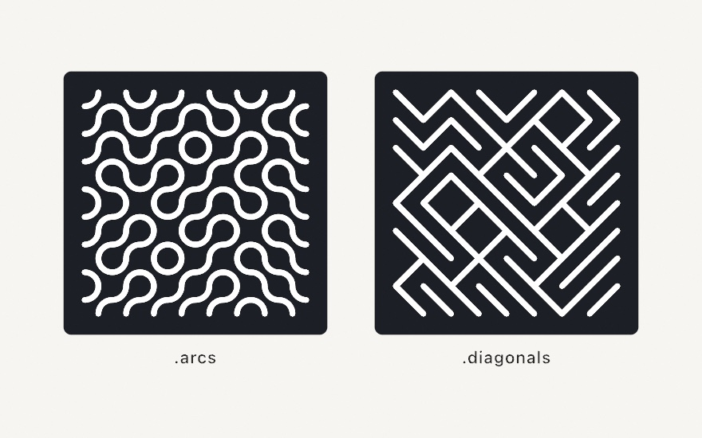
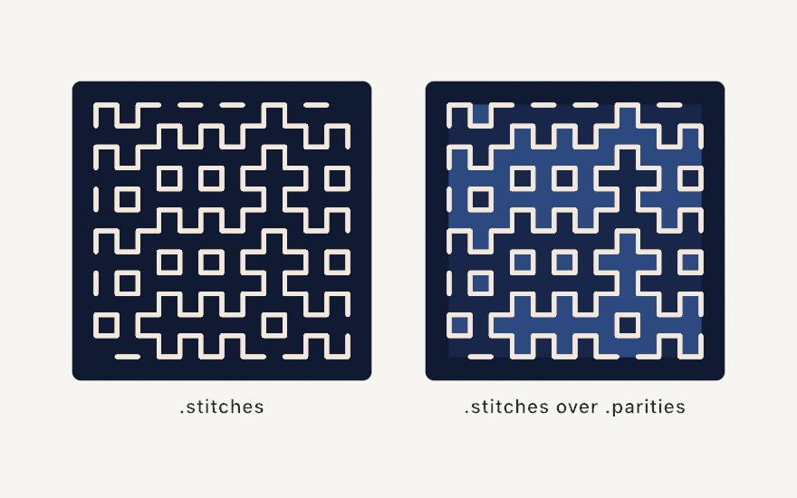
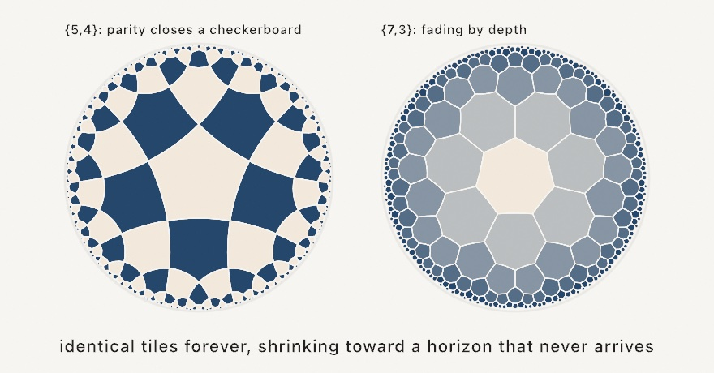

#### <sup>[Ollin](../README.md) → [Guide](README.md) → Chapter 7</sup>

---

# 7. Tiles that cover the plane


Every strand in this tangle is the same shape, a quarter circle. It is stamped into a grid a couple of hundred times, and each copy is spun by a coin flip. Nobody planned the long loops and corridors it makes. They come out of a rule each tile follows on its own, and that rule is the whole subject of this chapter. A tile only has to meet its neighbors correctly at the edges. Everything you can see across the page is a consequence of that one small promise.

[Chapter 6](06-GridsAndRepetition.md) built the grid these sit in. Here the cells stop being containers and start agreeing with each other. By the end you'll have the tangle above, and a click that re-rolls it forever. The tiles get stranger as the chapter goes: one coin per grid line instead of one per cell, a pair of shapes that can never repeat however you lay them, a single shape that manages the same trick alone, and a tiling that needs more room than a flat page has.

## Tiles that agree at their edges: Truchet

[Chapter 6](06-GridsAndRepetition.md)'s pinwheel quilt hinted at this. When identical parts meet their cell edges the same way, random spins still fit. In 1704 a French priest named Sébastien Truchet worked out how far that idea goes, and the tiles named after him are its purest form. Ollin ships two as `drawTruchet`:

```swift
randomSeed(4)
stroke(.white)
strokeWeight(7)
strokeCap(.round)
noFill()
drawTruchet(columns: 8, rows: 8, tile: .arcs)
```



`.arcs` is two quarter circles per cell, while `.diagonals` is a single corner-to-corner stroke. If you've ever seen the famous one-line maze program from 1982 home computers, that's exactly this tile. Both look far more planned than a coin flip per cell should allow, and the diagram below is the reason:


The arc tile touches its cell's boundary in only four places, the edge midpoints, no matter which way it's spun. Think of the midpoints as doorways. Every tile has a doorway in the middle of each wall. So whatever your neighbor did, your marks and theirs meet at the doorway and flow through. Local rule, global order. Each tile only promises to hit its own doorways. The loops, corridors, and long wandering strands emerge across the whole canvas, with no tile knowing about them.

The tiling is drawn from the seeded `random`, so it's reproducible like everything since [Chapter 4](04-Randomness.md). Same seed, same maze. And when the plain white line-work isn't enough, `truchet(columns:rows:tile:)` hands you the raw strands instead of drawing them. That is one list of points per arc, which is exactly what the finished piece wants.

## One coin per line: hitomezashi

Truchet spent one coin flip per cell. Hitomezashi, the one-stitch pattern of Japanese sashiko embroidery, spends even less: one flip per grid *line*. Every line carries a row of short dashes over alternating cells. The line's single bit picks which alternation, starting on the edge or one cell in. That's the whole rule. Neighboring lines shift against each other, so the dashes meet at the crossings and join into steps, staircases, and closed loops. A handful of coin flips reads as woven cloth.

```swift
seed(11)
stroke(.white); strokeWeight(4); strokeCap(.round)
drawHitomezashi(columns: 24, rows: 24)
```

One design has two faces, and `hitomezashi(columns:rows:)` hands you both. `.stitches` is the thread: one short strand per dash, ready for color, hatching, or a pen plotter, just like the Truchet strands above. `.parities` is the cloth. Every hitomezashi design splits into regions that exactly two tones can fill, and `parities` says which tone each cell wears. Draw the fill first and the stitches after, and every tone boundary lands exactly under a stitch:

```swift
let design = hitomezashi(columns: 24, rows: 24)
for (cell, tone) in zip(design.grid.cells, design.parities) {
    fill(tone ? Color(hex: 0x2C4A7F) : Color(hex: 0x18264A))
    drawRect(cell.frame)
}
stroke(Color(hex: 0xF2E9DC)); strokeWeight(4); strokeCap(.round)
for dash in design.stitches { drawPolyline(dash.points, closed: false) }
```



Bias the flips with `probability:` and the weave drifts into long diagonal staircases. Or skip the coin entirely. `Hitomezashi(grid:rowBits:columnBits:)` takes explicit bits, and shorter arrays repeat along their lines. A favorite trick encodes a word as bits, a vowel as a 1, so a name becomes a design.

## Tiles that never repeat: aperiodic tilings

Everything so far repeats. Slide a hex grid one cell over and it lands on itself. That regularity is most of its charm. But there are tile sets that *cannot* do this. However you lay them, the pattern never repeats, anywhere, ever. Order without repetition is a real, buildable thing.


The famous pair is the **Penrose tiling**, two shapes whose edge rules force endless variety with perfect five-fold poise. They are kites and darts, or a thick and a thin rhombus. `penroseTiling` grows one to cover the canvas. Each tile tells you its `kind` and carries two `arcs`, the classic decoration whose ends meet across every edge. So the whole tiling becomes one weave of curves:

```swift
for tile in penroseTiling(.rhombs, tileEdge: 36) {
    fill(tile.kind == .thick ? .indigo : .navy)
    drawShape(tile.shape)
    stroke(.orange)
    for arc in tile.arcs { drawPolyline(arc.points, closed: false) }
}
```

There's no randomness in it. The variety is the geometry's own. And since 2023 there's something stranger, the **spectre**. It is a *single* shape that tiles the plane and can never repeat. Mathematicians called the search for it the einstein problem, "one stone". `spectreTiling(tileEdge:curve:)` grows a patch. Give `curve` about `0.5` and the edges bend, so the tile can't even be flipped over. Each tile flags the rare `isOdd` misfits that sit rotated 30° from all the others, which are exactly the accent marks the pattern wants.

Two more relatives round out the family, both on the [aperiodic tilings](../Docs/Drawing/AperiodicTilings.md) page. **Wang tiles** (`wangTiling`) are squares with colored edges that may only sit together where the colors agree. This is where never-repeating tilings were first discovered. Run the other way, with a seeded fill over a small friendly set, the edge rule turns independent random picks into one connected quilt. And **girih patterns** (`girihPattern`) take the Truchet doorway idea somewhere older and grander. From the midpoint of every tile edge, two rays walk into the tile at a chosen angle and stop where they meet another. Keep the crossings, erase the tiles, and an Islamic star pattern remains. It works over *any* edge-to-edge polygons, including your hex grid's cells and the five traditional girih tile shapes. The contact angle is one dial that morphs the whole design from spiky to woven:

```swift
let cells = hexGrid(columns: 9, rows: 8).cells.map(\.corners)
stroke(.white); noFill()
drawGirih(over: cells, angle: 60)   // 54° is the classic girih-tile angle
```

## More room than the page has: hyperbolic tiling

One last kind of repetition bends the page itself. Only three regular tilings fit on flat paper: triangles, squares, hexagons. The corners meeting at a vertex must sum to a full turn, and no other shape obliges. Hyperbolic geometry has room for all the rest. Seven-sided tiles meeting three to a corner, pentagons meeting four to a corner, any pair you like, as long as `(sides - 2) * (meeting - 2) > 4`. The Poincaré disk shows the whole infinite tiling at once: every tile is the same true size, only drawn smaller as it nears the circular horizon.

```swift
for tile in hyperbolicTiling(sides: 5, meeting: 4) {
    fill(tile.parity == 0 ? .ivory : .indigo)
    drawShape(tile.shape)
}
```



Each tile carries `parity`, which flips across every shared edge. When `meeting` is even, the two colors close cleanly around every vertex and the disk becomes a perfect curved checkerboard. When it's odd, fade by `depth` instead, the count of edge crossings out from the middle. And the disk has one more trick: pass a moving `viewpoint` and the camera pans across the tiling forever, tiles swelling as they reach the middle and shrinking away behind. The horizon never gets closer. The full reference is the [hyperbolic tiling](../Docs/Drawing/HyperbolicTiling.md) page; `Examples/Patterns/HyperbolicTiling` is the panning tour.

## Putting it together: a meandering tangle

Now you can build the image at the top. The plan is to lay Truchet arcs over a grid, then stroke every strand twice. A wide pass in a dark rim tone comes first, then a narrower colored pass on top. The strands then read as piping with a little depth. For the color, reach back to [Chapter 5](05-Noise.md) and sample `noise` at each strand's midpoint. Neighbors then wear neighboring colors, and the palette drifts across the tangle like weather, slowly changing with `time`. Make a new file, `MySketches/Meander.swift`:

```swift
import Ollin

final class Meander: Sketch {
    @Param("Columns", 6...26) var columns = 14
    @Param("Seed", 1...9999) var quiltSeed = 3
    @Param("Diagonals") var diagonals = false

    let paper = Color(hex: 0x14161B)
    let ramp = Ramp([
        Color(hex: 0xF2542D), Color(hex: 0xF5DFBB),
        Color(hex: 0x0E9594), Color(hex: 0x127475),
    ])

    override func draw() {
        seed(quiltSeed)
        background(paper)
        noFill()
        strokeCap(.round)

        let cell = width / Double(columns)
        let strands = truchet(columns: columns, rows: columns,
                              tile: diagonals ? .diagonals : .arcs)

        // Two passes: first every strand slightly wide in a rim tone, then
        // the color on top, so strands running close stay separated.
        stroke(Color(hex: 0x2A2E38))
        strokeWeight(cell * 0.40)
        for strand in strands {
            drawPolyline(strand.points)
        }

        strokeWeight(cell * 0.26)
        for strand in strands {
            let mid = strand.midpoint
            let weather = noise(mid.x * 0.0016, mid.y * 0.0016, time * 0.06)
            stroke(ramp.color(at: weather))
            drawPolyline(strand.points)
        }
    }

    override func mousePressed() {
        quiltSeed += 1
    }
}
```

Run it, watch the colors migrate, and click for a fresh tangle. What each piece contributes:

- `seed(quiltSeed)` locks both `random` and `noise` at the top of every frame, so the layout holds still while `time` drifts the colors, and the Seed knob (or a click) is a whole new piece.
- `truchet(...)` returns the strands as values instead of drawing them. Each is a contour, a list of points in `.points`, and `drawPolyline` strokes one list.
- The two passes are an old illustrator's trick. The rim pass is a touch wider than the color pass, so wherever two strands run close, a dark seam keeps them apart. Drawing *all* rims before *any* color is what keeps each strand's own segments merging smoothly into one pipe.
- `strand.midpoint` is the point halfway along a strand, and `noise` at that spot (scaled way down, [Chapter 5](05-Noise.md)'s zoom knob) picks its color from the ramp. Nearby strands ask nearby questions, so color arrives in weather-like patches instead of confetti.
- The knobs cover a lot of ground: `Columns` runs the piece from chunky plumbing at 6 to fine knitting at 26 (the stroke widths ride the cell size, so everything stays in proportion), and the `Diagonals` toggle swaps the whole mood from tangle to circuit board.

Before moving on, make it yours:

- Swap the ramp. Four colors change this piece more than anything else in it; try an all-warm set, or two blues and a shock of yellow.
- Color by strand *position* instead of noise: `mid.y / height` as the ramp's input turns the weather into a sunset gradient.
- Drop the rim pass's width to `cell * 0.55` and the color to `cell * 0.1` for wire-thin strands floating in fat shadows.
- Drive `strokeWeight` in the color pass from the same `weather` value, so warm patches also swell.

## Where this comes from

Truchet tiles are named for Sébastien Truchet, a French Carmelite priest. He published a memoir in 1704 on the patterns a single diagonally split tile can make, after watching ceramic tiles being laid for a château. The quarter-circle arc tile this chapter leans on is a later refinement by the metallurgist and historian Cyril Stanley Smith. His 1987 paper revisited Truchet's work, and connected it to how structure builds hierarchy in materials. Generative artists adopted it so thoroughly that "Truchet tiles" now usually *means* Smith's arcs. The diagonal tile has its own pop-culture monument. The Commodore 64 one-liner `10 PRINT CHR$(205.5+RND(1)); : GOTO 10` is a maze in thirty-eight characters. Its history got an entire excellent book, *10 PRINT*, by Nick Montfort and nine co-authors in 2012. Hitomezashi comes from a needle-first world rather than a mathematical one: a running-stitch mending tradition from Japan, worked one stitch per grid space. The mathematician Katherine Seaton, with Carol Hayes, showed its designs are exactly the one-bit-per-line encoding this chapter uses. She also proved the two-tone fill always works. The never-repeating tiles have their own lineage. Hao Wang conjectured in 1961 that his edge-matching squares could always be made periodic, and his student Robert Berger proved him wrong. Roger Penrose got the tile count down to two in the 1970s. The one-tile question then stayed open until 2023. David Smith, a retired print technician playing with paper cutouts, found the hat. The spectre followed, with Joseph Myers, Craig Kaplan, and Chaim Goodman-Strauss. The girih strapwork method is E. H. Hankin's polygons-in-contact technique, formalized for the computer by Craig Kaplan. The five girih tiles decorate buildings from medieval Isfahan to Istanbul. The hyperbolic disk has the grandest lineage of all. The geometer H. S. M. Coxeter sent M. C. Escher a paper with a figure of a hyperbolic tessellation, and Escher wrote back that it gave him "quite a shock": it was the trick he had been hunting for years, infinity closed inside a circle. The *Circle Limit* woodcuts came out of that exchange, and Douglas Dunham later turned the construction into the computer algorithm this chapter's version descends from. If the tangle left you wanting more, Christopher Carlson's multi-scale Truchet tiles are worth a look. They put arcs at mixed cell sizes that still agree at the edges. Full credits are in the project's [attribution notes](../ATTRIBUTION.md).

## Go deeper

- [Truchet](../Docs/Drawing/Truchet.md): both tiles, the contour output, and feeding the strands to booleans, hatching, or SVG export.
- [Hitomezashi](../Docs/Drawing/Hitomezashi.md): the stitch reference, the two faces, biased flips, and explicit bits for encoded designs.
- [Aperiodic tilings](../Docs/Drawing/AperiodicTilings.md): the full reference for `penroseTiling` (both variants and the arcs), `wangTiling` (tile sets, weights, the complete set), `girihPattern` (the contact angle, the five girih tiles, composing them edge to edge), and `spectreTiling`.
- [Hyperbolic tiling](../Docs/Drawing/HyperbolicTiling.md): the full `hyperbolicTiling` reference, every valid {p,q} pair, the parity and depth coloring hooks, and the panning viewpoint.
- Appendix B draws the idea under all of it, one picture per entry: [Local rules, global structure](B-JustEnoughMath.md#local-rules-global-structure), and [Angles and circles](B-JustEnoughMath.md#angles-and-circles) for the arcs.
- Worked examples: [`Patterns/Truchet`](../Examples/Patterns/Truchet/Sketch.swift) (both tiles, animated), [`Patterns/Hitomezashi`](../Examples/Patterns/Hitomezashi/Sketch.swift) (both faces, on a breathing cloth), [`Patterns/Penrose`](../Examples/Patterns/Penrose/Sketch.swift) (rhombs with breathing arcs), [`Patterns/WangTiles`](../Examples/Patterns/WangTiles/Sketch.swift) (the re-laying quilt), [`Patterns/Girih`](../Examples/Patterns/Girih/Sketch.swift) (the angle dial swept live, plus the decagon-and-pentagons medallion), [`Patterns/Spectre`](../Examples/Patterns/Spectre/Sketch.swift) (the einstein with a drifting tide), and [`Patterns/HyperbolicTiling`](../Examples/Patterns/HyperbolicTiling/Sketch.swift) (the panning tour of six {p,q} pairs).
- A teaser for later: [`Patterns/WaveFunctionCollapse`](../Examples/Patterns/WaveFunctionCollapse/Sketch.swift) plays the agree-at-the-edges game with *constraints*, tiles that refuse certain neighbors, and [Chapter 12](12-GrowingThings.md) watches it solve.

---

[Contents](README.md#contents) · Previous: [Chapter 6, Grids and repetition](06-GridsAndRepetition.md) · Next: [Chapter 8, Words and pictures](08-WordsAndPictures.md)
