#### <sup>[Ollin](../README.md) → [Guide](README.md) → Chapter 7</sup>

---

# 7. Tiles that cover the plane

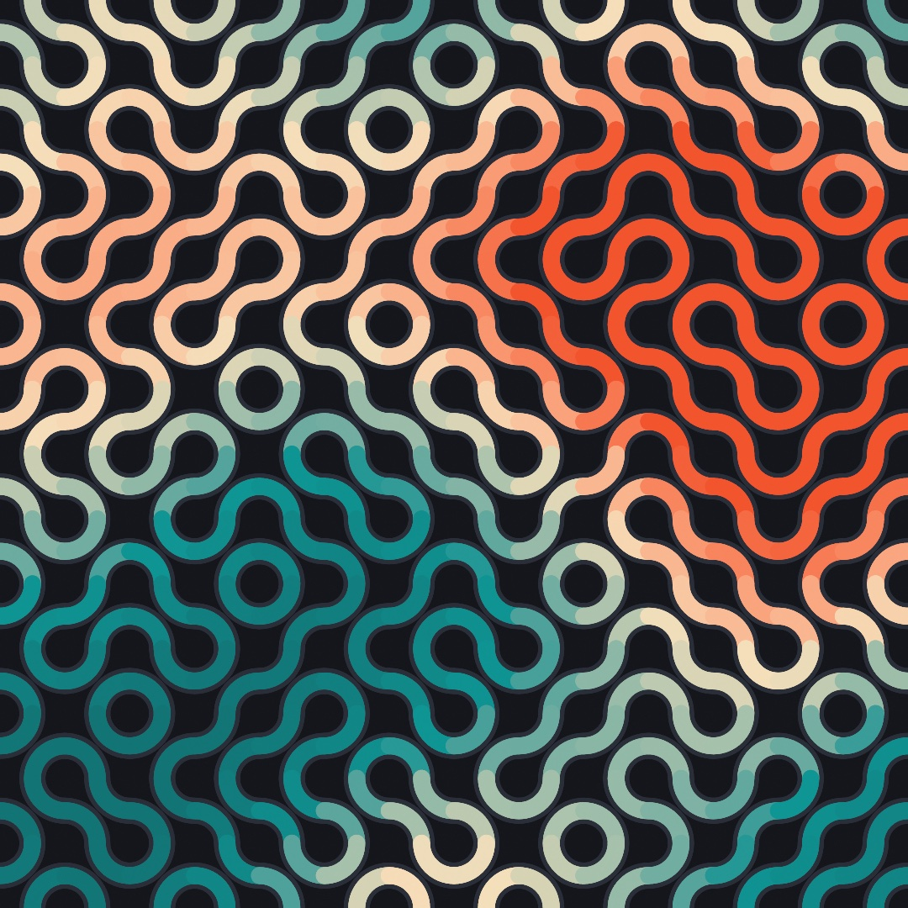

Every strand in the tangle above is the same quarter circle, stamped into a grid and spun by a coin flip. The long loops come from one rule each tile keeps on its own: it only has to meet its neighbors at its edges. This chapter teaches that rule through Truchet tiles, up to taking the strands back as values you stroke yourself. After the tangle come line-work that spends its chance differently, pieces that fit a region, and tilings past the repeating grid.

## Tiles that agree at their edges: Truchet

[Chapter 6](06-GridsAndRepetition.md)'s pinwheel quilt hinted at this. When identical parts meet their cell edges the same way, random spins still fit. In 1704 a French priest named Sébastien Truchet worked out how far that idea goes, and the tiles named after him are its simplest form. Ollin ships two as `drawTruchet`:

```swift
randomSeed(4)
stroke(.white)
strokeWeight(7)
strokeCap(.round)
noFill()
drawTruchet(columns: 8, rows: 8, tile: .arcs)
```

<picture>
  <source media="(prefers-color-scheme: dark)" srcset="Images/07-Tiles/TruchetTiles-dark.jpg">
  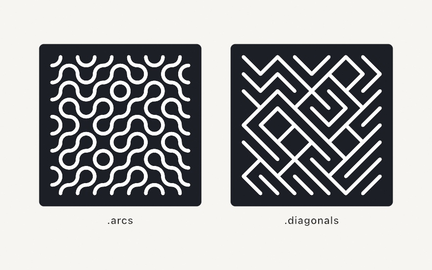
</picture>

`.arcs` is two quarter circles per cell, while `.diagonals` is a single corner-to-corner stroke. Both look far more planned than a coin flip per cell should allow, and the diagram below is the reason:

<picture>
  <source media="(prefers-color-scheme: dark)" srcset="Images/07-Tiles/TruchetJoins-dark.jpg">
  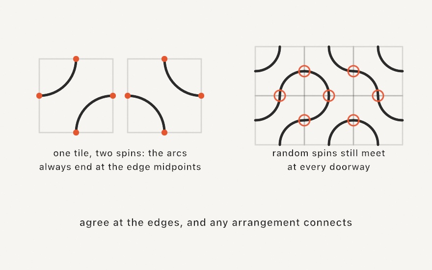
</picture>

The arc tile touches its cell's boundary in only four places, the edge midpoints, whichever way it is spun. Think of the midpoints as doorways. Every tile has a doorway in the middle of each wall, so whatever your neighbor did, your marks and theirs meet at the doorway and flow through. Each tile promises only to reach its own doorways. The loops, corridors, and long wandering strands appear across the canvas, with no tile knowing about them. That is a local rule making global order. Every pattern before the sketch comes back to it, and most of the ones after it do too.

The tiling is drawn from the seeded `random`, so it repeats from a seed like everything since [Chapter 4](04-Randomness.md). Same seed, same tangle.

### The diagonal tile: ten print

The diagonal tile has a history of its own. A one-line program on an early home computer printed it forever down the screen, choosing one of two slanted characters for every cell. People have rewritten that line in every language since, and the framework carries the tile under that name too. `tenPrint` lays the same field of diagonals and hands back both readings of it. `lines` is one diagonal per cell, and `runs` is the diagonals joined end to end wherever they meet:

```swift
seed(6)
let maze = tenPrint(columns: 40, rows: 40)
stroke(.white); strokeWeight(6); strokeCap(.round)
for run in maze.runs { drawPolyline(run.points) }
```

`drawPolyline` strokes a list of points as one open line, and `run.points` is that list. The next step says more about both.

<picture>
  <source media="(prefers-color-scheme: dark)" srcset="Images/07-Tiles/DiagonalMaze-dark.jpg">
  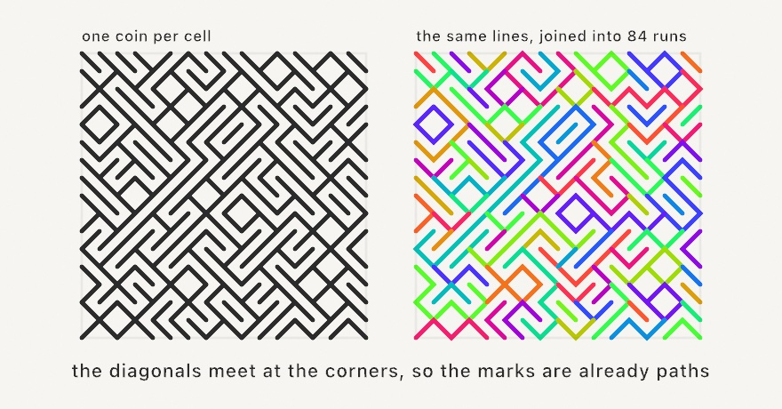
</picture>

The diagonals meet at the cells' corners, so the doorways here are the corners rather than the edge midpoints. Two neighbors that lean toward each other make a longer line, four that agree make a box, and the eye reads the field as paths. `runs` is that reading made into values. The figure's right panel, a smaller field than the listing's, gives each joined run its own color, which shows what was already there in the left one.

`strokeCap(.round)` makes the corners read as turns instead of notches. `probability:` biases the coin. Pushed toward 0 or 1, the field combs into long parallel diagonals with the odd cell crossing them, which is quieter.

## Strands as values: `truchet`

`drawTruchet` strokes the whole tiling in the current stroke, and that is as far as it goes. The tangle at the top of the chapter wants more: a color for each strand, and every strand drawn twice. For that you need the strands themselves. `truchet(columns:rows:tile:)` lays the same tiling and hands the line-work back instead of drawing it, as a list of contours. A **contour** is a list of points in order, open like a line or closed like an outline. It is the value under every line and outline in the framework, and [Chapter 6](06-GridsAndRepetition.md)'s `Shape` is made of closed ones. Here each contour is one quarter circle in one cell. An eight by eight grid hands back 128 of them, and a long loop in the picture is many strands meeting at the doorways.

```swift
seed(3)
let strands = truchet(columns: 8, rows: 8, tile: .arcs)
let ramp = Ramp([.orange, .ivory, .teal])
noFill(); strokeWeight(6); strokeCap(.round)
for (index, strand) in strands.enumerated() {
    stroke(ramp.color(at: Double(index) / Double(strands.count)))
    drawPolyline(strand.points)
}
```

Each strand carries its points in `.points`, and `drawPolyline` strokes one list of points as an open line. It is the open cousin of the `drawPolygon` that drew [Chapter 6](06-GridsAndRepetition.md)'s honeycomb, which closes the list back to its first point, and `closed: true` asks `drawPolyline` to do the same. `enumerated()` walks the list with a count, the way [Chapter 2](02-Color.md) walked a palette, so `index` climbs from 0 and the ramp hands each strand its own color. A strand also knows its `midpoint`, the point halfway along it, which is where the finished sketch asks `noise` for a color.

Holding the strands also lets you stroke each one more than once. Stroke every strand wide in a dark tone first, then narrower in color on top, and the strands read as piping with a little depth. The wide pass is a rim. Wherever two strands run close, the dark seam between them keeps them apart. Draw all the rims before any color, because a rim drawn later would cross an earlier strand's color at the doorway and cut the pipe there:

```swift
stroke(Color(hex: 0x2A2E38)); strokeWeight(16)
for strand in strands { drawPolyline(strand.points) }
strokeWeight(10)
for (index, strand) in strands.enumerated() {
    stroke(ramp.color(at: Double(index) / Double(strands.count)))
    drawPolyline(strand.points)
}
```

<picture>
  <source media="(prefers-color-scheme: dark)" srcset="Images/07-Tiles/TruchetStrands-dark.jpg">
  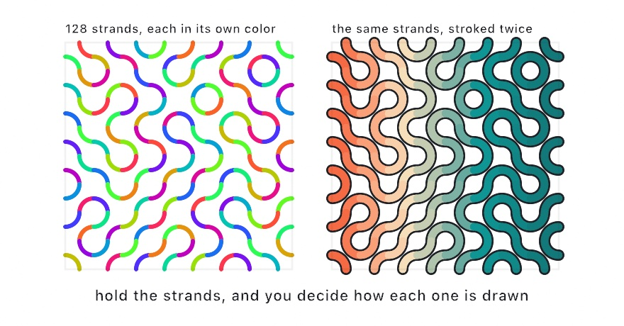
</picture>

Run it and the arcs merge into pipes, with the color running unbroken through every doorway. The same two passes, over a bigger grid and with the color taken from `noise`, are the finished sketch.

## Putting it together: a meandering tangle

Now you can build the image at the top. It composes the arcs from [Tiles that agree at their edges](#tiles-that-agree-at-their-edges-truchet) with the strands and the two passes from [Strands as values](#strands-as-values-truchet), and takes its color from [Chapter 5](05-Noise.md). Lay Truchet arcs over a grid, then stroke every strand twice, a wide pass in a dark rim tone and a narrower colored pass on top. For the color, sample `noise` at each strand's midpoint. Neighbors then wear neighboring colors, and the palette drifts across the tangle like weather, slowly changing with `time`. Make a new file, `MySketches/Meander.swift`:

```swift
import Ollin

final class Meander: Sketch {
    @Param("Columns", 6...26) var columns = 14
    @Param("Seed", 1...9999) var quiltSeed = 3
    @Param("Diagonals") var diagonals = false

    let paper = Color(hex: 0x14161B)
    let ramp = Ramp([
        Color(hex: 0xF2542D), Color(hex: 0xF5DFBB),
        Color(hex: 0x0E9594), Color(hex: 0x127475),
    ])

    override func draw() {
        seed(quiltSeed)
        background(paper)
        noFill()
        strokeCap(.round)

        let cell = width / Double(columns)
        let strands = truchet(columns: columns, rows: columns,
                              tile: diagonals ? .diagonals : .arcs)

        // Two passes: first every strand slightly wide in a rim tone, then
        // the color on top, so strands running close stay separated.
        stroke(Color(hex: 0x2A2E38))
        strokeWeight(cell * 0.40)
        for strand in strands {
            drawPolyline(strand.points)
        }

        strokeWeight(cell * 0.26)
        for strand in strands {
            let mid = strand.midpoint
            let weather = noise(mid.x * 0.0016, mid.y * 0.0016, time * 0.06)
            stroke(ramp.color(at: weather))
            drawPolyline(strand.points)
        }
    }

    override func mousePressed() {
        quiltSeed += 1
    }
}
```

Run it, watch the colors migrate, and click for a fresh tangle. What each part contributes:

- `seed(quiltSeed)` pins both `random` and `noise` at the top of every frame, so the layout holds still while `time` drifts the colors. The Seed parameter, or a click, deals a whole new tangle.
- `truchet(...)` returns the strands as values instead of drawing them. Each is a contour, a list of points in `.points`, and `drawPolyline` strokes one list.
- The two passes are an old illustrator's trick. The rim pass is a little wider than the color pass, so wherever two strands run close, a dark seam keeps them apart. Drawing all the rims before any color keeps the color unbroken through every doorway, so the arcs merge into one pipe.
- `strand.midpoint` is the point halfway along a strand, and `noise` at that spot picks its color from the ramp. The coordinates are scaled far down, [Chapter 5](05-Noise.md)'s zoom multiplier, so nearby strands ask nearby questions and the color arrives in patches instead of confetti.
- `Columns` runs the sketch from chunky plumbing at 6 to fine knitting at 26. The stroke widths follow the cell size, so everything stays in proportion. The `Diagonals` toggle swaps the tangle for a circuit board.

When a tangle is a keeper, export it as a still:

```sh
swift run OllinLive MySketches/Meander.swift --export tangle.png
```

Before moving on, make it yours:

- Swap the ramp. Four colors change this sketch more than anything else in it; try an all-warm set, or two blues and a shock of yellow.
- Color by strand *position* instead of noise: `mid.y / height` as the ramp's input turns the weather into a sunset gradient.
- Widen the rim pass to `cell * 0.55` and thin the color pass to `cell * 0.1` for wire-thin strands floating in fat shadows.
- Drive `strokeWeight` in the color pass from the same `weather` value, so warm patches also swell.

## Line-work from fewer coins: hitomezashi, mazes, kolam, and knotwork

The tangle spent one coin per cell and let the doorways do the rest. The patterns in this section keep the grid and move the chance somewhere else: one coin per grid line, a search that carves corridors, or no coin at all, with one line finding its own way around a field of dots. The tangle has no use for them. But each hands back its line-work as contours, the way `truchet` does, so everything the sketch did with strands works on them too.

### One coin per line: hitomezashi

Hitomezashi is the one-stitch pattern of sashiko, a Japanese mending tradition worked with a running stitch, one stitch per grid space. It gives you woven cloth from almost nothing: one coin flip per grid *line*, where Truchet spent one per cell. The mathematician Katherine Seaton, with Carol Hayes, showed that its designs are that and no more, one bit per line. She also proved that every design splits into regions two tones can fill.

Every line carries a row of short dashes over alternating cells. The line's single bit picks which alternation, starting on the edge or one cell in. That is the whole rule. Neighboring lines shift against each other, so the dashes meet at the crossings and join into steps, staircases, and closed loops.

```swift
seed(11)
stroke(.white); strokeWeight(4); strokeCap(.round)
drawHitomezashi(columns: 24, rows: 24)
```

One design has two faces, and `hitomezashi(columns:rows:)` hands you both. `.stitches` is the thread: one short strand per dash, ready for color, hatching, or a pen plotter, like the Truchet strands. `.parities` is the cloth, and it says which of the two tones each cell wears. Draw the fill first and the stitches after, and every tone boundary lands under a stitch:

```swift
let design = hitomezashi(columns: 24, rows: 24)
for (cell, tone) in zip(design.grid.cells, design.parities) {
    fill(tone ? Color(hex: 0x2C4A7F) : Color(hex: 0x18264A))
    drawRect(cell.frame)
}
stroke(Color(hex: 0xF2E9DC)); strokeWeight(4); strokeCap(.round)
for dash in design.stitches { drawPolyline(dash.points, closed: false) }
```

> **Swift note.** `zip(a, b)` pairs two lists up, first with first, second with second, so the loop receives one cell and its tone together. It stops at the end of the shorter list.

<picture>
  <source media="(prefers-color-scheme: dark)" srcset="Images/07-Tiles/HitomezashiFaces-dark.jpg">
  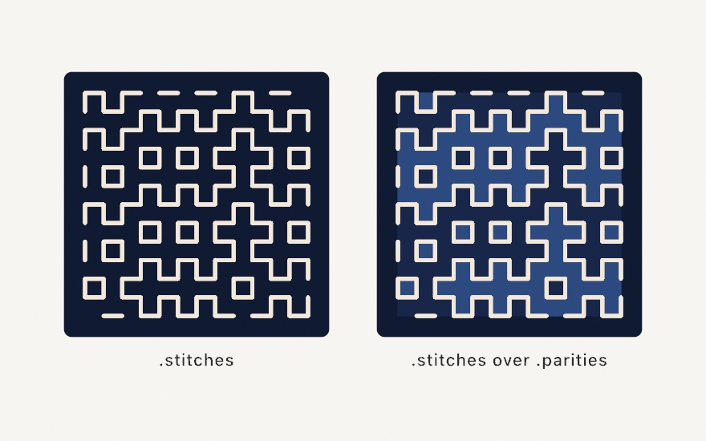
</picture>

Bias the flips with `probability:` and the weave drifts into long diagonal staircases. Or skip the coin. `Hitomezashi(grid:rowBits:columnBits:)` takes explicit bits, and shorter arrays repeat along their lines. A common trick encodes a word as bits, a vowel as a 1, so a name becomes a design. The reference is [Hitomezashi](../Docs/Drawing/Hitomezashi.md), and [`Patterns/Hitomezashi`](../Examples/Patterns/Hitomezashi/Sketch.swift) shows both faces on a breathing cloth.

### One route between any two: perfect mazes

The diagonals of `tenPrint` read as paths, but not as a maze you could solve. Four that lean together close a box, and whatever is inside it is sealed off. A **perfect maze** makes the opposite promise. Every cell is reachable, and there is exactly one route between any two, so it has no loops and no isolated pockets. It is the maze to draw when somebody is meant to solve it, or when you want the one hardest route through it as a line. The idea comes from graph theory. A perfect maze is a spanning tree of its grid, so every algorithm that carves one is a spanning-tree algorithm in costume.

<picture>
  <source media="(prefers-color-scheme: dark)" srcset="Images/07-Tiles/PerfectMaze-dark.jpg">
  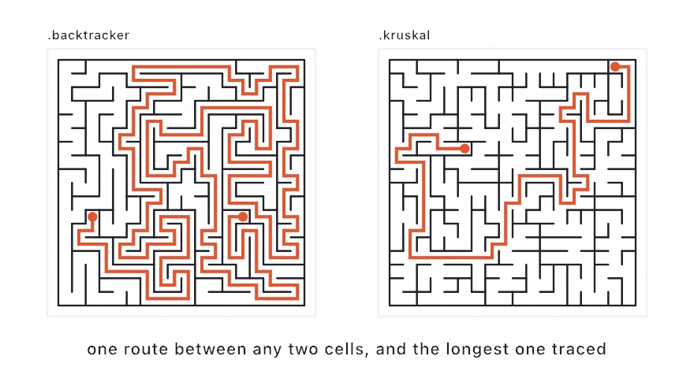
</picture>

```swift
seed(9)
let m = maze(columns: 24, rows: 24, algorithm: .kruskal)
stroke(.white); strokeWeight(4); strokeCap(.round)
drawMaze(m)
stroke(.orange)
drawPolyline(m.contour(of: m.longestPath(), in: bounds).points)
```

The algorithm you choose is a texture control as much as a technical one. `.backtracker`, a depth-first walk, gives long winding corridors. `.kruskal`, after Joseph Kruskal's 1956 method, gives an even sprawl of short dead ends. The same guarantee holds for both. `drawMaze` strokes the walls. The maze can also hand you its longest path, the single hardest route through it, whose two ends make a natural entrance and exit. The last line draws that path through the cell centers, and `bounds` there is the whole canvas as a rectangle, which every sketch has ready. [Mazes](../Docs/Drawing/Tiling.md#maze) has all three carving algorithms, and [`Patterns/Maze`](../Examples/Patterns/Maze/Sketch.swift) traces the longest path through each.

### No coins at all: kolam and sona

A kolam is drawn in south India on the doorstep at dawn, chalked around a grid of dots called pulli. A sona is drawn in Angola in sand, with one finger, while the story that goes with it is told. Both are one line that finds its own way around the dots, and drawing it without lifting the hand is the point in both traditions. That makes it the pattern for a pen plotter, which draws the whole design without lifting the pen, and for a doorstep motif of your own. Truchet spent a coin per cell and hitomezashi one per line. This one spends none. What connects the two traditions was written down much later. Marcia Ascher's *Ethnomathematics* set the kolam beside the sona, Paulus Gerdes spent decades recording sona in the field and working out their rules, and Slavik Jablan named the general object a mirror curve.

Put down a field of dots. Launch a single line between them at 45 degrees. When it reaches the edge of the field it turns, like a ball on a billiard table, and carries on. Eventually it arrives back where it started, and the drawing is the path it took:

```swift
stroke(.white); strokeWeight(6); strokeJoin(.round)
drawKolam(columns: 7, rows: 5)
```

`strokeJoin(.round)` rounds the corners where two segments of a stroke meet, the way `strokeCap` rounds a stroke's ends.

How many separate loops you get is decided before you draw anything. It is the greatest common divisor of the two side counts, the largest number that divides both. Seven by five share no factor, so that field is one unbroken line. Six by four share two, so that field is two loops that never touch. Five by five is five. You can pick the outcome by picking the numbers, which few generative rules allow.

<picture>
  <source media="(prefers-color-scheme: dark)" srcset="Images/07-Tiles/KolamLoops-dark.jpg">
  
</picture>

The third panel is how you steer it. A **wall** sits between two neighboring dots, and the line bounces off that too:

```swift
let design = kolam(columns: 7, rows: 5,
                   mirrors: [.rightOf(column: 2, row: 1), .below(column: 4, row: 2)])
```

Every wall inside the field moves the count by one. It either cuts a loop in two or joins two into one, never more. So you can start from a field of the size you want and walk the count down to one, wall by wall. That is how the figures of a sona are built.

The value hands you `loops` as closed contours and `dots` as the field, so the line is geometry. Stroke it, cut it with the shape booleans from [Chapter 15](15-ShapesAsMaterial.md), or send it to a pen plotter. The walk turns square corners, and `smoothed(iterations:)` rounds them into the chalked form. `drawKolam` does that rounding for you. [Kolam and sona](../Docs/Drawing/Kolam.md) is the reference, and [`Patterns/Kolam`](../Examples/Patterns/Kolam/Sketch.swift) resizes the field live with the loop count read out.

### The same line, woven: Celtic knotwork

Give the kolam's line width, and one more rule, and it becomes Celtic knotwork. It is the pattern to draw when you want a border, a panel, or a knot with a shape. The construction is the one Iain Bain set out for drawing them by hand, a plait of diagonal cords with break lines where the design wants a turn. Peter Cromwell later described the same construction in mirror-curve terms, which is why the framework builds it from the kolam's walk.

Wherever two passes meet, one has to go over and the other under. The rule that makes it work is that the choice **alternates**: follow any cord and it goes over, under, over, under, the whole way around. Knots drawn that way are called alternating, and that is what the eye reads as woven. Get it wrong in one place and the drawing collapses into a heap of lines.

<picture>
  <source media="(prefers-color-scheme: dark)" srcset="Images/07-Tiles/KnotworkWeave-dark.jpg">
  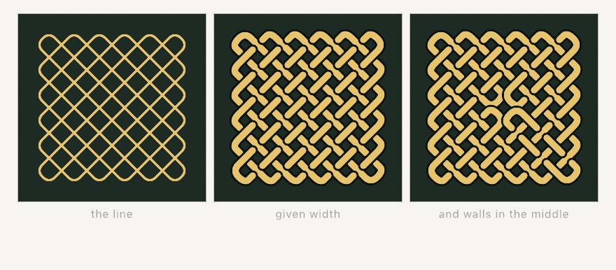
</picture>

To draw it, ask `knotwork` for its bands. `bands(gap:)` hands the cords back as pieces, **already broken where they dive under**, so stroking the pieces is the weave. (`cords` is the same line unbroken, for when you want the whole loop.) Stroke each band and the weave appears:

```swift
let knot = knotwork(columns: 7, rows: 5)
for band in knot.bands(gap: 30) {
    let line = band.smoothed(iterations: 3)
    withState {
        stroke(.black); strokeWeight(22)          // the outline
        drawPolyline(line.points, closed: line.isClosed)
        stroke(.white); strokeWeight(15)          // the cord inside it
        drawPolyline(line.points, closed: line.isClosed)
    }
}
```

Draw one band at a time, outline then cord. The next band's outline is what cuts the last one where it passes over. The `withState` keeps the cord color from becoming that outline, and `line.isClosed` says whether a band came back to its start, so the polyline closes only when the band does. `drawKnotwork` does all of that in one call when you don't need the pieces yourself.

Walls do the same job here as in the kolam, and a little more. Each one turns the line, so it joins or splits a cord, and it also removes the crossing that would have been at that spot. The middle panel is a plain plait. The right one is the same field with two pairs of walls in the middle, and that is the whole distance between wallpaper and a knot with a shape. [Celtic knotwork](../Docs/Drawing/Knotwork.md) is the reference, and [`Patterns/Knotwork`](../Examples/Patterns/Knotwork/Sketch.swift) has the walls switchable.

## Filling a region: polyominoes and Wave Function Collapse

Every pattern so far came from agreement: neighbors meeting at their edges, and the order across the page following from that. The techniques here fill a region under a stricter demand, and a coin flip alone cannot meet it. A polyomino puzzle gives the pieces shapes, and a search tries them until they cover the board exactly. Wave Function Collapse keeps the doorway rule, but instead of spinning each tile alone it keeps every cell's options open until each neighbor agrees. It can also learn its tiles from a picture. The tangle has no use for any of them.

### Pieces that have to fit: polyominoes

A polyomino is squares joined edge to edge. Five squares make a pentomino, and there are exactly twelve of them once a piece and its mirror count as one. Twelve pieces of five cover sixty squares, which is why the usual boards are six by ten, five by twelve, four by fifteen, or three by twenty. They are for puzzles, for floors, and for a reveal that lays the pieces one at a time. Solomon Golomb named them in a 1953 talk to the Harvard Mathematics Club, published them the year after, and wrote a book on them in 1965. Martin Gardner's column carried them to everybody else.

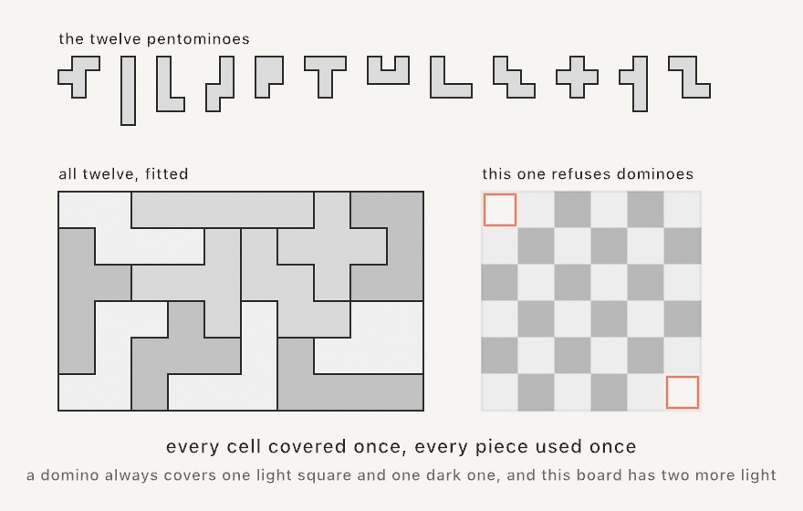

```swift
let board = Polyomino.rectangle(columns: 10, rows: 6)
guard let fit = tilePolyominoes(Polyomino.pentominoes, covering: board) else { return }
for placement in fit {
    for outline in placement.outlines(cellSize: 60) { drawShape(Shape(outline.points)) }
}
```

> **Swift note.** `guard let fit = ... else { return }` is `if let` turned around. It unwraps the optional and carries on, or leaves `draw()` right there when there was nothing. `drawShape` fills a `Shape` the way `drawRect` fills a rectangle, with the current fill and stroke.

Write a piece by drawing it, `Polyomino([".X.", "XXX"])`, and ask it how many ways it can sit. A lopsided piece has eight, four turns and a mirror of each. A symmetric one has fewer, and the plus has one. `outlines` hands back a placed piece's boundary as closed contours, which is what makes a fit read as pieces rather than as squares.

`reuse: true` lets a piece be used as often as it fits, which is a floor rather than a puzzle. `reflections: false` refuses to turn a piece over, and then a lopsided piece can no longer cover its own mirror.

Sometimes there is no fit, and the answer is `nil`. The classic case is on the right above: a board with two opposite corners cut off cannot be covered by dominoes, however long you try. Color it like a checkerboard and every domino covers one square of each color, but the cut board has two more of one color than the other. The search finds that out the hard way, by exhausting the space, so keep a region that might refuse down to a puzzle's size. The mutilated board is older than the name, and it teaches the same lesson every time: a proof can settle in one line what a search takes a long time to say.

A fit of twelve pentominoes takes about a second, so solve it in `setup()` or on a click and animate the *drawing*. The placements come back in the order they were laid, so revealing them one at a time shows how the fit was found. [Polyominoes](../Docs/Generators/Polyominoes.md) is the reference, and [`Patterns/Pentominoes`](../Examples/Patterns/Pentominoes/Sketch.swift) lays all twelve one at a time, with the tray emptying as they go.

### Every neighbor must agree: Wave Function Collapse

That fit was found by searching: the solver tries pieces until the board is full, or proves it never will be. Wave Function Collapse fills a grid by narrowing instead, and it goes back to the rule this chapter started from. It works from a small set of tiles under one demand: neighboring tiles must agree along their shared edge. It is the tool for a texture with structure, a pipe network, a map, a floor plan, that you describe by its tiles and never draw by hand. Maxim Gumin published it in 2016, named with a physicist's wink, and this tile-and-socket form is its simple-tiled model.

Each tile declares a *socket* per edge, pipe or blank in the classic set. The solver keeps every cell's options open, repeatedly settling the most-constrained cell and propagating what that choice forbids:

<picture>
  <source media="(prefers-color-scheme: dark)" srcset="Images/07-Tiles/TilesAgree-dark.jpg">
  
</picture>

Building the tileset is most of the work, and it is declarative. A tile is its four edge sockets, in the order top, right, bottom, left. `rotations()` mints the turned variants, and a `weight` makes a tile more or less common:

```swift
let blank = WFCTile([0, 0, 0, 0], weight: 1.1)
let line = WFCTile([1, 0, 1, 0], weight: 1.5).rotations(2)
let elbow = WFCTile([1, 1, 0, 0], weight: 1.2).rotations(4)
let tee = WFCTile([1, 1, 1, 0], weight: 0.5).rotations(4)
let tiles = [blank] + line + elbow + tee

let grid = wfc(tiles: tiles, columns: 11, rows: 11) ?? []   // tile indices, or nil for no fill
```

`wfc` is seeded like everything else, and it answers `nil` when no arrangement satisfies every socket, which the `?? []` above turns into an empty grid. `drawWFC` walks the solved grid cell by cell, handing you each cell's tile index and its rectangle. Draw a stroke from the cell's center to every edge whose socket is `1`, and that is the entire renderer for a pipe network:

```swift
drawWFC(grid) { index, cell in
    let sockets = tiles[index].sockets
    if sockets[0] == 1 { drawLine(cell.center, Vector2(cell.center.x, cell.y)) }   // top, and so on
}
```

One draw block covers a tile *and* its rotations, because you draw from the sockets, not from a picture per tile. [Wave Function Collapse](../Docs/Generators/WaveFunctionCollapse.md) is the reference, and [`Patterns/WaveFunctionCollapse`](../Examples/Patterns/WaveFunctionCollapse/Sketch.swift) re-rolls a fresh legal network every few seconds.

### Or hand it a picture instead: overlapping WFC

Declaring tiles and sockets is most of the work, and some textures don't come apart into tiles at all. So there is a second way to run the same solver. Give it a small picture and let it work the rules out itself. It is for a texture you can draw a swatch of but cannot describe as tiles, and it is the same algorithm's overlapping model.

It cuts the sample into every little square the sample contains, counts how often each one turns up, and notes which squares can overlap which. Then it fills a much larger grid so that every overlap agrees, and every square of the result is a square the sample already contained.

<picture>
  <source media="(prefers-color-scheme: dark)" srcset="Images/07-Tiles/LearnedFromAPicture-dark.jpg">
  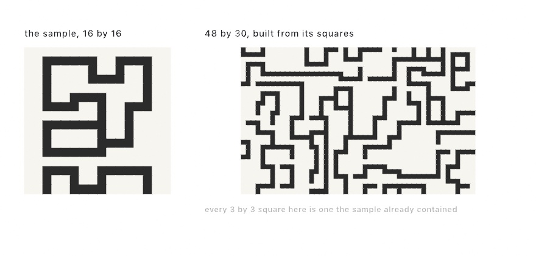
</picture>

Hand it a small `Image`, a sample of sixteen pixels square like the figure's, and ask for a size:

```swift
let texture = wfc(from: sample, width: 48, height: 30)   // an Image, or nil
```

Three parameters shape the result. `patternSize` is how big those squares are. `2` keeps only the loosest sense of the sample. `3` is the usual answer and holds on to corners and junctions. Larger reproduces whole motifs, but leaves less room to invent. `symmetry` decides whether the turned and mirrored copies of the sample are learned too. That multiplies what the solver has to work with, but it costs you which way is up. A sample of flowers standing on ground wants `symmetry: .none`, or they come back sideways. And `wrapsSample` decides whether the sample is read as joining its own edges. It is on by default, and it joins the bottom row to the top. Ground under sky becomes a legal square, and your ground repeats in bands up the picture. Turn it off for a sample with a top and a bottom.

The sample has to be **small and few-colored**, because squares are matched by exact color. Hand it a photograph and every square is unique, so there is nothing to recombine. And a solve **can fail**. It may paint itself into a corner where some cell has no square that fits, in which case it starts over. Past roughly fifty pixels a side, that starts happening often enough to matter. `wfc` hands back `nil` when it gives up. The tile sets that can never fail tend to be the ones too loose to produce structure. [`Patterns/TextureSynthesis`](../Examples/Patterns/TextureSynthesis/Sketch.swift) has three samples written in its source as rows of characters, so you can edit one and watch the texture change.

## Past the repeating grid: aperiodic tilings, de Bruijn rings, hyperbolic tilings, and parquet deformations

Every tiling so far sits on a grid that repeats. Slide a hex grid one cell over and it lands on itself, and that regularity is most of what makes a tiling read as one. The techniques here leave it behind, each in its own way. An aperiodic tile set never repeats however it is laid. A de Bruijn ring never repeats a window of beads. A hyperbolic tiling puts more corners at a vertex than flat paper allows. And a parquet deformation changes its tile a little in every cell. The tangle has no use for any of them, and each has a page of its own in the reference.

### Tiles that never repeat: aperiodic tilings

An aperiodic tile set covers the plane, but however you lay it the pattern never repeats, anywhere. It is for a design that wants order without a period: a floor, a screen, a woven field with five-fold symmetry that no grid can give. Hao Wang conjectured in 1961 that his edge-matching squares could always be made periodic. His student Robert Berger proved him wrong with a set of thousands, and Roger Penrose got the count down to two in the 1970s. The one-tile question then stayed open until 2023, when David Smith, a retired print technician playing with paper cutouts, found the hat. The spectre followed, with Joseph Myers, Craig Kaplan, and Chaim Goodman-Strauss.

<picture>
  <source media="(prefers-color-scheme: dark)" srcset="Images/07-Tiles/AperiodicTiles-dark.jpg">
  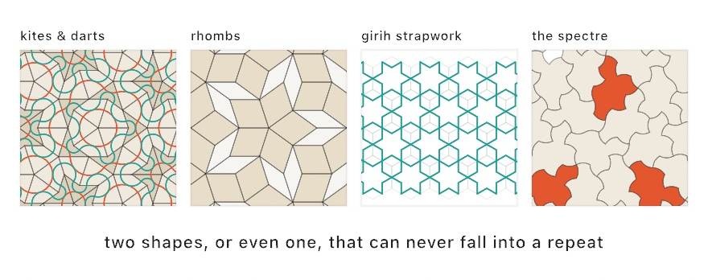
</picture>

The **Penrose tiling** is the pair: two shapes whose edge rules force endless variety with a five-fold order. They are kites and darts, or a thick and a thin rhombus. The colored arcs on the kites and darts in the first panel are the matching rule made visible. Two tiles may share an edge only where the arcs continue across it, and that rule is what forbids a repeat. `penroseTiling` grows a tiling to cover the canvas. Each tile tells you its `kind` and carries its two `arcs`, so the tiling becomes one weave of curves:

```swift
for tile in penroseTiling(.rhombs, tileEdge: 36) {
    fill(tile.kind == .thick ? .indigo : .navy)
    drawShape(tile.shape)
    stroke(.orange)
    for arc in tile.arcs { drawPolyline(arc.points, closed: false) }
}
```

There is no randomness in it. The variety is the geometry's own. The **spectre** is the single shape from 2023, and mathematicians called the search for it the einstein problem, "one stone". `spectreTiling(tileEdge:curve:)` grows a patch. Give `curve` about `0.5` and the edges bend, so the tile cannot even be flipped over. Each tile flags the rare `isOdd` misfits that sit rotated 30° from all the others, which are the accent marks the pattern wants.

Two more relatives are on the [aperiodic tilings](../Docs/Drawing/AperiodicTilings.md) page. **Wang tiles** (`wangTiling`) are the squares with colored edges that started the subject, which may only sit together where the colors agree. Run the other way, with a seeded fill over a small friendly set, the edge rule turns independent random picks into one connected quilt. And **girih patterns** (`girihPattern`) take the Truchet doorway idea somewhere older. From the midpoint of every tile edge, two rays walk into the tile at a chosen angle and stop where they meet another. Keep the crossings, erase the tiles, and an Islamic star pattern remains. The method is E. H. Hankin's polygons in contact, formalized for the computer by Craig Kaplan, and the five traditional girih tiles decorate buildings from medieval Isfahan to Istanbul. It works over *any* edge-to-edge polygons, your hex grid's cells included. The contact angle is one dial that morphs the design from spiky to woven:

```swift
let cells = hexGrid(columns: 9, rows: 8).cells.map(\.corners)
stroke(.white); noFill()
drawGirih(over: cells, angle: 60)   // 54° is the classic girih-tile angle
```

`\.corners` is a key path, the short way to write `{ $0.corners }`, so the first line collects every cell's corners into one list of polygons. [`Patterns/Penrose`](../Examples/Patterns/Penrose/Sketch.swift), [`Patterns/Spectre`](../Examples/Patterns/Spectre/Sketch.swift), [`Patterns/WangTiles`](../Examples/Patterns/WangTiles/Sketch.swift), and [`Patterns/Girih`](../Examples/Patterns/Girih/Sketch.swift) run the Penrose, spectre, Wang, and girih tilings live.

### Every window once: de Bruijn sequences

The aperiodic tiles never repeat across the whole plane. A ring of beads can make a different promise, about its short stretches. Take four colors and lay out sixty-four beads so that **every** run of three colors appears somewhere around the ring, and no run appears twice. That is a de Bruijn sequence, and it is as short as such a ring can be: there are sixty-four possible triples and each takes one place. It is for anything that has to know where it is from a glimpse. A rotary encoder finds its angle that way, and a camera finds its place on a printed ruler. The sequence is named for Nicolaas Govert de Bruijn, who counted the binary case in 1946. Camille Flye Sainte-Marie had done it in 1894, and Sanskrit prosodists had the eight-bead version as a memory word centuries before either.

<picture>
  <source media="(prefers-color-scheme: dark)" srcset="Images/07-Tiles/EveryWindowOnce-dark.jpg">
  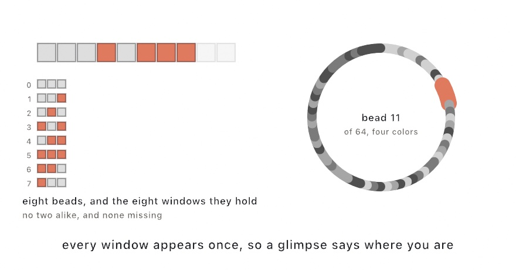
</picture>

```swift
let code = DeBruijnCode(symbols: 4, window: 3)
code.sequence            // 64 symbols, every triple exactly once
code.position(of: seen)  // where those three beads sit
```

The last line is the point. Hand `position(of:)` any three beads you glimpsed, as a list of their symbols, and it answers where on the ring you are, because no other three look the same. The answer is an optional, `nil` for a run of three the ring does not hold. Nothing has to be counted or remembered, only glimpsed.

The run always starts with a row of zeros, because the one Ollin builds is the smallest in dictionary order. The same arguments always give the same run, so a sketch built on it reproduces.

**The run is a ring**, so reading it means wrapping around the end, and drawing it as a straight strip leaves the last windows looking broken. And **the length grows fast**: five symbols with a window of five is already 3,125 beads. Choose the window from how much a reader can see at once, not from how long a run you want. [De Bruijn sequences](../Docs/Generators/DeBruijn.md) is the reference, and [`Patterns/DeBruijn`](../Examples/Patterns/DeBruijn/Sketch.swift) draws the ring.

### More room than the page has: hyperbolic tiling

Only three regular tilings fit on flat paper: triangles, squares, and hexagons. Hyperbolic geometry has room for every pair past those three, seven-sided tiles meeting three to a corner, pentagons meeting four to a corner, and the Poincaré disk shows such a tiling whole. Every tile is the same true size, only drawn smaller as it nears the circular horizon. It is for a pattern that wants to go on forever inside a circle, and for a camera that can pan across it without ever reaching an edge. The geometer H. S. M. Coxeter sent M. C. Escher a paper with a figure of one, and Escher wrote back that it gave him "quite a shock". It was the trick he had been hunting for years, infinity closed inside a circle. The *Circle Limit* woodcuts came out of that exchange, and Douglas Dunham later turned the construction into the algorithm this version descends from.

The figure counts why only three fit on flat paper:

<picture>
  <source media="(prefers-color-scheme: dark)" srcset="Images/07-Tiles/CornersAtAVertex-dark.jpg">
  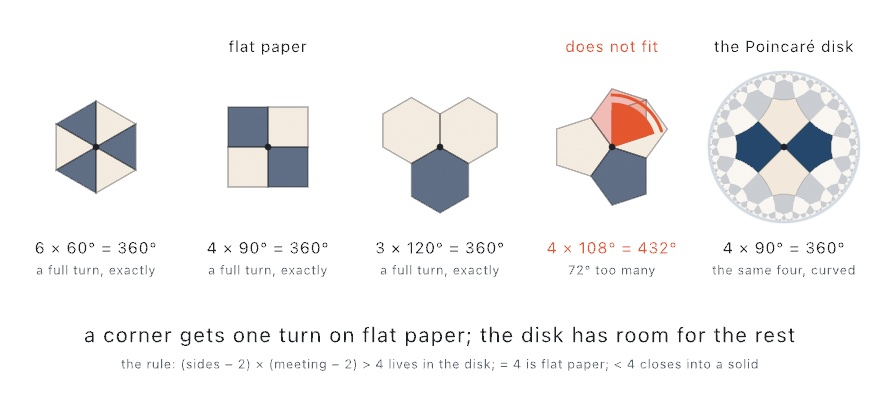
</picture>

The corners meeting at a vertex must add up to one full turn. Six triangles, four squares, or three hexagons use up that turn exactly, and no other regular shape does. Four pentagons ask for 432 degrees, so the fourth lands on the first. In the disk the same four meet at right angles, because a hyperbolic polygon's corners shrink as the polygon grows, and there is always a size whose corners fit. Written as a rule, with `sides` the polygon's sides and `meeting` how many meet at a corner: `(sides - 2) * (meeting - 2)` above 4 lives in the disk. Exactly 4 is flat paper, and below 4 the corners close up into one of the five Platonic solids.

```swift
for tile in hyperbolicTiling(sides: 5, meeting: 4) {
    fill(tile.parity == 0 ? .ivory : .indigo)
    drawShape(tile.shape)
}
```

<picture>
  <source media="(prefers-color-scheme: dark)" srcset="Images/07-Tiles/HyperbolicDisks-dark.jpg">
  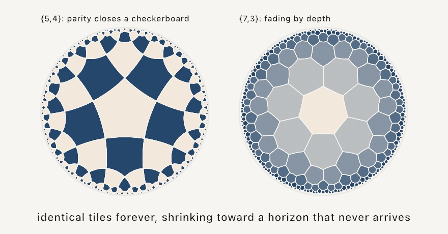
</picture>

Each tile carries `parity`, which flips across every shared edge. When `meeting` is even, the two colors close cleanly around every vertex and the disk becomes a curved checkerboard. When it is odd, fade by `depth` instead, the count of edge crossings out from the middle. The disk has one more move. Pass a moving `viewpoint` and the camera pans across the tiling forever, tiles swelling as they reach the middle and shrinking away behind, and the horizon never gets closer. [Hyperbolic tiling](../Docs/Drawing/HyperbolicTiling.md) is the reference, and [`Patterns/HyperbolicTiling`](../Examples/Patterns/HyperbolicTiling/Sketch.swift) is the panning tour.

### A tile that changes as you read: parquet deformations

A parquet deformation is a tiling whose tile is a little different in every cell, so reading the sheet from left to right you watch a square turn into an interlocking key. The pattern is the *change*. It is for a sheet that tells a story across itself, a floor, a fabric, a background that is never the same in two places. William Huff set it as a studio exercise for his design students from the 1960s on, drawn by hand on paper, and Douglas Hofstadter gave it a wider audience in a 1983 column. Reading it as a curve interpolated across a tiling, which is what makes it something a computer can draw, is Craig Kaplan's.

Fitting the tiles by hand does not work. Draw a tile, draw a slightly different tile beside it, and try to make their touching edges agree, and every adjustment breaks the neighbor you fixed a moment ago. The way out is to stop thinking about tiles at all.

Put the geometry on the **edges of the grid** instead. Give every edge a curve. A tile is whatever the four edges around it enclose, and the tile on the far side of any edge is built from that same curve, read backwards. Nothing can come apart, because there are no two versions of an edge to disagree.

That leaves you free to make the edges do anything. Each one is a `ParquetDeformation.Profile` (its own type, apart from [Chapter 6](06-GridsAndRepetition.md)'s star profile): a little curve in the edge's own frame, running from one grid corner to the other, with `y` as how far it wanders sideways. The ends are pinned, so the grid's corners stay put while everything between them moves.

```swift
let sheet = parquetDeformation(columns: 14, rows: 7,
                               from: .straight, to: .tooth(depth: 0.3))
stroke(.black); strokeWeight(2)
for edge in sheet.edges { drawPolyline(edge.points, closed: false) }
```

<picture>
  <source media="(prefers-color-scheme: dark)" srcset="Images/07-Tiles/ParquetRun-dark.jpg">
  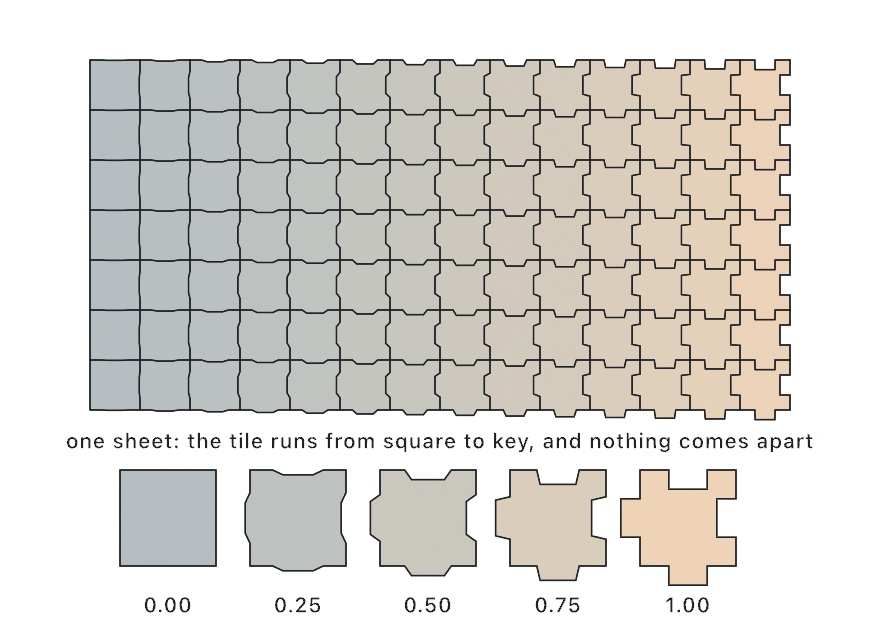
</picture>

Each edge blends the `from` profile into the `to` profile by how far across the sheet it sits. The five tiles under the figure are that run stood still: the same piece at the start, a quarter, a half, three quarters of the way over, and the end. Every neighbor in the sheet differs by about a fourteenth of that, which is little enough that the eye reads one tiling rather than a row of different ones.

The profiles are `.straight`, `.tooth`, `.zigzag`, `.wave`, `.bump`, and `.custom` for one you write out yourself. Any of them can be the start or the end, so `.wave(depth: 0.22)` running into `.tooth(depth: 0.3)` melts a soft pinwheel into a square key. Where the run goes is a `sweep`: left to right by default, or `.vertical`, `.diagonal`, `.radial` for a sheet that blooms out of its own middle.

The other form of the builder takes a closure instead of a sweep, and that is where the sheets that move come from. It hands you a point and asks how far along the run that point sits. You can answer with anything: noise, the tone of a photograph, the distance from the mouse, or a front that slides with `time`:

```swift
let field = bounds.inset(by: .all(70))
let front = 0.5 + sin(time * 0.25) * 0.55
let sheet = ParquetDeformation(grid: Grid(in: field, columns: 15, rows: 15),
                               from: .wave(depth: 0.22),
                               to: .tooth(depth: 0.3, width: 0.42)) { point in
    smoothstep(front - 0.28, front + 0.28, (point.x - field.x) / field.width)
}
```

Now the sheet keeps turning one tile into the other and back, which is the form in time rather than in space. Two faces come out of it, as with hitomezashi. `tiles` is the interlocking pieces, each carrying the `amount` it was built at so you can color the drift, and `edges` is the line-work. Prefer `edges` when you are stroking, because it visits each grid edge once. Stroking the tiles would draw every interior edge twice, which shows as a doubled line under a translucent stroke and costs a pen plotter a second pass over each one.

The tiles on the outside of the sheet carry their deformed outer edges too, so the border comes out fringed. Every tile is the shape the run asks for. If you want a clean rectangle, cut the tiles against the bounds with the shape booleans from [Chapter 15](15-ShapesAsMaterial.md). [Parquet deformations](../Docs/Drawing/ParquetDeformation.md) is the reference, and [`Patterns/ParquetDeformation`](../Examples/Patterns/ParquetDeformation/Sketch.swift) is the moving front.

## Where this comes from

Truchet tiles are named for Sébastien Truchet, a French Carmelite priest. He published a memoir in 1704 on the patterns a single diagonally split tile can make, after watching ceramic tiles being laid for a château. The quarter-circle arc tile this chapter leans on is a later refinement by the metallurgist and historian Cyril Stanley Smith. His 1987 paper revisited Truchet's work and connected it to how structure builds hierarchy in materials. Generative artists adopted it so thoroughly that "Truchet tiles" now usually *means* Smith's arcs. For arcs at mixed cell sizes that still agree at the edges, see Christopher Carlson's multi-scale Truchet tiles.

The diagonal tile has its own monument. The Commodore 64 one-liner `10 PRINT CHR$(205.5+RND(1)); : GOTO 10` is a maze in thirty-eight characters. Its history got a book of its own, *10 PRINT*, by Nick Montfort and nine co-authors in 2012.

The families after the sketch name their own sources, from Seaton's hitomezashi to Kaplan's parquet deformations. Full credits are in the project's [attribution notes](../ATTRIBUTION.md).

## Go deeper

- [Truchet](../Docs/Drawing/Truchet.md): both tiles, the contour output, and feeding the strands to booleans, hatching, or SVG export.
- [Ten print](../Docs/Drawing/TenPrint.md): the two faces, biasing the coin, hand-authored bits, and what the joining does and does not promise.
- [Geometry](../Docs/Drawing/Geometry.md#contour): the `Contour` reference, the points it holds and the questions it answers.
- [Hitomezashi](../Docs/Drawing/Hitomezashi.md): the stitch reference, the two faces, biased flips, and explicit bits for encoded designs.
- [Mazes](../Docs/Drawing/Tiling.md#maze): all three carving algorithms, the walls as line work, the one route between two cells, and the longest path.
- [Kolam and sona](../Docs/Drawing/Kolam.md): the full reference for `kolam` and `drawKolam`, the loops and dots, the walls, and the counting rule.
- [Celtic knotwork](../Docs/Drawing/Knotwork.md): `knotwork` and `drawKnotwork`, the bands already broken at each dive, the crossing count, and the two-tone draw.
- [Polyominoes](../Docs/Generators/Polyominoes.md): the piece type, the twelve pentominoes and five tetrominoes, counting orientations, outlines, and the fitting search with its two switches.
- [Wave Function Collapse](../Docs/Generators/WaveFunctionCollapse.md): sockets, weights, rotations, learning from a picture instead, and what to do when a solve fails.
- [Aperiodic tilings](../Docs/Drawing/AperiodicTilings.md): the full reference for `penroseTiling` (both variants and the arcs), `wangTiling` (tile sets, weights, the complete set), `girihPattern` (the contact angle, the five girih tiles, composing them edge to edge), and `spectreTiling`.
- [De Bruijn sequences](../Docs/Generators/DeBruijn.md): the run, the reader that turns a window into a position, and the Lyndon words it is built from.
- [Hyperbolic tiling](../Docs/Drawing/HyperbolicTiling.md): the full `hyperbolicTiling` reference, every valid {p,q} pair, the parity and depth coloring hooks, and the panning viewpoint.
- [Parquet deformations](../Docs/Drawing/ParquetDeformation.md): the full `parquetDeformation` reference, the profile catalog, the four sweeps and the closure that replaces them, and the two faces.
- The Farmanfarmaian homages in [`Examples/Recreations/MonirFarmanfarmaian/`](../Examples/Recreations/MonirFarmanfarmaian/): a regular polygon cut into one piece per side and every piece cut again, into rows of triangles for the mirror relief and into a spiraling kite for the maze. Whatever happens in one piece happens in all of them, so the whole keeps the polygon's turn. `Convertible` takes those pieces off the polygon and searches for every other way they can hang: each kite lies along a neighbor's edge, the set turns about one point, and none overlaps.
- Appendix B draws the idea under all of it, one picture per entry: [Local rules, global structure](B-JustEnoughMath.md#local-rules-global-structure), and [Angles and circles](B-JustEnoughMath.md#angles-and-circles) for the arcs.
- Worked examples: [`Patterns/Truchet`](../Examples/Patterns/Truchet/Sketch.swift) (both tiles, animated), [`Patterns/TenPrint`](../Examples/Patterns/TenPrint/Sketch.swift) (the maze of diagonals with its runs), [`Patterns/Hitomezashi`](../Examples/Patterns/Hitomezashi/Sketch.swift) (both faces, on a breathing cloth), [`Patterns/Kolam`](../Examples/Patterns/Kolam/Sketch.swift) (the field resized live, with the loop count read out), [`Patterns/Knotwork`](../Examples/Patterns/Knotwork/Sketch.swift) (the weave with its walls switchable), [`Patterns/Maze`](../Examples/Patterns/Maze/Sketch.swift) (all three algorithms, with the longest path tracing through), [`Patterns/Penrose`](../Examples/Patterns/Penrose/Sketch.swift) (rhombs with breathing arcs), [`Patterns/WangTiles`](../Examples/Patterns/WangTiles/Sketch.swift) (the re-laying quilt), [`Patterns/Girih`](../Examples/Patterns/Girih/Sketch.swift) (the angle dial swept live, plus the decagon-and-pentagons medallion), [`Patterns/Spectre`](../Examples/Patterns/Spectre/Sketch.swift) (the einstein with a drifting tide), [`Patterns/DeBruijn`](../Examples/Patterns/DeBruijn/Sketch.swift), [`Patterns/HyperbolicTiling`](../Examples/Patterns/HyperbolicTiling/Sketch.swift) (the panning tour of six {p,q} pairs), [`Patterns/ParquetDeformation`](../Examples/Patterns/ParquetDeformation/Sketch.swift) (a square becoming a key under a front that slides back and forth), [`Patterns/Pentominoes`](../Examples/Patterns/Pentominoes/Sketch.swift) (all twelve laid one at a time, with the tray emptying as they go), [`Patterns/WaveFunctionCollapse`](../Examples/Patterns/WaveFunctionCollapse/Sketch.swift) (a fresh legal pipe network every few seconds), and [`Patterns/TextureSynthesis`](../Examples/Patterns/TextureSynthesis/Sketch.swift) (three samples written in the source as rows of characters).

---

[Contents](README.md#contents) · Previous: [Chapter 6, Grids and repetition](06-GridsAndRepetition.md) · Next: [Chapter 8, Words](08-Words.md)
