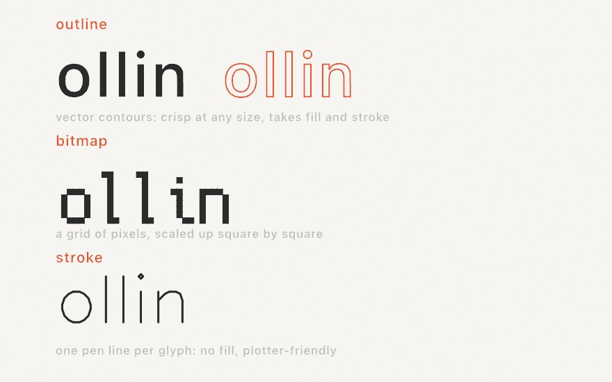

#### <sup>[Ollin](../README.md) → [Guide](README.md) → Chapter 7</sup>

---

# 7. Words and pictures


So far every mark on your canvas has been a shape. This chapter adds the other two things a canvas usually carries, words and pictures. Both arrive the same way the shapes did, as material you can measure, warp, and sample, and the chapter ends with the two meeting in the piece above: a sunset built out of its own caption, every letter sized and colored by the pixel it stands on.

## Saying something

Text is one call:

```swift
import Ollin

final class Hello: Sketch {
    override func draw() {
        background(Color(hex: 0x0E1116))
        noStroke()
        fill(.white)
        textSize(140)
        textAlign(.center, .middle)
        drawText("hola", width / 2, height / 2)
    }
}
```

`drawText` puts a string at a point, and three pieces of state decide how it lands: `fill` is the ink (text is geometry, so it uses the same fill as your shapes), `textSize` is the height of a line in points, and `textAlign` says how the string hangs on the point you gave. `.center, .middle` centers it both ways, and the default is `.left, .baseline`, which starts the text at your x and sits it on the line type sits on. One thing to know early is that glyphs honor `stroke` too, so a leftover 1-pixel stroke will outline every letter. Call `noStroke()` for plain text, or keep the stroke on purpose (it's a look).

A string can hold more than one line (`\n` starts the next one), and everything rides the transform stack from Chapter 6, so you can translate to a point, rotate, and the words rotate with the paper.

## Three kinds of letters

Everything above used the default font, which is one of three kinds Ollin draws. They all answer to the same calls, and what differs is what a glyph *is*:



- An **outline font** is a real `.ttf`/`.otf` face, each glyph stored as vector contours. It's the default (the system font, at medium weight), it stays crisp at any size, and because a glyph renders as a shape it takes `fill` *and* `stroke`. This is the kind you'll use most.
- A **bitmap font** is a small grid of pixels per glyph, scaled up square by square. The bundled one is Cozette, a 13-pixel face with wide coverage (the Spanish accents are all there). It brings instant pixel-art flavor and never pretends to be smooth.
- A **stroke font** is a single pen line per glyph, no interior at all. It draws with `stroke` and ignores `fill`, and it's the letterform a pen plotter wants. Hershey Sans comes bundled.

Switching kinds is the same `textFont` call:

```swift
textFont(BitmapFont.builtin)               // Cozette, the bundled pixel font
textFont(StrokeFont.builtin)               // Hershey Sans, the bundled pen font
textFont(OutlineFont.systemMedium)         // back to the default
```

For outline fonts, anything installed on your Mac is a name away, and the initializer returns nothing when the name doesn't match, so a typo fails where you can see it. Pair it with a fallback:

```swift
textFont(OutlineFont(name: "Avenir Next") ?? .system)
```

> **Swift note.** `??` means "or, if that was nothing, use this instead". `OutlineFont(name:)` returns an optional like Chapter 2's `Color(hex: String)`, and `?? .system` unwraps it with a default in one step.

Two more doors worth knowing are behind that same call. If the font file is a *variable* font, `variation(_:)` sets its design axes, so a word can breathe from thin to heavy while it runs (`textFont(f.variation(["wght": map(sin(time), -1, 1, 0.5, 3)]))`). And you can bundle a font file beside your sketch and load it with `OutlineFont(resource:in:)`. The [Text reference](../Docs/Drawing/Text.md) covers both, plus loading more bitmap and stroke faces.

## Letters that move

`drawText` has a second form that hands you the string one glyph at a time, and it turns typography into animation material:


```swift
let palette = Palette([
    Color(hex: 0x5E60CE), Color(hex: 0x64DFDF),
    Color(hex: 0xFFB703), Color(hex: 0xE56B6F), Color(hex: 0x8AC926),
])

textSize(230)
textAlign(.center, .middle)
drawText("ollin", width / 2, height / 2) { g in
    fill(palette[g.index])
    withState {
        translate(0, sin(time * 2.6 + Double(g.index) * 0.9) * 90)
        g.draw()
    }
}
```

The closure runs once per letter. `g` knows which glyph it is (`g.index`), where it belongs, and how to stamp itself (`g.draw()`), so you set whatever state you like around it, here a color per letter and a vertical bob. The `+ Double(g.index) * 0.9` is Chapter 3's phase trick, each letter running the same swing with a head start, which is what makes the word roll like a wave instead of jumping as a block. (The committed figure, [`LetterWave.swift`](Figures/07-WordsAndPictures/LetterWave.swift), draws a few time-shifted copies at low alpha before the front one, so the motion leaves trails in a still image. Open it to see the whole file.)

Two relatives to file away: `drawText(_:along:)` lays a string along any `Path`, glyphs rotating to follow the curve, and `drawText(_:in:)` wraps a paragraph into a rectangle. Both are one call, and the [Text reference](../Docs/Drawing/Text.md) has them.

## Text as geometry

This is the chapter's biggest idea. `textToShapes` gives you the glyphs *as vector shapes*, positioned exactly where `drawText` would have put them, and from that moment they're geometry like everything else in this guide: you can warp the points, stroke the contours, or scatter marks along them.


```swift
textSize(150)
textAlign(.center, .middle)
for shape in textToShapes("warp", width / 2, height / 2) {
    let warped = Shape(contours: shape.contours.map { c in
        Contour(c.points.map { p in
            p + Vector2(signedNoise(p.x * 0.006, p.y * 0.006),
                        signedNoise(p.x * 0.006 + 40, p.y * 0.006)) * 14
        }, closed: c.isClosed)
    })
    drawShape(warped)
}
```

Each glyph comes back as a `Shape`, a set of closed outlines (a letter with a hole, like `o` or `a`, keeps its hole). The loop rebuilds each one with every outline point nudged by `signedNoise`, Chapter 5's smooth field in its swing-both-ways form, sampled at the point's own position so neighboring points move together and the letter bends instead of shattering. The `* 14` is the strength, and the figure shows 0, 7, and 26. Feed `time` as a third coordinate and the letters ripple live.

Here's one warning from experience. Keep warps bounded and smooth. `signedNoise` never leaves `-1...1`, so scaling it gives you a hard ceiling on how far any point moves. An unbounded push can fold an outline over itself, which the fill renders as a spike.

There's a related fact worth knowing when you want marks *along* the letters rather than a warp. The outline points come back unevenly spaced (dense on curves, sparse on straights), so dots placed one-per-point clump. Respace a glyph first, `shape.resampled(spacing: 8)`, and every point lands a steady 8 apart along the outline, ready for beads, dashes, or particles. The [`PointShimmer` example](../Examples/Text/PointShimmer/Sketch.swift) builds shimmering dotted type from exactly those two calls.

> **Swift note.** `.map { }` builds a new list by transforming every element of an old one: `c.points.map { p in ... }` reads "a new list of points, each computed from `p`". It's the loop from Chapter 1 wearing a shorter coat, and you'll see it wherever a whole list changes at once.

## Pictures

Images follow the pattern you already know from fonts: load once in `setup()`, keep the result, draw it in `draw()`.

```swift
final class Photo: Sketch {
    var photo: Image?

    override func setup() {
        photo = loadImage("/Users/you/Pictures/leaf.jpg")
    }

    override func draw() {
        background(.black)
        if let photo {
            drawImage(photo, 0, 0, width, height)     // stretched to fill
        }
    }
}
```

`loadImage` reads anything the system can decode (PNG, JPEG, HEIC, and friends) and returns an optional, since a path can be wrong. `drawImage` places the image by its top-left corner, at native size or scaled into a box, and it composites in draw order with everything else, riding the transform stack like a shape. For an image that travels with your sketch, drop the file in the same folder and load it with `Image(resource: "leaf", extension: "jpg", in: .module)`.

One piece of state changes how images land: `tint`. It multiplies every pixel by a color as the image draws, so the RGB washes the image and the alpha fades it:

```swift
tint(Color(red: 1.0, green: 0.75, blue: 0.4))   // a warm wash
drawImage(photo, 0, 0, width, height)
tint(Color(white: 1, alpha: 0.3))               // ghostly, 30% opacity
drawImage(photo, 60, 60, width, height)
noTint()                                        // back to as-is
```

Tint never edits the image itself, only how it's drawn, and `withState { }` scopes it like any other state.

## An image you can ask

The real gift of `Image` for generative work isn't drawing it, it's *reading* it. The subscript `image[x, y]` returns the color stored at a pixel, and suddenly a picture is a field of answers, like Chapter 5's noise but authored by a camera or by you:


The right panel asks the image one question per grid cell and draws the answer as a dot. The recipe has two small pieces. First, a cell's position maps to a pixel index by fractions. A cell at fraction `u` across the grid reads column `Int(u * Double(image.width - 1))`, and rows work the same way, so any grid samples any image size. Second, "how bright is this pixel" takes one more line than you might guess, because your eye does not weigh the three channels equally, with green counting most and blue least. The standard weights are

```swift
let brightness = c.red * 0.2126 + c.green * 0.7152 + c.blue * 0.0722
```

and that single number is the handle generative artists pull most: size by it, choose by it, gate by it. ([Appendix B](B-JustEnoughMath.md#perceived-brightness) keeps this one, since averaging the channels instead makes yellows read too dark and blues too bright.) Ollin also carries the ask as a property, `c.luminance`, measured a touch more faithfully on the linearized components. The handwritten weights are the idea, and the property is the everyday spelling.

You can also write pixels. `Image(width:height:)` makes a blank image, `image[x, y] = color` paints one pixel, and that's how this chapter's figures work. The repository ships no photograph, so the sunset on the left is *authored*, about twenty lines of Chapter 2 ramps, one `smoothstep` sun, and Chapter 5 noise for the water, written pixel by pixel in `setup()`. The listing below contains the whole recipe, and everything in this section works identically on a photo you load with `loadImage`.

## Putting it together: a picture painted with type

This is the piece from the top of the chapter, and it's the whole chapter in one grid: words drawn with `drawText`, a picture read with `image[x, y]`, and the two fused so the picture is *made of* the words. A message repeats across a grid in reading order, and each letter samples the sunset at its own position, takes the pixel's color, and scales by its brightness. Make `MySketches/TypeMosaic.swift`:

```swift
import Ollin

final class TypeMosaic: Sketch {
    @Param("Columns", 24...80) var columns = 52
    @Param("Message") var message = "OLLIN "
    @Param("Breathe", 0...1) var breathe = 0.5

    var source: Image?

    override func setup() {
        noiseSeed(3)
        source = makeSunset(size: 160)
        textFont(OutlineFont.systemBold)
        textMode(.atlas)                   // thousands of glyphs a frame
        textAlign(.center, .middle)
        noStroke()
    }

    override func draw() {
        background(Color(hex: 0x0B0E14))
        guard let source else { return }
        let chars = Array(message.isEmpty ? "OLLIN " : message)
        let cell = width / Double(columns)
        let rows = Int(height / cell)
        var k = 0

        for row in 0..<rows {
            for col in 0..<columns {
                let u = (Double(col) + 0.5) / Double(columns)
                let v = (Double(row) + 0.5) / Double(rows)
                let c = source[Int(u * Double(source.width - 1)),
                               Int(v * Double(source.height - 1))]
                let brightness = c.red * 0.2126 + c.green * 0.7152 + c.blue * 0.0722

                // Bright pixels get big letters; a slow noise field makes the
                // whole picture breathe without changing what it says.
                let sway = 1 + signedNoise(u * 3, v * 3, time * 0.25) * 0.18 * breathe
                textSize(cell * (0.4 + 1.25 * brightness * brightness) * sway)
                fill(Color.mix(c, .white, t: brightness * 0.22))
                drawText(String(chars[k % chars.count]),
                         (Double(col) + 0.5) * cell, (Double(row) + 0.5) * cell)
                k += 1
            }
        }
    }

    func makeSunset(size: Int) -> Image {
        let image = Image(width: size, height: size)
        let sky = Ramp([Color(hex: 0x14213D), Color(hex: 0x5E60CE),
                        Color(hex: 0xE56B6F), Color(hex: 0xFFB703)])
        let horizon = 0.62
        let sunX = 0.58, sunY = 0.47
        for py in 0..<size {
            for px in 0..<size {
                let u = Double(px) / Double(size - 1)
                let v = Double(py) / Double(size - 1)
                var color: Color
                if v < horizon {
                    color = sky.color(at: v / horizon)
                    let d = ((u - sunX) * (u - sunX) + (v - sunY) * (v - sunY)).squareRoot()
                    let disk = 1 - smoothstep(0.075, 0.095, d)
                    let glow = (1 - smoothstep(0.04, 0.4, d)) * 0.5
                    color = Color.mix(color, Color(hex: 0xFFF3D6), t: min(1, disk + glow))
                } else {
                    let w = (v - horizon) / (1 - horizon)
                    let reflected = sky.color(at: max(0, 0.92 - w * 0.9))
                    let dark = Color.mix(reflected, Color(hex: 0x0B1020), t: 0.45 + w * 0.4)
                    let streak = noise(u * 5, v * 120)
                    let path = 1 - smoothstep(0.02, 0.16 + w * 0.3, abs(u - sunX))
                    color = Color.mix(dark, Color(hex: 0xFFD98A),
                                      t: min(1, path * (0.2 + streak * 0.8)))
                }
                image[px, py] = color
            }
        }
        return image
    }
}
```

Run it with `swift run OllinLive MySketches/TypeMosaic.swift` and take it apart:

- `makeSunset` is the "author an image" idea at full length, and every line of it is a tool you already own: the sky is a `Ramp` read by height, the sun is `smoothstep` on distance (a soft-edged disk plus a wider faint glow), and the water mirrors the sky darkened, with `noise` streaks brightening along the sun's reflection. It writes 160×160 pixels once, in `setup()`.
- The double loop is Chapter 6's grid chore done by hand, because what it loops over is the *message*: `k % chars.count` deals the letters out in reading order, so the rows spell the message over and over, and `u`/`v` fractions map each cell onto its pixel.
- `brightness * brightness` is contrast shaping, since squaring pushes mid grays down so the sun pops. The `fill` mixes each pixel's color a step toward white in the brightest cells, which makes the sun read as light rather than paint.
- `textMode(.atlas)` matters here, because fifty columns is a few thousand glyphs per frame, and the atlas mode draws each as one cheap textured quad instead of re-tessellating outlines. It's the volume switch for text, one line, and the chapter's one performance note.
- `Breathe` feeds a slow `signedNoise` into the letter sizes, so the picture shimmers without changing what it says. The `Message` knob is a text field in the live window, so type into it and the sunset respells itself as you watch.

> **Swift note.** `guard let source else { return }` is `if let` turned around, unwrapping the value or leaving the function right there. And `Array(message)` turns a string into a list of its characters, so `chars[k % chars.count]` can deal them out like Chapter 1's palette cycling.

Then make it yours:

- Swap the source for a photo: `source = loadImage("/path/to/portrait.jpg")` is the whole change. Faces work beautifully at 60 to 80 columns.
- Change the alphabet. A message of `"·•●"` becomes halftone dots, and `textFont(BitmapFont.builtin)` in `setup()` makes it a terminal.
- Sample with an offset. Read the pixel at `u + time * 0.01` (wrapped with `fract`) and the picture slides through the words.
- Recolor by replacing the sampled color with `Colormap.magma.color(at: brightness)` for a duotone poster.

## Where this comes from

Making pictures out of characters is older than computing. Typewriter artists were composing portraits from letters by the 1890s, and when 1960s line printers became the first output devices many people ever touched, the tradition became ASCII art. The deeper idea, an image rebuilt from small marks whose size carries the tone, is the halftone screen that printed every newspaper photograph for a century, and pointillism if you ask a painter. This chapter's tools have their own lineages. The bundled pixel font is [Cozette](https://github.com/the-moonwitch/Cozette) by Ines. The bundled stroke font is Hershey Sans, one of the vector fonts A. V. Hershey drew at the U.S. National Bureau of Standards in 1967 for early plotters, still beloved by the pen-plotter community. And outline text is laid out by the system's own type machinery, so kerning and ligatures come for free. Full credits are in the project's [attribution notes](../ATTRIBUTION.md).

## Go deeper

- [Text](../Docs/Drawing/Text.md): the full reference, including text on a path, box wrapping, metrics (`textWidth`, `textBounds`), variable-font axes, and loading bitmap, outline, and stroke faces of your own.
- [Images](../Docs/Drawing/Images.md): the complete `Image` surface, including `Image(resource:in:)` for bundled assets and the bulk pixel initializer.
- Worked examples, in [`Examples/Text/`](../Examples/Text/): `GlyphWave` and `JitterType` (per-glyph motion), `TextOnPath`, `TextBox`, `VariableFont`, `OutlineText` (the warp, live), `StrokeText` and `PlaydateFont` (the other two font kinds in action), and `TextVolume` (the atlas mode at paragraph scale).
- [`Examples/Images/PixelField`](../Examples/Images/PixelField/Sketch.swift): authoring an image pixel by pixel and reading it back, under an animated tint.

---

[Contents](README.md#contents) · Previous: [Chapter 6, Grids and repetition](06-GridsAndRepetition.md) · Next: [Chapter 8, Vectors, gently](08-Vectors.md)
