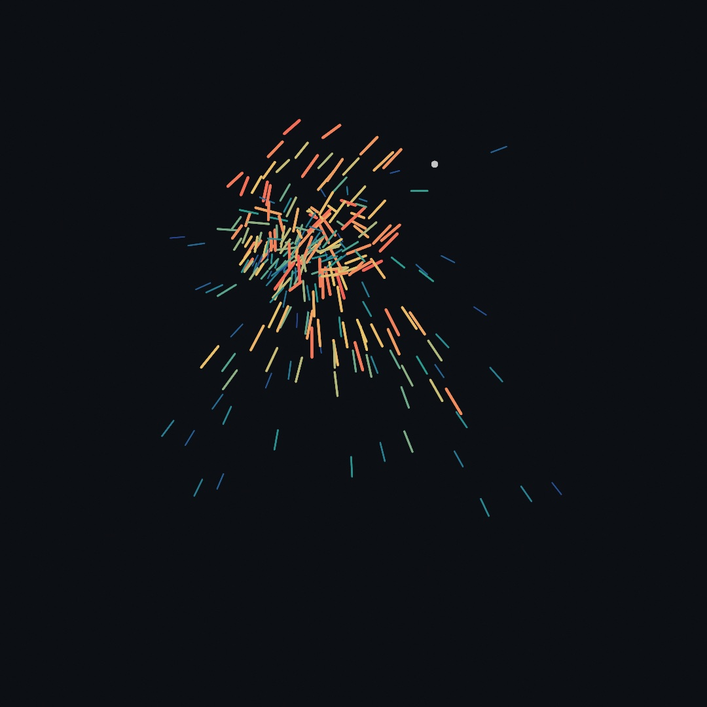

#### <sup>[Ollin](../README.md) → [Guide](README.md) → Chapter 8</sup>

---

# 8. Vectors, gently



Part II begins here, and so does a new kind of sketch: things that *remember where they were going*. The tool for that is the vector, which sounds like math class and is actually one friendly idea: an arrow you can add, stretch, and point. By the end of this chapter three of those arrows will make anything move like it's alive, and a few hundred of them become the piece above: a swarm wheeling after a lure, ready to chase your mouse.

## An arrow you can draw

You've been using `Vector2` since Chapter 6 without ceremony: it's a pair of coordinates carried as one value, and calls like `drawCircle(center:radius:)` accept it directly. The new idea is that the same pair has *two readings*. Read `(300, 200)` as a **point** and it's a place on the canvas. Read it as a **vector** and it's an arrow: go 300 right and 200 down, from wherever you are. Nothing in the type changes; what changes is what you do with it.

```swift
let place = Vector2(300, 200)          // a point: somewhere on the canvas
let step = Vector2(4, -1)              // an arrow: a way to move
```

Everything in this chapter comes from letting those two readings work together: points tell you where things are, arrows tell you where they're headed, and the arithmetic below moves freely between them.

## Arrow arithmetic

Vectors add, subtract, and scale, and each operation has a picture worth keeping:


- **Adding** is walking: `a + b` means walk `a`, then walk `b` from where you ended up. Order doesn't matter; you arrive at the same place.
- **Subtracting** answers the most useful question in this half of the guide: `target - pos` is *the arrow that goes from here to there*. Every chase, spring, and look-at in the chapters ahead starts with this line.
- **Scaling** multiplies by a plain number: `v * 2` is twice as far in the same direction, `v * 0.5` half, `v * -1` the same road walked backward.

Two spellings make these read like sentences. `pos += step` moves a point by an arrow in place, and `v * deltaTime` is Chapter 3's frame-rate rule wearing vector clothes: write speeds per second, scale by the frame's slice of a second.

## Length and direction

An arrow is a direction *and* a distance, and you'll constantly want them separately.

`v.length` is how long the arrow is (Pythagoras, quietly), so `velocity.length` is a thing's speed with the direction stripped away. Going the other way, `v.normalized` keeps the direction and sets the length to exactly 1; the figure's last panel shows it landing on the circle of radius 1. A length-one arrow is a pure *heading*, and it exists so you can choose the distance yourself:

```swift
let toTarget = (target - pos).normalized     // just the direction
pos += toTarget * 3                          // step 3 points that way, near or far
```

That pair of lines is the move-toward-anything recipe, and it works at any distance because the normalize threw the distance away.

Two relatives complete the kit. `a.distance(to: b)` measures between two points (it's `(a - b).length`). And `v.limited(to: max)` caps an arrow's length while keeping its heading, which sounds minor and turns out to be the seatbelt on everything in Part II: speeds that can't blow up, corrections that can't overshoot.

One more, for drawing: `v.angle` is the arrow's direction as a single number, ready for Chapter 6's `rotate`, so a shape can face where it's going. Its inverse builds an arrow from scratch: `Vector2(angle: a, length: 10)`.

## Position, velocity, acceleration

Now put arrows on a body. Three of them, each one answering a different question:


- **Position** is where it is: a point, or the arrow from `(0, 0)` if you like.
- **Velocity** is where it's going: the arrow added to position every second.
- **Acceleration** is how the going changes: the arrow added to *velocity* every second.

The chain runs one way: acceleration changes velocity, velocity changes position. That's the whole engine, two lines long, and here it is throwing a ball. Make `MySketches/Thrown.swift`:

```swift
import Ollin

final class Thrown: Sketch {
    var position = Vector2(140, 800)
    var velocity = Vector2(330, -640)
    let gravity = Vector2(0, 700)

    override func draw() {
        background(Color(hex: 0x0E1116))

        velocity += gravity * deltaTime
        position += velocity * deltaTime

        // The floor: bounce, losing a little each time.
        if position.y > height - 60 {
            position = position.with(y: height - 60)
            velocity = Vector2(velocity.x, -velocity.y * 0.82)
        }

        stroke(Color(white: 0.25))
        strokeWeight(2)
        drawLine(0, height - 48, width, height - 48)
        noStroke()
        fill(Color(hex: 0xFFB703))
        drawCircle(center: position, radius: 24)
    }
}
```

Run it and a ball arcs across, bounces, and settles. Notice what's stored and what isn't: `position` and `velocity` are properties, alive between frames, because motion with memory *is* stored state; that's the line Part I never needed to cross. `gravity` never changes, but every frame it bends `velocity` a little, and the bend is what makes the arc. The bounce is two honest lines: put the ball back on the floor, flip the vertical part of its velocity and keep a bit less than all of it (`0.82` is the bounciness). And both `+=` lines scale by `deltaTime`, so the throw is identical at 60 and 120 frames a second.

The other classic edge policy is **wrapping**: leave the right edge, come back on the left, the canvas bent into a loop. You'll see it in the finished piece, four `if`s with `with(x:)` and `with(y:)`.

## Steering: the chase

A thrown ball only obeys. To make something that *wants*, give it a target and let it correct its own course. The recipe, three lines, is worth reading slowly:

```swift
let desired = (target - position).normalized * maxSpeed
let steer = (desired - velocity).limited(to: maxForce)
velocity = (velocity + steer * deltaTime).limited(to: maxSpeed)
```

In words: figure out the velocity you *wish* you had (straight at the target, at full speed); subtract the velocity you actually have, which gives the correction arrow between them; cap that correction, because nothing real turns instantly; and apply it like any other acceleration. The two caps are the character knobs. `maxSpeed` is how fast it can go; `maxForce` is how sharply it can turn. High force snaps onto the target like a hunting fly; low force sails past and swings back in wide, lazy arcs, and the misses are where the life is: the chaser overshoots *because* it has momentum, and the correction is visible.

Every line is arithmetic you already have: a subtraction pointing from here to there, a normalize choosing a speed, a limit keeping it honest. Chapter 10 builds whole flocks from exactly this correction, aimed at neighbors instead of a target.

## Putting it together: the swarm

One chaser is a pet; a few hundred are weather. The piece at the top of the chapter runs the steering recipe over parallel lists of positions and velocities, gives every mover its own top speed so the crowd stretches into leaders and stragglers, and draws each as a streak along its own velocity: the drawing *is* the motion made visible. The lure wanders on Chapter 5's noise until you hold the mouse down, which hands it to you. Make `MySketches/Swarm.swift`:

```swift
import Ollin

final class Swarm: Sketch {
    @Param("Movers", 40...400) var movers = 260
    @Param("Speed", 150...800) var maxSpeed = 430.0
    @Param("Chase", 300...3000) var maxForce = 950.0

    var positions: [Vector2] = []
    var velocities: [Vector2] = []
    var quickness: [Double] = []      // a personality per mover

    let ramp = Ramp([
        Color(hex: 0x274690), Color(hex: 0x2A9D8F),
        Color(hex: 0xE9C46A), Color(hex: 0xF25C54),
    ])

    override func setup() {
        seed(9)
        strokeCap(.round)
    }

    override func draw() {
        background(Color(hex: 0x0C0F14))

        // Keep the population matched to the knob.
        while positions.count < movers {
            positions.append(Vector2(random(width), random(height)))
            velocities.append(Vector2(angle: random(0, .tau), length: 60))
            quickness.append(random(0.55, 1.2))
        }
        if positions.count > movers {
            positions.removeLast(positions.count - movers)
            velocities.removeLast(velocities.count - movers)
            quickness.removeLast(quickness.count - movers)
        }

        // The lure wanders on noise; hold the mouse to take it over.
        var lure = Vector2(noise(time * 0.3, 3) * width,
                           noise(time * 0.3, 77) * height)
        if mouseIsPressed { lure = Vector2(mouseX, mouseY) }

        for i in positions.indices {
            // Steer: aim at the lure, compare with the current velocity,
            // and correct by a bounded amount.
            let top = maxSpeed * quickness[i]
            let desired = (lure - positions[i]).normalized * top
            let steer = (desired - velocities[i]).limited(to: maxForce)
            velocities[i] = (velocities[i] + steer * deltaTime).limited(to: top)
            positions[i] += velocities[i] * deltaTime

            // Wrap: leave one edge, come back on the other.
            var p = positions[i]
            if p.x < -20 { p = p.with(x: width + 20) }
            if p.x > width + 20 { p = p.with(x: -20) }
            if p.y < -20 { p = p.with(y: height + 20) }
            if p.y > height + 20 { p = p.with(y: -20) }
            positions[i] = p

            // A streak along the velocity, colored by personality:
            // the quick ones warm, the slow ones cool.
            let pace = map(quickness[i], 0.55, 1.2, 0, 1)
            stroke(ramp.color(at: pace))
            strokeWeight(1.5 + pace * 2.8)
            drawLine(positions[i] - velocities[i] * 0.11, positions[i])
        }

        noStroke()
        fill(Color(white: 1, alpha: 0.55))
        drawCircle(center: lure, radius: 5)
    }
}
```

Run it with `swift run OllinLive MySketches/Swarm.swift`, watch the school wheel after the wandering dot, then press and drag: the swarm is yours. Take it apart:

- The state is three parallel lists: mover `i`'s position, velocity, and personality live at index `i` of each. The `while`/`if` block at the top keeps the lists matched to the `Movers` knob, so you can pour movers in and out live.
- `quickness` is one seeded roll per mover, and it does more than any other line for the feel: everyone runs the same rules at a different top speed, so the crowd naturally stretches into warm leaders and cool stragglers. The streak color reads straight from it.
- The steering block is the chase recipe verbatim, aimed at `lure`. Turn `Chase` down and the school swings in long arcs past the dot; turn it up and the swarm snaps tight around it.
- Each mover draws as a `drawLine` from a little behind itself (`- velocities[i] * 0.11`) to where it is: a streak that grows with speed and points where it's going, no rotation math needed.
- The lure is two `noise` calls on far-apart rows of the field, Chapter 5's trick for unrelated drifts, and `mouseIsPressed` swaps it for your cursor. In a still export nobody is pressing, which is why the committed figure shows the noise chase.

> **Swift note.** `[Vector2]` is a list that grows: `append` adds to the end, `removeLast(n)` trims, `count` is the size, and `positions.indices` counts `0..<count` so one `i` can index all three lists together. Lists like these are how a sketch keeps state for *many* things; Part II leans on them everywhere.

Then make it yours:

- Give the swarm fear instead of hunger: `let desired = (positions[i] - lure).normalized * top` flees the lure. Keep the wrap and it becomes a shoal you push through.
- Two lures: steer each mover at whichever is closer (`distance(to:)` decides). The school tears itself in half and re-forms.
- Draw dots at each head (`drawCircle(center:radius:)`, radius by `pace`) for plankton; or lengthen the streaks to `* 0.25` for rain.
- Ease the caps: `Speed` low with `Chase` high moves like gnats; both low is deep-sea slow.

## Where this comes from

Vectors are the physics notation the 1880s settled on, mostly at the hands of Josiah Willard Gibbs and Oliver Heaviside, and position/velocity/acceleration as arrows is Newton's mechanics wearing that notation. The steering recipe, desired minus actual, capped, is Craig Reynolds' *steering behaviors*, published in his 1999 paper "Steering Behaviors for Autonomous Characters" as the ground floor of the boids work you'll meet properly in Chapter 10. The teaching order of this chapter, arrows first, then the trio, then steering, walks in the footsteps of Daniel Shiffman's *The Nature of Code*, which made this progression the standard on-ramp for a generation of creative coders, this author included. Full credits are in the project's [attribution notes](../ATTRIBUTION.md).

## Go deeper

- [Geometry](../Docs/Drawing/Geometry.md#vector2): the full `Vector2` tour, with a picture per operation, including the ones this chapter saved for later: `dot` (same way or opposite?), `cross` (which side?), `lerp(to:)` (the smooth follow), `rotated(by:around:)`, and `projected(onto:)`.
- [Math helpers](../Docs/Helpers/Math.md): `map`, `dist`, and the scalar kit the vector calls sit beside.
- Worked examples, in [`Examples/Motion/`](../Examples/Motion/): `Orbits` (the angle-and-radius reading), `Easing` (dots racing to a click), and `Smoothing` (a chased value with a filter instead of physics).
- A look ahead: [`Examples/Patterns/Flocking`](../Examples/Patterns/Flocking/Sketch.swift) runs this chapter's correction three ways at once; Chapter 10 takes it apart.

---

[Contents](README.md#contents) · Previous: [Chapter 7, Words and pictures](07-WordsAndPictures.md) · Next: [Chapter 9, Forces and physics](09-ForcesAndPhysics.md)
