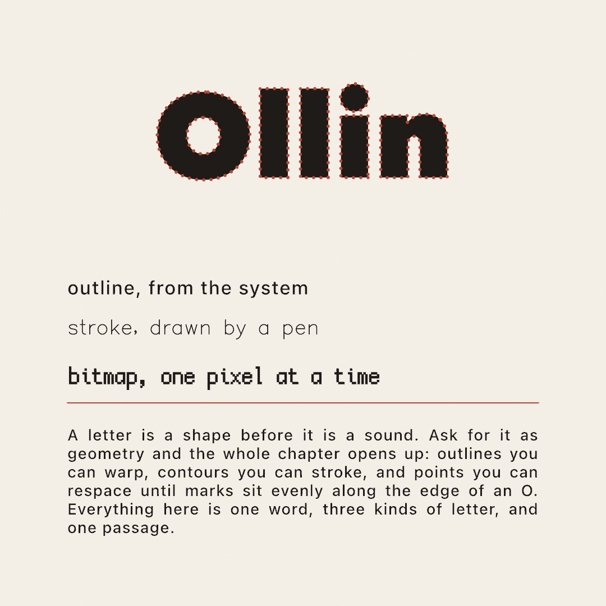
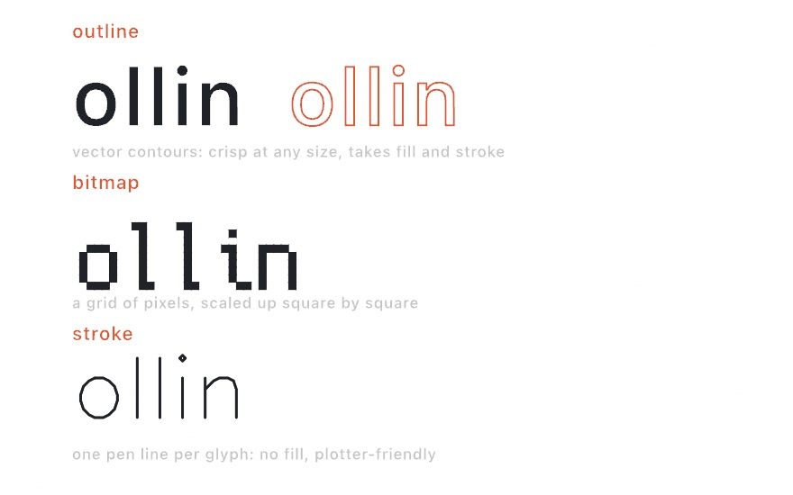
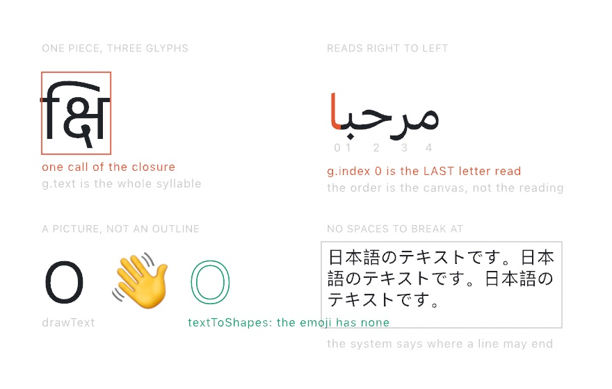
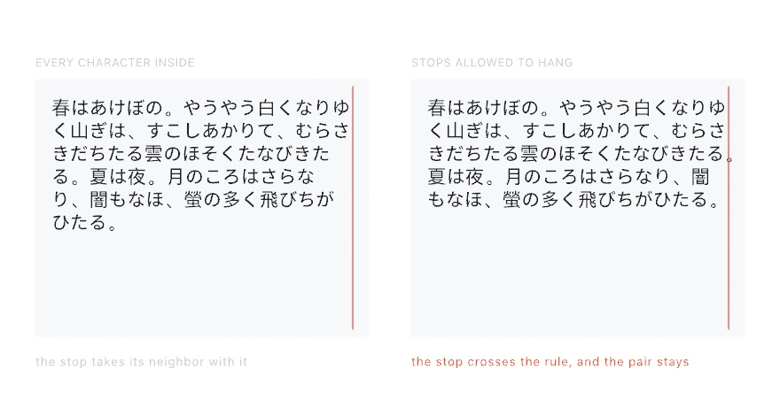

#### <sup>[Ollin](../README.md) → [Guide](README.md) → Chapter 8</sup>

---

# 8. Words



Every mark on your canvas so far has been a shape. Words are the first thing you draw that also *means* something, and they arrive with a few hundred years of craft attached. This chapter covers both halves of that. Getting a line of text onto the canvas is one call, and it stays one call in scripts that run right to left, or down the page, or need both edges of a column flush.

Then comes the part that makes type worth having in a sketch. Ask for a word as *geometry* and the letters stop being text: they are outlines you can warp, contours you can stroke, and points you can respace until beads sit evenly around an O. The specimen above is all of that at once, and you'll have built it by the end.

## Saying something

Text is one call:

```swift
import Ollin

final class Hello: Sketch {
    override func draw() {
        background(Color(hex: 0x0E1116))
        noStroke()
        fill(.white)
        textSize(140)
        textAlign(.center, .middle)
        drawText("hola", width / 2, height / 2)
    }
}
```

`drawText` puts a string at a point, and three pieces of state decide how it lands: `fill` is the ink (text is geometry, so it uses the same fill as your shapes), `textSize` is the height of a line in points, and `textAlign` says how the string hangs on the point you gave. `.center, .middle` centers it both ways, and the default is `.left, .baseline`, which starts the text at your x and sits it on the line type sits on. One thing to know early is that glyphs honor `stroke` too, so a leftover 1-pixel stroke will outline every letter. Call `noStroke()` for plain text, or keep the stroke on purpose (it's a look).

A string can hold more than one line (`\n` starts the next one), and everything rides the transform stack from [Chapter 6](06-GridsAndRepetition.md), so you can translate to a point, rotate, and the words rotate with the paper.

## Three kinds of letters

Everything above used the default font, which is one of three kinds Ollin draws. They all answer to the same calls, and what differs is what a glyph *is*:



- An **outline font** is a real `.ttf`/`.otf` face, each glyph stored as vector contours. It's the default (the system font, at medium weight), it stays crisp at any size, and because a glyph renders as a shape it takes `fill` *and* `stroke`. This is the kind you'll use most.
- A **bitmap font** is a small grid of pixels per glyph, scaled up square by square. The bundled one is Cozette, a 13-pixel face with wide coverage (the Spanish accents are all there). It brings instant pixel-art flavor and never pretends to be smooth.
- A **stroke font** is a single pen line per glyph, no interior at all. It draws with `stroke` and ignores `fill`, and it's the letterform a pen plotter wants. Hershey Sans comes bundled.

Switching kinds is the same `textFont` call:

```swift
textFont(BitmapFont.builtin)               // Cozette, the bundled pixel font
textFont(StrokeFont.builtin)               // Hershey Sans, the bundled pen font
textFont(OutlineFont.systemMedium)         // back to the default
```

For outline fonts, anything installed on your Mac is a name away, and the initializer returns nothing when the name doesn't match, so a typo fails where you can see it. Pair it with a fallback:

```swift
textFont(OutlineFont(name: "Avenir Next") ?? .system)
```

> **Swift note.** `??` means "or, if that was nothing, use this instead". `OutlineFont(name:)` returns an optional like [Chapter 2](02-Color.md)'s `Color(hex: String)`, and `?? .system` unwraps it with a default in one step.

Two more doors worth knowing are behind that same call. If the font file is a *variable* font, `variation(_:)` sets its design axes, so a word can breathe from thin to heavy while it runs (`textFont(f.variation(["wght": map(sin(time), -1, 1, 0.5, 3)]))`). And you can bundle a font file beside your sketch and load it with `OutlineFont(resource:in:)`. The [Text reference](../Docs/Drawing/Text.md) covers both, plus loading more bitmap and stroke faces.

## Letters that move

`drawText` has a second form that hands you the string one glyph at a time, and it turns typography into animation material:


```swift
let palette = Palette([
    Color(hex: 0x5E60CE), Color(hex: 0x64DFDF),
    Color(hex: 0xFFB703), Color(hex: 0xE56B6F), Color(hex: 0x8AC926),
])

textSize(230)
textAlign(.center, .middle)
drawText("ollin", width / 2, height / 2) { g in
    fill(palette[g.index])
    withState {
        translate(0, sin(time * 2.6 + Double(g.index) * 0.9) * 90)
        g.draw()
    }
}
```

The closure runs once per letter. `g` knows which glyph it is (`g.index`), where it belongs, and how to stamp itself (`g.draw()`), so you set whatever state you like around it, here a color per letter and a vertical bob. The `+ Double(g.index) * 0.9` is [Chapter 3](03-MotionAndTime.md)'s phase trick, each letter running the same swing with a head start, which is what makes the word roll like a wave instead of jumping as a block. (The committed figure, [`LetterWave.swift`](Figures/08-Words/LetterWave.swift), draws a few time-shifted copies at low alpha before the front one, so the motion leaves trails in a still image. Open it to see the whole file.)

Two relatives to file away: `drawText(_:along:)` lays a string along any `Path`, glyphs rotating to follow the curve, and `drawText(_:in:)` wraps a paragraph into a rectangle. Both are one call, and the [Text reference](../Docs/Drawing/Text.md) has them.

## Text as geometry

This is the chapter's biggest idea. `textToShapes` gives you the glyphs *as vector shapes*, positioned exactly where `drawText` would have put them, and from that moment they're geometry like everything else in this guide: you can warp the points, stroke the contours, or scatter marks along them.


```swift
textSize(150)
textAlign(.center, .middle)
for shape in textToShapes("warp", width / 2, height / 2) {
    let warped = Shape(contours: shape.contours.map { c in
        Contour(c.points.map { p in
            p + Vector2(signedNoise(p.x * 0.006, p.y * 0.006),
                        signedNoise(p.x * 0.006 + 40, p.y * 0.006)) * 14
        }, closed: c.isClosed)
    })
    drawShape(warped)
}
```

Each glyph comes back as a `Shape`, a set of closed outlines (a letter with a hole, like `o` or `a`, keeps its hole). The loop rebuilds each one with every outline point nudged by `signedNoise`, [Chapter 5](05-Noise.md)'s smooth field in its swing-both-ways form, sampled at the point's own position so neighboring points move together and the letter bends instead of shattering. The `* 14` is the strength, and the figure shows 0, 7, and 26. Feed `time` as a third coordinate and the letters ripple live.

Here's one warning from experience. Keep warps bounded and smooth. `signedNoise` never leaves `-1...1`, so scaling it gives you a hard ceiling on how far any point moves. An unbounded push can fold an outline over itself, which the fill renders as a spike.

There's a related fact worth knowing when you want marks *along* the letters rather than a warp. The outline points come back unevenly spaced (dense on curves, sparse on straights), so dots placed one-per-point clump. Respace a glyph first, `shape.resampled(spacing: 8)`, and every point lands a steady 8 apart along the outline, ready for beads, dashes, or particles. The [`PointShimmer` example](../Examples/Text/PointShimmer/Sketch.swift) builds shimmering dotted type from exactly those two calls.

> **Swift note.** `.map { }` builds a new list by transforming every element of an old one: `c.points.map { p in ... }` reads "a new list of points, each computed from `p`". It's the loop from [Chapter 1](01-HelloOllin.md) wearing a shorter coat, and you'll see it wherever a whole list changes at once.

## Not every language works like English

One glyph per letter is an English idea.

Every call above works for any script without configuration. Paste in Arabic, Japanese, Devanagari or Thai and it draws. The system's layout engine shapes it. It finds a font that has the right letters. The figure shows four assumptions that stop being true.



**A glyph is smaller than a letter, and sometimes larger.** The top-left panel is one Devanagari syllable. It is written with four characters and drawn with three glyphs. One glyph sits to the *left* of the letter it follows. So the closure hands you a **piece**: one thing a reader would point at. `g.text` is therefore a `String`, holding all four characters here. `g.character` still returns a single `Character` for the common case.

**Direction is a property of the line, not the font.** The top-right panel numbers an Arabic word as the closure sees it. The pieces come out left to right *on the canvas*. So `g.index` 0 is the letter read last. Use that order when sweeping across the drawing. Count backwards to follow the reading.

A line can hold both directions at once. Then the neutral characters (spaces, brackets, digits) land wherever the *base* direction says. Usually the text answers that for itself. A line opening with a bracket cannot. `textDirection(.leftToRight)` or `.rightToLeft` says which you meant.

**Some of what you type has no outline.** The bottom-left panel draws `O 👋` twice: with `drawText`, then through `textToShapes`. Only the `O` comes back as geometry. The emoji font stores each one as a bitmap, so there are no contours. `drawText` still puts it on the canvas as a picture with its own colors. That is why `fill` does not touch it. In a closure, `g.isPicture` marks those, and `g.draw()` works for them.

**A space is not how most writing ends a word.** The bottom-right panel is a Japanese paragraph in a box. Japanese may break between almost any two characters, and Thai only between words. No space tells you either. So box layout asks the system instead of splitting on spaces.

Box layout carries the Japanese rules along with it. A full stop may not open a line, and an opening bracket may not close one. The system's break set already knows, so a comma arrives joined to the character before it and travels with it.

## Down the page: vertical text

Japanese is also written the other way.

The same sentence can run down the page, in columns that fill right to left. One setting says so:

```swift
textDirection(.topToBottom)
drawText("「春」は、あけぼの（をかし）", 820, 80)
```


Every turned character comes from the font. The middle of the figure shows three of them. The bracket lies down. The comma leaves the bottom left of its square and takes the top right. Those shapes are the writing system's own answer, kept in the face, and asking for vertical setting is what picks them.

Which is why the face decides what happens to English inside a column. A Japanese face carries a turned `A`, so a word among the kana reads sideways. A Latin face has none, so its letters stack upright.

Turning the writing turns the settings with it. A `\n` starts the next column, to the left. `textWidth` measures how long the column is. A box wraps against its height, because that is the room a column has to run in. And the two halves of `textAlign` swap jobs: the vertical one says where a column starts, the horizontal one places the block of columns. So vertical text in a box usually wants `textAlign(.right, .top)`, which is the corner the writing opens at.

## The other way down: Mongolian

Mongolian runs down the page too. Its columns fill the other way.

```swift
textFont(OutlineFont(name: "Noto Sans Mongolian")!)
textDirection(.topToBottomLeftToRight)
drawText("ᠮᠣᠩᠭᠣᠯ ᠪᠢᠴᠢᠭ", 200, 120)
```


The column order is the easy half. The half that matters is that these letters join. A word is one connected stroke. Each letter is as wide as its own shape, so no square can hold it.

**A column here is a line, tipped on its side.** Ollin shapes it across the page the way it shapes any line, keeping the joins and the widths. Then it turns that line a quarter turn clockwise. The top of the figure shows one phrase twice, once lying flat and once standing up. The column is as long as the line was wide. It is the same line, stood up.

The rest works as it did. A `\n` starts the next column, to the right this time. The two halves of `textAlign` still swap jobs. A box fills from `textAlign(.left, .top)`, where this writing opens.

Two things change with the turn. A column is as wide as the face's ascent and descent together, rather than one em. And you have to hand it a face that has the script. The system font does not have it. A column takes its width from the face you gave it. The wrong face gives you columns that sit on each other.

Japanese wants `.topToBottom`. This mode would lay every character on its side.

## Both edges flush: justification

So far every string has been one line hung from a point. The box form wraps a paragraph instead. Hand `drawText` a `Rectangle` and it breaks the text to fit inside, line by line. Down-the-page writing fills it in columns instead.

```swift
let box = Rectangle(x: 90, y: 90, width: 560, height: 700)
textJustify()
drawText(passage, in: box)
```

The bottom of the columns figure, further up, is one passage set twice in the same box. On the left every full column reaches the red rule. On the right each one stops where it happened to stop.

Justification needs to know how far a line should run, and only a box says that. So it applies to the box form of `drawText` and to nothing else. The last line of each paragraph keeps its natural length: that one is short because the writing ended there.

Where the extra room goes is the layout engine's business. English opens the spaces between words. Japanese has no spaces, so it opens the gaps between characters instead. Either way you ask for the same thing.

## Letting a stop hang: hanging punctuation

A full stop may not open a line. So a stop that will not fit takes the character it follows to the next line with it. That leaves a hole at the edge where the two of them used to be.

```swift
textHangingPunctuation()
drawText(passage, in: box)
```



**The stop is allowed outside the box, so the writing can stay inside it.** Both boxes here are the same width and hold the same passage. On the right the stops that would not fit cross the rule instead of pushing their neighbor down. The whole passage comes out a line shorter.

Japanese calls this ぶら下げ. Latin typesetters do the same thing to keep a right margin looking straight. Only stops and commas hang, in either script. A closing bracket may not open a line either, but hanging one would leave it outside the thing it closes.

Like justification, this is about the box, so it applies to `drawText(_:in:)` and nothing else. A hung character is left out of how far its line counts as running, so alignment and justification measure the rest of it.

It only shows where a stop would not otherwise fit. Change the box width and the effect comes and goes, which is worth knowing before you decide it is broken.

## What the font could not do

Two more calls help when you go looking. `OutlineFont.fontsUsed(for:)` names the faces a line borrowed. That is how you catch a Latin font handing your Japanese to somebody else. `textMissingCharacters` lists what the current font cannot draw at all. For an outline font it is almost always empty. For bitmap and plotter fonts it matters: those hold only their own glyphs. Anything else draws nothing.

## Putting it together: a type specimen

Now you can build the sheet at the top. A specimen is what type designers make to show a face off, which makes it the right shape for this piece: one word set large, the three kinds of letter under it, and a passage set properly. The headline is the part that matters. It isn't text at all by the time it reaches the canvas. Make a new file, `MySketches/Specimen.swift`:

```swift
import Ollin

final class Specimen: Sketch {
    @Param("Bead spacing", 6.0...26.0) var beadSpacing = 13.0
    @Param("Bead size", 1.0...6.0) var beadSize = 2.6
    @Param("Justify") var justified = true

    let paper = Color(hex: 0xF4EFE6)
    let ink = Color(hex: 0x1E1B18)
    let accent = Color(hex: 0xC1442E)

    let passage = """
        A letter is a shape before it is a sound. Ask for it as geometry and \
        the whole chapter opens up: outlines you can warp, contours you can \
        stroke, and points you can respace until marks sit evenly along the \
        edge of an O. Everything here is one word, three kinds of letter, and one passage.
        """

    override func draw() {
        background(paper)

        // The headline is not text. It is a set of outlines, filled in ink,
        // then respaced so the beads sit an even distance apart along them.
        textFont(OutlineFont(name: "Avenir Next Heavy") ?? .systemBold)
        textSize(210)
        textAlign(.center, .middle)
        for glyph in textToShapes("Ollin", width / 2, 250) {
            noStroke()
            fill(ink)
            drawShape(glyph)

            fill(accent)
            for contour in glyph.resampled(spacing: beadSpacing).contours {
                for p in contour.points {
                    drawCircle(center: p, radius: beadSize)
                }
            }
        }

        // The same line in each of the three kinds of letter. They take three
        // separate calls because each kind is its own type, and the pen font
        // takes a stroke rather than a fill, which is the whole point of it.
        textAlign(.left, .middle)

        noStroke()
        fill(ink)
        textFont(OutlineFont.systemMedium)
        textSize(34)
        drawText("outline, from the system", 120, 512)

        noFill()
        stroke(ink)
        strokeWeight(1.6)
        textFont(StrokeFont.builtin)
        textSize(34)
        drawText("stroke, drawn by a pen", 120, 587)

        noStroke()
        fill(ink)
        textFont(BitmapFont.builtin)
        textSize(24)
        drawText("bitmap, one pixel at a time", 120, 662)

        stroke(accent)
        strokeWeight(2)
        drawLine(120, 718, 960, 718)

        // The passage, set flush on both edges inside its box.
        noStroke()
        fill(ink)
        textFont(OutlineFont.systemMedium)
        textSize(28)
        textAlign(.left, .top)
        if justified { textJustify() } else { noTextJustify() }
        drawText(passage, in: Rectangle(x: 120, y: 758, width: 840, height: 280))
    }
}
```

Run it, then drag the bead spacing. What each piece contributes:

- `textToShapes` is the hinge. The headline is drawn twice from one call: filled as a shape, then beaded along the *same* outline. Nothing here could be done to a line of text.
- `resampled(spacing:)` is what makes the beads even. Outline points come back dense on curves and sparse on straights, so beads placed one per raw point would clump around the O and thin out along the l. Respacing first puts every point a fixed distance from the last one.
- The three font blocks are three calls because each kind of font is its own type. The pen font is the one to watch: it draws with `stroke`, so leaving `noStroke` set from the headline makes it disappear with no error at all.
- `drawText(_:in:)` wraps the passage inside a rectangle, and `textJustify()` stretches the spaces so both edges line up. Turn the `Justify` knob off and the right edge goes ragged, which is the same passage doing less work.

Before moving on, make it yours:

- Warp the headline before you bead it, using the `signedNoise` push from earlier in the chapter. The beads follow the outline wherever it goes, because they are computed from it.
- Set `beadSpacing` to 26 and `beadSize` to 5.5. The beads stop reading as a texture and start reading as a dotted rule.
- Swap the headline for a word in a script you don't read. Everything here works the same way, which is the point of the middle of this chapter.
- Drop the fill and keep only the beads, on a dark ground. The word is still perfectly readable, which says something about how little of a letter you actually need.

## Where this comes from

Type on a computer screen owes its shape to a long argument about what a letter *is*. The outline font, a letter as a set of filled curves that can be scaled to any size, arrived commercially with PostScript in 1984 and settled the argument for print. The bitmap font, a letter as a small grid of pixels drawn for one exact size, is the older answer and the one that never quite left; the bundled Cozette is a modern face in that tradition. The stroke font is older still, and comes from machines that held a pen rather than pixels: Allen Hershey digitized his vector faces at the US Naval Weapons Laboratory in the late 1960s so a plotter could write them, and the bundled Hershey Sans is descended from that work. Justification, the business of stretching spaces so both edges line up, was hand craft for centuries before Donald Knuth and Michael Plass gave it an algorithm in 1981 that breaks a whole paragraph at once rather than greedily line by line. The scripts of the world reached computers much later and much less evenly, which is why Unicode's bidirectional algorithm exists at all, and why the vertical writing this chapter shows is still an option a layout engine has to be asked for. Full credits are in the project's [attribution notes](../ATTRIBUTION.md).

## Go deeper

- [Text](../Docs/Drawing/Text.md): the full reference, including text on a path, box wrapping, metrics (`textWidth`, `textBounds`), variable-font axes, [every script](../Docs/Drawing/Text.md#scripts) with `textDirection` and `textMissingCharacters`, and loading bitmap, outline, and stroke faces of your own.
- Appendix B draws the geometry behind the glyphs: [Shapes as regions](B-JustEnoughMath.md#shapes-as-regions), and [Shaping a value](B-JustEnoughMath.md#shaping-a-value) for the warp.
- Worked examples, in [`Examples/Text/`](../Examples/Text/): `GlyphWave` and `JitterType` (per-glyph motion), `TextOnPath`, `TextBox`, `VariableFont`, `OutlineText` (the warp, live), `StrokeText` and `PlaydateFont` (the other two font kinds in action), `TextVolume` (the atlas mode at paragraph scale), `PointShimmer` (respaced outlines as shimmering dots), and `Scripts` (five scripts on one sheet, with the base direction as a live knob).
- Next door: [Chapter 9](09-Pictures.md) brings in the other kind of outside material, pictures and numbers, and ends by painting one with the type you just learned to set.

---

[Contents](README.md#contents) · Previous: [Chapter 7, Tiles that cover the plane](07-Tiles.md) · Next: [Chapter 9, Pictures and data](09-Pictures.md)
