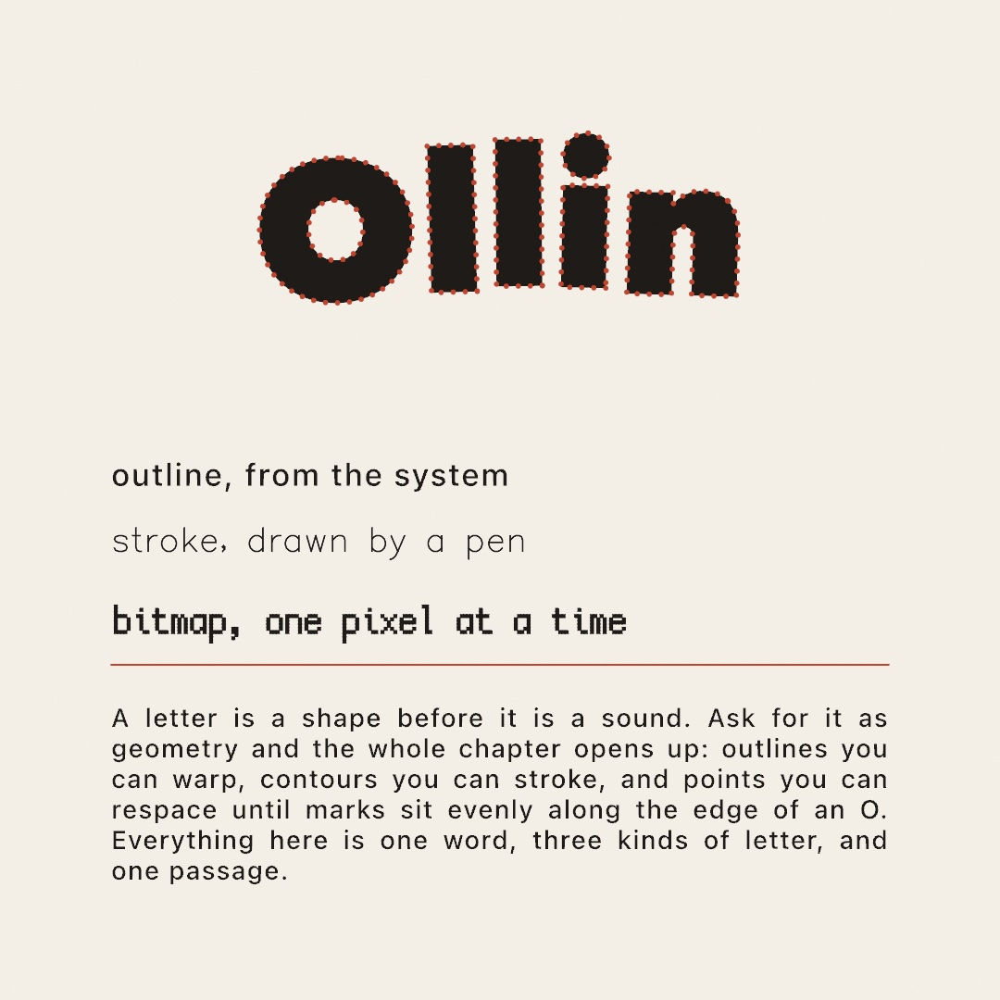
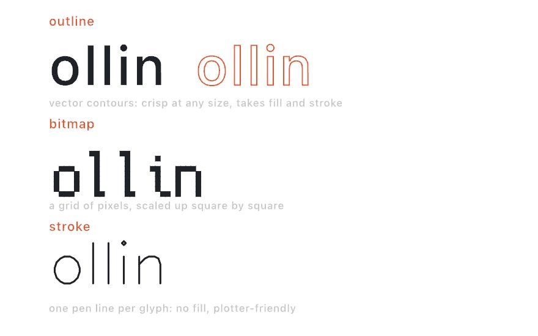
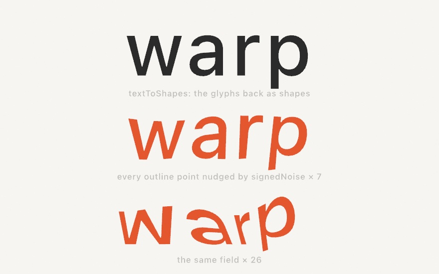
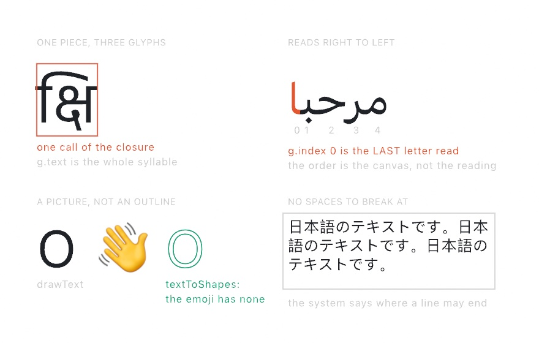
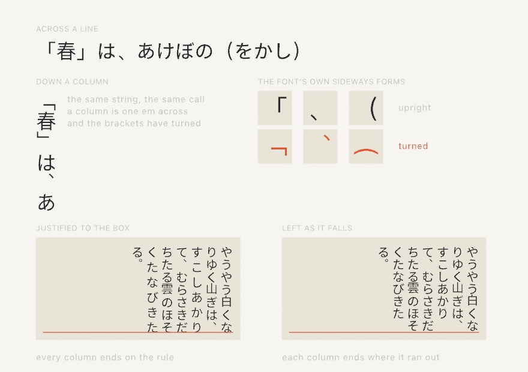

#### <sup>[Ollin](../README.md) → [Guide](README.md) → Chapter 8</sup>

---

# 8. Words



Every mark on your canvas so far has been a shape. Words are the first thing you draw that also *means* something, and they arrive with a few hundred years of craft attached. This chapter teaches how to set them and how to take them apart. You put a line of text on the canvas with one call, choose between the three kinds of font, ask for a word as geometry so its outlines can be warped, stroked, and respaced, and set a passage inside a box with both edges flush. Those steps build the specimen above: one word beaded along its own outline, the three kinds of letter under it, and a justified passage. After the sketch come the relatives. The per-glyph form hands you a word one letter at a time, which is what animation wants. And the scripts that do not work like English, with their shaping, their direction, and their columns down the page, stay one call each.

## Saying something: `drawText`

Text is one call:

```swift
import Ollin

final class Hello: Sketch {
    override func draw() {
        background(Color(hex: 0x0E1116))
        noStroke()
        fill(.white)
        textSize(140)
        textAlign(.center, .middle)
        drawText("hola", width / 2, height / 2)
    }
}
```

`drawText` puts a string at a point, and three pieces of state decide how it lands. `fill` is the ink, because text is geometry and uses the same fill as your shapes. `textSize` is the height of a line in points. `textAlign` says how the string hangs on the point you gave: `.center, .middle` centers it both ways, and the default is `.left, .baseline`, which starts the text at your x and sits it on the line type sits on. One thing to know early is that glyphs honor a stroke you have set, so a leftover `stroke(...)` from earlier drawing outlines every letter. Call `noStroke()` for plain text, or keep the stroke on purpose as a look. The untouched default stroke is the one exception. It never applies to text, so a fresh sketch's first `drawText` comes out plain.

When one label wants its own look for one call, say it in the call. `drawText("hello", at: center, size: 32, color: .white, align: .center, .middle)` styles that string alone and puts every piece of state back, leftover stroke included. The state calls above are still the way to set a look that several strings share.

A string can hold more than one line (`\n` starts the next one). Everything rides the transform stack from [Chapter 6](06-GridsAndRepetition.md), so you can translate to a point, rotate, and the words rotate with the paper.

## Three kinds of letters: outline, bitmap, and stroke fonts

Everything above used the default font, which is one of three kinds Ollin draws. They all answer to the same calls, and what differs is what a glyph *is*:

<picture>
  <source media="(prefers-color-scheme: dark)" srcset="Images/08-Words/TypeSpecimen-dark.jpg">
  
</picture>

- An **outline font** is a `.ttf` or `.otf` face, each glyph stored as vector contours. It is the default (the system font, at medium weight), it stays crisp at any size, and because a glyph renders as a shape it takes `fill` *and* `stroke`. This is the kind you will use most.
- A **bitmap font** is a small grid of pixels per glyph, scaled up square by square. The bundled one is Cozette, a 13-pixel face with wide coverage (the Spanish accents are all there). It gives pixel-art flavor and never pretends to be smooth.
- A **stroke font** is a single pen line per glyph, with no interior at all. It draws with `stroke` and ignores `fill`, and it is the letterform a pen plotter wants. Hershey Sans comes bundled.

Switching kinds is the same `textFont` call:

```swift
textFont(BitmapFont.builtIn)               // Cozette, the bundled pixel font
textFont(StrokeFont.builtIn)               // Hershey Sans, the bundled pen font
textFont(OutlineFont.systemMedium)         // back to the default
```

For outline fonts, anything installed on your Mac is a name away. The initializer returns nothing when the name does not match, so a typo fails where you can see it. Pair it with a fallback:

```swift
textFont(OutlineFont(name: "Avenir Next") ?? .system)
```

> **Swift note.** `??` means "or, if that was nothing, use this instead". `OutlineFont(name:)` returns an optional like [Chapter 2](02-Color.md)'s `Color(hex: String)`, and `?? .system` unwraps it with a default in one step.

Two more doors sit behind that same call. If the font file is a *variable* font, `variation(_:)` sets its design axes, so a word can breathe from thin to heavy while it runs (`textFont(f.variation(["wght": map(sin(time), -1, 1, 0.5, 3)]))`). And you can bundle a font file beside your sketch and load it with `OutlineFont(resource:in:)`. The [Text reference](../Docs/Drawing/Text.md) covers both, plus loading more bitmap and stroke faces.

## Text as geometry: `textToShapes`

This is the chapter's hinge. `textToShapes` gives you the glyphs *as vector shapes*, positioned where `drawText` would have put them. From that moment they are geometry like everything else in this guide: you can warp the points, stroke the contours, or scatter marks along them.

<picture>
  <source media="(prefers-color-scheme: dark)" srcset="Images/08-Words/TextWarp-dark.jpg">
  
</picture>

```swift
textSize(150)
textAlign(.center, .middle)
for shape in textToShapes("warp", width / 2, height / 2) {
    let warped = Shape(contours: shape.contours.map { c in
        Contour(c.points.map { p in
            p + Vector2(signedNoise(p.x * 0.006, p.y * 0.006),
                        signedNoise(p.x * 0.006 + 40, p.y * 0.006)) * 14
        }, closed: c.isClosed)
    })
    drawShape(warped)
}
```

Each glyph comes back as a `Shape`, a set of closed outlines, so a letter with a hole, like `o` or `a`, keeps its hole. Each outline is a `Contour`, the list of points [Chapter 7](07-Tiles.md) stroked as strands. The loop rebuilds each glyph with every outline point nudged by `signedNoise`, [Chapter 5](05-Noise.md)'s smooth field in its swing-both-ways form. The field is sampled at the point's own position, so neighboring points move together and the letter bends instead of shattering. The `* 14` is the strength, and the figure shows 0, 7, and 26. Feed `time` as a third coordinate and the letters ripple live.

Keep warps bounded and smooth. `signedNoise` never leaves `-1...1`, so scaling it gives you a hard ceiling on how far any point moves. An unbounded push can fold an outline over itself, which the fill renders as a spike.

One related fact matters when you want marks *along* the letters rather than a warp. The outline points come back unevenly spaced, dense on curves and sparse on straights, so dots placed one per point clump. Respace a glyph first, `shape.resampled(spacing: 8)`, and every point lands a steady 8 apart along the outline, ready for beads, dashes, or particles. The [`GlyphContours` example](../Examples/Text/GlyphContours/Sketch.swift) builds shimmering dotted type in its bottom row from those two calls.

> **Swift note.** `.map { }` builds a new list by transforming every element of an old one. `c.points.map { p in ... }` reads "a new list of points, each computed from `p`". It is [Chapter 1](01-HelloOllin.md)'s loop in a shorter form, and you will see it wherever a whole list changes at once.

## Both edges flush: the box form and justification

So far every string has been one line hung from a point. A passage wants a box. Hand `drawText` a `Rectangle` and it breaks the text to fit inside, line by line, wrapping where the system says a line may break. The specimen's last part is a passage set that way, and by default each line stops where its last word ends. `textJustify()` opens the spaces instead, until every full line reaches the box's right edge:

```swift
let box = Rectangle(x: 120, y: 758, width: 840, height: 280)
textAlign(.left, .top)
textJustify()
drawText(passage, in: box)
```

<!-- figure: BothEdgesFlush (Images/08-Words/BothEdgesFlush.jpg and -dark.jpg), one Latin passage in two boxes, ragged beside justified; waiting on a render from Guide/Figures/08-Words/BothEdgesFlush.swift -->

Justification needs to know how far a line should run, and only a box says that. So it applies to the box form of `drawText` and to nothing else. The last line of each paragraph keeps its natural length, because the writing ended there. `noTextJustify()` turns it back off, and `textAlign` still decides which corner of the box the passage opens from.

Where the extra room goes is the layout engine's business. English opens the spaces between words. A script with no spaces opens the gaps between its characters instead, which the scripts family after the sketch comes back to. Either way you ask for the same thing.

One more setting belongs to the box. `textHangingPunctuation()` lets a full stop or comma that will not fit sit past the box's edge, instead of taking the word before it to the next line, which keeps the right margin looking straight. [textHangingPunctuation](../Docs/Drawing/Text.md#hanging) in the reference has the rule, and [`Text/HangingStops`](../Examples/Text/HangingStops/Sketch.swift) sets one passage both ways.

## Putting it together: a type specimen

Now you can build the sheet at the top. A specimen is what type designers make to show a face off, which makes it the right shape for this sketch: one word set large, the three kinds of letter under it, and a passage set flush. The headline is the part that matters. By the time it reaches the canvas it is geometry. Make a new file, `MySketches/Specimen.swift`:

```swift
import Ollin

final class Specimen: Sketch {
    @Param("Bead spacing", 6.0...26.0) var beadSpacing = 13.0
    @Param("Bead size", 1.0...6.0) var beadSize = 2.6
    @Param("Justify") var justified = true

    let paper = Color(hex: 0xF4EFE6)
    let ink = Color(hex: 0x1E1B18)
    let accent = Color(hex: 0xC1442E)

    let passage = """
        A letter is a shape before it is a sound. Ask for it as geometry and \
        the whole chapter opens up: outlines you can warp, contours you can \
        stroke, and points you can respace until marks sit evenly along the \
        edge of an O. Everything here is one word, three kinds of letter, and one passage.
        """

    override func draw() {
        background(paper)

        // The headline is not text. It is a set of outlines, filled in ink,
        // then respaced so the beads sit an even distance apart along them.
        textFont(OutlineFont(name: "Avenir Next Heavy") ?? .systemBold)
        textSize(210)
        textAlign(.center, .middle)
        for glyph in textToShapes("Ollin", width / 2, 250) {
            noStroke()
            fill(ink)
            drawShape(glyph)

            fill(accent)
            for contour in glyph.resampled(spacing: beadSpacing).contours {
                for p in contour.points {
                    drawCircle(center: p, radius: beadSize)
                }
            }
        }

        // The same line in each of the three kinds of letter. They take three
        // separate calls because each kind is its own type, and the pen font
        // takes a stroke rather than a fill, which is the whole point of it.
        textAlign(.left, .middle)

        noStroke()
        fill(ink)
        textFont(OutlineFont.systemMedium)
        textSize(34)
        drawText("outline, from the system", 120, 512)

        noFill()
        stroke(ink)
        strokeWeight(1.6)
        textFont(StrokeFont.builtIn)
        textSize(34)
        drawText("stroke, drawn by a pen", 120, 587)

        noStroke()
        fill(ink)
        textFont(BitmapFont.builtIn)
        textSize(24)
        drawText("bitmap, one pixel at a time", 120, 662)

        stroke(accent)
        strokeWeight(2)
        drawLine(120, 718, 960, 718)

        // The passage, set flush on both edges inside its box.
        noStroke()
        fill(ink)
        textFont(OutlineFont.systemMedium)
        textSize(28)
        textAlign(.left, .top)
        if justified { textJustify() } else { noTextJustify() }
        drawText(passage, in: Rectangle(x: 120, y: 758, width: 840, height: 280))
    }
}
```

Run it, then drag the bead spacing. What each part contributes:

- `textToShapes` is the hinge. The headline is drawn twice from one call: filled as a shape, then beaded along the *same* outline. A line of text hands you neither.
- `resampled(spacing:)` is what makes the beads even. Outline points come back dense on curves and sparse on straights, so beads placed one per raw point would clump around the O and thin out along the l. Respacing first puts every point a fixed distance from the last one.
- The three font blocks are three calls because each kind of font is its own type. The pen font is the one to watch. It draws with `stroke`, so leaving `noStroke` set from the headline makes it disappear with no error at all.
- `drawText(_:in:)` wraps the passage inside a rectangle, and `textJustify()` opens the spaces so both edges line up. Turn the `Justify` parameter off and the right edge goes ragged, which is the same passage doing less work.

When a specimen is a keeper, export it as a still:

```sh
swift run OllinLive MySketches/Specimen.swift --export specimen.png
```

Before moving on, make it yours:

- Warp the headline before you bead it, using the `signedNoise` push from [Text as geometry](#text-as-geometry-texttoshapes). The beads follow the outline wherever it goes, because they are computed from it.
- Set `beadSpacing` to 26 and `beadSize` to 5.5. The beads stop reading as a texture and start reading as a dotted rule.
- Swap the headline for a word in a script you do not read. Everything here works the same way, and the scripts family below says why.
- Drop the fill and keep only the beads, on a dark ground. The word stays readable from its outline alone.

## Letters one at a time: the per-glyph form

The specimen set its headline as one shape and its lines as one string each. `drawText` has a second form that hands you a string one glyph at a time, so each letter can carry its own color, its own position, and its own motion. The specimen has no use for it, but it is what animation wants, and the scripts family after it reads through the same closure.

### Letters that move: `drawText` with a closure

Per-glyph drawing turns typography into animation material. Add a closure to `drawText` and it runs once per letter:


```swift
let palette = Palette([
    Color(hex: 0x5E60CE), Color(hex: 0x64DFDF),
    Color(hex: 0xFFB703), Color(hex: 0xE56B6F), Color(hex: 0x8AC926),
])

textSize(230)
textAlign(.center, .middle)
drawText("ollin", width / 2, height / 2) { g in
    fill(palette[g.index])
    withState {
        translate(0, sin(time * 2.6 + Double(g.index) * 0.9) * 90)
        g.draw()
    }
}
```

`g` knows which glyph it is (`g.index`), where it belongs, and how to stamp itself (`g.draw()`), so you set whatever state you like around it, here a color per letter and a vertical bob. The `+ Double(g.index) * 0.9` is [Chapter 3](03-MotionAndTime.md)'s phase trick. Each letter runs the same swing with a head start, which is what makes the word roll like a wave instead of jumping as a block.

Two relatives use the same idea. `drawText(_:along:)` lays a string along any `Path`, glyphs rotating to follow the curve, and `drawText(_:in:)` is the box form you set the passage with. Both are one call, and the [per-glyph reference](../Docs/Drawing/Text.md#perglyph) has the closure's other properties, its bounds and its progress along the string. [`Text/GlyphWave`](../Examples/Text/GlyphWave/Sketch.swift) runs the wave live, and [`Text/TextOnPath`](../Examples/Text/TextOnPath/Sketch.swift) sends a line around a curve.

## Every script: shaping, direction, columns, and fallback

One glyph per letter is an English idea. Every call in this chapter works for any script with no setup, because the system's layout engine shapes the text and finds a font that has the letters. What changes is what a glyph is, which way a line runs, how a paragraph breaks, and where the columns go. The specimen sets Latin, so none of this touched it. Swap its headline for Arabic or Devanagari and all of it does.

### Shaping and direction: text in any script

Paste in Arabic, Japanese, Devanagari, or Thai and it draws. The figure shows four assumptions that stop being true.

<picture>
  <source media="(prefers-color-scheme: dark)" srcset="Images/08-Words/EveryScript-dark.jpg">
  
</picture>

**A glyph is smaller than a letter, and sometimes larger.** The top-left panel is one Devanagari syllable. It is written with four characters and drawn with three glyphs, and one glyph sits to the *left* of the letter it follows. So the per-glyph closure hands you a **piece**: one thing a reader would point at. `g.text` is therefore a `String`, holding all four characters here. `g.character` still returns a single `Character` for the common case.

**Direction is a property of the line, not the font.** The top-right panel numbers an Arabic word as the closure sees it. The pieces come out left to right *on the canvas*, so `g.index` 0 is the letter read last. Use that order when sweeping across the drawing, and count backwards to follow the reading.

A line can hold both directions at once. Then the neutral characters (spaces, brackets, digits) land wherever the *base* direction says. Usually the text answers that for itself. A line opening with a bracket cannot, and `textDirection(.leftToRight)` or `.rightToLeft` says which you meant.

**Some of what you type has no outline.** The bottom-left panel draws `O 👋` twice, with `drawText` and then through `textToShapes`. Only the `O` comes back as geometry. The emoji font stores each one as a bitmap, so there are no contours. `drawText` still puts it on the canvas as a picture with its own colors, which is why `fill` does not touch it. In a closure, `g.isPicture` marks those, and `g.draw()` works for them.

**A space is not how most writing ends a word.** The bottom-right panel is a Japanese paragraph in a box. Japanese may break between almost any two characters, and Thai only between words. No space tells you either. So box layout asks the system instead of splitting on spaces, and the system's break set carries the Japanese rules with it: a full stop may not open a line, and an opening bracket may not close one. [Every script](../Docs/Drawing/Text.md#scripts) in the reference has each rule in full, and [`Text/Scripts`](../Examples/Text/Scripts/Sketch.swift) sets five scripts on one sheet with the base direction as a live parameter.

### Down the page: vertical text

Japanese is also written the other way. The same sentence can run down the page, in columns that fill right to left, and one setting says so:

```swift
textDirection(.topToBottom)
drawText("「春」は、あけぼの（をかし）", 820, 80)
```

<picture>
  <source media="(prefers-color-scheme: dark)" srcset="Images/08-Words/WritingInColumns-dark.jpg">
  
</picture>

Every turned character comes from the font. The middle of the figure shows three of them: the bracket lies down, and the comma leaves the bottom left of its square and takes the top right. Those shapes are the writing system's own answer, kept in the face, and asking for vertical setting is what picks them.

Turning the writing turns the settings with it. A `\n` starts the next column, to the left. A box wraps against its height, and the two halves of `textAlign` swap jobs, so vertical text in a box usually wants `textAlign(.right, .top)`, the corner the writing opens at. The bottom of the figure is a passage justified into its box, with every full column reaching the rule. [Writing in columns](../Docs/Drawing/Text.md#vertical) has the table of what each setting does once the writing turns, and [`Text/Columns`](../Examples/Text/Columns/Sketch.swift) sets a passage down the page, justified into its box.

Traditional Mongolian runs down the page too, with columns that fill left to right and letters that join into one stroke, so the framework shapes each column as a line and stands it up. `textDirection(.topToBottomLeftToRight)` asks for it, [Columns that fill the other way](../Docs/Drawing/Text.md#mongolian) says which face to hand it and why, and [`Text/MongolianColumns`](../Examples/Text/MongolianColumns/Sketch.swift) sets a phrase both ways.

### What the font could not do: `fontsUsed` and `textMissingCharacters`

Two calls help when a script comes out wrong. `fontsUsed(for:)`, asked of the font itself, names the faces a line borrowed, which is how you catch a Latin font handing your Japanese to another face. `textMissingCharacters` lists what the current font cannot draw at all. For an outline font it is almost always empty. For bitmap and plotter fonts it matters, because those hold only their own glyphs, and anything else draws nothing. [textMissingCharacters](../Docs/Drawing/Text.md#missing) in the reference has both.

## Where this comes from

Type on a computer screen owes its shape to a long argument about what a letter *is*. The outline font, a letter as a set of filled curves that scale to any size, arrived commercially with PostScript in 1984 and settled the argument for print. The bitmap font, a letter as a small grid of pixels drawn for one exact size, is the older answer and the one that never left, and the bundled Cozette is a modern face in that tradition. The stroke font is older still, and comes from machines that held a pen rather than pixels. Allen Hershey digitized his vector faces at the US Naval Weapons Laboratory in the late 1960s so a plotter could write them, and the bundled Hershey Sans descends from that work.

Justification, the business of stretching spaces so both edges line up, was hand craft for centuries. Donald Knuth and Michael Plass gave it an algorithm in 1981 that breaks a whole paragraph at once rather than greedily line by line. The scripts of the world reached computers much later and much less evenly, which is why Unicode's bidirectional algorithm exists at all, and why the vertical writing this chapter shows is still an option a layout engine has to be asked for. Full credits are in the project's [attribution notes](../ATTRIBUTION.md).

## Go deeper

- [Text](../Docs/Drawing/Text.md): the full reference, including text on a path, box wrapping, metrics (`textWidth`, `textBounds`), variable-font axes, [every script](../Docs/Drawing/Text.md#scripts) with `textDirection` and `textMissingCharacters`, columns down the page and the Mongolian columns that fill the other way, hanging punctuation, and loading bitmap, outline, and stroke faces of your own.
- Appendix B draws the geometry behind the glyphs: [Shapes as regions](B-JustEnoughMath.md#shapes-as-regions), and [Shaping a value](B-JustEnoughMath.md#shaping-a-value) for the warp.
- Worked examples, in [`Examples/Text/`](../Examples/Text/): `GlyphWave` (per-glyph motion), `TextOnPath`, `TextBox`, `VariableFont`, `TypeAsGeometry` (the warp live, plus the seeded per-frame jitter), `StrokeText` and `PlaydateFont` (the other two font kinds in action), `TextVolume` (the atlas mode at paragraph scale), `GlyphContours` (respaced outlines as curve, polygon, and shimmering dots), `Scripts` (five scripts on one sheet, with the base direction as a live parameter), `Columns` and `MongolianColumns` (the two vertical writings), and `HangingStops` (one passage with and without its stops hung).
- The Cordeiro homage [`Derivadas`](../Examples/Recreations/WaldemarCordeiro/Derivadas/Sketch.swift): characters used as marks of ink rather than as words. Each one is set a little smaller than its cell, so the marks stand apart as a line printer's did. A darker mark is two or three characters drawn on the same place, the way the printer struck a line again without moving the paper.
- The Sato homage [`StraightLines`](../Examples/Recreations/OsamuSato/StraightLines/Sketch.swift): a font where every filled cell of a letter is three short horizontals, set around an eye built of nothing but straight lines. The letters are a table of strings, one per row. Type any word into `word` and it is set wherever it clears the eye.
- Next door: [Chapter 9](09-Pictures.md) brings in the other kind of outside material, pictures and numbers, and ends by painting one with the type you just learned to set.

---

[Contents](README.md#contents) · Previous: [Chapter 7, Tiles that cover the plane](07-Tiles.md) · Next: [Chapter 9, Pictures and data](09-Pictures.md)
