#### <sup>[Ollin](../README.md) → [Guide](README.md) → Chapter 8</sup>

---

# 8. Words and pictures

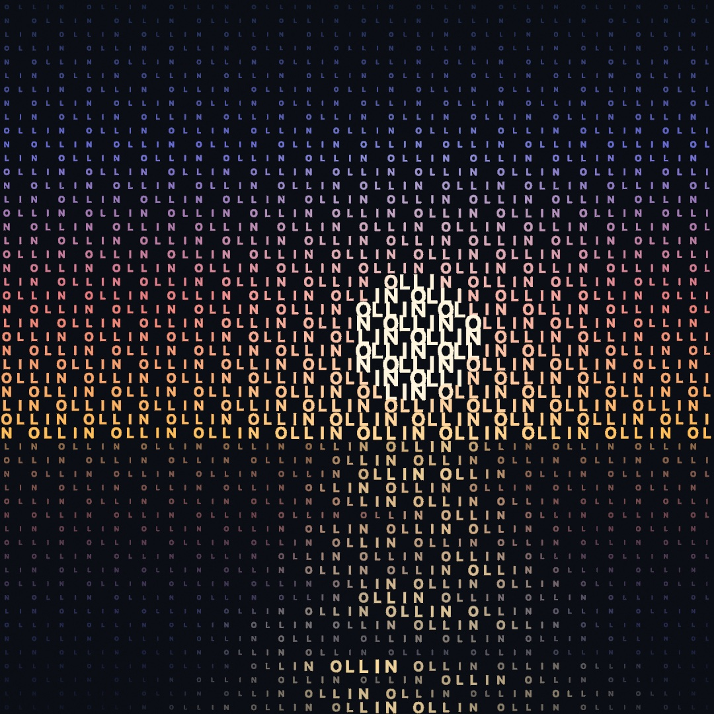

So far every mark on your canvas has been a shape. This chapter adds the other two things a canvas usually carries, words and pictures. Both arrive the same way the shapes did, as material you can measure, warp, and sample, and the chapter ends with the two meeting in the piece above: a sunset built out of its own caption, every letter sized and colored by the pixel it stands on.

## Saying something

Text is one call:

```swift
import Ollin

final class Hello: Sketch {
    override func draw() {
        background(Color(hex: 0x0E1116))
        noStroke()
        fill(.white)
        textSize(140)
        textAlign(.center, .middle)
        drawText("hola", width / 2, height / 2)
    }
}
```

`drawText` puts a string at a point, and three pieces of state decide how it lands: `fill` is the ink (text is geometry, so it uses the same fill as your shapes), `textSize` is the height of a line in points, and `textAlign` says how the string hangs on the point you gave. `.center, .middle` centers it both ways, and the default is `.left, .baseline`, which starts the text at your x and sits it on the line type sits on. One thing to know early is that glyphs honor `stroke` too, so a leftover 1-pixel stroke will outline every letter. Call `noStroke()` for plain text, or keep the stroke on purpose (it's a look).

A string can hold more than one line (`\n` starts the next one), and everything rides the transform stack from [Chapter 6](06-GridsAndRepetition.md), so you can translate to a point, rotate, and the words rotate with the paper.

## Three kinds of letters

Everything above used the default font, which is one of three kinds Ollin draws. They all answer to the same calls, and what differs is what a glyph *is*:

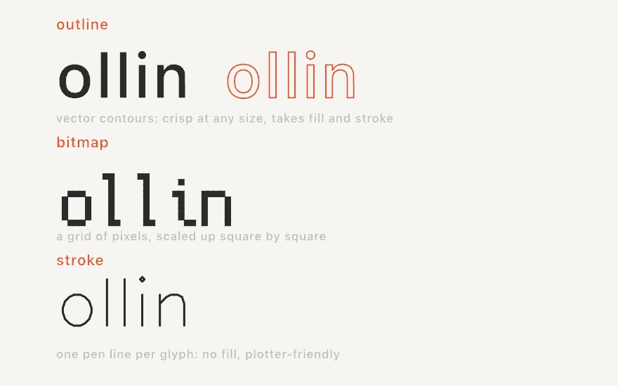

- An **outline font** is a real `.ttf`/`.otf` face, each glyph stored as vector contours. It's the default (the system font, at medium weight), it stays crisp at any size, and because a glyph renders as a shape it takes `fill` *and* `stroke`. This is the kind you'll use most.
- A **bitmap font** is a small grid of pixels per glyph, scaled up square by square. The bundled one is Cozette, a 13-pixel face with wide coverage (the Spanish accents are all there). It brings instant pixel-art flavor and never pretends to be smooth.
- A **stroke font** is a single pen line per glyph, no interior at all. It draws with `stroke` and ignores `fill`, and it's the letterform a pen plotter wants. Hershey Sans comes bundled.

Switching kinds is the same `textFont` call:

```swift
textFont(BitmapFont.builtin)               // Cozette, the bundled pixel font
textFont(StrokeFont.builtin)               // Hershey Sans, the bundled pen font
textFont(OutlineFont.systemMedium)         // back to the default
```

For outline fonts, anything installed on your Mac is a name away, and the initializer returns nothing when the name doesn't match, so a typo fails where you can see it. Pair it with a fallback:

```swift
textFont(OutlineFont(name: "Avenir Next") ?? .system)
```

> **Swift note.** `??` means "or, if that was nothing, use this instead". `OutlineFont(name:)` returns an optional like [Chapter 2](02-Color.md)'s `Color(hex: String)`, and `?? .system` unwraps it with a default in one step.

Two more doors worth knowing are behind that same call. If the font file is a *variable* font, `variation(_:)` sets its design axes, so a word can breathe from thin to heavy while it runs (`textFont(f.variation(["wght": map(sin(time), -1, 1, 0.5, 3)]))`). And you can bundle a font file beside your sketch and load it with `OutlineFont(resource:in:)`. The [Text reference](../Docs/Drawing/Text.md) covers both, plus loading more bitmap and stroke faces.

## Letters that move

`drawText` has a second form that hands you the string one glyph at a time, and it turns typography into animation material:

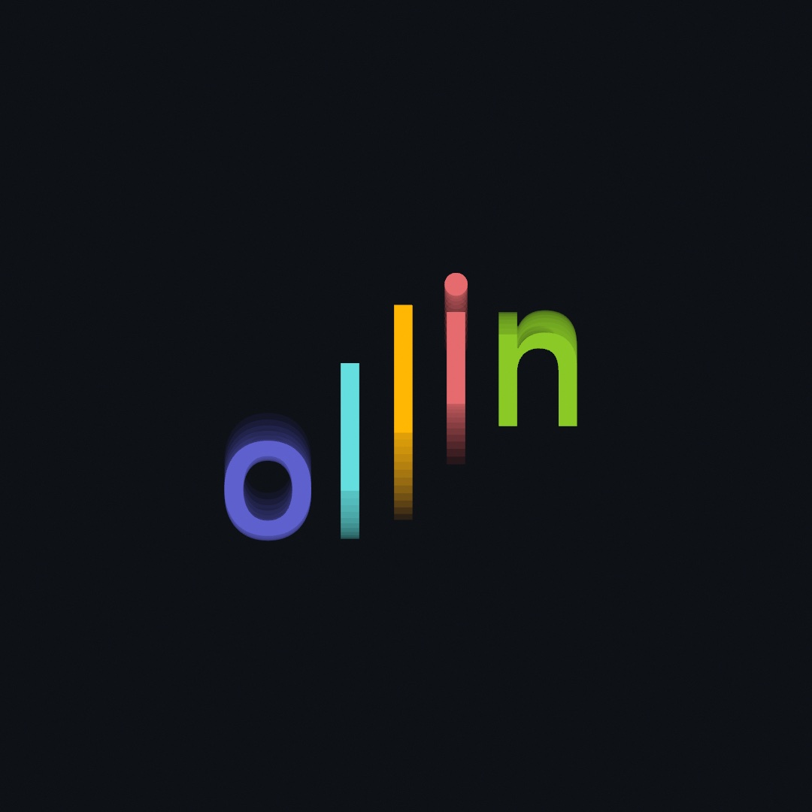

```swift
let palette = Palette([
    Color(hex: 0x5E60CE), Color(hex: 0x64DFDF),
    Color(hex: 0xFFB703), Color(hex: 0xE56B6F), Color(hex: 0x8AC926),
])

textSize(230)
textAlign(.center, .middle)
drawText("ollin", width / 2, height / 2) { g in
    fill(palette[g.index])
    withState {
        translate(0, sin(time * 2.6 + Double(g.index) * 0.9) * 90)
        g.draw()
    }
}
```

The closure runs once per letter. `g` knows which glyph it is (`g.index`), where it belongs, and how to stamp itself (`g.draw()`), so you set whatever state you like around it, here a color per letter and a vertical bob. The `+ Double(g.index) * 0.9` is [Chapter 3](03-MotionAndTime.md)'s phase trick, each letter running the same swing with a head start, which is what makes the word roll like a wave instead of jumping as a block. (The committed figure, [`LetterWave.swift`](Figures/08-WordsAndPictures/LetterWave.swift), draws a few time-shifted copies at low alpha before the front one, so the motion leaves trails in a still image. Open it to see the whole file.)

Two relatives to file away: `drawText(_:along:)` lays a string along any `Path`, glyphs rotating to follow the curve, and `drawText(_:in:)` wraps a paragraph into a rectangle. Both are one call, and the [Text reference](../Docs/Drawing/Text.md) has them.

## Text as geometry

This is the chapter's biggest idea. `textToShapes` gives you the glyphs *as vector shapes*, positioned exactly where `drawText` would have put them, and from that moment they're geometry like everything else in this guide: you can warp the points, stroke the contours, or scatter marks along them.

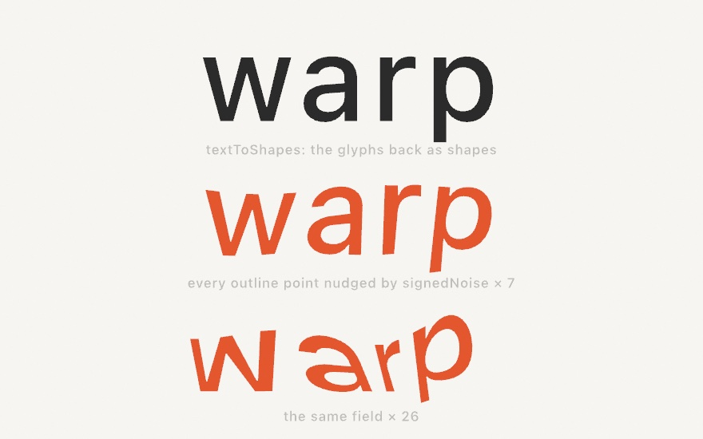

```swift
textSize(150)
textAlign(.center, .middle)
for shape in textToShapes("warp", width / 2, height / 2) {
    let warped = Shape(contours: shape.contours.map { c in
        Contour(c.points.map { p in
            p + Vector2(signedNoise(p.x * 0.006, p.y * 0.006),
                        signedNoise(p.x * 0.006 + 40, p.y * 0.006)) * 14
        }, closed: c.isClosed)
    })
    drawShape(warped)
}
```

Each glyph comes back as a `Shape`, a set of closed outlines (a letter with a hole, like `o` or `a`, keeps its hole). The loop rebuilds each one with every outline point nudged by `signedNoise`, [Chapter 5](05-Noise.md)'s smooth field in its swing-both-ways form, sampled at the point's own position so neighboring points move together and the letter bends instead of shattering. The `* 14` is the strength, and the figure shows 0, 7, and 26. Feed `time` as a third coordinate and the letters ripple live.

Here's one warning from experience. Keep warps bounded and smooth. `signedNoise` never leaves `-1...1`, so scaling it gives you a hard ceiling on how far any point moves. An unbounded push can fold an outline over itself, which the fill renders as a spike.

There's a related fact worth knowing when you want marks *along* the letters rather than a warp. The outline points come back unevenly spaced (dense on curves, sparse on straights), so dots placed one-per-point clump. Respace a glyph first, `shape.resampled(spacing: 8)`, and every point lands a steady 8 apart along the outline, ready for beads, dashes, or particles. The [`PointShimmer` example](../Examples/Text/PointShimmer/Sketch.swift) builds shimmering dotted type from exactly those two calls.

> **Swift note.** `.map { }` builds a new list by transforming every element of an old one: `c.points.map { p in ... }` reads "a new list of points, each computed from `p`". It's the loop from [Chapter 1](01-HelloOllin.md) wearing a shorter coat, and you'll see it wherever a whole list changes at once.

## Not every language works like English

One glyph per letter is an English idea.

Every call above works for any script without configuration. Paste in Arabic, Japanese, Devanagari or Thai and it draws. The system's layout engine shapes it. It finds a font that has the right letters. The figure shows four assumptions that stop being true.

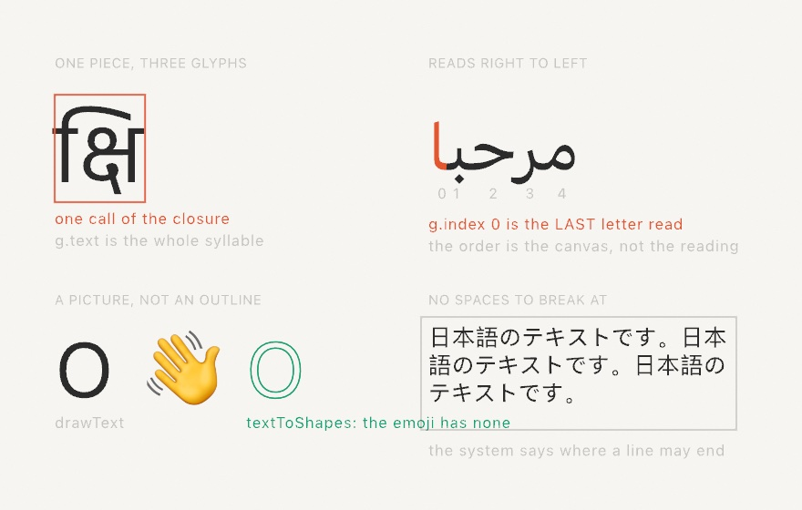

**A glyph is smaller than a letter, and sometimes larger.** The top-left panel is one Devanagari syllable. It is written with four characters and drawn with three glyphs. One glyph sits to the *left* of the letter it follows. So the closure hands you a **piece**: one thing a reader would point at. `g.text` is therefore a `String`, holding all four characters here. `g.character` still returns a single `Character` for the common case.

**Direction is a property of the line, not the font.** The top-right panel numbers an Arabic word as the closure sees it. The pieces come out left to right *on the canvas*. So `g.index` 0 is the letter read last. Use that order when sweeping across the drawing. Count backwards to follow the reading.

A line can hold both directions at once. Then the neutral characters (spaces, brackets, digits) land wherever the *base* direction says. Usually the text answers that for itself. A line opening with a bracket cannot. `textDirection(.leftToRight)` or `.rightToLeft` says which you meant.

**Some of what you type has no outline.** The bottom-left panel draws `O 👋` twice: with `drawText`, then through `textToShapes`. Only the `O` comes back as geometry. The emoji font stores each one as a bitmap, so there are no contours. `drawText` still puts it on the canvas as a picture with its own colors. That is why `fill` does not touch it. In a closure, `g.isPicture` marks those, and `g.draw()` works for them.

**A space is not how most writing ends a word.** The bottom-right panel is a Japanese paragraph in a box. Japanese may break between almost any two characters, and Thai only between words. No space tells you either. So box layout asks the system instead of splitting on spaces.

Box layout carries the Japanese rules along with it. A full stop may not open a line, and an opening bracket may not close one. The system's break set already knows, so a comma arrives joined to the character before it and travels with it.

## Down the page: vertical text

Japanese is also written the other way.

The same sentence can run down the page, in columns that fill right to left. One setting says so:

```swift
textDirection(.topToBottom)
drawText("「春」は、あけぼの（をかし）", 820, 80)
```

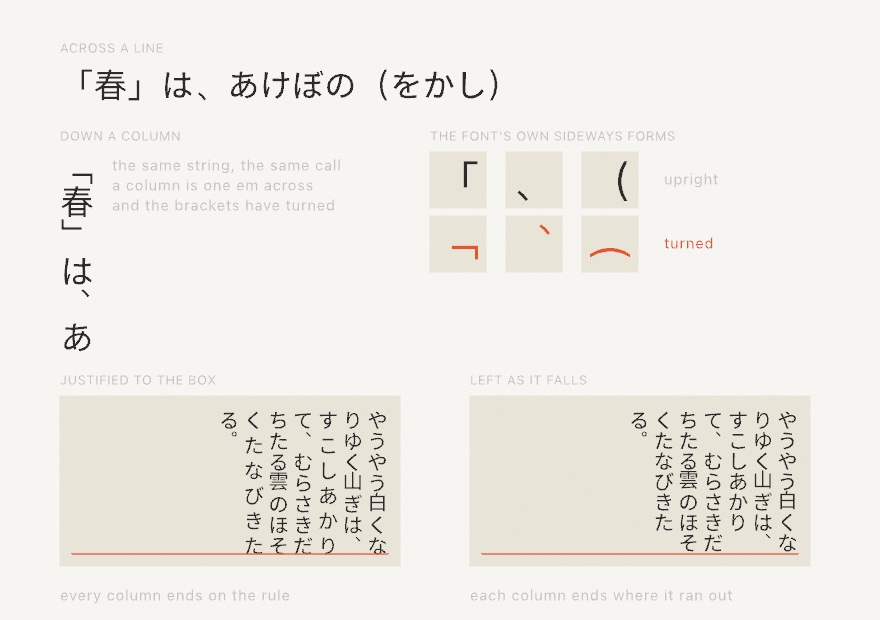

Every turned character comes from the font. The middle of the figure shows three of them. The bracket lies down. The comma leaves the bottom left of its square and takes the top right. Those shapes are the writing system's own answer, kept in the face, and asking for vertical setting is what picks them.

Which is why the face decides what happens to English inside a column. A Japanese face carries a turned `A`, so a word among the kana reads sideways. A Latin face has none, so its letters stack upright.

Turning the writing turns the settings with it. A `\n` starts the next column, to the left. `textWidth` measures how long the column is. A box wraps against its height, because that is the room a column has to run in. And the two halves of `textAlign` swap jobs: the vertical one says where a column starts, the horizontal one places the block of columns. So vertical text in a box usually wants `textAlign(.right, .top)`, which is the corner the writing opens at.

## The other way down: Mongolian

Mongolian runs down the page too. Its columns fill the other way.

```swift
textFont(OutlineFont(name: "Noto Sans Mongolian")!)
textDirection(.topToBottomLeftToRight)
drawText("ᠮᠣᠩᠭᠣᠯ ᠪᠢᠴᠢᠭ", 200, 120)
```

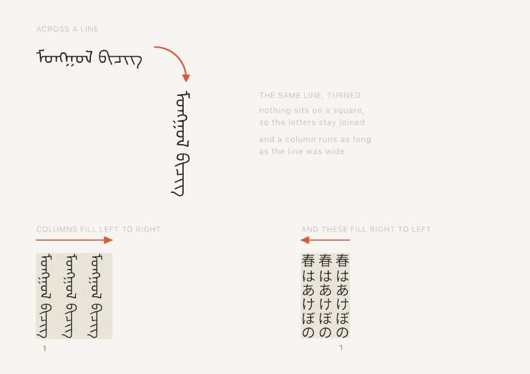

The column order is the easy half. The half that matters is that these letters join. A word is one connected stroke. Each letter is as wide as its own shape, so no square can hold it.

**A column here is a line, tipped on its side.** Ollin shapes it across the page the way it shapes any line, keeping the joins and the widths. Then it turns that line a quarter turn clockwise. The top of the figure shows one phrase twice, once lying flat and once standing up. The column is as long as the line was wide. It is the same line, stood up.

The rest works as it did. A `\n` starts the next column, to the right this time. The two halves of `textAlign` still swap jobs. A box fills from `textAlign(.left, .top)`, where this writing opens.

Two things change with the turn. A column is as wide as the face's ascent and descent together, rather than one em. And you have to hand it a face that has the script. The system font does not have it. A column takes its width from the face you gave it. The wrong face gives you columns that sit on each other.

Japanese wants `.topToBottom`. This mode would lay every character on its side.

## Both edges flush: justification

So far every string has been one line hung from a point. The box form wraps a paragraph instead. Hand `drawText` a `Rectangle` and it breaks the text to fit inside, line by line. Down-the-page writing fills it in columns instead.

```swift
let box = Rectangle(x: 90, y: 90, width: 560, height: 700)
textJustify()
drawText(passage, in: box)
```

The bottom of the columns figure, further up, is one passage set twice in the same box. On the left every full column reaches the red rule. On the right each one stops where it happened to stop.

Justification needs to know how far a line should run, and only a box says that. So it applies to the box form of `drawText` and to nothing else. The last line of each paragraph keeps its natural length: that one is short because the writing ended there.

Where the extra room goes is the layout engine's business. English opens the spaces between words. Japanese has no spaces, so it opens the gaps between characters instead. Either way you ask for the same thing.

## Letting a stop hang: hanging punctuation

A full stop may not open a line. So a stop that will not fit takes the character it follows to the next line with it. That leaves a hole at the edge where the two of them used to be.

```swift
textHangingPunctuation()
drawText(passage, in: box)
```

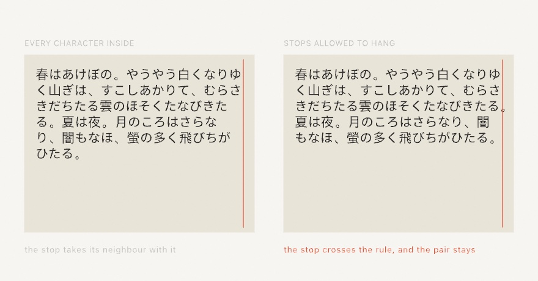

**The stop is allowed outside the box, so the writing can stay inside it.** Both boxes here are the same width and hold the same passage. On the right the stops that would not fit cross the rule instead of pushing their neighbour down. The whole passage comes out a line shorter.

Japanese calls this ぶら下げ. Latin typesetters do the same thing to keep a right margin looking straight. Only stops and commas hang, in either script. A closing bracket may not open a line either, but hanging one would leave it outside the thing it closes.

Like justification, this is about the box, so it applies to `drawText(_:in:)` and nothing else. A hung character is left out of how far its line counts as running, so alignment and justification measure the rest of it.

It only shows where a stop would not otherwise fit. Change the box width and the effect comes and goes, which is worth knowing before you decide it is broken.

## What the font could not do

Two more calls help when you go looking. `OutlineFont.fontsUsed(for:)` names the faces a line borrowed. That is how you catch a Latin font handing your Japanese to somebody else. `textMissingCharacters` lists what the current font cannot draw at all. For an outline font it is almost always empty. For bitmap and plotter fonts it matters: those hold only their own glyphs. Anything else draws nothing.

## Pictures

Images follow the pattern you already know from fonts: load once in `setup()`, keep the result, draw it in `draw()`.

```swift
final class Photo: Sketch {
    var photo: Image?

    override func setup() {
        photo = loadImage("/Users/you/Pictures/leaf.jpg")
    }

    override func draw() {
        background(.black)
        if let photo {
            drawImage(photo, 0, 0, width, height)     // stretched to fill
        }
    }
}
```

`loadImage` reads anything the system can decode (PNG, JPEG, HEIC, and friends) and returns an optional, since a path can be wrong. `drawImage` places the image by its top-left corner, at native size or scaled into a box, and it composites in draw order with everything else, riding the transform stack like a shape. For an image that travels with your sketch, drop the file in the same folder and load it with `Image(resource: "leaf", extension: "jpg", in: .module)`.

One piece of state changes how images land: `tint`. It multiplies every pixel by a color as the image draws, so the RGB washes the image and the alpha fades it:

```swift
tint(Color(red: 1.0, green: 0.75, blue: 0.4))   // a warm wash
drawImage(photo, 0, 0, width, height)
tint(Color(white: 1, alpha: 0.3))               // ghostly, 30% opacity
drawImage(photo, 60, 60, width, height)
noTint()                                        // back to as-is
```

Tint never edits the image itself, only how it's drawn, and `withState { }` scopes it like any other state.

## An image you can ask

The real gift of `Image` for generative work isn't drawing it, it's *reading* it. The subscript `image[x, y]` returns the color stored at a pixel, and suddenly a picture is a field of answers, like [Chapter 5](05-Noise.md)'s noise but authored by a camera or by you:

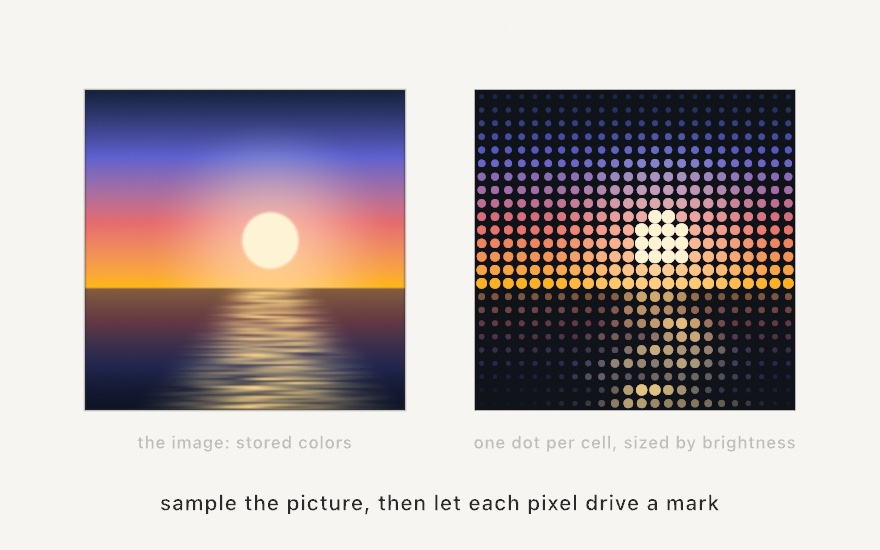

The right panel asks the image one question per grid cell and draws the answer as a dot. The recipe has two small pieces. First, a cell's position maps to a pixel index by fractions. A cell at fraction `u` across the grid reads column `Int(u * Double(image.width - 1))`, and rows work the same way, so any grid samples any image size. Second, "how bright is this pixel" takes one more line than you might guess, because your eye does not weigh the three channels equally, with green counting most and blue least. The standard weights are

```swift
let brightness = c.red * 0.2126 + c.green * 0.7152 + c.blue * 0.0722
```

and that single number is the handle generative artists pull most: size by it, choose by it, gate by it. ([Appendix B](B-JustEnoughMath.md#perceived-brightness) keeps this one, since averaging the channels instead makes yellows read too dark and blues too bright.) Ollin also carries the ask as a property, `c.luminance`, measured a touch more faithfully on the linearized components. The handwritten weights are the idea, and the property is the everyday spelling.

You can also write pixels. `Image(width:height:)` makes a blank image, `image[x, y] = color` paints one pixel, and that's how this chapter's figures work. The repository ships no photograph, so the sunset on the left is *authored*, about twenty lines of [Chapter 2](02-Color.md) ramps, one `smoothstep` sun, and [Chapter 5](05-Noise.md) noise for the water, written pixel by pixel in `setup()`. The listing below contains the whole recipe, and everything in this section works identically on a photo you load with `loadImage`.

## A picture as marks

Reading a pixel and drawing a mark is such a common move that Ollin ships two finished versions of it, and both are worth knowing before you hand-roll your own.

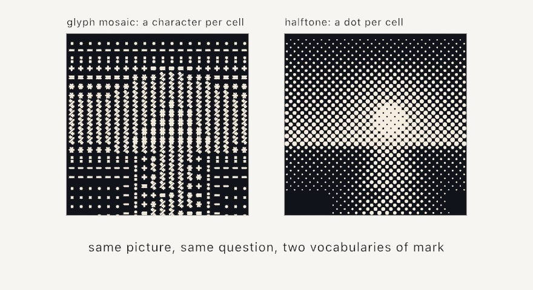

`drawGlyphMosaic` divides the picture into a grid and puts one character in each cell:

```swift
textFont(BitmapFont.builtin)
fill(.white)
drawGlyphMosaic(picture, columns: 72)
```

The interesting part is how it picks the character. It doesn't use a ramp somebody typed out from memory. It *measures* every character you offer it in the font you're currently using, counting lit pixels for a bitmap font, outline area for an outline font, pen travel for a stroke font, and then matches each cell to the character whose ink comes closest. So any string works as a ramp, in any font, and the tones stay honest. `GlyphSet.technical`, `.classic`, and `.blocks` are curated sets to start from, and `glyphScale` is the fraction of its cell a glyph draws at, defaulting to 0.85 so gutters keep even the densest characters reading as separate marks.

`drawHalftone` does the same job with the printing industry's answer, which is one dot per cell, grown until it covers the right fraction of that cell:

```swift
fill(.black)
noStroke()
drawHalftone(picture, pitch: 14)
```

`pitch` is the cell size and `angle` rotates the screen, defaulting to the 45 degrees printers have used for a century because a diagonal grid is the least visible to the eye. Coverage is computed exactly, so tone is right rather than approximated, and the dots are real circles. That last detail matters more than it sounds: a halftone can go straight out to a pen plotter as circles it can actually draw.

Comparing the two panels shows the honest difference between them. A mosaic has exactly as many tones as it has characters, so it steps, while a halftone's radius is continuous and gives you a smooth ramp. Choose by which texture you want, not by which is better.

One polarity trap sits between them. `drawGlyphMosaic` grows its mark with *brightness* by default, which suits glowing marks on a dark ground, while `drawHalftone` grows its dot with *darkness*, because it is modeling ink on paper. Each takes `inverted: true` to flip, and the figure above uses the mosaic's default beside the halftone's inverted form to get both reading the same way.

Both also come in a data form, `glyphMosaic(of:)` and `halftone(of:)`, which hand back the cells or dots instead of drawing them. That's the door to your own marks: same measurement, but you draw hexagons, or letters from a message, or nothing at all where the tone is light.

## A picture as one line

The other family turns a picture into line work, and all of it starts with **stippling**, which is placing loose dots so that their density reproduces the picture's tone. Getting that right is harder than scattering dots at random, because random placement clumps. The method Ollin uses is a settling process. Give every dot the patch of canvas that lies closer to it than to any other dot, move the dot to the center of that patch weighted by how dark the picture is there, and repeat. Dots drift toward darkness and away from each other at the same time, and after a few dozen rounds they sit in an even spread that is dense in the shadows and sparse in the light. ([Chapter 14](14-ShapesAsMaterial.md) names the structure underneath this, since it turns out to be useful for a lot more than dots.)

```swift
let dots = stipple(picture, count: 4000, in: frame)
```

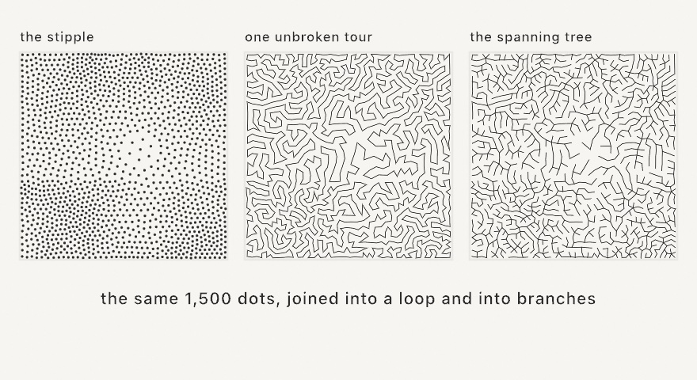

Once you have the dots, two ways of joining them give two very different drawings:

```swift
let tour = singleLine(through: dots)        // one closed loop
let chains = spanningTree(through: dots)    // branching, minimal pen lifts
```

`singleLine` finds a short tour that visits every dot once and comes back, which is the classic routing problem known as TSP, and drawings made this way are called TSP art. The result is one continuous line, and the picture appears out of how tightly that line has to wander. `spanningTree` instead finds the shortest set of links that still connects every dot, then breaks the result into the fewest separate chains it can, so a drawing machine lifts its pen as few times as the branching truly requires. The first reads as a maze, the second as veins.

Both also take a picture directly and do the stippling for you:

```swift
let line = singleLine(of: picture, points: 4000, in: frame)
let veins = spanningTree(of: picture, points: 4000, in: frame)
```

In those forms `cutoff` is the knob to know. It rounds bright grays up to paper, so pixels lighter than it place no dots at all. Without it a light region collects a thin wandering thread instead of staying empty, which is exactly what the sun in the figure would have done.

## A picture wound from thread

String art takes the same idea to its most physical extreme. Ring the canvas with pins, tie one thread to a pin, and wind it straight across, again and again. Nothing curves and nothing lifts. The picture has to come out of where the crossings pile up.

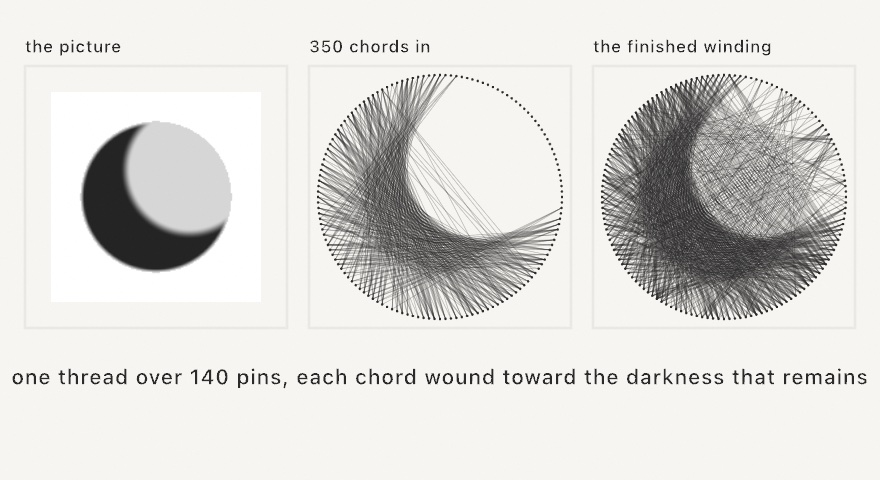

```swift
let art = StringArt(of: picture, center: Vector2(540, 540), radius: 470)

override func setup() { noClear() }

override func draw() {
    if frameCount == 1 { background(.white) }
    stroke(Color.black.withAlpha(0.35))
    for chord in art.step(8) {
        drawLine(chord.from, chord.to)
    }
}
```

Each chord is a greedy choice. From the pin the thread is on, `StringArt` scores every reachable pin by the darkness the straight chord would still cover. It winds the best one, subtracts that ink from its copy of the picture, and goes again from the pin it landed on. Dark regions demand crossing after crossing. Light regions are left almost alone. The picture emerges from where the thread had to go.

It is a stepper you hold on to, like the growth systems of [Chapter 12](12-GrowingThings.md). Each `step` winds a few more chords onto a never-clearing canvas, so the figure knits itself over the first seconds of a run. And the result is honest thread: `art.thread` is one open polyline. `art.sequence` is the winding order itself, pin numbers you could follow on a real rim.

One honest note, and it is why the figure gets a crescent instead of the sunset. Bold tonal masses knit into a clear figure. The sunset would wind into fuzz: its tone changes gently everywhere. Every chord covers about the same darkness, so no choice stands out. Give the winding silhouettes and deep shadow against open paper, or boost a timid picture's contrast first.

## Sorting the pixels

The last treatment doesn't add marks, it rearranges the ones already there. **Pixel sorting** walks each row or column, finds runs of pixels whose brightness falls inside a band you choose, and sorts each run.

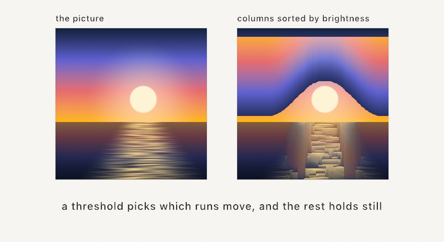

```swift
let melted = picture.pixelSorted(.vertical, threshold: 0.2 ... 0.75)
let glitched = picture.pixelSorted(.vertical).pixelSorted(.horizontal)
```

The threshold is the whole technique. It decides which pixels are in play, and everything outside the band stays exactly where it was, which is why the sun and the horizon survive in the picture above while the sky reorganizes around them. Sort by `.brightness`, `.hue`, or `.saturation`, and `reversed` flips which end of the run the bright pixels pile up at.

Two honest notes. The look needs some texture in the source, because run boundaries have to vary from line to line, and a perfectly clean gradient sorts almost invisibly. And on a picture that already runs dark to bright down the column, sorting ascending changes nearly nothing, so `reversed: true` is the direction with the drama there.

Everything in these three sections reads real pixels on the CPU, which means two practical things. A texture-backed image needs `snapshot()` first, and all of it is setup work: run it once, hold the result, and let `draw()` replay it.

## Numbers you didn't type: CSV and JSON

Words and pictures are material you bring in. So are numbers.

A comma-separated file is the format everything exports: a spreadsheet, a sensor log, a download from a public archive. `loadTable` reads one, and each row hands you its cells by column name.

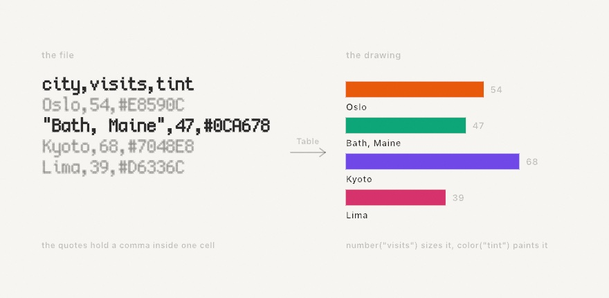

```swift
var table: Table?

override func setup() {
    table = loadTable(resource: "visits", withExtension: "csv", in: .module)
}

override func draw() {
    background(.white)
    guard let table else { return }

    for (index, row) in table.enumerated() {
        let y = 100 + Double(index) * 60
        fill(row.color("tint") ?? .gray)
        drawRect(corner: Vector2(80, y), width: row.number("visits") ?? 0, height: 22)
    }
}
```

A cell is text, because that is what a file holds. `row["city"]` gives you that text, and `row.number(_:)`, `row.int(_:)`, `row.bool(_:)`, and `row.color(_:)` convert it when you ask. Each one answers `nil` when the column isn't there or the cell isn't what you asked for, which is the honest answer for a file with a gap in it. An empty cell is not a zero.

The scale should come from the file too. `table.numbers("visits")` reads a whole column as a series, so the drawing fits whatever the file holds:

```swift
let visits = table.numbers("visits")
guard let most = visits.max() else { return }
let length = (row.number("visits") ?? 0) / most * 250
```

Once the numbers come from a file, the drawing changes when the file does, and you never touch the sketch.

Two things about the format are worth knowing, and the figure above shows both. A cell wrapped in double quotes may hold commas and line breaks, so `"Bath, Maine"` is one cell and arrives without its quotes. And a first row holding no numbers is read as the header. When that guess is wrong, say so with `header: false` and read cells by position instead.

JSON works the same way, for documents with a shape rather than rows:

```swift
let doc = loadJSON(resource: "places", withExtension: "json", in: .module)

for point in doc?["points"].array ?? [] {
    fill(point["tint"].color ?? .gray)
    drawCircle(point["x"].number ?? 0, point["y"].number ?? 0, 20)
}
```

Reach in by name or index, then ask for the kind you want at the end: `.string`, `.number`, `.int`, `.bool`, `.color`, `.array`. A key that isn't there answers null rather than stopping, so a whole path is safe to write in one line, and a loop over a key that isn't there runs zero times. That is why the `tint` above needs no check: a point that doesn't carry one lands on the fallback.

Both loaders belong in `setup()`. Reading a file is slow next to drawing one frame, and a network URL blocks until it arrives.

## Putting it together: a picture painted with type

This is the piece from the top of the chapter, and it's the whole chapter in one grid: words drawn with `drawText`, a picture read with `image[x, y]`, and the two fused so the picture is *made of* the words. A message repeats across a grid in reading order, and each letter samples the sunset at its own position, takes the pixel's color, and scales by its brightness.

It is a glyph mosaic built by hand, and that's on purpose. `drawGlyphMosaic` would give you a better ramp in one line, but it chooses the character for you, and this piece needs the characters to spell something. Building the grid yourself is what buys that. Make `MySketches/TypeMosaic.swift`:

```swift
import Ollin

final class TypeMosaic: Sketch {
    @Param("Columns", 24...80) var columns = 52
    @Param("Message") var message = "OLLIN "
    @Param("Breathe", 0...1) var breathe = 0.5

    var source: Image?

    override func setup() {
        noiseSeed(3)
        source = makeSunset(size: 160)
        textFont(OutlineFont.systemBold)
        textMode(.atlas)                   // thousands of glyphs a frame
        textAlign(.center, .middle)
        noStroke()
    }

    override func draw() {
        background(Color(hex: 0x0B0E14))
        guard let source else { return }
        let chars = Array(message.isEmpty ? "OLLIN " : message)
        let cell = width / Double(columns)
        let rows = Int(height / cell)
        var k = 0

        for row in 0..<rows {
            for col in 0..<columns {
                let u = (Double(col) + 0.5) / Double(columns)
                let v = (Double(row) + 0.5) / Double(rows)
                let c = source[Int(u * Double(source.width - 1)),
                               Int(v * Double(source.height - 1))]
                let brightness = c.red * 0.2126 + c.green * 0.7152 + c.blue * 0.0722

                // Bright pixels get big letters; a slow noise field makes the
                // whole picture breathe without changing what it says.
                let sway = 1 + signedNoise(u * 3, v * 3, time * 0.25) * 0.18 * breathe
                textSize(cell * (0.4 + 1.25 * brightness * brightness) * sway)
                fill(Color.mix(c, .white, t: brightness * 0.22))
                drawText(String(chars[k % chars.count]),
                         (Double(col) + 0.5) * cell, (Double(row) + 0.5) * cell)
                k += 1
            }
        }
    }

    func makeSunset(size: Int) -> Image {
        let image = Image(width: size, height: size)
        let sky = Ramp([Color(hex: 0x14213D), Color(hex: 0x5E60CE),
                        Color(hex: 0xE56B6F), Color(hex: 0xFFB703)])
        let horizon = 0.62
        let sunX = 0.58, sunY = 0.47
        for py in 0..<size {
            for px in 0..<size {
                let u = Double(px) / Double(size - 1)
                let v = Double(py) / Double(size - 1)
                var color: Color
                if v < horizon {
                    color = sky.color(at: v / horizon)
                    let d = ((u - sunX) * (u - sunX) + (v - sunY) * (v - sunY)).squareRoot()
                    let disk = 1 - smoothstep(0.075, 0.095, d)
                    let glow = (1 - smoothstep(0.04, 0.4, d)) * 0.5
                    color = Color.mix(color, Color(hex: 0xFFF3D6), t: min(1, disk + glow))
                } else {
                    let w = (v - horizon) / (1 - horizon)
                    let reflected = sky.color(at: max(0, 0.92 - w * 0.9))
                    let dark = Color.mix(reflected, Color(hex: 0x0B1020), t: 0.45 + w * 0.4)
                    let streak = noise(u * 5, v * 120)
                    let path = 1 - smoothstep(0.02, 0.16 + w * 0.3, abs(u - sunX))
                    color = Color.mix(dark, Color(hex: 0xFFD98A),
                                      t: min(1, path * (0.2 + streak * 0.8)))
                }
                image[px, py] = color
            }
        }
        return image
    }
}
```

Run it with `swift run OllinLive MySketches/TypeMosaic.swift` and take it apart:

- `makeSunset` is the "author an image" idea at full length, and every line of it is a tool you already own: the sky is a `Ramp` read by height, the sun is `smoothstep` on distance (a soft-edged disk plus a wider faint glow), and the water mirrors the sky darkened, with `noise` streaks brightening along the sun's reflection. It writes 160×160 pixels once, in `setup()`.
- The double loop is [Chapter 6](06-GridsAndRepetition.md)'s grid chore done by hand, because what it loops over is the *message*: `k % chars.count` deals the letters out in reading order, so the rows spell the message over and over, and `u`/`v` fractions map each cell onto its pixel.
- `brightness * brightness` is contrast shaping, since squaring pushes mid grays down so the sun pops. The `fill` mixes each pixel's color a step toward white in the brightest cells, which makes the sun read as light rather than paint.
- `textMode(.atlas)` matters here, because fifty columns is a few thousand glyphs per frame, and the atlas mode draws each as one cheap textured quad instead of re-tessellating outlines. It's the volume switch for text, one line, and the chapter's one performance note.
- `Breathe` feeds a slow `signedNoise` into the letter sizes, so the picture shimmers without changing what it says. The `Message` knob is a text field in the live window, so type into it and the sunset respells itself as you watch.

> **Swift note.** `guard let source else { return }` is `if let` turned around, unwrapping the value or leaving the function right there. And `Array(message)` turns a string into a list of its characters, so `chars[k % chars.count]` can deal them out like [Chapter 1](01-HelloOllin.md)'s palette cycling.

Then make it yours:

- Swap the source for a photo: `source = loadImage("/path/to/portrait.jpg")` is the whole change. Faces work beautifully at 60 to 80 columns.
- Change the alphabet. A message of `"·•●"` becomes halftone dots, and `textFont(BitmapFont.builtin)` in `setup()` makes it a terminal.
- Sample with an offset. Read the pixel at `u + time * 0.01` (wrapped with `fract`) and the picture slides through the words.
- Recolor by replacing the sampled color with `Colormap.magma.color(at: brightness)` for a duotone poster.
- Trade the letters for line work. Feed the same sunset to `singleLine(of:points:in:)` and the poster becomes one unbroken thread a plotter could draw.

## Where this comes from

Making pictures out of characters is older than computing. Typewriter artists were composing portraits from letters by the 1890s, and when 1960s line printers became the first output devices many people ever touched, the tradition became ASCII art. The deeper idea, an image rebuilt from small marks whose size carries the tone, is the halftone screen that printed every newspaper photograph for a century, and pointillism if you ask a painter. This chapter's tools have their own lineages. The bundled pixel font is [Cozette](https://github.com/the-moonwitch/Cozette) by Ines. The bundled stroke font is Hershey Sans, one of the vector fonts A. V. Hershey drew at the U.S. National Bureau of Standards in 1967 for early plotters, still beloved by the pen-plotter community. And outline text is laid out by the system's own type machinery, so kerning and ligatures come for free.

The picture-as-marks tools each come from a named piece of work. Halftone screening is the printing industry's own, and Robert Ulichney's *Digital Halftoning* is the standard account of it. The settling method behind stippling is Adrian Secord's, published in 2002. Joining those dots into one line is TSP art, from Robert Bosch and Adrianne Herman in 2004, with the tone-driven dot placement Craig Kaplan and Bosch added a year later; joining them into a tree instead comes from Kohei Inoue and Kiichi Urahama in 2009. String art on a circular rim is Petros Vrellis's, whose 2016 knitted portraits wound one thread over 200 pins. The greedy winding here follows the formulation Michael Birsak and colleagues published in 2018. Pixel sorting is Kim Asendorf's, who wrote the original in Processing in 2010 and gave a generation of glitch artists their favorite verb. Full credits are in the project's [attribution notes](../ATTRIBUTION.md).

## Go deeper

- [Text](../Docs/Drawing/Text.md): the full reference, including text on a path, box wrapping, metrics (`textWidth`, `textBounds`), variable-font axes, [every script](../Docs/Drawing/Text.md#scripts) with `textDirection` and `textMissingCharacters`, and loading bitmap, outline, and stroke faces of your own.
- [Images](../Docs/Drawing/Images.md): the complete `Image` surface, including `Image(resource:in:)` for bundled assets and the bulk pixel initializer.
- Appendix B draws this chapter's math, one picture per idea: [Fractions, mapping, and wrapping](B-JustEnoughMath.md#fractions-mapping-and-wrapping), [Shaping a value](B-JustEnoughMath.md#shaping-a-value), [Color and light as numbers](B-JustEnoughMath.md#color-and-light-as-numbers).
- Worked examples, in [`Examples/Text/`](../Examples/Text/): `GlyphWave` and `JitterType` (per-glyph motion), `TextOnPath`, `TextBox`, `VariableFont`, `OutlineText` (the warp, live), `StrokeText` and `PlaydateFont` (the other two font kinds in action), `TextVolume` (the atlas mode at paragraph scale), and `Scripts` (five scripts on one sheet, with the base direction as a live knob).
- [`Examples/Images/PixelField`](../Examples/Images/PixelField/Sketch.swift): authoring an image pixel by pixel and reading it back, under an animated tint.
- [Glyph mosaic](../Docs/Drawing/GlyphMosaic.md) and [halftone](../Docs/Drawing/Halftone.md): the measured-ink ramp, the curated glyph sets, screen angles, and the data forms that let you draw your own marks.
- [Stippling](../Docs/Generators/Stippling.md), [single line](../Docs/Generators/SingleLine.md), and [spanning tree](../Docs/Generators/SpanningTree.md): dot placement and the two ways to join it, with the `cutoff` and point-count guidance.
- [String art](../Docs/Generators/StringArt.md): the pins and the ink dial, `inverted` for a pale thread on a dark ground, and the plotter path.
- [Pixel sorting](../Docs/Drawing/PixelSorting.md): every key and direction, and how to get each of the classic looks.
- [Data](../Docs/Helpers/Data.md): `loadTable` and `loadJSON` in full, including the separator and header guesses, reading a headerless file, and when a `Codable` type is the better tool.
- Worked examples for data: [`Examples/Data/Readings`](../Examples/Data/Readings/Sketch.swift) (a CSV as a range chart) and [`Examples/Data/Places`](../Examples/Data/Places/Sketch.swift) (a JSON survey).
- Worked examples: [`Examples/Images/GlyphMosaic`](../Examples/Images/GlyphMosaic/Sketch.swift), [`Halftone`](../Examples/Images/Halftone/Sketch.swift), [`PixelSort`](../Examples/Images/PixelSort/Sketch.swift), [`SingleLine`](../Examples/Images/SingleLine/Sketch.swift), [`SpanningTree`](../Examples/Images/SpanningTree/Sketch.swift), and [`StringArt`](../Examples/Images/StringArt/Sketch.swift).

---

[Contents](README.md#contents) · Previous: [Chapter 7, Tiles that cover the plane](07-Tiles.md) · Next: [Chapter 9, Vectors, gently](09-Vectors.md)
