#### <sup>[Ollin](../README.md) → [Guide](README.md) → Chapter 9</sup>

---

# 9. Pictures and data

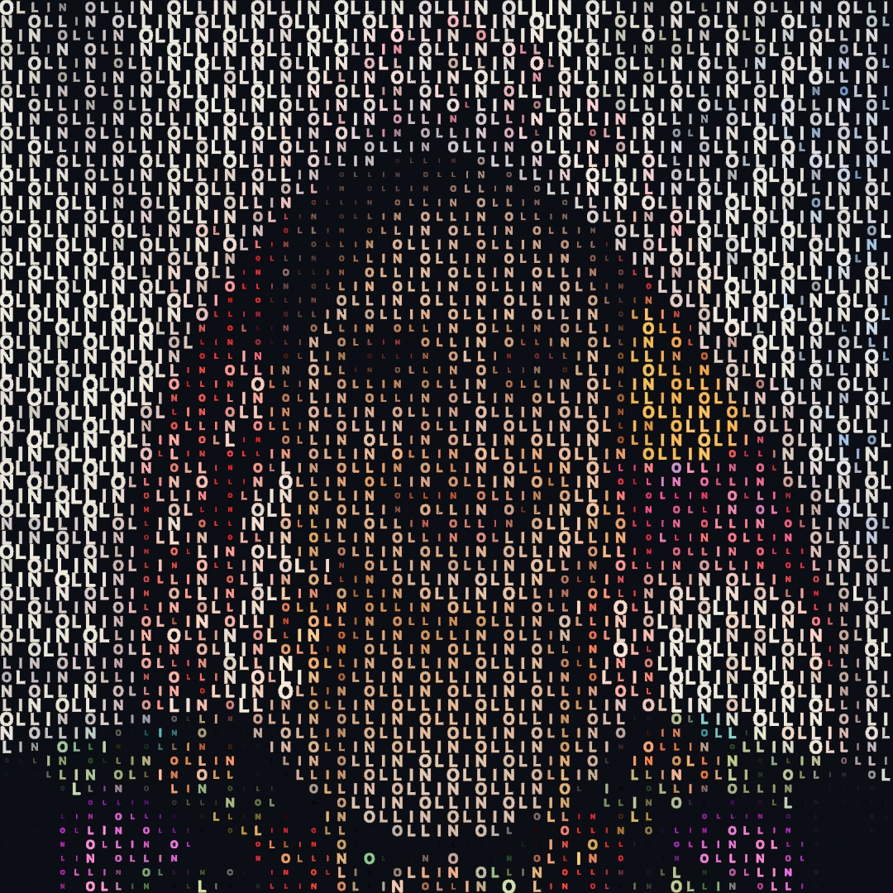

Two kinds of material arrive from outside your sketch, and both come in the same way. A picture is a grid of colors you can ask questions of, and a spreadsheet is a grid of numbers you can ask questions of. Neither is something to display. Both are something to *read*, one sample at a time, and turn into marks of your own choosing.

The sunset above has no photograph in it. It is one image, sampled a few thousand times, with every sample answered by a letter, sized and colored by the pixel underneath it. By the end of the chapter you'll have built it, and you'll have a handful of other ways to answer a pixel: with a dot, with one unbroken line, with a thread wound between pins, by sorting the pixels the picture already has, or by taking pixels away until the picture fits the space you have.

## Pictures

Images follow the pattern you already know from fonts: load once in `setup()`, keep the result, draw it in `draw()`.

```swift
final class Photo: Sketch {
    var photo: Image?

    override func setup() {
        photo = loadImage("/Users/you/Pictures/leaf.jpg")
    }

    override func draw() {
        background(.black)
        if let photo {
            drawImage(photo, 0, 0, width, height)     // stretched to fill
        }
    }
}
```

`loadImage` reads anything the system can decode (PNG, JPEG, HEIC, and friends) and returns an optional, since a path can be wrong. `drawImage` places the image by its top-left corner, at native size or scaled into a box, and it composites in draw order with everything else, riding the transform stack like a shape. For an image that travels with your sketch, drop the file in the same folder and load it with `Image(resource: "leaf", withExtension: "jpg", in: .module)`.

One piece of state changes how images land: `tint`. It multiplies every pixel by a color as the image draws, so the RGB washes the image and the alpha fades it:

```swift
tint(Color(red: 1.0, green: 0.75, blue: 0.4))   // a warm wash
drawImage(photo, 0, 0, width, height)
tint(Color(white: 1, alpha: 0.3))               // ghostly, 30% opacity
drawImage(photo, 60, 60, width, height)
noTint()                                        // back to as-is
```

Tint never edits the image itself, only how it's drawn, and `withState { }` scopes it like any other state.

## The box is never the right shape

That first `drawImage(photo, 0, 0, width, height)` did something quietly: it stretched. A photo is 3:2 or 4:3, your canvas is square or portrait, and squashing is only one of three answers. `fit:` names all three, and every one of them gives something up.

<picture>
  <source media="(prefers-color-scheme: dark)" srcset="Images/09-Pictures/PictureFit-dark.jpg">
  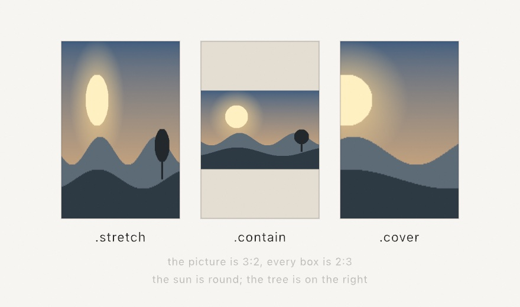
</picture>

- `.stretch` fills the box and gives up the picture's proportions. It is the default, because it is what `drawImage` has always done.
- `.contain` keeps the proportions and puts the whole picture inside, centered. It gives up part of the box, which shows along two edges.
- `.cover` keeps the proportions and fills the box, centered. It gives up the picture's own edges, cropped away.

```swift
drawImage(photo, in: panel, fit: .cover)
```

So the question is never which one is correct. It is what you would rather lose. A wallpaper covers, because a strip of empty screen would be worse than a missing corner. A photograph in a contact sheet contains, because you are there to see all of it. A texture on a panel stretches, because nobody is checking its proportions.

A round shape in the picture is the fastest way to tell which one you are looking at. Stretched, it is an ellipse. The sun in the figure gives the game away in all three panels at once.

Cropping is free here, which is worth knowing before you avoid it. `.cover` does not clip the drawing. It reads a smaller part of the picture instead, so a covered photograph costs the same one quad and one texture read as a stretched one.

## An image you can ask

The real gift of `Image` for generative work isn't drawing it, it's *reading* it. The subscript `image[x, y]` returns the color stored at a pixel, and suddenly a picture is a field of answers, like [Chapter 5](05-Noise.md)'s noise but authored by a camera or by you:

<picture>
  <source media="(prefers-color-scheme: dark)" srcset="Images/09-Pictures/PixelSampling-dark.jpg">
  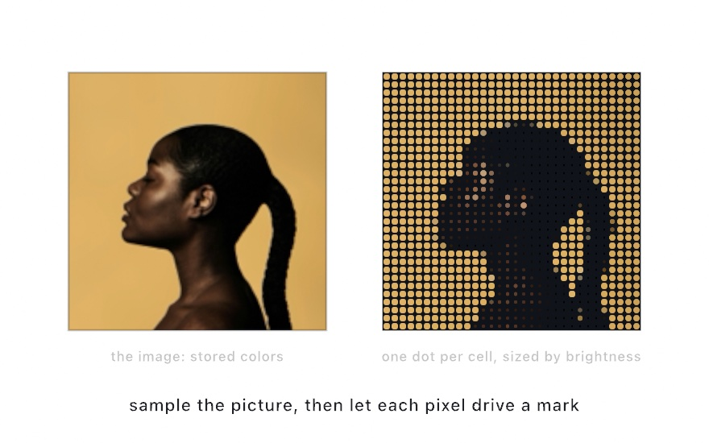
</picture>

The right panel asks the image one question per grid cell and draws the answer as a dot. The recipe has two small pieces. First, a cell's position maps to a pixel index by fractions. A cell at fraction `u` across the grid reads column `Int(u * Double(image.width - 1))`, and rows work the same way, so any grid samples any image size. Second, "how bright is this pixel" takes one more line than you might guess, because your eye does not weigh the three channels equally, with green counting most and blue least. The standard weights are

```swift
let brightness = c.red * 0.2126 + c.green * 0.7152 + c.blue * 0.0722
```

and that single number is the handle generative artists pull most: size by it, choose by it, gate by it. ([Appendix B](B-JustEnoughMath.md#perceived-brightness) keeps this one, since averaging the channels instead makes yellows read too dark and blues too bright.) Ollin also carries the ask as a property, `c.luminance`, measured a touch more faithfully on the linearized components. The handwritten weights are the idea, and the property is the everyday spelling.

You can also write pixels. `Image(width:height:)` makes a blank image, `image[x, y] = color` paints one pixel, and that's how this chapter's figures work. The repository ships no photograph, so the sunset on the left is *authored*, about twenty lines of [Chapter 2](02-Color.md) ramps, one `smoothstep` sun, and [Chapter 5](05-Noise.md) noise for the water, written pixel by pixel in `setup()`. The listing below contains the whole recipe, and everything in this section works identically on a photo you load with `loadImage`.

## A picture as marks

Reading a pixel and drawing a mark is such a common move that Ollin ships two finished versions of it, and both are worth knowing before you hand-roll your own.

<picture>
  <source media="(prefers-color-scheme: dark)" srcset="Images/09-Pictures/PictureAsGlyphs-dark.jpg">
  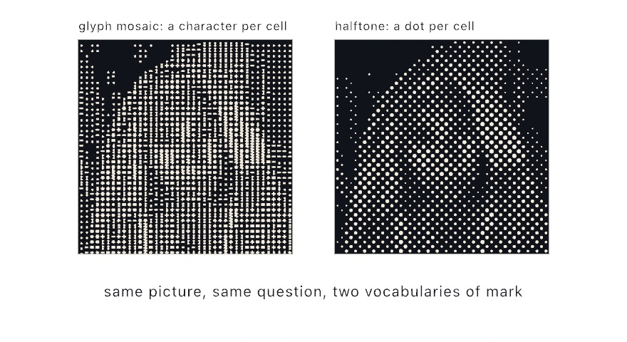
</picture>

`drawGlyphMosaic` divides the picture into a grid and puts one character in each cell:

```swift
textFont(BitmapFont.builtIn)
fill(.white)
drawGlyphMosaic(picture, columns: 72)
```

The interesting part is how it picks the character. It doesn't use a ramp somebody typed out from memory. It *measures* every character you offer it in the font you're currently using, counting lit pixels for a bitmap font, outline area for an outline font, pen travel for a stroke font, and then matches each cell to the character whose ink comes closest. So any string works as a ramp, in any font, and the tones stay honest. `GlyphSet.technical`, `.classic`, and `.blocks` are curated sets to start from, and `glyphScale` is the fraction of its cell a glyph draws at, defaulting to 0.85 so gutters keep even the densest characters reading as separate marks.

`drawHalftone` does the same job with the printing industry's answer, which is one dot per cell, grown until it covers the right fraction of that cell:

```swift
fill(.black)
noStroke()
drawHalftone(picture, pitch: 14)
```

`pitch` is the cell size and `angle` rotates the screen, defaulting to the 45 degrees printers have used for a century because a diagonal grid is the least visible to the eye. Coverage is computed exactly, so tone is right rather than approximated, and the dots are real circles. That last detail matters more than it sounds: a halftone can go straight out to a pen plotter as circles it can actually draw.

Comparing the two panels shows the honest difference between them. A mosaic has exactly as many tones as it has characters, so it steps, while a halftone's radius is continuous and gives you a smooth ramp. Choose by which texture you want, not by which is better.

One polarity trap sits between them. `drawGlyphMosaic` grows its mark with *brightness* by default, which suits glowing marks on a dark ground, while `drawHalftone` grows its dot with *darkness*, because it is modeling ink on paper. Each takes `inverted: true` to flip, and the figure above uses the mosaic's default beside the halftone's inverted form to get both reading the same way.

Both also come in a data form, `glyphMosaic(of:)` and `halftone(of:)`, which hand back the cells or dots instead of drawing them. That's the door to your own marks: same measurement, but you draw hexagons, or letters from a message, or nothing at all where the tone is light.

## A picture made of pictures

The marks so far have been characters and dots. They can be pictures.

<picture>
  <source media="(prefers-color-scheme: dark)" srcset="Images/09-Pictures/PicturesFromPictures-dark.jpg">
  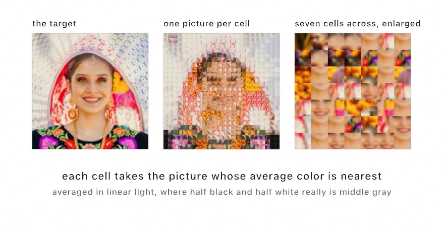
</picture>

```swift
let mosaic = target.mosaic(of: library, columns: 32, rows: 32)
drawMosaic(mosaic, of: library, in: bounds, tint: 0.25)
```

Every cell of the target is averaged, every picture in the library is averaged once, and each cell takes the nearest one. Stand back and the cells add up to the target; step forward and each is a picture of its own.

**The averaging happens in linear light, and that is not a detail.** A cell that is half black and half white is middle gray, which is 0.5 in linear light and about 0.74 written back out in sRGB. Average the sRGB numbers instead and you get 0.5, a quarter too dark, and the mosaic loses its lights. Ollin does this the right way for you; the reason to know it is that hand-rolling the same loop is where the mistake usually lives.

Two knobs matter. `tint` mixes each cell toward the color it stands for, which is how a mosaic is made to read from further off: a quarter of the way is a good place to start, and 1 gives up and paints flat color. `maxUses` limits how often one picture may repeat, filling cells in reading order and falling back to the nearest picture when the library runs dry.

The thing that decides whether a mosaic works is not the code. **The target needs range and the library needs range in the same places.** A target that is mostly one flat dark takes the one nearest picture and repeats it over the whole frame, which is a picture of nothing. `mosaic.uses(of:)` counts how many of the library actually got used, and it is the number to watch when a mosaic looks flat.

## A picture that hides a shape

One more, and this one hides its picture instead of drawing it.

<picture>
  <source media="(prefers-color-scheme: dark)" srcset="Images/09-Pictures/DepthInARepeat-dark.jpg">
  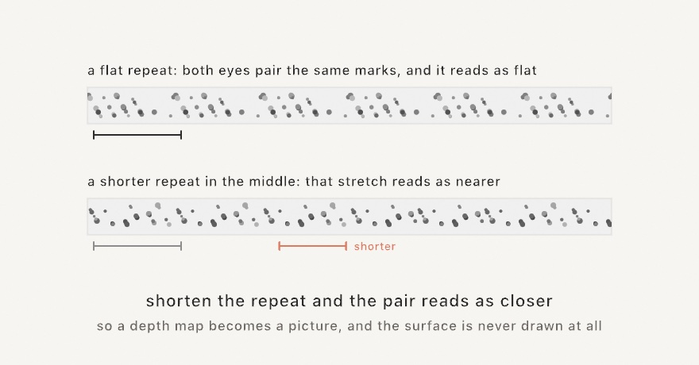
</picture>

A pattern that repeats at a fixed spacing gives both eyes the same marks to pair, and they read those marks at whatever depth that spacing stands for. **Shorten the repeat and the pair reads as nearer.** That is the entire trick, and it means a depth map can be turned into a picture: shorten the repeat wherever the shape is closer.

```swift
let hidden = depthMap.autostereogram(Autostereogram(repeatWidth: 120, relief: 0.22))
drawImage(hidden, in: rect)
```

Hand it a picture where bright means near, and get back a field of noise with a shape buried in it. Look *through* the picture, at something behind the screen, until the repeats double up. It takes a moment the first time, and crossing your eyes instead reads the same picture inside out, so the shape sinks rather than stands.

Four things decide whether one works, and only the first is code.

**Draw it at its own pixel size.** Scaling resamples the very repeats the eyes have to pair, and a stereogram at half size is impossible to fuse. **Keep the relief under about a third** of the repeat, which is where the eyes give up. **Use hard edges**, because a soft gradient gives them nothing to lock onto. And expect a shimmer along every edge of the shape: within one repeat of a depth step neither depth is the answer, which is in the technique rather than in the picture.

## A picture as one line

The other family turns a picture into line work, and all of it starts with **stippling**, which is placing loose dots so that their density reproduces the picture's tone. Getting that right is harder than scattering dots at random, because random placement clumps. The method Ollin uses is a settling process. Give every dot the patch of canvas that lies closer to it than to any other dot, move the dot to the center of that patch weighted by how dark the picture is there, and repeat. Dots drift toward darkness and away from each other at the same time, and after a few dozen rounds they sit in an even spread that is dense in the shadows and sparse in the light. ([Chapter 15](15-ShapesAsMaterial.md) names the structure underneath this, since it turns out to be useful for a lot more than dots.)

```swift
let dots = stipple(of: picture, count: 4000, in: frame)
```

<picture>
  <source media="(prefers-color-scheme: dark)" srcset="Images/09-Pictures/PictureAsLines-dark.jpg">
  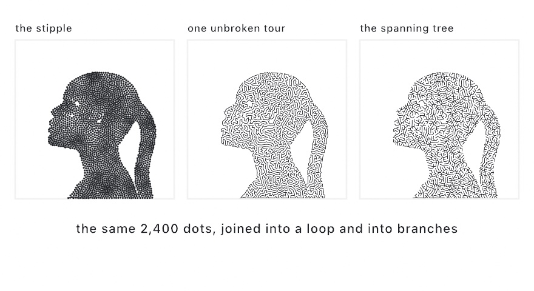
</picture>

Once you have the dots, two ways of joining them give two very different drawings:

```swift
let tour = singleLine(through: dots)        // one closed loop
let chains = spanningTree(through: dots)    // branching, minimal pen lifts
```

`singleLine` finds a short tour that visits every dot once and comes back, which is the classic routing problem known as TSP, and drawings made this way are called TSP art. The result is one continuous line, and the picture appears out of how tightly that line has to wander. `spanningTree` instead finds the shortest set of links that still connects every dot, then breaks the result into the fewest separate chains it can, so a drawing machine lifts its pen as few times as the branching truly requires. The first reads as a maze, the second as veins.

Both also take a picture directly and do the stippling for you:

```swift
let line = singleLine(of: picture, points: 4000, in: frame)
let veins = spanningTree(of: picture, points: 4000, in: frame)
```

In those forms `cutoff` is the knob to know. It rounds bright grays up to paper, so pixels lighter than it place no dots at all. Without it a light region collects a thin wandering thread instead of staying empty, which is exactly what the sun in the figure would have done.

## A picture wound from thread

String art takes the same idea to its most physical extreme. Ring the canvas with pins, tie one thread to a pin, and wind it straight across, again and again. Nothing curves and nothing lifts. The picture has to come out of where the crossings pile up.

<picture>
  <source media="(prefers-color-scheme: dark)" srcset="Images/09-Pictures/WoundFromThread-dark.jpg">
  
</picture>

```swift
let art = StringArt(of: picture, center: Vector2(540, 540), radius: 470)

override func setup() { noClear() }

override func draw() {
    if frameCount == 1 { background(.white) }
    stroke(Color.black.withAlpha(0.35))
    for chord in art.step(8) {
        drawLine(chord.from, chord.to)
    }
}
```

Each chord is a greedy choice. From the pin the thread is on, `StringArt` scores every reachable pin by the darkness the straight chord would still cover. It winds the best one, subtracts that ink from its copy of the picture, and goes again from the pin it landed on. Dark regions demand crossing after crossing. Light regions are left almost alone. The picture emerges from where the thread had to go.

It is a stepper you hold on to, like the growth systems of [Chapter 13](13-GrowingThings.md). Each `step` winds a few more chords onto a never-clearing canvas, so the figure knits itself over the first seconds of a run. And the result is honest thread: `art.thread` is one open polyline. `art.sequence` is the winding order itself, pin numbers you could follow on a real rim.

One honest note, and it is why the figure gets a crescent instead of the sunset. Bold tonal masses knit into a clear figure. The sunset would wind into fuzz: its tone changes gently everywhere. Every chord covers about the same darkness, so no choice stands out. Give the winding silhouettes and deep shadow against open paper, or boost a timid picture's contrast first.

## Sorting the pixels

The last treatment doesn't add marks, it rearranges the ones already there. **Pixel sorting** walks each row or column, finds runs of pixels whose brightness falls inside a band you choose, and sorts each run.

<picture>
  <source media="(prefers-color-scheme: dark)" srcset="Images/09-Pictures/SortedPixels-dark.jpg">
  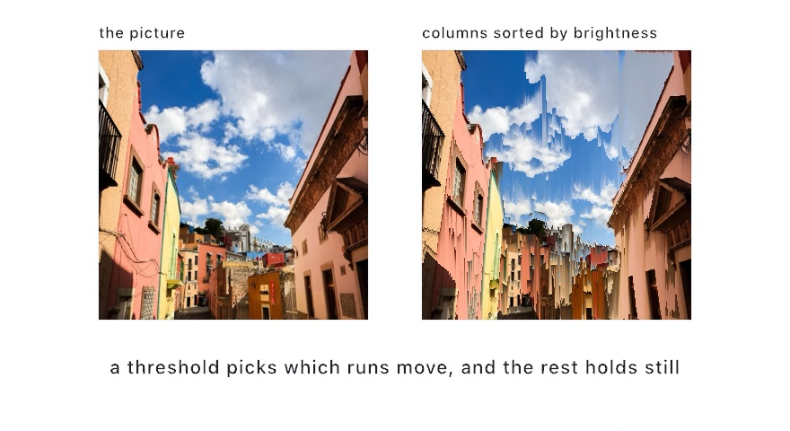
</picture>

```swift
let melted = picture.pixelSorted(.vertical, threshold: 0.2 ... 0.75)
let glitched = picture.pixelSorted(.vertical).pixelSorted(.horizontal)
```

The threshold is the whole technique. It decides which pixels are in play, and everything outside the band stays exactly where it was, which is why the sun and the horizon survive in the picture above while the sky reorganizes around them. Sort by `.brightness`, `.hue`, or `.saturation`, and `reversed` flips which end of the run the bright pixels pile up at.

Two honest notes. The look needs some texture in the source, because run boundaries have to vary from line to line, and a perfectly clean gradient sorts almost invisibly. And on a picture that already runs dark to bright down the column, sorting ascending changes nearly nothing, so `reversed: true` is the direction with the drama there.

Everything in these three sections reads real pixels on the CPU, which means two practical things. A texture-backed image needs `snapshot()` first, and all of it is setup work: run it once, hold the result, and let `draw()` replay it.

## Making it narrower without squashing it

Every treatment so far changed how a picture looks. This one changes its shape, and tries hard to leave the looking alone.

Say a picture is 1200 wide and the space it has to fit is 800. You can squash it, and everything inside gets a third thinner. You can crop it, and lose whatever was at the edge. **Seam carving** is the third answer. Find the path down the picture that carries the least, take it out, and the picture is one pixel narrower. Do that four hundred times.

<picture>
  <source media="(prefers-color-scheme: dark)" srcset="Images/09-Pictures/CarvedNarrower-dark.jpg">
  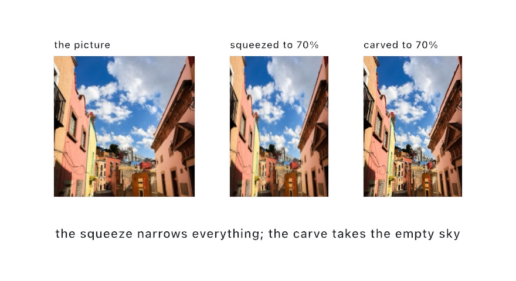
</picture>

```swift
let narrow = picture.seamCarved(toWidth: 800)
```

A *seam* is a run of pixels, one per row, that never steps more than one pixel sideways from the row above. The cheapest one is the one whose removal changes the picture least, and finding it is the whole of the technique.

Here is the rule that decides everything: **texture survives, and flat gives way.** A path down an empty sky costs nothing, because closing that gap puts two pixels beside each other that already matched. A path through a face costs a great deal, because closing that gap makes an edge that was not there before. So the sky goes and the face keeps its width.

That also means a flat thing is not safe. The sun above is nearly one color inside, so the carve was happy to narrow it too, until it was told not to:

```swift
let held = picture.seamCarved(toWidth: 800, protecting: sunMask)
let gone = picture.seamCarved(toWidth: 800, discarding: signMask)
```

A mask is just a picture the same size, marked in white. `protecting:` prices those pixels out of reach, so no seam crosses them. `discarding:` does the opposite. It makes them the cheapest thing in the picture, so seam after seam is drawn straight through them. Carve away as many seams as the marked thing is wide and the thing has left. Carve the width back up afterwards and it is gone, at the size you started with. That is the trick the technique is famous for.

Growing works the same way in reverse. Ask for a bigger size and the same cheap seams are duplicated instead of removed. The added pixels spread over the whole picture rather than stretching one part of it.

Two practical notes. One seam is one pass over the picture, so a hundred seams is a hundred passes, and like everything else in this chapter that is `setup()` work. If the width has to keep changing while the sketch runs, work the seams out once and read any width back out of the result:

```swift
override func setup() {
    map = picture.seamMap()
}

override func draw() {
    let wanted = Int(300 + sin(time) * 120)
    if let framed = map?.image(wanted) { drawImage(framed, in: canvasRectangle) }
}
```

And carve gently. Taking away a quarter of the width is usually invisible. Taking away three quarters is a different picture, whatever the arithmetic says. At some point the only thing left to take is the thing you wanted.

## Numbers you didn't type: CSV and JSON

Words and pictures are material you bring in. So are numbers.

A comma-separated file is the format everything exports: a spreadsheet, a sensor log, a download from a public archive. `loadTable` reads one, and each row hands you its cells by column name.

<picture>
  <source media="(prefers-color-scheme: dark)" srcset="Images/09-Pictures/DataAsMaterial-dark.jpg">
  
</picture>

```swift
var table: Table?

override func setup() {
    table = loadTable(resource: "visits", withExtension: "csv", in: .module)
}

override func draw() {
    background(.white)
    guard let table else { return }

    for (index, row) in table.enumerated() {
        let y = 100 + Double(index) * 60
        fill(row.color("tint") ?? .gray)
        drawRect(corner: Vector2(80, y), width: row.number("visits") ?? 0, height: 22)
    }
}
```

A cell is text, because that is what a file holds. `row["city"]` gives you that text, and `row.number(_:)`, `row.int(_:)`, `row.bool(_:)`, and `row.color(_:)` convert it when you ask. Each one answers `nil` when the column isn't there or the cell isn't what you asked for, which is the honest answer for a file with a gap in it. An empty cell is not a zero.

The scale should come from the file too. `table.numbers("visits")` reads a whole column as a series, so the drawing fits whatever the file holds:

```swift
let visits = table.numbers("visits")
guard let most = visits.max() else { return }
let length = (row.number("visits") ?? 0) / most * 250
```

Once the numbers come from a file, the drawing changes when the file does, and you never touch the sketch.

Two things about the format are worth knowing, and the figure above shows both. A cell wrapped in double quotes may hold commas and line breaks, so `"Bath, Maine"` is one cell and arrives without its quotes. And a first row holding no numbers is read as the header. When that guess is wrong, say so with `header: false` and read cells by position instead.

JSON works the same way, for documents with a shape rather than rows:

```swift
let doc = loadJSON(resource: "places", withExtension: "json", in: .module)

for point in doc?["points"].array ?? [] {
    fill(point["tint"].color ?? .gray)
    drawCircle(point["x"].number ?? 0, point["y"].number ?? 0, 20)
}
```

Reach in by name or index, then ask for the kind you want at the end: `.string`, `.number`, `.int`, `.bool`, `.color`, `.array`. A key that isn't there answers null rather than stopping, so a whole path is safe to write in one line, and a loop over a key that isn't there runs zero times. That is why the `tint` above needs no check: a point that doesn't carry one lands on the fallback.

Both loaders belong in `setup()`. Reading a file is slow next to drawing one frame, and a network URL blocks until it arrives.

## Numbers that keep arriving: DataFeed

Reading once is right for a file. It is wrong for a number that changes while your sketch is up. A `DataFeed` reads one address over and over, in the background, so the sketch draws what is true now rather than what was true at launch.

<picture>
  <source media="(prefers-color-scheme: dark)" srcset="Images/09-Pictures/NumbersThatKeepArriving-dark.jpg">
  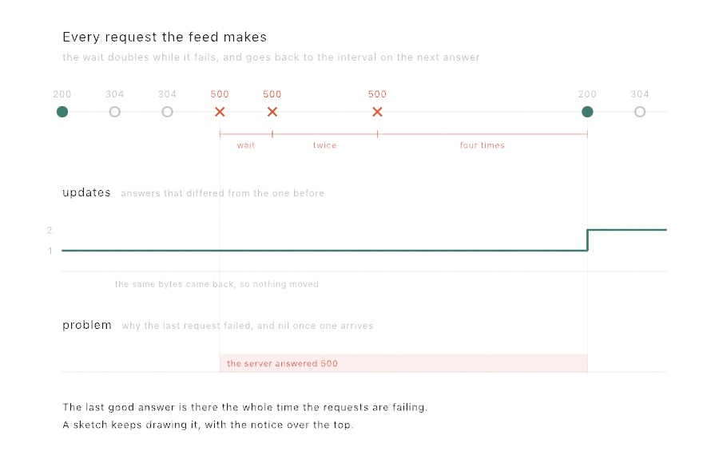
</picture>

```swift
final class Tide: Sketch {
    private let tide = DataFeed("https://example.org/tide.json", every: 600)

    override func setup() {
        tide.start()
    }

    override func draw() {
        background(.white)
        let height = tide.json["height"].number ?? 0
        drawCircle(center: center, radius: 40 + height * 20)
    }
}
```

`every:` is in seconds. What comes back is the same `JSON` and `Table` you just read out of files. The drawing code doesn't change at all when the numbers start arriving from the world instead of the disk.

Before the first answer arrives, `json` reads as null and `table` and `text` are `nil`. That is also what they read when the network is down. A feed with nothing to draw is one state and not two, which is why the fallback in the line above covers both.

When something goes wrong, `problem` says what, in a sentence you can put on the canvas. It never takes away what the feed already had. Keep drawing the last good answer and put the notice over the top, the way the figure shows.

The number to watch is `updates`. It counts the answers that *differed* from the one before, so a poll that brought back the same bytes doesn't move it:

```swift
if tide.updateCount != seen {
    seen = tide.updateCount
    arrivedAt = time            // start a fade from this moment
}
```

That distinction is most of what makes a feed pleasant. Ask a server every ten minutes and most answers will be the ones you already have. Only the changes are news.

The rest is politeness, and the framework handles it. The next request waits for the last one to finish. An unchanged answer is asked for conditionally, so a well-behaved server can reply with a header and no body. And a run of failures backs off instead of hammering a machine that is already down. A sketch on a wall for three weeks is a guest on somebody's server.

One more thing worth knowing before you export. A headless export reads the feed once and holds that answer for every frame. An export that fetched per frame would render something different each time you ran it.

## Messages that arrive on their own: PushFeed

A `DataFeed` asks. Some sources would rather tell: every edit to an encyclopedia, every reading a machine takes, every move in a game somebody is playing right now. For those, polling is always either too often or too late. A `PushFeed` holds one connection open instead, and each message arrives the moment the other end sends it.

<picture>
  <source media="(prefers-color-scheme: dark)" srcset="Images/09-Pictures/MessagesThatPushThemselves-dark.jpg">
  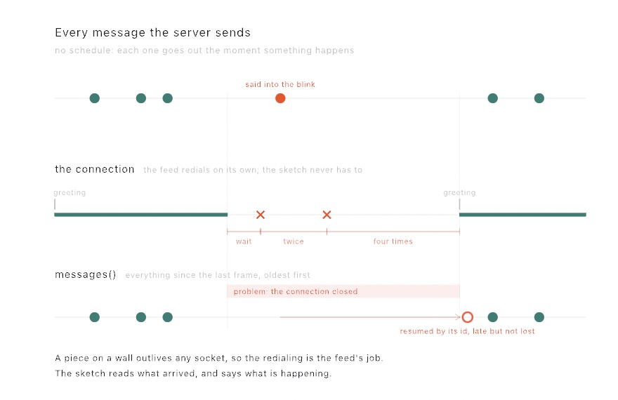
</picture>

The address decides how the connection is made. `ws://` and `wss://` open a web socket. Anything else is read as a stream of server-sent events, the plain-HTTP way a server pushes. You write the same code either way:

```swift
final class Edits: Sketch {
    private let edits = PushFeed("https://stream.wikimedia.org/v2/stream/recentchange")

    override func setup() {
        edits.start()
    }

    override func draw() {
        background(.black)
        for message in edits.messages() {
            splash(message.json["title"].string ?? "")
        }
    }
}
```

The read to notice is `messages()`. On a busy stream, dozens of messages land between two frames, and the familiar `json` and `text` reads only show the last of them. `messages()` hands over every message since the last frame, oldest first, so nothing slips between two draws. `updates` counts every message here, not just the changed ones. A poll can bring back what you already had; a push was sent because there was something to say.

The rest of the work is staying connected, and the feed does all of it, the way the figure shows. A dropped connection redials on its own, waiting a little longer after each failure. A stream that labels its messages with ids is resumed from the last one seen, so a message said into the blink arrives late instead of being lost. And the `greeting:` you give the feed is said at every open, not once. That is what keeps a service that wants a subscribe message subscribed across every redial. Your sketch's whole job is to read `isConnected` and `problem` and say what is happening, while it keeps drawing everything that already arrived.

In a headless export, the feed waits for one message while `start()` runs, then holds it for every frame. The polled feed reads once for the same reason. The `Data/Edits` example is this section as a finished piece. The encyclopedia's edits fall as rain, each drop sized by the bytes somebody just added or took away.

## Putting it together: a picture painted with type

This is the piece from the top of the chapter, and it's the whole chapter in one grid: words drawn with `drawText`, a picture read with `image[x, y]`, and the two fused so the picture is *made of* the words. A message repeats across a grid in reading order, and each letter samples the sunset at its own position, takes the pixel's color, and scales by its brightness.

It is a glyph mosaic built by hand, and that's on purpose. `drawGlyphMosaic` would give you a better ramp in one line, but it chooses the character for you, and this piece needs the characters to spell something. Building the grid yourself is what buys that. Make `MySketches/TypeMosaic.swift`:

```swift
import Ollin

final class TypeMosaic: Sketch {
    @Param("Columns", 24...80) var columns = 52
    @Param("Message") var message = "OLLIN "
    @Param("Breathe", 0...1) var breathe = 0.5

    var source: Image?

    override func setup() {
        noiseSeed(3)
        source = makeSunset(size: 160)
        textFont(OutlineFont.systemBold)
        textMode(.atlas)                   // thousands of glyphs a frame
        textAlign(.center, .middle)
        noStroke()
    }

    override func draw() {
        background(Color(hex: 0x0B0E14))
        guard let source else { return }
        let chars = Array(message.isEmpty ? "OLLIN " : message)
        let cell = width / Double(columns)
        let rows = Int(height / cell)
        var k = 0

        for row in 0..<rows {
            for col in 0..<columns {
                let u = (Double(col) + 0.5) / Double(columns)
                let v = (Double(row) + 0.5) / Double(rows)
                let c = source[Int(u * Double(source.width - 1)),
                               Int(v * Double(source.height - 1))]
                let brightness = c.red * 0.2126 + c.green * 0.7152 + c.blue * 0.0722

                // Bright pixels get big letters; a slow noise field makes the
                // whole picture breathe without changing what it says.
                let sway = 1 + signedNoise(u * 3, v * 3, time * 0.25) * 0.18 * breathe
                textSize(cell * (0.4 + 1.25 * brightness * brightness) * sway)
                fill(Color.mix(c, .white, brightness * 0.22))
                drawText(String(chars[k % chars.count]),
                         (Double(col) + 0.5) * cell, (Double(row) + 0.5) * cell)
                k += 1
            }
        }
    }

    func makeSunset(size: Int) -> Image {
        let image = Image(width: size, height: size)
        let sky = Ramp([Color(hex: 0x14213D), Color(hex: 0x5E60CE),
                        Color(hex: 0xE56B6F), Color(hex: 0xFFB703)])
        let horizon = 0.62
        let sunX = 0.58, sunY = 0.47
        for py in 0..<size {
            for px in 0..<size {
                let u = Double(px) / Double(size - 1)
                let v = Double(py) / Double(size - 1)
                var color: Color
                if v < horizon {
                    color = sky.color(at: v / horizon)
                    let d = ((u - sunX) * (u - sunX) + (v - sunY) * (v - sunY)).squareRoot()
                    let disk = 1 - smoothstep(0.075, 0.095, d)
                    let glow = (1 - smoothstep(0.04, 0.4, d)) * 0.5
                    color = Color.mix(color, Color(hex: 0xFFF3D6), min(1, disk + glow))
                } else {
                    let w = (v - horizon) / (1 - horizon)
                    let reflected = sky.color(at: max(0, 0.92 - w * 0.9))
                    let dark = Color.mix(reflected, Color(hex: 0x0B1020), 0.45 + w * 0.4)
                    let streak = noise(u * 5, v * 120)
                    let path = 1 - smoothstep(0.02, 0.16 + w * 0.3, abs(u - sunX))
                    color = Color.mix(dark, Color(hex: 0xFFD98A),
                                      t: min(1, path * (0.2 + streak * 0.8)))
                }
                image[px, py] = color
            }
        }
        return image
    }
}
```

Run it with `swift run OllinLive MySketches/TypeMosaic.swift` and take it apart:

- `makeSunset` is the "author an image" idea at full length, and every line of it is a tool you already own: the sky is a `Ramp` read by height, the sun is `smoothstep` on distance (a soft-edged disk plus a wider faint glow), and the water mirrors the sky darkened, with `noise` streaks brightening along the sun's reflection. It writes 160×160 pixels once, in `setup()`.
- The double loop is [Chapter 6](06-GridsAndRepetition.md)'s grid chore done by hand, because what it loops over is the *message*: `k % chars.count` deals the letters out in reading order, so the rows spell the message over and over, and `u`/`v` fractions map each cell onto its pixel.
- `brightness * brightness` is contrast shaping, since squaring pushes mid grays down so the sun pops. The `fill` mixes each pixel's color a step toward white in the brightest cells, which makes the sun read as light rather than paint.
- `textMode(.atlas)` matters here, because fifty columns is a few thousand glyphs per frame, and the atlas mode draws each as one cheap textured quad instead of re-tessellating outlines. It's the volume switch for text, one line, and the chapter's one performance note.
- `Breathe` feeds a slow `signedNoise` into the letter sizes, so the picture shimmers without changing what it says. The `Message` knob is a text field in the live window, so type into it and the sunset respells itself as you watch.

> **Swift note.** `guard let source else { return }` is `if let` turned around, unwrapping the value or leaving the function right there. And `Array(message)` turns a string into a list of its characters, so `chars[k % chars.count]` can deal them out like [Chapter 1](01-HelloOllin.md)'s palette cycling.

Then make it yours:

- Swap the source for a photo: `source = loadImage("/path/to/portrait.jpg")` is the whole change. Faces work beautifully at 60 to 80 columns.
- Change the alphabet. A message of `"·•●"` becomes halftone dots, and `textFont(BitmapFont.builtIn)` in `setup()` makes it a terminal.
- Sample with an offset. Read the pixel at `u + time * 0.01` (wrapped with `fract`) and the picture slides through the words.
- Recolor by replacing the sampled color with `Colormap.magma.color(at: brightness)` for a duotone poster.
- Trade the letters for line work. Feed the same sunset to `singleLine(of:points:in:)` and the poster becomes one unbroken thread a plotter could draw.

## Where this comes from

Turning a photograph into marks is older than the computer that does it now. Newspapers were printing halftones by the 1880s, rebuilding a photograph out of dots that vary in size. Every technique in this chapter descends from that one idea. Pick a mark, vary it by the brightness underneath, and let the eye put the picture back together.

Stippling with dots of even weight was a hand discipline in scientific illustration for a very long time. Adrian Secord gave it an algorithm in 2002, using weighted Voronoi relaxation, and that is the method behind the even scatters here. The single unbroken line is the modern descendant of the engraver's spiral. The one-tour version, where a closed loop visits every dot, was popularized by Robert Bosch and Craig Kaplan in the mid-2000s. String art wound between pins around a hoop was made famous as a computational technique by Petros Vrellis in 2016. Pixel sorting is much younger, and it comes from glitch art rather than illustration. It spread from a 2010 sketch by Kim Asendorf. Seam carving is younger still, and it comes from neither. Shai Avidan and Ariel Shamir published it in 2007 as an answer to a plain engineering problem, which was that a photograph on a web page has to fit whatever window it lands in. The demonstration video went around the world, mostly because of the part where a mask makes something disappear. The two data readers here are deliberately small, because a document with a shape worth naming is `Codable`'s job rather than this framework's. Full credits are in the project's [attribution notes](../ATTRIBUTION.md).

## Go deeper

- [Images](../Docs/Drawing/Images.md): the complete `Image` surface, including `Image(resource:in:)` for a picture bundled with a sketch, the sampling helpers, and authoring an image in code.
- [Glyph mosaic](../Docs/Drawing/GlyphMosaic.md) and [halftone](../Docs/Drawing/Halftone.md): the measured coverage behind the glyph ramp, the dot shapes and screen angles, and the duotone options.
- [Photo mosaic](../Docs/Drawing/PhotoMosaic.md): `averageColor` and its linear-light rule, the match, the tint and repeat knobs, and drawing the placements yourself.
- [Autostereogram](../Docs/Drawing/Autostereogram.md): the repeat and relief settings, the pattern, and why a scaled one stops working.
- [Stippling](../Docs/Generators/Stippling.md), [single line](../Docs/Generators/SingleLine.md), and [spanning tree](../Docs/Generators/SpanningTree.md): every knob on the even scatter, the closed tour through it, and the branching tree over the same dots.
- [String art](../Docs/Generators/StringArt.md): the pins and the ink dial, and `inverted` for a pale thread on a dark ground.
- [Pixel sorting](../Docs/Drawing/PixelSorting.md): every key and direction, and how to get each of the classic looks.
- [Seam carving](../Docs/Drawing/SeamCarving.md): both energies, the two masks, growing rather than shrinking, and the `SeamMap` that hands back any width at once.
- [Data](../Docs/Helpers/Data.md): `loadTable` and `loadJSON` in full, including the separator and header guesses, the two ways a column reads back, and what a missing key does.
- [Live data](../Docs/Helpers/LiveData.md): every knob on `DataFeed`, what decides how the bytes are read, the conditional request and the backoff, and the entitlement a sandboxed app needs.
- Appendix B draws this chapter's math, one picture per idea: [Fractions, mapping, and wrapping](B-JustEnoughMath.md#fractions-mapping-and-wrapping), [Shaping a value](B-JustEnoughMath.md#shaping-a-value), [Color and light as numbers](B-JustEnoughMath.md#color-and-light-as-numbers).
- Worked examples: [`Examples/Images/GlyphMosaic`](../Examples/Images/GlyphMosaic/Sketch.swift), [`Halftone`](../Examples/Images/Halftone/Sketch.swift), [`PixelSort`](../Examples/Images/PixelSort/Sketch.swift), [`SingleLine`](../Examples/Images/SingleLine/Sketch.swift), [`SpanningTree`](../Examples/Images/SpanningTree/Sketch.swift), [`StringArt`](../Examples/Images/StringArt/Sketch.swift), [`SeamCarve`](../Examples/Images/SeamCarve/Sketch.swift), and [`PixelField`](../Examples/Images/PixelField/Sketch.swift) (authoring an image pixel by pixel and reading it back).
- Worked examples for data: [`Examples/Data/Readings`](../Examples/Data/Readings/Sketch.swift) (a CSV as a range chart), [`Examples/Data/Places`](../Examples/Data/Places/Sketch.swift) (a JSON survey), and [`Examples/Data/Quakes`](../Examples/Data/Quakes/Sketch.swift) (an hour of earthquakes, redrawn as the list changes).
- Ahead of you: the sensors, meaning weather, location, and a paired Watch's heart rate, are not in the framework yet. Each needs its own permission prompt, and a feed you point at an address needs none. When they land they get a chapter of their own in Part V, beside the other things a sketch listens to.

---

[Contents](README.md#contents) · Previous: [Chapter 8, Words](08-Words.md) · Next: [Chapter 10, Vectors, gently](10-Vectors.md)
