#### <sup>[Ollin](../README.md) → [Guide](README.md) → Chapter 9</sup>

---

# 9. Pictures and data

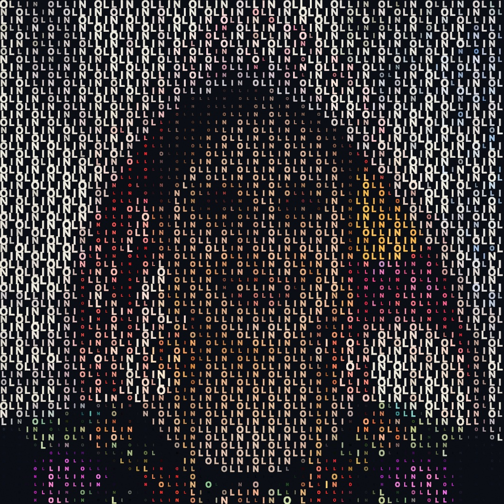

Pictures and tables arrive from outside your sketch, and you read both the same way, as grids you ask questions of. This chapter reads them one sample at a time and turns each sample into a mark of your own. One photograph, sampled a few thousand times, becomes the portrait at the top, each sample a letter sized and colored by its pixel. The sections after it answer a pixel other ways, from dithering to a shape hidden in a repeat, and then read CSV and JSON.

## A picture on the canvas: `loadImage` and `drawImage`

Images follow the pattern you already know from fonts: load once in `setup()`, keep the result, draw it in `draw()`.

```swift
final class Photo: Sketch {
    var photo: Image?

    override func setup() {
        photo = try? loadImage("/Users/you/Pictures/leaf.jpg")
    }

    override func draw() {
        background(.black)
        if let photo {
            drawImage(photo, 0, 0, width, height)     // stretched to fill
        }
    }
}
```

`loadImage` reads anything the system can decode (PNG, JPEG, HEIC, and friends). It throws when the path is wrong or the file is not a picture, and `try?` turns that into `nil`. `if let photo {` is the short form of [Chapter 2](02-Color.md)'s `if let`: it unwraps the optional under the same name, and skips the block when there is nothing. `drawImage` places the image by its top-left corner, at native size or scaled into a box. It composites in draw order with everything else and rides the transform stack like a shape. For an image that travels with your sketch, drop the file in the same folder and load it with `try? Image(resource: "leaf", withExtension: "jpg", in: .module)`, where `.module` names the folder the sketch's own files are read from.

One piece of state changes how images land: `tint`. It multiplies every pixel by a color as the image draws, so the RGB washes the image and the alpha fades it:

```swift
tint(Color(red: 1.0, green: 0.75, blue: 0.4))   // a warm wash
drawImage(photo, 0, 0, width, height)
tint(Color(white: 1, alpha: 0.3))               // ghostly, 30% opacity
drawImage(photo, 60, 60, width, height)
noTint()                                        // back to as-is
```

Tint never edits the image itself, only how it is drawn, and `withState { }` scopes it like any other state.

### A working copy: `resized` and `cropped`

A picture arrives at one size, and the size you work at is the next choice:

<picture>
  <source media="(prefers-color-scheme: dark)" srcset="Images/09-Pictures/WorkingCopy-dark.jpg">
  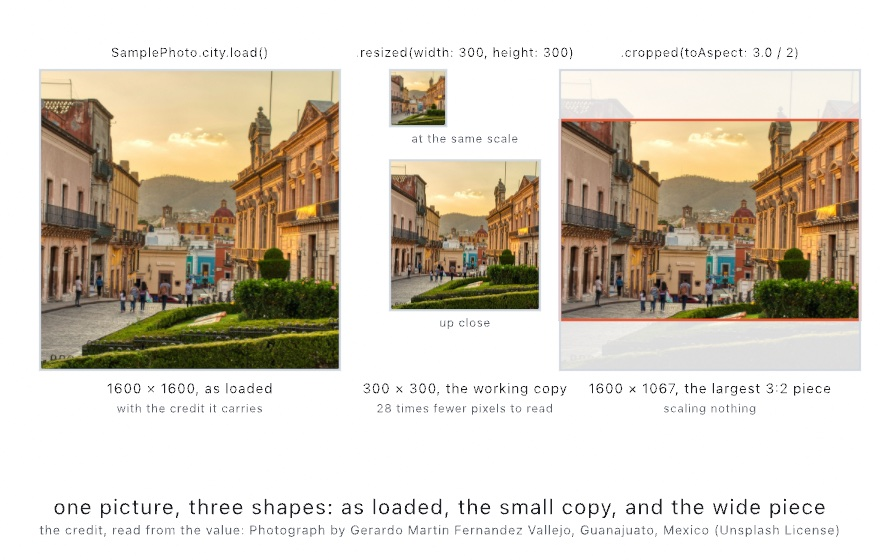
</picture>

A 1600-pixel square is more than a stipple, a dither, or a mosaic needs. Each of those reads every pixel, and they were tuned on a copy a few hundred pixels a side. `resized(width:height:)` makes that copy. `SamplePhoto.city.load().resized(width: 300, height: 300)` is the call, and the copy has twenty-eight times fewer pixels to read. Keep the small copy for the reading and the full picture for the drawing. `cropped(toAspect:)` is the other kind of change. `SamplePhoto.city.load().cropped(toAspect: 3.0 / 2)` takes the largest 3:2 piece out of the square and scales nothing, which is how a square photograph stands in for a wide one.

`SamplePhoto` is where that street came from. Ollin bundles twenty photographs to try, and `import OllinSamplePhotos` makes them available. `SamplePhoto.portrait.load()` hands you a young woman in a lace headdress at 1600 pixels square, and [Sample photographs](../Docs/Drawing/SamplePhotos.md) shows all twenty on one page, each under its name, with what it is for. Each one carries its `credit`: the photographer, the place, the page it came from, and the terms it is used under. `SamplePhoto.city.credit.line` is the sentence at the foot of the figure, ready to draw. The terms do not ask for it. The Guide gives it anyway.

### A picture you drop on the window

A path typed into `loadImage` is fine for a picture you keep. For one you want to try, drop it on the window. The sketch is told at the drop, the paths arrive through `droppedFiles()`, and `mouse` says where the file landed:

```swift
override func filesDropped() {
    for path in droppedFiles() {
        if let picture = try? loadImage(path) { pictures.append((picture, mouse)) }
    }
}
```

`pictures` is a list the sketch keeps, and each entry is a pair, a picture with the point it landed at, which Swift writes in parentheses as `(picture, mouse)`. `mouse` is `mouseX` and `mouseY` as one `Vector2`.

<picture>
  <source media="(prefers-color-scheme: dark)" srcset="Images/09-Pictures/DroppedOnTheWindow-dark.jpg">
  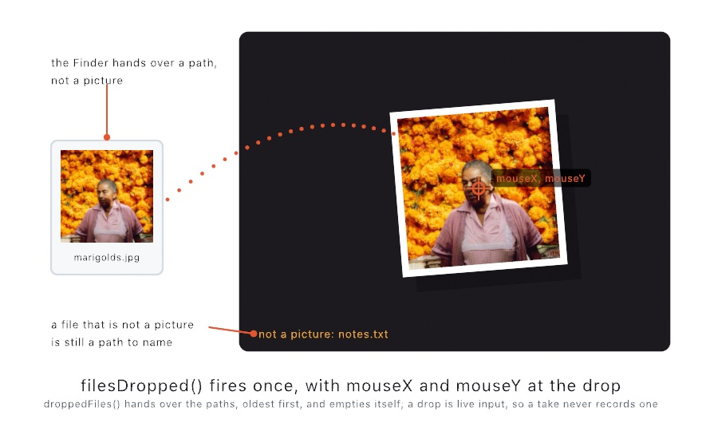
</picture>

`droppedFiles()` empties itself as you read it, so a sketch that would rather poll can call it in `draw()` instead and get each drop once. Anything the Finder can hand over comes through, a clip or a font as readily as a picture. A file the sketch cannot use is still a path it can name, the way the orange line in the figure does. Every host takes the drop wherever the sketch is running: the live window, the gallery, and the performance stage with its code hidden. A drop is live input outside a take, so a replay from [Chapter 39](39-Performing.md#playing-the-night-again-replay) never repeats one. [`Examples/Images/Dropped`](../Examples/Images/Dropped/Sketch.swift) starts as an empty frame and lands every picture where you drop it.

## The box is never the right shape: `fit`

That first `drawImage(photo, 0, 0, width, height)` did something quietly: it stretched. A photo is 3:2 or 4:3, your canvas is square or portrait, and squashing is only one of three answers. `fit:` names all three, and every one of them gives something up.

<picture>
  <source media="(prefers-color-scheme: dark)" srcset="Images/09-Pictures/PictureFit-dark.jpg">
  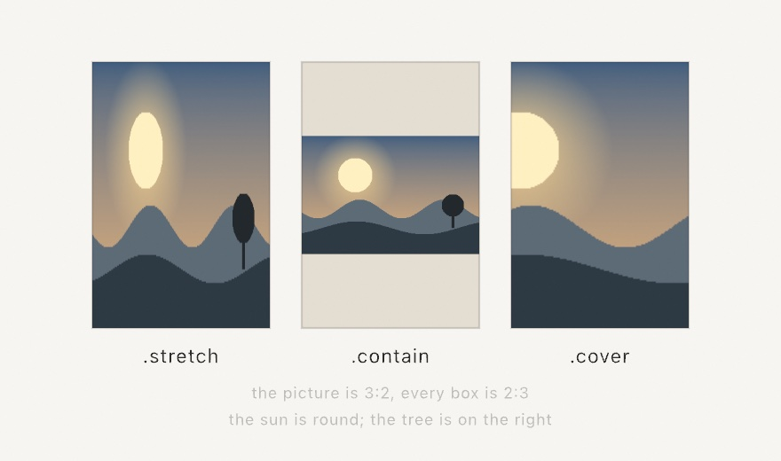
</picture>

- `.stretch` fills the box and gives up the picture's proportions. It is the default, because it is what `drawImage` has always done.
- `.contain` keeps the proportions and puts the whole picture inside, centered. It gives up part of the box, which shows along two edges.
- `.cover` keeps the proportions and fills the box, centered. It gives up the picture's own edges, cropped away.

```swift
drawImage(photo, in: panel, fit: .cover)
```

Each answer is right for a different loss. A wallpaper covers, because a strip of empty screen would be worse than a missing corner. A photograph in a contact sheet contains, because you are there to see all of it. A texture on a panel stretches, because nobody is checking its proportions.

A round shape in the picture is the fastest way to tell which one you are looking at. Stretched, it is an ellipse. The church dome in the figure gives the game away in all three panels at once.

Cropping costs nothing here. `.cover` does not clip the drawing. It reads a smaller part of the picture instead, so a covered photograph costs the same one quad and one texture read as a stretched one.

## Making it narrower without squashing it: seam carving

The three answers above keep every pixel and change how the picture sits in the box. A fourth changes the picture's own shape, and tries hard to leave the looking alone.

Say a picture is 1200 wide and the space it has to fit is 800. You can squash it with `.stretch`, and everything inside gets a third thinner. You can crop it with `.cover`, and lose whatever was at the edge. **Seam carving** is the fourth answer. Find the path down the picture that carries the least, take it out, and the picture is one pixel narrower. Do that four hundred times. Shai Avidan and Ariel Shamir published the method in 2007 as an answer to a plain engineering problem: a photograph on a web page has to fit whatever window it lands in.

<picture>
  <source media="(prefers-color-scheme: dark)" srcset="Images/09-Pictures/CarvedNarrower-dark.jpg">
  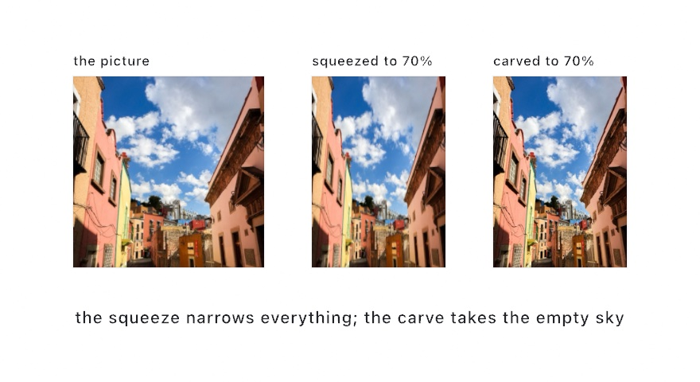
</picture>

```swift
let narrow = picture.seamCarved(toWidth: 800)
```

A *seam* is a run of pixels, one per row, that never steps more than one pixel sideways from the row above. The cheapest one is the one whose removal changes the picture least, and finding it is the whole of the technique.

Here is the rule that decides everything: **texture survives, and flat gives way.** A path down an empty sky costs nothing, because closing that gap puts two pixels beside each other that already matched. A path through a doorway costs a great deal, because closing that gap makes an edge that was not there before. So the sky goes and the doorways keep their width.

That also means a flat thing is not safe. The pastel walls above are nearly one color each, and once the plain sky is spent they are the next cheapest thing in the picture. Carve the alley to half its width and they start to go too. A mask tells the carve what to leave alone:

```swift
let held = picture.seamCarved(toWidth: 800, protecting: sunMask)
let gone = picture.seamCarved(toWidth: 800, discarding: signMask)
```

A mask is a picture the same size, marked in white. `protecting:` prices those pixels out of reach, so no seam crosses them. `discarding:` does the opposite. It makes them the cheapest thing in the picture, so seam after seam is drawn straight through them. Carve away as many seams as the marked thing is wide and the thing has left. Carve the width back up afterwards and it is gone, at the size you started with. That is the trick the technique is famous for.

Growing works the same way in reverse. Ask for a bigger size and the same cheap seams are duplicated instead of removed. The added pixels spread over the whole picture rather than stretching one part of it.

Two practical notes. One seam is one pass over the picture, so a hundred seams is a hundred passes, and like any heavy work on a picture that is `setup()` work. If the width has to keep changing while the sketch runs, work the seams out once and read any width back out of the result:

```swift
var seams: SeamMap?   // every seam the picture holds, worked out once

override func setup() {
    seams = picture.seamMap()
}

override func draw() {
    let wanted = Int(300 + sin(time) * 120)
    if let framed = seams?.image(wanted) { drawImage(framed, in: canvasRectangle) }
}
```

> **Swift note.** `seams?.image(wanted)` is optional chaining. When `seams` is `nil` the whole expression is `nil` and the `if let` skips, and when it holds a map the call goes through. `canvasRectangle` is the same rectangle as [Chapter 7](07-Tiles.md)'s `bounds`, the whole canvas.

And carve gently. Taking away a quarter of the width is usually invisible. Taking away three quarters is a different picture, whatever the arithmetic says. At some point the only thing left to take is the thing you wanted.

## An image you can ask: `image[x, y]`

Drawing a picture is the smaller half of what `Image` does for generative work. The larger half is *reading* it. The subscript `image[x, y]` returns the color stored at a pixel, and a picture becomes a field of answers, like [Chapter 5](05-Noise.md)'s noise but authored by a camera or by you:

<picture>
  <source media="(prefers-color-scheme: dark)" srcset="Images/09-Pictures/PixelSampling-dark.jpg">
  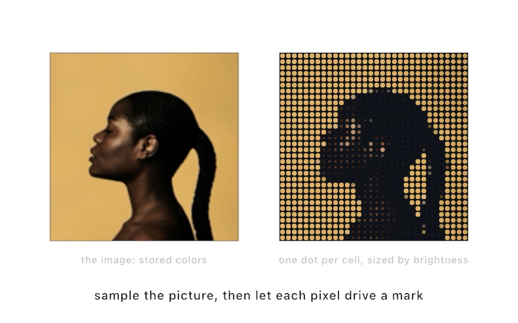
</picture>

The right panel asks the image one question per grid cell and draws the answer as a dot. The recipe has two small pieces. First, a cell's position maps to a pixel index by fractions. A cell at fraction `u` across the grid reads column `Int(u * Double(image.width - 1))`, and rows work the same way, so any grid samples any image size. Second, "how bright is this pixel" takes one more line than the three channels suggest, because your eye does not weigh them equally. Green counts most and blue least, and the standard weights are

```swift
let brightness = c.red * 0.2126 + c.green * 0.7152 + c.blue * 0.0722
```

and that single number is the handle generative artists pull most: size by it, choose by it, gate by it. [Appendix B](B-JustEnoughMath.md#perceived-brightness) keeps this one, since averaging the channels instead makes yellows read too dark and blues too bright. Ollin also carries the ask as a property, `c.luminance`, measured a touch more faithfully on the linearized components. The handwritten weights are the idea, and the property is the everyday spelling.

You can also write pixels. `Image(width:height:)` makes a blank image and `image[x, y] = color` paints one pixel, so a picture can come out of code as readily as out of a file. A double loop over every pixel, a [Chapter 2](02-Color.md) ramp read by height, and a little [Chapter 5](05-Noise.md) noise is a sky or a field in twenty lines of `setup()`. The [`PixelField`](../Examples/Images/PixelField/Sketch.swift) example is that recipe in full, and everything in this chapter reads an authored image the way it reads a photograph.

## Putting it together: a picture painted with type

This is the sketch from the top of the chapter. It composes the loading and the working copy from [A picture on the canvas](#a-picture-on-the-canvas-loadimage-and-drawimage) with the sampling from [An image you can ask](#an-image-you-can-ask-imagex-y), and answers each sample with words drawn by [Chapter 8](08-Words.md)'s `drawText`, so the picture is *made of* the words. A message repeats across a grid in reading order, and each letter samples the photograph at its own position, takes the pixel's color, and scales by its brightness.

It is a glyph mosaic built by hand, on purpose. The finished glyph mosaic after the sketch would give you a better ramp in one line, but it chooses the character for you, and this sketch needs the characters to spell something. Building the grid yourself is what lets it spell. Make `MySketches/TypeMosaic.swift`:

```swift
import Ollin
import OllinSamplePhotos

final class TypeMosaic: Sketch {
    @Param("Columns", 24...80) var columns = 64
    @Param("Message") var message = "OLLIN "
    @Param("Breathe", 0...1) var breathe = 0.5

    var source: Image?

    override func setup() {
        noiseSeed(3)
        source = SamplePhoto.portrait.load().resized(width: 160, height: 160)
        textFont(OutlineFont.systemBold)
        textMode(.atlas)                   // thousands of glyphs a frame
        textAlign(.center, .middle)
        noStroke()
    }

    override func draw() {
        background(Color(hex: 0x0B0E14))
        guard let source else { return }
        let chars = Array(message.isEmpty ? "OLLIN " : message)
        let cell = width / Double(columns)
        let rows = Int(height / cell)
        var k = 0

        for row in 0..<rows {
            for col in 0..<columns {
                let u = (Double(col) + 0.5) / Double(columns)
                let v = (Double(row) + 0.5) / Double(rows)
                let c = source[Int(u * Double(source.width - 1)),
                               Int(v * Double(source.height - 1))]
                let brightness = c.red * 0.2126 + c.green * 0.7152 + c.blue * 0.0722

                // Bright pixels get big letters; a slow noise field makes the
                // whole picture breathe without changing what it says.
                let sway = 1 + signedNoise(u * 3, v * 3, time * 0.25) * 0.18 * breathe
                textSize(cell * (0.4 + 1.25 * brightness * brightness) * sway)
                fill(Color.mix(c, .white, brightness * 0.22))
                drawText(String(chars[k % chars.count]),
                         (Double(col) + 0.5) * cell, (Double(row) + 0.5) * cell)
                k += 1
            }
        }
    }
}
```

Run it with `swift run OllinLive MySketches/TypeMosaic.swift` and take it apart:

- `resized(width:height:)` makes the 160-pixel working copy the grid reads, the habit from [A working copy](#a-working-copy-resized-and-cropped). Each pixel of the copy is roughly the average of a ten-by-ten patch of the original. So a letter reads the whole of its cell, not whichever single pixel happens to sit under its center.
- The double loop is [Chapter 6](06-GridsAndRepetition.md)'s grid chore done by hand, because what it loops over is the *message*: `k % chars.count` deals the letters out in reading order, so the rows spell the message over and over, and `u`/`v` fractions map each cell onto its pixel.
- `brightness * brightness` is contrast shaping, since squaring pushes mid grays down so the lace pops. The `fill` mixes each pixel's color a step toward white in the brightest cells, which makes the lit lace read as light rather than paint.
- `textMode(.atlas)` matters here, because sixty-four columns is a few thousand glyphs per frame, and the atlas mode draws each as one cheap textured quad instead of re-tessellating outlines. It is the volume switch for text, one line.
- `Breathe` feeds a slow `signedNoise` into the letter sizes, so the picture shimmers without changing what it says. The `Message` parameter is a text field in the live window, so type into it and the portrait respells itself as you watch.

> **Swift note.** `guard let source else { return }` is the `guard let` from [Chapter 7](07-Tiles.md). `Array(message)` turns a string into a list of its characters, so `chars[k % chars.count]` can deal them out like [Chapter 1](01-HelloOllin.md)'s palette cycling.

When a portrait is a keeper, export it as a still:

```sh
swift run OllinLive MySketches/TypeMosaic.swift --export portrait.png
```

Then make it yours:

- Swap the picture. `SamplePhoto.scarf.load()` in place of the portrait's load is the only change, and a picture of your own is `try? loadImage("/path/to/yours.jpg")`, unwrapped the way the first listing did. A face reads at 60 to 80 columns, a street wants more, and a picture you author with `Image(width:height:)` reads the same way.
- Change the alphabet. A message of `"·•●"` becomes halftone dots, and `textFont(BitmapFont.builtIn)` in `setup()` makes it a terminal.
- Sample with an offset. Read the pixel at `u + time * 0.01` (wrapped with `fract`) and the picture slides through the words.
- Recolor by replacing the sampled color with `Colormap.magma.color(at: brightness)` for a duotone poster.
- Trade the letters for line work. Feed the same picture to `singleLine(of:points:in:)`, from the family below, and the poster becomes one unbroken thread a plotter could draw.

## The colors read back: palettes and dithering

The portrait read one pixel at a time and answered each with a letter. A palette taken out of the picture and a picture dithered back into fewer colors both read the whole picture at once. The portrait has no use for either. But a palette from a photograph is a palette nobody else has, and dithering is what you reach for when you have fewer colors than a picture needs.

### Palettes from a photograph

Reading one pixel gives you one color. A [`Palette`](02-Color.md#kits-you-carry-palette-and-ramp) can come out of the whole picture at once. It is for a sketch that should wear the colors of a photograph you took, and for a poster that reduces one. The grouping is Lloyd's algorithm, the clustering method from 1957 that moves each group's center to the middle of its members until nothing moves, seeded the k-means++ way so the same picture gives the same groups. Give `Palette(extractedFrom:count:)` an image and how many colors you want, and it hands back the center of each group:

```swift
let photo = try! loadImage("beach.jpg")
let p = Palette(extractedFrom: photo, count: 5)
fill(p[0])     // the color the photo is mostly made of
```

The `try!` there says the file is there, as [Chapter 2](02-Color.md)'s palette files did, and the block below does it the careful way. The colors come back most-used first, so `p[0]` is the one you would name if someone asked what color the photo is. The grouping happens in OKLab for the same reason [mixing](02-Color.md#mixing-you-can-trust) does, which is that it groups colors the way your eye does rather than the way the numbers do. Ask for fewer colors than the picture holds and it merges the closest ones together instead of dropping any.

Two practical notes. The first is that it gives the same answer every time for the same picture, so a sketch that extracts a palette still reproduces, which matters once you start exporting. The second is that it does enough work that you do not want it running sixty times a second. Load the photo and extract the palette once in `setup()`, keep both in properties, and let `draw()` read what is already there:

```swift
var photo: Image?
var palette = Palette([])

override func setup() {
    photo = try? loadImage("beach.jpg")
    if let photo { palette = Palette(extractedFrom: photo, count: 5) }
}
```

### Fewer colors than the picture needs: dithering

Dithering puts a picture back together in fewer colors than it has, by scattering the colors you do have so that the eye reads the tones in between. It is for a poster in five inks, a screen with a small palette, and the look of old print and old computers. The two families here are Bryce Bayer's ordered matrix of 1973 and the error diffusion Robert Floyd and Louis Steinberg published in 1976. Once you have a palette, one call does it:

```swift
if let photo {
    let poster = photo.dithered(.floydSteinberg, to: palette)
    drawImage(poster, in: bounds)
}
```

Every pixel of the result is one of your five colors, and `bounds` fills the frame as it did in [Chapter 7](07-Tiles.md). The word is the thing to understand, because the problem it answers keeps coming back.

<picture>
  <source media="(prefers-color-scheme: dark)" srcset="Images/09-Pictures/Dithering-dark.jpg">
  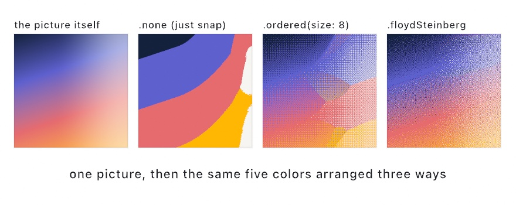
</picture>

The first panel is the picture as it came. Snapping each pixel to the nearest available color is the obvious way to fit it into five, and the second panel shows what that costs. Smooth regions turn into flat bands with hard edges, because a whole stretch of subtly different tones all round to the same color. Dithering trades those bands for texture. Where a tone falls between two of your colors, it scatters both of them in the right proportion, and your eye, blurring them together at any normal distance, reads the tone that was there. The picture keeps its gradients using colors it does not have.

The two families look different on purpose.

**Threshold maps** decide each pixel from its position alone, using a repeating tile. `.ordered(size: 8)` uses a Bayer matrix and lays down the regular crosshatch of retro graphics and old newsprint, while `.blueNoise` uses a tile with no structure in it and gives an even, pattern-free grain. Because the decision is positional, these are cheap and completely local.

**Error diffusion** works differently. It commits to a color for one pixel, measures how far off that was, and pushes the leftover error onto neighbors it has not reached yet, so every mistake gets paid back nearby. `.floydSteinberg` is the classic, and it gives the organic scattered look in the last panel. `.atkinson` throws away a quarter of the error on purpose, which blows highlights and shadows out to clean white and black. That look has a name because people go looking for it.

A few practical notes. `.none` skips the scattering entirely, which is what the second panel uses and what you reach for to show someone the difference. There is a second form, `dithered(.atkinson, levels: 2)`, that quantizes to evenly spaced steps per channel instead of to a palette, which is the posterizing one. And this is CPU work over every pixel, so do it in `setup()` and hold the result rather than redoing it each frame. [The color reference](../Docs/Drawing/Color.md#dithering) has the full method list, and [`Examples/Color/Dithering`](../Examples/Color/Dithering/Sketch.swift) puts five methods beside the original.

## A picture as marks: glyphs, dots, pictures, lines, and thread

The portrait was a mosaic built by hand, one letter per cell, so that the message could spell something. When the marks do not need to spell anything, the framework ships the same move finished, and several others in the same spirit: a character or a dot per cell, a small picture per cell, dots settled into one line or one tree, and a single thread wound between pins. Every one reads brightness the way the portrait did and answers it with a different mark. All of them descend from one idea, the halftone that newspapers were printing by the 1880s: pick a mark, vary it by the brightness underneath, and let the eye put the picture back together.

### One mark per cell: `drawGlyphMosaic` and `drawHalftone`

A glyph mosaic puts one character in each cell of a grid, and a halftone puts one dot in each cell, grown to the tone. Both are for a picture that should read as texture from a distance and as marks up close, and the halftone is the one to reach for when the marks have to be drawn by a pen. The glyph mosaic is the picture a line printer made in the 1960s, and the halftone is the printing industry's answer from the 1880s. Ollin ships both finished.

<picture>
  <source media="(prefers-color-scheme: dark)" srcset="Images/09-Pictures/PictureAsGlyphs-dark.jpg">
  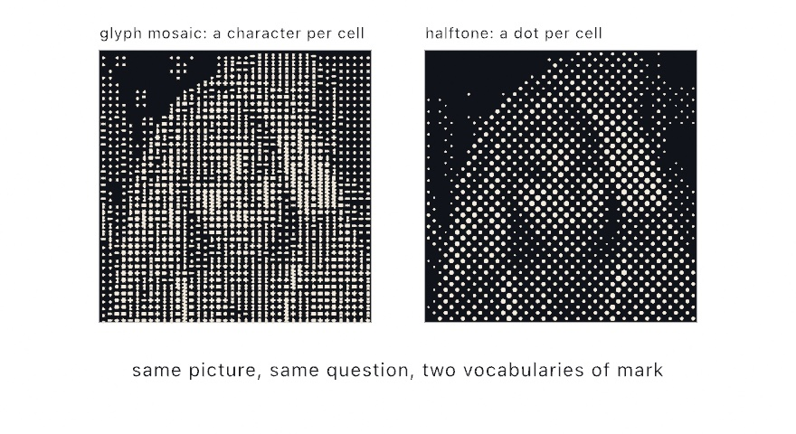
</picture>

`drawGlyphMosaic` divides the picture into a grid and puts one character in each cell:

```swift
textFont(BitmapFont.builtIn)
fill(.white)
drawGlyphMosaic(picture, columns: 72)
```

The part to understand is how it picks the character. It *measures* every character you offer it in the font you are currently using, counting lit pixels for a bitmap font, outline area for an outline font, pen travel for a stroke font. Then it matches each cell to the character whose ink comes closest. So any string works as a ramp, in any font, and the tones stay true. `GlyphSet.technical`, `.classic`, and `.blocks` are curated sets to start from. `glyphScale` is the fraction of its cell a glyph draws at, defaulting to 0.85 so gutters keep even the densest characters reading as separate marks.

`drawHalftone` does the same job with one dot per cell, grown until it covers the right fraction of that cell:

```swift
fill(.black)
noStroke()
drawHalftone(picture, pitch: 14)
```

`pitch` is the cell size and `angle` rotates the screen, defaulting to the 45 degrees printers have used for a century because a diagonal grid is the least visible to the eye. Coverage is exact, so tone is right rather than approximated, and the dots are circles. That last detail is what lets a halftone go straight out to a pen plotter.

Comparing the two panels shows the difference between them. A mosaic has as many tones as it has characters, so it steps, while a halftone's radius is continuous and gives you a smooth ramp. Choose by which texture you want.

One polarity trap sits between them. `drawGlyphMosaic` grows its mark with *brightness* by default, which suits glowing marks on a dark ground, while `drawHalftone` grows its dot with *darkness*, because it is modeling ink on paper. Each takes `inverted: true` to flip, and the figure above uses the mosaic's default beside the halftone's inverted form to get both reading the same way.

Both also come in a data form, `glyphMosaic(of:)` and `halftone(of:)`, which hand back the cells or dots instead of drawing them. That is the door to your own marks: same measurement, but you draw hexagons, or letters from a message, or nothing at all where the tone is light.

### A picture made of pictures

The marks so far have been characters and dots. They can be pictures. A photo mosaic rebuilds a target out of a library of smaller pictures, one per cell, and it is for the picture that rewards a second look: from across the room it is the target, and up close every cell is a picture of its own. Robert Silvers patented the photographic mosaic in 1996, from work at the MIT Media Lab, and the idea of one picture built from many is older than photography.

<picture>
  <source media="(prefers-color-scheme: dark)" srcset="Images/09-Pictures/PicturesFromPictures-dark.jpg">
  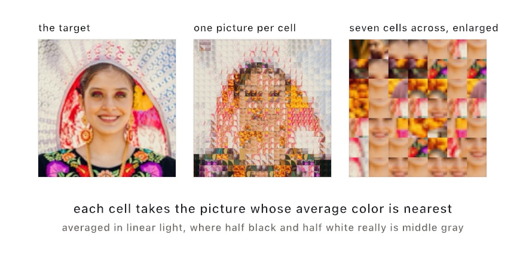
</picture>

```swift
let mosaic = target.mosaic(of: library, columns: 32, rows: 32)
drawMosaic(mosaic, of: library, in: bounds, tint: 0.25)
```

Every cell of the target is averaged, every picture in the library is averaged once, and each cell takes the nearest one.

**The averaging happens in linear light, and it has to.** A cell that is half black and half white is middle gray, which is 0.5 in linear light and about 0.74 written back out in sRGB. Average the sRGB numbers instead and you get 0.5, a quarter too dark, and the mosaic loses its lights. Ollin averages in linear light. The reason to know it is that hand-rolling the same loop is where the mistake usually lives.

Two parameters matter. `tint` mixes each cell toward the color it stands for, which is how a mosaic is made to read from further off. A quarter of the way is a good place to start, and 1 gives up and paints flat color. `maxUses` limits how often one picture may repeat, filling cells in reading order and falling back to the nearest picture when the library runs dry.

The material decides whether a mosaic works. **The target needs range and the library needs range in the same places.** A target that is mostly one flat dark takes the one nearest picture and repeats it over the frame, which is a picture of nothing. `mosaic.uses(of:)` hands back a use count per picture in the library, and the number of non-zero counts is the one to watch when a mosaic looks flat.

### A picture as one line: stippling, `singleLine`, and `spanningTree`

This entry turns a picture into line work, and all of it starts with **stippling**, which is placing loose dots so that their density reproduces the picture's tone. It is for the drawings a pen makes: a plotter draws dots, one closed tour, or a branching tree, and never a fill. Stippling with dots of even weight was a hand discipline in scientific illustration for a very long time. Adrian Secord gave it an algorithm in 2002. The one unbroken tour through the dots, where the picture appears out of how tightly the line has to wander, was made popular by Robert Bosch and Craig Kaplan in the mid-2000s. Drawings made that way are called TSP art, after the routing problem that finds the tour.

Getting a stipple right is harder than scattering dots at random, because random placement clumps. The method Ollin uses is a settling process. Give every dot the patch of canvas that lies closer to it than to any other dot, move the dot to the center of that patch weighted by how dark the picture is there, and repeat. Dots drift toward darkness and away from each other at the same time. After a few dozen rounds they sit in an even spread that is dense in the shadows and sparse in the light. [Chapter 15](15-ShapesAsMaterial.md) names the structure underneath this, since it turns out to be useful for a lot more than dots.

```swift
let dots = stipple(of: picture, count: 4000, in: frame)
```

<picture>
  <source media="(prefers-color-scheme: dark)" srcset="Images/09-Pictures/PictureAsLines-dark.jpg">
  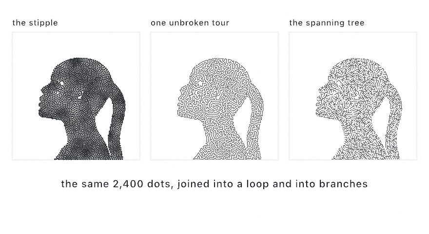
</picture>

Once you have the dots, two ways of joining them give two very different drawings:

```swift
let tour = singleLine(through: dots)        // one closed loop
let chains = spanningTree(through: dots)    // branching, minimal pen lifts
```

`singleLine` finds a short tour that visits every dot once and comes back. The result is one continuous line, and the picture appears out of how tightly that line has to wander. `spanningTree` instead finds the shortest set of links that still connects every dot, then breaks the result into the fewest separate chains it can, so a drawing machine lifts its pen as few times as the branching requires. The first reads as a maze, the second as veins.

Both also take a picture directly and do the stippling for you:

```swift
let line = singleLine(of: picture, points: 4000, in: frame)
let veins = spanningTree(of: picture, points: 4000, in: frame)
```

In those forms `cutoff` is the parameter to know. It rounds bright grays up to paper, so pixels lighter than it place no dots at all. Without it a light region collects a thin wandering thread instead of staying empty, which is what a plain ground behind a face would do. A cutoff around 0.6 calls a tan ground paper, so the ground stays empty and every dot goes to the face.

### A picture wound from thread: `StringArt`

String art takes the same idea to its most physical form. Ring the canvas with pins, tie one thread to a pin, and wind it straight across, again and again. Nothing curves and nothing lifts, and the picture has to come out of where the crossings pile up. It is for a picture you could wind on a hoop of nails, and the winding order comes out with it. Petros Vrellis made it famous as a computational technique in 2016.

<picture>
  <source media="(prefers-color-scheme: dark)" srcset="Images/09-Pictures/WoundFromThread-dark.jpg">
  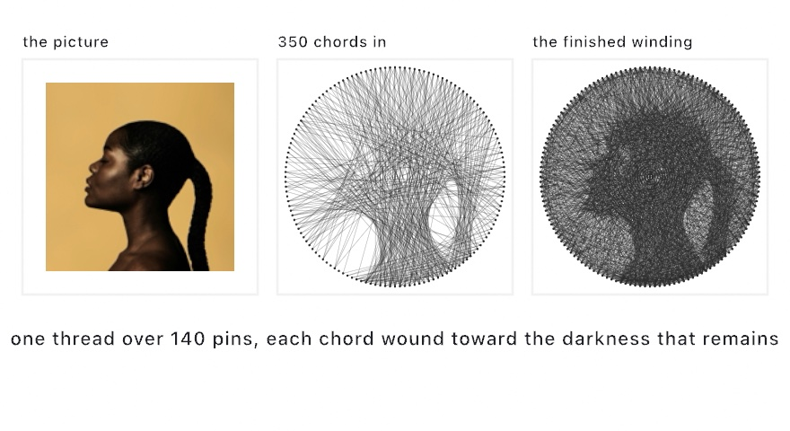
</picture>

```swift
let art = StringArt(of: picture, center: Vector2(540, 540), radius: 470)

override func setup() { noClear() }

override func draw() {
    if frameCount == 1 { background(.white) }
    stroke(Color.black.withAlpha(0.35))
    for chord in art.step(8) {
        drawLine(chord.from, chord.to)
    }
}
```

Each chord is a greedy choice. From the pin the thread is on, `StringArt` scores every reachable pin by the darkness the straight chord would still cover. It winds the best one, subtracts that ink from its copy of the picture, and goes again from the pin it landed on. Dark regions demand crossing after crossing. Light regions are left almost alone. The picture emerges from where the thread had to go.

It is a stepper you hold on to, like the growth systems of [Chapter 13](13-GrowingThings.md). `noClear()` in `setup()` stops the canvas being cleared between frames, so each `step` winds a few more chords onto what is already there, and the picture knits itself over the first seconds of a run. `withAlpha(0.35)` is the thread's faintness, the same alpha [Chapter 2](02-Color.md) set with `Color(hex:alpha:)`, so crossings add up. The result is thread you could follow: `art.thread` is one open polyline, and `art.sequence` is the winding order itself, pin numbers you could follow on a rim of pins.

Bold tonal masses knit into a clear figure, which is why a profile winds better than a street or a sky. A picture whose tone changes gently everywhere, a dusk sky or a face lit flat, winds into fuzz. Every chord covers about the same darkness, so no choice stands out. Give the winding silhouettes and deep shadow against open paper, or boost a timid picture's contrast first.

## The picture's own pixels: sorting and a hidden shape

Everything so far answered a pixel with a mark of its own. Pixel sorting and the autostereogram keep the picture's own pixels. One rearranges them, and the other reads a depth map's pixels to hide a shape in a field of repeats. Neither is in the portrait, and both read pixels on the CPU, like the stipple and the thread above, so each one is `setup()` work: run it once, hold the result, and let `draw()` replay it.

### Sorting the pixels

Pixel sorting rearranges the pixels a picture already has. It walks each row or column, finds runs of pixels whose brightness falls inside a band you choose, and sorts each run. It is the glitch look, a picture melting in streaks, and it comes from glitch art rather than illustration: it spread from a 2010 sketch by Kim Asendorf.

<picture>
  <source media="(prefers-color-scheme: dark)" srcset="Images/09-Pictures/SortedPixels-dark.jpg">
  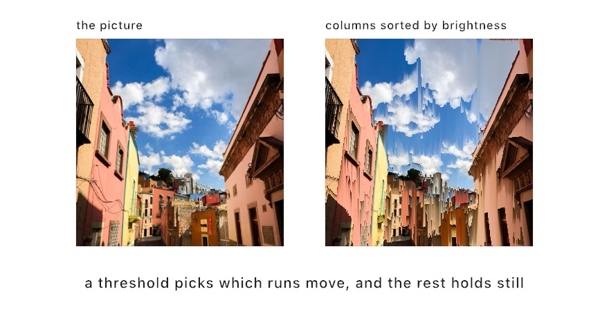
</picture>

```swift
let melted = picture.pixelSorted(.vertical, threshold: 0.2 ... 0.75)
let glitched = picture.pixelSorted(.vertical).pixelSorted(.horizontal)
```

The threshold is the whole technique. It decides which pixels are in play, and everything outside the band stays where it was, which is why the deepest doorways and the brightest clouds survive in the picture above while everything between them pours. Sort by `.brightness`, `.hue`, or `.saturation`, and `reversed` flips which end of the run the bright pixels pile up at.

Two notes. The look needs some texture in the source, because run boundaries have to vary from line to line, and a clean gradient sorts almost invisibly. And the direction matters against the picture's own gradient. The alley runs bright at the top and dark at the bottom. An ascending sort piles each run's dark pixels at its top, so it turns the picture inside out. On a picture that already runs dark to bright down the column, that same sort changes nearly nothing, and `reversed: true` is the direction with the drama.

### A picture that hides a shape

An autostereogram hides its picture instead of drawing it. It is a field of marks that repeats, with the repeat shortened wherever a shape is nearer, so that two eyes looking through it see the shape standing out of the page. It is for the poster that holds a secret, and it needs a depth map rather than a photograph. Christopher Tyler and Maureen Clarke made the first single-image random-dot stereogram in 1990, building on the random-dot stereograms Bela Julesz devised in 1959.

<picture>
  <source media="(prefers-color-scheme: dark)" srcset="Images/09-Pictures/DepthInARepeat-dark.jpg">
  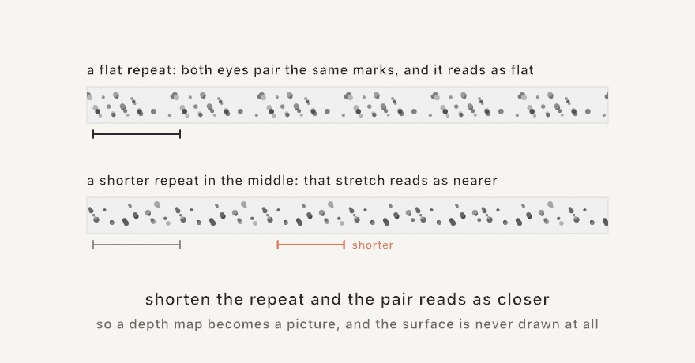
</picture>

A pattern that repeats at a fixed spacing gives both eyes the same marks to pair, and they read those marks at whatever depth that spacing stands for. **Shorten the repeat and the pair reads as nearer.** That is the whole trick, and it means a depth map can be turned into a picture: shorten the repeat wherever the shape is closer.

```swift
if let hidden = depthMap.autostereogram(Autostereogram(repeatWidth: 120, relief: 0.22)) {
    drawImage(hidden, in: rect)
}
```

Hand it a picture where bright means near, and get back a field of noise with a shape buried in it, or `nil` when the map cannot be used. Look *through* the picture, at something behind the screen, until the repeats double up. Crossing your eyes instead reads the same picture inside out, so the shape sinks rather than stands.

Four things decide whether one works, and only the first is code.

**Draw it at its own pixel size.** Scaling resamples the repeats the eyes have to pair, and a stereogram at half size cannot be fused. **Keep the relief under about a third** of the repeat, which is where the eyes give up. **Use hard edges**, because a soft gradient gives them nothing to lock onto. And expect a shimmer along every edge of the shape: within one repeat of a depth step neither depth is the answer, which is in the technique rather than in the picture.

## Numbers you didn't type: CSV and JSON

Words and pictures are material you bring in. So are numbers, and they come in the same way: a file read once in `setup()`, then asked one row at a time. The portrait has no use for them. But a spreadsheet, a sensor log, and a download from a public archive all export as one of two formats, and once a sketch reads them, the drawing changes when the file does and you never touch the sketch.

### Reading a table: `loadTable`

A comma-separated file is the format everything exports. `loadTable` reads one, and each row hands you its cells by column name.

<picture>
  <source media="(prefers-color-scheme: dark)" srcset="Images/09-Pictures/DataAsMaterial-dark.jpg">
  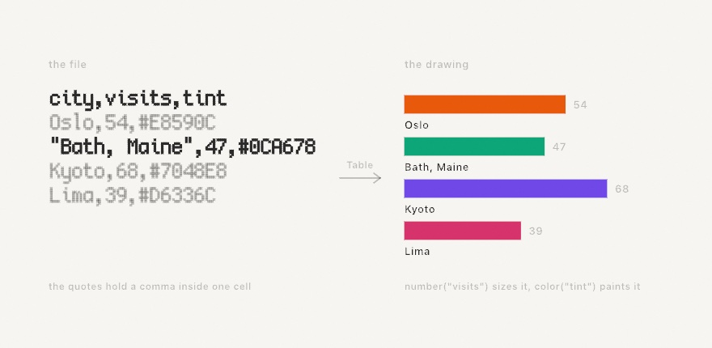
</picture>

```swift
var table: Table?

override func setup() {
    table = try? loadTable(resource: "visits", withExtension: "csv", in: .module)
}

override func draw() {
    background(.white)
    guard let table else { return }

    for (index, row) in table.enumerated() {
        let y = 100 + Double(index) * 60
        fill(row.color("tint") ?? .gray)
        drawRect(corner: Vector2(80, y), width: row.number("visits") ?? 0, height: 22)
    }
}
```

A cell is text, because that is what a file holds. `row["city"]` gives you that text, and `row.number(_:)`, `row.int(_:)`, `row.bool(_:)`, and `row.color(_:)` convert it when you ask. Each one answers `nil` when the column is not there or the cell is not what you asked for, which is the right answer for a file with a gap in it. An empty cell is not a zero. `drawRect(corner:width:height:)` takes the corner as the point you already hold, the labeled form beside the positional one from [Chapter 1](01-HelloOllin.md).

Two things about the format matter, and the figure above shows both. A cell wrapped in double quotes may hold commas and line breaks, so `"Bath, Maine"` is one cell and arrives without its quotes. And a first row holding no numbers is read as the header. When that guess is wrong, say so with `hasHeader: false` and read cells by position instead.

### From numbers to marks

A file gives you rows and columns. A drawing wants marks, and nothing in the file says which. That choice is yours, and it comes down to three questions for every mark: which column, which property of the mark, and over what range.

Take one column and one property first. In the bars above, `visits` became a length. It could as well have become a radius, a height, a hue, or a turn, because every property of a mark is a number. The range is the part to get right, and the file should set it. `numbers(_:)` reads a column as a series, `min()` and `max()` find its ends, and `map` from [Chapter 3](03-MotionAndTime.md) carries a value from that range into the one your mark needs:

```swift
let rain = table.numbers("rain")
guard let most = rain.max() else { return }
for (index, row) in table.enumerated() {
    let height = map(row.number("rain") ?? 0, 0, most, 0, 250)
    drawRect(corner: Vector2(60 + Double(index) * 30, 300 - height), width: 20, height: height)
}
```

`max()` answers `nil` for an empty column, since an empty list has no largest value, which is why the `guard`. A length starts at zero. A bar twice as long stands for a number twice as big only when the scale starts there, so the low end of a length's range is 0 whatever the column's smallest value is. A position is the opposite. Map it from the column's smallest value to its largest, and the marks spread over the space you gave them. A dot sized by a number is a third case, because the eye reads a dot by its area. Give the radius the square root of the mapped value, `.squareRoot()`, and a value twice as big reads twice as big instead of four times.

Two columns place a mark. Read one into x and one into y, and every row becomes a point in a field, the drawing a scientist calls a scatter. The rows in order place a mark too. When the rows are a sequence, the months of a year or the readings of a day, the row's index is the x and its number is the y. Joining those points with `drawPolyline` gives the line everybody reads as time:

```swift
let high = table.numbers("high")
guard let lowest = high.min(), let highest = high.max() else { return }
var points: [Vector2] = []
for (index, row) in table.enumerated() {
    let y = map(row.number("high") ?? lowest, lowest, highest, 300, 60)
    points.append(Vector2(60 + Double(index) * 30, y))
}
drawPolyline(points)
```

<picture>
  <source media="(prefers-color-scheme: dark)" srcset="Images/09-Pictures/MarksFromNumbers-dark.jpg">
  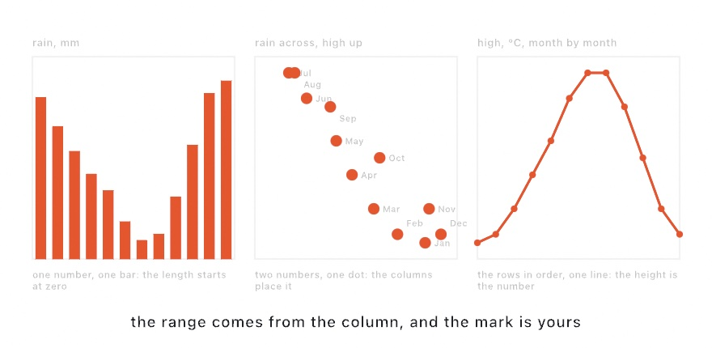
</picture>

Color is one more property. A column can carry it outright, as `tint` did in the bars, or a number can pick it from a [Chapter 2](02-Color.md) `Ramp`. `ramp.color(at: map(value, lowest, highest, 0, 1))` turns a temperature into a color the way [Chapter 7](07-Tiles.md)'s tangle turned noise into one.

The marks are the sketch's, so nothing holds you to bars and dots. A circle that grows with its number, a line that turns by it, a letter from [Chapter 8](08-Words.md) sized by it, all read the same column. [`Examples/Data/Readings`](../Examples/Data/Readings/Sketch.swift) draws a year from a table like this step's: one bar per month from its low to its high, with a rain dot sized by its column and a color the file carries.

### Documents with a shape: `loadJSON`

JSON works the same way, for documents with a shape rather than rows:

```swift
let doc = try? loadJSON(resource: "places", withExtension: "json", in: .module)

for point in doc?["points"].array ?? [] {
    fill(point["tint"].color ?? .gray)
    drawCircle(point["x"].number ?? 0, point["y"].number ?? 0, 20)
}
```

Reach in by name or index, then ask for the kind you want at the end: `.text`, `.number`, `.int`, `.bool`, `.color`, `.array`. `doc?["points"]` is the optional chaining from the seam map above, so a document that failed to load loops zero times. A key that is not there answers null rather than stopping, so a whole path is safe to write in one line, and a loop over a key that is not there runs zero times too. That is why the `tint` above needs no check: a point that does not carry one lands on the fallback.

Both loaders belong in `setup()`. Reading a file is slow next to drawing one frame, and a network URL blocks until it arrives. The two readers are small on purpose, because a document with a shape of its own is `Codable`'s job rather than this framework's, and [Data](../Docs/Helpers/Data.md#codable) shows that route. [`Examples/Data/Places`](../Examples/Data/Places/Sketch.swift) draws a JSON survey.

## Where this comes from

Turning a photograph into marks is older than the computer that does it now. Newspapers were printing halftones by the 1880s, rebuilding a photograph out of dots that vary in size, and every treatment in this chapter descends from that one idea. In São Paulo in 1969, Waldemar Cordeiro and the physicist Giorgio Moscati printed a poster of a young couple as line-printer characters, and then its derivative. That is the glyph mosaic's own lineage and the source of the homages linked below. Seam carving is the youngest technique on the spine. Shai Avidan and Ariel Shamir published it in 2007, and its demonstration video went around the world, mostly because of the part where a mask makes something disappear.

The families after the sketch name their own sources, from Secord's stipple to Asendorf's sorted pixels. Full credits are in the project's [attribution notes](../ATTRIBUTION.md).

## Go deeper

- [Images](../Docs/Drawing/Images.md): the complete `Image` surface, including `Image(resource:withExtension:in:)` for a picture bundled with a sketch, `resized` for a working copy, the sampling helpers, and authoring an image in code.
- [Sample photographs](../Docs/Drawing/SamplePhotos.md): all twenty bundled pictures, what each is good for, the credit each carries, and the terms they are used under.
- [Input](../Docs/Helpers/Input.md): the drop hook and the draining read beside the mouse and keyboard reads, and which host surfaces take a drop.
- [Glyph mosaic](../Docs/Drawing/GlyphMosaic.md) and [halftone](../Docs/Drawing/Halftone.md): the measured coverage behind the glyph ramp, the dot shapes and screen angles, and the `colored` form of each.
- [Photo mosaic](../Docs/Drawing/PhotoMosaic.md): `averageColor` and its linear-light rule, the match, the tint and repeat parameters, and drawing the placements yourself.
- [Autostereogram](../Docs/Drawing/Autostereogram.md): the repeat and relief settings, the pattern, and why a scaled one stops working.
- [Stippling](../Docs/Generators/Stippling.md), [single line](../Docs/Generators/SingleLine.md), and [spanning tree](../Docs/Generators/SpanningTree.md): every parameter on the even scatter, the closed tour through it, and the branching tree over the same dots.
- [String art](../Docs/Generators/StringArt.md): the pins and the ink dial, and `inverted` for a pale thread on a dark ground.
- [Pixel sorting](../Docs/Drawing/PixelSorting.md): every key and direction, and how to get each of the classic looks.
- [Seam carving](../Docs/Drawing/SeamCarving.md): both energies, the two masks, growing rather than shrinking, and the `SeamMap` that hands back any width at once.
- [Data](../Docs/Helpers/Data.md): `loadTable` and `loadJSON` in full, including the separator and header guesses, the two ways a column reads back, and what a missing key does.
- Appendix B draws this chapter's math, one picture per idea: [Fractions, mapping, and wrapping](B-JustEnoughMath.md#fractions-mapping-and-wrapping), [Shaping a value](B-JustEnoughMath.md#shaping-a-value), [Color and light as numbers](B-JustEnoughMath.md#color-and-light-as-numbers).
- Worked examples: [`Examples/Images/GlyphMosaic`](../Examples/Images/GlyphMosaic/Sketch.swift), [`Halftone`](../Examples/Images/Halftone/Sketch.swift), [`PixelSort`](../Examples/Images/PixelSort/Sketch.swift), [`SingleLine`](../Examples/Images/SingleLine/Sketch.swift), [`SpanningTree`](../Examples/Images/SpanningTree/Sketch.swift), [`StringArt`](../Examples/Images/StringArt/Sketch.swift), [`SeamCarve`](../Examples/Images/SeamCarve/Sketch.swift), and [`PixelField`](../Examples/Images/PixelField/Sketch.swift) (authoring an image pixel by pixel and reading it back).
- Worked examples for data: [`Examples/Data/Readings`](../Examples/Data/Readings/Sketch.swift) (a CSV as a range chart) and [`Examples/Data/Places`](../Examples/Data/Places/Sketch.swift) (a JSON survey).
- The Cordeiro homages in [`Examples/Recreations/WaldemarCordeiro/`](../Examples/Recreations/WaldemarCordeiro/): a picture read into levels by arithmetic you can see. `Derivadas` averages each block with `averageColor(in:)` and cuts the tones into seven levels. It prints them as characters, then takes the difference between neighbors, which turns shading into contours. `Gente` multiplies the same kind of levels by a degree and holds them at black, so a crowd loses its middle tones sheet by sheet.

---

[Contents](README.md#contents) · Previous: [Chapter 8, Words](08-Words.md) · Next: [Chapter 10, Vectors, gently](10-Vectors.md)
