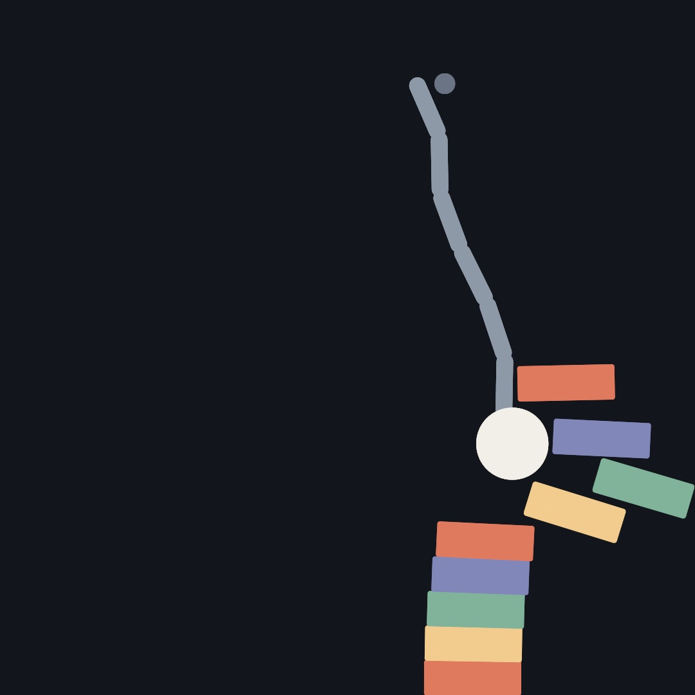
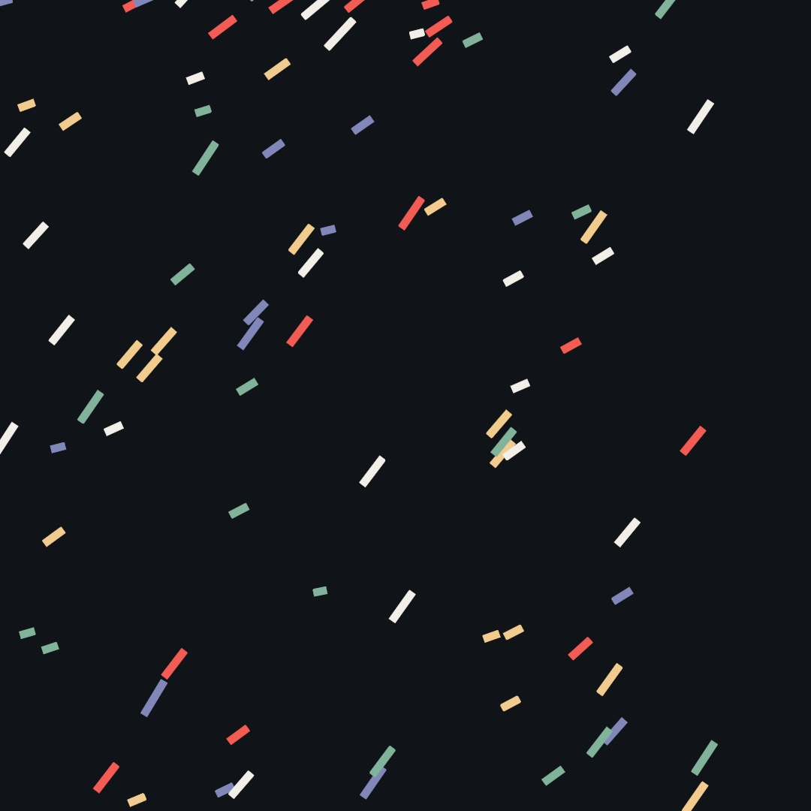
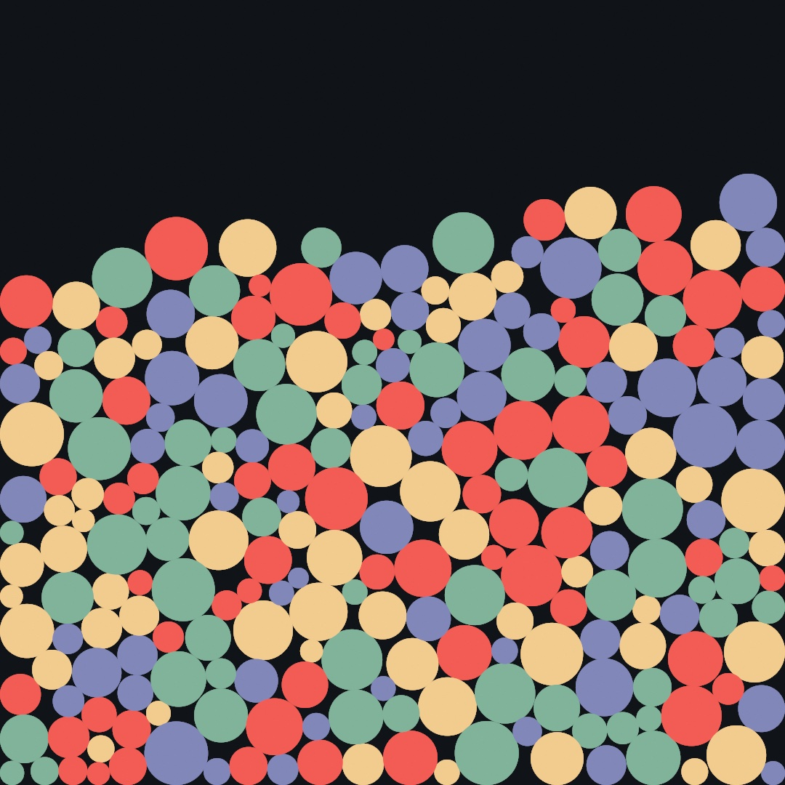
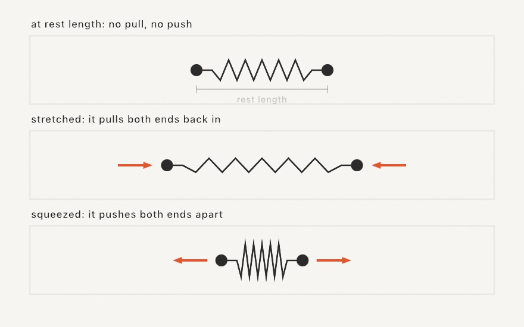
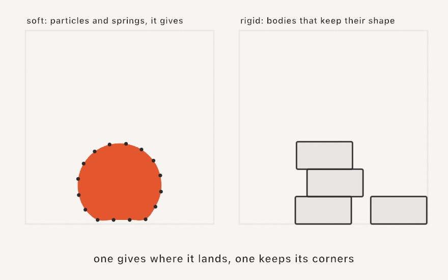
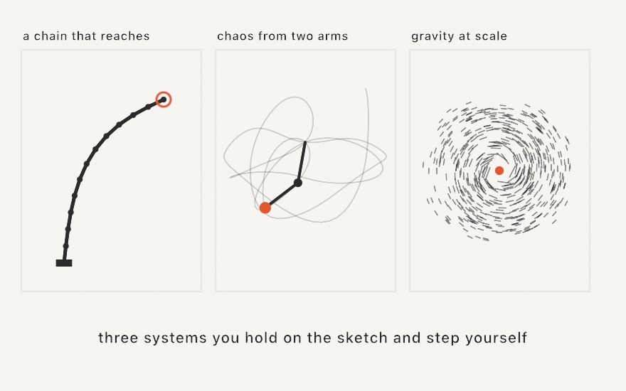

#### <sup>[Ollin](../README.md) → [Guide](README.md) → Chapter 10</sup>

---

# 10. Forces and physics



In [Chapter 9](09-Vectors.md) you moved things yourself. You wrote the velocity, added the gravity, decided what happens at the floor. This chapter is about the layer under that, meaning forces, the pushes that change a velocity. You'll write a few forces by hand first, and find out why mass matters. Then you'll hand the whole job to a physics world. It holds hundreds of bodies at once, connects them with springs and hinges, and lets you grab them with the mouse. The wrecking ball above is where it ends up. You get to knock the tower down yourself.

## A force is a push

The bouncing ball in [Chapter 9](09-Vectors.md) ran on two lines:

```swift
velocity += gravity * deltaTime
position += velocity * deltaTime
```

That `gravity` was an acceleration, a fixed change to the velocity every second. It worked because only one thing was pushing. But most interesting motion has several pushes going at once. Wind shoves from the side. Drag, the air resisting motion, pushes back against it. Gravity never stops. Each of these is a **force**, a push with a strength and a direction, which is to say a vector.

When several forces act on a body in the same frame, combining them takes no new math. You add the arrows, the same tip-to-tail walk you learned last chapter:


**Acceleration is force divided by mass.** So the sum above is not an acceleration yet, because mass sits in between. The same shove that sends a ping-pong ball flying barely moves a bowling ball. In code, the pattern is to gather the frame's forces into one vector, divide once, and then carry on exactly as before:

```swift
var force = Vector2(0, 340) * mass     // gravity
force += Vector2(gust, 0)              // wind
force += velocity * -2.2               // drag pushes against the motion
let acceleration = force / mass

velocity += acceleration * deltaTime
position += velocity * deltaTime
```

Two of those force lines are worth a second look. Gravity is written `* mass` because the real pull of the earth is stronger on heavier things, in exact proportion. Divide by mass a moment later and it cancels out. That is why a hammer and a feather fall at the same rate in a vacuum. Drag is the reason they don't fall at the same rate in air. It grows with speed, it points backward along the velocity, and it does *not* care about mass. So after the division it slows a light body much more than a heavy one. A feather drifts because drag wins early. A hammer plummets because it barely notices.

You can watch all of this at once. Make `MySketches/Confetti.swift`:

```swift
import Ollin

final class Confetti: Sketch {
    var positions: [Vector2] = []
    var velocities: [Vector2] = []
    var masses: [Double] = []

    let palette = [
        Color(hex: 0xF25C54), Color(hex: 0xF2CC8F),
        Color(hex: 0x81B29A), Color(hex: 0x8187B9), Color(hex: 0xF2EFE8),
    ]

    override func setup() {
        seed(7)
        for _ in 0 ..< 210 {
            positions.append(Vector2(random(width), random(-1600, height)))
            velocities.append(.zero)
            masses.append(random(1, 6))
        }
        noStroke()
    }

    override func draw() {
        background(Color(hex: 0x101318))
        let gust = signedNoise(time * 0.5) * 3800    // one wind, shared by all

        for i in positions.indices {
            // Gather this frame's pushes, then let mass decide their effect.
            var force = Vector2(0, 340) * masses[i]      // gravity
            force += Vector2(gust, 0)                    // wind
            force += velocities[i] * -2.2                // drag, against motion
            let acceleration = force / masses[i]

            velocities[i] += acceleration * deltaTime
            positions[i] += velocities[i] * deltaTime

            // A piece that leaves the bottom rejoins the shower at the top.
            if positions[i].y > height + 30 {
                positions[i] = Vector2(random(width), -30)
                velocities[i] = .zero
            }

            withState {
                translate(positions[i])
                rotate(velocities[i].angle)
                fill(palette[i % palette.count])
                drawRect(center: .zero, width: 10 + masses[i] * 7, height: 9)
            }
        }
    }
}
```



The state is [Chapter 9](09-Vectors.md)'s parallel lists again, with one addition. Every piece gets its own `mass`, and its drawn length comes from it, so you can tell them apart. The wind is a single `signedNoise` value shared by the whole shower, wandering the way [Chapter 5](05-Noise.md)'s noise wanders. Run it and watch what mass does. When a gust arrives, the small pieces get thrown almost sideways while the long ones sway a little and keep plowing downward. The code treats every piece the same. The same three forces act on all of them, and the one division by mass makes the light ones flighty and the heavy ones stubborn. Each piece also draws itself rotated to its own velocity (`rotate(velocities[i].angle)`, from [Chapter 9](09-Vectors.md)), so when the wind leans, the whole shower leans with it.

## A world that pushes back

There is a limit to how far you can comfortably take this by hand. It arrives the moment things need to push back on *each other*. Two balls bouncing off each other is a careful afternoon of code. Two hundred piling into a heap, each resting on its neighbors, is a solver, and writing one is its own project. This is what a physics engine is for, and Ollin ships one.

Physics lives in its own library, so a sketch that doesn't need it doesn't carry it. Reaching it takes one new line at the top of the file:

```swift
import Ollin
import OllinPhysics
```

The library gives you a `World`, a container you drop bodies into and step forward once a frame. You set its rules, meaning gravity, walls, and whether bodies collide, and it does the rest. Make `MySketches/Pile.swift`:

```swift
import Ollin
import OllinPhysics

final class Pile: Sketch {
    let world = World()

    let palette = [
        Color(hex: 0xF25C54), Color(hex: 0xF2CC8F),
        Color(hex: 0x81B29A), Color(hex: 0x8187B9),
    ]

    override func setup() {
        seed(11)
        world.bounds = bounds
        world.collisions = true
        for _ in 0 ..< 240 {
            world.addParticle(at: Vector2(random(width), random(height * 0.55)),
                              radius: random(14, 44))
        }
        noStroke()
    }

    override func draw() {
        background(Color(hex: 0x101318))
        world.step(dt: deltaTime)

        for i in world.particles.indices {
            let p = world.particles[i]
            fill(palette[i % palette.count])
            drawCircle(center: p.position, radius: p.radius)
        }
    }
}
```



Two hundred forty discs fall, land on each other, shuffle for space, and settle into the heap above, like gumballs in a jar. The sketch never mentions a collision. It scatters particles in `setup()`, and in `draw()` it does exactly two things. It steps the world, then draws what's there.

The shape of every physics sketch in this chapter is in those few lines. Build the world once in `setup()`. Each frame, `step(dt: deltaTime)` advances it, and you draw from its bodies wherever they happen to be.

The rules you set at the top deserve a word each. `world.bounds = bounds` gives the world walls, and without it bodies are free to leave. `bounds` is the whole canvas as a `Rectangle`, one of the sketch's built-in properties. `collisions = true` makes particles push each other apart as solid disks. It's off by default because plenty of things you'll build, a cloth, a chain, don't want their own points colliding. There's also `world.gravity`, which you'll change in a moment. `world.bounce` is how much speed survives hitting a wall. `world.drag` is the same air resistance you wrote by hand a page ago, now built in.

> **Swift note.** `World` is a class, and so are the bodies in it. Where the values you've used so far are copied on assignment, a class value is a *handle to one live thing*. `world.addParticle(...)` returns a handle to the particle it just added, and the world keeps moving that same particle under you every step. Hold onto the handle and you can read its position each frame, or pin it, or pull it around. That's the point of a simulation object: there is exactly one of it, and it changes.

## Springs

A particle on its own just falls, and the interesting structures start when you connect two:

```swift
let s = world.connect(a, b)
```

A `Spring` tries to hold its two particles at one fixed distance, its **rest length**. Leave the length out, as above, and it adopts whatever distance the pair had when you connected them. From then on the rule is the one in the picture:



Stretched, it pulls its ends back in. Squeezed, it pushes them apart. At rest length it does nothing at all. A `stiffness` between 0 and 1 sets how sharply it corrects. At `1` the link behaves like a rigid stick, and lower values stretch and recoil like elastic.

One more tool and you can build something. Any particle can be **pinned**, and `p.pin()` freezes it in place, so everything attached still pulls on it, it just doesn't move. A pinned particle is the nail in the wall. Chain a line of particles to one and you have something to hang. Make `MySketches/Strand.swift`:

```swift
import Ollin
import OllinPhysics

final class Strand: Sketch {
    let world = World()
    var beads: [Particle] = []

    override func setup() {
        world.gravity = Vector2(0, 1600)
        for i in 0 ..< 15 {
            let bead = world.addParticle(at: Vector2(width / 2 + Double(i) * 16,
                                                     140 + Double(i) * 42))
            beads.append(bead)
        }
        beads[0].pin()
        for i in 1 ..< beads.count {
            world.connect(beads[i - 1], beads[i], stiffness: 0.9)
        }
    }

    override func draw() {
        background(Color(hex: 0x101318))

        if mouseIsPressed {
            beads.last?.place(at: Vector2(mouseX, mouseY))
        }
        world.step(dt: deltaTime)

        stroke(Color(hex: 0x8E99A8))
        strokeWeight(5)
        drawPolyline(beads.map(\.position))
        noStroke()
        fill(Color(hex: 0xF2CC8F))
        for bead in beads {
            drawCircle(center: bead.position, radius: 9)
        }
    }
}
```

Fifteen beads, each connected to the one before, the first pinned. The strand starts laid out on a diagonal, so on launch it swings down and sways until the built-in drag calms it. Hold the mouse anywhere and the last bead sticks to your cursor, so you can drag, let go, and watch the whole strand whip. That's a rope in about thirty lines, and nothing in `draw()` knows anything about ropes.

`place(at:)` is the right way to move a particle by hand. The reason is worth knowing, because it explains how this world moves things at all. A particle here doesn't store a velocity. It remembers where it was last frame, and the gap between then and now *is* its velocity. This style of simulation is called Verlet integration, and it's a big part of why springs and piles hold together so calmly here. But it means "just set the position" would secretly also set a velocity, because you'd be widening that gap. `place(at:)` moves the particle *and* its memory together, so the bead lands at your cursor without picking up any speed from the move. (If you do want to throw a particle, `p.push(_:)` does that.)

> **Swift note.** `beads.last` is an optional, because a list might be empty and have no last element. The `?.` after it means "if it's there, do this, and if not, quietly do nothing", which saves an `if let` when nothing needs to happen in the empty case. And `beads.map(\.position)` builds a new list by pulling one property out of every element, so fifteen particles go in and fifteen positions come out, ready for `drawPolyline`.

Springs plus pins go a long way. A grid of particles with springs to their neighbors is cloth. A ring of particles with springs around the rim and spokes to a hub is a squishy blob. The [Physics documentation](../Docs/Simulation/Physics.md#soft-bodies) builds exactly that in a dozen lines.

## Rigid bodies

Everything so far, particles and the springs between them, is **soft**. A particle is a point. It has no corners, no orientation, nothing to tip over. Structures made from particles bend and squash, which is exactly what you want for ropes and jellies and exactly wrong for a brick. Drop a soft body and a rigid one and the difference is plain:



For bricks, the same `World` holds a second kind of body. A `Body` is rigid, meaning it has a shape with real corners and an angle, so it rotates, tips, and rests in stable stacks. You add one with a shape called a collider:

```swift
        // The tower: a single column of bricks standing on the floor.
        for row in 0 ..< 9 {
            let y = height - 20 - (Double(row) + 0.5) * (brickSize.y + 2)
            let brick = world.addBody(.box(width: brickSize.x, height: brickSize.y),
                                      at: Vector2(width * 0.68, y), friction: 0.6)
            bricks.append(brick)
        }
```

That's the tower from the top of the chapter, nine boxes stacked with a couple of points of breathing room. The collider can be a `.circle(radius:)`, a `.box(width:height:)`, a `.capsule(from:to:radius:)`, or a convex `.polygon([...])`. A body also takes three numbers. `friction` is surface grip from 0 to 1, `density` sets how heavy it is for its size, and `restitution` is its bounciness. A particle only had a position, and a body has a `position` *and* an `angle`. So drawing one takes the transform tools from [Chapter 6](06-GridsAndRepetition.md):

```swift
            withState {
                translate(bricks[i].position)
                rotate(bricks[i].angle)
                fill(rows[i % rows.count])
                drawRect(center: .zero, width: brickSize.x, height: brickSize.y,
                         cornerRadius: 4)
            }
```

Move to the body, turn to its angle, draw the shape centered on zero. When a brick tumbles, the rectangle you draw tumbles with it, because the rotation is the simulation's own, not a decoration.

An honest note about what's underneath. The rigid side of the world is not Ollin's own. It's [Box2D](https://box2d.org), Erin Catto's engine, the one that has powered two decades of 2D games. It is bundled inside `OllinPhysics` and wrapped so you never see it directly. Writing stable stacking from scratch is genuinely hard. Standing on Box2D means a tower of nine bricks just stands there, which is harder than it sounds.

## Hinges and a handle

Rigid bodies connect too, but not with springs. They use **joints**, and the one this chapter needs is the hinge:

```swift
world.connect(previous, body, .revolute(at: hinge))
```

A `.revolute` joint pins two bodies together at one point and lets them rotate freely around it, like a door hinge or a knee. Chain several in a row and you get exactly what it sounds like, a chain. The other kinds, sliders, welds, and rods, are in the [documentation](../Docs/Simulation/Physics.md#rigid-bodies), and one hinge is enough for today.

The last piece is the mouse. The world can tie any body to a point you control:

```swift
held = world.grab(body, at: cursor)     // start dragging
held?.target = Vector2(mouseX, mouseY)  // each frame: pull toward the cursor
held?.remove()                          // let go
```

`grab` returns a `Joint` handle. While it exists, the body is dragged toward its `target` like a puppet on a short string, pushing and toppling whatever stands in the way. Call `remove()` and the body is free again, keeping whatever speed you flung it with. Notice that it's a *pull* rather than a teleport. Grabbing a link mid-chain drags the rest of the chain along behind it, still obeying its hinges.

## Systems that come assembled

The two approaches so far cover most of what you'll build, but there's a third shelf worth knowing about. Ollin ships four systems that come assembled, each a plain object you keep on the sketch and step once a frame. Three of them move things and the fourth arranges them. None needs a `World`, and all four live in the core framework, so there's no extra import.



### A limb that reaches: IKChain

An `IKChain` is a run of rigid segments joined end to end, and it has two verbs. `reach(toward:)` keeps the base planted and bends the chain so the tip strains for a target. That is the arm-and-tentacle move, and the left panel above. `drag(to:)` does the opposite, pinning the tip to the target and letting everything else trail behind it, which is the rope move. Read `joints` to draw it, and a `drawPolyline` is usually the whole body:

```swift
let arm = IKChain(from: Vector2(540, 1040), segments: 14, length: 36)

// each frame:
arm.reach(toward: Vector2(mouseX, mouseY))
drawPolyline(arm.joints)
```

Two knobs decide the character, and the first is an aesthetic choice rather than a technical one. `solver` picks how the chain thinks about reaching. The default `.fabrik` spreads the bend evenly along the whole chain, which gives smooth, plant-like poses. `.ccd` favors the joints nearest the tip, so the chain whips and curls instead. `maxBend` is the stiffness limit, the sharpest angle any segment may fold against its neighbor. It's what turns a floppy tentacle into a spine. A target can sit out of reach, either past the chain's `totalLength` or behind its own stiffness. `reach` reports that by returning `false` rather than spinning.

### The classic chaos machine: DoublePendulum

Two weights swing on two rigid arms under gravity. That really is all it takes to get motion nobody can predict. You set the arm lengths, the masses, and the starting angles. Then call `step()` each frame and read `bob1` and `bob2`, both measured from the pivot. Tracing `bob2` is where the drama is, and the middle panel above is a few seconds of exactly that.

The part worth pausing on is that this is *deterministic*. `step()` advances one 60 fps frame in fixed substeps, so a run is a pure function of where you started. The same start replays the same tangle every time. Start a second pendulum a ten-thousandth of a radian away, though, and within a few seconds the two are doing completely different things. That gap between perfectly repeatable and impossible to predict is what chaos actually means. A fan of near-identical pendulums is the cheapest way to watch it happen.

### Gravity at scale: NBody

In an `NBody`, every body pulls on every other. That one rule is enough to produce orbits, spiral arms, tidal tails, and mergers. It holds a `bodies` array you can read and rearrange between steps, and `step()` advances the lot:

```swift
let galaxy = NBody.disk(count: 2000, center: center, radius: 380)

// each frame:
galaxy.step()
for p in galaxy.positions { drawCircle(center: p, radius: 2) }
```

Doing this honestly for a few thousand bodies would mean millions of pairs every frame. So a distant clump gets treated as a single lump once it's far enough away to look like one. That approximation is what keeps the whole thing cheap. The `theta` knob sets how fussy it is, where `0` forces the exact all-pairs sum and the default `0.7` is fast. `softening` is the other one to know. It caps how hard a close encounter pulls, so two bodies that nearly touch swing through smoothly instead of slingshotting to infinity.

Two seeded factories stage the usual scenes. `NBody.disk(...)` builds a spinning disk around a heavy center, starting each body on the circular orbit its radius calls for. That is the right panel above, drawn as velocity streaks so the circulation shows. `NBody.cluster(...)` drops a motionless swarm that collapses, swings through itself, and puffs back out into a bound cloud. Because the factories roll from a seed and every step is a fixed size, a run reproduces exactly. A fixed-frame export gives you the same galaxy twice. To stage a collision, build two disks and append one's `bodies` to the other's.

### A graph that lays itself out: ForceLayout

Here's a different job for forces. It is not motion for its own sake, but *arrangement*. A graph is just nodes and the edges that join them, a friend network, a word web, a subway map. The hard part has never been drawing it. It's deciding where everything goes. `ForceLayout` answers with the two forces you already know. Every node pushes every other node apart, and every edge is a spring pulling its two ends together. Let those argue and the graph untangles itself. Nobody places a node, and the forces place them all.

You describe the graph as a count and index pairs, then step it like every other system in this chapter:

```swift
let ring = (0 ..< 24).map { ($0, ($0 + 1) % 24) }
let layout = ForceLayout(count: 24, edges: ring, in: bounds, seed: 7)

// each frame:
layout.step()
stroke(.black)
fill(.black)
drawGraph(layout)
```

The one new idea is *temperature*. Each step caps how far a node may move, and that cap cools from generous to zero over a few seconds. Big bold swings come early, when the tangle needs them. Gentle nudges come late, when the layout is nearly right. Then comes a freeze. Watching it run is watching annealing happen, and it's the middle of the figure below. Once settled, `step()` costs nothing, so it can stay in `draw()`.


Because the freeze is real, change is a deliberate act: `reheat(0.3)` warms the temperature back up so the layout can absorb whatever you did. That's the whole interaction vocabulary. Growing a network is `addNode`, `connect`, reheat, and the web makes room. Dragging is `nearestNode(to:)` to pick one up, then `pinned[i] = true` so the solver leaves it in your hand. Write its position each frame, with a little heat kept on so the neighbors follow, and unpin on release. `idealDistance` is the size dial, so raise it and the web opens up. The seed picks which of the many equally good untanglings you get, so a graph piece has variations like any other seeded sketch.

The worked example is [`Examples/Patterns/ForceGraph`](../Examples/Patterns/ForceGraph/Sketch.swift), a network that grows node by node with a preference for already-popular nodes. Hubs emerge while the layout reflows live, and any node drags with the web trailing behind.

## Putting it together: the wrecking ball

Now assemble all of it. The piece has a tower of rigid bricks and a chain of hinged links with a heavy ball at the end. A grab lets you swing it yourself. The chain starts hoisted up to one side, so the first demolition runs on its own. After that it's your turn. Hold the mouse near the ball to take it, drag, release to fling, and press space for a fresh tower. Make `MySketches/Wrecker.swift`:

```swift
import Ollin
import OllinPhysics

final class Wrecker: Sketch {
    let world = World()

    var bricks: [Body] = []
    var links: [Body] = []
    var ball: Body?
    var held: Joint?
    var anchor = Vector2.zero

    let brickSize = Vector2(150, 54)
    let ballRadius = 56.0
    let linkStep = Vector2(angle: .pi / 2 + 1.65, length: 91)   // up and to the left
    let rows = [
        Color(hex: 0xE07A5F), Color(hex: 0xF2CC8F),
        Color(hex: 0x81B29A), Color(hex: 0x8187B9),
    ]

    override func setup() {
        world.gravity = Vector2(0, 2600)
        world.bounce = 0.05
        world.bounds = bounds
        build()
        strokeCap(.round)
    }

    func build() {
        bricks.removeAll()
        links.removeAll()

        // The tower: a single column of bricks standing on the floor.
        for row in 0 ..< 9 {
            let y = height - 20 - (Double(row) + 0.5) * (brickSize.y + 2)
            let brick = world.addBody(.box(width: brickSize.x, height: brickSize.y),
                                      at: Vector2(width * 0.68, y), friction: 0.6)
            bricks.append(brick)
        }

        // The chain: a fixed peg, six links hinged end to end, then the ball.
        anchor = Vector2(width * 0.64, 130)
        let peg = world.addBody(.circle(radius: 12), at: anchor, kind: .static)
        let half = linkStep * 0.42

        var previous = peg
        for i in 1 ... 7 {
            let center = anchor + linkStep * Double(i)
            let hinge = anchor + linkStep * (Double(i) - 0.5)
            let body: Body
            if i == 7 {
                body = world.addBody(.circle(radius: ballRadius), at: center, density: 5)
                ball = body
            } else {
                body = world.addBody(.capsule(from: -half, to: half, radius: 13),
                                     at: center)
                links.append(body)
            }
            world.connect(previous, body, .revolute(at: hinge))
            previous = body
        }
    }

    override func mousePressed() {
        let cursor = Vector2(mouseX, mouseY)
        var grabbable = links
        if let ball { grabbable.append(ball) }
        for body in grabbable where body.position.distance(to: cursor) < 130 {
            held = world.grab(body, at: cursor)
            return
        }
    }

    override func mouseReleased() {
        held?.remove()
        held = nil
    }

    override func keyPressed() {
        if key == " " {
            held = nil
            world.removeAll()
            build()
        }
    }

    override func draw() {
        background(Color(hex: 0x12151C))
        held?.target = Vector2(mouseX, mouseY)
        world.step(dt: deltaTime)

        noStroke()
        for i in bricks.indices {
            withState {
                translate(bricks[i].position)
                rotate(bricks[i].angle)
                fill(rows[i % rows.count])
                drawRect(center: .zero, width: brickSize.x, height: brickSize.y,
                         cornerRadius: 4)
            }
        }

        let half = linkStep * 0.42
        stroke(Color(hex: 0x8E99A8))
        strokeWeight(26)
        for link in links {
            withState {
                translate(link.position)
                rotate(link.angle)
                drawLine(-half, half)
            }
        }

        noStroke()
        fill(Color(hex: 0x6B7484))
        drawCircle(center: anchor, radius: 16)
        if let ball {
            fill(Color(hex: 0xF2EFE8))
            drawCircle(center: ball.position, radius: ballRadius)
        }
    }
}
```

Run it with `swift run OllinLive MySketches/Wrecker.swift`, watch the first swing land, then take over. A few parts are worth pausing on:

- The sketch keeps its own lists, `bricks` and `links`, next to the world's. The world moves the bodies, and the lists remember which body should be drawn as what. The ball and the peg are singled out the same way.
- The chain is built as a little walk. Each pass places one link a step further along `linkStep`, hinges it to the previous body at the midpoint between them, and moves on. The first body is a `.static` peg, the world's word for "never moves". That single static body is what the whole swinging chain hangs from. The ball is just the seventh link, drawn rounder and made five times denser.
- Because `linkStep` points up and to the left, the chain is born mid-hoist, and gravity does the first demonstration for you. The committed figure at the top of the chapter is that first swing, caught two-thirds of the way through the tower.
- `mousePressed()` looks for a body near the cursor and grabs it. The `where` on the loop is a filter, so the body only enters the loop if the condition holds. Here that means within 130 points of the click. `mouseReleased()`, its twin hook, runs when the button comes back up and lets go. `keyPressed()` fires on any key, with `key` holding which one, and space clears the world with `removeAll()` and builds the scene again.
- `held` is an optional `Joint`, and every use goes through `?.`, so the same `draw()` works whether or not you're holding something. No flags to keep in sync.

Then push it around:

- Aim the first swing yourself by changing the angle inside `linkStep`. Try `.pi / 2 + 0.6` for a gentler start, or point it up and to the *right* and watch it wrap around the peg.
- Give the ball a `restitution: 0.8` and it bounces off the rubble instead of shoving through it.
- Two towers, one on each side of the anchor, and the ball becomes a metronome of destruction.
- Replace the tower with a pyramid (rows that get one brick shorter as they rise, each row offset half a brick). It resists the ball much better, and knocking it flat takes real aim.
- Put `world.gravity` on a `@Param` knob and try demolition on the moon.

Where does this leave the hand-rolled forces from the start of the chapter? Both are yours now, and they don't compete. When one or two things move and you want full control of the feel, write the forces yourself. That covers a chase, a flutter, or a custom bounce, in four lines you own completely. The moment bodies need to *negotiate*, piling, stacking, hanging, colliding, let a `World` do the negotiating. Plenty of good sketches do both in the same `draw()`, and the three ready-made systems sit alongside both.

## Where this comes from

The force half of this chapter walks the path Daniel Shiffman's *The Nature of Code* made standard. Accumulate forces, divide by mass, and let Newton do the rest. The soft half rests on Verlet integration, named for Loup Verlet, who used it to simulate molecules in 1967. Thomas Jakobsen's 2001 talk "Advanced Character Physics" showed game programmers how positions plus relaxation could make cloth, ropes, and ragdolls simple and stable. Ollin's particle solver follows that approach. The rigid half is Box2D by Erin Catto, released as open source in 2007 and still the reference 2D engine. Ollin bundles it and wraps it in the same `World`.

The self-arranging graph is the *spring embedder*, an idea Peter Eades published in 1984. Replace the vertices with steel rings, the edges with springs, and let go. The version Ollin implements is Thomas Fruchterman and Edward Reingold's 1991 refinement "Graph Drawing by Force-Directed Placement". It added the even-spacing forces and the cooling temperature. It is still the layout behind most of the network diagrams you've ever seen.

The three ready-made systems each have a paper behind them. The default IK solver is FABRIK. It comes from Andreas Aristidou and Joan Lasenby's 2011 paper "FABRIK: A fast, iterative solver for the Inverse Kinematics problem". Its alternative is cyclic coordinate descent, which comes out of robotics. Li-Chun Tommy Wang and Chih Cheng Chen published it in 1991. It reached graphics through the game-development writing of Jeff Lander and Ryan Juckett. The double pendulum has been the teaching example for chaos since the field got its name. Ollin integrates the standard equations of motion in the form Erik Neumann documents at myphysicslab. It checks itself against the energy it should be conserving. The n-body force approximation is the Barnes-Hut algorithm, published by Josh Barnes and Piet Hut in *Nature* in 1986. It is what took gravity simulations from a few hundred bodies to a few million. Full credits are in the project's [attribution notes](../ATTRIBUTION.md).

## Go deeper

- [Physics](../Docs/Simulation/Physics.md): the full `World` / `Particle` / `Spring` / `Body` reference, including the parts this chapter left out: masses and forces on particles, `strain` for tinting springs by stress, soft blobs, and the other joint kinds.
- [Articulated and chaotic motion](../Docs/Simulation/Motion.md): the full `IKChain`, `DoublePendulum`, and `NBody` reference, including both IK solvers, `maxBend`, the pendulum's `energy` check, and the n-body factories.
- [Force-directed layout](../Docs/Generators/ForceLayout.md): the full `ForceLayout` reference, including edge weights, gravity for disconnected graphs, the cooling schedule's knobs, and the pin-and-drag idiom.
- Appendix B draws this chapter's math, one picture per idea: [Vectors, motion, and forces](B-JustEnoughMath.md#vectors-motion-and-forces).
- Worked examples, in [`Examples/Physics/`](../Examples/Physics/): `Packing` (discs settling into a jar), `Blobs` (squishy soft bodies that bump), `Stack` (a pyramid to knock down), `Tumble` (mixed shapes in a drum), and `Chain` (hanging chains to grab and fling).
- The ready-made systems at work, in [`Examples/Motion/`](../Examples/Motion/): `InverseKinematics` (five tentacles under a swimming lure, both IK knobs live), `DoublePendulum` (a fan of twenty-four pendulums pulling apart), and `NBody` (two galaxies on a grazing orbit).
- A look ahead: the flocking in [`Examples/Patterns/Flocking`](../Examples/Patterns/Flocking/Sketch.swift) is force accumulation too, with the forces coming from neighbors. [Chapter 11](11-FlocksAndSwarms.md) builds it.

---

[Contents](README.md#contents) · Previous: [Chapter 9, Vectors, gently](09-Vectors.md) · Next: [Chapter 11, Flocks and swarms](11-FlocksAndSwarms.md)
