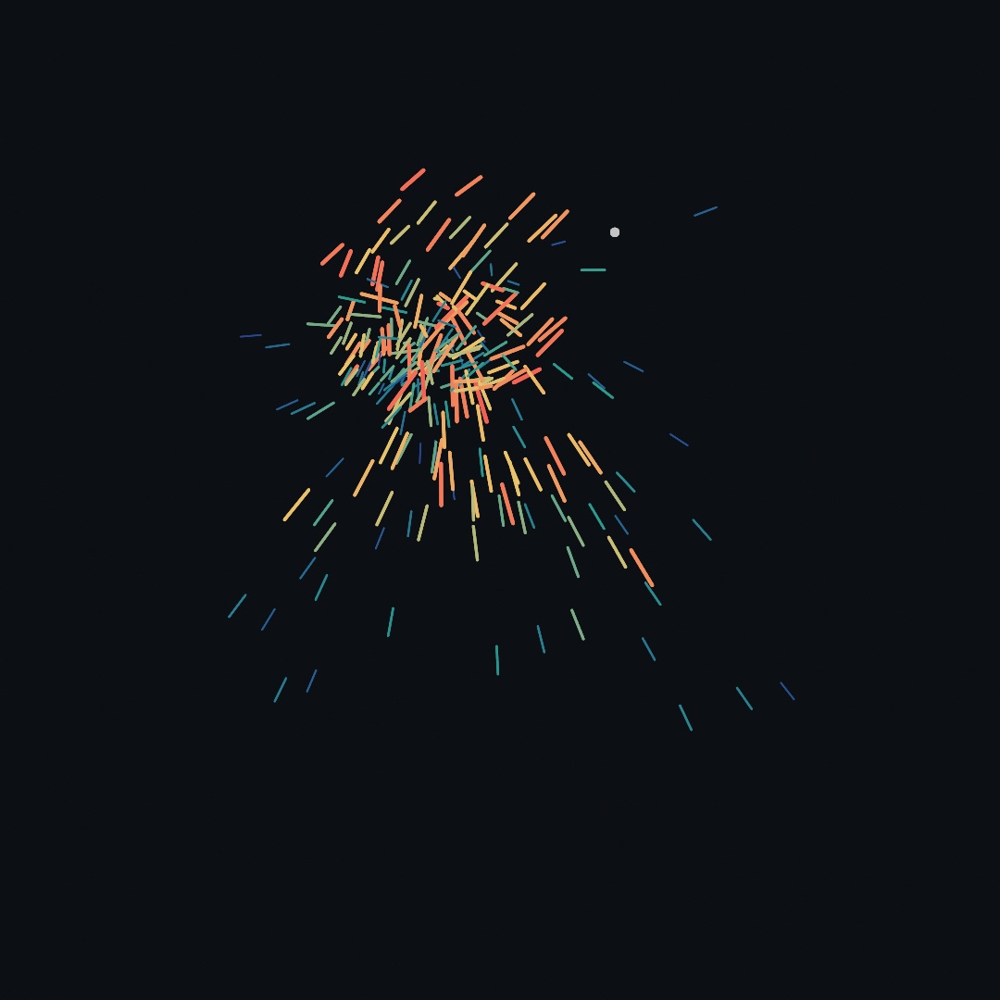
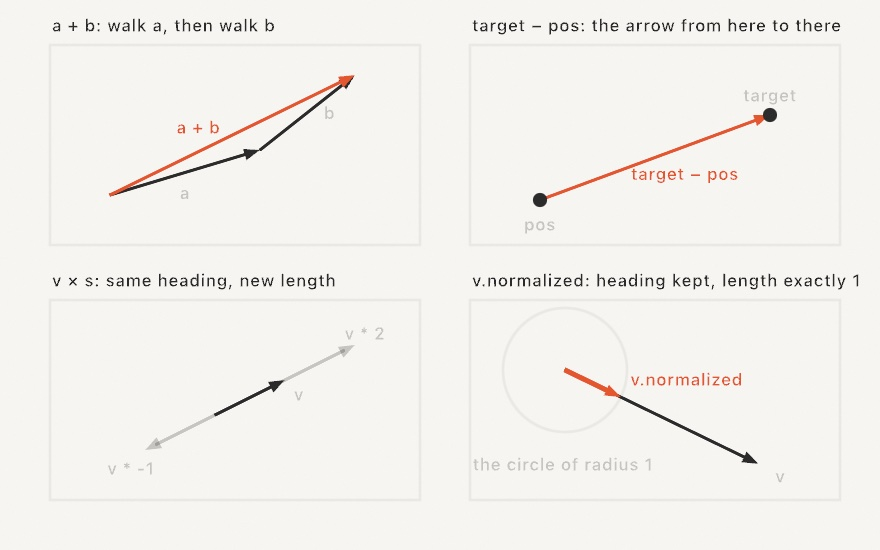
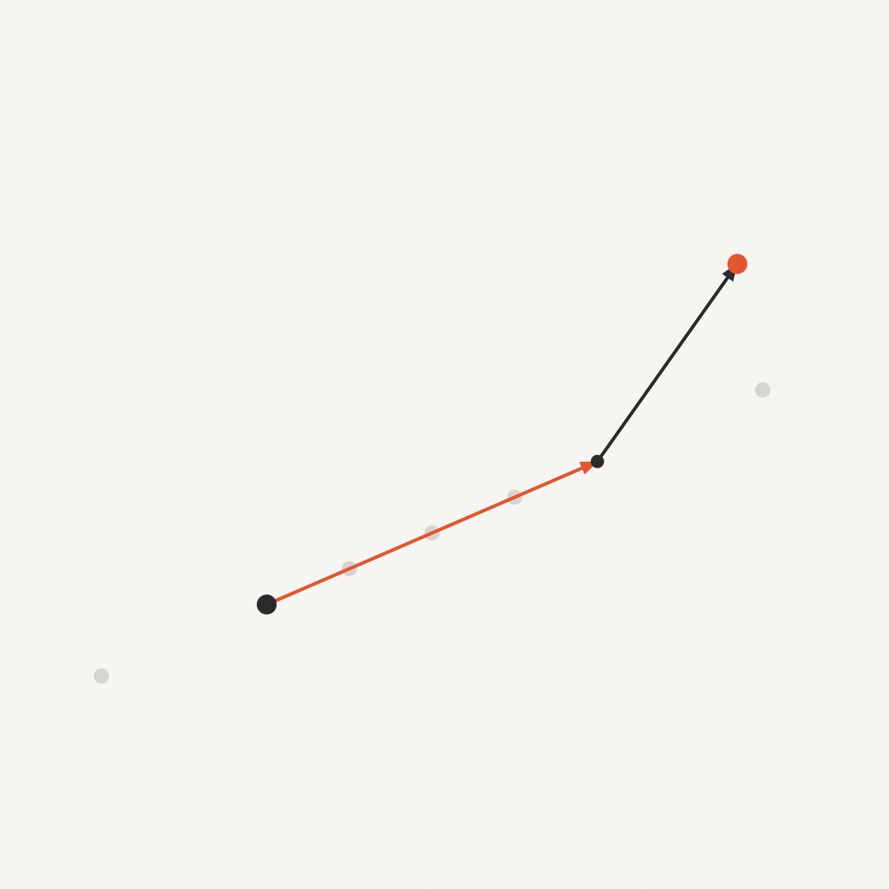
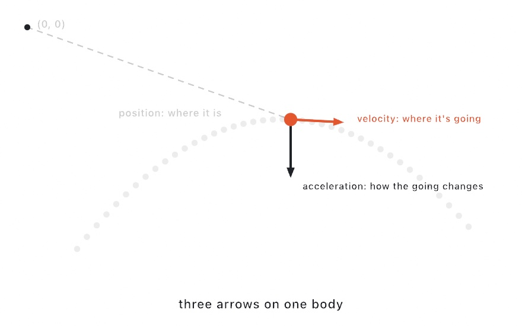
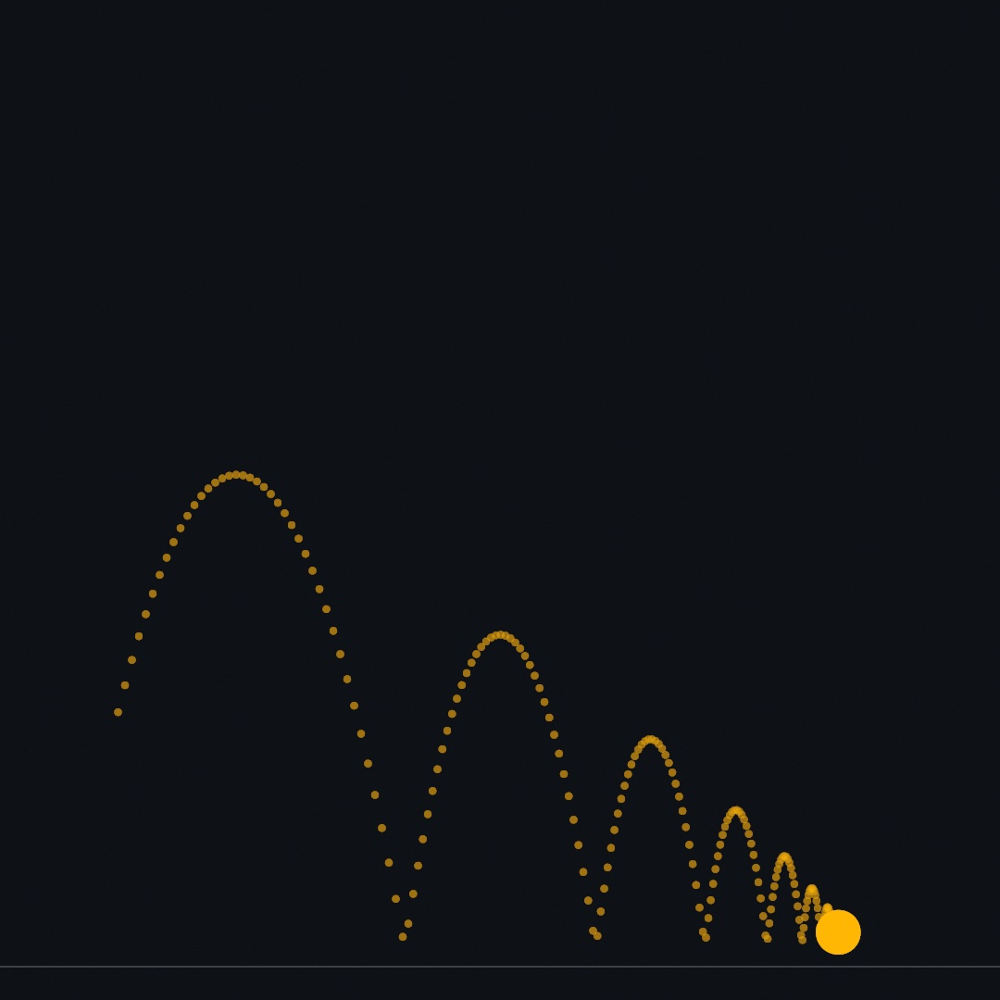
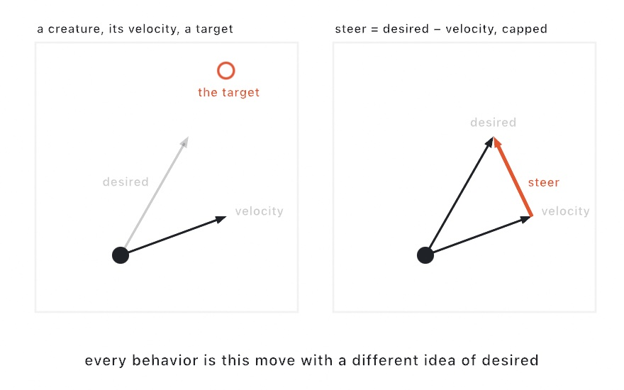
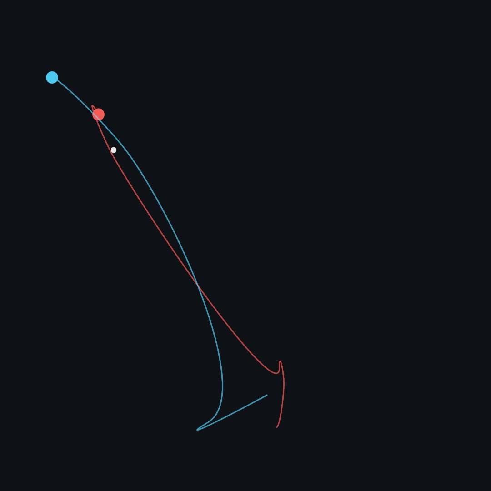

#### <sup>[Ollin](../README.md) → [Guide](README.md) → Chapter 10</sup>

---

# 10. Vectors, gently



This chapter teaches vectors: arrows you can add, subtract, scale, and point. Three arrows on one body make a thrown ball arc and bounce. A correction between two of those arrows makes a chaser steer toward a target. A few hundred chasers, each with its own top speed, make the sketch above. The swarm wheels after a wandering lure and comes to your mouse when you press. You have been using vectors since [Chapter 1](01-HelloOllin.md), as the pair of coordinates a call like `drawCircle(center:radius:)` takes. The new part is reading that pair as an arrow.

## An arrow you can draw: `Vector2`

A `Vector2` is a pair of coordinates carried as one value, and the same pair has two readings. Read `(300, 200)` as a **point** and it is a place on the canvas. Read it as a **vector** and it is an arrow: go 300 right and 200 down, from wherever you are. The type is the same, and only what you do with it changes.

```swift
let place = Vector2(300, 200)          // a point: somewhere on the canvas
let step = Vector2(4, -1)              // an arrow: a way to move
```

Everything in this chapter comes from letting the two readings work together. Points say where things are, arrows say where they are headed, and the arithmetic in the next section moves between them.

One thing follows from the two readings before any arithmetic: an arrow can be drawn as itself. `drawArrow(from: place, to: place + step)` puts a stroked shaft and a solid head on the canvas, with the tip of the head at the second point. One `stroke(...)` colors the whole mark. The listing in the next section draws its arrows with it. The cursor is one more point, `mouse`, which the listings in this chapter spell out as `Vector2(mouseX, mouseY)`.

## Arrow arithmetic: adding, subtracting, scaling, and dividing

Arrows add, subtract, and scale, and each of those has a panel in the figure. The fourth panel belongs to the section after this one:

<picture>
  <source media="(prefers-color-scheme: dark)" srcset="Images/10-Vectors/VectorArithmetic-dark.jpg">
  
</picture>

- **Adding** is walking. `a + b` means walk `a`, then walk `b` from where you ended up. The order does not matter, because you arrive at the same place.
- **Subtracting** answers the question Part II asks most often. `target - pos` is the arrow that goes from here to there. The chase later in this chapter and [Chapter 11](11-ForcesAndPhysics.md)'s springs both start with this line.
- **Scaling** multiplies by a plain number. `v * 2` is twice as far in the same direction, `v * 0.5` is half as far, and `v * -1` is the same road walked backward.
- **Dividing** by a number is scaling the other way. `v / 2` is half of `v`. It matters most for averages. `(a + b) / 2` is the point halfway between two points, and a sum of positions divided by their count is the center of a group. [Chapter 12](12-FlocksAndSwarms.md) finds the center of a boid's neighbors that way.

The pictures above can move. Make `MySketches/ArrowWalk.swift` and push them around:

```swift
import Ollin

final class ArrowWalk: Sketch {
    override func setup() {
        noiseSeed(8)
    }

    override func draw() {
        background(Color(hex: 0xF7F5F1))

        let home = Vector2(width * 0.3, height * 0.68)
        var target = Vector2(noise(time * 0.25, 3) * width,
                             noise(time * 0.25, 77) * height * 0.55)
        if mouseIsPressed { target = Vector2(mouseX, mouseY) }

        let trip = target - home            // the arrow from here to there
        let breeze = Vector2(170, -240)     // a second arrow, always the same

        // Scaling: stones along the same road, at fractions of the trip.
        noStroke()
        fill(Color(hex: 0x2B2B2B, alpha: 0.28))
        for s in [-0.5, 0.25, 0.5, 0.75, 1.5] {
            drawCircle(center: home + trip * s, radius: 9)
        }

        // The trip itself, then the breeze walked from its end.
        strokeWeight(4)
        stroke(Color(hex: 0xE4572E))
        drawArrow(from: home, to: home + trip)
        stroke(Color(hex: 0x2B2B2B))
        drawArrow(from: home + trip, to: home + trip + breeze)

        noStroke()
        fill(Color(hex: 0x2B2B2B))
        drawCircle(center: home, radius: 12)
        drawCircle(center: target, radius: 8)
        fill(Color(hex: 0xE4572E))
        drawCircle(center: home + trip + breeze, radius: 12)
    }
}
```



The orange arrow is the subtraction. It is `trip`, the arrow from `home` to the target, and it stretches and swings as the target wanders on [Chapter 5](05-Noise.md)'s noise. Hold the mouse down and you have the target. The stones are the scaling, the same trip cut to fractions, one of them negative and walking backward, one overshooting past the target. The dark arrow is the addition, `breeze` walked from wherever the trip ended. The orange dot is `home + trip + breeze`, a place named by one line of arithmetic.

Two more spellings make these read like sentences. `pos += step` moves a point by an arrow in place. And `v * deltaTime` is [Chapter 3](03-MotionAndTime.md)'s frame-rate rule applied to an arrow. You write speeds per second and scale by the frame's slice of a second.

### A point part of the way: `lerp(to:)`

Look at the stones once more, because `Vector2` has one call for them. Each stone sits at `home + trip * s`, a fraction `s` of the way from `home` to the target. That is [Chapter 3](03-MotionAndTime.md)'s `lerp` with points for its two ends, and `Vector2` spells it `home.lerp(to: target, s)`. At `0` you are at `home`, at `1` you are at the target, and `0.5` is the midpoint.

```swift
let quarter = home.lerp(to: target, 0.25)   // the second stone, in one call
```

Used every frame on a moving point, the same call becomes a soft follow. `pos = pos.lerp(to: mouse, 0.1)` moves `pos` a tenth of the remaining way toward the cursor each frame. So it glides after the mouse and slows as it arrives, with no velocity to keep. It is enough for a label that follows a shape, or a camera that follows a player. A fixed fraction per frame does move faster on a faster screen, since it runs on frames rather than on seconds. [Chapter 3](03-MotionAndTime.md)'s `@Eased` is the same kind of chase wrapped as a property. It runs on a duration you pick once, so it takes the same time on every screen.

## Length and direction: `length`, `normalized`, and `limited(to:)`

The arithmetic so far kept every arrow whole. An arrow is a direction and a distance. The next step is taking those apart, because the chase later in this chapter wants the direction on its own.

`v.length` is how long the arrow is, the straight-line distance from its tail to its head. So `velocity.length` is a thing's speed with the direction stripped away. Going the other way, `v.normalized` keeps the direction and sets the length to 1 (a zero arrow stays zero). The fourth panel of the arithmetic figure shows it landing on the circle of radius 1. A length-one arrow is a pure heading, and it exists so you can choose the distance yourself:

```swift
let toTarget = (target - pos).normalized     // just the direction
pos += toTarget * 3                          // step 3 points that way, near or far
```

That pair of lines moves toward anything, and it works at any distance because the normalize threw the distance away.

`distance(to:)` and `limited(to:)` complete the kit. `a.distance(to: b)` measures between two points (it is `(a - b).length`). And `v.limited(to: maxSpeed)` caps an arrow's length while keeping its heading. The chasers in this chapter and the flock in [Chapter 12](12-FlocksAndSwarms.md) run under these caps. A speed cannot grow without bound, and a correction cannot overshoot.

For drawing, `v.angle` is the arrow's direction as a single number, ready for [Chapter 6](06-GridsAndRepetition.md)'s `rotate`, so a shape can face where it is going. Its inverse builds an arrow from scratch with `Vector2(angle: a, length: 10)`.

## Position, velocity, acceleration

Now put arrows on a body. Three of them, each answering a different question:

<picture>
  <source media="(prefers-color-scheme: dark)" srcset="Images/10-Vectors/MotionTrio-dark.jpg">
  
</picture>

- **Position** is where it is, a point, or the arrow from `(0, 0)` if you like.
- **Velocity** is where it is going, the arrow added to position every second.
- **Acceleration** is how the going changes, the arrow added to *velocity* every second.

The chain runs one way. Acceleration changes velocity, and velocity changes position. In code that is two lines. Here they are throwing a ball. Make `MySketches/Thrown.swift`:

```swift
import Ollin

final class Thrown: Sketch {
    var position = Vector2(120, 800)
    var velocity = Vector2(150, -640)
    let gravity = Vector2(0, 700)
    var trail: [Vector2] = []

    override func draw() {
        background(Color(hex: 0x0E1116))

        velocity += gravity * deltaTime
        position += velocity * deltaTime

        // The floor: bounce, losing a little each time.
        if position.y > height - 60 {
            position = position.with(y: height - 60)
            velocity = Vector2(velocity.x * 0.7, -velocity.y * 0.82)
        }

        // Remember where the ball has been, every third frame.
        if frameCount % 3 == 0 { trail.append(position) }
        if trail.count > 200 { trail.removeFirst() }

        stroke(Color(white: 0.25))
        strokeWeight(2)
        drawLine(0, height - 36, width, height - 36)
        noStroke()
        fill(Color(hex: 0xFFB703, alpha: 0.35))
        for p in trail { drawCircle(center: p, radius: 4) }
        fill(Color(hex: 0xFFB703))
        drawCircle(center: position, radius: 24)
    }
}
```



Run it and a ball arcs across, bounces, and settles. Notice what is stored and what is not. `position` and `velocity` are properties, alive between frames, because motion with memory is stored state. It is the first time this guide writes that state by hand. `gravity` never changes, but every frame it bends `velocity` a little, and the bend is what makes the arc. The bounce is two lines. Put the ball back on the floor, then flip the vertical part of the velocity and keep less than all of it. The `0.82` is the bounciness. The floor takes a little of the sideways speed too, the `0.7`. That is friction, and it is why the ball settles instead of rolling off the edge. Both `+=` lines scale by `deltaTime`, so the throw is the same at 60 and 120 frames a second. The trail is 200 of the ball's recent positions, one every third frame, kept in a list and drawn as faint dots. It lets you see the arc after the ball has left it.

> **Swift note.** `trail` is an array, the kind [Chapter 4](04-Randomness.md) grew with `append`. `count` is how many points it holds, and `removeFirst()` drops the oldest, so the list never grows past 200. `frameCount % 3 == 0` is true on every third frame, because `%` is the remainder after dividing, from [Chapter 1](01-HelloOllin.md).

The floor was one edge policy, a bounce. The other classic one is **wrapping**: leave the right edge and come back on the left, the canvas bent into a loop. The finished sketch uses it, as four `if`s with `with(x:)` and `with(y:)`. Those two calls hand back a copy of a vector with one coordinate changed. The bounce above already used `with(y:)` to put the ball back on the floor.

## Steering: the chase

A thrown ball only obeys. To make something that *wants*, give it a target and let it correct its own course. The recipe is three lines:

```swift
let desired = (target - position).normalized * maxSpeed
let steer = (desired - velocity).limited(to: maxForce)
velocity = (velocity + steer * deltaTime).limited(to: maxSpeed)
```

In words, you work out the velocity you *wish* you had, straight at the target at full speed. Then you subtract the velocity you have, which gives the correction arrow between them. You cap that correction, because nothing with mass turns instantly, and you apply it like any other acceleration. Drawn as arrows, the move looks like this:

<picture>
  <source media="(prefers-color-scheme: dark)" srcset="Images/10-Vectors/SteeringMove-dark.jpg">
  
</picture>

The two caps are the character parameters. `maxSpeed` is how fast it can go, and `maxForce` is how sharply it can turn. A high force snaps onto the target like a fly. A low force sails past and swings back in wide arcs. The misses make the motion. The chaser overshoots because it has momentum, and the correction is visible.

Watch the two race. Make `MySketches/Chasers.swift`, two chasers with one number different between them:

```swift
import Ollin

final class Chasers: Sketch {
    var positions = [Vector2(240, 880), Vector2(840, 880)]
    var velocities = [Vector2.zero, Vector2.zero]
    var trails: [[Vector2]] = [[], []]
    let forces = [2200.0, 320.0]        // how sharply each may turn
    let tints = [Color(hex: 0xF25C54), Color(hex: 0x4CC9F0)]
    let maxSpeed = 420.0

    override func draw() {
        background(Color(hex: 0x0E1116))

        let spots = [Vector2(250, 330), Vector2(830, 380), Vector2(620, 840)]
        var lure = spots[Int(time / 4) % spots.count]
        if mouseIsPressed { lure = Vector2(mouseX, mouseY) }

        for i in positions.indices {
            let desired = (lure - positions[i]).normalized * maxSpeed
            let steer = (desired - velocities[i]).limited(to: forces[i])
            velocities[i] = (velocities[i] + steer * deltaTime).limited(to: maxSpeed)
            positions[i] += velocities[i] * deltaTime

            trails[i].append(positions[i])
            if trails[i].count > 300 { trails[i].removeFirst() }

            noFill()
            stroke(tints[i].withAlpha(0.5))
            strokeWeight(2.5)
            drawPolyline(trails[i])
            noStroke()
            fill(tints[i])
            drawCircle(center: positions[i], radius: 13)
        }

        noStroke()
        fill(Color(white: 1, alpha: 0.8))
        drawCircle(center: lure, radius: 6)
    }
}
```



Both share the lure and the top speed, and only `maxForce` differs. The coral chaser corrects hard, so each time the lure hops it turns, darts, and settles into a tight little orbit around the new spot. It never quite stops, because the recipe always asks for full speed toward the target. The small knot at the lure is what that rule looks like. The blue one can barely turn. It sails past the lure, swings back in wide arcs because it keeps its momentum, and often meets the next hop before it ever settles. Hold the mouse down and both come to you, each in its own way.

> **Swift note.** `positions.indices` counts `0..<count`, so one `i` reaches into the parallel lists together. Chaser `i`'s position, velocity, force, and tint all live at index `i`. `trails` is a list of lists, one trail per chaser, so `trails[i].append(...)` grows only chaser `i`'s. `Int(time / 4) % spots.count` turns the clock into a spot number that steps every four seconds and wraps back to `0`.

Every line of the recipe is arithmetic you already have. A subtraction points from here to there, a normalize and a scale choose the speed, and a limit keeps the turn bounded. [Chapter 12](12-FlocksAndSwarms.md) builds whole flocks from this same correction, aimed at neighbors instead of a target.

## Putting it together: the swarm

One chaser follows a lure. A few hundred, each with a top speed of its own, move like a school of fish. The sketch at the top of the chapter composes three of the steps. The chase recipe runs over parallel lists of positions and velocities. The wrap comes from the ball's section. And each mover is drawn as a streak along its own velocity, which is the first section's arithmetic, so the drawing shows the motion. Every mover gets its own top speed, so the crowd stretches into leaders and stragglers. The lure wanders on [Chapter 5](05-Noise.md)'s noise until you hold the mouse down, which hands it to you. Make `MySketches/Swarm.swift`:

```swift
import Ollin

final class Swarm: Sketch {
    @Param("Movers", 40...400) var movers = 260
    @Param("Speed", 150...800) var maxSpeed = 430.0
    @Param("Chase", 300...3000) var maxForce = 950.0

    var positions: [Vector2] = []
    var velocities: [Vector2] = []
    var quickness: [Double] = []      // a personality per mover

    let ramp = Ramp([
        Color(hex: 0x274690), Color(hex: 0x2A9D8F),
        Color(hex: 0xE9C46A), Color(hex: 0xF25C54),
    ])

    override func setup() {
        seed(9)
        strokeCap(.round)
    }

    override func draw() {
        background(Color(hex: 0x0C0F14))

        // Keep the population matched to the parameter.
        while positions.count < movers {
            positions.append(Vector2(random(width), random(height)))
            velocities.append(Vector2(angle: random(0, .tau), length: 60))
            quickness.append(random(0.55, 1.2))
        }
        if positions.count > movers {
            positions.removeLast(positions.count - movers)
            velocities.removeLast(velocities.count - movers)
            quickness.removeLast(quickness.count - movers)
        }

        // The lure wanders on noise; hold the mouse to take it over.
        var lure = Vector2(noise(time * 0.3, 3) * width,
                           noise(time * 0.3, 77) * height)
        if mouseIsPressed { lure = Vector2(mouseX, mouseY) }

        for i in positions.indices {
            // Steer: aim at the lure, compare with the current velocity,
            // and correct by a bounded amount.
            let top = maxSpeed * quickness[i]
            let desired = (lure - positions[i]).normalized * top
            let steer = (desired - velocities[i]).limited(to: maxForce)
            velocities[i] = (velocities[i] + steer * deltaTime).limited(to: top)
            positions[i] += velocities[i] * deltaTime

            // Wrap: leave one edge, come back on the other.
            var p = positions[i]
            if p.x < -20 { p = p.with(x: width + 20) }
            if p.x > width + 20 { p = p.with(x: -20) }
            if p.y < -20 { p = p.with(y: height + 20) }
            if p.y > height + 20 { p = p.with(y: -20) }
            positions[i] = p

            // A streak along the velocity, colored by personality:
            // the quick ones warm, the slow ones cool.
            let pace = map(quickness[i], 0.55, 1.2, 0, 1)
            stroke(ramp.color(at: pace))
            strokeWeight(1.5 + pace * 2.8)
            drawLine(positions[i] - velocities[i] * 0.11, positions[i])
        }

        noStroke()
        fill(Color(white: 1, alpha: 0.55))
        drawCircle(center: lure, radius: 5)
    }
}
```

Run it with `swift run OllinLive MySketches/Swarm.swift`, watch the school wheel after the wandering dot, then press and drag, and the swarm follows you. Take it apart:

- The state is three parallel lists: mover `i`'s position, velocity, and personality live at index `i` of each. The `while` and `if` at the top keep the lists matched to the `Movers` parameter, so you can add and remove movers while it runs. `while` repeats its body as long as its condition holds, so it appends until the count matches. `removeLast(n)` drops the last `n` entries of a list.
- `quickness` is one seeded roll per mover, and it does more than any other line for the feel. Everyone runs the same rules at a different top speed, so the crowd stretches into warm leaders and cool stragglers. The streak color reads straight from it.
- The steering block is the chase recipe from *Steering: the chase*, aimed at `lure`. Turn `Chase` down and the school swings in long arcs past the dot. Turn it up and the swarm snaps tight around it.
- Each mover draws as a `drawLine` from a little behind itself (`- velocities[i] * 0.11`) to where it is. That is a streak that grows with speed and points where it is going, with no rotation math needed.
- The wrap is the ball's edge policy, four `if`s with `with(x:)` and `with(y:)`. The margin of 20 lets a mover leave the frame before it comes back on the other side.
- The lure is two `noise` calls on far-apart rows of the field, [Chapter 5](05-Noise.md)'s way of getting two unrelated drifts. `mouseIsPressed` swaps it for your cursor.

Then make it yours:

- Give the swarm fear instead of hunger: `let desired = (positions[i] - lure).normalized * top` flees the lure. Keep the wrap and it becomes a shoal you push through.
- Add a second lure and steer each mover at whichever is closer (`distance(to:)` decides). The school tears itself in half and re-forms.
- Draw dots at each head (`drawCircle(center:radius:)`, radius by `pace`) for plankton, or lengthen the streaks to `* 0.25` for rain.
- Ease the caps. `Speed` low with `Chase` high moves like gnats, and both low is deep-sea slow.

A swarm is motion, so keep it as a few seconds of video rather than a still:

```sh
swift run OllinLive MySketches/Swarm.swift --export-video swarm.mp4 --seconds 6
```

## Where this comes from

Vectors are the physics notation the 1880s settled on, mostly at the hands of Josiah Willard Gibbs and Oliver Heaviside. Position, velocity, and acceleration as arrows is Newton's mechanics written in that notation. The steering recipe, desired minus actual and capped, is Craig Reynolds' *steering behaviors*, from his 1999 paper "Steering Behaviors for Autonomous Characters". That paper generalizes the rules of his 1987 boids, which [Chapter 12](12-FlocksAndSwarms.md) builds. The teaching order of this chapter, arrows first, then the trio, then steering, follows Daniel Shiffman's *The Nature of Code*. That book made this progression the usual way into the subject. Full credits are in the project's [attribution notes](../ATTRIBUTION.md).

## Go deeper

- [Geometry](../Docs/Drawing/Geometry.md#vector): the full vector tour, with a picture per operation, including the ones this chapter saved for later: `dot` (same way or opposite?), `cross` (which side?), `rotated(by:around:)`, and `projected(onto:)`. `dot` and `projected(onto:)` are the shared `Vector` surface and read the same for `Vector3`; `cross` and `rotated` are `Vector2`'s own.
- [Drawing](../Docs/Drawing/Drawing.md#arrow): `drawArrow` and its head measurements, beside the other primitives.
- [Math helpers](../Docs/Helpers/Math.md): `map`, `dist`, and the scalar kit the vector calls sit beside.
- [Complex numbers](../Docs/Helpers/Complex.md): a `Vector2` that knows how to multiply. Adding is the same as here; multiplying turns, which [Chapter 22](22-IteratedForms.md#multiplying-turns-the-complex-plane) iterates and paints.
- [Values and bare calls](../Docs/Concepts/Values.md): one screen on why every call takes both bare numbers and a typed value, and what the value gives you that the numbers cannot.
- Appendix B draws this chapter's math, one picture per idea: [Vectors, motion, and forces](B-JustEnoughMath.md#vectors-motion-and-forces).
- Worked examples, in [`Examples/Motion/`](../Examples/Motion/): `Orbits` (the angle-and-radius reading), `Easing` (four dots racing the same flip on four curves), and `Smoothing` (a chased value with a filter instead of physics); plus [`Examples/Shapes/Arrows`](../Examples/Shapes/Arrows/Sketch.swift), a field of `drawArrow` marks leaning toward the cursor with the head geometry swept around a ring.
- A look ahead: [`Examples/Patterns/Flocking`](../Examples/Patterns/Flocking/Sketch.swift) runs this chapter's correction three ways at once, and [Chapter 12](12-FlocksAndSwarms.md) takes it apart.
- The Gego homage [`DrawingWithoutPaper`](../Examples/Recreations/Gego/DrawingWithoutPaper/Sketch.swift): a projection worked out in two lines of vector arithmetic. Each bit of wire hangs a known distance off the wall. Where the ray from the lamp through it meets the wall is its shadow, and the shadows are the whole of the picture.

---

[Contents](README.md#contents) · Previous: [Chapter 9, Pictures and data](09-Pictures.md) · Next: [Chapter 11, Forces and physics](11-ForcesAndPhysics.md)
