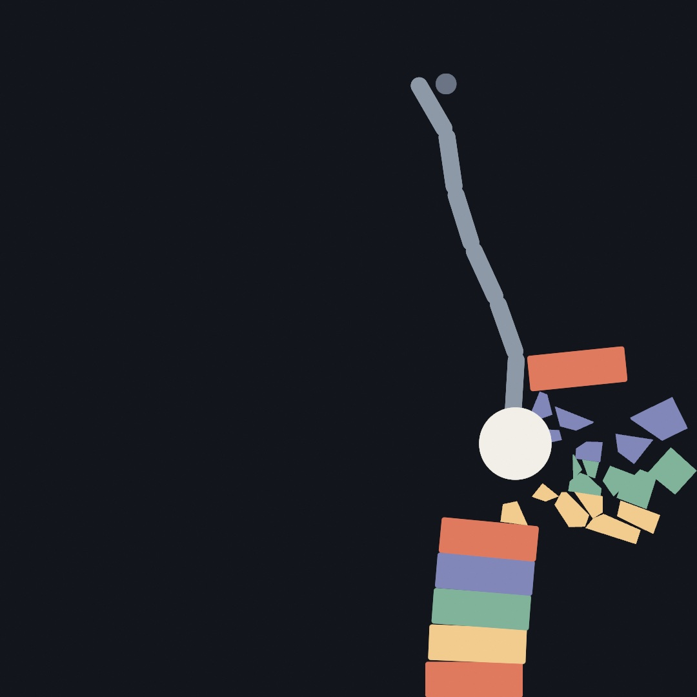
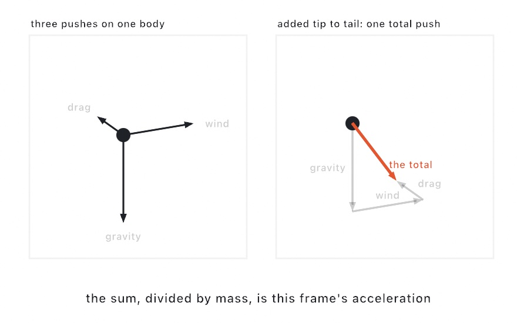
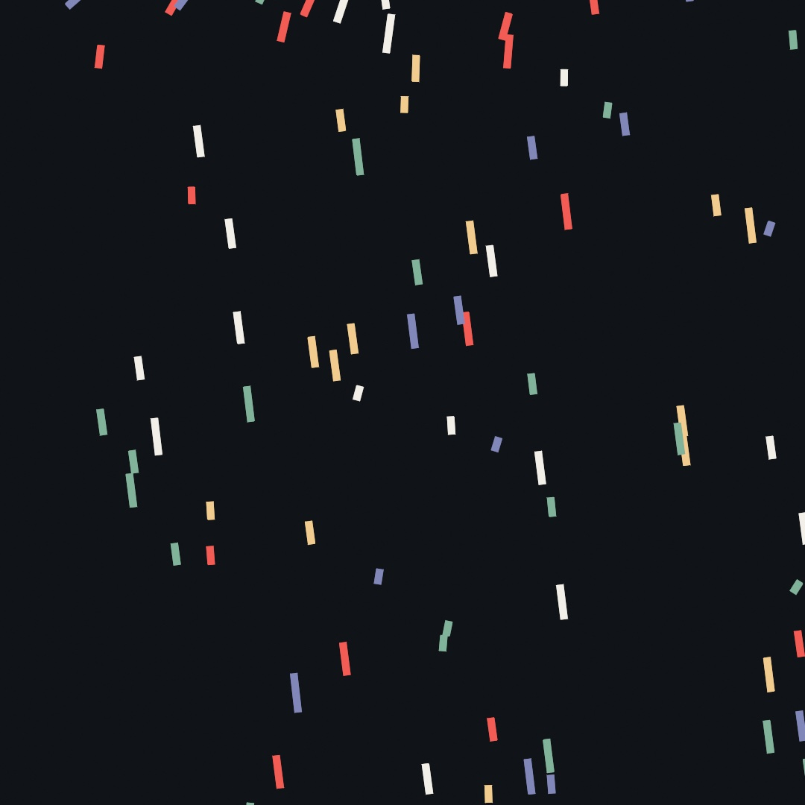
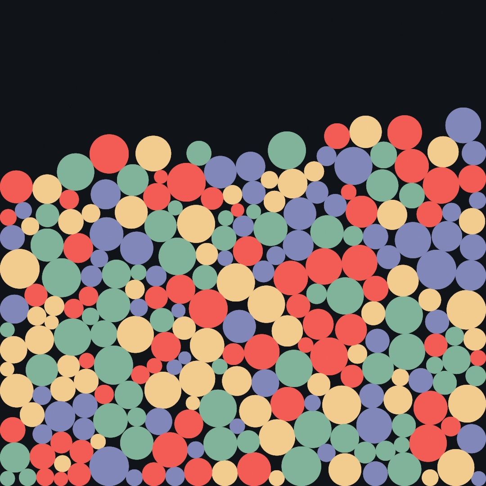
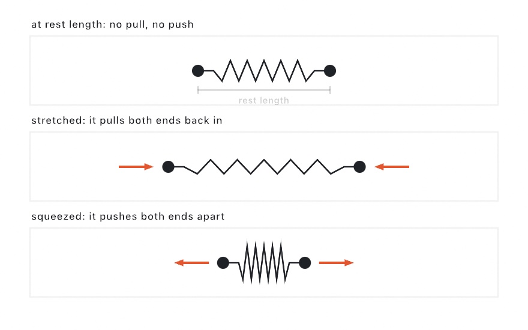
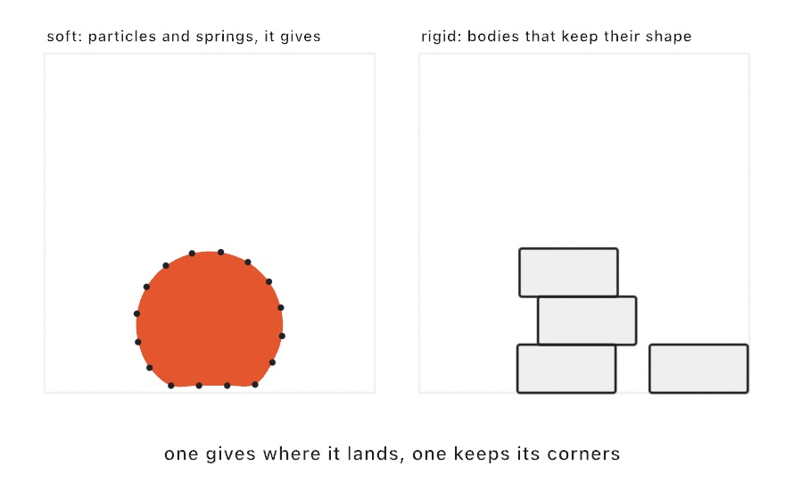
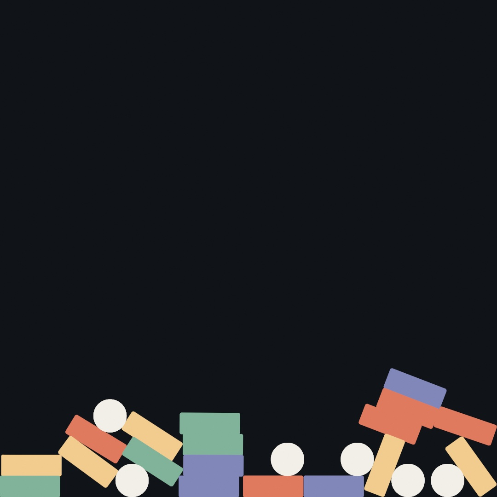
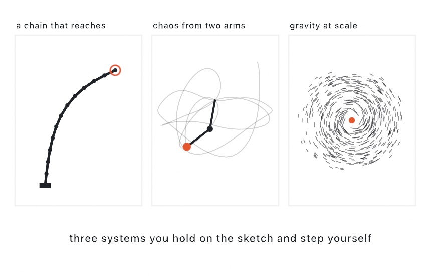
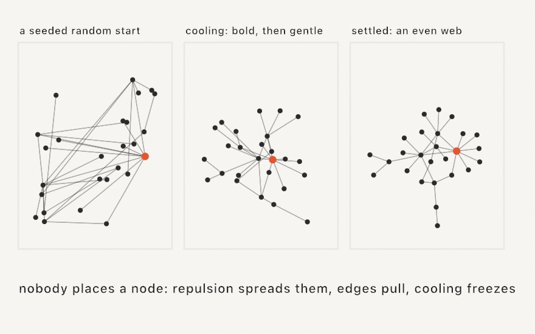

#### <sup>[Ollin](../README.md) → [Guide](README.md) → Chapter 11</sup>

---

# 11. Forces and physics



Things in the world fall, drift, and swing because forces push on them, and a sketch can push its shapes the same way. This chapter writes gravity, wind, and drag by hand, then hands the job to a physics world of bodies, springs, hinges, and pieces that break. It ends on the wrecking ball above, and you get to knock the tower down yourself. After it, a limb reaches, gravity works at the scale of a galaxy, and a graph lays itself out, all without a world.

## A force is a push: adding forces and dividing by mass

The bouncing ball in [Chapter 10](10-Vectors.md) ran on two lines:

```swift
velocity += gravity * deltaTime
position += velocity * deltaTime
```

That `gravity` was an acceleration, a fixed change to the velocity every second. It worked because only one thing was pushing. Most motion has several pushes going at once. Wind shoves from the side. Drag, the air resisting motion, pushes back against it. Gravity never stops. Each of these is a **force**, a push with a strength and a direction, which is to say a vector.

When several forces act on a body in the same frame, combining them takes no new math. You add the arrows, the same tip-to-tail walk from the last chapter:

<picture>
  <source media="(prefers-color-scheme: dark)" srcset="Images/11-ForcesAndPhysics/ForceAccumulation-dark.jpg">
  
</picture>

**Acceleration is force divided by mass.** So the sum above is not an acceleration yet, because mass sits in between. The same shove that sends a ping-pong ball flying barely moves a bowling ball. In code, the pattern is to gather the frame's forces into one vector, divide once, and then carry on as before:

```swift
var force = Vector2(0, 340) * mass     // gravity
force += Vector2(gust, 0)              // wind
force += velocity * -2.2               // drag pushes against the motion
let acceleration = force / mass

velocity += acceleration * deltaTime
position += velocity * deltaTime
```

Two of those force lines need a second look. Gravity is written `* mass` because the pull of the earth is stronger on heavier things, in proportion to their mass. Divide by mass a moment later and it cancels out. That is why a hammer and a feather fall at the same rate in a vacuum. Drag is the reason they don't fall at the same rate in air. It grows with speed, it points backward along the velocity, and it does not care about mass. So after the division it slows a light body much more than a heavy one. A feather drifts because drag wins early. A hammer plummets because drag barely slows it.

You can watch all of this at once. Make `MySketches/Confetti.swift`:

```swift
import Ollin

final class Confetti: Sketch {
    var positions: [Vector2] = []
    var velocities: [Vector2] = []
    var masses: [Double] = []

    let palette = [
        Color(hex: 0xF25C54), Color(hex: 0xF2CC8F),
        Color(hex: 0x81B29A), Color(hex: 0x8187B9), Color(hex: 0xF2EFE8),
    ]

    override func setup() {
        seed(7)
        for _ in 0 ..< 210 {
            positions.append(Vector2(random(width), random(-1600, height)))
            velocities.append(.zero)
            masses.append(random(1, 6))
        }
        noStroke()
    }

    override func draw() {
        background(Color(hex: 0x101318))
        let gust = signedNoise(time * 0.5) * 3800    // one wind, shared by all

        for i in positions.indices {
            // Gather this frame's pushes, then let mass decide their effect.
            var force = Vector2(0, 340) * masses[i]      // gravity
            force += Vector2(gust, 0)                    // wind
            force += velocities[i] * -2.2                // drag, against motion
            let acceleration = force / masses[i]

            velocities[i] += acceleration * deltaTime
            positions[i] += velocities[i] * deltaTime

            // A piece that leaves the bottom rejoins the shower at the top.
            if positions[i].y > height + 30 {
                positions[i] = Vector2(random(width), -30)
                velocities[i] = .zero
            }

            withState {
                translate(positions[i])
                rotate(velocities[i].angle)
                fill(palette[i % palette.count])
                drawRect(center: .zero, width: 10 + masses[i] * 7, height: 9)
            }
        }
    }
}
```



The state is [Chapter 10](10-Vectors.md)'s parallel lists again, with one addition. Every piece gets its own `mass`, and its drawn length comes from it, so you can tell them apart. The wind is a single `signedNoise` value shared by the whole shower, wandering the way [Chapter 5](05-Noise.md)'s noise wanders. Run it and watch what mass does. When a gust arrives, the small pieces get thrown almost sideways while the long ones sway a little and keep plowing downward. The code treats every piece the same. The same three forces act on all of them, and the one division by mass makes the light ones flighty and the heavy ones stubborn. Each piece also draws itself rotated to its own velocity (`rotate(velocities[i].angle)`, from [Chapter 10](10-Vectors.md)), so when the wind leans, the whole shower leans with it.

## A world that pushes back: `World` and particles

There is a limit to how far you can take this by hand. It arrives the moment things need to push back on *each other*. Two balls bouncing off each other is an afternoon of careful code. Two hundred piling into a heap, each resting on its neighbors, is a solver, and writing one is its own project. This is what a physics engine is for, and Ollin ships one.

Physics lives in its own library, so a sketch that doesn't need it doesn't carry it. Reaching it takes one new line at the top of the file:

```swift
import Ollin
import OllinPhysics
```

The library gives you a `World`, a container you drop bodies into and step forward once a frame. You set its rules, meaning gravity, walls, and whether bodies collide, and it does the rest. Make `MySketches/Pile.swift`:

```swift
import Ollin
import OllinPhysics

final class Pile: Sketch {
    let world = World()

    let palette = [
        Color(hex: 0xF25C54), Color(hex: 0xF2CC8F),
        Color(hex: 0x81B29A), Color(hex: 0x8187B9),
    ]

    override func setup() {
        seed(11)
        world.bounds = bounds
        world.particlesCollide = true
        for _ in 0 ..< 240 {
            world.addParticle(at: Vector2(random(width), random(height * 0.55)),
                              radius: random(14, 44))
        }
        noStroke()
    }

    override func draw() {
        background(Color(hex: 0x101318))
        world.advance(by: deltaTime)

        for i in world.particles.indices {
            let p = world.particles[i]
            fill(palette[i % palette.count])
            drawCircle(center: p.position, radius: p.radius)
        }
    }
}
```



Two hundred forty discs fall, land on each other, shuffle for space, and settle into the heap above, like gumballs in a jar. The sketch never mentions a collision. It scatters particles in `setup()`, and in `draw()` it does two things. It steps the world, then draws what's there.

The shape of every `World` sketch in this chapter is in those few lines. Build the world once in `setup()`. Each frame, `advance(by: deltaTime)` moves it on, and you draw from its bodies wherever they happen to be.

The rules you set at the top are each one line. `world.bounds = bounds` gives the world walls, and without it bodies are free to leave. `bounds` is the whole canvas as a `Rectangle`, one of the sketch's built-in properties, which [Chapter 7](07-Tiles.md) introduced. `particlesCollide = true` makes particles push each other apart as solid disks. It's off by default because plenty of things you'll build, a cloth, a chain, don't want their own points colliding. There's also `world.gravity`, which you'll change in a moment. `world.restitution` is how much speed survives hitting a wall. `world.drag` is the same air resistance you wrote by hand a page ago, now built in.

> **Swift note.** `World` is a class, and so are the bodies in it. Where the values you've used so far are copied on assignment, a class value is a *handle to one live thing*. `world.addParticle(...)` returns a handle to the particle it just added, and the world keeps moving that same particle under you every step. Hold onto the handle and you can read its position each frame, or pin it, or pull it around. A simulation object is one thing that changes, and that is the point of it.

## Springs: `connect`, rest length, and `pin`

A particle on its own just falls. The structures start when you connect two:

```swift
let s = world.connect(a, b)
```

A `Spring` tries to hold its two particles at one fixed distance, its **rest length**. Leave the length out, as above, and it adopts whatever distance the pair had when you connected them. From then on the rule is the one in the picture:

<picture>
  <source media="(prefers-color-scheme: dark)" srcset="Images/11-ForcesAndPhysics/SpringRestLength-dark.jpg">
  
</picture>

Stretched, it pulls its ends back in. Squeezed, it pushes them apart. At rest length it does nothing at all. A `stiffness` between 0 and 1 sets how sharply it corrects. At `1` the link behaves like a rigid stick, and lower values stretch and recoil like elastic.

One more tool and you can build something. Any particle can be **pinned**, and `p.pin()` freezes it in place, so everything attached still pulls on it, it just doesn't move. A pinned particle is the nail in the wall. Chain a line of particles to one and you have something to hang. Make `MySketches/Strand.swift`:

```swift
import Ollin
import OllinPhysics

final class Strand: Sketch {
    let world = World()
    var beads: [Particle] = []

    override func setup() {
        world.gravity = Vector2(0, 1600)
        for i in 0 ..< 15 {
            let bead = world.addParticle(at: Vector2(width / 2 + Double(i) * 16,
                                                     140 + Double(i) * 42))
            beads.append(bead)
        }
        beads[0].pin()
        for i in 1 ..< beads.count {
            world.connect(beads[i - 1], beads[i], stiffness: 0.9)
        }
    }

    override func draw() {
        background(Color(hex: 0x101318))

        if mouseIsPressed {
            beads.last?.place(at: Vector2(mouseX, mouseY))
        }
        world.advance(by: deltaTime)

        stroke(Color(hex: 0x8E99A8))
        strokeWeight(5)
        drawPolyline(beads.map(\.position))
        noStroke()
        fill(Color(hex: 0xF2CC8F))
        for bead in beads {
            drawCircle(center: bead.position, radius: 9)
        }
    }
}
```

Fifteen beads, each connected to the one before, the first pinned. The strand starts laid out on a diagonal, so on launch it swings down and sways until the built-in drag calms it. Hold the mouse anywhere and the last bead sticks to your cursor, so you can drag, let go, and watch the whole strand whip. That's a rope in under forty lines, and nothing in `draw()` knows anything about ropes.

`place(at:)` is the right way to move a particle by hand. The reason is in how this world moves things. A particle here doesn't store a velocity. It remembers where it was last frame, and the gap between then and now *is* its velocity. This style of simulation is called Verlet integration, and it's a big part of why springs and piles hold together so calmly here. But it means "just set the position" would secretly also set a velocity, because you'd be widening that gap. `place(at:)` moves the particle *and* its memory together, so the bead lands at your cursor without picking up any speed from the move. If you do want to throw a particle, `p.push(_:)` does that.

> **Swift note.** `beads.last` is an optional, because a list might be empty and have no last element. The `?.` after it is [Chapter 9](09-Pictures.md)'s optional chaining: if the value is there, do this, and if not, quietly do nothing. And `beads.map(\.position)` builds a new list by pulling one property out of every element, with the key path [Chapter 7](07-Tiles.md) introduced. Fifteen particles go in and fifteen positions come out, ready for `drawPolyline`.

Springs plus pins go a long way. A grid of particles with springs to their neighbors is cloth. A ring of particles with springs around the rim and spokes to a hub is a squishy blob. The [Physics documentation](../Docs/Simulation/Physics.md#soft-bodies) builds that blob in twenty lines.

## Rigid bodies: `Body` and colliders

Everything so far, particles and the springs between them, is **soft**. A particle is a point. It has no corners, no orientation, nothing to tip over. Structures made from particles bend and squash, which is what you want for ropes and jellies and wrong for a brick. Drop a soft body and a few rigid ones and the difference is plain:

<picture>
  <source media="(prefers-color-scheme: dark)" srcset="Images/11-ForcesAndPhysics/SoftVsRigid-dark.jpg">
  
</picture>

For bricks, the same `World` holds a second kind of body. A `Body` is rigid. It has a shape with corners and an angle, so it rotates, tips, and rests in stable stacks. You add one with a shape called a **collider**, and the collider can be a `.circle(radius:)`, a `.box(width:height:)`, a `.capsule(from:to:radius:)`, or a convex `.polygon([...])`. A body also takes three numbers. `friction` is surface grip from 0 to 1, `density` sets how heavy it is for its size, and `restitution` is its bounciness. Make `MySketches/Tumble.swift` and drop a few of each:

```swift
import Ollin
import OllinPhysics

final class Tumble: Sketch {
    let world = World()
    var boxes: [Body] = []
    var discs: [Body] = []
    let boxSize = Vector2(130, 46)
    let discRadius = 36.0

    let palette = [
        Color(hex: 0xE07A5F), Color(hex: 0xF2CC8F),
        Color(hex: 0x81B29A), Color(hex: 0x8187B9),
    ]

    override func setup() {
        seed(5)
        world.gravity = Vector2(0, 2200)
        world.bounds = bounds
        for i in 0 ..< 24 {
            let start = Vector2(90 + Double(i % 6) * 180, 80 + Double(i / 6) * 150)
            if i % 4 == 3 {
                discs.append(world.addBody(.circle(radius: discRadius), at: start, friction: 0.5))
            } else {
                let box = world.addBody(.box(width: boxSize.x, height: boxSize.y),
                                        at: start, friction: 0.6)
                box.angle = random(0, .tau)
                boxes.append(box)
            }
        }
        noStroke()
    }

    override func draw() {
        background(Color(hex: 0x101318))
        world.advance(by: deltaTime)

        for (i, box) in boxes.enumerated() {
            withState {
                translate(box.position)
                rotate(box.angle)
                fill(palette[i % palette.count])
                drawRect(center: .zero, width: boxSize.x, height: boxSize.y,
                         cornerRadius: 4)
            }
        }
        fill(Color(hex: 0xF2EFE8))
        for disc in discs {
            drawCircle(center: disc.position, radius: discRadius)
        }
    }
}
```



Twenty-four bodies start in a loose grid, each box turned to a random angle, and fall. They land on their corners, tip over, slide off each other, and come to rest in a jumble that keeps every corner. The world is the same one that piled the discs, with the same `bounds` for walls and the same `advance(by:)` each frame. A particle only had a position, and a body has a `position` *and* an `angle`. So drawing one takes the transform tools from [Chapter 6](06-GridsAndRepetition.md): move to the body, turn to its angle, and draw the shape centered on zero. When a box tumbles, the rectangle you draw tumbles with it, because the rotation is the simulation's own. The discs need no turn, since a circle looks the same at every angle. The world does not remember what a body looks like, only its shape for collisions. So the sketch keeps its boxes and discs in two lists of its own and draws each list its own way.

The rigid side of the world is not Ollin's own. It is [Box2D](https://box2d.org), Erin Catto's engine, which has run nearly two decades of 2D games. It is bundled inside `OllinPhysics` and wrapped so you never see it directly. Stable stacking is hard to write from scratch, and standing on Box2D is what lets a tower of nine bricks stand still.

## Hinges and a handle: `.revolute` and `grab`

Rigid bodies connect too, but not with springs. They use **joints**, and the one this chapter needs is the hinge:

```swift
world.connect(previous, body, .revolute(at: hinge))
```

A `.revolute` joint pins two bodies together at one point and lets them rotate freely around it, like a door hinge or a knee. Chain several in a row and you get a chain. The other kinds, sliders, welds, and rods, are in the [documentation](../Docs/Simulation/Physics.md#rigid-bodies), and one hinge is enough for this chapter.

The last tool is the mouse. The world can tie any body to a point you control:

```swift
held = world.grab(body, at: cursor)     // start dragging
held?.target = Vector2(mouseX, mouseY)  // each frame: pull toward the cursor
held?.remove()                          // let go
```

`grab` returns a `Joint` handle. While it exists, the body is dragged toward its `target` like a puppet on a short string, pushing and toppling whatever stands in the way. Call `remove()` and the body is free again, keeping whatever speed you flung it with. It is a *pull* rather than a teleport. Grabbing a link mid-chain drags the rest of the chain along behind it, still obeying its hinges.

## Breaking things

Every body the world has moved so far stays in one piece. It does not have to. `fractured(into:seed:)` cuts a `Shape` into pieces that fit back together, with no gap between them and no overlap. Each piece is a shape like any other. The cut is a Voronoi diagram of a few seeds scattered inside the outline. That is why every piece comes out convex, and convex is what a rigid body wants. [Chapter 15](15-ShapesAsMaterial.md) draws the Voronoi diagram on its own, and here it is only the cut.

Pass a point and the seeds crowd around it:

```swift
let pieces = outline.fractured(into: 11, around: hit, seed: 4)
```

You get small chips at the point of impact and long wedges away from it, which is what a break looks like.

Turning a piece into a body takes three lines, and they are the same three every time. A body's outline lives in the body's own coordinates, around its origin. So the piece moves onto its `centroid` first, and the solver gets what is left. `mapPoints` runs a closure over every point of the shape and hands back the moved shape:

```swift
let middle = piece.centroid
let local = piece.mapPoints { $0 - middle }
let shard = world.addBody(.polygon(local.contours[0].points), at: here + middle)
```

The listings below write the third line with a `guard let`. A shape's `contours.first` is an optional, and a shape with no contour has nothing to add. Here is the whole idea in one sketch. A disc is thrown up the canvas, and at the top of its arc, where it is on its way down again, it lets go. Make `MySketches/Break.swift`:

```swift
import Ollin
import OllinPhysics

final class Break: Sketch {
    let world = World()

    /// What a body draws as: its outline in its own coordinates and its color.
    /// A whole shape is the only kind that breaks.
    final class Look {
        let shape: Shape
        let color: Color
        let whole: Bool
        init(_ shape: Shape, _ color: Color, whole: Bool = false) {
            self.shape = shape
            self.color = color
            self.whole = whole
        }
    }

    override func setup() {
        seed(4)
        world.gravity = Vector2(0, 2200)
        noStroke()

        let outline = (0 ..< 40).map { Vector2(angle: Double($0) / 40 * .tau, length: 170) }
        let thrown = world.addBody(.circle(radius: 170), at: Vector2(width / 2, height + 220))
        thrown.velocity = Vector2(0, -1750)
        thrown.userData = Look(Shape(outline), Color(hex: 0xF2A93B), whole: true)
    }

    /// Break one body into pieces, each piece a body of its own.
    func burst(_ body: Body, _ look: Look) {
        let here = body.position
        let motion = body.velocity
        let impact = Vector2(random(-60, 60), random(-60, 60))
        let pieces = look.shape.fractured(into: 11, around: impact, seed: 4)
        world.remove(body)

        for piece in pieces {
            let middle = piece.centroid
            let local = piece.mapPoints { $0 - middle }
            guard let corners = local.contours.first?.points else { continue }
            let shard = world.addBody(.polygon(corners), at: here + middle)
            shard.velocity = motion + (middle - impact).normalized * 300
            shard.angularVelocity = random(-6, 6)
            shard.userData = Look(local, look.color.mixed(with: .white, random(0, 0.2)))
        }
    }

    override func draw() {
        background(Color(hex: 0x14161C))
        world.advance(by: deltaTime)

        // At the top of the arc it is on its way down, and that is when it goes.
        for body in world.bodies {
            guard let look = body.userData as? Look, look.whole else { continue }
            if body.velocity.y >= 0 { burst(body, look) }
        }

        for body in world.bodies {
            guard let look = body.userData as? Look else { continue }
            withState {
                translate(body.position)
                rotate(body.angle)
                fill(look.color)
                drawShape(look.shape)
            }
        }
    }
}
```


The pieces inherit the motion of the thing they came from, which is what makes it read as a break. Each one leaves with the parent's velocity plus a push away from the break, so the cloud keeps travelling while it spreads. Take the push away and the pieces fall straight down together, still in the shape of the disc. That reads as a shape dissolving rather than a shape breaking.

> **Swift note.** `Look` is a class of your own, nested inside the sketch, with an `init` that fills its three fields from its arguments. `self.shape` is the field and `shape` the argument, which is how Swift tells them apart when they share a name. The `///` above it is a comment that documents the declaration below it. `mixed(with:_:)` is [Chapter 2](02-Color.md)'s `Color.mix` as a method on the first color. A body's `userData` holds any value you like, so the sketch stores a `Look` there. `body.userData as? Look` asks for it back. The `as?` hands back the `Look` if that is what is stored, and `nil` if not. The `guard` then reads two conditions in a row, the cast and `look.whole`, and `continue` skips to the next body when either fails.

Try this:

- Raise the piece count to 40. The break turns to gravel, and the small pieces tumble faster than the big ones because the solver gives them less inertia.
- Move the impact point to the edge of the disc (`Vector2(150, 0)`) and the break reads as a strike off one side.
- Break the pieces again on a second collision, and you have a crack that runs.

## Putting it together: the wrecking ball

This is where the chapter's steps come together. The sketch composes four of the steps. The tower is rigid bodies. The chain is hinged links with a heavy ball at the end. A grab lets you swing it yourself. And the bricks the ball hits hard break the way the disc did. The chain starts hoisted up to one side, so the first demolition runs on its own. After that it's your turn. Hold the mouse near the ball to take it, drag, release to fling, and press space for a fresh tower. Make `MySketches/Wrecker.swift`:

```swift
import Ollin
import OllinPhysics

final class Wrecker: Sketch {
    let world = World()

    struct Shard { let body: Body; let shape: Shape; let color: Color }

    var bricks: [Body] = []
    var shards: [Shard] = []
    var links: [Body] = []
    var ball: Body?
    var held: Joint?
    var anchor = Vector2.zero

    let brickSize = Vector2(150, 54)
    let ballRadius = 56.0
    let linkStep = Vector2(angle: .pi / 2 + 1.65, length: 91)   // up and to the left
    let rows = [
        Color(hex: 0xE07A5F), Color(hex: 0xF2CC8F),
        Color(hex: 0x81B29A), Color(hex: 0x8187B9),
    ]

    override func setup() {
        world.gravity = Vector2(0, 2600)
        world.restitution = 0.05
        world.bounds = bounds
        build()
        strokeCap(.round)
    }

    func build() {
        bricks.removeAll()
        shards.removeAll()
        links.removeAll()

        // The tower: a single column of bricks standing on the floor.
        for row in 0 ..< 9 {
            let y = height - 20 - (Double(row) + 0.5) * (brickSize.y + 2)
            let brick = world.addBody(.box(width: brickSize.x, height: brickSize.y),
                                      at: Vector2(width * 0.68, y), friction: 0.6)
            brick.userData = rows[row % rows.count]
            bricks.append(brick)
        }

        // The chain: a fixed peg, six links hinged end to end, then the ball.
        anchor = Vector2(width * 0.64, 130)
        let peg = world.addBody(.circle(radius: 12), at: anchor, kind: .static)
        let half = linkStep * 0.42

        var previous = peg
        for i in 1 ... 7 {
            let center = anchor + linkStep * Double(i)
            let hinge = anchor + linkStep * (Double(i) - 0.5)
            let body: Body
            if i == 7 {
                body = world.addBody(.circle(radius: ballRadius), at: center, density: 5)
                ball = body
            } else {
                body = world.addBody(.capsule(from: -half, to: half, radius: 13),
                                     at: center)
                links.append(body)
            }
            world.connect(previous, body, .revolute(at: hinge))
            previous = body
        }
    }

    /// Break one brick where it was hit, into pieces that carry on with it.
    func shatter(_ i: Int, at hit: Vector2) {
        let brick = bricks.remove(at: i)
        let w = brickSize.x / 2, h = brickSize.y / 2
        let outline = Shape([Vector2(-w, -h), Vector2(w, -h), Vector2(w, h), Vector2(-w, h)])
        for piece in outline.fractured(into: 6, around: hit, seed: bricks.count) {
            let middle = piece.centroid
            let local = piece.mapPoints { $0 - middle }
            guard let corners = local.contours.first?.points else { continue }
            let body = world.addBody(.polygon(corners),
                                     at: brick.position + middle.rotated(by: brick.angle),
                                     friction: 0.6)
            body.angle = brick.angle
            body.velocity = brick.velocity + (middle - hit).normalized * 250
            shards.append(Shard(body: body, shape: local, color: brick.userData as? Color ?? .white))
        }
        world.remove(brick)
    }

    override func mousePressed() {
        let cursor = Vector2(mouseX, mouseY)
        var grabbable = links
        if let ball { grabbable.append(ball) }
        for body in grabbable where body.position.distance(to: cursor) < 130 {
            held = world.grab(body, at: cursor)
            return
        }
    }

    override func mouseReleased() {
        held?.remove()
        held = nil
    }

    override func keyPressed() {
        if key == " " {
            held = nil
            world.removeAll()
            build()
        }
    }

    override func draw() {
        background(Color(hex: 0x12151C))
        held?.target = Vector2(mouseX, mouseY)
        world.advance(by: deltaTime)

        // A brick the ball meets fast enough breaks where it was hit.
        if let ball, ball.velocity.length > 900 {
            for i in bricks.indices.reversed() {
                let local = (ball.position - bricks[i].position).rotated(by: -bricks[i].angle)
                let nearest = Vector2(clamp(local.x, -brickSize.x / 2, brickSize.x / 2),
                                      clamp(local.y, -brickSize.y / 2, brickSize.y / 2))
                if local.distance(to: nearest) < ballRadius + 3 { shatter(i, at: nearest) }
            }
        }

        noStroke()
        for brick in bricks {
            withState {
                translate(brick.position)
                rotate(brick.angle)
                fill(brick.userData as? Color ?? .white)
                drawRect(center: .zero, width: brickSize.x, height: brickSize.y,
                         cornerRadius: 4)
            }
        }
        for shard in shards {
            withState {
                translate(shard.body.position)
                rotate(shard.body.angle)
                fill(shard.color)
                drawShape(shard.shape)
            }
        }

        let half = linkStep * 0.42
        stroke(Color(hex: 0x8E99A8))
        strokeWeight(26)
        for link in links {
            withState {
                translate(link.position)
                rotate(link.angle)
                drawLine(-half, half)
            }
        }

        noStroke()
        fill(Color(hex: 0x6B7484))
        drawCircle(center: anchor, radius: 16)
        if let ball {
            fill(Color(hex: 0xF2EFE8))
            drawCircle(center: ball.position, radius: ballRadius)
        }
    }
}
```

Run it with `swift run OllinLive MySketches/Wrecker.swift`, watch the first swing land, then take over. Take it apart:

- The sketch keeps its own lists, `bricks`, `shards`, and `links`, next to the world's, as the tumble did. The world moves the bodies, and the lists remember which body should be drawn as what. The ball is kept the same way, in `ball`, and the peg only as its position, `anchor`.
- The tower is nine boxes stacked with two points of breathing room, each with a color in its `userData`.
- The chain is built as a little walk. Each pass places one link a step further along `linkStep`, hinges it to the previous body at the midpoint between them, and moves on. The first body is a `.static` peg, the world's word for "never moves". That single static body is what the whole swinging chain hangs from. The ball is the seventh link, drawn rounder and made five times denser.
- Because `linkStep` points up and to the left, the chain is born mid-hoist, and gravity does the first demonstration for you. The figure at the top of the chapter is that first swing, caught two-thirds of the way through the tower.
- A brick breaks when the ball meets it fast. Each frame the ball's center is moved into the brick's own coordinates. `clamp(x, low, high)` holds a value inside a range, so the two clamps give the point of the brick nearest the ball's center. The loop walks the bricks backwards, because removing a brick shifts every index after it, and a backwards walk never visits those again. A ball closer than its radius shatters the brick there, the way [Breaking things](#breaking-things) broke the disc. The pieces carry on with the brick's velocity. Each brick keeps its color in `userData`, so taking one out of the list never recolors the ones above it.
- `mousePressed()` looks for a body near the cursor and grabs it. The `where` on the loop is a filter, so the body only enters the loop if the condition holds. Here that means within 130 points of the click. `mouseReleased()`, its twin hook, runs when the button comes back up and lets go. `keyPressed()` fires on any key, with `key` holding which one, and space clears the world with `removeAll()` and builds the scene again.
- `held` is an optional `Joint`, and every use goes through `?.`. So the same `draw()` works whether or not you're holding something, with no flag to keep in sync.

> **Swift note.** `Shard` is a struct of your own, a small value with three fields. A shard's body, outline, and color travel together in one list entry. `Shard(body:shape:color:)` builds one, with the field names as labels. Unlike `Look` in the last section it needs no `init`, because a struct gets one for free from its fields. `let w = brickSize.x / 2, h = brickSize.y / 2` declares two constants on one line. `let body: Body` with no value declares the constant first and lets each branch of the `if` fill it once.

Then push it around:

- Aim the first swing yourself by changing the angle inside `linkStep`. Try `.pi / 2 + 0.6` for a gentler start, or a steeper angle for a harder swing. The chain has to start inside the walls, so keep it hanging down and to the left of the peg.
- Give the ball a `restitution: 0.8` and it bounces off the rubble instead of shoving through it.
- Two towers, one on each side of the anchor, and the ball becomes a metronome of destruction.
- Replace the tower with a pyramid (rows that get one brick shorter as they rise, each row offset half a brick). It resists the ball much better, and knocking it flat takes aim.
- Put `world.gravity` on a `@Param` parameter and try the demolition under lighter gravity.

A sketch like this is motion, so keep it as a few seconds of video:

```sh
swift run OllinLive MySketches/Wrecker.swift --export-video wrecker.mp4 --seconds 6
```

Where does this leave the hand-rolled forces from the start of the chapter? You now have both, and each has its place. When one or two things move and you want full control of the feel, write the forces yourself. That covers a chase, a flutter, or a custom bounce, in four lines you own. The moment bodies need to *negotiate*, piling, stacking, hanging, colliding, let a `World` do the negotiating. Plenty of good sketches do both in the same `draw()`.

## Systems that come assembled: `IKChain`, `NBody`, and `ForceLayout`

The wrecking ball used a world that pushes back, its hinges, a grab, and a break. Three more systems belong to the same idea, motion and arrangement decided by forces, and the sketch had no use for them. Each is a plain object you keep on the sketch and step once a frame, the way you held the `World`. None needs a `World`, and all three live in the core framework, so there is no extra import.

<picture>
  <source media="(prefers-color-scheme: dark)" srcset="Images/11-ForcesAndPhysics/Articulated-dark.jpg">
  
</picture>

The middle panel is the double pendulum, two arms hinged end to end. [Chapter 22](22-IteratedForms.md#the-classic-chaos-machine-doublependulum) takes it up beside the rest of chaos, and the other two panels are taught here.

### A limb that reaches: `IKChain`

An `IKChain` is a run of rigid segments joined end to end. It works out its own joint angles from where you want its tip to be. That is inverse kinematics, the *inverse* because the usual question runs the other way, from the angles to the tip. Reach for it when an arm, a tentacle, a leg, or a rope has to reach a point. The default solver is FABRIK, from Andreas Aristidou and Joan Lasenby's 2011 paper "FABRIK: A fast, iterative solver for the Inverse Kinematics problem". The alternative, cyclic coordinate descent, comes from robotics, where Li-Chun Tommy Wang and Chih Cheng Chen published it in 1991. It reached graphics through game programmers.

The chain has two verbs. `reach(toward:)` keeps the base planted and bends the chain so the tip strains for a target. That is the arm move, and the left panel above. `drag(to:)` does the opposite, pinning the tip to the target and letting everything else trail behind it, which is the rope move. Read `joints` to draw it, and a `drawPolyline` is usually the whole body:

```swift
let arm = IKChain(from: Vector2(540, 1040), segments: 14, length: 36)

// each frame:
arm.reach(toward: Vector2(mouseX, mouseY))
drawPolyline(arm.joints)
```

Two parameters decide the character. `solver` picks how the chain reaches. The default `.fabrik` spreads the bend evenly along the whole chain, which gives smooth, plant-like poses. `.ccd` favors the joints nearest the tip, so the chain whips and curls instead. `maxBend` is the stiffness limit, the sharpest angle any segment may fold against its neighbor. It is what turns a floppy tentacle into a spine. A target can sit out of reach, either past the chain's `totalLength` or behind its own stiffness. `reach` reports that by returning `false` rather than spinning. The worked example is [`Examples/Motion/InverseKinematics`](../Examples/Motion/InverseKinematics/Sketch.swift), five tentacles under a swimming lure with both parameters live.

### Gravity at scale: `NBody`

In an `NBody`, every body pulls on every other with gravity, the force that weakens with the square of the distance. That one rule is enough to produce orbits, spiral arms, tidal tails, and mergers. So it is the tool for a galaxy, a star cluster, or two of them colliding. Adding up every pair would mean millions of pulls a frame for a few thousand bodies. The approximation that makes it cheap is the Barnes-Hut algorithm, published by Josh Barnes and Piet Hut in *Nature* in 1986. A distant clump is treated as a single lump once it is far enough away to look like one. It is what took gravity simulations from a few hundred bodies to a few million.

It holds a `bodies` array you can read and rearrange between steps, and `advance()` moves the lot on:

```swift
let galaxy = NBody.disk(count: 2000, center: center, radius: 380)

// each frame:
galaxy.advance()
for p in galaxy.positions { drawCircle(center: p, radius: 2) }
```

The `theta` parameter sets how strict the approximation is, where `0` forces the exact all-pairs sum and the default `0.7` is fast. `softening` is the other one to know. It caps how hard a close encounter pulls, so two bodies that nearly touch swing through smoothly instead of slingshotting to infinity. Two seeded factories stage the usual scenes. `NBody.disk(...)` builds a spinning disk around a heavy center, starting each body on the circular orbit its radius calls for. That is the right panel above. `NBody.cluster(...)` drops a motionless swarm that collapses, swings through itself, and puffs back out into a bound cloud. Because the factories roll from a seed and every step is a fixed size, a run reproduces. A fixed-frame export gives you the same galaxy twice. To stage a collision, build two disks and append one's `bodies` to the other's, as [`Examples/Motion/NBody`](../Examples/Motion/NBody/Sketch.swift) does with two galaxies on a grazing orbit.

### A graph that lays itself out: `ForceLayout`

A `ForceLayout` places the nodes of a graph, a friend network, a word web, a subway map, by letting two forces argue. Every node pushes every other node apart, and every edge is a spring pulling its two ends together. Use it for any picture of things and the links between them. The hard part of such a picture is deciding where everything goes, not drawing it. The idea is Peter Eades' *spring embedder* of 1984: replace the vertices with steel rings, the edges with springs, and let go. The version Ollin implements is Thomas Fruchterman and Edward Reingold's 1991 refinement, "Graph Drawing by Force-Directed Placement". It added the even-spacing forces and the cooling described below. It is still the layout behind most network diagrams.

You describe the graph as a count and index pairs, then step it like every other system in this chapter:

```swift
let ring = (0 ..< 24).map { ($0, ($0 + 1) % 24) }
let layout = ForceLayout(count: 24, edges: ring, in: bounds, seed: 7)

// each frame:
layout.step()
stroke(.black)
fill(.black)
drawGraph(layout)
```

The one new idea is *temperature*. Each step caps how far a node may move, and that cap cools from generous to zero over a few seconds. Early on the cap is generous, so the tangle can make its big moves. Near the end it is small, and then it reaches zero and the layout freezes. That cooling is the middle of the figure below, and once settled, `step()` costs nothing, so it can stay in `draw()`.

<picture>
  <source media="(prefers-color-scheme: dark)" srcset="Images/11-ForcesAndPhysics/GraphSettles-dark.jpg">
  
</picture>

Because the layout freezes, a change is a deliberate act. `reheat(0.3)` warms the temperature back up so the layout can absorb whatever you did. Growing a network is `addNode`, `connect`, reheat, and the web makes room. Dragging is `nearestNode(to:)` to pick one up, then `pinned[i] = true` so the solver leaves it in your hand. Write its position each frame, with a little heat kept on so the neighbors follow, and unpin on release. `idealDistance` is the size dial, so raise it and the web opens up. The seed picks which of the many equally good untanglings you get, so a graph sketch has variations like any other seeded sketch. The worked example is [`Examples/Patterns/ForceGraph`](../Examples/Patterns/ForceGraph/Sketch.swift), a network that grows node by node with a preference for already-popular nodes. Hubs emerge while the layout reflows live, and any node drags with the web trailing behind.

> **Swift note.** `($0, ($0 + 1) % 24)` builds a *tuple*, two values carried together in parentheses, which [Chapter 9](09-Pictures.md) first used. Here each one is an edge, the two node numbers it joins.

## Where this comes from

The force half of this chapter walks the path Daniel Shiffman's *The Nature of Code* made standard. Accumulate forces, divide by mass, and let Newton do the rest. The soft half rests on Verlet integration, named for Loup Verlet, who used it to simulate molecules in 1967. Thomas Jakobsen's 2001 talk "Advanced Character Physics" showed game programmers how positions plus relaxation could make cloth, ropes, and ragdolls simple and stable. Ollin's particle solver follows that approach. The rigid half is Box2D by Erin Catto, released as open source in 2007 and still the reference 2D engine. Ollin bundles it and wraps it in the same `World`.

Breaking a shape into pieces is a Voronoi fracture. The diagram is named for Georgy Voronoy, who described it in 1908. Cutting a solid along one to break it is the usual approach when a toolkit shatters something. Ollin's own implementation cuts each cell against the shape, in 2D and in 3D alike. The assembled systems name their own sources above. Full credits are in the project's [attribution notes](../ATTRIBUTION.md).

## Go deeper

- [Physics](../Docs/Simulation/Physics.md): the full `World` / `Particle` / `Spring` / `Body` reference, including the parts this chapter left out: masses and forces on particles, `strain` for tinting springs by stress, soft blobs, and the other joint kinds.
- [Articulated and chaotic motion](../Docs/Simulation/Motion.md): the full `IKChain`, `DoublePendulum`, and `NBody` reference, including both IK solvers, `maxBend`, the pendulum's `energy` check, and the n-body factories.
- [Breaking things](../Docs/Generators/Fracture.md): the full `fractured` reference for shapes and for solids, what a piece is guaranteed to be, and how a piece becomes a rigid body in either dimension.
- [Force-directed layout](../Docs/Generators/ForceLayout.md): the full `ForceLayout` reference, including edge weights, gravity for disconnected graphs, the cooling schedule's parameters, and the pin-and-drag idiom.
- Appendix B draws this chapter's math, one picture per idea: [Vectors, motion, and forces](B-JustEnoughMath.md#vectors-motion-and-forces).
- Worked examples, in [`Examples/Physics/`](../Examples/Physics/): `Packing` (discs settling into a jar), `Blobs` (squishy soft bodies that bump), `RigidBodies` (a pyramid to knock down into a rain of mixed shapes), `Chain` (hanging chains to grab and fling), `Joints` (the four joint kinds side by side, one rig each), `Forces` (a windy yard where every push, kick, and spin is a force call), and `Burst` (shapes thrown up the canvas that break at the top of the arc, the pieces falling on their own).
- The assembled systems at work, in [`Examples/Motion/`](../Examples/Motion/): `InverseKinematics` (five tentacles under a swimming lure, both IK parameters live) and `NBody` (two galaxies on a grazing orbit).
- A look ahead: the flocking in [`Examples/Patterns/Flocking`](../Examples/Patterns/Flocking/Sketch.swift) is force accumulation too, with the forces coming from neighbors. [Chapter 12](12-FlocksAndSwarms.md) builds it.

---

[Contents](README.md#contents) · Previous: [Chapter 10, Vectors, gently](10-Vectors.md) · Next: [Chapter 12, Flocks and swarms](12-FlocksAndSwarms.md)
