#### <sup>[Ollin](../README.md) → [Guide](README.md) → Chapter 11</sup>

---

# 11. Growing things

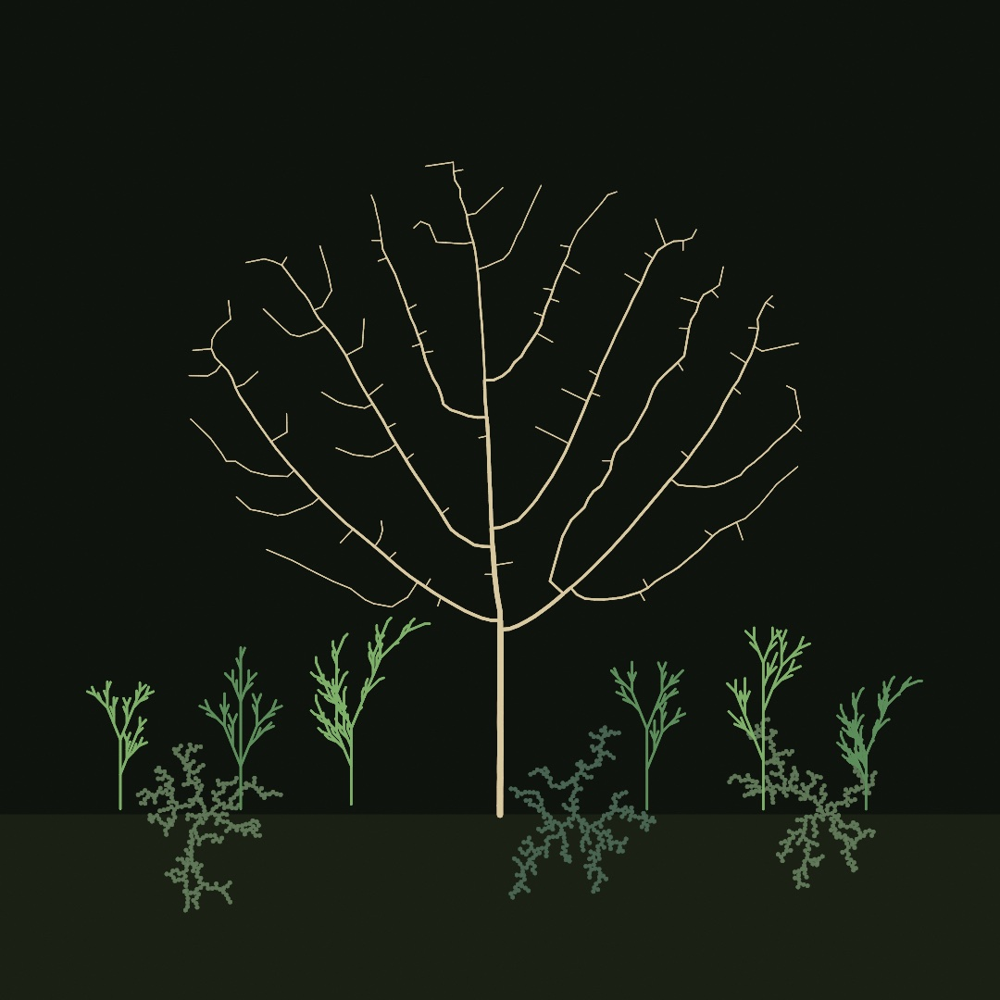

Chapter 10 grew behavior, and this chapter grows form. Everything in the garden above was grown rather than drawn. The tree claimed its patch of air branch by branch, the plants were written by a grammar that rewrites itself, and the lichen froze into place one wandering particle at a time. Four ways to grow, and by the end you'll have planted all of them in one bed.

## A tree from one rule

Start with the oldest trick there is, a function that calls itself. Draw a trunk. At its top, draw two smaller trees, one tilted left, one tilted right. Each of those draws its own trunk and its own two smaller trees, and so on down, until the trees are too small to bother. Make `MySketches/TreeByHand.swift`:

```swift
import Ollin

final class TreeByHand: Sketch {
    @Param("Angle", 0.1...0.6) var angle = 0.32
    @Param("Shrink", 0.55...0.78) var shrink = 0.7

    override func draw() {
        background(Color(hex: 0x101318))
        stroke(Color(hex: 0xE8DCC0))
        strokeCap(.round)

        withState {
            translate(width / 2, height - 110)
            branch(length: 235, depth: 9)
        }
    }

    func branch(length: Double, depth: Int) {
        guard depth > 0 else { return }
        let sway = sin(time * 0.8 + Double(depth)) * 0.02
        strokeWeight(Double(depth) * 0.9)
        drawLine(0, 0, 0, -length)
        translate(0, -length)
        withState {
            rotate(-angle + sway)
            branch(length: length * shrink, depth: depth - 1)
        }
        withState {
            rotate(angle * 1.15 + sway)
            branch(length: length * shrink, depth: depth - 1)
        }
    }
}
```

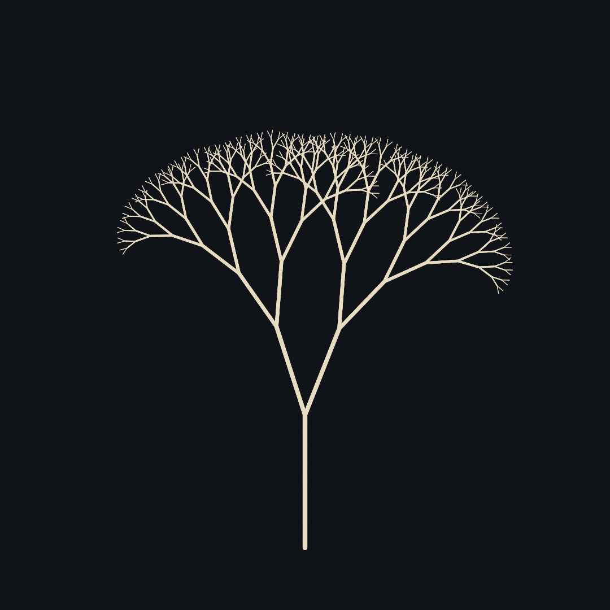

This is **recursion**, a rule applied to its own output. `branch` draws one segment and then asks `branch` to finish the job, twice, smaller. The `depth` counter is what keeps it from asking forever, and `guard depth > 0 else { return }` is the floor it stops on. Nine levels is `2⁹` tips, five hundred twelve of them, out of fourteen lines of code.

Look at where `withState` sits, because it's doing the quiet work. Each branch draws in its own coordinate world, using Chapter 6's trick. `translate` walks to the top of the segment just drawn, each `withState { rotate(...) ... }` tilts, recurses, and *puts the transform back* when its block ends. That put-it-back is the whole trick of drawing a tree. After the left subtree finishes, wherever its thousands of segments wandered, the pen is back at the fork, facing the way the fork faced, ready for the right subtree. A saved-and-restored state is how every branching drawing in this chapter works, and it's about to get a name from 1968.

The `* 1.15` on the right angle is a small honesty about nature, since perfectly symmetric trees read as diagrams. Drag the two knobs while it runs. `Shrink` near 0.78 grows old oaks, and `Angle` near 0.15 grows poplars.

> **Swift note.** A method can call itself by name, no ceremony needed. The one rule is that something must change on the way down (here `depth - 1`) so a call eventually stops. Each call gets its own copy of `length` and `depth`, which is why the left subtree's shrinking doesn't disturb the right's.

## Rules that rewrite

In 1968 the biologist Aristid Lindenmayer wanted to describe how plants grow, and wrote it as a grammar. You start from a short string of symbols, and each season, rewrite every symbol by a fixed rule, all at once. The strings these **L-systems** produce turn into drawings through a turtle, which reads the final string left to right as pen commands. `F` means draw forward. `+` and `-` mean turn by the system's angle. `[` means *save the pen's position and heading*, and `]` means *put it back*, the same save-and-restore you just met as `withState`, spelled as punctuation.

Here's the guide's plant grammar, rewritten one, two, three, and four times:

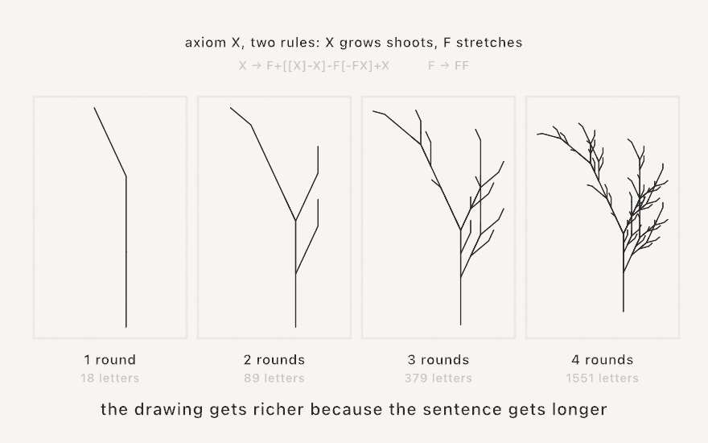

Nothing about the drawing code changes between panels. The drawing gets richer because the *sentence* gets longer, since every `X` in the string sprouts the whole shoot pattern each round, so eighteen letters become fifteen hundred in four rewrites. Growth by rewriting is exponential, which is exactly how a twig's worth of rule makes a tree's worth of structure.

Ollin ships the grammar machine as `LSystem`, thirteen classic presets, and a turtle that returns ordinary contours. Drawing one is a line:

```swift
import Ollin

final class Fern: Sketch {
    override func draw() {
        background(Color(hex: 0x101318))
        stroke(Color(hex: 0x9AD9A0))
        strokeWeight(1.6)
        strokeCap(.round)
        drawLSystem(.plant, iterations: 5)
    }
}
```


`drawLSystem` fits the grown form to the canvas and strokes it; and its sibling `lSystem(...)` returns the contours instead, for when you want to place, color, or export them yourself (the garden does). A grammar of your own is one constructor, so `LSystem(axiom: "F", rules: ["F": "F+F-F-F+F"], angle: 90)` is the Koch curve, and the [L-systems reference](../Docs/Generators/LSystem.md) lists the whole preset shelf, from `.dragonCurve` to `.hilbertCurve`.

One more idea turns plants into *populations*. Give a symbol several possible rewrites and let a seeded roll pick one each time it's rewritten (`.randomPlant` does this), and every plant grown from the same grammar is a different individual with the same species' look. Chapter 4's promise holds here. Because the rolls come from your `seed`, the same seed grows the same garden, down to the last twig.

## When the rules need arithmetic

Look again at what that turtle can say. `F` is one step, always the same step. A plain grammar chooses *which* symbols come next and nothing else. So every length it draws is a whole multiple of that one step, and `F → FF` does not make a longer segment. It makes two of them.

Usually that is fine. Sometimes it is the thing in your way. A real branch is a *fraction* of the one below it. A real trunk is thick at the base and fine at the tips. Neither of those is a count of steps.

**Parametric** L-systems let a symbol carry numbers. `F(3)` means go forward three. `A(1.5)` is a bud that knows how big it is. The rules then do arithmetic on those numbers:

```
A(s)  :  s > 0.02  ->  F(s)[+A(s*0.5)][-A(s*0.5)]
```

Read that left to right. When a bud `A` is longer than a hundredth, draw a segment its own length, then fork into two buds, each half as long. When it is *not* longer, no rule matches it. A symbol no rule matches is left alone, so that bud simply stops. Growth ends because the arithmetic ran out, not because you counted the rounds.


In Ollin that rule is one string, and the whole system is one value:

```swift
let branch = ParametricLSystem(
    axiom: "A(1)",
    rules: ["A(s) : s > 0.02 -> F(s)[+A(s*0.5)][-A(s*0.5)]"],
    angle: 30)

stroke(Color(hex: 0x9AD9A0))
strokeWeight(1.6)
drawLSystem(branch, iterations: 8)
```

`drawLSystem` and `lSystem(...)` are the same calls you just used. They take either kind of system.

The third panel needs one more symbol. `!(w)` sets the pen width, and `[` and `]` put it back along with the position, so a thin twig never thins the trunk holding it. To see those widths, draw the system `tapered`:

```swift
strokeWeight(14)
drawLSystem(.taperedTree(), iterations: 10, tapered: true)
```

Widths arrive as multiples of `strokeWeight`, scaled so the widest is exactly 1. So `strokeWeight` sets the trunk and every twig follows from it. Behind that, a tapered system comes back as the `StrokeMark`s of Chapter 12 rather than as plain contours.

A plain grammar counts. A parametric one measures. The [reference](../Docs/Generators/LSystem.md#parametric) has the rest: the arithmetic it accepts, weighted rules for stochastic growth, and a shelf of presets from the botany literature.

## The same fern, played as a game

There is a completely different way to grow that fern, and it's strange enough to be worth seeing. Instead of rewriting a sentence and walking it with a turtle, you play a game of chance with a handful of transformations.

Take four rules, each of which squashes, tilts, and shifts the entire plane. One draws the fern's main body slightly smaller and rotated. One draws the left frond, one the right, one the stem. Now put a dot anywhere at all, pick one of the four rules at random, move the dot by it, and mark where it lands. Then do that again, sixty thousand times.

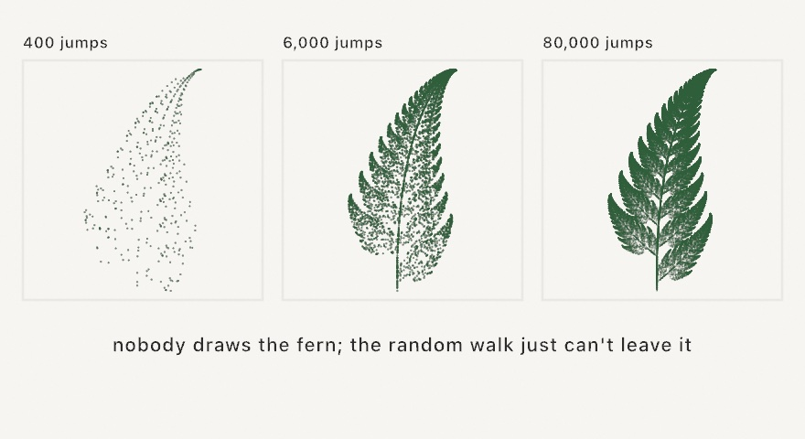

```swift
let cloud = ifsPoints(.barnsleyFern, count: 60_000)
    .map { Vector2($0.x, -$0.y) }        // the fern's own y grows upward
noStroke()
fill(Color(hex: 0x2E5E3A))
drawPoints(fitted(cloud, in: canvasRectangle.inset(by: .all(80))), size: 1.5)
```

The reason this works is worth sitting with for a second, because it feels like it shouldn't. Every one of the four rules *shrinks* the plane. So wherever your dot started, a few jumps later that starting position has been squashed down to nothing and forgotten. What's left is the only set of points that the four rules, taken together, map exactly onto itself. The dot can't escape it and can't stay away from it, so given enough jumps it traces it out. That set is called the attractor, and the collection of rules is an **iterated function system**.

The picture also explains what the weights are for. The fern's rules aren't chosen with equal probability, and the one drawing the main body gets picked about 85 percent of the time, which is what keeps the fine tip as well drawn as the base. Ollin ships `.barnsleyFern`, `.sierpinskiTriangle`, and `.sierpinskiCarpet`, and a system of your own is six numbers per rule plus a weight.

Two small practical notes come with it. The points arrive in the system's own coordinate space rather than canvas pixels, so `fitted` scales and centers them into any rectangle you name, and the fern needs its y negated because it grows upward while the canvas counts downward.

## Three more games worth knowing

The same move (play transformations at random, see where the orbit lives) generalizes further than ferns, and Ollin ships three of the places it goes.

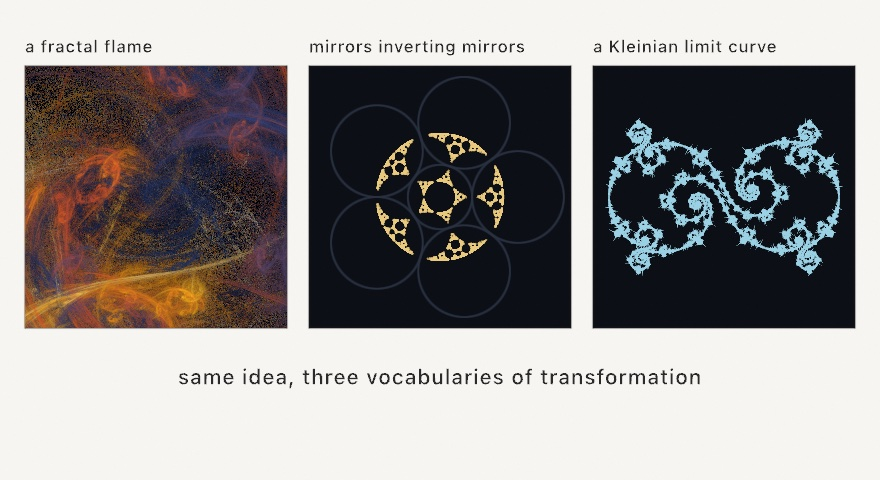

A **fractal flame** is the chaos game with two additions. Each rule finishes with a nonlinear twist, a swirl or a fold or a turning-inside-out, and instead of plotting dots you have every pixel *count* how many times the orbit visited it. Displaying the logarithm of those counts is what lets the blazing core and the faintest veil appear in one image, and the color comes from which rules carried the orbit there rather than from where it landed.

```swift
var source = SplitMix64(seed: 6)
let flame = FractalFlame.random(using: &source)
drawImage(flame.render(width: 900, height: 900, quality: 90, using: &source),
          in: canvasRectangle)
```

`quality` is how many samples each output pixel gets, so a few dozen previews and a few hundred makes a clean still. There's also a progressive `Renderer` you feed a slice of samples per frame, which is how flames are meant to be watched, rising out of the noise. Rolling a random flame is genuinely a roll, and some come out muddy, so rerolling until one sings is part of the practice rather than a sign you did it wrong.

**Inversion** is a different transformation to play with. Inverting a point in a circle turns the plane inside out around that circle: the rim stays exactly where it is, points near the center fly far away, and points far away land near the center. Take an arrangement of circles, repeatedly invert in one picked at random, and the orbit settles onto the arrangement's limit set. The one rule is never to pick the same circle twice in a row, because inverting twice in the same circle just undoes itself.

```swift
drawPoints(inversionLimitSet(of: mirrors, count: 26_000), size: 1.5)
```

Since the circles are in canvas coordinates, the dust needs no fitting and lands among the mirrors that produced it, which is what the middle panel shows. Tangent rings give lace, separated circles give scattered dust, and overlapping ones tear the lace apart.

The third has no randomness in it at all. A **Kleinian limit set** comes from two Möbius transformations, which are the maps that send circles to circles, and the group of everything you can build by combining them. Walking that group systematically traces the boundary its orbits pile up against.

```swift
let curve = kleinianLimitSet(.lace)
noFill()
drawPolygon(fitted(curve.points, in: canvasRectangle.inset(by: .all(60))))
```

What makes this one immediately useful is the return type. It's a single `Contour`, one ordered closed curve with evenly spaced points, so it strokes, exports, and plots like any other geometry in this guide rather than being a cloud you can only splat.

## Circles that pair off

Those Möbius maps have a second use, and this one hands you circles rather than a curve.

Start with four circles and pair them up, two and two. A pairing is the map that turns everything outside one circle into the inside of its partner, so whatever you give it comes back smaller and sitting in the partner. Hand a pairing the other three circles and you get three smaller circles nested inside one of them. Do it again with every pairing and its inverse, in every order, and those nest again, forever. The group you have built is a **Schottky group**, and the lace it leaves behind is that whole group drawn at once.

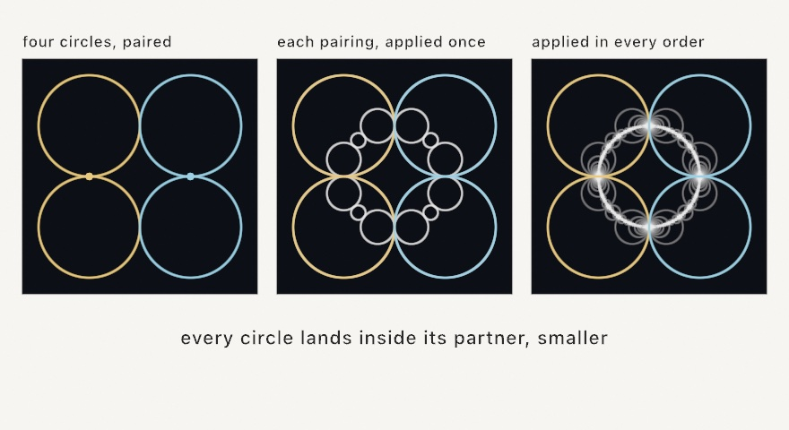

```swift
let pairings = schottkyCuspedPairs(in: canvasRectangle.inset(by: .all(60)))
noFill()
drawCircles(schottkyCircles(pairing: pairings))
```

One thing decides whether that picture comes out full or nearly empty, and it is worth knowing before you touch any of the numbers. When a pairing's two circles *touch*, its map holds the point where they touch perfectly still, and near that point it barely shrinks anything at all. So the orbit keeps handing back large circles generation after generation, and they pile into the fan you can see at the left and right of the third panel. Separate that pair by even a third of its radius and every application shrinks harder, so the arrangement that gave back nine thousand circles gives back fewer than three thousand. Same code, same four circles, and most of the picture is gone.

That is why `schottkyCuspedPairs` builds its four circles as two touching pairs, and it also tells you which dial to reach for when you want motion. `lean` swings each pair around its own tangency point, so the pair goes on touching however far it swings and the picture stays full while the figure opens and closes. `twist`, which rotates a pairing off that setting, gives you spirals instead, and thins the lace as it goes. The `Patterns/Schottky` example walks `lean` back and forth and never drops below ten thousand circles.

What comes back is `[Circle]`, not a cloud of points, because a Möbius map sends a circle to a circle and nothing has to be flattened on the way. The lace exports as real circles, so a pen plotter draws it with the same round strokes you see on screen.

The circles and the Kleinian curves are two views of one thing, and the bridge between them is a pair of numbers. `schottkyCircles(ta:tb:in:)` takes the same two traces that `kleinianLimitSet` takes, builds the same group, and draws its whole orbit as circles instead of tracing its boundary as a curve. At traces `(2, 2)` the orbit is the Apollonian gasket, and every nearby pair of traces is another member of the same family: bend the traces complex and the packing wobbles, loosen them and it opens.

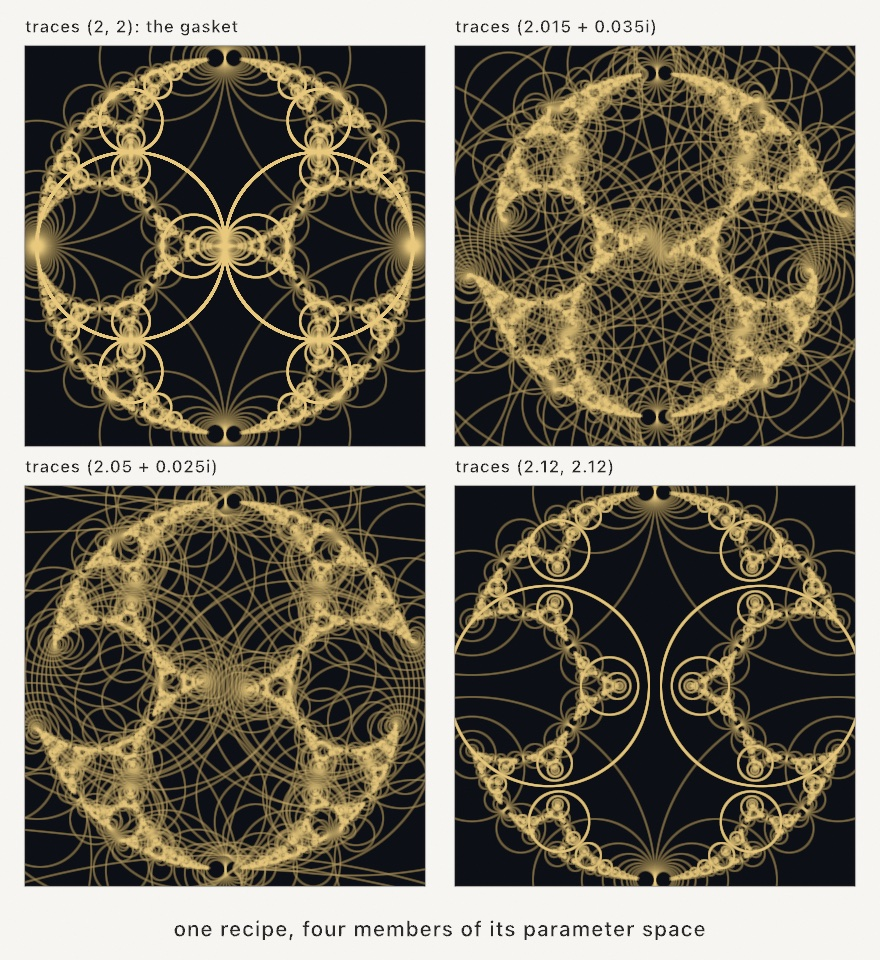

```swift
noFill()
drawCircles(schottkyCircles(.gasket, in: canvasRectangle.inset(by: .all(60))))
```

The named presets are the same ones the Kleinian curves use, so `.gasket` here and `.gasket` there are the same group wearing different clothes. The `Patterns/Schottky` example animates a small arc of this family, out from the gasket and back.

## Growth that claims space

Grammars grow blind, and the fern doesn't know where the canvas ends or where its own leaves already are. The next grower looks before it grows. Scatter *attraction points* over the region you want filled, plant a root, then repeat three moves. Every attractor pulls on the closest branch tip within its reach. Every pulled tip grows one small step toward the average of its pulls. Every attractor a branch reaches is consumed, so its pull disappears and the growth moves on:


This is **space colonization**, and it grows the most convincing veins, roots, and trees in generative art, because it grows the way real veins do, reaching toward unclaimed space and never doubling back into crowded territory. In Ollin it's `SpaceColonization`, another stepper you hold (the Chapter 10 shape):

```swift
let veins = SpaceColonization(attractors: poissonDisk(radius: 26),
                              roots: [Vector2(width / 2, height - 70)])
```

`poissonDisk` is doing the scattering, and it returns an even, organic sprinkle of points, no two closer than the radius you ask for (Chapter 13 looks inside it, and for now it's a bag of well-spread points). The growth itself has no randomness at all. Same attractors, same roots, same veins, every run.

Three distances shape the result, and they want a particular relationship. `stepLength` (how far a tip grows per step) should stay smaller than `killRadius` (how close counts as reached), or a tip can step right over its goal, and `killRadius` well under `influenceRadius` (how far an attractor's pull reaches). There's one practical gotcha. Growth only *starts* if some attractor's pull can reach a root, so a tree whose crown floats high above its root needs an `influenceRadius` at least as long as the trunk-to-crown gap. The garden's tree hit exactly this.

The last touch is weight. `thicknesses(leafWidth:exponent:)` gives every node a stroke width by the pipe model, so tips are hairline and every fork is as thick as its children can justify, the way a real trunk carries its crown. The `Patterns/Venation` example grows a whole leaf's veins this way, live.

## Growth by chance

The third grower has no goals at all. Freeze one particle in the middle. Release a random walker from somewhere far away and let it wander, and the moment it touches the frozen cluster it freezes too, and the next walker sets out:

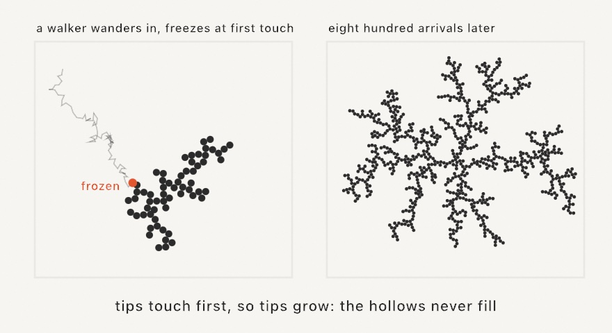

That's the entire algorithm, and it's called **diffusion-limited aggregation** (DLA). The shape it grows is not an accident, because a wandering particle almost always bumps into a *tip* before it can thread its way into a hollow, so tips grow and hollows starve. Frost on a window, minerals crystallizing in stone, and coral all play this game, which is why the clusters look instantly familiar.

```swift
let cluster = DiffusionLimitedAggregation(seeds: [center], seed: 7)

override func draw() {
    cluster.step(12)          // a dozen new arrivals per frame
    background(.black)
    fill(.white)
    noStroke()
    drawCircles(cluster.positions, radius: 3)
}
```

Because particles freeze in arrival order, `cluster.particles[i]` froze `i`-th, and tinting by index paints the cluster's whole life story as rings of color. Each particle also remembers which particle it stuck to, so `segments` gives the branching skeleton as plain lines. `stickiness` below `1` lets walkers slide deeper before freezing (denser, mossier clusters), and seeding a *row* of points instead of one center grows frost creeping up from an edge. The `Patterns/Dendrite` example is the ring-tinted version.

## Every neighbor must agree

The last technique in this chapter grows nothing, strictly speaking, but it belongs with the growers because its results read as one organism. Wave Function Collapse fills a grid from a small set of tiles under one law, which is that neighboring tiles must agree along their shared edge. Each tile declares a *socket* per edge (pipe or blank, in the classic set), and the solver keeps every cell's options open, repeatedly settling the most-constrained cell and propagating what that choice forbids:

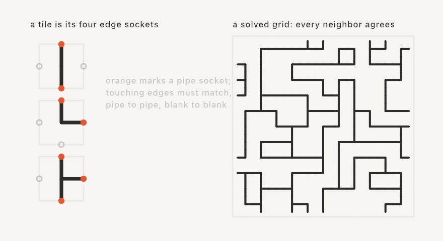

Building the tileset is most of the work, and it's pleasantly declarative. A tile is its four edge sockets, in the order top, right, bottom, left. `rotations()` mints the turned variants, and a `weight` makes a tile more or less common:

```swift
let blank = WFCTile([0, 0, 0, 0], weight: 1.1)
let line = WFCTile([1, 0, 1, 0], weight: 1.5).rotations(2)
let elbow = WFCTile([1, 1, 0, 0], weight: 1.2).rotations(4)
let tee = WFCTile([1, 1, 1, 0], weight: 0.5).rotations(4)
let tiles = [blank] + line + elbow + tee

let grid = wfc(tiles: tiles, columns: 11, rows: 11)   // [[Int]] of tile indices
```

`wfc` is seeded like everything else, and `drawWFC` walks the solved grid cell by cell handing you the tile index to draw (the figure above draws a stroke from each cell's center to every edge whose socket is `1`, which is the entire renderer for a pipe network). One draw block covers a tile *and* its rotations, because you draw from the sockets, not from a picture per tile. The `Patterns/WaveFunctionCollapse` example re-rolls a fresh legal network every few seconds.

## Or hand it a picture instead

Declaring tiles and sockets is most of the work, and some textures don't come apart into tiles at all. So there's a second way to run the same solver: give it a small picture and let it work the rules out itself.

It cuts the sample into every little square the sample contains, counts how often each one turns up, and notes which squares can overlap which. Then it fills a much larger grid so that every overlap agrees. The guarantee is this: **every square of the result is a square the sample already contained.**

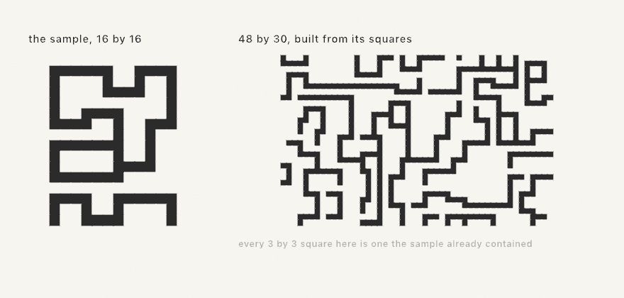

The sample is sixteen pixels square. You pass it in and ask for a size:

```swift
let texture = wfc(from: sample, width: 48, height: 30)   // an Image, or nil
```

Three knobs matter. `patternSize` is how big those squares are: `2` keeps only the loosest sense of the sample, `3` is the usual answer and holds on to corners and junctions, and larger reproduces whole motifs but leaves less room to invent. `symmetry` decides whether the turned and mirrored copies of the sample are learned too, which multiplies what the solver has to work with, but costs you which way is up: a sample of flowers standing on ground wants `symmetry: .none` or they'll come back sideways. And `wrapsSample` decides whether the sample is read as joining its own edges, which is on by default and is the one that surprises people, because it joins the bottom row to the top: ground under sky becomes a legal square, and your ground repeats in bands up the picture. Turn it off for a sample with a real top and bottom.

Two constraints matter. The sample has to be **small and few-colored**, because squares are matched by exact color; hand it a photograph and every square is unique, so there's nothing to recombine. And a solve **can fail**: it may paint itself into a corner where some cell has no square that fits, in which case it starts over, and past roughly fifty pixels a side that starts happening often enough to matter. `wfc` hands back `nil` when it gives up. The general problem is NP-hard, and the tilesets that can never fail tend to be the ones too loose to produce interesting structure.

The `Patterns/TextureSynthesis` example has three samples authored right in its source as rows of characters, so you can edit one and watch the texture change.

## Putting it together: a garden

Time to plant everything at once. The garden grows three systems in one bed, and one `seed(5)` at the top makes the whole thing a single reproducible organism. Make `MySketches/Garden.swift`:

```swift
import Ollin

final class Garden: Sketch {
    private var tree: SpaceColonization?
    private var plants: [[Contour]] = []
    private var tufts: [DiffusionLimitedAggregation] = []
    private let groundY = 880.0

    override func setup() {
        seed(5)

        // The tree wants the air inside an oval crown above the trunk.
        let crown = Vector2(540, 430)
        let attractors = poissonDisk(in: Rectangle(x: 190, y: 180, width: 700, height: 520),
                                     radius: 24).filter { p in
            let dx = (p.x - crown.x) / 350, dy = (p.y - crown.y) / 260
            return dx * dx + dy * dy < 1
        }
        // The influence radius must reach the crown from the root, or the
        // trunk never starts growing.
        tree = SpaceColonization(attractors: attractors, roots: [Vector2(540, groundY)],
                                 influenceRadius: 280, killRadius: 20, stepLength: 10)

        // A row of plants, each a stochastic L-system in its own patch.
        for (i, x) in [130.0, 260, 400, 700, 830, 950].enumerated() {
            let height = 150 + Double((i * 37) % 90)
            let patch = Rectangle(x: x - 70, y: groundY - height, width: 140, height: height)
            let preset: LSystem = i % 3 == 2 ? .bush : .randomPlant
            plants.append(lSystem(preset, iterations: 4, in: patch, padding: 6))
        }

        // Lichen tufts, half-buried where they were seeded.
        for x in [220.0, 620, 890] {
            tufts.append(DiffusionLimitedAggregation(
                seeds: [Vector2(x, groundY)], particleRadius: 2.2,
                maxParticles: 280, seed: UInt64(x)))
        }
    }

    override func draw() {
        guard let tree else { return }
        tree.step()
        for tuft in tufts { tuft.step(4) }

        background(Color(hex: 0x0F130D))

        // The soil.
        noStroke()
        fill(Color(hex: 0x1A2014))
        drawRect(Rectangle(x: 0, y: groundY, width: width, height: height - groundY))

        // Lichen.
        for (i, tuft) in tufts.enumerated() {
            fill(Color(hex: i % 2 == 0 ? 0x66805E : 0x4E6B57).withAlpha(0.85))
            drawCircles(tuft.positions, radius: 2.2)
        }

        // Plants, in two greens.
        noFill()
        strokeCap(.round)
        strokeWeight(2.4)
        for (i, plant) in plants.enumerated() {
            stroke(Color(hex: i % 2 == 0 ? 0x7FB069 : 0x5C8D5A))
            for contour in plant { drawPolyline(contour.points) }
        }

        // The tree, weighted by the pipe model.
        let widths = tree.thicknesses(leafWidth: 1.1, exponent: 2.4)
        stroke(Color(hex: 0xD9C9A0))
        for (i, node) in tree.nodes.enumerated() {
            guard let parent = node.parent else { continue }
            strokeWeight(widths[i])
            drawLine(tree.nodes[parent].position, node.position)
        }
    }
}
```

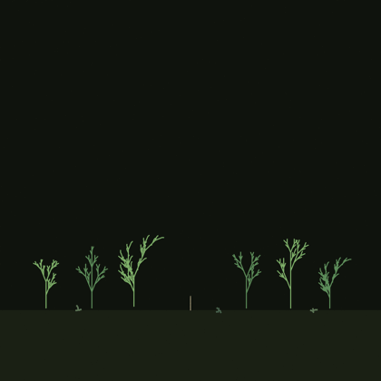

The plants finish growing before the first frame, because rewriting is instant and it's just strings, while the tree and the lichen grow in front of you. That's the honest shape of each algorithm: grammars produce, steppers *live*. Watch the trunk set off upward with no attractor consumed yet, pulled by the whole crown at once.

> **Swift note.** `filter` keeps the elements that pass a test, so the crown is carved out of a rectangular scatter by keeping only points inside an oval. Like `map` before it, it reads left to right: take the scatter, keep what passes.

Then make it yours:

- Re-roll the world by changing `seed(5)`, and every plant, branch, and tuft becomes a new individual of the same species.
- Add seasons. Tint the tree's tips by their thickness (thin means young) and the garden gets spring growth, or fade the plants' green toward ochre for autumn.
- Let the lichen win by raising the tufts' `maxParticles` to a few thousand, and the ground becomes a carpet slowly swallowing the plant stems.
- Grow the tree around an obstacle by cutting a hole in the attractor scatter (another `filter`), and the crown will politely grow around the missing space, with no extra code.
- Make a hanging garden. Flip the tree's root to the top edge and the crown ellipse below it, and gravity reverses without a single physics line.

## Where this comes from

L-systems are Aristid Lindenmayer's 1968 invention, and their visual language comes from *The Algorithmic Beauty of Plants* (1990), his book with Przemyslaw Prusinkiewicz, still free to read online and still beautiful. The parametric form is that book's section 1.10. James Hanan's 1992 dissertation, from the same group, works it out more fully. The tapered trees and the leaves are their published figures. Space colonization is by Adam Runions, Brendan Lane, and Prusinkiewicz at the University of Calgary's Algorithmic Botany group ("Modeling Trees with a Space Colonization Algorithm", 2007, after their 2005 leaf-venation work). Diffusion-limited aggregation was described by the physicists Thomas Witten and Leonard Sander in 1981, and generative artists have been growing frost with it ever since. Wave Function Collapse is Maxim Gumin's 2016 algorithm, named with a physicist's wink, and the tile-and-socket form here is its simple-tiled model.

The chance games have their own shelf. Iterated function systems and the chaos game are Michael Barnsley's, from *Fractals Everywhere* (1988), and the fern uses his published four-map table. The fractal flame is Scott Draves and Erik Reckase's algorithm, which Draves began in 1992 and which ran for years as a distributed screensaver that evolved flames by popular vote. Circle-inversion limit sets follow Michael Frame and Tatiana Cogevina's 2000 rendering method, and Frame's Yale course pages explain them clearly. The Kleinian curves and the paired circles both come from David Mumford, Caroline Series, and David Wright's *Indra's Pearls*, four hundred pages of making Felix Klein's groups visible. Friedrich Schottky described the paired-circle groups in 1877. Full credits are in the project's [attribution notes](../ATTRIBUTION.md).

## Go deeper

- [L-systems](../Docs/Generators/LSystem.md): the grammar type, the turtle alphabet, all thirteen presets, and the [parametric](../Docs/Generators/LSystem.md#parametric) form with its rule language, weighted rules, and botany-literature presets.
- [Space colonization](../Docs/Generators/SpaceColonization.md): every knob, plus recipes for venation, lightning, and multi-root plantings.
- [Diffusion-limited aggregation](../Docs/Generators/DiffusionLimitedAggregation.md): stickiness, cages, and drawing the skeleton.
- [Wave Function Collapse](../Docs/Generators/WaveFunctionCollapse.md): sockets, weights, rotations, learning from a picture instead, and what to do when a solve fails.
- [Blue noise](../Docs/Generators/BlueNoise.md): the even scatter the tree's crown was carved from, properly explained in Chapter 13.
- [Fractals](../Docs/Generators/Fractals.md): the `IFS` type and its presets, the whole `FractalFlame` surface including the progressive renderer, inversion limit sets, the Kleinian trace presets, the Schottky circle orbit with both of its family builders, and `fitted` for placing any point cloud.
- Worked examples: [`Examples/Patterns/LSystem`](../Examples/Patterns/LSystem/Sketch.swift) (the preset contact sheet), [`Examples/Patterns/ParametricLSystem`](../Examples/Patterns/ParametricLSystem/Sketch.swift) (the parametric one, including a tapered tree), [`Examples/Patterns/Venation`](../Examples/Patterns/Venation/Sketch.swift), [`Examples/Patterns/Dendrite`](../Examples/Patterns/Dendrite/Sketch.swift), [`Examples/Patterns/WaveFunctionCollapse`](../Examples/Patterns/WaveFunctionCollapse/Sketch.swift), [`Examples/Patterns/TextureSynthesis`](../Examples/Patterns/TextureSynthesis/Sketch.swift), [`Examples/Patterns/IteratedFunctions`](../Examples/Patterns/IteratedFunctions/Sketch.swift), [`Examples/Patterns/FractalFlame`](../Examples/Patterns/FractalFlame/Sketch.swift), [`Examples/Patterns/InversionFractal`](../Examples/Patterns/InversionFractal/Sketch.swift), and [`Examples/Patterns/Kleinian`](../Examples/Patterns/Kleinian/Sketch.swift).

---

[Contents](README.md#contents) · Previous: [Chapter 10, Flocks and swarms](10-FlocksAndSwarms.md) · Next: [Chapter 12, Fields and flow](12-FieldsAndFlow.md)
