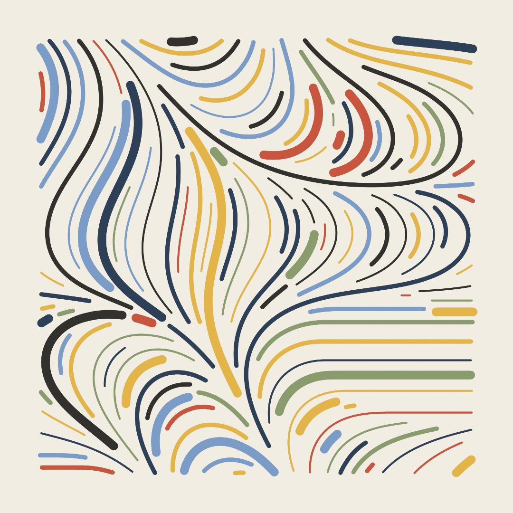
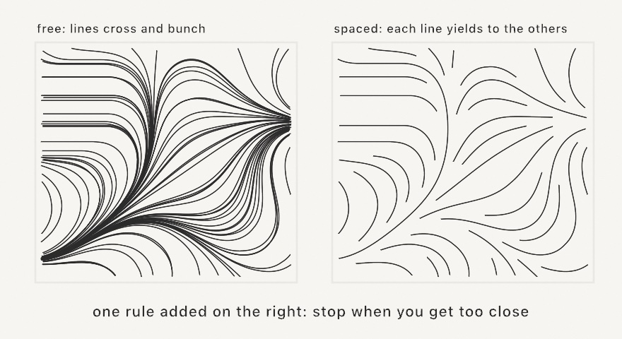

#### <sup>[Ollin](../README.md) → [Guide](README.md) → Chapter 12</sup>

---

# 12. Fields and flow



Most tricks in this guide do one job. This chapter teaches one that never stops paying: the **field**, a question you can ask at every point of the canvas and always get an answer. Noise was your first field, a number at every point. Give the answer a *direction* instead and you get flow: lines comb themselves into currents, particles ride invisible rivers, and the print above draws itself out of one function. The same mental model will come back per-pixel in Chapter 15 and as sculpting material in Chapter 18, so the time spent here is an investment.

## An answer at every point

A **flow field** is a direction at every point of the plane. Not a grid of stored directions, just a rule: hand me any point, I hand you back an angle. In Ollin a `FlowField` is exactly that, a wrapped function, and the easiest way to make a good one is to let noise pick the angles, which is what the `flowField(...)` helper does. Because noise changes smoothly (Chapter 5's whole point), nearby points get nearby directions, and the field organizes into weather.

You can't see a function, but you can interview it. Put down a grid of points, ask the field for its direction at each one, and draw a needle. Make `MySketches/Compass.swift`:

```swift
import Ollin

final class Compass: Sketch {
    override func draw() {
        background(Color(hex: 0x101318))
        seed(7)
        let field = flowField(scale: 0.0016, z: time * 0.04)

        stroke(Color(hex: 0xC9D4E0))
        strokeWeight(2.5)
        strokeCap(.round)
        noFill()
        for point in grid(columns: 24, rows: 24, padding: 70).points {
            let dir = field.direction(at: point.position)
            drawLine(point.position - dir * 11, point.position + dir * 11)
        }
        noStroke()
        fill(Color(hex: 0xE8B44A))
        for point in grid(columns: 24, rows: 24, padding: 70).points {
            let dir = field.direction(at: point.position)
            drawCircle(center: point.position + dir * 11, radius: 3)
        }
    }
}
```


`field.angle(p)` is the raw answer in radians; `field.direction(at: p)` is the same answer as a unit vector, ready for Chapter 8's arithmetic. The `z` argument is the third noise dimension doing its usual job from Chapter 5: nudge it over time and the whole weather system drifts. Two things are worth noticing before moving on. The needles are only *samples*; the field has an answer between them too, at every point you could ever ask. And the field is cheap: nothing is simulated or stored, so asking is all it ever costs.

One habit keeps the sugar honest: `flowField` reads the sketch's seeded noise, so call `seed(...)` first and build the field fresh each frame (or trace what you need once and keep the *results*). It's a lens over the noise, not a stored grid.

## Following the flow

The field becomes drawing the moment you stop interviewing it and start obeying it. Put a point down anywhere. Ask the field which way. Take a small step that way. Ask again from where you landed:


The path this walk leaves is a **streamline**, and `field.streamline(from: start)` traces one for you with properly small steps (it walks both directions from the start, so your point sits in the middle of the curve rather than at its end). Trace a handful from random starts and you have instant calligraphy. The `stepLength` is the accuracy knob: big steps cut corners on tight curves, exactly like the exaggerated arrows in the diagram.

## Lines that keep their distance

Streamlines from scattered starts have one flaw as art: nothing stops them from crossing or bunching into ropes. The fix, from scientific visualization, is a single added rule, and the difference is the whole flow-field look:



Pass a `separation` and each line is traced watching all the lines drawn before it: the moment it comes within that distance of any of them, it stops and yields. Lines never cross, density stays even, and the field reads as combed fiber:

```swift
let lines = field.streamlines(from: poissonDisk(radius: 24),
                              stepLength: 6, steps: 140,
                              bounds: bounds, separation: 21)
```

The starts come from `poissonDisk`, Chapter 11's well-spread scatter (Chapter 13 finally opens it up), because evenly spaced lines deserve evenly spread beginnings. Each traced line is an ordinary `[Vector2]`, so everything you know applies: stroke it, vary its weight, feed it to an export.

## Particles that ride

A streamline is the whole journey drawn at once. Sometimes you want the journey *lived* instead: keep a population of particles, and each frame move every one a small step along the field at its own position. That's **advection**, and it's one call:

```swift
particles = field.advected(particles, stepLength: 7)
```


The figure gives each particle a short stored trail (Chapter 10's array trick) and respawns any swimmer that leaves the canvas. It rides `curlField`, a second field builder worth knowing: curl noise is built so the flow only ever swirls, never piles up or drains away, which keeps a drifting population evenly spread forever. It's the field of choice for smoke, ink, and anything that should feel fluid without simulating fluid.

## Motion found in a formula

Flow fields answer *where to go* from a position. One last family answers it differently: a **chaotic map** is a formula that takes a point and returns the next point, no noise, no canvas, just algebra folding the plane onto itself. Iterate one from any start and the visits trace a ghostly shape called a strange attractor, the formula's own signature. Plot a few million visits as faint additive dots and the shape develops like a photograph:


```swift
let map = ChaoticMap.clifford()          // x' = sin(a·y) + c·cos(a·x), y' = sin(b·x) + d·cos(b·y)
var p = Vector2(0.1, 0.1)
for _ in 0 ..< 30_000 {
    p = map.next(p)
    // scale p (it lives within about ±2) onto the canvas and plot it
}
```

The plates accumulate on a canvas that never clears, with `blendMode(.add)`: instead of painting over what's below, each faint dot *adds* its light, so the places the orbit revisits glow brighter, a first taste of the additive layering Chapter 14 develops. Every constant in `clifford(a:b:c:d:)` reshapes the ghost completely; most values collapse to a dot or explode into static, and part of the craft is collecting constants that sing (the four plates are four such finds). The 3D members of this family, Lorenz and friends, live in `StrangeAttractor` and wait for Chapter 17's camera.

## The payoff: the print

Everything above compresses into a surprisingly short piece with a long pedigree: evenly spaced streamlines, three ribbon weights, a warm palette, cream paper. Make `MySketches/FlowPrint.swift`:

```swift
import Ollin

final class FlowPrint: Sketch {
    override func draw() {
        background(Color(hex: 0xF2EDE3))
        seed(12)

        let margin = bounds.inset(by: .all(84))
        let field = flowField(scale: 0.0011, z: 0.4)
        let seeds = poissonDisk(in: margin, radius: 24)
        let lines = field.streamlines(from: seeds, stepLength: 6, steps: 140,
                                      bounds: margin, separation: 21)

        let palette = [Color(hex: 0xC8553D), Color(hex: 0xE3B448), Color(hex: 0x8A9B6E),
                       Color(hex: 0x2E4057), Color(hex: 0x7A9CC6), Color(hex: 0x33312E)]
        let weights = [4.0, 4, 9, 9, 9, 18]

        noFill()
        strokeCap(.round)
        for line in lines where line.count > 3 {
            stroke(randomChoice(palette))
            strokeWeight(randomChoice(weights))
            drawPolyline(line)
        }
    }
}
```

Everything happens in `draw()` with a fixed seed, so the piece is a still that redraws identically every frame; change the seed and a new print rolls off the press. The `weights` list is a quiet trick from Chapter 4: repeating `9` three times makes medium ribbons three times as likely as heavy ones.

Then make it yours:

- Roll seeds until one composes. This is how flow-field artists actually work: the field does the drawing, the artist does the choosing.
- Swap `flowField` for `curlField` and the print turns from wind-combed to whirlpooled.
- Give the palette a bias: pick the color by the line's *position* (its first point's `y` mapped into the palette) and the print develops horizons.
- Replace `drawPolyline` with a dot walked along each line every few points, and the ribbons become stitched embroidery.
- Print it for real: add `--export-svg print.svg` when you run it, and every ribbon exports as a true vector path (Chapter 13 goes deeper into plotter territory).

## Where this comes from

Vector fields are old mathematics (fluid dynamics and electromagnetism run on them); creative coding borrowed the flow field as a drawing device, with Processing-era sketches passing the recipe around. The evenly spaced tracing is Bruno Jobard and Wilfrid Lefer's 1997 streamline-placement algorithm from scientific visualization. Curl noise as a graphics tool is Robert Bridson's 2007 formulation. The print at the top tips its hat to Tyler Hobbs, whose flow-field work, above all *Fidenza* (2021), defined the look for a generation and whose essay "Flow Fields" generously teaches the craft. The Clifford attractor is named for Clifford Pickover and the de Jong attractor for Peter de Jong, both popularized through Paul Bourke's long-running fractal pages. Full credits are in the project's [attribution notes](../ATTRIBUTION.md).

## Go deeper

- [Flow fields](../Docs/Generators/FlowField.md): the full `FlowField` reference, including advection and the transient-sugar rule.
- [Attractors](../Docs/Drawing/Attractors.md): every built-in system, 2D and 3D, and how to supply your own equations.
- [Noise](../Docs/Generators/Noise.md): the field the flow is made of.
- [Steering](../Docs/Generators/Steering.md): creatures that *follow* a field instead of riding it (Chapter 10's `follow(_:)`).
- Worked examples: [`Examples/Patterns/Streamlines`](../Examples/Patterns/Streamlines/Sketch.swift) (evenly spaced, hue drifting along the flow), [`Examples/Patterns/CliffordAttractor`](../Examples/Patterns/CliffordAttractor/Sketch.swift) (the density bloom, built up live), and [`Examples/Motion/FlowField`](../Examples/Motion/FlowField/Sketch.swift) (a curl field of drifting needles).

---

[Contents](README.md#contents) · Previous: [Chapter 11, Growing things](11-GrowingThings.md) · Next: Chapter 13, Shapes as material
