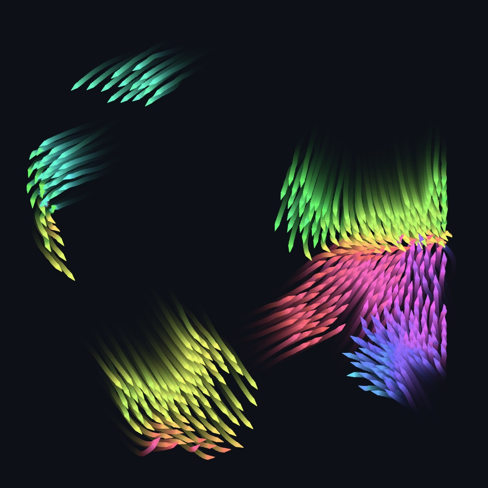
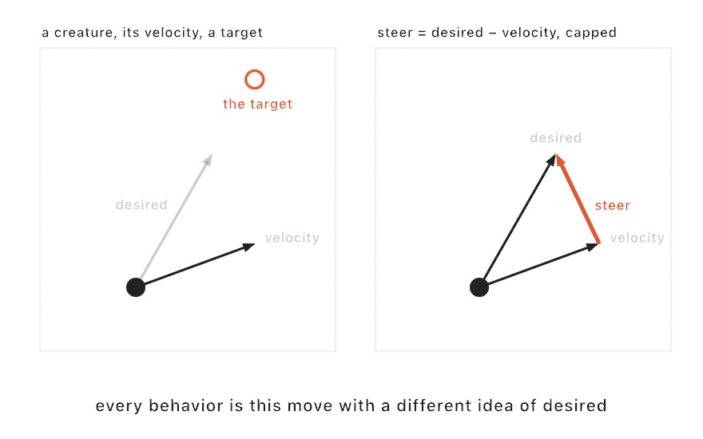
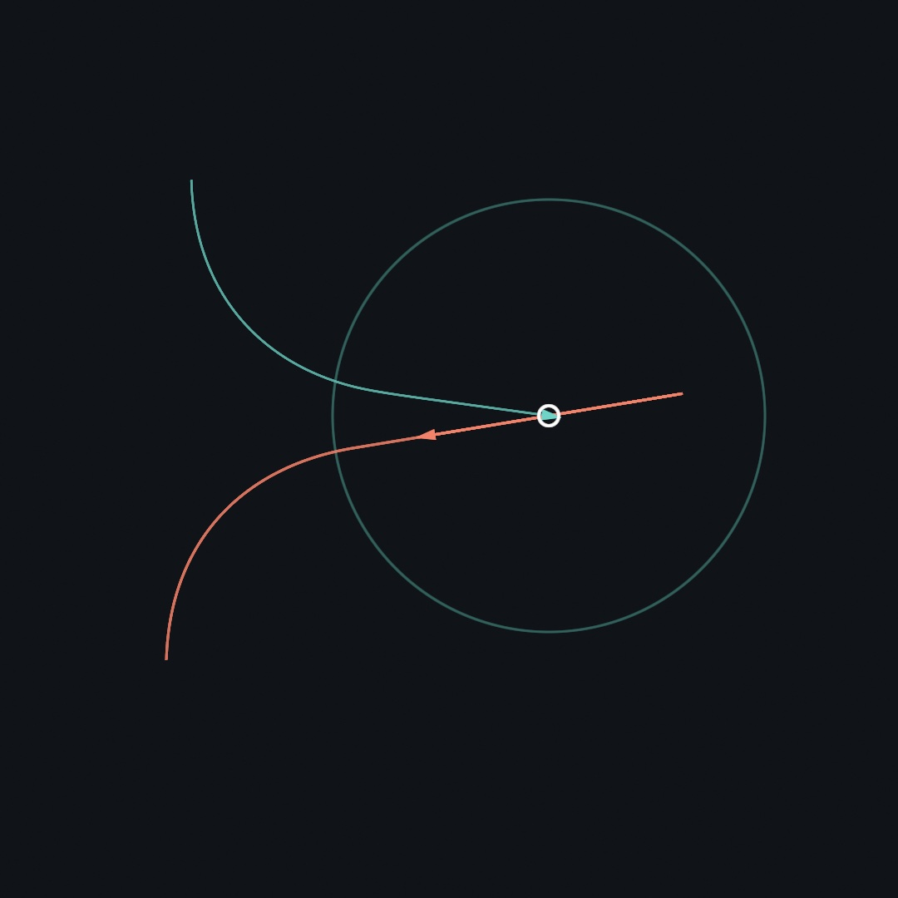
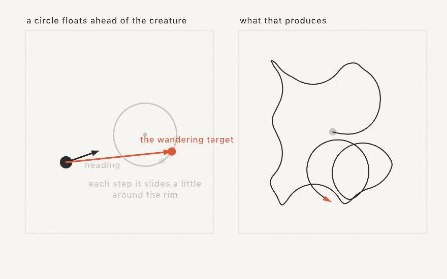
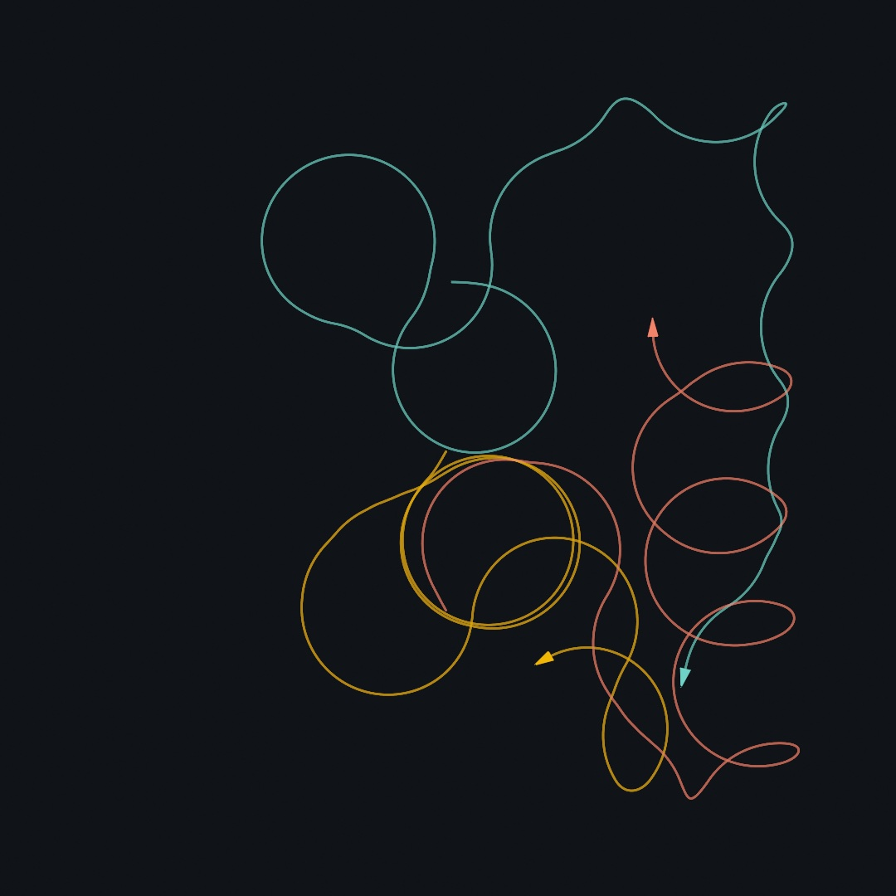
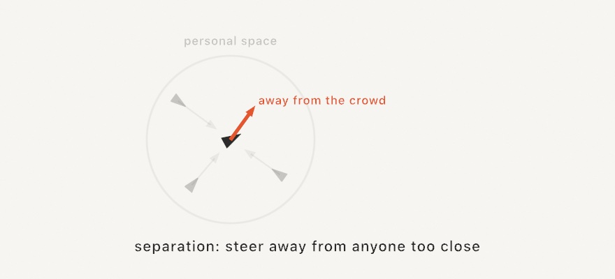
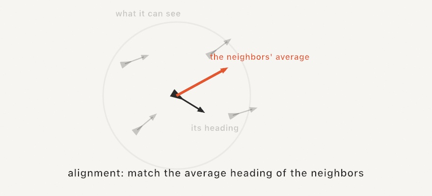
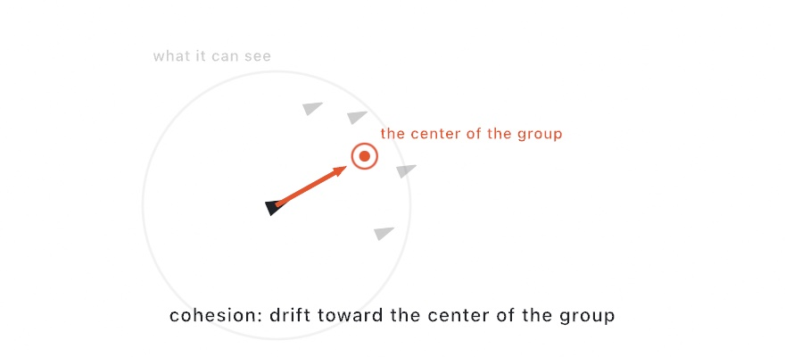
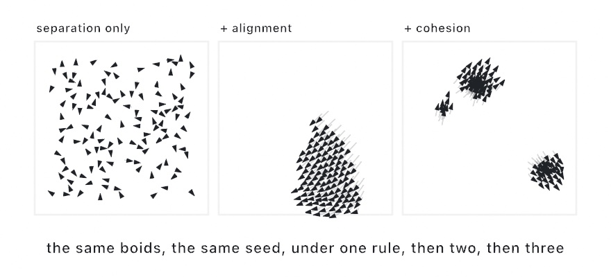

#### <sup>[Ollin](../README.md) → [Guide](README.md) → Chapter 12</sup>

---

# 12. Flocks and swarms



[Chapter 10](10-Vectors.md) ended with a swarm chasing the mouse, one steering recipe run over a few hundred movers, all wanting the same thing. This chapter gives each creature wants of its own. You'll build one creature that can chase, stop at its target, and roam on its own. Then you'll set loose a few hundred that watch only each other, which turns out to be enough to make the flock above, with nobody in charge.

One word before we start. The field calls these creatures *autonomous agents*, the name Craig Reynolds gave them in 1986, decades before "agent" came to mean software with a chat window. The idea is his either way, and this guide will say creature, boid, and flock.

## A creature that steers

Here is the chase recipe from [Chapter 10](10-Vectors.md) one more time, because this whole chapter is built from it:

```swift
let desired = (target - position).normalized * maxSpeed
let steer = (desired - velocity).limited(to: maxForce)
```

Work out the velocity you *wish* you had. Subtract the velocity you *have*. Cap the correction, because nothing real turns instantly. Drawn as arrows, it looks like this:



Steering is wanting, written as arithmetic. Everything a creature does in this chapter is this same move with a different idea of *desired*, and that's exactly how Ollin packages it. A `Vehicle` is a position and a velocity plus those two caps, and every behavior on it returns one of these correction forces:

```swift
let creature = Vehicle(at: Vector2(540, 540), maxSpeed: 4, maxForce: 0.15, seed: 1)

creature.applyForce(creature.seek(mouse))   // any behaviors, any weights
creature.step()                             // then move one step
```

Behaviors don't move the creature. They only return forces, and you decide which to apply and how loudly each one counts (`creature.flee(danger) * 2` shouts twice as hard). `step()` adds the sum to the velocity, caps the speed, and moves. It's [Chapter 11](11-ForcesAndPhysics.md)'s force accumulation again, with the forces coming from wants instead of gravity.

Something changed quietly since [Chapter 10](10-Vectors.md). There's no `deltaTime` here. A `Vehicle`, like every simulation you'll meet in this chapter, moves in fixed steps. You call `step()` once per frame, and speeds are in points per step. The trade is deliberate. A stepped simulation is exactly repeatable: the same seed replays the same run, which is how the figures in this guide (and any piece you export) can be reproduced at all. The cost is that a dropped frame slows the world down a little instead of skipping ahead, and for creatures that's almost always fine.

> **Swift note.** `creature` is declared with `let` even though it changes every frame. That works because `Vehicle` is a *class*, so the `let` pins which creature the name points at, not what's inside it. You met the same pattern in [Chapter 11](11-ForcesAndPhysics.md) with `World`. Holding one instance and poking it every frame is the house shape for simulations, and you'll see it three times in this chapter.

## Seek, and the art of stopping

`seek` aims at full speed forever, and that's its flaw, because it has no idea of *enough*. Run it at a fixed target and the creature overshoots, turns around, and shoots through again, forever. The fix is `arrive`, which wants full speed far away but ramps its desired speed down inside a slowing radius, so the creature eases in and parks. Watch both at once. Make `MySketches/ChaseDot.swift`:

```swift
import Ollin

final class ChaseDot: Sketch {
    let seeker = Vehicle(at: Vector2(200, 800), velocity: Vector2(0, -7),
                         maxSpeed: 7, maxForce: 0.15)
    let arriver = Vehicle(at: Vector2(230, 210), velocity: Vector2(0, 7),
                          maxSpeed: 7, maxForce: 0.15)
    let target = Vector2(660, 500)
    var seekTrail: [Vector2] = []
    var arriveTrail: [Vector2] = []

    override func draw() {
        seeker.applyForce(seeker.seek(target))
        arriver.applyForce(arriver.arrive(at: target, slowingRadius: 260))
        seeker.step()
        arriver.step()
        seekTrail.append(seeker.position)
        arriveTrail.append(arriver.position)

        background(Color(hex: 0x101318))

        // The slowing radius the arriver honors.
        noFill()
        stroke(Color(hex: 0x6FD3C7).withAlpha(0.18))
        strokeWeight(2)
        drawCircle(center: target, radius: 260)

        strokeWeight(2.5)
        stroke(Color(hex: 0x6FD3C7).withAlpha(0.6))
        drawPolyline(arriveTrail)
        stroke(Color(hex: 0xF2836B).withAlpha(0.75))
        strokeWeight(3)
        drawPolyline(seekTrail)

        noStroke()
        fill(Color(hex: 0xF2836B))
        drawVehicle(seeker, size: 14)
        fill(Color(hex: 0x6FD3C7))
        drawVehicle(arriver, size: 14)

        noFill()
        stroke(.white)
        strokeWeight(3)
        drawCircle(center: target, radius: 12)
    }
}
```



Both creatures launch with the same speed and the same turning cap, and only the wanting differs. The teal arriver bends in, slows, and parks on the dot. The coral seeker swings through it, brakes, comes back, and shoots through again, and its trail past the target is that oscillation drawn. `drawVehicle` is a small courtesy from Ollin, a triangle pointing along the creature's heading, in the current `fill`.

Both trails here are just arrays of positions, appended each frame and drawn with `drawPolyline`, the same trick as every trail in this chapter.

## Roaming

The most lifelike behavior needs no target at all. `wander` gives a creature aimless, believable roaming, and the recipe is smarter than "add random turns", which produces nervous jitter, not a stroll. Instead, picture a circle floating a fixed distance ahead of the creature. The creature seeks a point on that circle's rim, and each step the point slides a little way around the rim, at random:



Because the target can only slide gradually, the creature's curve bends gradually too, so it remembers roughly where it was going. The jitter amount is the personality knob. Small values drift in long, calm arcs; large values get twitchy. Three of them, with trails, make `MySketches/Wanderer.swift`:

```swift
import Ollin

final class Wanderer: Sketch {
    var creatures: [Vehicle] = []
    var trails: [[Vector2]] = []
    let colors = [Color(hex: 0x6FD3C7), Color(hex: 0xF2B705), Color(hex: 0xF2836B)]

    override func setup() {
        creatures = (0 ..< 3).map { i in
            Vehicle(at: Vector2(540, 340 + Double(i) * 200),
                    velocity: Vector2(angle: Double(i) * 2.1, length: 2),
                    maxSpeed: 4, maxForce: 0.15, seed: UInt64(i * 3 + 2))
        }
        trails = creatures.map { _ in [] }
    }

    override func draw() {
        for (i, creature) in creatures.enumerated() {
            creature.applyForce(creature.wander(radius: 30, distance: 90, jitter: 0.25))
            creature.applyForce(creature.contain(in: bounds, margin: 140) * 1.5)
            creature.step()
            trails[i].append(creature.position)
            if trails[i].count > 700 { trails[i].removeFirst() }
        }

        background(Color(hex: 0x101318))
        noFill()
        strokeWeight(2.5)
        for (i, trail) in trails.enumerated() where trail.count > 1 {
            stroke(colors[i].withAlpha(0.5))
            drawPolyline(trail)
        }
        noStroke()
        for (i, creature) in creatures.enumerated() {
            fill(colors[i])
            drawVehicle(creature, size: 14)
        }
    }
}
```



Two behaviors are stacked here, and that's the point of forces-that-compose: `wander` supplies the roaming and `contain` supplies the walls, a push back inside the canvas that only wakes up within `margin` of an edge. Each creature has its own `seed`, because wander is the one behavior that draws random numbers, and giving two creatures the same seed makes them roam in eerie lockstep.

The rest of the behavior shelf works the same way, so a list will do. `pursue` and `evade` chase and dodge a *moving* target by aiming where it will be, not where it is, the hunting trick every kitten knows. `follow(path:)` keeps a creature inside a corridor along a polyline, correcting only when it strays. `follow(_ field:)` rides the flow fields coming in [Chapter 14](14-FieldsAndFlow.md). `separate(from:)` keeps personal space within a group, and you'll meet it properly in a moment. The `Motion/Steering` example runs most of the shelf in one scene, and the [steering reference](../Docs/Generators/Steering.md) has every knob.

## Three rules make a flock

Now the leap that made this famous. In 1986 Reynolds set out to animate a flock of birds and found that the flock does not need a choreographer. Give every creature the same three steering rules, let each one see only its nearby neighbors, and flocking *happens*. Each rule alone is small enough to draw.

**Separation.** Steer away from anyone inside your personal space, and let the closest neighbors push hardest:



**Alignment.** Look at the neighbors you can see, average their headings, and steer to match:



**Cohesion.** Find the center of those same neighbors and drift toward it:



Every arrow above is the same steering move from the start of the chapter, and only *desired* changes. And notice what none of the rules mention: the flock. A boid sees a handful of neighbors inside its perception radius and nothing else. No boid knows the flock exists, and the flock happens anyway. That's the pattern this chapter is really about, local rules producing global behavior, and it's why these three small rules have been studied by biologists and roboticists ever since.

Here are the rules switched on one at a time, same creatures, same seed:



Separation alone spaces them evenly, but every heading is private. Add alignment and the headings agree: a school. Add cohesion and the school gathers itself into flocks. Reading the panels left to right is watching order emerge one rule at a time.

## The flock, assembled

You could build all of that from `Vehicle` and three loops, and it would slow to a crawl at a few hundred creatures, because "look at every neighbor" naively means comparing everyone against everyone. Ollin ships the assembled version as `Boids`: the three rules, the perception and personal-space radii, the edge-turning, and a spatial trick that only compares true neighbors, so hundreds of boids stay cheap. It's another stateful stepper you hold:

```swift
let flock = Boids(count: 520, in: bounds, seed: 7)

override func draw() {
    flock.step()
    background(.black)
    fill(.white)
    drawBoids(flock, size: 10)
}
```

The three rule weights (`flock.separation`, `flock.alignment`, `flock.cohesion`) and the two radii are ordinary properties, and tuning them is tuning the flock's temperament. Raise separation and the flock loosens into a crowd keeping polite distance. Raise cohesion and it balls up. Shrink `perceptionRadius` and big flocks fragment into many small ones. There is no right setting. The finished piece below puts all three on knobs so you can search for your own.

## Putting it together: the living flock

The piece at the top of the chapter is the flock with its temperament on knobs and one new trick for the trails. So far every sketch has started `draw()` by wiping the canvas. `noClear()` turns that off, so the canvas keeps everything drawn so far and *you* decide what fades. Painting a translucent rectangle of the background color over the whole canvas each frame dims the past a little instead of erasing it, and moving things grow tails. (That persistent canvas has a whole world in it, accumulation and long-exposure looks, which [Chapter 16](16-LayersAndEffects.md) explores, and this is a first taste.)

Make `MySketches/Flock.swift`:

```swift
import Ollin

final class Flock: Sketch {
    @Param("Separation", 0...3) var separation = 1.6
    @Param("Alignment", 0...3) var alignment = 1.1
    @Param("Cohesion", 0...3) var cohesion = 0.9

    var flock: Boids?

    override func setup() {
        background(Color(hex: 0x0D1017))
        noClear()
    }

    override func draw() {
        if flock == nil {
            flock = Boids(count: 520, in: bounds, seed: 7,
                          maxSpeed: 3.6 * scale, maxForce: 0.15 * scale,
                          perceptionRadius: 60 * scale, separationRadius: 24 * scale,
                          margin: 90 * scale)
        }
        guard let flock else { return }
        flock.separation = separation
        flock.alignment = alignment
        flock.cohesion = cohesion
        flock.step()

        // Fade the last frame a little instead of erasing it: trails.
        noStroke()
        fill(Color(hex: 0x0D1017).withAlpha(0.16))
        drawRect(bounds)

        let size = 9 * scale
        for i in 0 ..< flock.count {
            let heading = flock.heading(i)
            fill(Color(hue: (heading + .pi) / .tau + 0.55,
                       saturation: 0.58, brightness: 0.97))
            withState {
                translate(flock.positions[i])
                rotate(heading)
                drawTriangle(Vector2(size, 0),
                             Vector2(-size * 0.65, size * 0.5),
                             Vector2(-size * 0.65, -size * 0.5))
            }
        }
    }
}
```

Each boid is a triangle rotated to its heading ([Chapter 6](06-GridsAndRepetition.md)'s transforms doing creature duty), and its hue comes *from* the heading, so color is information: boids flying the same way share a color, and every band of color in the image is a sub-flock that has agreed on a direction. Here's a few seconds of it organizing itself from a random scatter:


Then make it yours:

- Drag the three knobs while it runs. Somewhere around high cohesion and low separation the flock balls up into a swirling knot, while high separation with low everything else dissolves it into a polite crowd. Find the edge between flock and crowd.
- Give the flock somewhere to go. Setting `flock.field = curlField(scale: 0.003)` with a small `flock.fieldStrength` sends the whole society drifting along an invisible current (a preview of [Chapter 14](14-FieldsAndFlow.md)).
- Add a predator, one `Vehicle` that pursues the flock's first boid, drawn large and pale. For real drama, make nearby boids `flee` it. All the forces compose.
- Swap the triangle for a short line along the velocity, and the piece stops reading as creatures and starts reading as brushstrokes.

## Where this comes from

Boids are Craig Reynolds' invention: the 1987 SIGGRAPH paper "Flocks, Herds, and Schools: A Distributed Behavioral Model" introduced the three rules, and his 1999 paper "Steering Behaviors for Autonomous Characters" laid out the seek, flee, arrive, wander, and path-following vocabulary this chapter is built on (his term for the creature, *vehicle*, honors Valentino Braitenberg's 1984 book of thought experiments about simple machines with wants). Daniel Shiffman's *The Nature of Code* made this material a rite of passage for creative coders, and its chapters on agents remain the warmest long-form treatment. Differential growth as a generative technique owes its popularity to Anders Hoff's explorations at inconvergent.net and Jason Webb's tutorials. Full credits are in the project's [attribution notes](../ATTRIBUTION.md).

## Go deeper

- [Steering](../Docs/Generators/Steering.md): every `Vehicle` behavior and knob, including pursuit, evasion, and path following.
- [Flocking](../Docs/Generators/Boids.md): the full `Boids` reference, including flow-field following.
- Appendix B draws this chapter's math, one picture per idea: [Vectors, motion, and forces](B-JustEnoughMath.md#vectors-motion-and-forces), [Local rules, global structure](B-JustEnoughMath.md#local-rules-global-structure).
- Worked examples: [`Examples/Motion/Steering`](../Examples/Motion/Steering/Sketch.swift) (the behavior shelf in one scene), [`Examples/Patterns/Flocking`](../Examples/Patterns/Flocking/Sketch.swift) (a flock without trails), and [`Examples/Patterns/DifferentialGrowth`](../Examples/Patterns/DifferentialGrowth/Sketch.swift) (growth tinted by depth).
- [Accumulation](../Docs/Drawing/Accumulation.md): what `noClear()` really does, ahead of [Chapter 16](16-LayersAndEffects.md).

---

[Contents](README.md#contents) · Previous: [Chapter 11, Forces and physics](11-ForcesAndPhysics.md) · Next: [Chapter 13, Growing things](13-GrowingThings.md)
