#### <sup>[Ollin](../README.md) → [Guide](README.md) → Chapter 12</sup>

---

# 12. Flocks and swarms

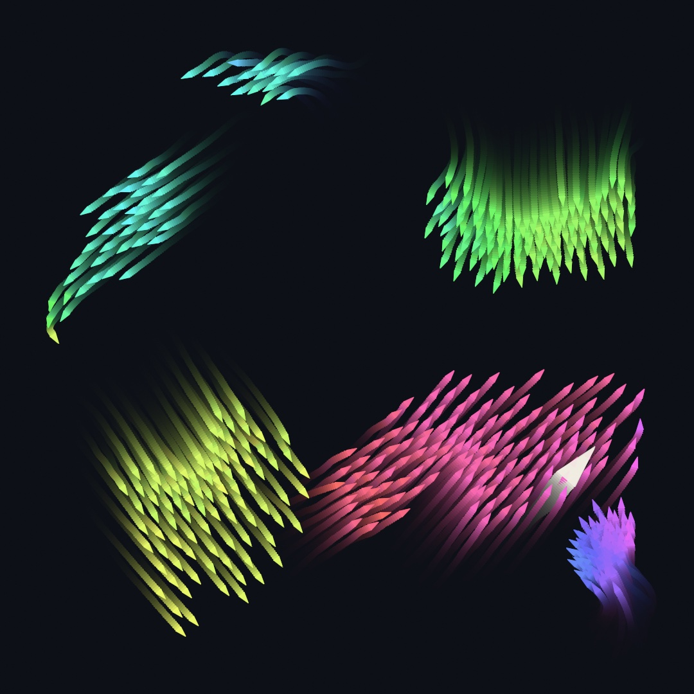

Give a few hundred creatures something to want, let each watch only its neighbors, and a flock appears with nobody in charge. You build one creature that chases, stops, and roams, then give every creature the same three rules about its neighbors. The flock above leaves trails that fade instead of being erased. Other crowds run by a rule come after it: chases that draw curves, walkers that make room, and fireflies falling into step.

Before we start, one word about names. The field calls these creatures *autonomous agents*, a name from decades before "agent" came to mean software with a chat window. It is the name Daniel Shiffman's chapter on them carries. This guide will say creature, boid, and flock. *Boid* is Craig Reynolds' own word, from the flock he first animated in 1986.

## A creature that steers: `Vehicle`

Here is the chase recipe from [Chapter 10](10-Vectors.md) one more time, because the creatures and the flock in this chapter are built from it:

```swift
let desired = (target - position).normalized * maxSpeed
let steer = (desired - velocity).limited(to: maxForce)
```

Work out the velocity you *wish* you had. Subtract the velocity you *have*. Cap the correction, because nothing with mass turns instantly. [Chapter 10](10-Vectors.md#steering-the-chase) drew that move as arrows, with the steer running from the tip of the velocity to the tip of the desired.

Everything a `Vehicle` or a boid does in this chapter is this same move with a different idea of *desired*. Ollin's `Vehicle` and `Boids` are built on that move. A `Vehicle` is a position and a velocity plus those two caps, and every behavior on it returns one of these correction forces:

```swift
let creature = Vehicle(at: Vector2(540, 540), maxSpeed: 4, maxForce: 0.15, seed: 1)

creature.applyForce(creature.seek(mouse))   // any behaviors, any weights
creature.step()                             // then move one step
```

Behaviors don't move the creature. They only return forces, and you decide which to apply and how loudly each one counts (`creature.flee(danger) * 2` counts twice). `step()` adds the sum to the velocity, caps the speed, and moves. It is [Chapter 11](11-ForcesAndPhysics.md)'s force accumulation again, with the forces coming from wants instead of gravity.

One thing is different from [Chapter 10](10-Vectors.md). There is no `deltaTime` here. A `Vehicle`, like `Boids` and the pursuit runners later in the chapter, moves in fixed steps. You call `step()` once per frame, and speeds are in points per step. The trade is deliberate. A stepped simulation repeats. The same seed replays the same run, which is how the figures in this guide, and any sketch you export, can be reproduced at all. The cost is that a dropped frame slows the world down a little instead of skipping ahead, and for creatures that is almost always fine.

> **Swift note.** `creature` is declared with `let` even though it changes every frame. That works because `Vehicle` is a *class*, so the `let` pins which creature the name points at, not what is inside it. You met the same pattern in [Chapter 11](11-ForcesAndPhysics.md) with `World`. Holding one instance and poking it every frame is the house shape for simulations.

## Seek and arrive: aiming at a target and stopping there

`seek` aims at full speed forever, and it never slows. Run it at a fixed target and the creature overshoots, turns around, and shoots through again, forever. `arrive` is the fix. It wants full speed far away but ramps its desired speed down inside a slowing radius, so the creature eases in and parks. Watch both at once. Make `MySketches/ChaseDot.swift`:

```swift
import Ollin

final class ChaseDot: Sketch {
    let seeker = Vehicle(at: Vector2(200, 800), velocity: Vector2(0, -7),
                         maxSpeed: 7, maxForce: 0.15)
    let arriver = Vehicle(at: Vector2(230, 210), velocity: Vector2(0, 7),
                          maxSpeed: 7, maxForce: 0.15)
    let target = Vector2(660, 500)
    var seekTrail: [Vector2] = []
    var arriveTrail: [Vector2] = []

    override func draw() {
        seeker.applyForce(seeker.seek(target))
        arriver.applyForce(arriver.arrive(at: target, slowingRadius: 260))
        seeker.step()
        arriver.step()
        seekTrail.append(seeker.position)
        arriveTrail.append(arriver.position)

        background(Color(hex: 0x101318))

        // The slowing radius the arriver honors.
        noFill()
        stroke(Color(hex: 0x6FD3C7).withAlpha(0.18))
        strokeWeight(2)
        drawCircle(center: target, radius: 260)

        strokeWeight(2.5)
        stroke(Color(hex: 0x6FD3C7).withAlpha(0.6))
        drawPolyline(arriveTrail)
        stroke(Color(hex: 0xF2836B).withAlpha(0.75))
        strokeWeight(3)
        drawPolyline(seekTrail)

        noStroke()
        fill(Color(hex: 0xF2836B))
        drawVehicle(seeker, size: 14)
        fill(Color(hex: 0x6FD3C7))
        drawVehicle(arriver, size: 14)

        noFill()
        stroke(.white)
        strokeWeight(3)
        drawCircle(center: target, radius: 12)
    }
}
```

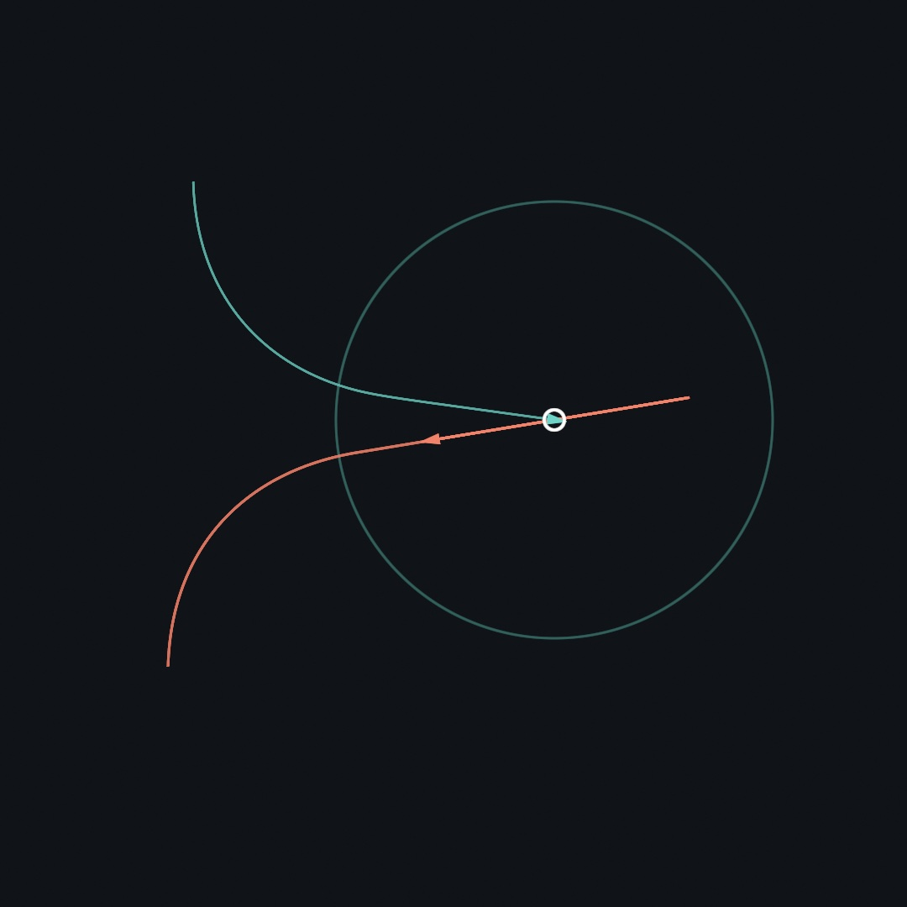

Both creatures launch with the same speed and the same turning cap, and only the wanting differs. The teal arriver bends in, slows, and parks on the dot. The coral seeker swings through it, brakes, comes back, and shoots through again, and its trail past the target is that oscillation drawn. `drawVehicle` draws a triangle pointing along the creature's heading, in the current `fill`.

Both trails here are arrays of positions, appended each frame and drawn with `drawPolyline`, the way [Chapter 10](10-Vectors.md)'s chasers kept theirs. The next section shows the other way to get a trail.

## Roaming: `wander`, and trails from `noClear`

A creature that only seeks needs a target. A behavior that needs no target at all is `wander`, which gives a creature aimless, believable roaming. Adding random turns each step produces nervous jitter rather than a stroll, so the recipe does something else. Picture a circle floating a fixed distance ahead of the creature. The creature seeks a point on that circle's rim, and each step the point slides a little way around the rim, at random:

<picture>
  <source media="(prefers-color-scheme: dark)" srcset="Images/12-FlocksAndSwarms/WanderCircle-dark.jpg">
  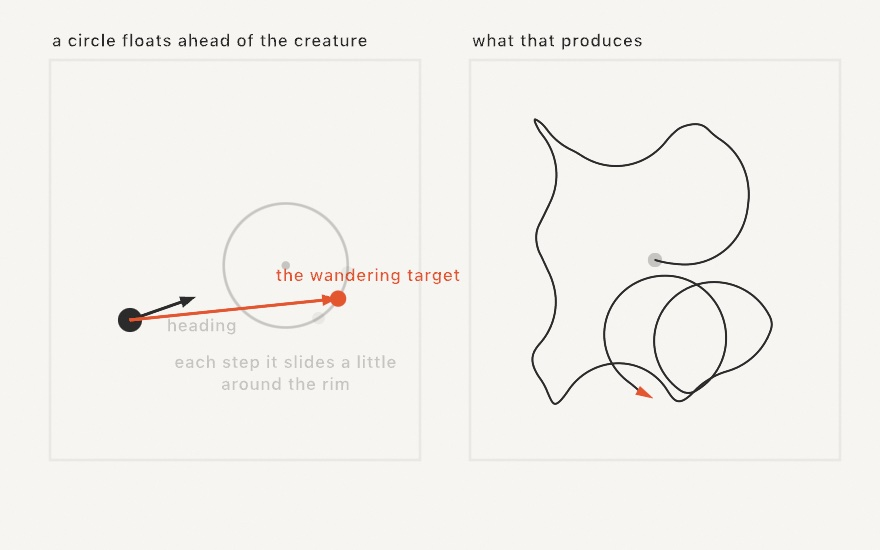
</picture>

Because the target can only slide gradually, the creature's curve bends gradually too, so it remembers roughly where it was going. The jitter amount, the `jitter:` argument, sets the personality. Small values drift in long, calm arcs, and large values get twitchy.

A wanderer shows its character in its trail, and there is a second way to get one that needs no list of positions. [Chapter 9](09-Pictures.md)'s string art already switched clearing off with `noClear()`, and here is what that is for. Every other sketch so far has started `draw()` by wiping the canvas. `noClear()` turns that off, so the canvas keeps everything drawn so far, and *you* decide what fades. Painting a translucent rectangle of the background color over the whole canvas each frame dims the past a little instead of erasing it. Anything that moves grows a tail. Three wanderers, with trails made that way, make `MySketches/Wanderer.swift`:

```swift
import Ollin

final class Wanderer: Sketch {
    var creatures: [Vehicle] = []
    let colors = [Color(hex: 0x6FD3C7), Color(hex: 0xF2B705), Color(hex: 0xF2836B)]

    override func setup() {
        creatures = (0 ..< 3).map { i in
            Vehicle(at: Vector2(540, 340 + Double(i) * 200),
                    velocity: Vector2(angle: Double(i) * 2.1, length: 2),
                    maxSpeed: 4, maxForce: 0.15, seed: i * 3 + 2)
        }
        background(Color(hex: 0x101318))
        noClear()
    }

    override func draw() {
        for creature in creatures {
            creature.applyForce(creature.wander(radius: 30, distance: 90, jitter: 0.25))
            creature.applyForce(creature.contain(in: bounds, margin: 140) * 1.5)
            creature.step()
        }

        // Fade the last frame a little instead of erasing it: trails.
        noStroke()
        fill(Color(hex: 0x101318).withAlpha(0.01))
        drawRect(bounds)

        for (i, creature) in creatures.enumerated() {
            fill(colors[i])
            drawVehicle(creature, size: 14)
        }
    }
}
```

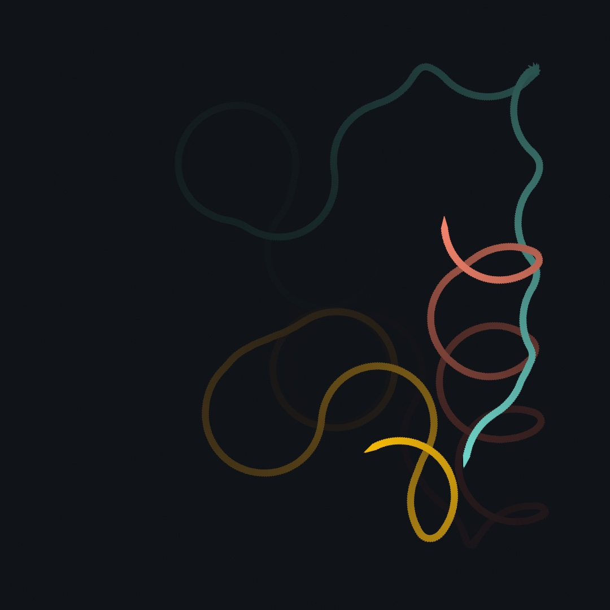

Two behaviors are stacked here, and that is the point of forces that compose. `wander` supplies the roaming and `contain` supplies the walls, a push back inside the canvas that only wakes up within `margin` of an edge. Each creature has its own `seed`, because wander is the one behavior that draws random numbers. Two creatures with the same seed roam in lockstep.

The trails are the `noClear` at work. `background(...)` runs once, in `setup()`, to lay the ground. Then every frame paints the same color over the whole canvas at one percent opacity. Each old triangle fades a little further, and the string of them behind a creature reads as a tail that lasts ten seconds or so. The alpha is the trail's length. Raise it to `0.16` and the tails shorten to a fraction of a second. Lower it to `0.003` and they last half a minute. The finished sketch uses this same trick, and [Chapter 19](19-LayersAndEffects.md) takes the persistent canvas much further, into accumulation and long-exposure looks.

The rest of the behavior shelf works the same way, so a list will do. `pursue` and `evade` chase and dodge a *moving* target. They aim where it will be rather than where it is, the way a cat cuts off a mouse. `follow(path:)` keeps a creature inside a corridor along a polyline, correcting only when it strays. `follow(_ field:)` follows the flow fields coming in [Chapter 14](14-FieldsAndFlow.md). `separate(from:)` keeps personal space within a group, and the flock's first rule below is built on it. The `Motion/Steering` example runs most of the shelf in one scene, and the [steering reference](../Docs/Generators/Steering.md) has every argument.

## Three rules make a flock: separation, alignment, and cohesion

A wanderer roams alone. In 1986 Reynolds set out to animate a flock of birds and found that the flock does not need a choreographer. Give every creature the same three steering rules, let each one see only its nearby neighbors, and flocking happens. Each rule alone is small enough to draw.

**Separation.** Steer away from anyone inside your personal space, and let the closest neighbors push hardest:

<picture>
  <source media="(prefers-color-scheme: dark)" srcset="Images/12-FlocksAndSwarms/RuleSeparation-dark.jpg">
  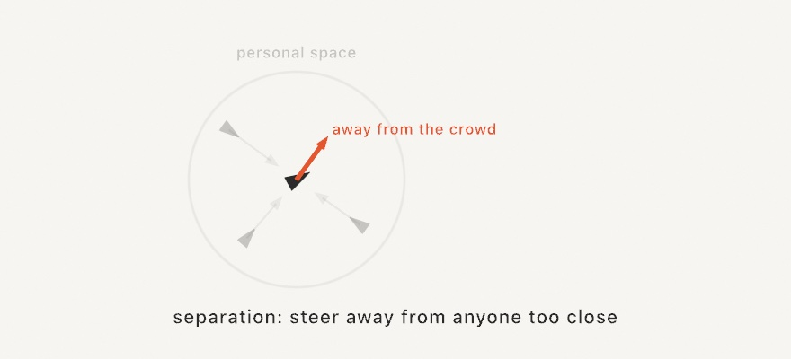
</picture>

**Alignment.** Look at the neighbors you can see, average their headings, and steer to match:

<picture>
  <source media="(prefers-color-scheme: dark)" srcset="Images/12-FlocksAndSwarms/RuleAlignment-dark.jpg">
  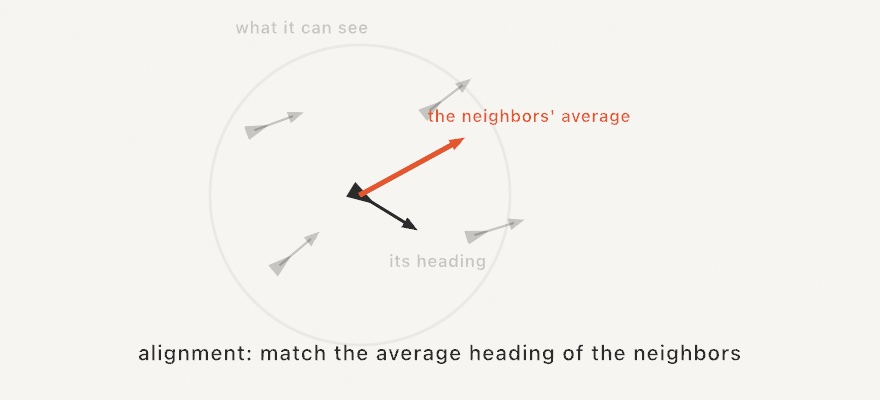
</picture>

**Cohesion.** Find the center of those same neighbors and drift toward it:

<picture>
  <source media="(prefers-color-scheme: dark)" srcset="Images/12-FlocksAndSwarms/RuleCohesion-dark.jpg">
  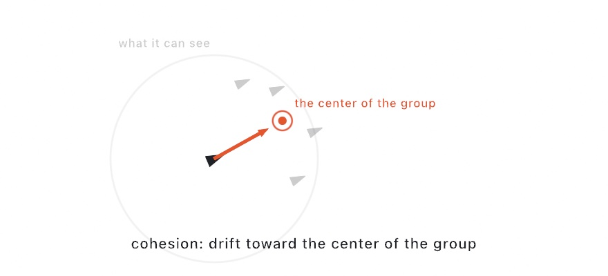
</picture>

Every arrow above is the same steering move from the start of the chapter, and only *desired* changes. The center in the cohesion rule is [Chapter 10](10-Vectors.md)'s average, the neighbors' positions added up and divided by their count. And notice that none of the rules mention the flock. A boid sees a handful of neighbors inside its perception radius and nothing else. No boid knows the flock exists, and the flock happens anyway. That is the pattern this chapter is about, local rules producing global behavior.

Here are the rules switched on one at a time, same creatures, same seed:

<picture>
  <source media="(prefers-color-scheme: dark)" srcset="Images/12-FlocksAndSwarms/RuleMix-dark.jpg">
  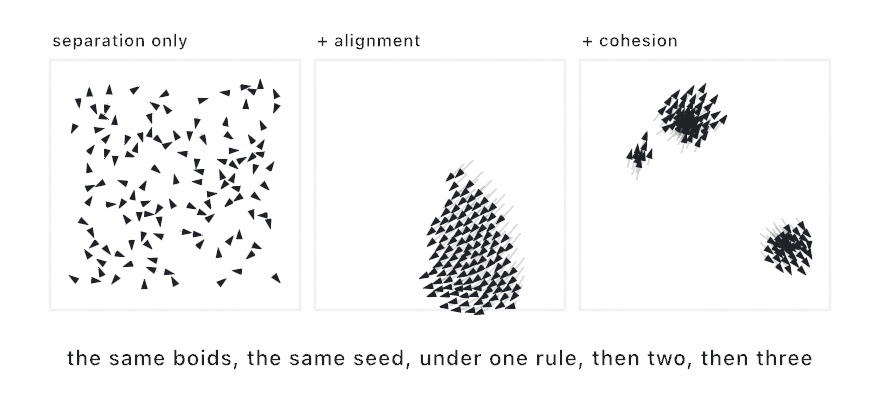
</picture>

Separation alone spaces them evenly, but every heading is private. Add alignment and the headings agree, which makes a school. Add cohesion and the school gathers itself into flocks. Left to right, the panels add one rule at a time.

## The flock, assembled: `Boids`

You could build all of that from `Vehicle` and three loops. It would become slow at a few hundred creatures, because "look at every neighbor" naively means comparing everyone against everyone. Ollin ships the assembled version as `Boids`. It holds the three rules, the perception and personal-space radii, and the edge-turning. Its neighbor search only compares true neighbors, so hundreds of boids stay cheap. It is another stepper you hold:

```swift
var flock: Boids!

override func setup() {
    flock = Boids(count: 520, in: bounds, seed: 7)
}

override func draw() {
    flock.step()
    background(.black)
    fill(.white)
    drawBoids(flock, size: 10)
}
```

The three rule weights (`flock.separation`, `flock.alignment`, `flock.cohesion`) and the two radii are ordinary properties, and tuning them is tuning the flock's temperament. Raise separation and the flock loosens into a crowd keeping polite distance. Raise cohesion and it balls up. Shrink `perceptionRadius` and big flocks fragment into many small ones. There is no right setting. The finished sketch below puts all three on parameters so you can search for your own.

> **Swift note.** `Boids!` declares a property that starts empty and is filled in `setup()`, before anything reads it. The `!` says the sketch promises it will be there, so `flock.step()` needs no unwrapping. The finished sketch below uses the plainer `Boids?` with a `guard let` instead, which fails safely if the promise is ever broken.

### The trick that keeps it cheap: `SpatialIndex`

Ask 300 boids to look at every other boid and you have made 90,000 comparisons this frame. At 3,000 boids it is 9 million, and the window starts to stutter. But nearly all of that work is spent proving that two creatures on opposite sides of the canvas are far apart. So the search stops asking most of them, and the trick is not about flocks at all. Cut the plane into square cells, one perception radius across. Anything closer to you than one radius has to be sitting in your own cell or in one of the eight touching it. Nine cells hold every answer, and the rest of the flock is never measured at all.

<picture>
  <source media="(prefers-color-scheme: dark)" srcset="Images/12-FlocksAndSwarms/NeighborCells-dark.jpg">
  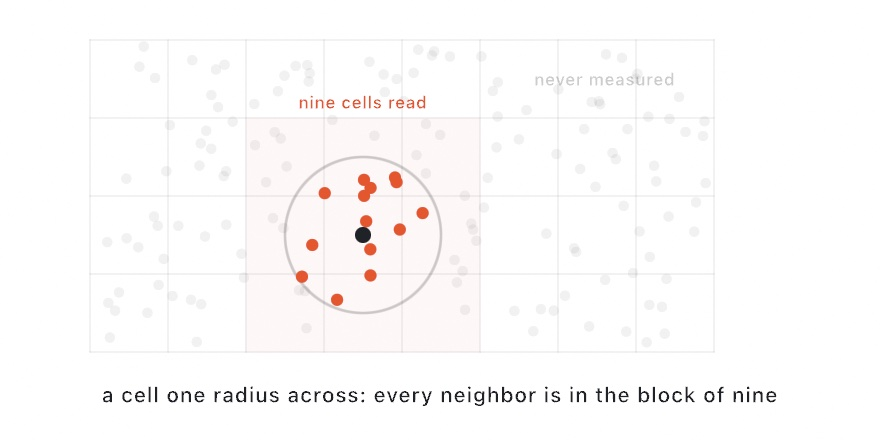
</picture>

Ollin ships that as `SpatialIndex`, and `Boids` is only one of its customers. Hand it points, ask it questions:

```swift
let index = SpatialIndex(points, cellSize: 60)

for i in points.indices {
    index.forEachNeighbor(of: i, within: 60) { j, distanceSquared in
        // j is near i, and you already have the distance squared
    }
}
```

Passing the point's *index* rather than its position leaves the point itself out of its own answer. That is what this kind of loop always wants. It answers two other questions too: `nearest(to:)` for the single closest point, and `indices(in:)` for everything inside a rectangle. Build it fresh each frame when the points move. That costs one pass over them, which is small next to the work it saves.

## Putting it together: the living flock

The sketch at the top of the chapter composes three of the steps. The assembled flock runs with its three rule weights on parameters, and the trails fade the way the wanderers' did. Make `MySketches/Flock.swift`:

```swift
import Ollin

final class Flock: Sketch {
    @Param("Separation", 0...3) var separation = 1.6
    @Param("Alignment", 0...3) var alignment = 1.1
    @Param("Cohesion", 0...3) var cohesion = 0.9

    var flock: Boids?

    override func setup() {
        background(Color(hex: 0x0D1017))
        noClear()
        flock = Boids(count: 520, in: bounds, seed: 7,
                      maxSpeed: 3.6 * scale, maxForce: 0.15 * scale,
                      perceptionRadius: 60 * scale, separationRadius: 24 * scale,
                      margin: 90 * scale)
    }

    override func draw() {
        guard let flock else { return }
        flock.separation = separation
        flock.alignment = alignment
        flock.cohesion = cohesion
        flock.step()

        // Fade the last frame a little instead of erasing it: trails.
        noStroke()
        fill(Color(hex: 0x0D1017).withAlpha(0.16))
        drawRect(bounds)

        let size = 9 * scale
        for i in 0 ..< flock.count {
            let heading = flock.heading(i)
            fill(Color(hue: (heading + .pi) / .tau + 0.55,
                       saturation: 0.58, brightness: 0.97))
            withState {
                translate(flock.positions[i])
                rotate(heading)
                drawTriangle(Vector2(size, 0),
                             Vector2(-size * 0.65, size * 0.5),
                             Vector2(-size * 0.65, -size * 0.5))
            }
        }
    }
}
```

Each boid is a triangle rotated to its heading with [Chapter 6](06-GridsAndRepetition.md)'s transforms. `drawTriangle` takes its three corners, drawn here around the origin so `rotate` turns the whole shape. `.pi` is half a turn, so the hue's sum runs `0...tau` around the wheel. Its hue comes *from* the heading, so color is information. Boids flying the same way share a color. Every band of color in the image is a sub-flock that has agreed on a direction. The fade is `0.16` here where the wanderers used `0.03`. So the tails are short, and the bands read as motion rather than as a drawing of where the flock has been. The flock's speeds and radii are scaled by `scale`, [Chapter 1](01-HelloOllin.md)'s factor, the shorter canvas edge over 1000, so they follow the canvas size. Here is a few seconds of it organizing itself from a random scatter:

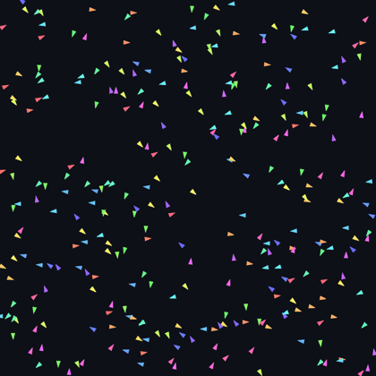

> **Swift note.** `guard let flock else { return }` is the `guard let` [Chapter 9](09-Pictures.md) used, unwrapping the optional into a constant of the same name. The flock is a `var` rather than a `let` handle because `setup()` fills it in after the sketch is made.

Then make it yours:

- Drag the three parameters while it runs. Somewhere around high cohesion and low separation the flock balls up into a swirling knot. High separation with low everything else dissolves it into a polite crowd. Find the edge between flock and crowd.
- Give the flock somewhere to go. Setting `flock.field = curlField(scale: 0.003)` with a small `flock.fieldStrength` sends the whole society drifting along an invisible current (a preview of [Chapter 14](14-FieldsAndFlow.md)).
- Add a predator, one `Vehicle` that pursues the flock's first boid with `creature.pursue(flock.positions[0], velocity: flock.velocities[0])`, drawn large and pale. All the forces compose.
- Swap the triangle for a short line along the velocity, and the sketch stops reading as creatures and starts reading as brushstrokes.

A flock is motion, so keep it as a few seconds of video:

```sh
swift run OllinLive MySketches/Flock.swift --export-video flock.mp4 --seconds 8
```

## Other crowds by rule: pursuit, avoidance, and synchronization

The flock was a crowd run by three local rules, each creature reading its neighbors. Three more crowds belong to the same idea, and the sketch used none of them. In the first, every runner chases another and the paths come out as exact curves. In the second, walkers look ahead and make room for each other instead of pushing. In the third, the agreement is about *when*, where a flock's is about where to go. The second and third run on a clock rather than in steps. So their verb is `advance()`, which moves them one sixtieth of a second by default.

### Everyone chasing somebody: pursuit curves

A pursuit curve is the path of a runner that always heads straight at where its target is *now*, while the target runs too. It is the classic chase. It is the tool for a picture of a chase, since the curves it draws are exact and can be worked out on paper. Pierre Bouguer studied one ship pursuing another in 1732. The version with four runners is from 1877, when Edouard Lucas asked it and Henri Brocard answered it. Four dogs stand at the corners of a square. Each one runs at the next, always at full speed, always straight at where that dog is *now*. What do they draw, and how far does each dog run?

You can answer it by running it. `Pursuit` is a stepper you hold, like `World` in the last chapter and the flock above. Build it, step it, and read the geometry out:

```swift
let chase = Pursuit.ring(sides: 4, center: Vector2(540, 540), radius: 380)
chase.recordEvery = 20   // keep the chase lines along the way
chase.run()              // and run the whole chase now, rather than per frame

// then, in draw():
noFill()
stroke(Color.white.withAlpha(0.15))
strokeWeight(1)
for line in chase.web { drawPolyline(line.points) }
stroke(Color(hex: 0xE4572E))
strokeWeight(3)
for trail in chase.trails { drawPolyline(trail.points) }
```

<picture>
  <source media="(prefers-color-scheme: dark)" srcset="Images/12-FlocksAndSwarms/PursuitDogs-dark.jpg">
  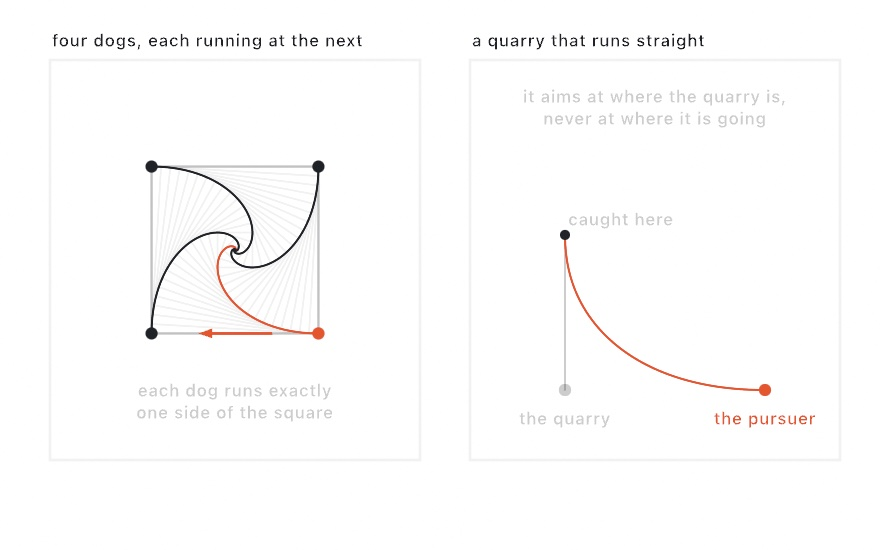
</picture>

Both answers are exact. The dogs draw four identical spirals that meet in the middle, and each dog runs one side of the square, no more. The spiral is there because a dog is always turning, since the dog it wants never stops moving. The angle between a dog's path and the line to the middle never changes. A curve with that property is a logarithmic spiral, the shape a nautilus shell grows in.

One rule holds the figure up, and it is an easy one to get wrong. **Everybody moves at the same moment.** `step()` works out every runner's move from the positions they all held *before* the step. Move them one at a time instead, and each dog runs at a dog that has already left. The square goes lopsided within a few steps and the figure falls apart.

A runner is not a `Vehicle`. It carries no momentum and no turning cap, so it faces its target and goes. Setting `maxTurn` puts the cap back, and gives you a runner that swings wide and overshoots, which is the other kind of chase. A runner that follows nobody holds its heading and runs straight. That is how you write the case on the right of the figure, where a fast pursuer chases a quarry crossing in front of it:

```swift
let chase = Pursuit(runners: [.holding(Vector2(0, -1), from: Vector2(400, 800), speed: 0.55),
                              .chasing(0, from: Vector2(700, 800))],
                    stepSize: 2)
chase.run()
```

That one can be worked out in advance too. A pursuer of speed 1, starting a distance `a` square-on from a quarry of speed `k`, covers `a / (1 - k * k)` before it catches up. Set the quarry's speed to 1 and it is never caught at all. The gap closes to half what it started as, and stays there. Only the quarry runs straight, because it chases nobody. Every chaser curves, because nothing it chases ever stands still. The [pursuit reference](../Docs/Generators/Pursuit.md) has `catchDistance`, a runner's `speed`, and the fixed stride.

### A crowd that makes room: `Crowd`

A `Crowd` is a set of walkers that avoid collisions by looking ahead rather than by pushing. A flock keeps its distance by pushing, since separation only acts once two boids are already too close. So nothing stops a fast boid from sliding into another for a frame. People walking through a crowd look ahead, see a collision coming, and pick a path that misses it. They expect the other person to move a little too. That makes `Crowd` the tool for pedestrians, a room draining through a door, or streams crossing a square. The method is optimal reciprocal collision avoidance. It comes from the 2011 paper "Reciprocal n-Body Collision Avoidance", by Jur van den Berg, Stephen Guy, Ming Lin, and Dinesh Manocha. Their RVO2 library is its reference implementation.

Give each walker a place to go and advance the crowd once a frame:

```swift
let crowd = Crowd()

override func setup() {
    for i in 0 ..< 60 {
        let spot = center + Vector2(angle: Double(i) / 60 * .tau, length: 440)
        crowd.add(at: spot, goal: center - (spot - center))
    }
}

override func draw() {
    crowd.advance()
    background(.white)
    fill(.black)
    drawCrowd(crowd)
}
```

Sixty walkers stand in a ring, and each one wants the spot straight across. Every frame, each walker asks one question about each neighbor: which velocities would bring the two of us together within the next second? Those velocities form a cone. The walker finds the smallest change that gets the pair out of the cone and takes only half of it. It trusts the neighbor to take the other half, and the neighbor, running the same rule, does. Then the walker picks the velocity closest to what it wants that keeps all of those promises at once.

<picture>
  <source media="(prefers-color-scheme: dark)" srcset="Images/12-FlocksAndSwarms/MakingRoom-dark.jpg">
  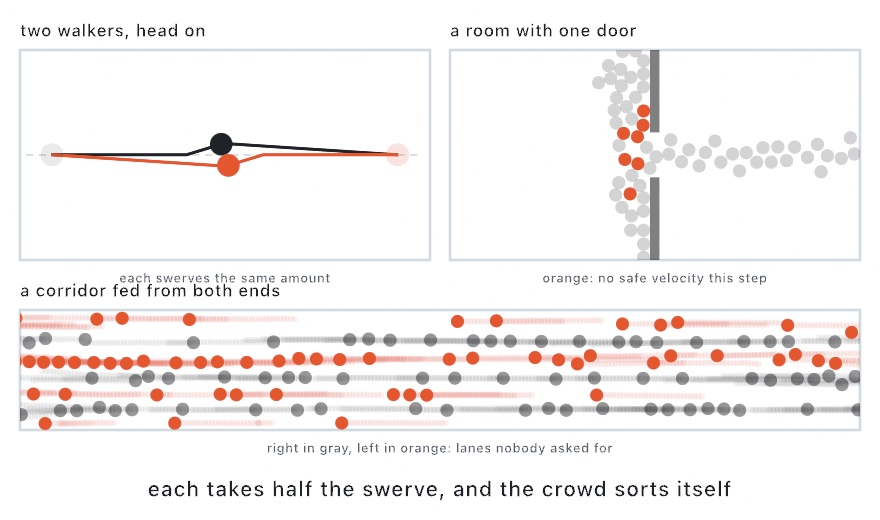
</picture>

The first panel is the half-and-half on its own. Two walkers head straight at each other, and each bows out by the same amount, in opposite directions. They touch at the moment they pass and never overlap. Because both sides move by half, nobody overcorrects, and there is none of the shoving a pushed-apart flock does.

The second panel is where the promise ends. Pack a room and send everyone at one door. Near the door there may be no velocity that keeps a walker clear of everyone around it. Then it takes the velocity that breaks the promises least, and its `isJammed` is true for that frame. That is the only time two walkers can overlap, and then only by a small part of a radius. Walls are stricter. A walker never walks through one, jammed or not. Walls only keep walkers out, though. They don't lead anyone around them. A walker on the wrong side of a wall needs a goal that takes it where it has to go. For a door, that means aiming at the door until you're through:

```swift
crowd.addObstacle(Rectangle(x: 530, y: 0, width: 20, height: 500))
crowd.addObstacle(Rectangle(x: 530, y: 580, width: 20, height: 500))
crowd.preferredVelocity = { walker in
    let p = walker.position
    let target = p.x < 540 ? Vector2(540, 540) : Vector2(1200, p.y)
    return (target - p).normalized * walker.maxSpeed
}
```

`preferredVelocity` replaces every goal with a rule of your own. It is handed each walker, so it can also read `group`, a number you give each walker to use however you like.

> **Swift note.** `crowd.preferredVelocity = { walker in ... }` stores a closure in a property. That is a block of code kept for later, and the crowd runs it once per walker each time it advances. The `return` inside it hands back that walker's answer.

The third panel is the one nobody plans. Feed a corridor from both ends and the two streams sort themselves into lanes. No walker is told to follow anyone. A walker that falls in behind another going its way meets fewer people, and the lanes build up from that. Pedestrians in a busy station do the same thing.

The setting to know is `timeHorizon`. It is how far ahead a walker looks, in seconds, and it starts at one. Look further and walkers turn earlier and more smoothly, until the crowd is dense enough that everyone sees everyone coming at once. Put 96 walkers in that ring and look four seconds ahead, and they stall a third of the way in and never arrive. Look less far and walkers keep straighter and swerve at the last moment. The worked example is [`Examples/Simulation/Crowd`](../Examples/Simulation/Crowd/Sketch.swift), with a door, a corridor, four crossing streams, and the ring.

> **Swift note.** `p.x < 540 ? Vector2(540, 540) : Vector2(1200, p.y)` is the compact `if` from [Chapter 6](06-GridsAndRepetition.md). It picks the door while the walker is left of it, and a point far to the right once it is through.

### Falling into step: `Kuramoto`

A `Kuramoto` is a crowd of oscillators, each running at its own natural pace and each pulled a little toward the phase of the crowd. It models agreement about *when*, where a flock agrees about where to go. It is the tool for fireflies, applause, and anything that blinks or ticks in company. Fireflies along a riverbank in Southeast Asia flash together, thousands of them, with nobody conducting. Crickets fall into a shared chirp. In 1665 Christiaan Huygens noticed that two pendulum clocks on the same wall had come to beat together. They went back to beating together when he disturbed one. Yoshiki Kuramoto wrote the model for all of it in a 1975 conference paper. Steven Strogatz's 2003 book *Sync* made it widely known, fireflies and Huygens's clocks included.

```swift
let sync = Kuramoto(count: 300, coupling: 2, seed: 7)
var spots: [Vector2] = []

override func setup() {
    spots = (0 ..< 300).map { _ in Vector2(random(width), random(height)) }
    noStroke()
}

override func draw() {
    sync.advance()
    background(.black)
    for (i, phase) in sync.phases.enumerated() {
        fill(Color(white: (1 + cos(phase)) / 2))
        drawCircle(center: spots[i], radius: 6)
    }
}
```

Each firefly is a phase, an angle going round, and it glows when the angle comes past the top. The spots are rolled with `_ in`, because a spot does not depend on which firefly it is. `spread` is how different their natural paces are, and `coupling` is the pull. What to watch is the crowd's *coherence*, the order parameter Kuramoto called r. Put every phase on a circle as a dot, average the dots as points, and r is how far that average sits from the center. Scattered dots average to the middle, and r is near 0. Dots bunched together average near the rim, and r is near 1. `sync.coherence` reads it, and `sync.meanPhase` is the direction of the bunch.

<picture>
  <source media="(prefers-color-scheme: dark)" srcset="Images/12-FlocksAndSwarms/Fireflies-dark.jpg">
  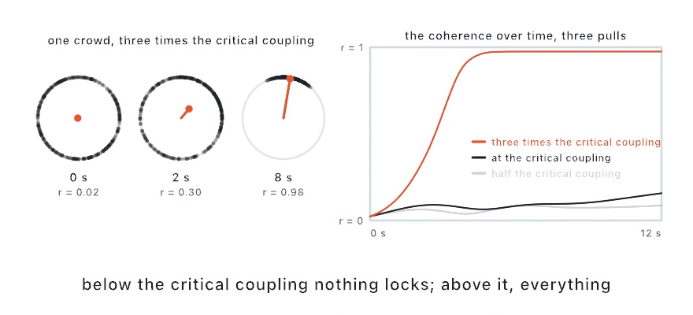
</picture>

The left of the figure is one crowd at three moments, with the pull three times what it needs. The dots start everywhere, gather, and end in a bunch, and the arrow from the center grows with them. The right shows the threshold. Below a critical coupling the crowd never locks, however long it runs, and r wanders near the floor. A little above it a locked group forms and grows, and r climbs toward 1 as the pull rises. Kuramoto worked out where the threshold sits, and `sync.criticalCoupling` names it for the spread you gave the crowd. A slider taken across it is the whole demonstration, because below it the crowd never locks and above it a locked group forms.

The model is cheap in a way a flock is not. Nobody looks at anybody in particular. Each oscillator is pulled toward the crowd's own mean phase. So a frame is one pass over the crowd rather than a neighbor search, and thousands cost nothing you notice. Give it a `range` and each oscillator listens only to its neighbors on a ring instead, which locks locally and can keep a twist. Laid out on a grid, the same agreement gets a geography, which [Chapter 24](24-Automata.md#in-step-with-the-neighbors-oscillators-on-a-lattice) draws. The worked example is [`Examples/Simulation/Kuramoto`](../Examples/Simulation/Kuramoto/Sketch.swift), a meadow of fireflies falling into step.

## Where this comes from

Boids are Craig Reynolds' invention. The 1987 SIGGRAPH paper "Flocks, Herds, and Schools: A Distributed Behavioral Model" introduced the three rules. His 1999 paper "Steering Behaviors for Autonomous Characters" laid out the seek, flee, arrive, wander, and path-following vocabulary this chapter is built on. His term for the creature, *vehicle*, honors Valentino Braitenberg's 1984 book of thought experiments about simple machines with wants. Daniel Shiffman's *The Nature of Code* is where most creative coders meet this material. Its chapters on agents are the long-form treatment to read next. The entries after the sketch name their own sources. Bouguer, Lucas, and Brocard stand behind the chases, van den Berg and his co-authors behind the crowd, and Kuramoto and Strogatz behind the fireflies. Full credits are in the project's [attribution notes](../ATTRIBUTION.md).

## Go deeper

- [Steering](../Docs/Generators/Steering.md): every `Vehicle` behavior and argument, including pursuit, evasion, and path following.
- [Flocking](../Docs/Generators/Boids.md): the full `Boids` reference, including flow-field following.
- [Pursuit](../Docs/Generators/Pursuit.md): the chase as geometry, the ring's four exact facts, and the properties (`maxTurn`, `catchDistance`, the kept chase lines).
- [Crowds](../Docs/Simulation/Crowds.md): the `Crowd` reference, what the walkers promise and where the promise ends, obstacles and walls, and every setting.
- [Coupled oscillators](../Docs/Simulation/Oscillators.md): the `Kuramoto` reference, the order parameter, the critical coupling, the lag, and the ring.
- Appendix B draws this chapter's math, one picture per idea: [Vectors, motion, and forces](B-JustEnoughMath.md#vectors-motion-and-forces), [Local rules, global structure](B-JustEnoughMath.md#local-rules-global-structure).
- Worked examples: [`Examples/Motion/Steering`](../Examples/Motion/Steering/Sketch.swift) (the behavior shelf in one scene), [`Examples/Patterns/Flocking`](../Examples/Patterns/Flocking/Sketch.swift) (a flock without trails), [`Examples/Simulation/Kuramoto`](../Examples/Simulation/Kuramoto/Sketch.swift) (a meadow of fireflies falling into step), and [`Examples/Simulation/Crowd`](../Examples/Simulation/Crowd/Sketch.swift) (a door, a corridor, four crossing streams, and the ring).
- [Spatial index](../Docs/Drawing/SpatialIndex.md): the neighbor search behind the flock, on its own, with the k-d tree for clumped sets and the growing form for sets you build point by point ([`Examples/Shapes/Neighbors`](../Examples/Shapes/Neighbors/Sketch.swift)).
- The Reas homages in [`Examples/Recreations/CaseyReas/`](../Examples/Recreations/CaseyReas/): two written instructions that give elements their behaviors and leave the picture to what the elements do to each other. `Touching` never draws its circles at all, only a line between two of them while they touch, kept forever. `Planes` is a flock made of lines that turn toward what they touch and wander on their own. It carries the lesson this chapter's rules are built on: a behavior that reads every neighbor has to *average* what they ask for. Adding them up makes a crowd pull harder the bigger it gets, and then the flocks gather into three knots and leave the surface bare.
- [Accumulation](../Docs/Drawing/Accumulation.md): what `noClear()` does under the hood, ahead of [Chapter 19](19-LayersAndEffects.md).

---

[Contents](README.md#contents) · Previous: [Chapter 11, Forces and physics](11-ForcesAndPhysics.md) · Next: [Chapter 13, Growing things](13-GrowingThings.md)
