#### <sup>[Ollin](../README.md) → [Guide](README.md) → Chapter 13</sup>

---

# 13. Growing things

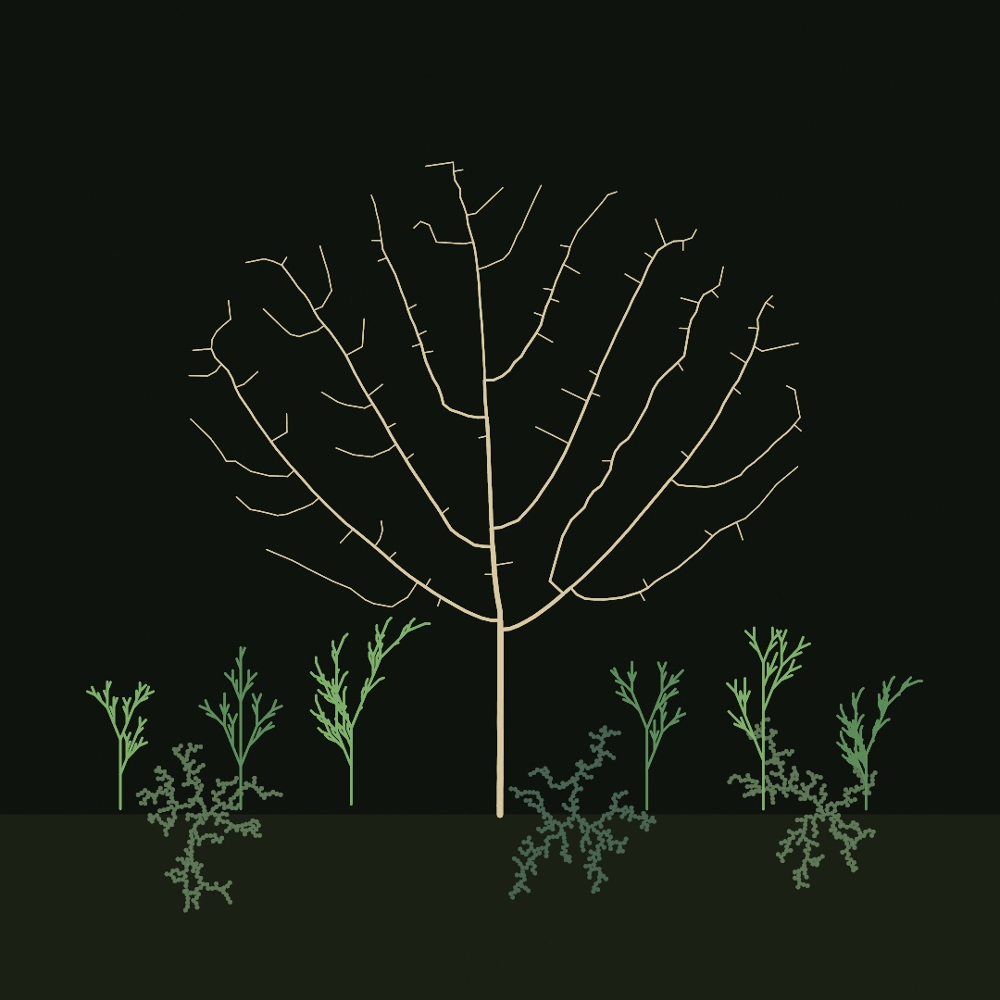

[Chapter 12](12-FlocksAndSwarms.md) grew behavior, and this chapter grows form. Everything in the garden above was grown rather than drawn. The tree claimed its patch of air branch by branch. The plants were written by a grammar that rewrites itself, and the lichen froze into place one wandering particle at a time. Four ways to grow, and by the end you'll have planted all of them in one bed.

## A tree from one rule

Start with the oldest trick there is, a function that calls itself. Draw a trunk. At its top, draw two smaller trees, one tilted left, one tilted right. Each of those draws its own trunk and its own two smaller trees, and so on down, until the trees are too small to bother. Make `MySketches/TreeByHand.swift`:

```swift
import Ollin

final class TreeByHand: Sketch {
    @Param("Angle", 0.1...0.6) var angle = 0.32
    @Param("Shrink", 0.55...0.78) var shrink = 0.7

    override func draw() {
        background(Color(hex: 0x101318))
        stroke(Color(hex: 0xE8DCC0))
        strokeCap(.round)

        withState {
            translate(width / 2, height - 110)
            branch(length: 235, depth: 9)
        }
    }

    func branch(length: Double, depth: Int) {
        guard depth > 0 else { return }
        let sway = sin(time * 0.8 + Double(depth)) * 0.02
        strokeWeight(Double(depth) * 0.9)
        drawLine(0, 0, 0, -length)
        translate(0, -length)
        withState {
            rotate(-angle + sway)
            branch(length: length * shrink, depth: depth - 1)
        }
        withState {
            rotate(angle * 1.15 + sway)
            branch(length: length * shrink, depth: depth - 1)
        }
    }
}
```

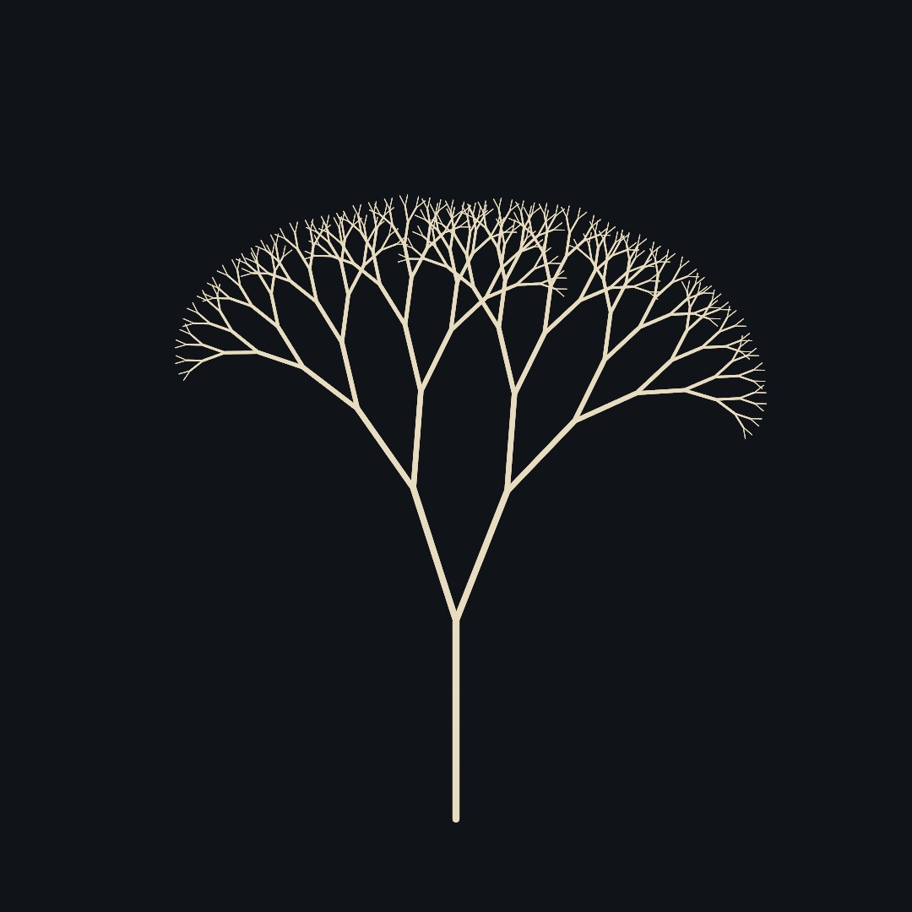

This is **recursion**, a rule applied to its own output. `branch` draws one segment and then asks `branch` to finish the job, twice, smaller. The `depth` counter is what keeps it from asking forever, and `guard depth > 0 else { return }` is the floor it stops on. Nine levels is `2⁹` tips, five hundred twelve of them, out of fourteen lines of code.

Look at where `withState` sits, because it's doing the quiet work. Each branch draws in its own coordinate world, using [Chapter 6](06-GridsAndRepetition.md)'s trick. `translate` walks to the top of the segment just drawn, each `withState { rotate(...) ... }` tilts, recurses, and *puts the transform back* when its block ends. That put-it-back is the whole trick of drawing a tree. The left subtree's thousands of segments may wander anywhere. After it finishes, the pen is back at the fork, facing the way the fork faced, ready for the right subtree. A saved-and-restored state is how every branching drawing in this chapter works, and it's about to get a name from 1968.

The `* 1.15` on the right angle is a small honesty about nature, since perfectly symmetric trees read as diagrams. Drag the two parameters while it runs. `Shrink` near 0.78 grows old oaks, and `Angle` near 0.15 grows poplars.

> **Swift note.** A method can call itself by name, no ceremony needed. The one rule is that something must change on the way down (here `depth - 1`) so a call eventually stops. Each call gets its own copy of `length` and `depth`, which is why the left subtree's shrinking doesn't disturb the right's.

## Rules that rewrite

In 1968 the biologist Aristid Lindenmayer wanted to describe how plants grow, and wrote it as a grammar. You start from a short string of symbols, and each season, rewrite every symbol by a fixed rule, all at once. The strings these **L-systems** produce turn into drawings through a turtle, which reads the final string left to right as pen commands. `F` means draw forward. `+` and `-` mean turn by the system's angle. `[` means *save the pen's position and heading*, and `]` means *put it back*. It is the same save-and-restore you just met as `withState`, spelled as punctuation.

Here's the guide's plant grammar, rewritten one, two, three, and four times:

<picture>
  <source media="(prefers-color-scheme: dark)" srcset="Images/13-GrowingThings/LSystemExpansion-dark.jpg">
  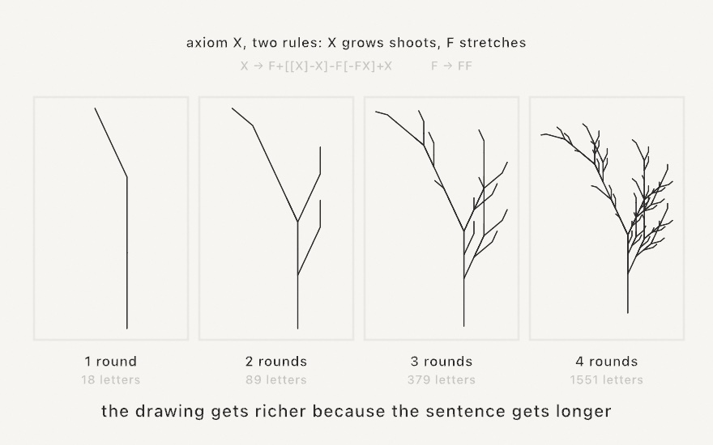
</picture>

Nothing about the drawing code changes between panels. The drawing gets richer because the *sentence* gets longer. Every `X` in the string sprouts the whole shoot pattern each round, so eighteen letters become fifteen hundred in four rewrites. Growth by rewriting is exponential, which is exactly how a twig's worth of rule makes a tree's worth of structure.

Ollin ships the grammar machine as `LSystem`, thirteen classic presets, and a turtle that returns ordinary contours. Drawing one is a line:

```swift
import Ollin

final class Fern: Sketch {
    override func draw() {
        background(Color(hex: 0x101318))
        stroke(Color(hex: 0x9AD9A0))
        strokeWeight(1.6)
        strokeCap(.round)
        drawLSystem(.plant, iterations: 5)
    }
}
```

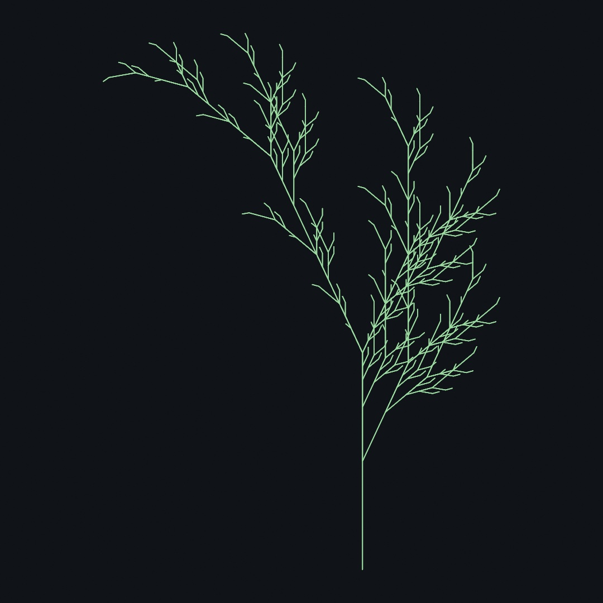

`drawLSystem` fits the grown form to the canvas and strokes it. Its sibling `lSystem(...)` returns the contours instead, for when you want to place, color, or export them yourself, as the garden does. A grammar of your own is one constructor, so `LSystem(axiom: "F", rules: ["F": "F+F-F-F+F"], angle: 90)` is the Koch curve. The [L-systems reference](../Docs/Generators/LSystem.md) lists the whole preset shelf, from `.dragonCurve` to `.hilbertCurve`.

One more idea turns plants into *populations*. Give a symbol several possible rewrites, and let a seeded roll pick one each time it's rewritten. `.randomPlant` does this. Every plant grown from the same grammar is a different individual with the same species' look. [Chapter 4](04-Randomness.md)'s promise holds here. Because the rolls come from your `seed`, the same seed grows the same garden, down to the last twig.

## When the rules need arithmetic

Look again at what that turtle can say. `F` is one step, always the same step. A plain grammar chooses *which* symbols come next and nothing else. So every length it draws is a whole multiple of that one step, and `F → FF` does not make a longer segment. It makes two of them.

Usually that is fine. Sometimes it is the thing in your way. A real branch is a *fraction* of the one below it. A real trunk is thick at the base and fine at the tips. Neither of those is a count of steps.

**Parametric** L-systems let a symbol carry numbers. `F(3)` means go forward three. `A(1.5)` is a bud that knows how big it is. The rules then do arithmetic on those numbers:

```
A(s)  :  s > 0.02  ->  F(s)[+A(s*0.5)][-A(s*0.5)]
```

Read that left to right. When a bud `A` is longer than a hundredth, draw a segment its own length, then fork into two buds, each half as long. When it is *not* longer, no rule matches it. A symbol no rule matches is left alone, so that bud simply stops. Growth ends because the arithmetic ran out, not because you counted the rounds.

<picture>
  <source media="(prefers-color-scheme: dark)" srcset="Images/13-GrowingThings/CarryingNumbers-dark.jpg">
  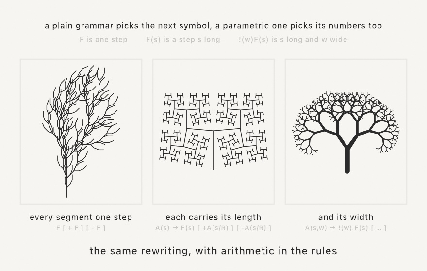
</picture>

In Ollin that rule is one string, and the whole system is one value:

```swift
let branch = ParametricLSystem(
    axiom: "A(1)",
    rules: ["A(s) : s > 0.02 -> F(s)[+A(s*0.5)][-A(s*0.5)]"],
    angle: 30)

stroke(Color(hex: 0x9AD9A0))
strokeWeight(1.6)
drawLSystem(branch, iterations: 8)
```

`drawLSystem` and `lSystem(...)` are the same calls you just used. They take either kind of system.

The third panel needs one more symbol. `!(w)` sets the pen width. `[` and `]` put it back along with the position, so a thin twig never thins the trunk holding it. To see those widths, draw the system `tapered`:

```swift
strokeWeight(14)
drawLSystem(.taperedTree(), iterations: 10, tapered: true)
```

Widths arrive as multiples of `strokeWeight`, scaled so the widest is exactly 1. So `strokeWeight` sets the trunk and every twig follows from it. Behind that, a tapered system comes back as the `StrokeMark`s of [Chapter 15](15-ShapesAsMaterial.md) rather than as plain contours.

A plain grammar counts. A parametric one measures. The [reference](../Docs/Generators/LSystem.md#parametric) has the rest. It covers the arithmetic it accepts, weighted rules for stochastic growth, and a shelf of presets from the botany literature.

## Rules over shapes, not symbols

An L-system rewrites a sentence, and a turtle turns the finished sentence into a picture. The picture is downstream of the words. In 1971 George Stiny and James Gips asked the obvious next question: what if the rules worked on the shapes themselves?

That is a **shape grammar**. Every piece of the design is a shape with a label, and a rule says what one label turns into. Here is a whole grammar, and it is one sentence long. *A cell becomes two cells, parted by a straight line drawn between two of its edges, with the two parts about equal in area.*

Notice what the sentence leaves out. It does not say which edges, or where along them. So the rule stands for every design it could make, rather than for one drawing:

```swift
let frame = Rectangle(center: center, width: 880, height: 880)
let lattice = ShapeGrammar.iceRay(in: frame, minArea: 7_000)

noFill(); stroke(.white); strokeWeight(2)
for cell in lattice.run(generations: 9, seed: 7) {
    drawPolyline(cell.corners, closed: true)
}
```

<picture>
  <source media="(prefers-color-scheme: dark)" srcset="Images/13-GrowingThings/CutAndCutAgain-dark.jpg">
  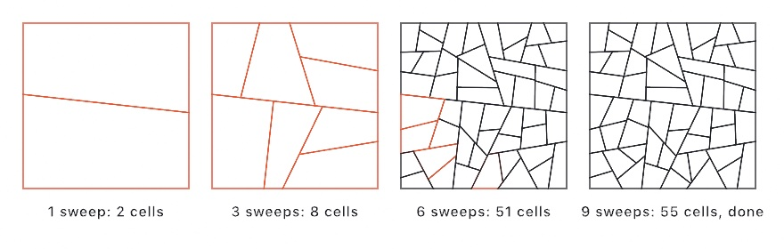
</picture>

A sweep offers every cell to the rule at once, the way a rewrite replaces every symbol at once. But watch the warm color drain away. `minArea` says how small a cell must get before the rule leaves it alone, so the run finishes on its own. That is the real difference between the two kinds of rewriting. Symbols can always be rewritten again, so an L-system grows forever. Shapes are rewritten in place, so a shape grammar runs out of room.

One arithmetic fact sits behind this whole family. It is worth knowing, because it saves you from writing rules down. The cut meets two edges away from their ends. So it hands one new corner to each part at each end, and every corner the cell had lands in exactly one part. Whatever the cell was, **the two parts carry four more corners between them than the cell had**. Now say that the parts may only have three, four, or five corners. A triangle can then only become a triangle and a quadrilateral. A quadrilateral can only become a triangle and a pentagon, or two quadrilaterals. A pentagon can only become a quadrilateral and another pentagon. A hexagon has exactly one legal cut. A shape with seven corners has none at all, so it is finished however large it is. Nobody writes those rules. They are what is left once you name the corner range.

That is the grammar behind ice-ray lattices, the Chinese window frames whose bars look like cracks in river ice. Stiny worked them out in 1977, from a catalogue of real lattices. The artisan's own method is the run you just watched: divide the area into large and equal spots, then keep dividing until the pieces are the size you wanted.

A finished design is just an array of pieces, so it feeds straight back in as the start of another grammar. That is how a lattice gets its wood. One rule cuts the frame into cells. A second takes the middle out of every cell, leaving a bar of even width all the way round:

```swift
let cells = lattice.run(generations: 9, seed: 7)
let panes = ShapeGrammar(start: cells,
                         rules: [.inset("cell", by: 7, into: "pane")])
    .run(generations: 1, seed: 0)
```

Cutting is not the only move. `split` slices a piece at fractions of its width or height, which is all a building front is: a wall becomes floors, a floor becomes windows, a window becomes a pane. `nested` puts a smaller turned copy of a piece inside itself, the oldest figure in the family. The [reference](../Docs/Generators/ShapeGrammar.md) has the rest, including how weight picks between two rules that name the same label.

## Growth by crowding: differential growth

The neighborly rules that steer a flock in [Chapter 12](12-FlocksAndSwarms.md) work just as well on geometry that is not going anywhere. Take a closed ring of points. Every step, pull each point toward its neighbors along the line (the line doesn't want to tear), push it away from *every* point that comes near (the line doesn't want to touch itself), and whenever a segment stretches too long, split it in the middle so the line gains a point. That's the whole algorithm. It's called differential growth, and it turns a circle into coral:

<picture>
  <source media="(prefers-color-scheme: dark)" srcset="Images/13-GrowingThings/GrowthStrip-dark.jpg">
  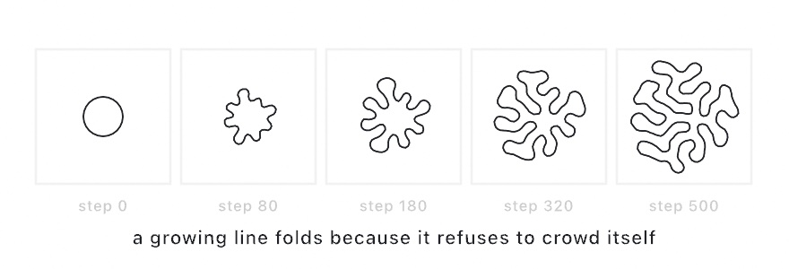
</picture>

The folding isn't decoration; it's the only shape a growing line can take when it refuses to crowd itself. The same tension between attraction and repulsion that spaced the boids now sculpts geometry. Make `MySketches/Coral.swift`:

```swift
import Ollin

final class Coral: Sketch {
    let growth = DifferentialGrowth.ring(
        center: Vector2(540, 540), radius: 80, count: 40, seed: 7,
        maxSegmentLength: 8, repulsionRadius: 16, growthRate: 0.9,
        bounds: Rectangle(x: 70, y: 70, width: 940, height: 940))

    override func draw() {
        growth.step(4)

        background(Color(hex: 0x101318))
        noFill()
        stroke(Color(hex: 0x9AD9CE))
        strokeWeight(2.2)
        strokeJoin(.round)
        drawPolygon(growth.nodes)
    }
}
```

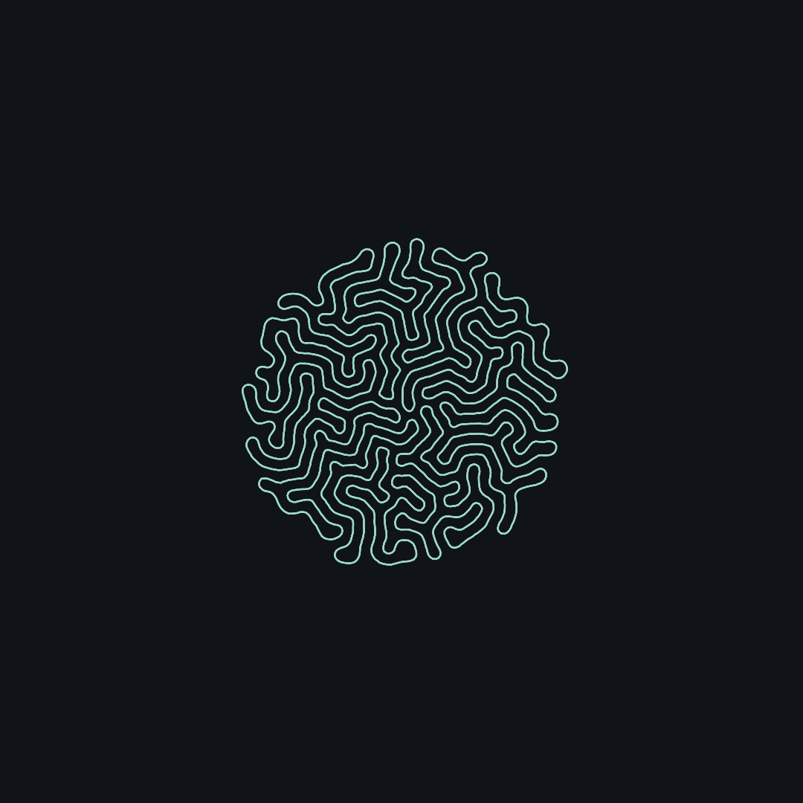

Run it live and you can watch the folds negotiate for room in real time. `growth.nodes` is an ordinary point list and `growth.contour` an ordinary contour, so the grown line can be filled, offset, exported for a pen plotter, anything [Chapter 15](15-ShapesAsMaterial.md) will do to geometry. Grown forms are made of the same points as drawn ones.

## Growth that claims space: space colonization

Grammars grow blind, and the fern doesn't know where the canvas ends or where its own leaves already are. The next grower looks before it grows. Scatter *attraction points* over the region you want filled, plant a root, then repeat three moves. Every attractor pulls on the closest branch tip within its reach. Every pulled tip grows one small step toward the average of its pulls. Every attractor a branch reaches is consumed, so its pull disappears and the growth moves on:

<picture>
  <source media="(prefers-color-scheme: dark)" srcset="Images/13-GrowingThings/ClaimingSpace-dark.jpg">
  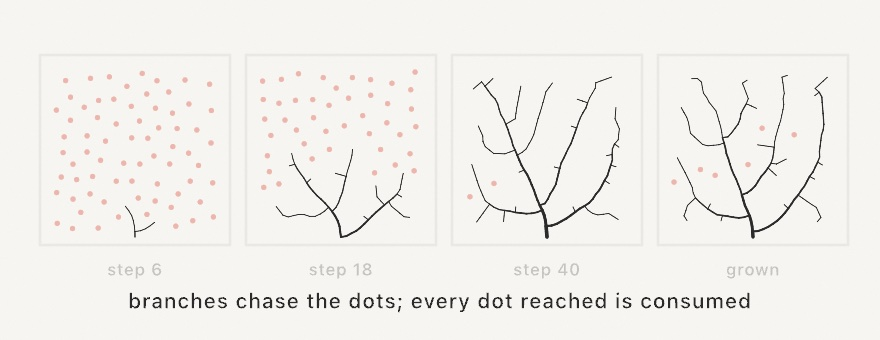
</picture>

This is **space colonization**, and it grows the most convincing veins, roots, and trees in generative art. It grows the way real veins do, reaching toward unclaimed space and never doubling back into crowded territory. In Ollin it's `SpaceColonization`, another stepper you hold (the [Chapter 12](12-FlocksAndSwarms.md) shape):

```swift
let veins = SpaceColonization(attractors: poissonDisk(radius: 26),
                              roots: [Vector2(width / 2, height - 70)])
```

`poissonDisk` is doing the scattering, and it returns an even, organic sprinkle of points, no two closer than the radius you ask for. [Chapter 15](15-ShapesAsMaterial.md) looks inside it, and for now it's a bag of well-spread points. The growth itself has no randomness at all. Same attractors, same roots, same veins, every run.

Three distances shape the result, and they want a particular relationship. `stepLength` is how far a tip grows per step, and `killRadius` is how close counts as reached. Keep `stepLength` smaller than `killRadius`, or a tip can step right over its goal. Keep `killRadius` well under `influenceRadius`, which is how far an attractor's pull reaches. There's one practical gotcha. Growth only *starts* if some attractor's pull can reach a root. A tree whose crown floats high above its root needs an `influenceRadius` at least as long as the trunk-to-crown gap. The garden's tree hit exactly this.

The last touch is weight. `thicknesses(tipWidth:exponent:)` gives every node a stroke width by the pipe model. Tips are hairline, and every fork is as thick as its children can justify, the way a real trunk carries its crown. The `Patterns/Venation` example grows a whole leaf's veins this way, live.

## Growth by chance: DLA

The third grower has no goals at all. Freeze one particle in the middle. Release a random walker from somewhere far away and let it wander. The moment it touches the frozen cluster it freezes too, and the next walker sets out:

<picture>
  <source media="(prefers-color-scheme: dark)" srcset="Images/13-GrowingThings/FrozenWalkers-dark.jpg">
  
</picture>

That's the entire algorithm, and it's called **diffusion-limited aggregation** (DLA). The shape it grows is not an accident. A wandering particle almost always bumps into a *tip* before it can thread its way into a hollow, so tips grow and hollows starve. Frost on a window, minerals crystallizing in stone, and coral all play this game, which is why the clusters look instantly familiar.

```swift
let cluster = DiffusionLimitedAggregation(seeds: [center], seed: 7)

override func draw() {
    cluster.step(12)          // a dozen new arrivals per frame
    background(.black)
    fill(.white)
    noStroke()
    drawCircles(cluster.positions, radius: 3)
}
```

Because particles freeze in arrival order, `cluster.particles[i]` froze `i`-th, and tinting by index paints the cluster's whole life story as rings of color. Each particle also remembers which particle it stuck to, so `segments` gives the branching skeleton as plain lines. `stickiness` below `1` lets walkers slide deeper before freezing, giving denser, mossier clusters. Seeding a *row* of points instead of one center grows frost creeping up from an edge. The `Patterns/Dendrite` example is the ring-tinted version.

## Growth by voltage: dielectric breakdown

DLA's walkers are secretly measuring something. Where walkers arrive often, an electric field would be strong too. The **dielectric breakdown model** drops the walkers and measures the field directly. Hold the discharge at one voltage and the surroundings at another, solve the field between them, and grow where it's strongest. This is how a spark decides, and it's the physics burned into wood and acrylic as Lichtenberg figures.

<picture>
  <source media="(prefers-color-scheme: dark)" srcset="Images/13-GrowingThings/VoltageChooses-dark.jpg">
  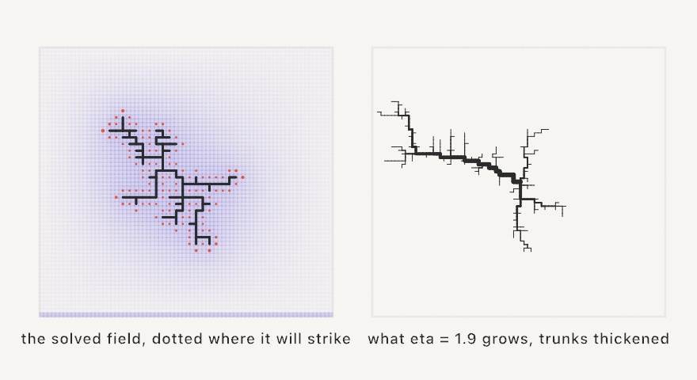
</picture>

One number runs the show. Every frontier cell's chance to grow is the local field raised to `eta`, and that exponent is a character dial DLA never had. At `1` you're back to DLA's furry bushes. Near `2` the favorites win so hard the figure turns sparse and jagged, which is the lightning regime. Higher still approaches a single channel.

```swift
let bolt = DielectricBreakdown(seeds: [center], in: bounds, seed: 7)

override func draw() {
    bolt.step(6)               // the field settles as it grows
    background(.black)
    stroke(.white)
    for (a, b) in bolt.segments { drawLine(a, b) }
}
```

It's the same stepper shape as the others, with three gifts on top. `thicknesses(tipWidth:exponent:)` thickens trunks toward the seed, the way a real discharge brightens its main channel. `branches()` hands back whole channels as polylines, ready for smoothing or a plotter. And `potential(at:)` reads the solved field itself, so the glow around the figure can be drawn from the same physics that grew it. The `Patterns/Lichtenberg` example watches one arc to the rim.

## Growth by collision: crack growth

The fourth grower makes cities. Start three straight cracks moving across the canvas, each remembering its angle in a grid as it goes. A crack that reaches a cell holding some *other* angle has met an older line. It stops there. Then it restarts perpendicular to a random point on the existing pattern, and one more crack joins the population:

<picture>
  <source media="(prefers-color-scheme: dark)" srcset="Images/13-GrowingThings/CrackedCity-dark.jpg">
  
</picture>

Every stop is a birth, so the map only gets busier. The cracks stay perpendicular to their parents, which is why the picture reads as streets and blocks instead of a tangle. `CrackGrowth` is the stepper, and it hands you geometry rather than pixels:

```swift
let field = CrackGrowth(width: 1080, height: 1080, seed: 7)

override func setup() { noClear() }

override func draw() {
    if frameCount == 1 { background(.white) }
    for mark in field.step(4) {
        fill(Color.black.withAlpha(0.33))
        drawPoint(mark.point)
    }
}
```

`noClear()` keeps every frame's marks on the canvas, so the picture is the accumulation, the same trick the chance games below use. Each `mark` also carries a wash: the open span beside the crack, plus a `gain` that drifts up and down. `CrackGrowth.grains(from:to:gain:)` turns that span into translucent grains crowded against the line, and one ink per `mark.crack` colors each street. The `Patterns/Cracks` example is the full painting.

## Growth by wandering: meander

The fifth grower is a river. Water on the outside of a bend runs faster, so it eats that bank away. Water on the inside runs slower, so it drops the sand it carries. The bend deepens. And because each bend is pushed by the water that entered it upstream, the whole train of bends slides downstream as it grows. The river turns hardest where the water arrived already turning.

<picture>
  <source media="(prefers-color-scheme: dark)" srcset="Images/13-GrowingThings/WanderingRiver-dark.jpg">
  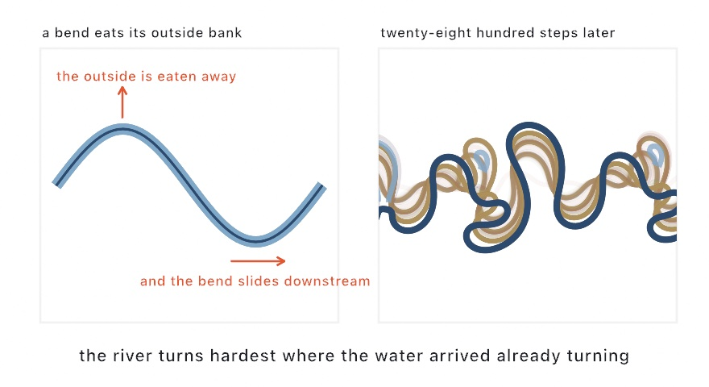
</picture>

Let it run and a loop eventually pinches shut. The river takes the shortcut, and the abandoned loop is left beside it as a crescent lake. `Meander` is the stepper, and like the others it hands you geometry:

```swift
// Starting far off-canvas makes the canvas a window on a longer river.
let river = Meander.line(from: Vector2(-700, 620), to: Vector2(1160, 480),
                         seed: 7, width: 26, recordEvery: 40)

override func draw() {
    river.step(2)
    background(Color(hex: 0xF2ECDD))
    noFill(); stroke(Color(hex: 0x2C4A6E)); strokeWeight(river.width)
    drawPolyline(river.centerline)
}
```

`centerline` is the river now. `oxbows` holds the lakes it has cut off, each fading away over time. And `recordEvery` keeps a copy of the channel every forty steps in `scars`. Draw those under the water in fading inks, and the picture becomes a map of everywhere the river has ever been. Only the starting waves are random: the migration itself is the same every run, so the seed *and the frame you stop at* pick the picture. The `Patterns/Meander` example is the full map.

## Every neighbor must agree: Wave Function Collapse

The last technique in this chapter grows nothing, strictly speaking, but it belongs with the growers because its results read as one organism. Wave Function Collapse fills a grid from a small set of tiles under one law. Neighboring tiles must agree along their shared edge. Each tile declares a *socket* per edge, pipe or blank in the classic set. The solver keeps every cell's options open, repeatedly settling the most-constrained cell and propagating what that choice forbids:

<picture>
  <source media="(prefers-color-scheme: dark)" srcset="Images/13-GrowingThings/TilesAgree-dark.jpg">
  
</picture>

Building the tileset is most of the work, and it's pleasantly declarative. A tile is its four edge sockets, in the order top, right, bottom, left. `rotations()` mints the turned variants, and a `weight` makes a tile more or less common:

```swift
let blank = WFCTile([0, 0, 0, 0], weight: 1.1)
let line = WFCTile([1, 0, 1, 0], weight: 1.5).rotations(2)
let elbow = WFCTile([1, 1, 0, 0], weight: 1.2).rotations(4)
let tee = WFCTile([1, 1, 1, 0], weight: 0.5).rotations(4)
let tiles = [blank] + line + elbow + tee

let grid = wfc(tiles: tiles, columns: 11, rows: 11)   // [[Int]] of tile indices
```

`wfc` is seeded like everything else. `drawWFC` walks the solved grid cell by cell, handing you the tile index to draw. The figure above draws a stroke from each cell's center to every edge whose socket is `1`. That is the entire renderer for a pipe network. One draw block covers a tile *and* its rotations, because you draw from the sockets, not from a picture per tile. The `Patterns/WaveFunctionCollapse` example re-rolls a fresh legal network every few seconds.

## Or hand it a picture instead: overlapping WFC

Declaring tiles and sockets is most of the work, and some textures don't come apart into tiles at all. So there's a second way to run the same solver. Give it a small picture and let it work the rules out itself.

It cuts the sample into every little square the sample contains, counts how often each one turns up, and notes which squares can overlap which. Then it fills a much larger grid so that every overlap agrees. The guarantee is this: **every square of the result is a square the sample already contained.**

<picture>
  <source media="(prefers-color-scheme: dark)" srcset="Images/13-GrowingThings/LearnedFromAPicture-dark.jpg">
  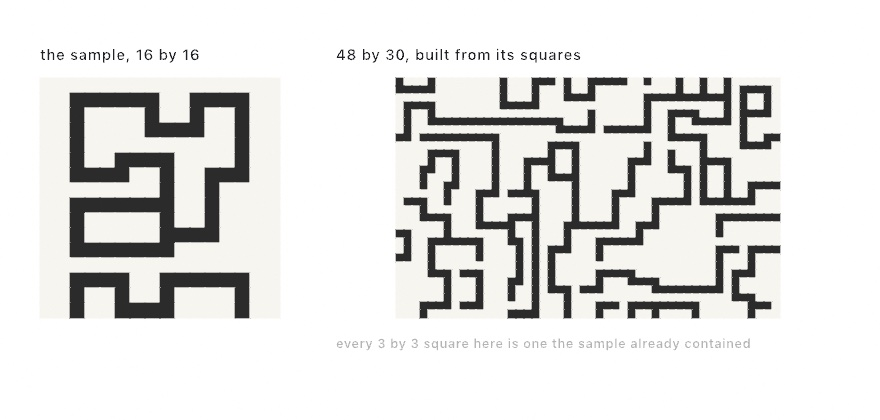
</picture>

The sample is sixteen pixels square. You pass it in and ask for a size:

```swift
let texture = wfc(from: sample, width: 48, height: 30)   // an Image, or nil
```

Three parameters matter. `patternSize` is how big those squares are. `2` keeps only the loosest sense of the sample. `3` is the usual answer and holds on to corners and junctions. Larger reproduces whole motifs, but leaves less room to invent. `symmetry` decides whether the turned and mirrored copies of the sample are learned too. That multiplies what the solver has to work with, but it costs you which way is up. A sample of flowers standing on ground wants `symmetry: .none`, or they'll come back sideways. And `wrapsSample` decides whether the sample is read as joining its own edges. It is on by default, and it is the one that surprises people, because it joins the bottom row to the top. Ground under sky becomes a legal square, and your ground repeats in bands up the picture. Turn it off for a sample with a real top and bottom.

Two constraints matter. The sample has to be **small and few-colored**, because squares are matched by exact color. Hand it a photograph and every square is unique, so there's nothing to recombine. And a solve **can fail**. It may paint itself into a corner where some cell has no square that fits, in which case it starts over. Past roughly fifty pixels a side, that starts happening often enough to matter. `wfc` hands back `nil` when it gives up. The general problem is NP-hard, and the tilesets that can never fail tend to be the ones too loose to produce interesting structure.

The `Patterns/TextureSynthesis` example has three samples authored right in its source as rows of characters, so you can edit one and watch the texture change.

## Putting it together: a garden

Time to plant everything at once. The garden grows three systems in one bed, and one `seed(5)` at the top makes the whole thing a single reproducible organism. Make `MySketches/Garden.swift`:

```swift
import Ollin

final class Garden: Sketch {
    private var tree: SpaceColonization?
    private var plants: [[Contour]] = []
    private var tufts: [DiffusionLimitedAggregation] = []
    private let groundY = 880.0

    override func setup() {
        seed(5)

        // The tree wants the air inside an oval crown above the trunk.
        let crown = Vector2(540, 430)
        let attractors = poissonDisk(in: Rectangle(x: 190, y: 180, width: 700, height: 520),
                                     radius: 24).filter { p in
            let dx = (p.x - crown.x) / 350, dy = (p.y - crown.y) / 260
            return dx * dx + dy * dy < 1
        }
        // The influence radius must reach the crown from the root, or the
        // trunk never starts growing.
        tree = SpaceColonization(attractors: attractors, roots: [Vector2(540, groundY)],
                                 influenceRadius: 280, killRadius: 20, stepLength: 10)

        // A row of plants, each a stochastic L-system in its own patch.
        for (i, x) in [130.0, 260, 400, 700, 830, 950].enumerated() {
            let height = 150 + Double((i * 37) % 90)
            let patch = Rectangle(x: x - 70, y: groundY - height, width: 140, height: height)
            let preset: LSystem = i % 3 == 2 ? .bush : .randomPlant
            plants.append(lSystem(preset, iterations: 4, in: patch, padding: 6))
        }

        // Lichen tufts, half-buried where they were seeded.
        for x in [220.0, 620, 890] {
            tufts.append(DiffusionLimitedAggregation(
                seeds: [Vector2(x, groundY)], particleRadius: 2.2,
                maxParticles: 280, seed: UInt64(x)))
        }
    }

    override func draw() {
        guard let tree else { return }
        tree.step()
        for tuft in tufts { tuft.step(4) }

        background(Color(hex: 0x0F130D))

        // The soil.
        noStroke()
        fill(Color(hex: 0x1A2014))
        drawRect(Rectangle(x: 0, y: groundY, width: width, height: height - groundY))

        // Lichen.
        for (i, tuft) in tufts.enumerated() {
            fill(Color(hex: i % 2 == 0 ? 0x66805E : 0x4E6B57).withAlpha(0.85))
            drawCircles(tuft.positions, radius: 2.2)
        }

        // Plants, in two greens.
        noFill()
        strokeCap(.round)
        strokeWeight(2.4)
        for (i, plant) in plants.enumerated() {
            stroke(Color(hex: i % 2 == 0 ? 0x7FB069 : 0x5C8D5A))
            for contour in plant { drawPolyline(contour.points) }
        }

        // The tree, weighted by the pipe model.
        let widths = tree.thicknesses(tipWidth: 1.1, exponent: 2.4)
        stroke(Color(hex: 0xD9C9A0))
        for (i, node) in tree.nodes.enumerated() {
            guard let parent = node.parent else { continue }
            strokeWeight(widths[i])
            drawLine(tree.nodes[parent].position, node.position)
        }
    }
}
```

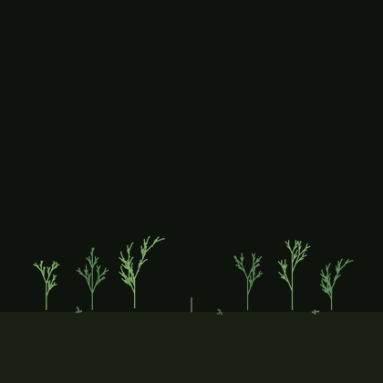

The plants finish growing before the first frame, because rewriting is instant and it's just strings. The tree and the lichen grow in front of you. That's the honest shape of each algorithm. Grammars produce, and steppers *live*. Watch the trunk set off upward with no attractor consumed yet, pulled by the whole crown at once.

> **Swift note.** `filter` keeps the elements that pass a test, so the crown is carved out of a rectangular scatter by keeping only points inside an oval. Like `map` before it, it reads left to right: take the scatter, keep what passes.

Then make it yours:

- Re-roll the world by changing `seed(5)`, and every plant, branch, and tuft becomes a new individual of the same species.
- Add seasons. Tint the tree's tips by their thickness, where thin means young, and the garden gets spring growth. Or fade the plants' green toward ochre for autumn.
- Let the lichen win by raising the tufts' `maxParticles` to a few thousand, and the ground becomes a carpet slowly swallowing the plant stems.
- Grow the tree around an obstacle by cutting a hole in the attractor scatter, with another `filter`. The crown will politely grow around the missing space, with no extra code.
- Make a hanging garden. Flip the tree's root to the top edge and the crown ellipse below it, and gravity reverses without a single physics line.

## Where this comes from

L-systems are Aristid Lindenmayer's 1968 invention. Their visual language comes from *The Algorithmic Beauty of Plants* (1990), written with Przemyslaw Prusinkiewicz. It is still free to read online and still beautiful. The parametric form is that book's section 1.10. James Hanan's 1992 dissertation, from the same group, works it out more fully. The tapered trees and the leaves are their published figures. Space colonization is by Adam Runions, Brendan Lane, and Prusinkiewicz at the University of Calgary's Algorithmic Botany group. The paper is "Modeling Trees with a Space Colonization Algorithm" (2007), after their 2005 leaf-venation work. Diffusion-limited aggregation was described by the physicists Thomas Witten and Leonard Sander in 1981. Generative artists have been growing frost with it ever since. The crack growth is Jared Tarbell's *Substrate*, from 2003. It ran as a Processing applet on his site complexification.net. Its city-block subdivisions are among the best-known images of early generative art. The wandering river is Alan Howard and Thomas Knutson's 1984 simulation. They showed that curvature felt from upstream is enough to make a channel meander. Zoltán Sylvester's meanderpy carries the model in working code. Robert Hodgin's 2020 *Meander* turned it into procedural maps of rivers that never existed, in the manner of Harold Fisk's 1944 Mississippi maps. Shape grammars are George Stiny and James Gips's, from their 1971 paper on specifying painting and sculpture by rule. The lattice grammar follows Stiny's 1977 study of Chinese ice-ray window designs, which he wrote from Daniel Sheets Dye's 1949 catalogue of the lattices themselves. Wave Function Collapse is Maxim Gumin's 2016 algorithm, named with a physicist's wink. The tile-and-socket form here is its simple-tiled model.


## Go deeper

- [Differential growth](../Docs/Generators/DifferentialGrowth.md): the resample spacing, the three forces, and the grown line as ordinary geometry.
- [L-systems](../Docs/Generators/LSystem.md): the grammar type, the turtle alphabet, all thirteen presets, and the [parametric](../Docs/Generators/LSystem.md#parametric) form with its rule language, weighted rules, and botany-literature presets.
- [Space colonization](../Docs/Generators/SpaceColonization.md): every parameter, plus recipes for venation, lightning, and multi-root plantings.
- [Diffusion-limited aggregation](../Docs/Generators/DiffusionLimitedAggregation.md): stickiness, cages, and drawing the skeleton.
- [Dielectric breakdown](../Docs/Generators/DielectricBreakdown.md): the eta regimes, ground as a rim or as electrodes, channel polylines and pipe widths, and reading the field back.
- [Crack growth](../Docs/Generators/CrackGrowth.md): the stepper, the marks and the wash, and the plotter path through `segments`.
- [Meander](../Docs/Generators/Meander.md): the migration mechanism step by step, every parameter, and drawing the oxbows and scars.
- [Wave Function Collapse](../Docs/Generators/WaveFunctionCollapse.md): sockets, weights, rotations, learning from a picture instead, and what to do when a solve fails.
- [Shape grammars](../Docs/Generators/ShapeGrammar.md): all six rules, how a run picks between them, the fallback a weight of zero writes, and the two facts that hold exactly.
- [Blue noise](../Docs/Generators/BlueNoise.md): the even scatter the tree's crown was carved from, properly explained in [Chapter 15](15-ShapesAsMaterial.md).
- Appendix B draws this chapter's math, one picture per idea: [Local rules, global structure](B-JustEnoughMath.md#local-rules-global-structure).
- Worked examples: [`Examples/Patterns/LSystem`](../Examples/Patterns/LSystem/Sketch.swift) (the preset contact sheet), [`Examples/Patterns/ParametricLSystem`](../Examples/Patterns/ParametricLSystem/Sketch.swift) (the parametric one, including a tapered tree), [`Examples/Patterns/Venation`](../Examples/Patterns/Venation/Sketch.swift), [`Examples/Patterns/Dendrite`](../Examples/Patterns/Dendrite/Sketch.swift), [`Examples/Patterns/Cracks`](../Examples/Patterns/Cracks/Sketch.swift), [`Examples/Patterns/Meander`](../Examples/Patterns/Meander/Sketch.swift) (the river and its map of scars), [`Examples/Patterns/ShapeGrammar`](../Examples/Patterns/ShapeGrammar/Sketch.swift) (an ice-ray window frame built a sweep at a time), [`Examples/Patterns/WaveFunctionCollapse`](../Examples/Patterns/WaveFunctionCollapse/Sketch.swift), [`Examples/Patterns/TextureSynthesis`](../Examples/Patterns/TextureSynthesis/Sketch.swift), [`Examples/Patterns/IteratedFunctions`](../Examples/Patterns/IteratedFunctions/Sketch.swift), [`Examples/Patterns/FractalFlame`](../Examples/Patterns/FractalFlame/Sketch.swift), [`Examples/Patterns/InversionFractal`](../Examples/Patterns/InversionFractal/Sketch.swift), and [`Examples/Patterns/Kleinian`](../Examples/Patterns/Kleinian/Sketch.swift).

---

[Contents](README.md#contents) · Previous: [Chapter 12, Flocks and swarms](12-FlocksAndSwarms.md) · Next: [Chapter 14, Fields and flow](14-FieldsAndFlow.md)
