#### <sup>[Ollin](../README.md) → [Guide](README.md) → Chapter 13</sup>

---

# 13. Growing things

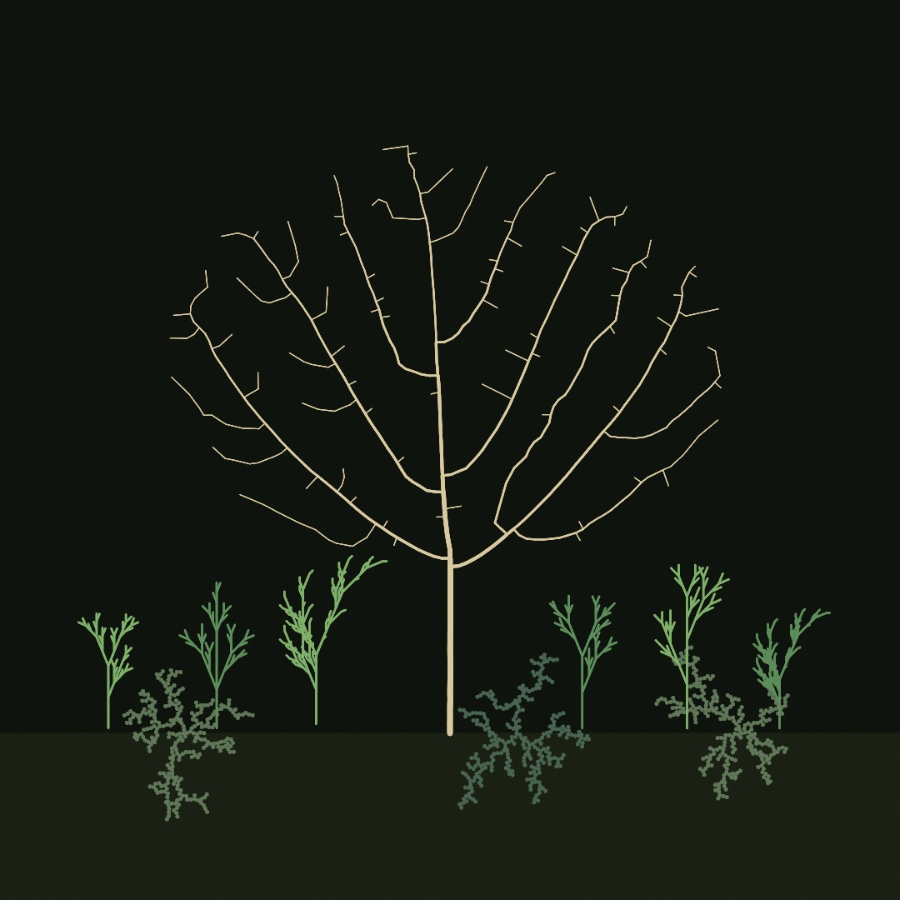

Trees grow branch by branch and frost crystal by crystal, and a sketch can grow a form from a rule the same way. This chapter teaches a function that calls itself, a grammar that rewrites a sentence, growth toward open space, and walkers that freeze where they touch. Everything in the garden above was grown one of those ways. After the garden come rules over shapes, a line that folds as it crowds, cracks that make cities, and a river that wanders.

## A tree from one rule: recursion

Start with a function that calls itself. Draw a trunk. At its top, draw two smaller trees, one tilted left, one tilted right. Each of those draws its own trunk and its own two smaller trees. It goes on down until the trees are too small to see. Make `MySketches/TreeByHand.swift`:

```swift
import Ollin

final class TreeByHand: Sketch {
    @Param("Angle", 0.1...0.6) var angle = 0.32
    @Param("Shrink", 0.55...0.78) var shrink = 0.7

    override func draw() {
        background(Color(hex: 0x101318))
        stroke(Color(hex: 0xE8DCC0))
        strokeCap(.round)

        withState {
            translate(width / 2, height - 110)
            branch(length: 235, depth: 9)
        }
    }

    func branch(length: Double, depth: Int) {
        guard depth > 0 else { return }
        let sway = sin(time * 0.8 + Double(depth)) * 0.02
        strokeWeight(Double(depth) * 0.9)
        drawLine(0, 0, 0, -length)
        translate(0, -length)
        withState {
            rotate(-angle + sway)
            branch(length: length * shrink, depth: depth - 1)
        }
        withState {
            rotate(angle * 1.15 + sway)
            branch(length: length * shrink, depth: depth - 1)
        }
    }
}
```


This is **recursion**, a rule applied to its own output. `branch` draws one segment and then asks `branch` to finish the job, twice, smaller. The `depth` counter is what keeps it from asking forever, and `guard depth > 0 else { return }` is the floor it stops on. Nine levels is two hundred fifty-six tips on five hundred and eleven segments, from one short function.

Look at where `withState` sits. Each branch draws in its own coordinate world, using [Chapter 6](06-GridsAndRepetition.md)'s moving paper. `translate` walks to the top of the segment just drawn. Each `withState { rotate(...) ... }` tilts, recurses, and puts the transform back when its block ends. Restoring the state is what makes a tree drawable. The left subtree's hundreds of segments may wander anywhere. After it finishes, the pen is back at the fork, facing the way the fork faced, ready for the right subtree. Every branching drawing in this chapter rests on a saved-and-restored state.

The `* 1.15` on the right angle is there because a perfectly symmetric tree reads as a diagram. Drag the two parameters while it runs. `Shrink` near 0.78 grows old oaks, and `Angle` near 0.15 grows poplars.

> **Swift note.** A method can call itself by name, with nothing extra to declare. The one rule is that something must change on the way down (here `depth - 1`) so a call eventually stops. Each call gets its own copy of `length` and `depth`, which is why the left subtree's shrinking doesn't disturb the right's.

## Rules that rewrite: L-systems

The tree above is one rule, written as code. In 1968 the biologist Aristid Lindenmayer wanted to describe how plants grow, and he wrote the rules as a grammar instead. You start from a short string of symbols, and each season you rewrite every symbol by a fixed rule, all at once. The strings these **L-systems** produce turn into drawings through a turtle, which reads the final string left to right as pen commands. `F` means draw forward. `+` and `-` mean turn by the system's angle. `[` means *save the pen's position and heading*, and `]` means *put it back*. It is the same save-and-restore you just met as `withState`, spelled as punctuation.

Here is Ollin's `.plant` preset, rewritten one, two, three, and four times:

<picture>
  <source media="(prefers-color-scheme: dark)" srcset="Images/13-GrowingThings/LSystemExpansion-dark.jpg">
  
</picture>

Nothing about the drawing code changes between panels. The drawing gets richer because the *sentence* gets longer. Every `X` in the string sprouts the whole shoot pattern each round, so one letter becomes fifteen hundred in four rewrites. Growth by rewriting is exponential, which is how a twig's worth of rule makes a tree's worth of structure.

Ollin ships the grammar machine as `LSystem`, thirteen classic presets, and a turtle that returns ordinary contours. Drawing one is a line:

```swift
import Ollin

final class Fern: Sketch {
    override func draw() {
        background(Color(hex: 0x101318))
        stroke(Color(hex: 0x9AD9A0))
        strokeWeight(1.6)
        strokeCap(.round)
        drawLSystem(.plant, iterations: 5)
    }
}
```

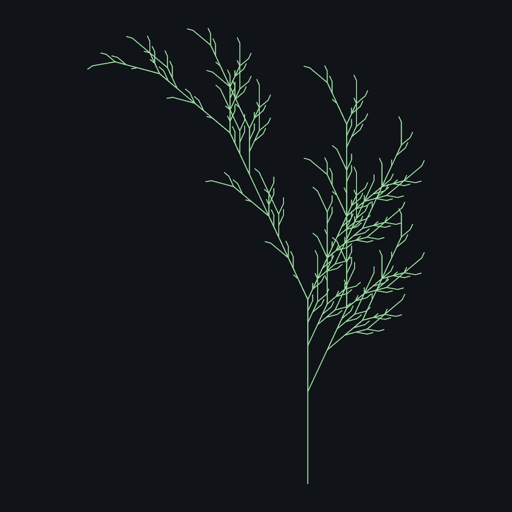

`drawLSystem` fits the grown form to the canvas and strokes it. Its sibling `lSystem(...)` returns the contours instead, for when you want to place, color, or export them yourself, as the garden does. A grammar of your own is one constructor. `LSystem(axiom: "F", rules: ["F": "F+F-F-F+F"], angle: 90)` is a Koch curve. Its rules are a table pairing each symbol with its replacement, written in the brackets [Chapter 8](08-Words.md) used for a font's axes. The [L-systems reference](../Docs/Generators/LSystem.md) lists the whole preset shelf, from `.dragonCurve` to `.hilbertCurve`.

One more idea turns plants into *populations*. Give a symbol several possible rewrites, and let a seeded roll pick one each time it is rewritten. `.randomPlant` does this. Every plant grown from the same grammar is a different individual with the same species' look. The rolls come from your `seed`, so the same seed grows the same garden, down to the last twig, as [Chapter 4](04-Randomness.md) promised.

### When the rules need arithmetic: parametric L-systems

Look again at what that turtle can say. `F` is one step, always the same step. A plain grammar chooses *which* symbols come next and nothing else. So every length it draws is a whole multiple of that one step, and `F → FF` does not make a longer segment. It makes two of them.

Usually that is fine. Sometimes it is what stops you. A real branch is a *fraction* of the one below it. A real trunk is thick at the base and fine at the tips. Neither of those is a count of steps.

**Parametric** L-systems let a symbol carry numbers. `F(3)` means go forward three. `A(1.5)` is a bud that knows how big it is. The rules then do arithmetic on those numbers:

```
A(s)  :  s > 0.02  ->  F(s)[+A(s*0.5)][-A(s*0.5)]
```

Read that left to right. When a bud `A` is longer than 0.02, draw a segment its own length, then fork into two buds, each half as long. When it is *not* longer, no rule matches it. A symbol no rule matches is left alone, so that bud stops. Growth ends because the arithmetic ran out, not because you counted the rounds.

<picture>
  <source media="(prefers-color-scheme: dark)" srcset="Images/13-GrowingThings/CarryingNumbers-dark.jpg">
  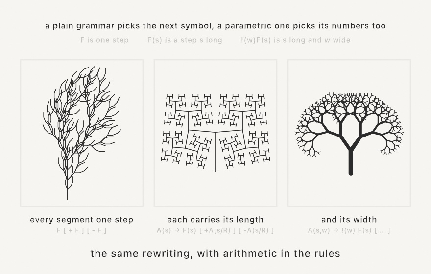
</picture>

In Ollin that rule is one string, and the whole system is one value:

```swift
let branch = ParametricLSystem(
    axiom: "A(1)",
    rules: ["A(s) : s > 0.02 -> F(s)[+A(s*0.5)][-A(s*0.5)]"],
    angle: 30)

stroke(Color(hex: 0x9AD9A0))
strokeWeight(1.6)
drawLSystem(branch, iterations: 8)
```

`drawLSystem` and `lSystem(...)` are the calls you just met. They take either kind of system.

The third panel needs one more symbol. `!(w)` sets the pen width. `[` and `]` put it back along with the position, so a thin twig never thins the trunk holding it. To see those widths, draw the system `tapered`:

```swift
strokeWeight(14)
drawLSystem(.taperedTree(), iterations: 10, tapered: true)
```

Widths arrive as multiples of `strokeWeight`, scaled so the widest is 1. So `strokeWeight` sets the trunk and every twig follows from it. Behind that, a tapered system comes back as the `StrokeMark`s of [Chapter 17](17-MarksAndMedia.md) rather than as plain contours.

A plain grammar counts. A parametric one measures. The [reference](../Docs/Generators/LSystem.md#parametric) has the rest. It covers the arithmetic it accepts, weighted rules for stochastic growth, and a shelf of presets from the botany literature.

## Growth that claims space: space colonization

A grammar grows blind. The fern does not know where the canvas ends or where its own leaves already are, so it cannot fill a shape you hand it. The next grower looks before it grows. Scatter *attraction points* over the region you want filled, plant a root, then repeat three moves. Every attractor pulls on the closest branch node within its reach. Every pulled node grows one small step toward the average of its pulls. Every attractor a branch reaches is consumed, so its pull disappears and the growth moves on:

<picture>
  <source media="(prefers-color-scheme: dark)" srcset="Images/13-GrowingThings/ClaimingSpace-dark.jpg">
  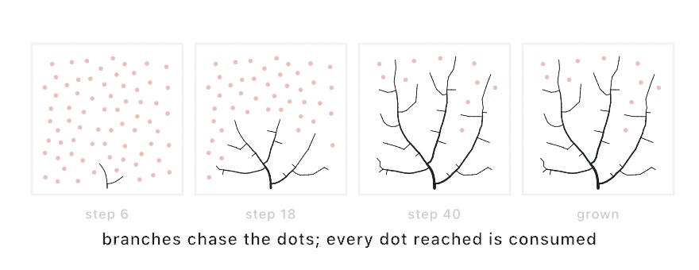
</picture>

This is **space colonization**. It grows the way veins and roots do, reaching toward unclaimed space and never doubling back into crowded territory. In Ollin it is `SpaceColonization`, a stepper you hold the way [Chapter 12](12-FlocksAndSwarms.md) held its flock. Make `MySketches/Veins.swift`:

```swift
import Ollin

final class Veins: Sketch {
    var veins: SpaceColonization?

    override func setup() {
        seed(7)
        let region = bounds.inset(by: .all(90))
        veins = SpaceColonization(attractors: poissonDisk(in: region, radius: 26),
                                  roots: [Vector2(width / 2, height - 70)],
                                  influenceRadius: 170, killRadius: 22, stepLength: 11)
    }

    override func draw() {
        guard let veins else { return }
        veins.step()

        background(Color(hex: 0x101318))

        // The attractors nothing has reached yet.
        noStroke()
        fill(Color(hex: 0x3A4A3A))
        drawCircles(veins.attractors, radius: 3)

        // The veins, thick where they carry many branches.
        let widths = veins.thicknesses(tipWidth: 1.4, exponent: 2.2)
        stroke(Color(hex: 0xBFE8C2))
        strokeCap(.round)
        for (i, node) in veins.nodes.enumerated() {
            guard let parent = node.parent else { continue }
            strokeWeight(widths[i])
            drawLine(veins.nodes[parent].position, node.position)
        }
    }
}
```

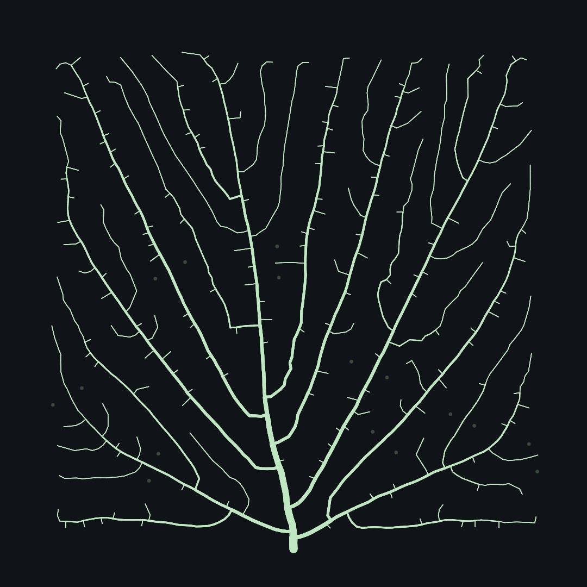

Run it and the veins set out from the bottom edge, fork into every open pocket, and slow down as the last attractors are consumed. `poissonDisk` does the scattering. It is the blue-noise scatter from [Chapter 4](04-Randomness.md#chance-spread-evenly-blue-noise-and-low-discrepancy-sequences), an even sprinkle of points no two closer than the radius you ask for. `bounds.inset(by: .all(90))` keeps it a margin in from the canvas edge, and `drawCircles` draws one dot per point in the list. The scatter needs `seed(7)`, which runs in `setup()`, so the stepper is built there too. That is why the property starts empty and `guard let` unwraps it each frame, as [Chapter 12](12-FlocksAndSwarms.md) did with its flock. The growth itself draws no random numbers at all. Same attractors, same root, same veins, every run.

Three distances shape the result, and they must stand in a particular order. `stepLength` is how far a tip grows per step, and `killRadius` is how close counts as reached. Keep `stepLength` smaller than `killRadius`, or a tip can step right over its goal. Keep `killRadius` well under `influenceRadius`, which is how far an attractor's pull reaches. One thing stops growth before it starts. Growth only begins if some attractor's pull can reach a root. A tree whose crown floats high above its root needs an `influenceRadius` at least as long as the trunk-to-crown gap. The garden's tree needs this.

The last part of the listing is weight. `thicknesses(tipWidth:exponent:)` gives every node a stroke width by the pipe model. Tips are hairline, and every fork is as thick as its children can justify, the way a trunk carries its crown. Each `node` knows its `parent`, so the loop draws one segment from parent to child at the child's width. The `Patterns/Venation` example grows a whole leaf's veins this way, live.

## Growth by chance: diffusion-limited aggregation

The veins grew toward goals. Frozen walkers have no goals at all. Freeze one particle in the middle. Release a random walker from somewhere far away and let it wander. The moment it touches the frozen cluster it freezes too, and the next walker sets out:

<picture>
  <source media="(prefers-color-scheme: dark)" srcset="Images/13-GrowingThings/FrozenWalkers-dark.jpg">
  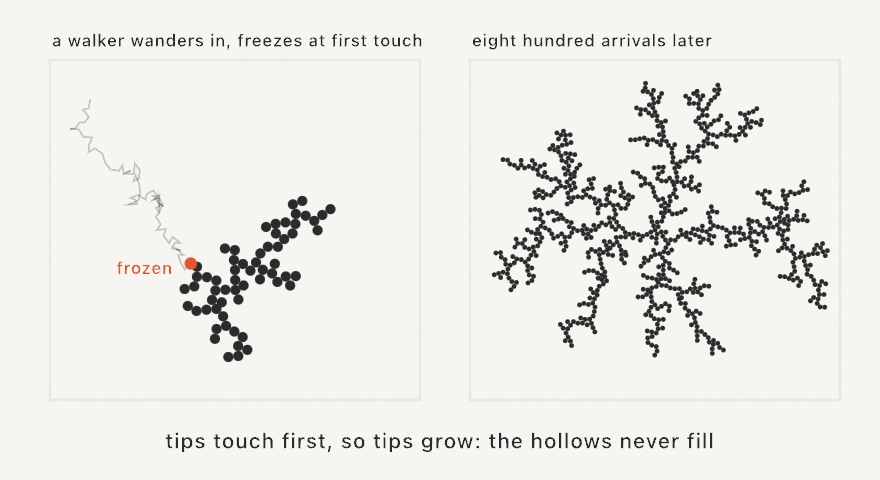
</picture>

That is the entire algorithm, and it is called **diffusion-limited aggregation** (DLA). The shape comes from one bias. A wandering particle almost always bumps into a *tip* before it can thread its way into a hollow, so tips grow and hollows starve. Frost on a window, minerals crystallizing in stone, and coral all grow this way.

```swift
var cluster: DiffusionLimitedAggregation!

override func setup() {
    cluster = DiffusionLimitedAggregation(seeds: [center], seed: 7)
}

override func draw() {
    cluster.step(12)          // a dozen new arrivals per frame
    background(.black)
    fill(.white)
    noStroke()
    drawCircles(cluster.positions, radius: 3)
}
```

Because particles freeze in arrival order, `cluster.particles[i]` froze `i`-th, and tinting by index paints the cluster's history as rings of color. Each particle also remembers which particle it stuck to, so `segments` gives the branching skeleton as plain lines. `stickiness` below `1` lets walkers slide deeper before freezing, giving denser, mossier clusters. Seeding a *row* of points instead of one center grows frost creeping up from an edge. The `Patterns/Dendrite` example is the ring-tinted version.

### Growth by voltage: dielectric breakdown

Where DLA's walkers arrive most often is also where an electric field would be strongest. The **dielectric breakdown model** drops the walkers and measures the field directly. Hold the discharge at one voltage and the surroundings at another, solve the field between them, and grow where it is strongest. This is how a spark decides where to go, and it is the physics burned into wood and acrylic as Lichtenberg figures. The physicists Lutz Niemeyer, Luciano Pietronero, and Hans Wiesmann proposed the model in 1984, three years after DLA. It explains why real discharges branch the way they do.

<picture>
  <source media="(prefers-color-scheme: dark)" srcset="Images/13-GrowingThings/VoltageChooses-dark.jpg">
  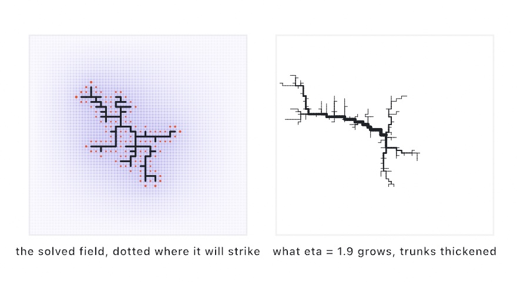
</picture>

One number sets the character. Every frontier cell's chance to grow is the local field raised to `eta`, and that exponent is a dial DLA never had. At `1` you are back to DLA's bushes. Near `2` the strongest cells win so often that the figure turns sparse and jagged, which is the lightning regime. Higher still approaches a single channel.

```swift
var bolt: DielectricBreakdown!

override func setup() {
    bolt = DielectricBreakdown(seeds: [center], in: bounds, seed: 7)
}

override func draw() {
    bolt.step(6)               // the field settles as it grows
    background(.black)
    stroke(.white)
    for (a, b) in bolt.segments { drawLine(a, b) }
}
```

`segments` is a list of pairs, one per branch segment. `for (a, b) in` takes each pair apart into its two ends, the tuple from [Chapter 9](09-Pictures.md). It is the same stepper shape as the others, with three more reads on top. `thicknesses(tipWidth:exponent:)` thickens trunks toward the seed, the way a discharge brightens its main channel. `branches()` hands back whole channels as polylines, ready for smoothing or a plotter. And `potential(at:)` reads the solved field itself, so the glow around the figure can be drawn from the same physics that grew it. The `Patterns/Lichtenberg` example watches one arc to the rim.

## Putting it together: a garden

The garden plants three of the chapter's growers in one bed. One `seed(5)` at the top, with a seed of its own for each tuft, makes the whole thing reproducible. Make `MySketches/Garden.swift`:

```swift
import Ollin

final class Garden: Sketch {
    private var tree: SpaceColonization?
    private var plants: [[Contour]] = []
    private var tufts: [DiffusionLimitedAggregation] = []
    private let groundY = 880.0

    override func setup() {
        seed(5)

        // The tree wants the air inside an oval crown above the trunk.
        let crown = Vector2(540, 430)
        let attractors = poissonDisk(in: Rectangle(x: 190, y: 180, width: 700, height: 520),
                                     radius: 24).filter { p in
            let dx = (p.x - crown.x) / 350, dy = (p.y - crown.y) / 260
            return dx * dx + dy * dy < 1
        }
        // The influence radius must reach the crown from the root, or the
        // trunk never starts growing.
        tree = SpaceColonization(attractors: attractors, roots: [Vector2(540, groundY)],
                                 influenceRadius: 280, killRadius: 20, stepLength: 10)

        // A row of plants, each a stochastic L-system in its own patch.
        for (i, x) in [130.0, 260, 400, 700, 830, 950].enumerated() {
            let height = 150 + Double((i * 37) % 90)
            let patch = Rectangle(x: x - 70, y: groundY - height, width: 140, height: height)
            let preset: LSystem = i % 3 == 2 ? .bush : .randomPlant
            plants.append(lSystem(preset, iterations: 4, in: patch, padding: 6))
        }

        // Lichen tufts, half-buried where they were seeded.
        for x in [220.0, 620, 890] {
            tufts.append(DiffusionLimitedAggregation(
                seeds: [Vector2(x, groundY)], particleRadius: 2.2,
                maxParticles: 280, seed: Int(x)))
        }
    }

    override func draw() {
        guard let tree else { return }
        tree.step()
        for tuft in tufts { tuft.step(4) }

        background(Color(hex: 0x0F130D))

        // The soil.
        noStroke()
        fill(Color(hex: 0x1A2014))
        drawRect(Rectangle(x: 0, y: groundY, width: width, height: height - groundY))

        // Lichen.
        for (i, tuft) in tufts.enumerated() {
            fill(Color(hex: i % 2 == 0 ? 0x66805E : 0x4E6B57).withAlpha(0.85))
            drawCircles(tuft.positions, radius: 2.2)
        }

        // Plants, in two greens.
        noFill()
        strokeCap(.round)
        strokeWeight(2.4)
        for (i, plant) in plants.enumerated() {
            stroke(Color(hex: i % 2 == 0 ? 0x7FB069 : 0x5C8D5A))
            for contour in plant { drawPolyline(contour.points) }
        }

        // The tree, weighted by the pipe model.
        let widths = tree.thicknesses(tipWidth: 1.1, exponent: 2.4)
        stroke(Color(hex: 0xD9C9A0))
        for (i, node) in tree.nodes.enumerated() {
            guard let parent = node.parent else { continue }
            strokeWeight(widths[i])
            drawLine(tree.nodes[parent].position, node.position)
        }
    }
}
```

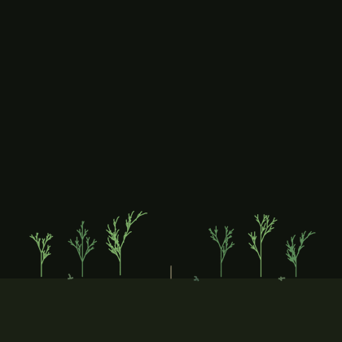

The garden composes three of the steps. The tree is the space colonization of the veins, with its attractors cut down to an oval crown and its root planted in the soil. The plants are the L-systems, six of them, each grown by `lSystem` into its own patch and stroked from the contours it returns. The lichen is three DLA clusters seeded on the ground line. The plants finish growing before the first frame, because rewriting is instant and it is only strings. The tree and the lichen grow in front of you. A grammar produces its form at once, and a stepper grows while you watch. Watch the trunk set off upward with no attractor consumed yet, pulled by the whole crown at once.

> **Swift note.** `filter` keeps the elements that pass a test. The crown is carved out of a rectangular scatter by keeping only the points inside an oval. Like `map` before it, it reads left to right: take the scatter, keep what passes. `[130.0, 260, 400, 700, 830, 950]` is a list of `Double`s, because the decimal on the first number sets the type for the whole list. `private` keeps a property inside its class, and the sketch runs the same without it.

Then make it yours:

- Re-roll the world by changing `seed(5)`, and the tree and every plant become new individuals of the same species. The lichen keeps its own three seeds, the `seed:` each tuft was given, so change those too.
- Add seasons. Tint the tree's tips by their thickness, where thin means young, and the garden gets spring growth. Or fade the plants' green toward ochre for autumn.
- Let the lichen win by raising the tufts' `maxParticles` to a few thousand, and the lichen spreads over the ground and up the plant stems.
- Grow the tree around an obstacle by cutting a hole in the attractor scatter, with another `filter`. The crown grows around the missing space, with no extra code.
- Make a hanging garden. Flip the tree's root to the top edge and the crown ellipse below it, and the tree hangs down with no other change.

A garden that grows in front of you is best kept as motion. `swift run OllinLive MySketches/Garden.swift --export-video garden.mp4 --seconds 12` records the first twelve seconds, which is the tree climbing and the lichen spreading.

## Other growers: shape grammars, differential growth, cracks, and meanders

The garden used a grammar, a space claimer, and frozen walkers. Shape grammars, differential growth, crack growth, and meanders belong to the same idea, a form made by a rule applied over and over. None of them is in the garden. A shape grammar rewrites shapes instead of letters, so it belongs beside the L-systems. Differential growth, crack growth, and meander are steppers you hold, like the tree and the lichen. A line grows by crowding, cracks grow by collision, and a river grows by wandering.

### Rules over shapes, not symbols: shape grammars

A **shape grammar** is a grammar whose rules act on shapes rather than on symbols. An L-system rewrites a sentence, and a turtle turns the finished sentence into a picture, so the picture is downstream of the words. In a shape grammar every piece of the design is a shape with a label. A rule says what one label turns into, in place, working on the geometry of the piece in front of it. It is for designs whose rules have to respect the piece they act on: a window lattice, a building front, a figure nested inside itself. George Stiny and James Gips proposed it in 1971, in a paper on specifying painting and sculpture by rule.

Here is a whole grammar, and it is one sentence long. *A cell becomes two cells, parted by a straight line drawn between two of its edges, with the two parts about equal in area.* Notice what the sentence leaves out. It does not say which edges, or where along them. So the rule stands for every design it could make, rather than for one drawing:

<picture>
  <source media="(prefers-color-scheme: dark)" srcset="Images/13-GrowingThings/CutAndCutAgain-dark.jpg">
  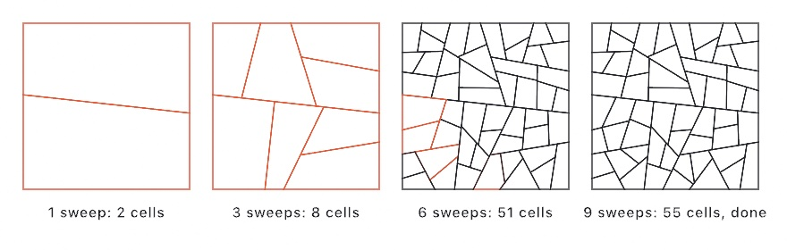
</picture>

```swift
let frame = Rectangle(center: center, width: 880, height: 880)
let lattice = ShapeGrammar.iceRay(in: frame, minArea: 7000)

noFill()
stroke(.white)
strokeWeight(2)
for cell in lattice.run(generations: 9, seed: 7) {
    drawPolyline(cell.corners, closed: true)
}
```

A sweep offers every cell to the rule at once, the way a rewrite replaces every symbol at once. But watch the warm color drain away. `minArea` says how small a cell must get before the rule leaves it alone, so the run finishes on its own. There lies the difference between the two kinds of rewriting. A plain L-system can always rewrite its symbols again, so it grows for as many rounds as you ask. Shapes are rewritten in place, so a shape grammar runs out of room.

One arithmetic fact sits behind this whole family, and it saves you from writing rules down. The cut meets two edges away from their ends. So it hands one new corner to each part at each end, and every corner the cell had lands in exactly one part. Whatever the cell was, **the two parts carry four more corners between them than the cell had**. Now say that the parts may only have three, four, or five corners. A triangle can then only become a triangle and a quadrilateral. A quadrilateral can only become a triangle and a pentagon, or two quadrilaterals. A pentagon can only become a quadrilateral and another pentagon. A hexagon has one legal cut. A shape with seven corners has none at all, so it is finished however large it is. Nobody writes those rules. They are what is left once you name the corner range.

This grammar is the one behind ice-ray lattices, the Chinese window frames whose bars look like cracks in river ice. Stiny worked them out in 1977, from Daniel Sheets Dye's 1949 catalog of real lattices. The artisan's own method is the run you just watched. Divide the area into large and equal spots, then keep dividing until the pieces are the size you wanted.

A finished design is an array of pieces, so it feeds straight back in as the start of another grammar. A lattice gets its wood that way. One rule cuts the frame into cells. A second shrinks every cell to a pane, and the gap left between the panes is a bar of even width all the way round:

```swift
let cells = lattice.run(generations: 9, seed: 7)
let panes = ShapeGrammar(start: cells,
                         rules: [.inset("cell", by: 7, into: "pane")])
    .run(generations: 1, seed: 0)
```

Cutting is one move of several. `split` slices a piece at fractions of its width or height, which is all a building front is. A wall becomes floors, a floor becomes windows, a window becomes a pane. `nested` puts a smaller turned copy of a piece inside itself, the oldest figure in the family. The [reference](../Docs/Generators/ShapeGrammar.md) has the rest, including how weight picks between two rules that name the same label. The `Patterns/ShapeGrammar` example builds an ice-ray window frame a sweep at a time.

### Growth by crowding: differential growth

**Differential growth** is a line that grows by adding points and folds because it refuses to crowd itself. Take a closed ring of points. Every step, pull each point toward its neighbors along the line, so the line does not tear. Push it away from *every* point that comes near, so the line does not touch itself. Whenever a segment stretches too long, split it in the middle so the line gains a point. The whole algorithm is those three moves. The neighborly rules are the ones that steered [Chapter 12](12-FlocksAndSwarms.md)'s flock, applied to geometry that is not going anywhere. It is for coral-like outlines, for a line that fills a region evenly, and for plotter work, since the grown line is ordinary geometry. Anders Hoff's explorations at inconvergent.net made it a generative-art technique, and Jason Webb's tutorials made it common.

<picture>
  <source media="(prefers-color-scheme: dark)" srcset="Images/13-GrowingThings/GrowthStrip-dark.jpg">
  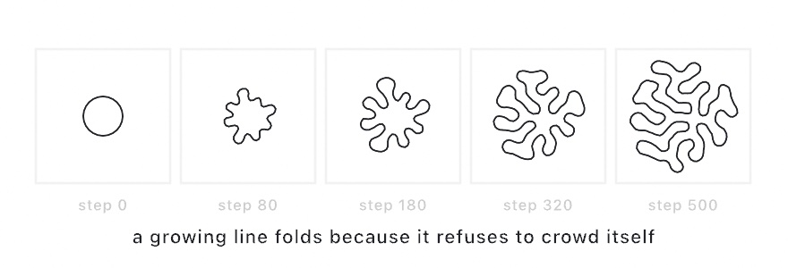
</picture>

A growing line that will not crowd itself has to fold, so the folds are the shape. Make `MySketches/Coral.swift`:

```swift
import Ollin

final class Coral: Sketch {
    let growth = DifferentialGrowth.ring(
        center: Vector2(540, 540), radius: 80, count: 40, seed: 7,
        maxSegmentLength: 8, repulsionRadius: 16, growthRate: 0.9,
        bounds: Rectangle(x: 70, y: 70, width: 940, height: 940))

    override func draw() {
        growth.step(4)

        background(Color(hex: 0x101318))
        noFill()
        stroke(Color(hex: 0x9AD9CE))
        strokeWeight(2.2)
        strokeJoin(.round)
        drawPolygon(growth.nodes)
    }
}
```

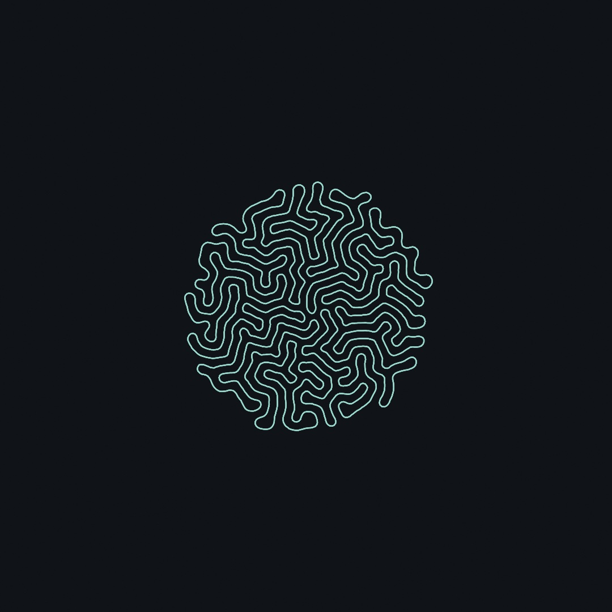

Run it live and you can watch the folds push each other for room. `growth.nodes` is an ordinary point list and `growth.contour` an ordinary contour. So the grown line can be filled, offset, or exported for a pen plotter, like any geometry [Chapter 15](15-ShapesAsMaterial.md) handles. The `Patterns/DifferentialGrowth` example tints the line by depth.

### Growth by collision: crack growth

**Crack growth** is a population of straight cracks that stop when they meet an older crack and restart somewhere else. Start three cracks moving across the canvas, each remembering its angle in a grid as it goes. A crack that reaches a cell holding some *other* angle has met an older line. It stops there. Then it restarts perpendicular to a random point on the existing pattern, and one more crack joins the population. It is for a plane subdivided into blocks and panels, and for the washes a crack can leave beside itself. Jared Tarbell wrote it in 2003 as *Substrate*:

<picture>
  <source media="(prefers-color-scheme: dark)" srcset="Images/13-GrowingThings/CrackedCity-dark.jpg">
  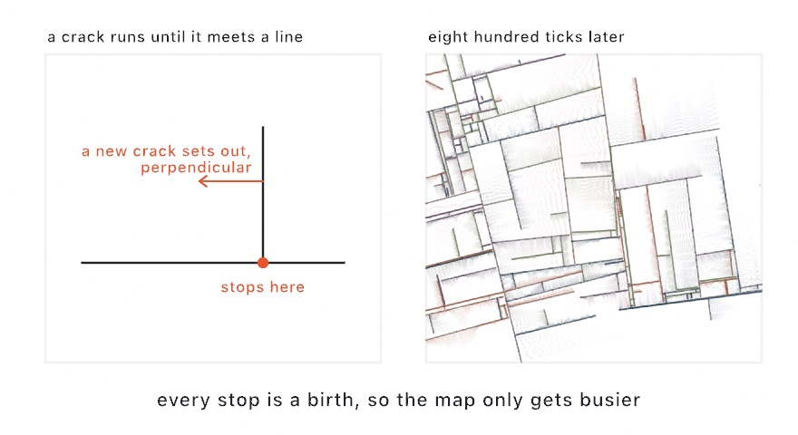
</picture>

Every stop starts a new crack, so the map only gets busier. The cracks stay perpendicular to their parents, which is why the picture reads as streets and blocks instead of a tangle. `CrackGrowth` is the stepper, and it hands you geometry rather than pixels:

```swift
let field = CrackGrowth(width: 1080, height: 1080, seed: 7)

override func setup() { noClear() }

override func draw() {
    if frameCount == 1 { background(.white) }
    for mark in field.step(4) {
        fill(Color.black.withAlpha(0.33))
        drawPoint(at: mark.point)
    }
}
```

`drawPoint(at:)` draws one dot at a point. `noClear()` keeps every frame's dots on the canvas, so the picture is the accumulation, the same move behind [Chapter 12](12-FlocksAndSwarms.md)'s trails. Each `mark` also carries a wash: the open span beside the crack, plus a `gain` that drifts up and down. `CrackGrowth.grains(from:to:gain:)` turns that span into translucent grains crowded against the line, and one ink per `mark.crack` colors each street. The `Patterns/Cracks` example is the full painting.

### Growth by wandering: meander

A **meander** is a river channel that migrates sideways by its own curvature. Water on the outside of a bend runs faster, so it eats that bank away. Water on the inside runs slower, so it drops the sand it carries. The bend deepens. And because each bend is pushed by the water that entered it upstream, the whole train of bends slides downstream as it grows. The river turns hardest where the water arrived already turning. It is for a wandering line with a history, and for maps of rivers that never existed. Alan Howard and Thomas Knutson published the model in 1984, showing that curvature felt from upstream is enough to make a channel meander.

<picture>
  <source media="(prefers-color-scheme: dark)" srcset="Images/13-GrowingThings/WanderingRiver-dark.jpg">
  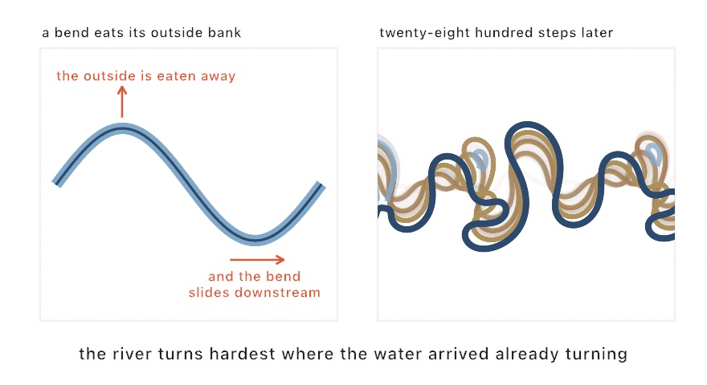
</picture>

Let it run and a loop eventually pinches shut. The river takes the shortcut, and the abandoned loop is left beside it as a crescent lake. `Meander` is the stepper, and like the others it hands you geometry:

```swift
// Starting far off-canvas makes the canvas a window on a longer river.
let river = Meander.line(from: Vector2(-700, 620), to: Vector2(1160, 480),
                         seed: 7, width: 26, recordEvery: 40)

override func draw() {
    river.step(2)
    background(Color(hex: 0xF2ECDD))
    noFill()
    stroke(Color(hex: 0x2C4A6E))
    strokeWeight(river.width)
    drawPolyline(river.centerline)
}
```

`centerline` is the river now. `oxbows` holds the lakes it has cut off, each fading away over time. And `recordEvery` keeps a copy of the channel every forty steps in `scars`. Draw those under the water in fading inks, and the picture becomes a map of everywhere the river has ever been. Only the starting waves are random. The migration itself is the same every run, so the seed *and the frame you stop at* pick the picture. Zoltán Sylvester's meanderpy carries the model in working code. Robert Hodgin's 2020 *Meander* turned it into procedural maps of rivers that never existed, in the manner of Harold Fisk's 1944 Mississippi maps. The `Patterns/Meander` example is the full map.

## Where this comes from

L-systems are Aristid Lindenmayer's 1968 invention. Their visual language comes from *The Algorithmic Beauty of Plants* (1990), written with Przemyslaw Prusinkiewicz, which is free to read online. The parametric form is that book's section 1.10. James Hanan's 1992 dissertation, from the same group, works it out more fully. The tapered tree is the first row of a table of nine trees in Prusinkiewicz's 2003 course notes.

Space colonization is by Adam Runions, Brendan Lane, and Prusinkiewicz at the University of Calgary's Algorithmic Botany group. The paper is "Modeling Trees with a Space Colonization Algorithm" (2007), after their 2005 leaf-venation work.

Diffusion-limited aggregation was described by the physicists Thomas Witten and Leonard Sander in 1981. The dielectric breakdown model is Lutz Niemeyer, Luciano Pietronero, and Hans Wiesmann's, from 1984. Generative artists have been growing frost and lightning with the two ever since.

The growers after the garden name their own sources in place. Stiny and Gips are credited for shape grammars, Hoff and Webb for differential growth, Tarbell for the cracks, and Howard and Knutson for the river.

## Go deeper

- [L-systems](../Docs/Generators/LSystem.md): the grammar type, the turtle alphabet, all thirteen presets, and the [parametric](../Docs/Generators/LSystem.md#parametric) form with its rule language, weighted rules, and botany-literature presets.
- [Space colonization](../Docs/Generators/SpaceColonization.md): every parameter, plus recipes for venation, lightning, and multi-root plantings.
- [Diffusion-limited aggregation](../Docs/Generators/DiffusionLimitedAggregation.md): stickiness, bounds, and drawing the skeleton.
- [Dielectric breakdown](../Docs/Generators/DielectricBreakdown.md): the eta regimes, ground as a rim or as electrodes, channel polylines and pipe widths, and reading the field back.
- [Shape grammars](../Docs/Generators/ShapeGrammar.md): all six rules, how a run picks between them, the fallback a weight of zero writes, and the two facts that hold exactly.
- [Differential growth](../Docs/Generators/DifferentialGrowth.md): the split length, the three forces, and the grown line as ordinary geometry.
- [Crack growth](../Docs/Generators/CrackGrowth.md): the stepper, the marks and the wash, and the plotter path through `segments`.
- [Meander](../Docs/Generators/Meander.md): the migration mechanism step by step, every parameter, and drawing the oxbows and scars.
- [Blue noise](../Docs/Generators/BlueNoise.md): the even scatter the veins grew into and the tree's crown was carved from, first met in [Chapter 4](04-Randomness.md#chance-spread-evenly-blue-noise-and-low-discrepancy-sequences).
- Appendix B draws this chapter's math, one picture per idea: [Local rules, global structure](B-JustEnoughMath.md#local-rules-global-structure).
- Worked examples: [`Examples/Patterns/LSystem`](../Examples/Patterns/LSystem/Sketch.swift) (the preset contact sheet), [`Examples/Patterns/ParametricLSystem`](../Examples/Patterns/ParametricLSystem/Sketch.swift) (the parametric one, including a tapered tree), [`Examples/Patterns/Venation`](../Examples/Patterns/Venation/Sketch.swift), [`Examples/Patterns/Dendrite`](../Examples/Patterns/Dendrite/Sketch.swift), [`Examples/Patterns/Lichtenberg`](../Examples/Patterns/Lichtenberg/Sketch.swift), [`Examples/Patterns/ShapeGrammar`](../Examples/Patterns/ShapeGrammar/Sketch.swift) (an ice-ray window frame built a sweep at a time), [`Examples/Patterns/DifferentialGrowth`](../Examples/Patterns/DifferentialGrowth/Sketch.swift) (growth tinted by depth), [`Examples/Patterns/Cracks`](../Examples/Patterns/Cracks/Sketch.swift), and [`Examples/Patterns/Meander`](../Examples/Patterns/Meander/Sketch.swift) (the river and its map of scars).

---

[Contents](README.md#contents) · Previous: [Chapter 12, Flocks and swarms](12-FlocksAndSwarms.md) · Next: [Chapter 14, Fields and flow](14-FieldsAndFlow.md)
