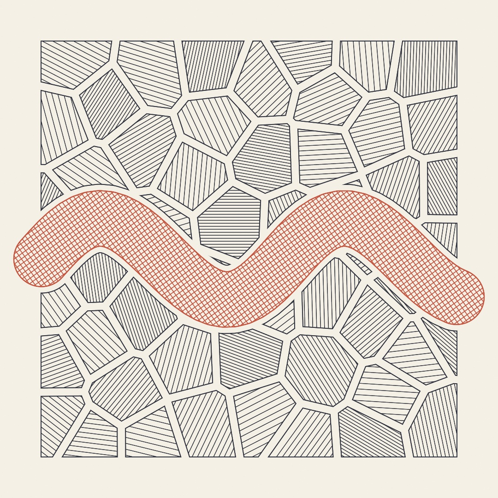
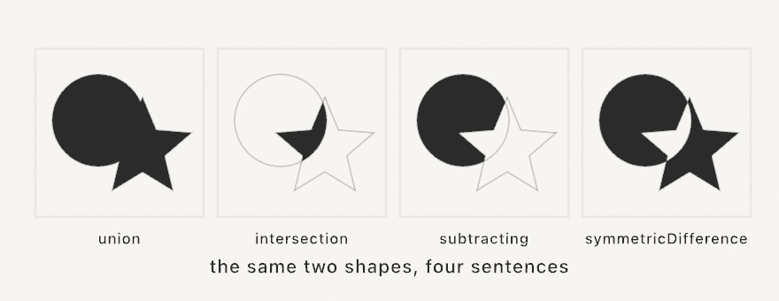
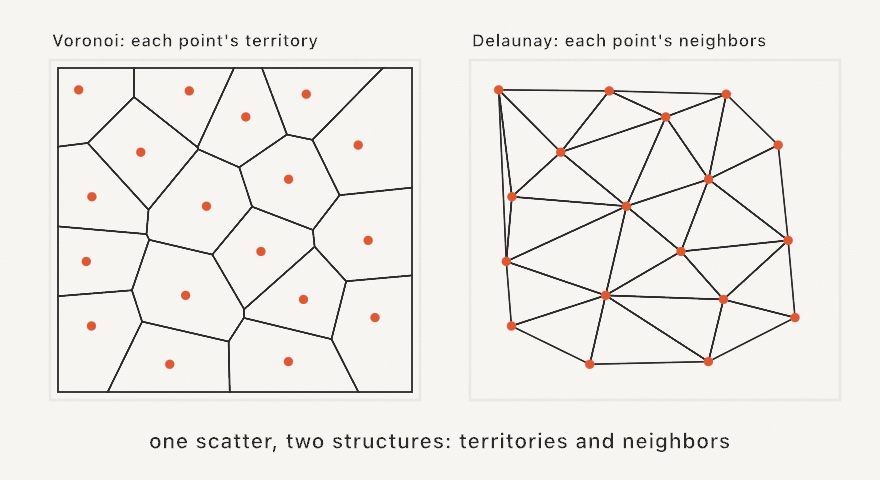
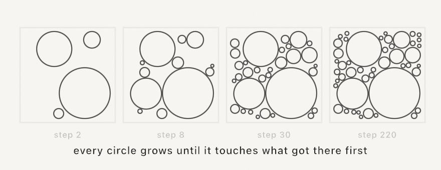
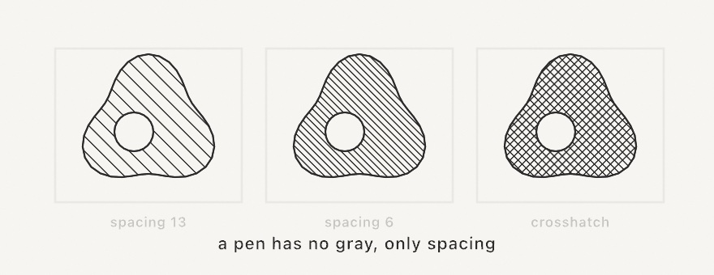

#### <sup>[Ollin](../README.md) → [Guide](README.md) → Chapter 13</sup>

---

# 13. Shapes as material



So far shapes have mostly been things you *draw*, appearing on the canvas and ending there. This chapter treats shapes as things you *have*, meaning geometry you can hold in a variable, cut with other geometry, grow, shrink, thicken, and only then draw, or skip the screen entirely and hand to a pen plotter. Everything in the plate above is line work a real pen could follow, and by the end of the chapter you'll have exported it as exactly that.

## Contours, shapes, and holes

Two types carry all the geometry in this chapter, and you've already brushed against both. A `Contour` is a run of points, open (a polyline with two ends) or closed (a loop). A `Shape` is one or more contours plus a rule for what counts as inside, and its everyday superpower is that a contour *nested inside another* becomes a hole, which is how an `o` or a donut is one shape, not two.

For shapes that curve, build them with the path closure, which collects moves, lines, and curves and hands back the finished geometry. Make `MySketches/Leaf.swift`:

```swift
import Ollin

final class Leaf: Sketch {
    override func draw() {
        background(Color(hex: 0x101318))

        noStroke()
        fill(Color(hex: 0x7FB069))
        drawShape { p in
            p.move(to: Vector2(540, 180))
            p.cubicCurve(to: Vector2(540, 900),
                         control1: Vector2(860, 380), control2: Vector2(700, 740))
            p.cubicCurve(to: Vector2(540, 180),
                         control1: Vector2(380, 740), control2: Vector2(220, 380))
            p.close()
        }

        noFill()
        stroke(Color(hex: 0x2F4A2C))
        strokeWeight(6)
        strokeCap(.round)
        drawCurve([Vector2(540, 210), Vector2(560, 420),
                   Vector2(530, 640), Vector2(540, 870)])
    }
}
```


A cubic curve bends from one point to the next, steered by two control points it leans toward but never touches, and two of them, mirrored, make the leaf. The vein uses the friendlier `drawCurve`, which threads a smooth curve *through* the points you give it, no control points to manage. One honest gotcha, learned the honest way. A fill needs a *closed* contour, and ending a path back where it started isn't enough. Forget `p.close()` and the leaf silently refuses to fill, leaving only the vein.

## Shape arithmetic

Held shapes can be combined like quantities. Four operations do it all:



```swift
let badge = circle.union(star)            // either
let bite = circle.intersection(star)      // both
let cut = circle.subtracting(star)        // this one, minus that one
let rind = circle.symmetricDifference(star)   // either, but not both
```

These are the **shape booleans**, and they turn drawing into sentence-building. A window is a wall subtracting a rectangle, a crescent is a circle subtracting a shifted circle, and the plate at the top is a mosaic subtracting a ribbon. Holes come along correctly, results are ordinary `Shape`s, and you can chain as deep as the sentence needs. When a boolean's result looks unexpectedly *solid* or *hollow*, the shape's winding rule is usually the reason, and the [geometry reference](../Docs/Drawing/Geometry.md#shape-booleans) covers the two rules and when each reads more naturally.

## Growing, shrinking, and thickening

Three more verbs finish the shape-editing vocabulary. `offset(by:)` grows a region outward (positive) or shrinks it inward (negative), holes moving the opposite way, and shrinking a region repeatedly reads as topographic contour lines until it pinches apart and disappears (the `Patterns/Topography` example is exactly that loop). New in the toolbox, `stroked(width:)` turns a *line* into a *region*, giving the closed shape a pen stroke of that width would cover, round or square or butt ends included, and a closed contour comes back as a band:

```swift
let ribbon = Contour(wave, closed: false).stroked(width: 120, join: .round, cap: .round)
```

That one call is the hinge of this chapter's finished piece. Once a stroke is a region, everything above applies to it. You can subtract it from a mosaic, inset rings inside it, hatch it, or export it as a filled outline instead of a fragile stroke attribute. The `Shapes/InkRibbon` example strokes a drifting brush line and rings contour bands inside it, live.

## The well-mannered scatter

Chapters 11 and 12 borrowed `poissonDisk` with a promise to explain it here. Here is the problem it solves. Plain `random` placement clumps and leaves bare patches, because independent rolls have no manners about each other (Chapter 4 warned you). Blue noise is the fix, and the recipe, Robert Bridson's, is charmingly physical. Throw a dart, then keep throwing darts *near existing ones*, keeping only throws that land at least `radius` from everybody placed so far. When a dart can't find room after thirty tries, its neighborhood is full. The result is even but never gridded:


```swift
let scatter = poissonDisk(radius: 26)             // over the whole canvas
let some = poissonDisk(in: region, radius: 26)    // or a region
```

One number, `radius`, sets the density. Nearly every technique in this chapter eats these points, which is why the scatter came first.

## Territories and neighbors

A scatter of points hides two structures, and they're each other turned inside out:



The **Voronoi diagram** gives each point its territory, the region of the canvas closer to it than to any other point. The **Delaunay triangulation** joins each point to its natural neighbors. Ollin builds both from any point list:

```swift
let mosaic = voronoi(sites, in: bounds)     // mosaic.cells is one Shape per site
let mesh = delaunay(sites)                  // mesh.triangles, each a real Triangle
```

Every Voronoi cell is a `Shape`, so the whole chapter applies per cell. You can inset them for grout lines, subtract things from them, or hatch them, and the plate does all three. One companion helper is worth naming, since `lloyd(sites, in: bounds)` nudges every site to its cell's center and re-tessellates, and each pass makes the mosaic calmer and more even, like a pan of bubbles settling.

## Packing

Packing goes the other way around. Instead of carving space between points, you grow shapes until they claim it. The classic form scatters candidate seeds and grows each circle until it touches whatever arrived first:



```swift
let circles = packCircles(count: 300, minRadius: 4, maxRadius: 120)
```

The big-first, small-fill rhythm is the signature of the technique, and the finished foam feeds anything that eats circles or shapes. `packShapes` generalizes it to arbitrary shapes grown against each other's actual outlines (stars nest into triangle notches), and the `Patterns/ShapePacking` example runs it continuously, densifying forever.

## The rubber band

One last tool for point sets, new in the toolbox: `convexHull(of:)` returns the smallest convex polygon containing them all, the shape a rubber band would snap to. It's the quick answer to "what's the footprint of this scatter?", and since the corners come back in boundary order, the hull is instantly a `Contour` to stroke, offset, or fill. The `Shapes/RubberBand` example recomputes it live around a drifting herd.

## Lines for a pen

Everything so far draws filled regions on a screen. A pen plotter changes the terms, since it offers no fills and no gray, only lines. The bridge is **hatching**, which converts a filled region into parallel line work, and it's a type you can use directly:

```swift
let hatch = Hatching(spacing: 6.5, angle: .pi / 4)
for line in hatch.lines(filling: shape) {
    drawPolyline(line)
}
```



Spacing is the pen's whole idea of tone, and holes and concavities are respected because the lines are clipped by the shape's own inside rule. For getting work *out*, every sketch already knows how. Run it with `--export-svg plate.svg` and the recorded geometry writes as true vector paths, and add `--hatch` and the exporter converts every fill to hatch line work by itself, spacing scaled by each fill's tone. Either way the file opens in any vector tool and feeds any plotter.

## Shapes from a file

There's one more source of material before the finished piece, which is shapes you didn't draw at all. SVG is the plain-text vector format every design tool exports, and `loadSVG` reads a file into the same types this chapter has been editing, with each element arriving as a `Shape` carrying the fill and stroke it was authored with:

```swift
if let art = loadSVG("boat.svg") {
    drawSVG(art, in: bounds.inset(by: .all(140)))
}
```

`drawSVG` draws the file the way its author saw it, fills, strokes, and stacking order intact. But the reason it lives in this chapter is what happens when you ignore the authored look. `art.shapes` and `art.contours` hand over the bare geometry, and everything above applies to it. Subtract the artwork from a mosaic, shrink it into nested outlines, respace its contours into even dots (the Chapter 7 trick), or hatch it for the pen.


```swift
let fitted = art.fitted(in: frame)      // a scaled copy, in canvas coordinates
for (i, shape) in fitted.shapes.enumerated() {
    let hatch = Hatching(spacing: 4.5, angle: 0.5 + Double(i) * 0.7)
    for line in hatch.lines(filling: shape) {
        drawPolyline(line)
    }
}
```

A logo, a scanned drawing auto-traced to paths, a file another sketch exported, and they all arrive the same way. They can leave again through `--export-svg`, so a sketch can import a file, rework it, and hand the result to a plotter. Two things are worth knowing before you lean on it. Text doesn't import, so convert it to outlines in the design tool first, and a gradient fill falls back to flat gray so the form stays visible. The [SVG import reference](../Docs/Drawing/SVG.md) lists exactly what the importer reads and skips.

## Putting it together: the plate

The plate brings the whole chapter to one piece of paper: a blue-noise scatter relaxed once, its Voronoi mosaic inset cell by cell, a stroked ribbon subtracted from every cell with a halo of breathing room, and two pens' worth of hatching. Make `MySketches/Plate.swift`:

```swift
import Ollin

final class Plate: Sketch {
    var inkLines: [[Vector2]] = []
    var inkOutlines: [[Vector2]] = []
    var penLines: [[Vector2]] = []
    var penOutlines: [[Vector2]] = []

    override func setup() {
        seed(9)
        let margin = bounds.inset(by: .all(80))

        // The ribbon: a wavy open line, stroked into a region.
        let wave = (0 ... 50).map { i -> Vector2 in
            let t = Double(i) / 50
            return Vector2(90 + t * (width - 180),
                           height * 0.52 + signedNoise(t * 1.7, 3.0) * 300)
        }
        let ribbon = Contour(wave, closed: false).stroked(width: 120, join: .round, cap: .round)

        // The mosaic: blue-noise sites, relaxed once, cut by the ribbon's halo.
        let sites = lloyd(poissonDisk(in: margin, radius: 105), in: margin, iterations: 1)
        let mosaic = voronoi(sites, in: margin)
        let halo = ribbon.offset(by: 14, join: .round)

        for (i, cell) in mosaic.cells.enumerated() {
            let piece = cell.offset(by: -9, join: .miter).subtracting(halo)
            guard !piece.contours.isEmpty else { continue }
            let hatch = Hatching(spacing: 6.5 + Double(i % 4) * 2,
                                 angle: Double(i) * 0.83)
            inkLines.append(contentsOf: hatch.lines(filling: piece))
            inkOutlines.append(contentsOf: piece.contours.map(\.points))
        }

        // The ribbon in the second pen, crosshatched.
        let hatch = Hatching(spacing: 9, angle: -.pi / 5, crossHatch: true)
        penLines = hatch.lines(filling: ribbon)
        penOutlines = ribbon.contours.map(\.points)
    }

    override func draw() {
        background(Color(hex: 0xF4F0E6))

        noFill()
        strokeWeight(1.4)
        stroke(Color(hex: 0x2F3440))
        for line in inkLines { drawPolyline(line) }
        strokeWeight(2)
        for outline in inkOutlines { drawPolygon(outline) }

        strokeWeight(1.6)
        stroke(Color(hex: 0xC8553D))
        for line in penLines { drawPolyline(line) }
        strokeWeight(2.4)
        for outline in penOutlines { drawPolygon(outline) }
    }
}
```

All the geometry happens once in `setup()` and lands in four plain arrays, and `draw()` only replays lines. That split isn't just tidy, it *is* the plotter mindset, a piece reduced to strokes a machine could follow, and it keeps the sketch fast no matter how elaborate the geometry gets.

Then make it yours:

- Export it: `swift run` your sketch with `--export-svg plate.svg` and open the file in a vector editor. Every hatch line is really there.
- Re-roll `seed(9)` until the ribbon and the mosaic argue well. The composition is the choosing.
- Give every third cell a solid fill instead of hatching, and the plate gains ink-block weight.
- Swap the ribbon for text: Chapter 7's `textToShapes` returns shapes, and shapes are what everything here eats. Hatched letters parting a mosaic make a poster.
- Work in three pens by hatching the cells nearest the ribbon in a middle color, picked by distance from the wave's points.

## Where this comes from

The territories are named for Georgy Voronoy and the triangulation for Boris Delaunay, mathematicians a century apart from the generative artists who adopted them, and the settling pass is Stuart Lloyd's algorithm from 1957 signal processing. The dart-throwing scatter is Robert Bridson's 2007 fast Poisson-disk sampling. Grow-until-touching circle packing entered the generative canon through Jared Tarbell's work in the early 2000s. The shape booleans and offsets are powered by Angus Johnson's Clipper2 library, one of the few pieces of bundled code in Ollin (credited in full in the project notices). The convex hull uses A. M. Andrew's monotone-chain construction from 1979. And hatching itself is far older than any of this, since it's how engravers and etchers made tone from lines for centuries. The plotter just holds the pen steadier. Full credits are in the project's [attribution notes](../ATTRIBUTION.md).

## Go deeper

- [Geometry](../Docs/Drawing/Geometry.md): `Contour`, `Shape`, `Path`, the booleans, offsetting, stroke-as-shape, and the convex hull, with every signature.
- [SVG import](../Docs/Drawing/SVG.md): loading, drawing, the element list, and what the importer reads and skips.
- [Fourier epicycles](../Docs/Drawing/Epicycles.md): rebuild an imported outline as a chain of spinning circles, and the [`Examples/Motion/Epicycles`](../Examples/Motion/Epicycles/Sketch.swift) example traces a whale with them.
- [Shape morphing](../Docs/Drawing/Morphing.md): tween one shape into another, with every in-between a real vector shape you can fill, hatch, or export. The [`Examples/Motion/Morphing`](../Examples/Motion/Morphing/Sketch.swift) example loops a star through a blob and a donut.
- [Voronoi & Delaunay](../Docs/Drawing/Voronoi.md): cells, triangles, neighbors, and Lloyd relaxation.
- [Blue noise](../Docs/Generators/BlueNoise.md) and [circle packing](../Docs/Generators/Packing.md) / [shape packing](../Docs/Generators/ShapePacking.md).
- [Export](../Docs/Output/Export.md): the whole `--export-svg` and `--hatch` surface, plus stills, sequences, video, and GIF.
- Worked examples: [`Examples/Shapes/Booleans`](../Examples/Shapes/Booleans/Sketch.swift), [`Examples/Patterns/Topography`](../Examples/Patterns/Topography/Sketch.swift), [`Examples/Shapes/InkRibbon`](../Examples/Shapes/InkRibbon/Sketch.swift), [`Examples/Shapes/RubberBand`](../Examples/Shapes/RubberBand/Sketch.swift), [`Examples/Patterns/Voronoi`](../Examples/Patterns/Voronoi/Sketch.swift), [`Examples/Patterns/CirclePacking`](../Examples/Patterns/CirclePacking/Sketch.swift), and [`Examples/Shapes/SVGImport`](../Examples/Shapes/SVGImport/Sketch.swift).

---

[Contents](README.md#contents) · Previous: [Chapter 12, Fields and flow](12-FieldsAndFlow.md) · Next: [Chapter 14, Layers and effects](14-LayersAndEffects.md)
