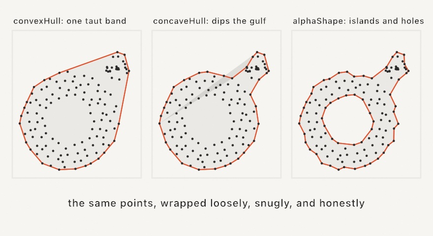
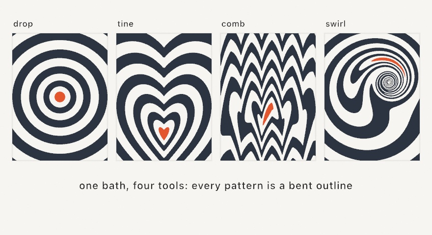
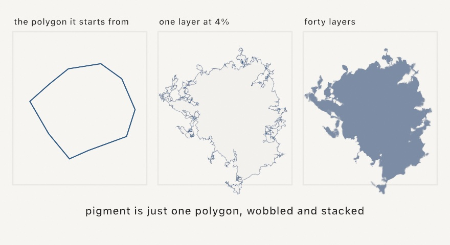

#### <sup>[Ollin](../README.md) → [Guide](README.md) → Chapter 13</sup>

---

# 13. Shapes as material


So far shapes have mostly been things you *draw*, appearing on the canvas and ending there. This chapter treats shapes as things you *have*, meaning geometry you can hold in a variable, cut with other geometry, grow, shrink, thicken, and only then draw, or skip the screen entirely and hand to a pen plotter. Everything in the plate above is line work a real pen could follow, and by the end of the chapter you'll have exported it as exactly that.

## Contours, shapes, and holes

Two types carry all the geometry in this chapter, and you've already brushed against both. A `Contour` is a run of points, open (a polyline with two ends) or closed (a loop). A `Shape` is one or more contours plus a rule for what counts as inside, and its everyday superpower is that a contour *nested inside another* becomes a hole, which is how an `o` or a donut is one shape, not two.

For shapes that curve, build them with the path closure, which collects moves, lines, and curves and hands back the finished geometry. Make `MySketches/Leaf.swift`:

```swift
import Ollin

final class Leaf: Sketch {
    override func draw() {
        background(Color(hex: 0x101318))

        noStroke()
        fill(Color(hex: 0x7FB069))
        drawShape { p in
            p.move(to: Vector2(540, 180))
            p.cubicCurve(to: Vector2(540, 900),
                         control1: Vector2(860, 380), control2: Vector2(700, 740))
            p.cubicCurve(to: Vector2(540, 180),
                         control1: Vector2(380, 740), control2: Vector2(220, 380))
            p.close()
        }

        noFill()
        stroke(Color(hex: 0x2F4A2C))
        strokeWeight(6)
        strokeCap(.round)
        drawCurve([Vector2(540, 210), Vector2(560, 420),
                   Vector2(530, 640), Vector2(540, 870)])
    }
}
```


A cubic curve bends from one point to the next, steered by two control points it leans toward but never touches, and two of them, mirrored, make the leaf. The vein uses the friendlier `drawCurve`, which threads a smooth curve *through* the points you give it, no control points to manage. One honest gotcha, learned the honest way. A fill needs a *closed* contour, and ending a path back where it started isn't enough. Forget `p.close()` and the leaf silently refuses to fill, leaving only the vein.

## Shape arithmetic

Held shapes can be combined like quantities. Four operations do it all:


```swift
let badge = circle.union(star)            // either
let bite = circle.intersection(star)      // both
let cut = circle.subtracting(star)        // this one, minus that one
let rind = circle.symmetricDifference(star)   // either, but not both
```

These are the **shape booleans**, and they turn drawing into sentence-building. A window is a wall subtracting a rectangle, a crescent is a circle subtracting a shifted circle, and the plate at the top is a mosaic subtracting a ribbon. Holes come along correctly, results are ordinary `Shape`s, and you can chain as deep as the sentence needs. When a boolean's result looks unexpectedly *solid* or *hollow*, the shape's winding rule is usually the reason, and the [geometry reference](../Docs/Drawing/Geometry.md#shape-booleans) covers the two rules and when each reads more naturally.

## Growing, shrinking, and thickening

Three more verbs finish the shape-editing vocabulary. `offset(by:)` grows a region outward (positive) or shrinks it inward (negative), holes moving the opposite way, and shrinking a region repeatedly reads as topographic contour lines until it pinches apart and disappears (the `Patterns/Topography` example is exactly that loop). New in the toolbox, `stroked(width:)` turns a *line* into a *region*, giving the closed shape a pen stroke of that width would cover, round or square or butt ends included, and a closed contour comes back as a band:

```swift
let ribbon = Contour(wave, closed: false).stroked(width: 120, join: .round, cap: .round)
```

That one call is the hinge of this chapter's finished piece. Once a stroke is a region, everything above applies to it. You can subtract it from a mosaic, inset rings inside it, hatch it, or export it as a filled outline instead of a fragile stroke attribute. The `Shapes/InkRibbon` example strokes a drifting brush line and rings contour bands inside it, live.

## The well-mannered scatter

Chapters 11 and 12 borrowed `poissonDisk` with a promise to explain it here. Here is the problem it solves. Plain `random` placement clumps and leaves bare patches, because independent rolls have no manners about each other (Chapter 4 warned you). Blue noise is the fix, and the recipe, Robert Bridson's, is charmingly physical. Throw a dart, then keep throwing darts *near existing ones*, keeping only throws that land at least `radius` from everybody placed so far. When a dart can't find room after thirty tries, its neighborhood is full. The result is even but never gridded:


```swift
let scatter = poissonDisk(radius: 26)             // over the whole canvas
let some = poissonDisk(in: region, radius: 26)    // or a region
```

One number, `radius`, sets the density. Nearly every technique in this chapter eats these points, which is why the scatter came first.

## Territories and neighbors

A scatter of points hides two structures, and they're each other turned inside out:


The **Voronoi diagram** gives each point its territory, the region of the canvas closer to it than to any other point. The **Delaunay triangulation** joins each point to its natural neighbors. Ollin builds both from any point list:

```swift
let mosaic = voronoi(sites, in: bounds)     // mosaic.cells is one Shape per site
let mesh = delaunay(sites)                  // mesh.triangles, each a real Triangle
```

Every Voronoi cell is a `Shape`, so the whole chapter applies per cell. You can inset them for grout lines, subtract things from them, or hatch them, and the plate does all three. One companion helper is worth naming, since `lloyd(sites, in: bounds)` nudges every site to its cell's center and re-tessellates, and each pass makes the mosaic calmer and more even, like a pan of bubbles settling.

## Packing

Packing goes the other way around. Instead of carving space between points, you grow shapes until they claim it. The classic form scatters candidate seeds and grows each circle until it touches whatever arrived first:


```swift
let circles = packCircles(count: 300, minRadius: 4, maxRadius: 120)
```

The big-first, small-fill rhythm is the signature of the technique, and the finished foam feeds anything that eats circles or shapes. `packShapes` generalizes it to arbitrary shapes grown against each other's actual outlines (stars nest into triangle notches), and the `Patterns/ShapePacking` example runs it continuously, densifying forever.

## What shape are these points?

A scatter usually has an outline you need for something: the footprint of a drifting herd, the ground a blue-noise scatter covers, an outline to offset, hatch, or clip against. Three tools answer that question, and they differ in what each one is allowed to do.

`convexHull(of:)` returns the smallest convex polygon containing every point, the shape a rubber band would snap to around a handful of pins. It is quick and it always comes back as one simple loop. It also can never dip inward, which is the limit as much as the strength, because a ring of points comes back as a filled blob. A rubber band has no way to reach into the middle.

`concaveHull(of:concavity:)` lets the band sink into the gulfs between clusters while staying one simple polygon with every point inside it. The `concavity` knob runs `0...1`, where 0 gives you exactly the convex hull and 1 hugs the points as tightly as their spacing allows. Around 0.5 to 0.8 it reads as following the scatter; pushed near 1 it erodes every bridge it can and starts to look like a maze.

`alphaShape(of:alpha:)` asks a different question, and it's the one that can say "these are two things". Picture rolling a disk of radius `alpha` over the points and keeping only the parts the disk can't get into. Nothing requires the answer to be a single piece, so a clustered scatter can come back as several islands, and a ring comes back as a ring.



```swift
let band = convexHull(of: scatter)                        // [Vector2]
let snug = concaveHull(of: scatter, concavity: 0.65)      // [Vector2]
let islands = alphaShape(of: scatter, alpha: 40)          // [Shape]
```

The two hulls hand back boundary points in order, so wrap them in a `Contour` or pass them straight to `drawPolygon`. The alpha shape hands back finished `Shape`s, holes included, ready for `drawShape` and for everything earlier in this chapter.

Choosing between them comes down to what you'll do next. When the result has to be one simple polygon, because it's a plotter path or a region you'll offset, use a hull. When you want the honest footprint of a scatter that really is clumpy, use the alpha shape.

The one number that needs care is `alpha`, which is a radius in the same units as your points. It wants to sit a bit above the typical gap between neighbors, and set much below that the shape crumbles into dust. All three are deterministic, so the same points and the same knob give the same outline every run. The `Shapes/Hulls` example breathes `concavity` from 0 to tight so you can watch the band sink into the gulf.

## The skeleton inside

Hulls describe a region from the outside. The **medial axis** describes it from the inside by finding its middle. Take every disk that fits within the shape while touching the boundary in two or more places, and the centers of those disks trace a skeleton. A blob collapses to the veins running down its lobes, and a letterform collapses to the stroke a pen would have made to write it.


```swift
let skeleton = medialAxis(of: blob, spacing: 3, prune: 8)
noFill()
for branch in skeleton.branches {
    drawPolyline(branch.points, closed: branch.isClosed)
}
```

Two knobs shape the result. `spacing` is how finely the boundary gets sampled, so smaller means a more faithful skeleton and more work, and halving it roughly quadruples the cost. `prune` trims whiskers, removing terminal twigs shorter than the value you give. You want some pruning almost always, because every convex corner of the outline honestly grows a twig, and a couple of spacings clears the fuzz while keeping the trunk. Branches come back as polylines, open runs between forks, or closed rings around holes, which is why `drawPolyline` takes `branch.isClosed`.

What makes this more than a line drawing is that the skeleton remembers thickness. Each branch carries `radii` alongside `points`, one radius per vertex, holding the size of the disk that fits there. So the skeleton knows how fat the shape is at every step along itself. Walk a branch drawing a circle from each pair and you rebuild the region as a train of disks; size marks by the radius and a drawing swells through the thick parts and thins into the tips. The largest radius anywhere marks the deepest point of the shape, the spot furthest from any edge.

Skeletons are setup work rather than per-frame work, so extract once and hold the result. Glyph shapes from Chapter 7's `textToShapes` skeletonize as they are, counters and all, which is what the `Shapes/MedialAxis` example does to spell a word in bones.

## Ink on water

Paper marbling has a few hundred years of craft behind it and a simple physical setup. Ink floats on a bath of thickened water, and because it floats instead of mixing, anything done to the surface moves the ink around without blending it. You drop fresh ink in, you rake the surface with a stylus or a comb, and you lay a sheet of paper on top to lift the pattern off.

`Marbling` reproduces that in closed form, which means every move is an exact transform applied to outlines rather than a simulation of fluid. Ink regions are ordinary vector shapes, and each operation bends them. Because the outlines only ever deform, ink never tears and never mixes, exactly as on a real bath.



Nearly every classic pattern starts from the bull's-eye in the first panel, and a bull's-eye is just concentric drops of alternating color.

```swift
var bath = Marbling()
for i in 0 ..< 20 {
    bath.drop(at: center, radius: 200 - Double(i) * 9,
              color: i.isMultiple(of: 2) ? navy : cream)
}
```

A drop pushes every floating point straight away from its own center, sending a point at distance `d` out to `sqrt(d * d + r * r)`. That particular rule is the one that keeps the area around the drop unchanged, which is why earlier rings thin into crescents rather than getting wiped out. Since paper-colored ink displaces just like any other, dropping the color of your background carves negative space.

Then you rake the bath. Four tools do it, and all of them share one rule for how the pull fades with distance. A point `d` away from the tool moves by `strength · 2^(−d / falloff)`, always parallel to the direction the tool traveled, so `strength` is how far the tool itself drags and `falloff` is the distance at which the pull halves.

```swift
bath.tine(through: center, direction: .unitY, strength: 120, falloff: 48)
bath.comb(through: edge, direction: .unitY, spacing: 110, strength: 260, falloff: 30)
bath.tine(around: center, radius: 200, strength: 300, falloff: 48)
bath.swirl(at: center, strength: 400, falloff: 96)
```

`tine` pulls one stylus along a line, and that is the stroke that drags a bull's-eye into a heart. `comb` pulls a whole row of teeth spaced `spacing` apart, feathering rows of drops into the pattern marblers call nonpareil. Keep a comb's `falloff` well under its tooth spacing, because otherwise the teeth blur together into one broad shear. The circular `tine` drags the stylus around a ring, and `swirl` stirs a vortex that spins hardest at its middle, which is the tight curl at the heart of French-curl papers.

Stirring a vortex at the exact center of a bull's-eye does nothing whatsoever, which is worth knowing before you spend an evening wondering why the swirl has no effect. Spinning a set of concentric circles about their shared center maps every circle onto itself. The fourth panel above is stirred slightly off-center, which is what a real hand would have done anyway.

`bath.add(shape, color:)` floats an outline you already have, so text outlines can go into the bath and get combed with their counters intact. Nothing in here is random either, so the same operations always produce the same sheet. Randomize the drop positions with the sketch's seeded `random` and the whole paper still comes back from its seed.

```swift
noStroke()
drawMarbling(bath)      // fills every ink in its own color, oldest first
```

Later drops sit above earlier ones and drawing runs oldest first, so the stack reads exactly as it was poured. Every ink is a plain `Shape`, which means a marbled sheet leaves through `--export-svg` as real paths like everything else in this chapter.

## Pigment from a polygon

Watercolor is the least geometric-looking thing in this chapter, and that is exactly why it belongs here. A pool of paint on wet paper has a dense middle and an edge that wanders, blooming in some places and staying crisp in others. Ollin gets that look from nothing but polygon deformation and translucency.

Start with one irregular polygon. Split every edge at its midpoint, jump that midpoint a small random distance, and repeat. Each edge carries its own variance and passes a decayed share of it to the two edges it splits into, so some stretches of outline bloom while others stay nearly straight. That inheritance is what keeps the result from looking like a uniformly fuzzy circle. Paint one such outline at about four percent opacity and almost nothing shows. Stack forty independently deformed copies and the middle saturates while the fringe stays uneven, which is what the eye reads as pigment.



One call does the whole thing:

```swift
fill(Color(hex: 0x2B5D8A))
drawWatercolor(center: center, radius: 300)
drawWatercolor(center: center, radius: 300, layers: 60, opacity: 0.03, variance: 40)
```

`layers` and `opacity` trade against each other, and more layers at a lower opacity looks smoother and wetter. If a blob reads thin and translucent everywhere, add layers rather than raising opacity, because the flat saturated core is most of what sells it as paint. `variance` sets how far the edge is free to wander, and it defaults to a fifth of the radius. All of it rides the sketch's seeded `random`, so `seed(_:)` reproduces a painting exactly and every variation pours a different one.

This is deliberately heavy drawing, since each layer is a full concave fill. Paint in `setup()` or behind `noLoop()` rather than every frame. The cost is one reason, and the other is that regenerating every frame re-rolls the layers and makes the blob shimmer.

Two moves are worth knowing once the basic pool works. For two pigments that mix instead of one covering the other, build a typed `Watercolor` base per pool and interleave their layers a few at a time, so overlaps glaze in both directions. And for the grainy look of pigment settling into paper, speckle small translucent circles inside a `withClip` of the pool's own outline.

## Lines for a pen

Everything so far draws filled regions on a screen. A pen plotter changes the terms, since it offers no fills and no gray, only lines. The bridge is **hatching**, which converts a filled region into parallel line work, and it's a type you can use directly:

```swift
let hatch = Hatching(spacing: 6.5, angle: .pi / 4)
for line in hatch.lines(filling: shape) {
    drawPolyline(line)
}
```


Spacing is the pen's whole idea of tone, and holes and concavities are respected because the lines are clipped by the shape's own inside rule. For getting work *out*, every sketch already knows how. Run it with `--export-svg plate.svg` and the recorded geometry writes as true vector paths, and add `--hatch` and the exporter converts every fill to hatch line work by itself, spacing scaled by each fill's tone. Either way the file opens in any vector tool and feeds any plotter.

## Shapes from a file

There's one more source of material before the finished piece, which is shapes you didn't draw at all. SVG is the plain-text vector format every design tool exports, and `loadSVG` reads a file into the same types this chapter has been editing, with each element arriving as a `Shape` carrying the fill and stroke it was authored with:

```swift
if let art = loadSVG("boat.svg") {
    drawSVG(art, in: bounds.inset(by: .all(140)))
}
```

`drawSVG` draws the file the way its author saw it, fills, strokes, and stacking order intact. But the reason it lives in this chapter is what happens when you ignore the authored look. `art.shapes` and `art.contours` hand over the bare geometry, and everything above applies to it. Subtract the artwork from a mosaic, shrink it into nested outlines, respace its contours into even dots (the Chapter 7 trick), or hatch it for the pen.


```swift
let fitted = art.fitted(in: frame)      // a scaled copy, in canvas coordinates
for (i, shape) in fitted.shapes.enumerated() {
    let hatch = Hatching(spacing: 4.5, angle: 0.5 + Double(i) * 0.7)
    for line in hatch.lines(filling: shape) {
        drawPolyline(line)
    }
}
```

A logo, a scanned drawing auto-traced to paths, a file another sketch exported, and they all arrive the same way. They can leave again through `--export-svg`, so a sketch can import a file, rework it, and hand the result to a plotter. Two things are worth knowing before you lean on it. Text doesn't import, so convert it to outlines in the design tool first, and a gradient fill falls back to flat gray so the form stays visible. The [SVG import reference](../Docs/Drawing/SVG.md) lists exactly what the importer reads and skips.

## Putting it together: the plate

The plate brings the whole chapter to one piece of paper: a blue-noise scatter relaxed once, its Voronoi mosaic inset cell by cell, a stroked ribbon subtracted from every cell with a halo of breathing room, and two pens' worth of hatching. Make `MySketches/Plate.swift`:

```swift
import Ollin

final class Plate: Sketch {
    var inkLines: [[Vector2]] = []
    var inkOutlines: [[Vector2]] = []
    var penLines: [[Vector2]] = []
    var penOutlines: [[Vector2]] = []

    override func setup() {
        seed(9)
        let margin = bounds.inset(by: .all(80))

        // The ribbon: a wavy open line, stroked into a region.
        let wave = (0 ... 50).map { i -> Vector2 in
            let t = Double(i) / 50
            return Vector2(90 + t * (width - 180),
                           height * 0.52 + signedNoise(t * 1.7, 3.0) * 300)
        }
        let ribbon = Contour(wave, closed: false).stroked(width: 120, join: .round, cap: .round)

        // The mosaic: blue-noise sites, relaxed once, cut by the ribbon's halo.
        let sites = lloyd(poissonDisk(in: margin, radius: 105), in: margin, iterations: 1)
        let mosaic = voronoi(sites, in: margin)
        let halo = ribbon.offset(by: 14, join: .round)

        for (i, cell) in mosaic.cells.enumerated() {
            let piece = cell.offset(by: -9, join: .miter).subtracting(halo)
            guard !piece.contours.isEmpty else { continue }
            let hatch = Hatching(spacing: 6.5 + Double(i % 4) * 2,
                                 angle: Double(i) * 0.83)
            inkLines.append(contentsOf: hatch.lines(filling: piece))
            inkOutlines.append(contentsOf: piece.contours.map(\.points))
        }

        // The ribbon in the second pen, crosshatched.
        let hatch = Hatching(spacing: 9, angle: -.pi / 5, crossHatch: true)
        penLines = hatch.lines(filling: ribbon)
        penOutlines = ribbon.contours.map(\.points)
    }

    override func draw() {
        background(Color(hex: 0xF4F0E6))

        noFill()
        strokeWeight(1.4)
        stroke(Color(hex: 0x2F3440))
        for line in inkLines { drawPolyline(line) }
        strokeWeight(2)
        for outline in inkOutlines { drawPolygon(outline) }

        strokeWeight(1.6)
        stroke(Color(hex: 0xC8553D))
        for line in penLines { drawPolyline(line) }
        strokeWeight(2.4)
        for outline in penOutlines { drawPolygon(outline) }
    }
}
```

All the geometry happens once in `setup()` and lands in four plain arrays, and `draw()` only replays lines. That split isn't just tidy, it *is* the plotter mindset, a piece reduced to strokes a machine could follow, and it keeps the sketch fast no matter how elaborate the geometry gets.

Then make it yours:

- Export it: `swift run` your sketch with `--export-svg plate.svg` and open the file in a vector editor. Every hatch line is really there.
- Re-roll `seed(9)` until the ribbon and the mosaic argue well. The composition is the choosing.
- Give every third cell a solid fill instead of hatching, and the plate gains ink-block weight.
- Swap the ribbon for text: Chapter 7's `textToShapes` returns shapes, and shapes are what everything here eats. Hatched letters parting a mosaic make a poster.
- Work in three pens by hatching the cells nearest the ribbon in a middle color, picked by distance from the wave's points.
- Give the plate a deckled edge: intersect every cell with `Shape(concaveHull(of: sites, concavity: 0.4))` instead of trimming to the margin rectangle, and the mosaic stops at the scatter's own outline.
- Trade hatching for bones. Run `medialAxis` on each cell piece and stroke its branches, and the plate reads as a nervous system rather than a mosaic.
- Float the ribbon instead of stroking it: `bath.add(ribbon, color:)` into a `Marbling`, comb it, and hatch the inks that come out. It still exports as plotter line work.

## Where this comes from

The territories are named for Georgy Voronoy and the triangulation for Boris Delaunay, mathematicians a century apart from the generative artists who adopted them, and the settling pass is Stuart Lloyd's algorithm from 1957 signal processing. The dart-throwing scatter is Robert Bridson's 2007 fast Poisson-disk sampling. Grow-until-touching circle packing entered the generative canon through Jared Tarbell's work in the early 2000s. The shape booleans and offsets are powered by Angus Johnson's Clipper2 library, one of the few pieces of bundled code in Ollin (credited in full in the project notices). The convex hull uses A. M. Andrew's monotone-chain construction from 1979, the concave hull is the characteristic-shape construction of Matt Duckham, Lars Kulik, Mike Worboys, and Antony Galton from 2008, and the alpha shape is Herbert Edelsbrunner, David Kirkpatrick, and Raimund Seidel's from 1983. The skeleton is Harry Blum's medial axis, proposed in 1967 as a way to describe biological shape, approximated here by the Voronoi method of J. W. Brandt and V. R. Algazi. The marbling equations are Aubrey Jaffer's closed-form model of a craft that predates all of it, and the watercolor recipe is Tyler Hobbs', from his generous written guide to simulating paint with generative art. And hatching itself is far older than any of this, since it's how engravers and etchers made tone from lines for centuries. The plotter just holds the pen steadier. Full credits are in the project's [attribution notes](../ATTRIBUTION.md).

## Go deeper

- [Geometry](../Docs/Drawing/Geometry.md): `Contour`, `Shape`, `Path`, the booleans, offsetting, stroke-as-shape, and the convex hull, with every signature.
- [SVG import](../Docs/Drawing/SVG.md): loading, drawing, the element list, and what the importer reads and skips.
- [Fourier epicycles](../Docs/Drawing/Epicycles.md): rebuild an imported outline as a chain of spinning circles, and the [`Examples/Motion/Epicycles`](../Examples/Motion/Epicycles/Sketch.swift) example traces a whale with them.
- [Shape morphing](../Docs/Drawing/Morphing.md): tween one shape into another, with every in-between a real vector shape you can fill, hatch, or export. The [`Examples/Motion/Morphing`](../Examples/Motion/Morphing/Sketch.swift) example loops a star through a blob and a donut.
- [Voronoi & Delaunay](../Docs/Drawing/Voronoi.md): cells, triangles, neighbors, and Lloyd relaxation.
- [Hulls](../Docs/Generators/Hulls.md): `concaveHull` and `alphaShape`, with the knob ranges that read well and the cost of each.
- [Medial axis](../Docs/Generators/MedialAxis.md): the skeleton, the `Branch` type, and what the radii guarantee.
- [Marbling](../Docs/Generators/Marbling.md): the bath, every raking tool, and floating your own outlines as ink.
- [Watercolor](../Docs/Generators/Watercolor.md): the sugar, the typed base, and how the deformation actually runs.
- [Blue noise](../Docs/Generators/BlueNoise.md) and [circle packing](../Docs/Generators/Packing.md) / [shape packing](../Docs/Generators/ShapePacking.md).
- [Export](../Docs/Output/Export.md): the whole `--export-svg` and `--hatch` surface, plus stills, sequences, video, and GIF.
- Worked examples: [`Examples/Shapes/Booleans`](../Examples/Shapes/Booleans/Sketch.swift), [`Examples/Patterns/Topography`](../Examples/Patterns/Topography/Sketch.swift), [`Examples/Shapes/InkRibbon`](../Examples/Shapes/InkRibbon/Sketch.swift), [`Examples/Shapes/RubberBand`](../Examples/Shapes/RubberBand/Sketch.swift), [`Examples/Patterns/Voronoi`](../Examples/Patterns/Voronoi/Sketch.swift), [`Examples/Patterns/CirclePacking`](../Examples/Patterns/CirclePacking/Sketch.swift), [`Examples/Shapes/SVGImport`](../Examples/Shapes/SVGImport/Sketch.swift), [`Examples/Shapes/Hulls`](../Examples/Shapes/Hulls/Sketch.swift), [`Examples/Shapes/MedialAxis`](../Examples/Shapes/MedialAxis/Sketch.swift), [`Examples/Patterns/Marbling`](../Examples/Patterns/Marbling/Sketch.swift), and [`Examples/Shapes/Watercolor`](../Examples/Shapes/Watercolor/Sketch.swift).

---

[Contents](README.md#contents) · Previous: [Chapter 12, Fields and flow](12-FieldsAndFlow.md) · Next: [Chapter 14, Layers and effects](14-LayersAndEffects.md)
