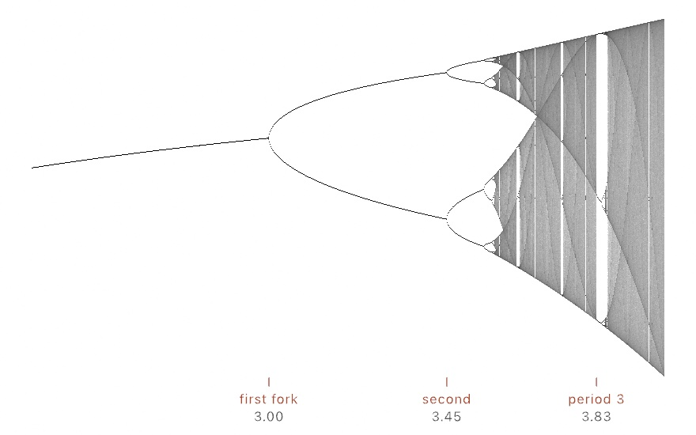

#### <sup>[Ollin](../README.md) → [Guide](README.md) → Chapter 14</sup>

---

# 14. Fields and flow


Most tricks in this guide do one job. This chapter teaches one that keeps working everywhere. It is the **field**, a question you can ask at every point of the canvas and always get an answer. Noise was your first field, a number at every point. Give the answer a *direction* instead and you get flow. Lines comb themselves into currents, particles ride invisible rivers, and the print above draws itself out of one function. The same mental model comes back per-pixel in [Chapter 17](17-YourFirstShader.md) and as sculpting material in [Chapter 20](20-SculptingWithFields.md). What you learn here keeps working long after this chapter.

## An answer at every point

A **flow field** is a direction at every point of the plane. It isn't a grid of stored directions, just a rule. Hand it any point and it hands back an angle. In Ollin a `FlowField` is exactly that, a wrapped function. The easiest way to make a good one is to let noise pick the angles, which is what the `flowField(...)` helper does. Because noise changes smoothly ([Chapter 5](05-Noise.md)'s whole point), nearby points get nearby directions, and the field organizes into weather.

You can't see a function, but you can interview it. Put down a grid of points, ask the field for its direction at each one, and draw a needle. Make `MySketches/Compass.swift`:

```swift
import Ollin

final class Compass: Sketch {
    override func draw() {
        background(Color(hex: 0x101318))
        seed(7)
        let field = flowField(scale: 0.0016, z: time * 0.04)

        stroke(Color(hex: 0xC9D4E0))
        strokeWeight(2.5)
        strokeCap(.round)
        noFill()
        for point in grid(columns: 24, rows: 24, padding: 70).points {
            let dir = field.direction(at: point.position)
            drawLine(point.position - dir * 11, point.position + dir * 11)
        }
        noStroke()
        fill(Color(hex: 0xE8B44A))
        for point in grid(columns: 24, rows: 24, padding: 70).points {
            let dir = field.direction(at: point.position)
            drawCircle(center: point.position + dir * 11, radius: 3)
        }
    }
}
```


`field.angle(p)` is the raw answer in radians, and `field.direction(at: p)` is the same answer as a unit vector, ready for [Chapter 10](10-Vectors.md)'s arithmetic. The `z` argument is the third noise dimension doing its usual job from [Chapter 5](05-Noise.md). Nudge it over time and the whole weather system drifts. Two things are worth noticing before moving on. The needles are only *samples*, and the field has an answer between them too, at every point you could ever ask. The field is also cheap, because nothing is simulated or stored, so asking is all it ever costs.

One habit keeps the sugar honest. `flowField` reads the sketch's seeded noise, so call `seed(...)` first and build the field fresh each frame. You can also trace what you need once and keep the *results*. It's a lens over the noise, not a stored grid.

## Where the field equals something

A `FlowField` answers with a direction. The other kind of field answers with a number, and you already have one. [Chapter 5](05-Noise.md)'s noise hands back a value at every point. Fields like that invite a different question. Instead of asking which way to go, you ask where the field equals some particular value, and the answer is a set of curves.

Those curves are **level curves**, or contours, and you have read thousands of them on maps. A contour line on a map is the set of places at exactly 400 metres. Walking along one is flat, and crossing several quickly means the slope is steep.


```swift
let rings = isolines(at: 0.55, in: frame, resolution: 200) { p in
    fbm(p.x * 0.006, p.y * 0.006, octaves: 4)
}
noFill()
for ring in rings { drawPolyline(ring.points, closed: ring.isClosed) }
```

The method is worth a sentence, because it's unusually easy to picture. Sample the field on a grid, then look at one little square at a time. Note which of its four corners are above the level and which are below. There are only sixteen ways that can come out, and each one tells you exactly how the curve crosses that square. Do that everywhere and stitch the crossings together, and the contours fall out. It's called marching squares. `resolution` is how many cells go across the longer side, so raising it tightens the curves at a proportional cost in samples.

For a map you want many levels, and there's a form for that which matters more than it looks:

```swift
let levels = Array(stride(from: 0.3, through: 0.75, by: 0.045))
for (i, group) in isolines(at: levels, in: frame, field: terrain).enumerated() {
    strokeWeight(i % 5 == 0 ? 2 : 0.8)      // heavy every fifth, like a real map
    for curve in group { drawPolyline(curve.points, closed: curve.isClosed) }
}
```

Passing all the levels at once samples the field a single time and traces them all from that one pass. Since evaluating the field is nearly all of the work, ten levels cost barely more than one. That is the difference between a contour map you can animate and one you can't.

Two details show up the moment you use this. Curves come back **closed** when they close inside your region and **open** when they run off its edge. That is why `drawPolyline` wants `isClosed` rather than guessing. And there's a version that reads a picture instead of a function, `isolines(of: image, at:)`, which treats the image's tone as the field. That's how you get a contour map of a photograph, or clean vector outlines from anything you can draw.

This is also the general answer to "how do I get a real outline out of a field". Metaball silhouettes, the boundary of a simulation, and the nodal lines of the vibrating plate in [Chapter 18](18-Simulations.md) are all one `isolines` call. What comes back is ordinary geometry you can stroke, offset, or send to a plotter.

## Following the flow

The field becomes drawing the moment you stop interviewing it and start obeying it. Put a point down anywhere. Ask the field which way. Take a small step that way. Ask again from where you landed:


The path this walk leaves is a **streamline**. `field.streamline(from: start)` traces one for you with properly small steps. It walks both directions from the start, so your point sits in the middle of the curve rather than at its end. Trace a handful from random starts and you have instant calligraphy. The `stepLength` is the accuracy knob, since big steps cut corners on tight curves, exactly like the exaggerated arrows in the diagram.

## Lines that keep their distance

Streamlines from scattered starts have one flaw as art, which is that nothing stops them from crossing or bunching into ropes. The fix, from scientific visualization, is a single added rule, and the difference is the whole flow-field look:


Pass a `separation` and each line is traced watching all the lines drawn before it. The moment it comes within that distance of any of them, it stops and yields. Lines never cross, density stays even, and the field reads as combed fiber:

```swift
let lines = field.streamlines(from: poissonDisk(radius: 24),
                              stepLength: 6, steps: 140,
                              bounds: bounds, separation: 21)
```

The starts come from `poissonDisk`, [Chapter 13](13-GrowingThings.md)'s well-spread scatter ([Chapter 15](15-ShapesAsMaterial.md) finally opens it up), because evenly spaced lines deserve evenly spread beginnings. Each traced line is an ordinary `[Vector2]`, so everything you know applies. Stroke it, vary its weight, or feed it to an export.

## Particles that ride

A streamline is the whole journey drawn at once. Sometimes you want the journey *lived* instead. Keep a population of particles, and each frame move every one a small step along the field at its own position. That's **advection**, and it's one call:

```swift
particles = field.advected(particles, stepLength: 7)
```


The figure gives each particle a short stored trail ([Chapter 12](12-FlocksAndSwarms.md)'s array trick) and respawns any swimmer that leaves the canvas. It rides `curlField`, a second field builder worth knowing. Curl noise is built so the flow only ever swirls, never piling up or draining away. That keeps a drifting population evenly spread forever. It's the field of choice for smoke, ink, and anything that should feel fluid without simulating fluid.

## Motion found in a formula

Flow fields answer *where to go* from a position. One last family answers it differently. A **chaotic map** is a formula that takes a point and returns the next point. No noise, no canvas, just algebra folding the plane onto itself. Iterate one from any start and the visits trace a ghostly shape called a strange attractor, the formula's own signature. Plot a few million visits as faint additive dots and the shape develops like a photograph:


```swift
let map = ChaoticMap.clifford()          // x' = sin(a·y) + c·cos(a·x), y' = sin(b·x) + d·cos(b·y)
var p = Vector2(0.1, 0.1)
for _ in 0 ..< 30_000 {
    p = map.next(p)
    // scale p (it lives within about ±2) onto the canvas and plot it
}
```

The plates accumulate on a canvas that never clears, with `blendMode(.add)`. Instead of painting over what's below, each faint dot *adds* its light. The places the orbit revisits glow brighter, a first taste of the additive layering [Chapter 16](16-LayersAndEffects.md) develops. Every constant in `clifford(a:b:c:d:)` reshapes the ghost completely. Most values collapse to a dot or explode into static. Part of the craft is collecting constants that sing, and the four plates are four such finds. Three more maps wait in the same family, each with its own temperament. `.gumowskiMira()` wanders a sea of islands into a many-petaled blossom; plot it from the start with no settling, since the long wander *is* the picture. `.ikeda()` folds everything into one layered swirl. `.hopalong()` hops around nested rings that keep widening as it runs. The [attractors reference](../Docs/Drawing/Attractors.md) has all six forms. The 3D members of this family, Lorenz and friends, live in `StrangeAttractor` and wait for [Chapter 19](19-3DGently.md)'s camera. That chapter is also where a million particles ride one at once.

## One dial away from chaos

The maps above have fixed constants. Give a map a single dial instead and you can ask a bigger question. The bigger question is not "what does this formula draw" but "*when* does it fall apart". That's what the one-dimensional `IteratedMap` family is for. Its famous member is the logistic map, `x' = r·x·(1 − x)`, a toy model of a population. `x` is this year's crowding, and `r` is how fast it breeds. Sweep the dial, let the orbit settle at each position, and plot where it landed:

```swift
let map = IteratedMap.logistic()                            // x' = r·x·(1 − x)
let plate = map.bifurcationImage(width: 800, height: 460)   // sweeps r = 2.4...4
```



The picture is the **bifurcation diagram**, and it reads left to right like a story. At low `r` the population settles to one steady value, a single line. At 3 the line forks, and the orbit flips between two values forever. The forks come faster and faster until, just past 3.57, they never stop coming and the orbit never repeats again. Nothing random was added anywhere in this picture. Chaos here is a dial turned too far. The pale slots inside the gray are windows where order briefly returns. The wide one near 3.83 holds the entire diagram again in miniature (sweep `over: 3.82...3.87` and see).

Two companions complete the toolkit. `cobweb(at:steps:)` traces one orbit as the classic staircase between the map's curve and the diagonal. It is the way to *watch* a single dial position think. `lyapunovExponent(at:)` scores one, where negative means settling and positive means chaos. The [`Examples/Patterns/Bifurcation`](../Examples/Patterns/Bifurcation/Sketch.swift) example prints the diagram with the exponent traced beneath it, dipping below zero at every window.

## Putting it together: the print

Everything above compresses into a surprisingly short piece with a long pedigree. It uses evenly spaced streamlines, three ribbon weights, a warm palette, and cream paper. Make `MySketches/FlowPrint.swift`:

```swift
import Ollin

final class FlowPrint: Sketch {
    override func draw() {
        background(Color(hex: 0xF2EDE3))
        seed(12)

        let margin = bounds.inset(by: .all(84))
        let field = flowField(scale: 0.0011, z: 0.4)
        let seeds = poissonDisk(in: margin, radius: 24)
        let lines = field.streamlines(from: seeds, stepLength: 6, steps: 140,
                                      bounds: margin, separation: 21)

        let palette = [Color(hex: 0xC8553D), Color(hex: 0xE3B448), Color(hex: 0x8A9B6E),
                       Color(hex: 0x2E4057), Color(hex: 0x7A9CC6), Color(hex: 0x33312E)]
        let weights = [4.0, 4, 9, 9, 9, 18]

        noFill()
        strokeCap(.round)
        for line in lines where line.count > 3 {
            stroke(randomChoice(palette))
            strokeWeight(randomChoice(weights))
            drawPolyline(line)
        }
    }
}
```

Everything happens in `draw()` with a fixed seed, so the piece is a still that redraws identically every frame. Change the seed and a new print rolls off the press. The `weights` list is a quiet trick from [Chapter 4](04-Randomness.md), where repeating `9` three times makes medium ribbons three times as likely as heavy ones.

Then make it yours:

- Roll seeds until one composes. This is how flow-field artists actually work, in that the field does the drawing and the artist does the choosing.
- Swap `flowField` for `curlField` and the print turns from wind-combed to whirlpooled.
- Give the palette a bias by picking the color from the line's *position*, its first point's `y` mapped into the palette. The print then develops horizons.
- Replace `drawPolyline` with a dot walked along each line every few points, and the ribbons become stitched embroidery.
- Print it for real by adding `--export-svg print.svg` when you run it. Every ribbon exports as a true vector path, and [Chapter 15](15-ShapesAsMaterial.md) goes deeper into plotter territory.

## Where this comes from

Vector fields are old mathematics, since fluid dynamics and electromagnetism both run on them. Creative coding borrowed the flow field as a drawing device, and Processing-era sketches passed the recipe around. The evenly spaced tracing is Bruno Jobard and Wilfrid Lefer's 1997 streamline-placement algorithm from scientific visualization. Curl noise as a graphics tool is Robert Bridson's 2007 formulation. The print at the top tips its hat to Tyler Hobbs, whose flow-field work defined the look for a generation. The best known of that work is *Fidenza* (2021), and the essay "Flow Fields" generously teaches the craft. The Clifford attractor is named for Clifford Pickover, and the de Jong attractor for Peter de Jong. Paul Bourke's long-running fractal pages popularized both. The Gumowski-Mira map came out of particle-beam physics at CERN, and the Ikeda map out of laser optics. Barry Martin's hopalong reached everyone through A. K. Dewdney's *Scientific American* column. Robert May's 1976 *Nature* paper "Simple mathematical models with very complicated dynamics" made the logistic map and its bifurcation diagram famous. The universal rhythm of its forks is Mitchell Feigenbaum's discovery. The same cascade appears in the sine map and in dripping faucets. Marching squares is the two-dimensional version of the marching cubes algorithm. William Lorensen and Harvey Cline published that algorithm in 1987 for medical imaging. A great many of these techniques were born there before artists found them. Full credits are in the project's [attribution notes](../ATTRIBUTION.md).

## Go deeper

- [Flow fields](../Docs/Generators/FlowField.md): the full `FlowField` reference, including advection and the transient-sugar rule.
- [Attractors](../Docs/Drawing/Attractors.md): every built-in system, 2D and 3D, and how to supply your own equations.
- [Chaotic maps & bifurcation](../Docs/Generators/Bifurcation.md): the one-dimensional families, the diagram's dot and density forms, cobwebs, and Lyapunov exponents.
- [Noise](../Docs/Generators/Noise.md): the field the flow is made of.
- [Isolines](../Docs/Generators/Isolines.md): the single-level and stacked-level forms, the image form, resolution, and what open versus closed contours mean.
- [Steering](../Docs/Generators/Steering.md): creatures that *follow* a field instead of riding it ([Chapter 12](12-FlocksAndSwarms.md)'s `follow(_:)`).
- Appendix B draws this chapter's math, one picture per idea: [Fields and following them](B-JustEnoughMath.md#fields-and-following-them).
- Worked examples: [`Examples/Patterns/Streamlines`](../Examples/Patterns/Streamlines/Sketch.swift) (evenly spaced, hue drifting along the flow), [`Examples/Patterns/CliffordAttractor`](../Examples/Patterns/CliffordAttractor/Sketch.swift) (the density bloom, built up live), [`Examples/Patterns/GumowskiMira`](../Examples/Patterns/GumowskiMira/Sketch.swift) (the island-sea blossom, aging from ember to violet), [`Examples/Patterns/Bifurcation`](../Examples/Patterns/Bifurcation/Sketch.swift) (the logistic diagram with its Lyapunov trace, zoomable by knob), and [`Examples/Motion/FlowField`](../Examples/Motion/FlowField/Sketch.swift) (a curl field of drifting needles).

---

[Contents](README.md#contents) · Previous: [Chapter 13, Growing things](13-GrowingThings.md) · Next: [Chapter 15, Shapes as material](15-ShapesAsMaterial.md)
